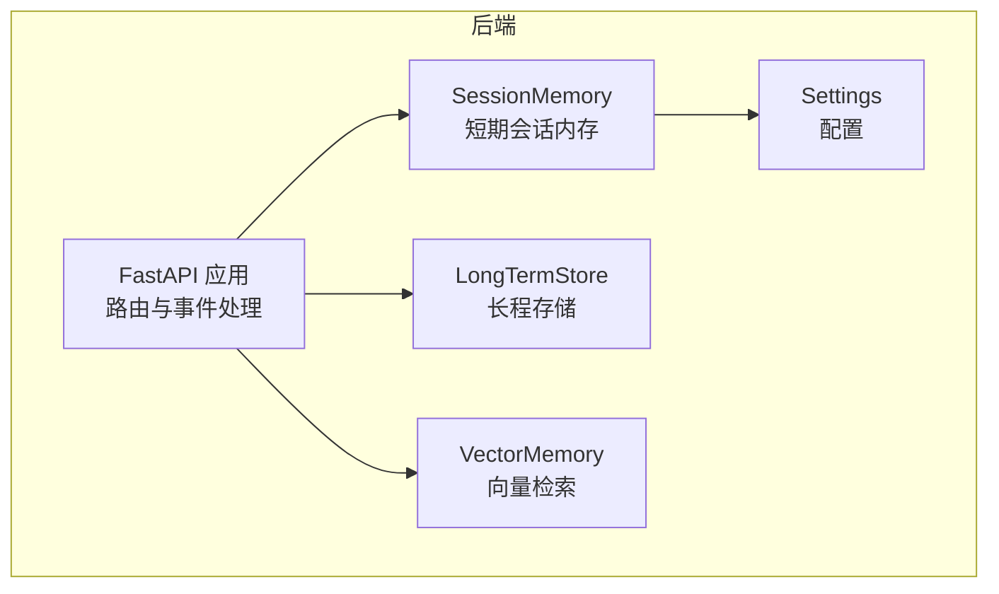
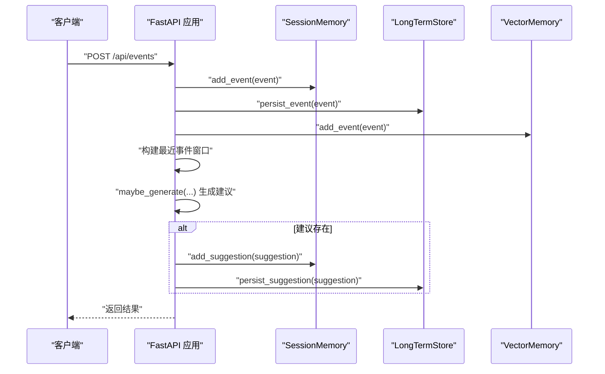
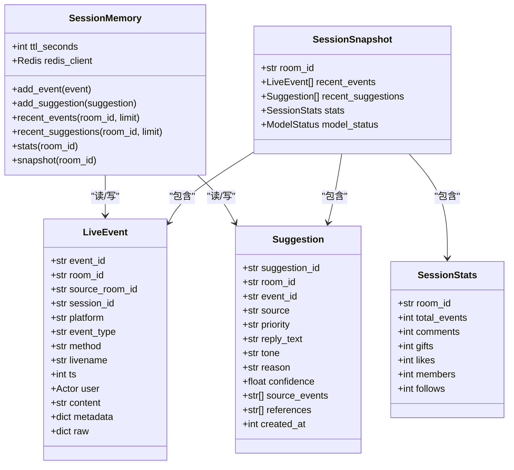
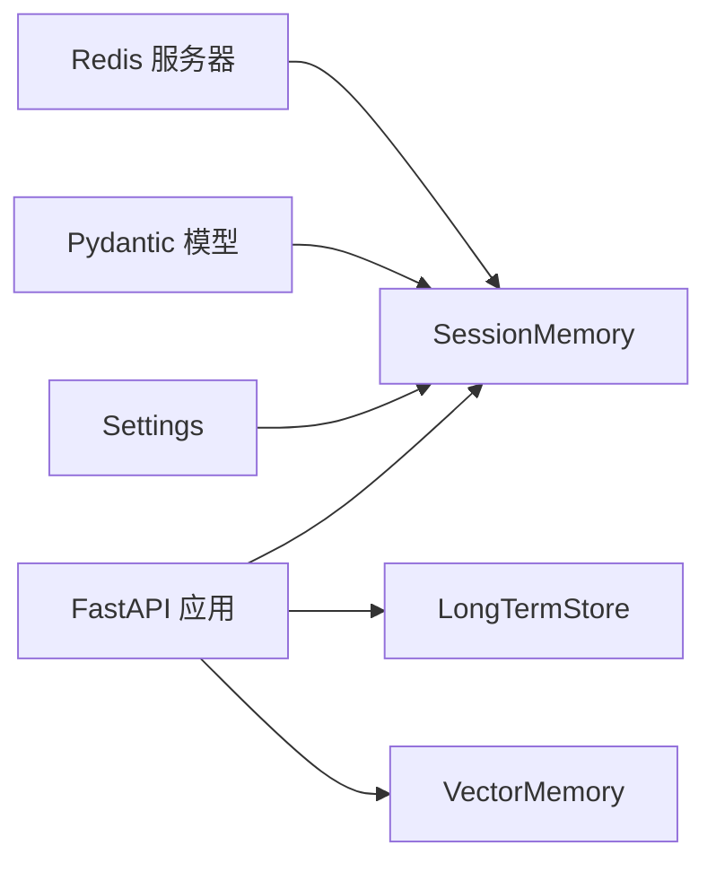
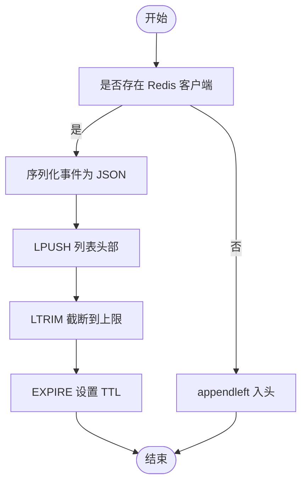
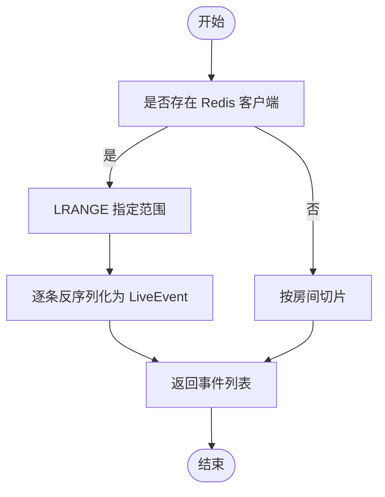

# 短期会话内存

<cite>
**本文引用的文件**
- [session_memory.py](file://backend/memory/session_memory.py)
- [live.py](file://backend/schemas/live.py)
- [config.py](file://backend/config.py)
- [app.py](file://backend/app.py)
- [long_term.py](file://backend/memory/long_term.py)
- [vector_store.py](file://backend/memory/vector_store.py)
</cite>

## 目录
1. [简介](#简介)
2. [项目结构](#项目结构)
3. [核心组件](#核心组件)
4. [架构总览](#架构总览)
5. [详细组件分析](#详细组件分析)
6. [依赖分析](#依赖分析)
7. [性能考量](#性能考量)
8. [故障排查指南](#故障排查指南)
9. [结论](#结论)
10. [附录](#附录)

## 简介
本技术文档聚焦于短期会话内存组件（SessionMemory），系统性阐述其设计理念与实现机制，覆盖以下关键点：
- Redis 与进程内 deque 的自动切换策略
- 事件与建议的存储策略（列表长度限制、TTL 过期、房间隔离）
- add_event 与 add_suggestion 的实现细节（JSON 序列化、列表操作、Redis 命令）
- recent_events 与 recent_suggestions 的查询优化策略
- stats 如何基于短期事件窗口生成轻量统计信息
- snapshot 如何构造房间快照
- 完整使用示例与性能考虑

## 项目结构
短期会话内存位于后端 memory 子模块中，配合配置、长程存储与向量检索共同构成直播场景的记忆体系。

图表来源
- [session_memory.py:17-113](file://backend/memory/session_memory.py#L17-L113)
- [config.py:40-113](file://backend/config.py#L40-L113)
- [app.py:13-36](file://backend/app.py#L13-L36)
- [long_term.py:44-558](file://backend/memory/long_term.py#L44-L558)
- [vector_store.py:59-317](file://backend/memory/vector_store.py#L59-L317)

章节来源
- [session_memory.py:1-113](file://backend/memory/session_memory.py#L1-L113)
- [config.py:1-113](file://backend/config.py#L1-L113)
- [app.py:1-285](file://backend/app.py#L1-L285)

## 核心组件
- SessionMemory：短期会话内存，负责事件与建议的写入、读取、统计与快照生成
- 配置 Settings：提供 Redis 地址与 TTL 等运行参数
- 应用入口：在启动时创建 SessionMemory 实例，并在事件处理流程中调用其方法

章节来源
- [session_memory.py:17-113](file://backend/memory/session_memory.py#L17-L113)
- [config.py:40-113](file://backend/config.py#L40-L113)
- [app.py:27-36](file://backend/app.py#L27-L36)

## 架构总览
短期会话内存作为“热数据”层，优先使用 Redis 以获得跨进程/多实例共享与持久化能力；若未安装 Redis 或未配置地址，则自动降级为进程内双端队列（deque）以保证可用性。应用在事件处理主流程中同时写入短期与长期存储，并通过 SessionMemory 提供的接口进行查询与统计。

图表来源
- [app.py:73-102](file://backend/app.py#L73-L102)
- [session_memory.py:42-64](file://backend/memory/session_memory.py#L42-L64)
- [long_term.py:454-488](file://backend/memory/long_term.py#L454-L488)
- [vector_store.py:149-171](file://backend/memory/vector_store.py#L149-L171)

## 详细组件分析

### 设计理念与自动切换机制
- 自动切换：当存在 Redis 且配置了 redis_url 时，使用 Redis；否则使用进程内 defaultdict(deque(maxlen=...))。该策略确保在开发或单实例环境下无需外部依赖也能正常运行。
- TTL 控制：仅在 Redis 模式下生效，用于控制热数据生命周期，避免无限增长。
- 房间隔离：通过房间 ID 作为键的一部分，天然实现房间级隔离。

章节来源
- [session_memory.py:17-31](file://backend/memory/session_memory.py#L17-L31)
- [config.py:55-56](file://backend/config.py#L55-L56)

### 数据结构与复杂度
- 事件与建议分别维护独立的列表：
  - 事件：最大长度 120
  - 建议：最大长度 40
- 写入操作：
  - Redis：lpush + ltrim + expire，O(1) 列表头部插入，O(k) 截断（k 为上限）
  - 进程内：appendleft + 默认构造器的 O(1) 插入，超出长度自动丢弃尾部
- 读取操作：
  - Redis：lrange 返回指定范围，O(k) 解析 JSON
  - 进程内：切片 + 列表复制，O(k)

章节来源
- [session_memory.py:26-27](file://backend/memory/session_memory.py#L26-L27)
- [session_memory.py:42-64](file://backend/memory/session_memory.py#L42-L64)
- [session_memory.py:66-84](file://backend/memory/session_memory.py#L66-L84)

### 事件存储策略
- 键命名：room:{room_id}:events
- 写入流程：
  - 使用 Pydantic 的 JSON 序列化（model_dump_json）
  - Redis：lpush 入头，ltrim 限制长度，expire 设置 TTL
  - 进程内：appendleft 入头，超出长度自动截断
- 查询流程：
  - Redis：lrange 获取指定范围，逐条反序列化为 LiveEvent
  - 进程内：按房间分组的 deque 切片

章节来源
- [session_memory.py:32-40](file://backend/memory/session_memory.py#L32-L40)
- [session_memory.py:42-52](file://backend/memory/session_memory.py#L42-L52)
- [session_memory.py:66-73](file://backend/memory/session_memory.py#L66-L73)

### 建议存储策略
- 键命名：room:{room_id}:suggestions
- 写入流程：
  - 使用 Pydantic 的 JSON 序列化（model_dump_json）
  - Redis：lpush 入头，ltrim 限制长度，expire 设置 TTL
  - 进程内：appendleft 入头，超出长度自动截断
- 查询流程：
  - Redis：lrange 获取指定范围，逐条反序列化为 Suggestion
  - 进程内：按房间分组的 deque 切片

章节来源
- [session_memory.py:37-40](file://backend/memory/session_memory.py#L37-L40)
- [session_memory.py:54-64](file://backend/memory/session_memory.py#L54-L64)
- [session_memory.py:75-84](file://backend/memory/session_memory.py#L75-L84)

### 统计与快照
- stats：基于最近 120 条事件窗口统计各类事件数量，返回 SessionStats
- snapshot：组合 recent_events、recent_suggestions 与 stats，形成 SessionSnapshot

章节来源
- [session_memory.py:86-102](file://backend/memory/session_memory.py#L86-L102)
- [session_memory.py:104-112](file://backend/memory/session_memory.py#L104-L112)

### 类关系图

图表来源
- [session_memory.py:17-113](file://backend/memory/session_memory.py#L17-L113)
- [live.py:29-111](file://backend/schemas/live.py#L29-L111)

## 依赖分析
- 外部依赖：redis（可选），在导入失败时自动降级
- 内部依赖：Pydantic 模型（LiveEvent、Suggestion、SessionStats、SessionSnapshot）
- 应用集成：FastAPI 启动时创建 SessionMemory 实例；事件处理流程中调用其方法

图表来源
- [session_memory.py:11-14](file://backend/memory/session_memory.py#L11-L14)
- [live.py:29-111](file://backend/schemas/live.py#L29-L111)
- [config.py:55-56](file://backend/config.py#L55-L56)
- [app.py:27-36](file://backend/app.py#L27-L36)

章节来源
- [session_memory.py:11-14](file://backend/memory/session_memory.py#L11-L14)
- [app.py:27-36](file://backend/app.py#L27-L36)

## 性能考量
- Redis 模式优势
  - 跨进程/多实例共享，适合分布式部署
  - 列表截断与过期由 Redis 侧完成，减少应用侧计算
- 进程内模式优势
  - 无需外部依赖，开箱即用
  - 低延迟，适合单实例或开发环境
- 写入路径优化
  - lpush + ltrim + expire 一次性完成写入、截断与过期设置
  - 进程内 appendleft + 自动截断，避免额外内存拷贝
- 读取路径优化
  - Redis lrange 返回指定范围，避免全量传输
  - 进程内切片操作，时间复杂度 O(k)
- 统计与快照
  - stats 仅遍历最近 120 条，空间与时间开销可控
  - snapshot 组合三次读取，建议在前端侧缓存以减少重复请求

章节来源
- [session_memory.py:42-64](file://backend/memory/session_memory.py#L42-L64)
- [session_memory.py:66-84](file://backend/memory/session_memory.py#L66-L84)
- [session_memory.py:86-112](file://backend/memory/session_memory.py#L86-L112)

## 故障排查指南
- 无法连接 Redis
  - 现象：SessionMemory 降级为进程内模式
  - 排查：确认 REDIS_URL 是否正确配置；检查网络连通性
- 写入后读取为空
  - 现象：Redis 模式下读取为空
  - 排查：确认键命名是否一致（room:{room_id}:events/suggestions）；检查 TTL 是否过短导致提前过期
- 事件/建议过多
  - 现象：Redis 模式下被截断
  - 排查：确认列表上限（事件 120、建议 40）是否满足需求
- 统计不准确
  - 现象：stats 结果异常
  - 排查：确认 recent_events 返回的事件数量是否达到 120；检查事件类型字段是否正确

章节来源
- [session_memory.py:29-30](file://backend/memory/session_memory.py#L29-L30)
- [session_memory.py:32-40](file://backend/memory/session_memory.py#L32-L40)
- [session_memory.py:26-27](file://backend/memory/session_memory.py#L26-L27)
- [session_memory.py:89-102](file://backend/memory/session_memory.py#L89-L102)

## 结论
短期会话内存通过 Redis 与进程内模式的自动切换，在可用性与性能之间取得平衡。其简洁的数据结构与明确的房间隔离策略，使得事件与建议的写入、读取、统计与快照生成均具备良好的可维护性与扩展性。结合长程存储与向量检索，整体记忆体系能够高效支撑直播场景的实时交互与智能建议。

## 附录

### 使用示例（概念性）
- 初始化
  - 在应用启动时创建 SessionMemory 实例，传入 redis_url 与 session_ttl_seconds
- 写入事件
  - 调用 add_event(LiveEvent)，事件被写入 Redis 或进程内队列
- 写入建议
  - 调用 add_suggestion(Suggestion)，建议被写入 Redis 或进程内队列
- 读取最近事件
  - 调用 recent_events(room_id, limit)，返回最近 N 条事件
- 读取最近建议
  - 调用 recent_suggestions(room_id, limit)，返回最近 N 条建议
- 统计
  - 调用 stats(room_id)，返回基于最近 120 条事件的轻量统计
- 快照
  - 调用 snapshot(room_id)，返回包含最近事件、建议与统计的快照对象

章节来源
- [app.py:27-36](file://backend/app.py#L27-L36)
- [session_memory.py:42-112](file://backend/memory/session_memory.py#L42-L112)

### 关键流程图：写入事件（Redis 模式）

图表来源
- [session_memory.py:42-52](file://backend/memory/session_memory.py#L42-L52)

### 关键流程图：读取最近事件（Redis 模式）

图表来源
- [session_memory.py:66-73](file://backend/memory/session_memory.py#L66-L73)