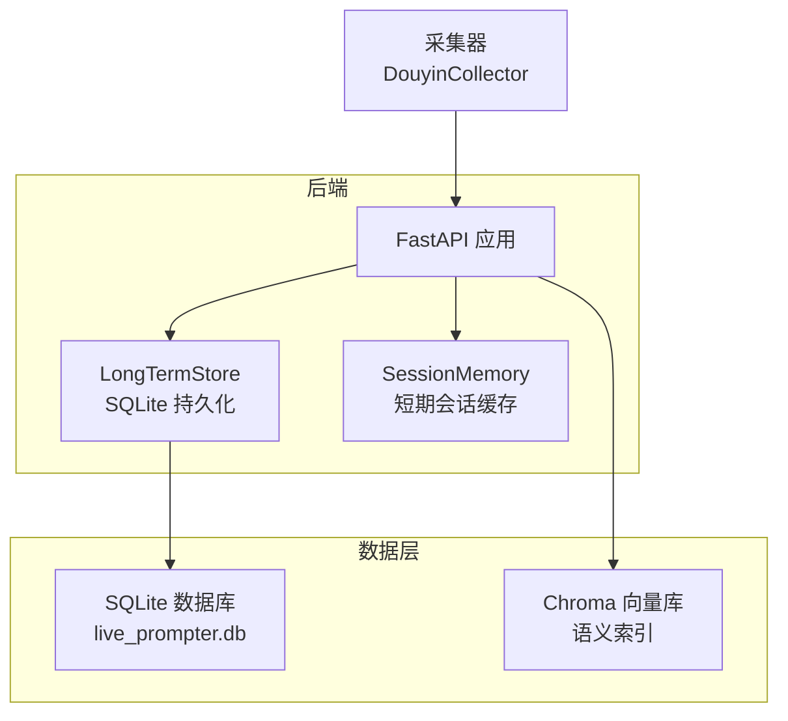
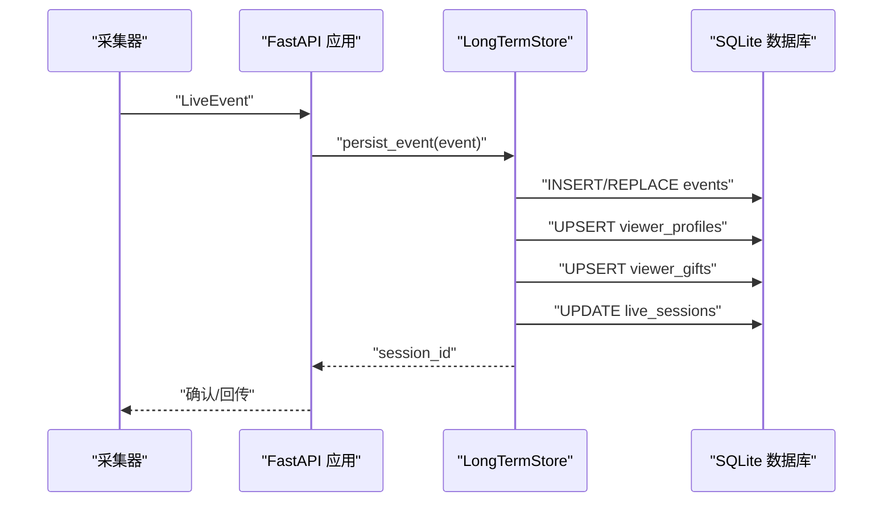
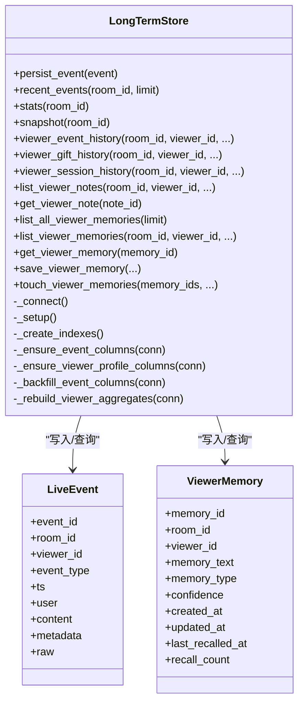

# 长期存储管理

<cite>
**本文引用的文件**
- [long_term.py](file://backend/memory/long_term.py)
- [live.py](file://backend/schemas/live.py)
- [DATABASE.md](file://data/DATABASE.md)
- [test_long_term.py](file://tests/test_long_term.py)
- [README.md](file://README.md)
- [session_memory.py](file://backend/memory/session_memory.py)
</cite>

## 目录
1. [简介](#简介)
2. [项目结构](#项目结构)
3. [核心组件](#核心组件)
4. [架构总览](#架构总览)
5. [详细组件分析](#详细组件分析)
6. [依赖关系分析](#依赖关系分析)
7. [性能考量](#性能考量)
8. [故障排查指南](#故障排查指南)
9. [结论](#结论)
10. [附录](#附录)

## 简介
本文件为 DouYin_llm 项目的长期存储管理组件（LongTermStore）提供全面技术文档，重点围绕 SQLite 数据库的表结构设计、viewer_memories 表的存储策略、数据库连接与事务处理、并发访问控制、CRUD 接口、查询优化、数据迁移与一致性保障等内容进行深入说明，并给出使用示例与最佳实践。

## 项目结构
LongTermStore 位于后端 memory 子模块中，负责将直播事件、观众画像、礼物聚合、直播会话、观众笔记与“观众记忆”（语义记忆）持久化到 SQLite 数据库。其与短期会话内存（SessionMemory）共同构成“短期 + 长期”的混合存储体系。

图表来源
- [README.md:143-149](file://README.md#L143-L149)
- [session_memory.py:17-31](file://backend/memory/session_memory.py#L17-L31)
- [long_term.py:44-47](file://backend/memory/long_term.py#L44-L47)

章节来源
- [README.md:32-44](file://README.md#L32-L44)
- [long_term.py:44-47](file://backend/memory/long_term.py#L44-L47)

## 核心组件
- LongTermStore：SQLite 长期存储核心类，负责建表、索引、事件写入、聚合更新、查询与清理。
- 数据模型：LiveEvent、Suggestion、ViewerMemory、SessionStats、SessionSnapshot 等，用于统一事件与记忆的结构化表示。
- 连接与事务：通过自定义连接工厂与 PRAGMA 设置，确保写入可靠性与并发安全。
- 查询与索引：围绕 room_id、viewer_id、ts 等维度建立索引，提升常见查询性能。

章节来源
- [long_term.py:44-47](file://backend/memory/long_term.py#L44-L47)
- [live.py:29-78](file://backend/schemas/live.py#L29-L78)

## 架构总览
LongTermStore 在应用中的职责与交互如下：

图表来源
- [long_term.py:454-488](file://backend/memory/long_term.py#L454-L488)
- [long_term.py:310-358](file://backend/memory/long_term.py#L310-L358)
- [long_term.py:360-404](file://backend/memory/long_term.py#L360-L404)
- [long_term.py:406-436](file://backend/memory/long_term.py#L406-L436)

## 详细组件分析

### 数据库表结构与数据模型
- events：事件流水表，记录评论、礼物、成员加入、点赞、关注等事件，包含 viewer_id、礼物字段、JSON 元数据与原始消息。
- viewer_profiles：按 (room_id, viewer_id) 聚合的观众画像，包含互动次数、首次/末次出现时间、最近会话、最近评论、最近礼物等。
- viewer_gifts：按 (room_id, viewer_id, gift_name) 聚合礼物历史，包含礼物事件数、累计数量、累计钻石数、首次/末次送礼时间。
- live_sessions：直播会话表，记录活动/已结束会话，包含会话期间各类事件计数。
- viewer_notes：观众备注，支持置顶、作者、创建/更新时间。
- viewer_memories：观众语义记忆，支持记忆文本、类型、置信度、创建/更新/最后一次回忆时间、回忆次数。
- suggestions：基于事件生成的建议，包含优先级、回复文本、语气、原因、置信度。
- app_settings：应用设置项，如 LLM 参数等。

章节来源
- [DATABASE.md:16-151](file://data/DATABASE.md#L16-L151)
- [long_term.py:63-187](file://backend/memory/long_term.py#L63-L187)

### viewer_memories 表的存储策略
- 主键与分区：memory_id 主键；按 room_id、viewer_id 进行查询与聚合。
- 字段含义：
  - memory_text：记忆文本内容
  - memory_type：记忆类型（如 fact）
  - confidence：置信度（0~1）
  - created_at/updated_at：创建与更新时间戳（毫秒）
  - last_recalled_at/recall_count：最后一次回忆时间与回忆次数
  - source_event_id：来源事件 ID（可选）
- 写入策略：
  - 通过 save_viewer_memory 写入，若存在相同 room_id、viewer_id、source_event_id、memory_text 的记录，则复用 existing 记录并更新 updated_at、recall_count 等字段。
  - 若不存在则生成新 memory_id，填充 created_at 与 updated_at。
- 读取策略：
  - list_all_viewer_memories：按 updated_at 降序列出所有记忆，支持 limit。
  - list_viewer_memories：按 updated_at 降序列出某观众的记忆，支持 limit。
  - get_viewer_memory：按 memory_id 获取单条记忆。
  - touch_viewer_memories：批量增加 recall_count 并更新 last_recalled_at。

章节来源
- [long_term.py:162-174](file://backend/memory/long_term.py#L162-L174)
- [long_term.py:693-720](file://backend/memory/long_term.py#L693-L720)
- [long_term.py:722-732](file://backend/memory/long_term.py#L722-L732)
- [long_term.py:734-785](file://backend/memory/long_term.py#L734-L785)
- [long_term.py:787-798](file://backend/memory/long_term.py#L787-L798)

### 数据库连接管理、事务与并发控制
- 连接工厂：使用自定义 sqlite3.Connection 子类 ClosingConnection，在 __exit__ 中确保连接关闭，避免句柄泄漏。
- 连接参数：通过 PRAGMA journal_mode=TRUNCATE 降低写入失败风险（尤其在某些 Windows 挂载盘场景），并设置 row_factory 为 sqlite3.Row 以便字典式访问。
- 事务模型：每个方法内部使用 with self._connect() as connection 自动开启/提交/回滚，保证原子性与一致性。
- 并发控制：SQLite 在单文件模式下通过文件锁实现互斥；LongTermStore 未引入额外锁，建议在应用层面避免同一时间对同一 room_id 的高并发写入，或通过外部队列串行化。

章节来源
- [long_term.py:36-41](file://backend/memory/long_term.py#L36-L41)
- [long_term.py:49-54](file://backend/memory/long_term.py#L49-L54)
- [test_long_term.py:8-25](file://tests/test_long_term.py#L8-L25)

### CRUD 操作接口文档
- 事件写入与会话管理
  - persist_event(event: LiveEvent)：写入事件，自动维护 live_sessions、viewer_profiles、viewer_gifts 聚合。
  - recent_events(room_id, limit)：按时间倒序列出最近事件。
  - stats(room_id)：统计各类事件数量。
  - snapshot(room_id)：组合最近事件、建议与统计。
- 观众画像与历史
  - viewer_event_history(room_id, viewer_id, event_type=None, limit=20)：按时间倒序列出观众事件。
  - viewer_gift_history(room_id, viewer_id, limit=10)：按最近送礼时间倒序列出礼物聚合。
  - viewer_session_history(room_id, viewer_id, limit=10)：按会话聚合统计。
- 观众笔记
  - list_viewer_notes(room_id, viewer_id, limit=20)：按置顶与更新时间倒序列出。
  - get_viewer_note(note_id)：按 ID 获取。
  - save_viewer_note(...)：保存/更新（该方法在文件末尾继续，具体实现请参考源码路径）。
- 观众记忆
  - list_all_viewer_memories(limit)：全量按更新时间倒序。
  - list_viewer_memories(room_id, viewer_id, limit)：按更新时间倒序。
  - get_viewer_memory(memory_id)：按 ID 获取。
  - save_viewer_memory(room_id, viewer_id, memory_text, source_event_id="", memory_type="fact", confidence=0.0)：写入或更新。
  - touch_viewer_memories(memory_ids, recalled_at=None)：批量增加回忆次数与更新时间。

章节来源
- [long_term.py:454-488](file://backend/memory/long_term.py#L454-L488)
- [long_term.py:501-519](file://backend/memory/long_term.py#L501-L519)
- [long_term.py:538-554](file://backend/memory/long_term.py#L538-L554)
- [long_term.py:556-557](file://backend/memory/long_term.py#L556-L557)
- [long_term.py:600-620](file://backend/memory/long_term.py#L600-L620)
- [long_term.py:621-632](file://backend/memory/long_term.py#L621-L632)
- [long_term.py:634-652](file://backend/memory/long_term.py#L634-L652)
- [long_term.py:654-666](file://backend/memory/long_term.py#L654-L666)
- [long_term.py:668-674](file://backend/memory/long_term.py#L668-L674)
- [long_term.py:693-720](file://backend/memory/long_term.py#L693-L720)
- [long_term.py:722-732](file://backend/memory/long_term.py#L722-L732)
- [long_term.py:734-785](file://backend/memory/long_term.py#L734-L785)
- [long_term.py:787-798](file://backend/memory/long_term.py#L787-L798)

### 查询优化策略
- 索引设计
  - idx_events_room_ts：events(room_id, ts DESC)，用于按房间与时间倒序查询。
  - idx_events_room_viewer_ts：events(room_id, viewer_id, ts DESC)，用于按观众与时间倒序查询。
  - idx_events_room_event_type_ts：events(room_id, event_type, ts DESC)，用于按事件类型与时间倒序查询。
  - idx_events_session_id：events(session_id)，用于按会话关联查询。
  - idx_viewer_profiles_room_nickname：viewer_profiles(room_id, nickname)，用于按昵称查找最近出现的观众。
  - idx_viewer_gifts_room_viewer_last_sent：viewer_gifts(room_id, viewer_id, last_sent_at DESC)，用于礼物聚合排序。
  - idx_live_sessions_room_status_last_event：live_sessions(room_id, status, last_event_at DESC)，用于活动会话查询。
  - idx_viewer_notes_room_viewer_updated：viewer_notes(room_id, viewer_id, updated_at DESC)，用于备注排序。
  - idx_viewer_memories_room_viewer_updated：viewer_memories(room_id, viewer_id, updated_at DESC)，用于记忆排序。
- 查询模式
  - 使用 LIMIT 控制结果集规模，避免全表扫描。
  - 使用复合索引覆盖查询条件，减少回表。
  - 对于高频查询（如 recent_events、list_viewer_memories、list_all_viewer_memories），通过索引与 LIMIT 保障性能。

章节来源
- [long_term.py:216-229](file://backend/memory/long_term.py#L216-L229)
- [DATABASE.md:101-150](file://data/DATABASE.md#L101-L150)

### 数据迁移、备份与一致性
- 迁移与演进
  - _ensure_event_columns/_ensure_viewer_profile_columns：动态为 events 与 viewer_profiles 添加缺失列，保证 schema 向后兼容。
  - _backfill_event_columns：对历史事件补充 viewer_id、source_room_id、礼物字段等，确保后续逻辑可用。
  - _rebuild_viewer_aggregates：重建 viewer_profiles 与 viewer_gifts 聚合，用于修复或重算。
- 备份与恢复
  - SQLite 文件即数据库，可直接复制 live_prompter.db 进行备份；生产环境建议在停机或低峰时段进行。
  - 可结合 PRAGMA wal_checkpoint(FULL) 进行 WAL 模式下的强制检查点（如启用 WAL），以减少碎片与提升一致性。
- 一致性保障
  - 每个操作在独立连接中执行，使用 INSERT OR REPLACE/ON CONFLICT UPSERT 保证幂等。
  - 通过 PRAGMA journal_mode=TRUNCATE 降低写入失败概率，提高可靠性。
  - 对于复杂写入（如 persist_event），先写 events，再更新 live_sessions 与聚合表，确保最终一致性。

章节来源
- [long_term.py:188-214](file://backend/memory/long_term.py#L188-L214)
- [long_term.py:279-309](file://backend/memory/long_term.py#L279-L309)
- [long_term.py:438-453](file://backend/memory/long_term.py#L438-L453)
- [long_term.py:51-53](file://backend/memory/long_term.py#L51-L53)

### 使用示例与最佳实践
- 写入事件并获取会话 ID
  - 步骤：构造 LiveEvent，调用 persist_event(event)，读取返回的 session_id。
  - 注意：确保 event_id 唯一，避免重复写入导致的冲突。
- 保存观众记忆
  - 步骤：调用 save_viewer_memory(room_id, viewer_id, memory_text, source_event_id, memory_type, confidence)，根据返回值判断是否成功。
  - 注意：memory_type 建议使用语义明确的分类，confidence 控制在 0~1 区间。
- 查询与展示
  - 使用 recent_events、list_viewer_memories、list_viewer_notes 等接口，结合前端组件进行展示。
  - 对于大量数据的导出或报表，建议分页与限流，避免阻塞数据库。
- 最佳实践
  - 避免在同一房间内高并发写入，必要时引入队列或限流。
  - 定期备份 live_prompter.db，保留多个历史版本。
  - 监控数据库文件大小与磁盘空间，及时清理或归档。
  - 对于频繁查询的字段（如 room_id、viewer_id、ts）保持索引有效。

章节来源
- [long_term.py:454-488](file://backend/memory/long_term.py#L454-L488)
- [long_term.py:734-785](file://backend/memory/long_term.py#L734-L785)
- [README.md:193-197](file://README.md#L193-L197)

## 依赖关系分析

图表来源
- [long_term.py:44-488](file://backend/memory/long_term.py#L44-L488)
- [live.py:29-78](file://backend/schemas/live.py#L29-L78)

章节来源
- [long_term.py:44-488](file://backend/memory/long_term.py#L44-L488)
- [live.py:29-78](file://backend/schemas/live.py#L29-L78)

## 性能考量
- I/O 与索引
  - 为高频查询字段建立复合索引，减少排序与回表开销。
  - 使用 LIMIT 控制查询结果集，避免全表扫描。
- 写入路径
  - persist_event 采用 INSERT OR REPLACE/ON CONFLICT，保证幂等写入。
  - 聚合更新（viewer_profiles、viewer_gifts）在事件写入后立即执行，避免后续查询时的计算压力。
- 并发与锁
  - SQLite 单文件锁天然互斥，建议在应用层串行化同一房间的写入，或引入外部队列。
- WAL 与检查点
  - 可考虑启用 WAL 模式并定期执行 checkpoint，以提升并发读写性能与一致性。

[本节为通用性能建议，不直接分析具体文件]

## 故障排查指南
- 连接与写入失败
  - 症状：写入报错或文件不可写。
  - 处理：确认数据库文件权限与磁盘空间；检查 PRAGMA journal_mode 设置是否生效。
- 事件重复或丢失
  - 症状：重复写入或缺失历史事件。
  - 处理：核对 event_id 唯一性；必要时执行 _backfill_event_columns 与 _rebuild_viewer_aggregates。
- 查询性能下降
  - 症状：recent_events/list_viewer_memories 等查询变慢。
  - 处理：确认索引是否存在且未失效；适当调整 LIMIT；避免在未索引字段上进行过滤。
- 数据不一致
  - 症状：viewer_profiles 与 events 不匹配。
  - 处理：执行 _rebuild_viewer_aggregates 重建聚合；检查 live_sessions 状态。

章节来源
- [long_term.py:51-53](file://backend/memory/long_term.py#L51-L53)
- [long_term.py:279-309](file://backend/memory/long_term.py#L279-L309)
- [long_term.py:438-453](file://backend/memory/long_term.py#L438-L453)

## 结论
LongTermStore 通过 SQLite 提供了稳定可靠的长期存储能力，结合索引与聚合更新策略，满足直播场景下对事件、观众画像、礼物历史、会话统计与语义记忆的持久化需求。通过合理的连接管理、事务模型与迁移机制，系统在功能演进与数据一致性方面具备良好保障。建议在生产环境中配合备份、监控与限流策略，持续优化查询与写入性能。

[本节为总结性内容，不直接分析具体文件]

## 附录
- 数据库位置与文件
  - live_prompter.db：事件、建议、观众记忆、观众笔记、会话记录与应用设置。
- 相关接口与数据流
  - 后端接口速查与数据流说明，请参考 README 中的接口清单与数据流章节。

章节来源
- [README.md:193-197](file://README.md#L193-L197)
- [README.md:151-165](file://README.md#L151-L165)