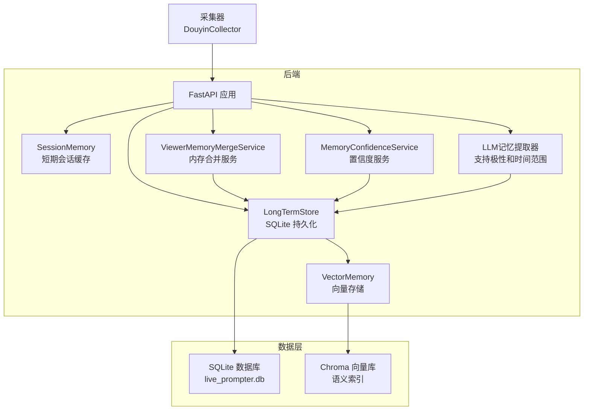
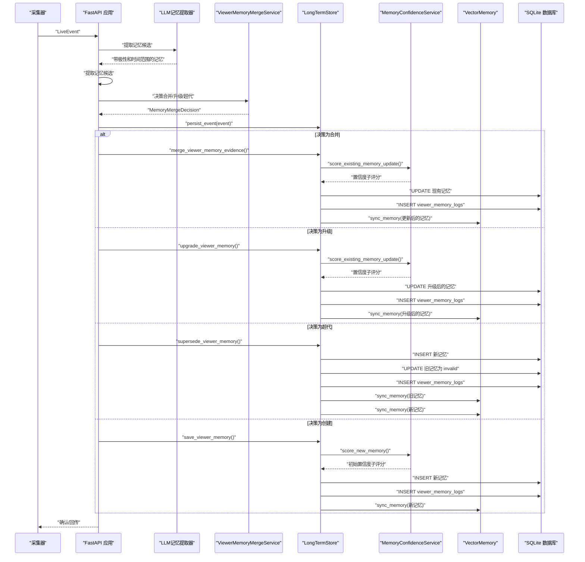
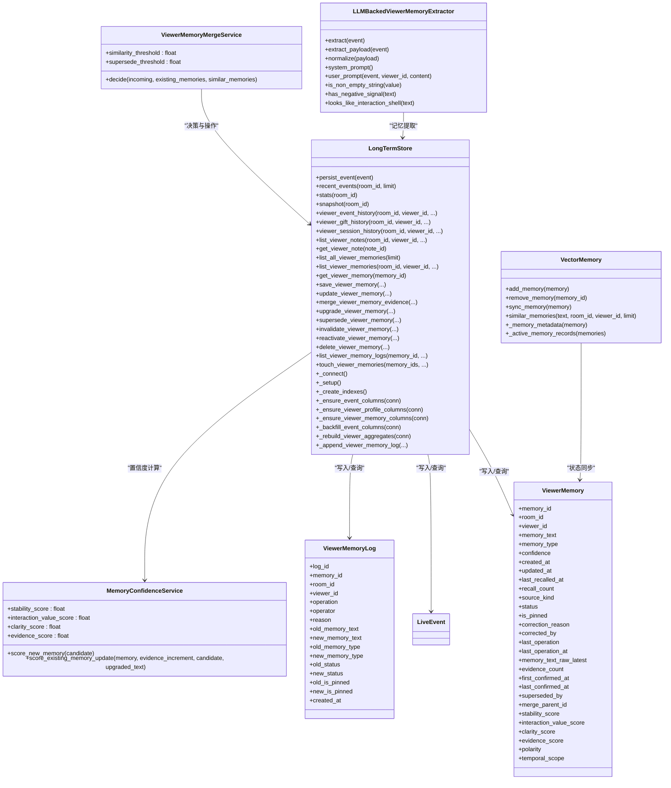

# 长期存储管理

<cite>
**本文引用的文件**
- [long_term.py](file://backend/memory/long_term.py)
- [live.py](file://backend/schemas/live.py)
- [vector_store.py](file://backend/memory/vector_store.py)
- [memory_merge_service.py](file://backend/services/memory_merge_service.py)
- [memory_confidence_service.py](file://backend/services/memory_confidence_service.py)
- [llm_memory_extractor.py](file://backend/services/llm_memory_extractor.py)
- [app.py](file://backend/app.py)
- [test_long_term.py](file://tests/test_long_term.py)
- [test_viewer_memory_api.py](file://tests/test_viewer_memory_api.py)
- [test_vector_store.py](file://tests/test_vector_store.py)
- [test_memory_merge_service.py](file://tests/test_memory_merge_service.py)
- [test_viewer_memory_merge_flow.py](file://tests/test_viewer_memory_merge_flow.py)
- [2026-04-16-viewer-memory-correction.md](file://docs/superpowers/plans/2026-04-16-viewer-memory-correction.md)
- [2026-04-16-viewer-memory-correction-design.md](file://docs/superpowers/specs/2026-04-16-viewer-memory-correction-design.md)
- [2026-04-19-viewer-memory-merge-supersede.md](file://docs/superpowers/plans/2026-04-19-viewer-memory-merge-supersede.md)
- [README.md](file://README.md)
- [session_memory.py](file://backend/memory/session_memory.py)
</cite>

## 更新摘要
**变更内容**
- 新增记忆极性(polarity)和时间范围(temporal_scope)字段，增强长期记忆的分类和检索能力
- 新增置信度子评分字段，支持稳定性、交互价值、清晰度和证据四个维度的置信度评估
- 新增内存合并方法，包括证据合并、升级和超代三种操作模式
- 新增超代机制，通过 `superseded_by` 字段实现记忆的替代和失效管理
- 新增内存合并服务，提供智能的合并决策算法
- 新增置信度服务，计算复杂的置信度评分体系
- 更新向量存储同步机制，支持超代记忆的正确处理

## 目录
1. [简介](#简介)
2. [项目结构](#项目结构)
3. [核心组件](#核心组件)
4. [架构总览](#架构总览)
5. [详细组件分析](#详细组件分析)
6. [依赖关系分析](#依赖关系分析)
7. [性能考量](#性能考量)
8. [故障排查指南](#故障排查指南)
9. [结论](#结论)
10. [附录](#附录)

## 简介
本文件为 DouYin_llm 项目的长期存储管理组件（LongTermStore）提供全面技术文档，重点围绕 SQLite 数据库的表结构设计、viewer_memories 表的存储策略、数据库连接与事务处理、并发访问控制、CRUD 接口、查询优化、数据迁移与一致性保障等内容进行深入说明。**本次更新重点介绍了新增的记忆极性(polarity)和时间范围(temporal_scope)功能，这些新字段显著增强了长期记忆的分类和检索能力，支持情感分析和时间维度的记忆管理**。

## 项目结构
LongTermStore 位于后端 memory 子模块中，负责将直播事件、观众画像、礼物聚合、直播会话、观众笔记与"观众记忆"（语义记忆）持久化到 SQLite 数据库。其与短期会话内存（SessionMemory）共同构成"短期 + 长期"的混合存储体系。

**图表来源**
- [README.md:143-149](file://README.md#L143-L149)
- [session_memory.py:17-31](file://backend/memory/session_memory.py#L17-L31)
- [long_term.py:44-47](file://backend/memory/long_term.py#L44-L47)
- [vector_store.py:59-90](file://backend/memory/vector_store.py#L59-L90)
- [memory_merge_service.py:30-120](file://backend/services/memory_merge_service.py#L30-L120)
- [memory_confidence_service.py:4-118](file://backend/services/memory_confidence_service.py#L4-118)
- [llm_memory_extractor.py:40-81](file://backend/services/llm_memory_extractor.py#L40-L81)

**章节来源**
- [README.md:32-44](file://README.md#L32-L44)
- [long_term.py:44-47](file://backend/memory/long_term.py#L44-L47)

## 核心组件
- **LongTermStore**：SQLite 长期存储核心类，负责建表、索引、事件写入、聚合更新、查询与清理，**现已支持记忆极性(polarity)和时间范围(temporal_scope)字段**。
- **ViewerMemoryMergeService**：内存合并决策服务，提供智能的合并、升级和超代决策算法。
- **MemoryConfidenceService**：置信度计算服务，支持稳定性、交互价值、清晰度和证据四个维度的置信度评估。
- **VectorMemory**：向量存储组件，负责语义记忆的向量化存储与检索，**现已支持超代记忆的正确处理**。
- **LLMBackedViewerMemoryExtractor**：LLM记忆提取器，支持记忆极性(polarity)和时间范围(temporal_scope)的抽取和验证。
- **数据模型**：LiveEvent、Suggestion、ViewerMemory、ViewerMemoryLog、SessionStats、SessionSnapshot 等，**新增polarity和temporal_scope字段**。
- **连接与事务**：通过自定义连接工厂与 PRAGMA 设置，确保写入可靠性与并发安全。
- **查询与索引**：围绕 room_id、viewer_id、ts 等维度建立索引，提升常见查询性能。

**章节来源**
- [long_term.py:44-47](file://backend/memory/long_term.py#L44-L47)
- [live.py:65-107](file://backend/schemas/live.py#L65-L107)
- [vector_store.py:59-90](file://backend/memory/vector_store.py#L59-L90)
- [memory_merge_service.py:30-120](file://backend/services/memory_merge_service.py#L30-L120)
- [memory_confidence_service.py:4-118](file://backend/services/memory_confidence_service.py#L4-118)
- [llm_memory_extractor.py:11-17](file://backend/services/llm_memory_extractor.py#L11-L17)

## 架构总览
LongTermStore 在应用中的职责与交互如下：

**图表来源**
- [long_term.py:1102-1301](file://backend/memory/long_term.py#L1102-L1301)
- [memory_merge_service.py:82-120](file://backend/services/memory_merge_service.py#L82-L120)
- [memory_confidence_service.py:85-118](file://backend/services/memory_confidence_service.py#L85-L118)
- [vector_store.py:314-318](file://backend/memory/vector_store.py#L314-L318)
- [app.py:362-387](file://backend/app.py#L362-L387)

## 详细组件分析

### 数据库表结构与数据模型
- **events**：事件流水表，记录评论、礼物、成员加入、点赞、关注等事件，包含 viewer_id、礼物字段、JSON 元数据与原始消息。
- **viewer_profiles**：按 (room_id, viewer_id) 聚合的观众画像，包含互动次数、首次/末次出现时间、最近会话、最近评论、最近礼物等。
- **viewer_gifts**：按 (room_id, viewer_id, gift_name) 聚合礼物历史，包含礼物事件数、累计数量、累计钻石数、首次/末次送礼时间。
- **live_sessions**：直播会话表，记录活动/已结束会话，包含会话期间各类事件计数。
- **viewer_notes**：观众备注，支持置顶、作者、创建/更新时间。
- **viewer_memories**：**新增** 观众语义记忆，支持记忆文本、类型、置信度、创建/更新/最后一次回忆时间、回忆次数、**状态管理、来源区分、纠正记录、置信度子评分、证据计数、超代关系、极性分类、时间范围**。
- **viewer_memory_logs**：**新增** 观众记忆操作日志表，记录所有记忆变更的历史。
- **suggestions**：基于事件生成的建议，包含优先级、回复文本、语气、原因、置信度。
- **app_settings**：应用设置项，如 LLM 参数等。

**章节来源**
- [long_term.py:162-200](file://backend/memory/long_term.py#L162-L200)
- [live.py:65-107](file://backend/schemas/live.py#L65-L107)

### viewer_memories 表的存储策略
- **主键与分区**：memory_id 主键；按 room_id、viewer_id 进行查询与聚合。
- **字段含义**：
  - memory_text：记忆文本内容
  - memory_type：记忆类型（如 fact）
  - **新增字段**：
    - polarity：记忆极性（positive/negative/neutral，默认 neutral）
    - temporal_scope：时间范围（long_term/short_term，默认 long_term）
  - confidence：置信度（0~1）
  - created_at/updated_at：创建与更新时间戳（毫秒）
  - last_recalled_at/recall_count：最后一次回忆时间与回忆次数
  - source_event_id：来源事件 ID（可选）
  - **其他字段**：与置信度子评分、状态管理、来源区分、纠正记录、证据计数、超代关系相关的字段。
- **写入策略**：
  - 通过 save_viewer_memory 写入，若存在相同 room_id、viewer_id、source_event_id、memory_text 的记录，则复用 existing 记录并更新 updated_at、recall_count 等字段。
  - 若不存在则生成新 memory_id，填充 created_at 与 updated_at。
  - **自动添加状态管理字段**：source_kind、status、is_pinned、correction_reason、corrected_by、last_operation、last_operation_at。
  - **自动添加置信度子评分字段**：stability_score、interaction_value_score、clarity_score、evidence_score。
  - **自动添加证据计数字段**：evidence_count、first_confirmed_at、last_confirmed_at。
  - **自动添加超代关系字段**：superseded_by、merge_parent_id。
- **读取策略**：
  - list_all_viewer_memories：按 updated_at 降序列出所有记忆，支持 limit，**自动过滤 deleted 状态**。
  - list_viewer_memories：按 updated_at 降序列出某观众的记忆，支持 limit，**自动过滤 deleted 状态**，**优先显示置顶记忆**。
  - get_viewer_memory：按 memory_id 获取单条记忆。
  - touch_viewer_memories：批量增加 recall_count 并更新 last_recalled_at。

**章节来源**
- [long_term.py:162-195](file://backend/memory/long_term.py#L162-L195)
- [long_term.py:743-791](file://backend/memory/long_term.py#L743-L791)
- [long_term.py:839-931](file://backend/memory/long_term.py#L839-L931)

### 记忆极性(polarity)和时间范围(temporal_scope)功能
- **极性分类（polarity）**：
  - **positive**：积极情感，如"喜欢"、"爱吃"、"爱喝"等表达
  - **negative**：消极情感，如"不喜欢"、"不能吃"、"忌口"等表达  
  - **neutral**：中性情感，如事实陈述、背景信息等
  - **默认值**：neutral，确保新记忆的极性分类准确性
- **时间范围（temporal_scope）**：
  - **long_term**：长期稳定的记忆，适合跨会话复用
  - **short_term**：短期临时的记忆，不适合长期存储
  - **默认值**：long_term，确保记忆的长期有效性
- **应用场景**：
  - 食品偏好：积极情感的饮食偏好标记为 positive，消极情感的忌口标记为 negative
  - 生活背景：中性情感的居住、工作背景标记为 neutral
  - 时间敏感信息：明确时间边界的信息标记为 short_term，避免长期存储

**章节来源**
- [long_term.py:172-174](file://backend/memory/long_term.py#L172-L174)
- [long_term.py:275-276](file://backend/memory/long_term.py#L275-L276)
- [live.py:74-75](file://backend/schemas/live.py#L74-L75)
- [llm_memory_extractor.py:124-126](file://backend/services/llm_memory_extractor.py#L124-L126)

### LLM记忆提取器的极性与时间范围处理
- **系统提示**：LLM记忆提取器在系统提示中明确规定了极性和时间范围的抽取规则
- **极性验证**：提取的极性必须在允许集合{positive, negative, neutral}中
- **时间范围验证**：时间范围必须为long_term或short_term，且默认情况下只接受long_term
- **情感信号检测**：对于negative极性的记忆，系统会检测文本中的负面情感信号词
- **抽取流程**：从LLM响应中提取polarity和temporal_scope字段，进行合法性验证

**章节来源**
- [llm_memory_extractor.py:40-81](file://backend/services/llm_memory_extractor.py#L40-L81)
- [llm_memory_extractor.py:124-133](file://backend/services/llm_memory_extractor.py#L124-L133)
- [llm_memory_extractor.py:155-167](file://backend/services/llm_memory_extractor.py#L155-L167)

### 置信度子评分系统
- **稳定性评分（stability_score）**：衡量记忆的长期稳定性，长时记忆获得更高分数，短期提示（如"今天"、"今晚"）会降低分数。
- **交互价值评分（interaction_value_score）**：衡量记忆对互动的价值，包含敏感信息（如"不能吃"、"忌口"、"喜欢"、"职业"）的词汇会提高分数。
- **清晰度评分（clarity_score）**：衡量记忆表达的清晰程度，4-16字符长度的表达更清晰，包含疑问词会降低分数。
- **证据评分（evidence_score）**：基于证据计数和最后确认时间计算，证据越多分数越高。
- **置信度合成**：综合四个子评分，权重分别为35%、35%、15%、15%，形成最终的 confidence 分数。

**章节来源**
- [long_term.py:1102-1227](file://backend/memory/long_term.py#L1102-L1227)
- [memory_confidence_service.py:17-118](file://backend/services/memory_confidence_service.py#L17-L118)

### 内存合并方法
- **证据合并（merge_viewer_memory_evidence）**：将新的证据（raw_memory_text）合并到现有记忆中，增加 evidence_count，更新最后确认时间。
- **记忆升级（upgrade_viewer_memory）**：将现有记忆升级为更具体的表达，如从"喜欢拉面"升级为"喜欢豚骨拉面"。
- **超代（supersede_viewer_memory）**：用新的记忆替代旧的记忆，适用于冲突方向的记忆，如从"喜欢吃辣"超代为"不太能吃辣"。
- **智能决策**：通过 ViewerMemoryMergeService 提供的决策算法选择合适的操作。

**章节来源**
- [long_term.py:1102-1301](file://backend/memory/long_term.py#L1102-L1301)
- [memory_merge_service.py:82-120](file://backend/services/memory_merge_service.py#L82-L120)

### 超代机制
- **超代触发条件**：
  - 冲突方向的记忆：新记忆表达与旧记忆相反（如"喜欢" vs "不太能吃"）
  - 更具体的表达：新记忆比旧记忆更具体
  - 相似度阈值：基于向量相似度判断记忆的相似程度
- **超代过程**：
  - 创建新记忆作为替代
  - 将旧记忆标记为 invalid
  - 记录 superseded_by 关系
  - 更新操作日志
- **向量存储同步**：超代后的旧记忆从向量存储中移除，新记忆被添加到向量存储中。

**章节来源**
- [long_term.py:1229-1301](file://backend/memory/long_term.py#L1229-L1301)
- [vector_store.py:124-152](file://backend/memory/vector_store.py#L124-L152)

### 内存合并服务
- **决策算法**：
  1. **完全匹配**：规范化后的记忆文本完全相同，执行合并操作
  2. **升级判断**：相似度达到阈值且新记忆更具体，执行升级操作
  3. **超代判断**：相似度达到阈值且存在冲突方向，执行超代操作
  4. **创建操作**：无合适操作，创建新记忆
- **相似度阈值**：相似度阈值为0.88，超代阈值为0.82。
- **冲突检测**：检测负面信号词汇（如"不喜欢"、"不能"、"不吃"、"不喝"、"忌口"、"接受不了"）和正面信号词汇（如"喜欢"、"爱吃"、"爱喝"、"常吃"、"常喝"）。

**章节来源**
- [memory_merge_service.py:30-120](file://backend/services/memory_merge_service.py#L30-L120)

### 观众记忆状态管理与操作日志
- **状态管理**：
  - **active**：活跃状态，参与语义回忆与向量存储同步
  - **invalid**：无效状态，不再参与回忆，但仍保留在数据库中
  - **deleted**：删除状态，从所有查询中过滤，从向量存储中移除
- **来源区分**：
  - **auto**：自动抽取的记忆，通常来自直播事件分析
  - **manual**：手动添加的记忆，通常由主播或管理员添加
- **操作日志**：
  - **viewer_memory_logs** 表记录所有记忆变更操作
  - 记录字段：operation（操作类型）、operator（操作者）、reason（原因）、old/new 值对比
  - 支持 list_viewer_memory_logs(memory_id, limit) 查询操作历史

**章节来源**
- [long_term.py:839-1073](file://backend/memory/long_term.py#L839-L1073)
- [vector_store.py:124-152](file://backend/memory/vector_store.py#L124-L152)

### 向量存储同步机制
- **状态同步**：
  - add_memory：当记忆状态为 active 时才添加到向量存储
  - remove_memory：当记忆状态非 active 时从向量存储中移除
  - sync_memory：统一同步接口，根据状态决定添加或移除
- **来源区分排序**：
  - 手动添加的记忆（source_kind="manual"）在相似度相近时优先
  - 置顶记忆（is_pinned=true）在相似度相近时优先
- **元数据存储**：
  - 将 status、source_kind、is_pinned 等状态信息存储在向量元数据中
  - 支持向量查询时的条件过滤
- **超代处理**：
  - 超代后的旧记忆自动从向量存储中移除
  - 新记忆自动添加到向量存储中
- **注意**：当前向量存储实现中未使用polarity和temporal_scope字段，仅使用基础元数据字段。

**章节来源**
- [vector_store.py:124-152](file://backend/memory/vector_store.py#L124-L152)
- [vector_store.py:283-318](file://backend/memory/vector_store.py#L283-L318)
- [vector_store.py:320-387](file://backend/memory/vector_store.py#L320-L387)

### 数据库连接管理、事务与并发控制
- **连接工厂**：使用自定义 sqlite3.Connection 子类 ClosingConnection，在 __exit__ 中确保连接关闭，避免句柄泄漏。
- **连接参数**：通过 PRAGMA journal_mode=TRUNCATE 降低写入失败风险（尤其在某些 Windows 挂载盘场景），并设置 row_factory 为 sqlite3.Row 以便字典式访问。
- **事务模型**：每个方法内部使用 with self._connect() as connection 自动开启/提交/回滚，保证原子性与一致性。
- **并发控制**：SQLite 在单文件模式下通过文件锁实现互斥；LongTermStore 未引入额外锁，建议在应用层面避免同一时间对同一 room_id 的高并发写入，或通过外部队列串行化。

**章节来源**
- [long_term.py:36-54](file://backend/memory/long_term.py#L36-L54)
- [test_long_term.py:8-25](file://tests/test_long_term.py#L8-L25)

### CRUD 操作接口文档
- **事件写入与会话管理**
  - persist_event(event: LiveEvent)：写入事件，自动维护 live_sessions、viewer_profiles、viewer_gifts 聚合。
  - recent_events(room_id, limit)：按时间倒序列出最近事件。
  - stats(room_id)：统计各类事件数量。
  - snapshot(room_id)：组合最近事件、建议与统计。
- **观众画像与历史**
  - viewer_event_history(room_id, viewer_id, event_type=None, limit=20)：按时间倒序列出观众事件。
  - viewer_gift_history(room_id, viewer_id, limit=10)：按最近送礼时间倒序列出礼物聚合。
  - viewer_session_history(room_id, viewer_id, limit=10)：按会话聚合统计。
- **观众笔记**
  - list_viewer_notes(room_id, viewer_id, limit=20)：按置顶与更新时间倒序列出。
  - get_viewer_note(note_id)：按 ID 获取。
  - save_viewer_note(...)：保存/更新（该方法在文件末尾继续，具体实现请参考源码路径）。
- **观众记忆（新增）**
  - **save_viewer_memory**：保存或更新记忆，支持状态管理与来源区分，**新增polarity和temporal_scope参数**
  - **update_viewer_memory**：编辑现有记忆内容
  - **merge_viewer_memory_evidence**：合并新的证据到现有记忆
  - **upgrade_viewer_memory**：升级现有记忆为更具体的表达
  - **supersede_viewer_memory**：用新记忆超代旧记忆
  - **invalidate_viewer_memory**：将记忆标记为无效
  - **reactivate_viewer_memory**：重新激活无效记忆
  - **delete_viewer_memory**：删除记忆（从数据库中移除）
  - **list_all_viewer_memories**：全量按更新时间倒序，过滤 deleted 状态
  - **list_viewer_memories**：按更新时间倒序，过滤 deleted 状态，优先显示置顶
  - **get_viewer_memory**：按 ID 获取记忆
  - **list_viewer_memory_logs**：获取记忆操作历史
  - **touch_viewer_memories**：批量增加回忆次数与更新时间。

**章节来源**
- [long_term.py:497-531](file://backend/memory/long_term.py#L497-L531)
- [long_term.py:743-791](file://backend/memory/long_term.py#L743-L791)
- [long_term.py:839-1301](file://backend/memory/long_term.py#L839-L1301)

### 查询优化策略
- **索引设计**
  - idx_events_room_ts：events(room_id, ts DESC)，用于按房间与时间倒序查询。
  - idx_events_room_viewer_ts：events(room_id, viewer_id, ts DESC)，用于按观众与时间倒序查询。
  - idx_events_room_event_type_ts：events(room_id, event_type, ts DESC)，用于按事件类型与时间倒序查询。
  - idx_events_session_id：events(session_id)，用于按会话关联查询。
  - idx_viewer_profiles_room_nickname：viewer_profiles(room_id, nickname)，用于按昵称查找最近出现的观众。
  - idx_viewer_gifts_room_viewer_last_sent：viewer_gifts(room_id, viewer_id, last_sent_at DESC)，用于礼物聚合排序。
  - idx_live_sessions_room_status_last_event：live_sessions(room_id, status, last_event_at DESC)，用于活动会话查询。
  - idx_viewer_notes_room_viewer_updated：viewer_notes(room_id, viewer_id, updated_at DESC)，用于备注排序。
  - idx_viewer_memories_room_viewer_updated：viewer_memories(room_id, viewer_id, updated_at DESC)，用于记忆排序。
  - **新增索引**：idx_viewer_memory_logs_memory_created：viewer_memory_logs(memory_id, created_at DESC)，用于日志查询。
- **查询模式**
  - 使用 LIMIT 控制结果集规模，避免全表扫描。
  - 使用复合索引覆盖查询条件，减少回表。
  - 对于高频查询（如 recent_events、list_viewer_memories、list_all_viewer_memories），通过索引与 LIMIT 保障性能。
  - **状态过滤**：默认过滤 deleted 状态的记忆，减少不必要的数据传输。
  - **超代过滤**：在向量查询中自动过滤 superseded_by 非空的记忆。

**章节来源**
- [long_term.py:258-272](file://backend/memory/long_term.py#L258-L272)
- [long_term.py:1058-1073](file://backend/memory/long_term.py#L1058-L1073)

### 数据迁移、备份与一致性
- **迁移与演进**
  - _ensure_event_columns/_ensure_viewer_profile_columns：动态为 events 与 viewer_profiles 添加缺失列，保证 schema 向后兼容。
  - _ensure_viewer_memory_columns：**新增** 动态为 viewer_memories 添加状态管理相关列（source_kind、status、is_pinned、correction_reason、corrected_by、last_operation、last_operation_at）。
  - **新增迁移**：_ensure_viewer_memory_columns 还添加了置信度子评分字段（stability_score、interaction_value_score、clarity_score、evidence_score）、证据计数字段（evidence_count、first_confirmed_at、last_confirmed_at）和超代关系字段（superseded_by、merge_parent_id）。
  - **新增迁移**：_ensure_viewer_memory_columns 添加了极性字段（polarity，默认值为"neutral"）和时间范围字段（temporal_scope，默认值为"long_term"）。
  - _backfill_event_columns：对历史事件补充 viewer_id、source_room_id、礼物字段等，确保后续逻辑可用。
  - _rebuild_viewer_aggregates：重建 viewer_profiles 与 viewer_gifts 聚合，用于修复或重算。
- **备份与恢复**
  - SQLite 文件即数据库，可直接复制 live_prompter.db 进行备份；生产环境建议在停机或低峰时段进行。
  - 可结合 PRAGMA wal_checkpoint(FULL) 进行 WAL 模式下的强制检查点（如启用 WAL），以减少碎片与提升一致性。
- **一致性保障**
  - 每个操作在独立连接中执行，使用 INSERT OR REPLACE/ON CONFLICT UPSERT 保证幂等。
  - 通过 PRAGMA journal_mode=TRUNCATE 降低写入失败概率，提高可靠性。
  - 对于复杂写入（如 persist_event），先写 events，再更新 live_sessions 与聚合表，确保最终一致性。
  - **状态一致性**：向量存储与数据库状态保持同步，确保语义回忆的准确性。
  - **超代一致性**：超代操作保证旧记忆和新记忆的状态一致性。

**章节来源**
- [long_term.py:243-256](file://backend/memory/long_term.py#L243-L256)
- [long_term.py:438-453](file://backend/memory/long_term.py#L438-L453)

### 使用示例与最佳实践
- **写入事件并获取会话 ID**
  - 步骤：构造 LiveEvent，调用 persist_event(event)，读取返回的 session_id。
  - 注意：确保 event_id 唯一，避免重复写入导致的冲突。
- **保存观众记忆（新增）**
  - 步骤：调用 save_viewer_memory(room_id, viewer_id, memory_text, source_event_id, memory_type, confidence, source_kind="manual", status="active", is_pinned=True, correction_reason="主播补充", corrected_by="主播", operation="created", polarity="positive", temporal_scope="long_term")。
  - 注意：memory_type 建议使用语义明确的分类，confidence 控制在 0~1 区间。
  - **极性分类**：积极偏好使用 polarity="positive"，消极偏好使用 polarity="negative"，中性事实使用 polarity="neutral"。
  - **时间范围**：长期稳定的记忆使用 temporal_scope="long_term"，短期临时信息使用 temporal_scope="short_term"。
  - **状态管理**：手动添加的记忆建议使用 source_kind="manual"，置顶记忆使用 is_pinned=True。
- **证据合并（新增）**
  - 步骤：调用 merge_viewer_memory_evidence(memory_id, raw_memory_text="新的证据内容", confidence=0.85, source_event_id="evt-123")。
  - 注意：此操作会增加 evidence_count，更新最后确认时间，提高记忆的置信度。
- **记忆升级（新增）**
  - 步骤：调用 upgrade_viewer_memory(memory_id, memory_text="更具体的表达", raw_memory_text="原始文本", confidence=0.92)。
  - 注意：升级操作会创建更具体的记忆表达，同时更新置信度子评分。
- **超代操作（新增）**
  - 步骤：调用 supersede_viewer_memory(old_memory_id, room_id, viewer_id, memory_text="新的替代记忆", raw_memory_text="原始文本", source_event_id="evt-456", memory_type="preference", confidence=0.88)。
  - 注意：超代操作会将旧记忆标记为 invalid，并建立 superseded_by 关系。
- **编辑与管理记忆**
  - 使用 update_viewer_memory 编辑现有记忆
  - 使用 invalidate_viewer_memory 将记忆标记为无效
  - 使用 reactivate_viewer_memory 重新激活无效记忆
  - 使用 delete_viewer_memory 删除记忆
- **查询与展示**
  - 使用 recent_events、list_viewer_memories、list_viewer_notes 等接口，结合前端组件进行展示。
  - 对于大量数据的导出或报表，建议分页与限流，避免阻塞数据库。
  - **状态过滤**：list_viewer_memories 默认过滤 deleted 状态的记忆。
- **最佳实践**
  - 避免在同一房间内高并发写入，必要时引入队列或限流。
  - 定期备份 live_prompter.db，保留多个历史版本。
  - 监控数据库文件大小与磁盘空间，及时清理或归档。
  - 对于频繁查询的字段（如 room_id、viewer_id、ts）保持索引有效。
  - **状态管理**：合理使用状态字段，避免误用 deleted 状态导致数据丢失。
  - **来源区分**：手动添加的记忆应明确标注 source_kind="manual"，便于后续管理。
  - **置信度管理**：定期检查记忆的置信度子评分，确保记忆质量。
  - **超代策略**：谨慎使用超代功能，确保冲突方向的记忆确实需要替代。
  - **极性分类**：正确使用极性字段，积极偏好、消极偏好和中性事实应分别标记。
  - **时间范围**：严格区分长期和短期记忆，避免将短期信息存储为长期记忆。

**章节来源**
- [long_term.py:1102-1301](file://backend/memory/long_term.py#L1102-L1301)
- [README.md:193-197](file://README.md#L193-L197)

## 依赖关系分析

**图表来源**
- [long_term.py:44-1301](file://backend/memory/long_term.py#L44-L1301)
- [live.py:65-107](file://backend/schemas/live.py#L65-L107)
- [vector_store.py:59-387](file://backend/memory/vector_store.py#L59-L387)
- [memory_merge_service.py:30-120](file://backend/services/memory_merge_service.py#L30-L120)
- [memory_confidence_service.py:4-118](file://backend/services/memory_confidence_service.py#L4-118)
- [llm_memory_extractor.py:94-208](file://backend/services/llm_memory_extractor.py#L94-L208)

**章节来源**
- [long_term.py:44-1301](file://backend/memory/long_term.py#L44-L1301)
- [live.py:65-107](file://backend/schemas/live.py#L65-L107)
- [vector_store.py:59-387](file://backend/memory/vector_store.py#L59-L387)

## 性能考量
- **I/O 与索引**
  - 为高频查询字段建立复合索引，减少排序与回表开销。
  - 使用 LIMIT 控制查询结果集，避免全表扫描。
  - **新增索引**：viewer_memory_logs 表的索引优化日志查询性能。
  - **超代索引**：在向量查询中自动过滤 superseded_by 非空的记忆，减少无效召回。
- **写入路径**
  - persist_event 采用 INSERT OR REPLACE/ON CONFLICT，保证幂等写入。
  - 聚合更新（viewer_profiles、viewer_gifts）在事件写入后立即执行，避免后续查询时的计算压力。
  - **状态同步**：向量存储同步采用异步方式，避免阻塞主流程。
  - **置信度计算**：置信度子评分计算在内存中完成，避免数据库查询开销。
  - **极性处理**：极性字段的验证在LLM提取阶段完成，减少数据库层的处理开销。
- **并发与锁**
  - SQLite 单文件锁天然互斥，建议在应用层串行化同一房间的写入，或引入外部队列。
  - **日志写入**：操作日志采用独立事务，不影响主要业务流程。
  - **超代并发**：超代操作在单个事务中完成，确保状态一致性。
- **向量存储优化**
  - **状态过滤**：向量查询时自动过滤非 active 状态的记忆，减少无效召回。
  - **来源权重**：手动添加的记忆在相似度相近时具有更高的优先级。
  - **元数据索引**：向量元数据包含状态信息，支持高效的条件查询。
  - **超代优化**：超代后的旧记忆自动从向量存储中移除，新记忆自动添加，避免重复存储。
  - **注意**：当前向量存储实现中未使用polarity和temporal_scope字段，未来可扩展为查询过滤条件。

## 故障排查指南
- **连接与写入失败**
  - 症状：写入报错或文件不可写。
  - 处理：确认数据库文件权限与磁盘空间；检查 PRAGMA journal_mode 设置是否生效。
- **事件重复或丢失**
  - 症状：重复写入或缺失历史事件。
  - 处理：核对 event_id 唯一性；必要时执行 _backfill_event_columns 与 _rebuild_viewer_aggregates。
- **查询性能下降**
  - 症状：recent_events/list_viewer_memories 等查询变慢。
  - 处理：确认索引是否存在且未失效；适当调整 LIMIT；避免在未索引字段上进行过滤。
- **数据不一致**
  - 症状：viewer_profiles 与 events 不匹配。
  - 处理：执行 _rebuild_viewer_aggregates 重建聚合；检查 live_sessions 状态。
- **记忆状态异常**
  - 症状：记忆状态不符合预期或无法召回。
  - 处理：检查 memory.status 字段是否为 "active"；验证向量存储同步状态；使用 list_viewer_memory_logs 查看操作历史。
- **置信度评分异常**
  - 症状：置信度子评分不符合预期。
  - 处理：检查 memory_confidence_service 的评分逻辑；验证 temporal_scope、memory_type 等参数。
- **内存合并决策错误**
  - 症状：合并决策不符合预期。
  - 处理：检查 ViewerMemoryMergeService 的相似度阈值；验证冲突检测逻辑。
- **超代机制失效**
  - 症状：超代操作未正确执行。
  - 处理：检查 superseded_by 字段；验证向量存储同步状态。
- **来源区分问题**
  - 症状：手动添加的记忆未按预期优先显示。
  - 处理：确认 source_kind 字段设置为 "manual"；检查向量元数据中的 source_kind 值。
- **操作日志缺失**
  - 症状：无法查看记忆变更历史。
  - 处理：确认 viewer_memory_logs 表存在且有数据；检查 _append_viewer_memory_log 方法是否正常调用。
- **极性分类错误**
  - 症状：记忆极性标记不正确。
  - 处理：检查 LLM记忆提取器的极性验证逻辑；确认极性字段的默认值为"neutral"。
- **时间范围识别问题**
  - 症状：记忆时间范围标记不正确。
  - 处理：检查 LLM记忆提取器的时间范围验证逻辑；确认默认情况下只接受"long_term"。
- **向量存储过滤问题**
  - 症状：向量查询未按预期过滤记忆。
  - 处理：检查向量存储的元数据过滤逻辑；确认status字段的过滤条件。

**章节来源**
- [long_term.py:51-53](file://backend/memory/long_term.py#L51-L53)
- [long_term.py:243-256](file://backend/memory/long_term.py#L243-L256)
- [long_term.py:1058-1073](file://backend/memory/long_term.py#L1058-L1073)

## 结论
LongTermStore 通过 SQLite 提供了稳定可靠的长期存储能力，结合索引与聚合更新策略，满足直播场景下对事件、观众画像、礼物历史、会话统计与语义记忆的持久化需求。**本次更新新增的记忆极性(polarity)和时间范围(temporal_scope)功能显著提升了系统的智能化水平和记忆管理质量**，包括：

- **极性分类系统**：通过positive、negative、neutral三个极性类别，支持情感分析和偏好记忆的分类管理
- **时间范围控制**：通过long_term和short_term两个时间范围，确保记忆的时效性和适用性
- **置信度子评分系统**：通过稳定性、交互价值、清晰度和证据四个维度的评分，提供更精确的记忆质量评估
- **智能内存合并**：支持证据合并、记忆升级和超代三种操作模式，自动处理近似重复的记忆
- **超代机制**：通过 superseded_by 字段实现记忆的替代和失效管理，确保记忆库的准确性
- **内存合并服务**：提供基于规范化文本匹配、相似度阈值和冲突检测的智能决策算法
- **置信度服务**：复杂的评分计算逻辑，支持新记忆和现有记忆更新的置信度评估
- **向量存储优化**：超代记忆的正确处理，确保语义回忆的准确性

通过合理的连接管理、事务模型与迁移机制，系统在功能演进与数据一致性方面具备良好保障。建议在生产环境中配合备份、监控与限流策略，持续优化查询与写入性能。未来可考虑在向量存储中扩展使用polarity和temporal_scope字段，以支持更精细的记忆检索和过滤功能。

## 附录
- **数据库位置与文件**
  - live_prompter.db：事件、建议、观众记忆、观众笔记、会话记录与应用设置。
- **相关接口与数据流**
  - 后端接口速查与数据流说明，请参考 README 中的接口清单与数据流章节。
- **新增功能说明**
  - **极性分类**：polarity字段支持positive、negative、neutral三种极性标记
  - **时间范围**：temporal_scope字段支持long_term、short_term两种时间范围标记
  - **置信度子评分**：stability_score、interaction_value_score、clarity_score、evidence_score 四个维度的评分
  - **内存合并操作**：merge、upgrade、supersede 三种智能合并模式
  - **超代机制**：通过 superseded_by 字段实现记忆的替代和失效
  - **合并决策算法**：基于规范化文本匹配、相似度阈值和冲突检测的智能决策
  - **LLM记忆提取**：支持极性和时间范围的抽取与验证
  - **审计要求**：所有记忆变更都会记录在 viewer_memory_logs 表中

**章节来源**
- [README.md:193-197](file://README.md#L193-L197)
- [README.md:151-165](file://README.md#L151-L165)
- [memory_merge_service.py:82-120](file://backend/services/memory_merge_service.py#L82-L120)
- [memory_confidence_service.py:57-83](file://backend/services/memory_confidence_service.py#L57-L83)
- [llm_memory_extractor.py:11-17](file://backend/services/llm_memory_extractor.py#L11-L17)