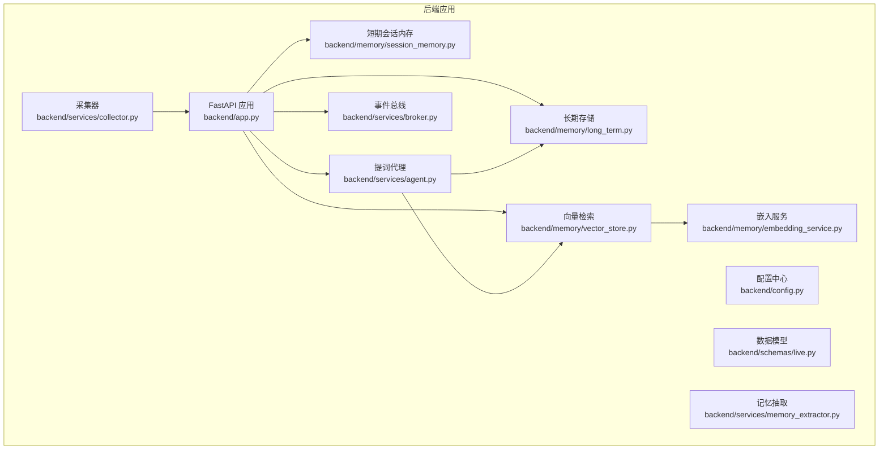
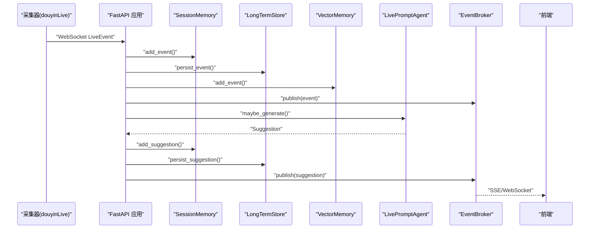
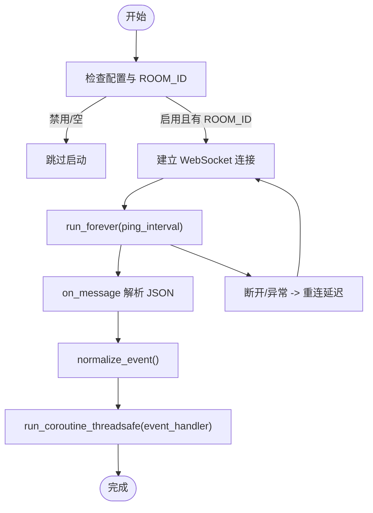
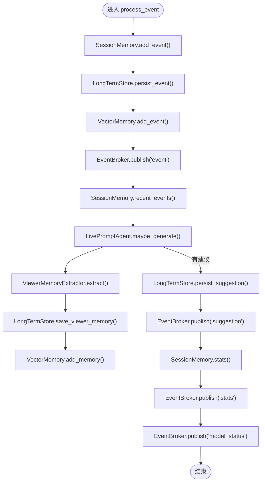
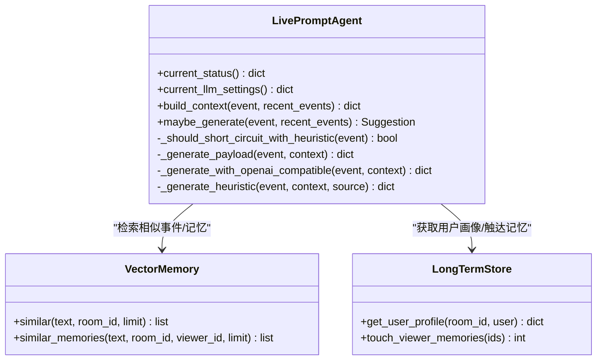
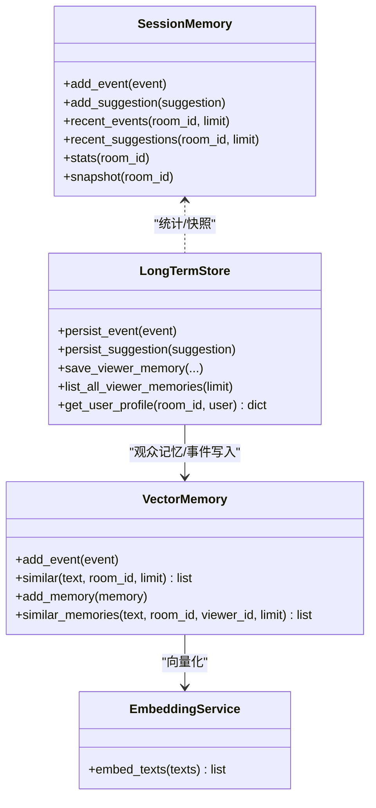
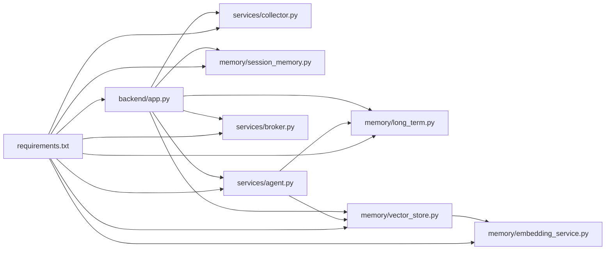

# 后端服务

<cite>
**本文引用的文件**
- [backend/app.py](file://backend/app.py)
- [backend/config.py](file://backend/config.py)
- [backend/schemas/live.py](file://backend/schemas/live.py)
- [backend/services/collector.py](file://backend/services/collector.py)
- [backend/services/broker.py](file://backend/services/broker.py)
- [backend/services/agent.py](file://backend/services/agent.py)
- [backend/services/memory_extractor.py](file://backend/services/memory_extractor.py)
- [backend/memory/session_memory.py](file://backend/memory/session_memory.py)
- [backend/memory/long_term.py](file://backend/memory/long_term.py)
- [backend/memory/vector_store.py](file://backend/memory/vector_store.py)
- [backend/memory/embedding_service.py](file://backend/memory/embedding_service.py)
- [requirements.txt](file://requirements.txt)
- [README.md](file://README.md)
- [USAGE.md](file://USAGE.md)
</cite>

## 目录
1. [简介](#简介)
2. [项目结构](#项目结构)
3. [核心组件](#核心组件)
4. [架构总览](#架构总览)
5. [详细组件分析](#详细组件分析)
6. [依赖关系分析](#依赖关系分析)
7. [性能考量](#性能考量)
8. [故障排查指南](#故障排查指南)
9. [结论](#结论)
10. [附录](#附录)

## 简介
本文件为 DouYin_llm 后端服务的全面技术文档，聚焦 FastAPI 应用实现、路由与中间件、事件处理流水线、智能提词引擎（LLM 集成与启发式规则）、内存系统（SessionMemory、LongTermStore、VectorMemory 协作）及与其他组件的集成方式。文档同时提供配置要点、使用模式、性能优化建议与常见问题解决方案。

## 项目结构
后端采用按职责分层的组织方式：
- 应用入口与路由：backend/app.py
- 配置中心：backend/config.py
- 数据模型：backend/schemas/live.py
- 服务层：
  - 采集器：backend/services/collector.py
  - 事件总线：backend/services/broker.py
  - 提词代理：backend/services/agent.py
  - 记忆抽取：backend/services/memory_extractor.py
- 内存层：
  - 短期会话：backend/memory/session_memory.py
  - 长期存储：backend/memory/long_term.py
  - 向量检索：backend/memory/vector_store.py
  - 嵌入服务：backend/memory/embedding_service.py

图表来源
- [backend/app.py:108-126](file://backend/app.py#L108-L126)
- [backend/config.py:40-112](file://backend/config.py#L40-L112)
- [backend/services/collector.py:38-100](file://backend/services/collector.py#L38-L100)
- [backend/services/broker.py:10-40](file://backend/services/broker.py#L10-L40)
- [backend/services/agent.py:23-60](file://backend/services/agent.py#L23-L60)
- [backend/services/memory_extractor.py:62-118](file://backend/services/memory_extractor.py#L62-L118)
- [backend/memory/session_memory.py:17-113](file://backend/memory/session_memory.py#L17-L113)
- [backend/memory/long_term.py:44-967](file://backend/memory/long_term.py#L44-L967)
- [backend/memory/vector_store.py:59-317](file://backend/memory/vector_store.py#L59-L317)
- [backend/memory/embedding_service.py:18-102](file://backend/memory/embedding_service.py#L18-L102)

章节来源
- [README.md:32-44](file://README.md#L32-L44)
- [backend/app.py:108-126](file://backend/app.py#L108-L126)

## 核心组件
- FastAPI 应用与生命周期
  - CORS 中间件启用
  - 生命周期钩子在应用启动时启动采集器，在关闭时清理活动会话并停止采集器
  - 提供健康检查、房间切换、事件注入、SSE 与 WebSocket 实时流等接口
- 配置中心
  - 从环境变量与 .env 加载，提供采集、后端、LLM、嵌入、向量检索等参数
  - 提供 LLM 基座地址与模型名解析逻辑
- 数据模型
  - LiveEvent、Suggestion、ViewerMemory、SessionStats、ModelStatus、SessionSnapshot
- 事件处理流水线
  - 采集器将原始消息标准化为 LiveEvent，交由 FastAPI 事件处理函数
  - 处理函数写入短期会话、长期存储、向量库，发布事件到事件总线，生成提词建议并持久化
- 智能提词引擎
  - LivePromptAgent：根据事件类型与上下文选择 LLM 或启发式规则生成建议
  - 支持系统提示词与模型参数在线管理
- 内存系统
  - SessionMemory：短期事件与建议，支持 Redis 或进程内内存退化
  - LongTermStore：SQLite 持久化，含事件、建议、观众画像、笔记、会话、设置等表
  - VectorMemory：Chroma 向量索引与本地/云端嵌入服务，支持相似事件与观众记忆检索
  - EmbeddingService：本地/云端嵌入与哈希回退
- 事件总线
  - 进程内异步队列广播，支持 SSE 与 WebSocket 订阅

章节来源
- [backend/app.py:24-102](file://backend/app.py#L24-L102)
- [backend/config.py:40-112](file://backend/config.py#L40-L112)
- [backend/schemas/live.py:8-111](file://backend/schemas/live.py#L8-L111)
- [backend/services/broker.py:10-40](file://backend/services/broker.py#L10-L40)

## 架构总览
后端整体数据流：采集器接收直播事件 → FastAPI 归一化与处理 → 写入短期/长期/向量内存 → 生成提词建议 → 通过 SSE/WebSocket 推送至前端。

图表来源
- [backend/services/collector.py:145-160](file://backend/services/collector.py#L145-L160)
- [backend/app.py:73-102](file://backend/app.py#L73-L102)
- [backend/services/broker.py:28-40](file://backend/services/broker.py#L28-L40)

## 详细组件分析

### FastAPI 应用与路由
- 中间件
  - CORS：允许任意源、凭据、方法与头
- 路由
  - GET /health：健康检查与当前房间状态
  - GET /api/bootstrap：前端初始化快照（最近事件/建议、统计、模型状态）
  - POST /api/room：切换房间并返回新快照
  - POST /api/events：手动注入事件（用于联调/回放）
  - GET /api/viewer、/api/viewer/memories、/api/viewer/notes：观众详情与相关数据
  - POST /api/viewer/notes、DELETE /api/viewer/notes/{id}：观众笔记增删
  - GET/PUT /api/settings/llm：获取/保存 LLM 设置（模型名与系统提示词）
  - GET /api/sessions、/api/sessions/current：直播会话列表与当前会话
  - GET /api/events/stream：SSE 实时事件流
  - GET /ws/live：WebSocket 实时事件流（先下发 bootstrap）
- 生命周期
  - 启动：启动采集器
  - 关闭：关闭当前活动会话并停止采集器

章节来源
- [backend/app.py:108-126](file://backend/app.py#L108-L126)
- [backend/app.py:129-136](file://backend/app.py#L129-L136)
- [backend/app.py:138-156](file://backend/app.py#L138-L156)
- [backend/app.py:158-167](file://backend/app.py#L158-L167)
- [backend/app.py:169-194](file://backend/app.py#L169-L194)
- [backend/app.py:196-222](file://backend/app.py#L196-L222)
- [backend/app.py:224-235](file://backend/app.py#L224-L235)
- [backend/app.py:237-250](file://backend/app.py#L237-L250)
- [backend/app.py:252-272](file://backend/app.py#L252-L272)
- [backend/app.py:274-285](file://backend/app.py#L274-L285)
- [backend/app.py:108-117](file://backend/app.py#L108-L117)

### 采集器（DouyinCollector）
- 连接与运行
  - 通过 WebSocket 连接到本地采集器服务，支持 ping、错误与关闭回调
  - 在 stop 时优雅关闭并等待线程退出
- 事件归一化
  - 将原始消息映射为 LiveEvent，补充方法、礼物元数据、时间戳等
- 线程安全
  - 通过 asyncio.run_coroutine_threadsafe 将事件投递到后端事件循环
- 房间切换
  - 支持动态切换房间并重启连接

图表来源
- [backend/services/collector.py:61-100](file://backend/services/collector.py#L61-L100)
- [backend/services/collector.py:118-140](file://backend/services/collector.py#L118-L140)
- [backend/services/collector.py:145-160](file://backend/services/collector.py#L145-L160)
- [backend/services/collector.py:207-266](file://backend/services/collector.py#L207-L266)

章节来源
- [backend/services/collector.py:38-100](file://backend/services/collector.py#L38-L100)
- [backend/services/collector.py:118-140](file://backend/services/collector.py#L118-L140)
- [backend/services/collector.py:145-160](file://backend/services/collector.py#L145-L160)
- [backend/services/collector.py:182-196](file://backend/services/collector.py#L182-L196)
- [backend/services/collector.py:207-266](file://backend/services/collector.py#L207-L266)

### 事件处理流水线（process_event）
- 写入短期会话与长期存储
- 写入向量库
- 发布事件到事件总线
- 基于最近事件生成建议并持久化
- 抽取观众记忆并写入长期存储与向量库
- 发布统计与模型状态

图表来源
- [backend/app.py:73-102](file://backend/app.py#L73-L102)
- [backend/services/broker.py:28-40](file://backend/services/broker.py#L28-L40)
- [backend/services/memory_extractor.py:99-118](file://backend/services/memory_extractor.py#L99-L118)

章节来源
- [backend/app.py:73-102](file://backend/app.py#L73-L102)

### 智能提词引擎（LivePromptAgent）
- 模型状态
  - 记录模式、模型、后端、结果与更新时间
- 上下文构建
  - 从向量库检索相似事件与观众记忆
  - 从长期存储获取用户画像
- 生成策略
  - 启发式短路：礼物/关注事件直接生成高优建议
  - 关键词短路：命中“价格/多少钱/链接/怎么买/减/瘦/胖/体重/健身”等关键词
  - LLM 生成：OpenAI 兼容接口，失败时回退启发式
- 输出规范化
  - 校验 JSON 结构，归一化优先级与置信度

图表来源
- [backend/services/agent.py:23-60](file://backend/services/agent.py#L23-L60)
- [backend/services/agent.py:83-103](file://backend/services/agent.py#L83-L103)
- [backend/services/agent.py:105-142](file://backend/services/agent.py#L105-L142)
- [backend/services/agent.py:172-301](file://backend/services/agent.py#L172-L301)
- [backend/services/agent.py:302-496](file://backend/services/agent.py#L302-L496)

章节来源
- [backend/services/agent.py:23-60](file://backend/services/agent.py#L23-L60)
- [backend/services/agent.py:83-103](file://backend/services/agent.py#L83-L103)
- [backend/services/agent.py:105-142](file://backend/services/agent.py#L105-L142)
- [backend/services/agent.py:172-301](file://backend/services/agent.py#L172-L301)
- [backend/services/agent.py:302-496](file://backend/services/agent.py#L302-L496)

### 内存系统协作机制
- SessionMemory
  - 短期事件与建议，支持 Redis 或进程内 deque 退化
  - TTL 控制热数据生命周期
- LongTermStore
  - SQLite 表：events、suggestions、viewer_profiles、viewer_gifts、live_sessions、viewer_notes、viewer_memories、app_settings
  - 自动建表、索引与列迁移
  - 事件持久化时维护活动会话、观众画像与礼物聚合
  - 观众记忆的增删改查与触达统计
- VectorMemory
  - 事件与观众记忆向量化，支持 Chroma 或进程内回退
  - 相似度检索与重排（结合置信度、召回次数、时间等）
- EmbeddingService
  - 本地（SentenceTransformer）/云端（OpenAI 兼容）/哈希回退
  - 自动降级与日志提示

图表来源
- [backend/memory/session_memory.py:17-113](file://backend/memory/session_memory.py#L17-L113)
- [backend/memory/long_term.py:44-967](file://backend/memory/long_term.py#L44-L967)
- [backend/memory/vector_store.py:59-317](file://backend/memory/vector_store.py#L59-L317)
- [backend/memory/embedding_service.py:18-102](file://backend/memory/embedding_service.py#L18-L102)

章节来源
- [backend/memory/session_memory.py:17-113](file://backend/memory/session_memory.py#L17-L113)
- [backend/memory/long_term.py:44-967](file://backend/memory/long_term.py#L44-L967)
- [backend/memory/vector_store.py:59-317](file://backend/memory/vector_store.py#L59-L317)
- [backend/memory/embedding_service.py:18-102](file://backend/memory/embedding_service.py#L18-L102)

### 记忆抽取（ViewerMemoryExtractor）
- 过滤低信号评论（长度、关键词、_exact 集）
- 识别记忆类型（偏好/计划/背景/事实）
- 估算置信度（长度、关键词、第一人称等）
- 输出候选记忆条目

章节来源
- [backend/services/memory_extractor.py:62-118](file://backend/services/memory_extractor.py#L62-L118)

### 事件总线（EventBroker）
- 维护订阅队列集合
- 异步广播消息，自动清理阻塞队列

章节来源
- [backend/services/broker.py:10-40](file://backend/services/broker.py#L10-L40)

## 依赖关系分析
- 外部依赖
  - FastAPI、Uvicorn、websocket-client、redis、chromadb
- 内部模块耦合
  - app.py 作为中枢，依赖各服务与内存模块
  - agent 依赖 vector_store 与 long_term
  - vector_store 依赖 embedding_service
  - collector 与 app 通过事件循环通信

图表来源
- [requirements.txt:1-6](file://requirements.txt#L1-L6)
- [backend/app.py:13-35](file://backend/app.py#L13-L35)
- [backend/services/agent.py:23-27](file://backend/services/agent.py#L23-L27)
- [backend/memory/vector_store.py:67](file://backend/memory/vector_store.py#L67)
- [backend/memory/embedding_service.py:18-23](file://backend/memory/embedding_service.py#L18-L23)

章节来源
- [requirements.txt:1-6](file://requirements.txt#L1-L6)
- [backend/app.py:13-35](file://backend/app.py#L13-L35)

## 性能考量
- 采集与处理
  - 采集器使用独立线程与 ping 保活，避免阻塞主线程
  - 事件处理通过 asyncio.run_coroutine_threadsafe 投递，降低阻塞风险
- 内存与索引
  - SessionMemory 使用固定长度队列与 TTL，控制短期内存占用
  - VectorMemory 限制事件/记忆缓存规模，避免 OOM
  - SQLite 使用索引与列迁移，保证查询效率
- LLM 生成
  - 超时与降级策略：失败回退启发式，记录状态便于前端感知
  - 温度与最大 token 参数可调，平衡创造性与稳定性
- 嵌入与向量检索
  - 云端/本地嵌入可选，失败自动回退哈希嵌入
  - 相似度阈值与查询上限可配置，减少无效匹配

## 故障排查指南
- 页面无建议
  - 检查采集器是否运行、ROOM_ID 是否正确、直播间是否开播、后端是否重启
- 顶部显示 fallback
  - 检查 LLM API Key、网络可达性、是否超时或限流
- 顶部显示 heuristic
  - 检查 LLM_MODE 配置或 .env 加载是否正确
- 前端无法打开
  - 检查前端脚本是否正常、端口是否被占用
- 后端启动但无数据
  - 查看后端日志是否连接到采集器 WebSocket、当前房间是否有消息

章节来源
- [USAGE.md:198-256](file://USAGE.md#L198-L256)

## 结论
该后端服务以 FastAPI 为核心，围绕事件采集、短期/长期/向量内存与智能提词引擎构建了完整的直播提词工作栈。通过可选依赖与降级策略，既能在本地快速运行，也能在生产环境中扩展。建议后续完善鉴权、多房间调度、可观测性与模型管理策略，以支撑更复杂的直播运营场景。

## 附录
- 快速启动
  - 启动采集器、准备 .env、安装依赖、启动后端与前端
- 接口速查
  - 健康检查、房间切换、事件注入、SSE/WebSocket 实时流、LLM 设置管理等
- 数据与日志
  - SQLite 文件与 Chroma 存储位置、日志输出目录

章节来源
- [README.md:54-94](file://README.md#L54-L94)
- [README.md:151-166](file://README.md#L151-L166)
- [README.md:193-198](file://README.md#L193-L198)
- [USAGE.md:50-115](file://USAGE.md#L50-L115)
- [USAGE.md:167-197](file://USAGE.md#L167-L197)