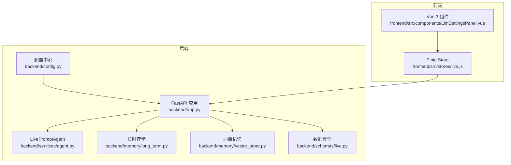
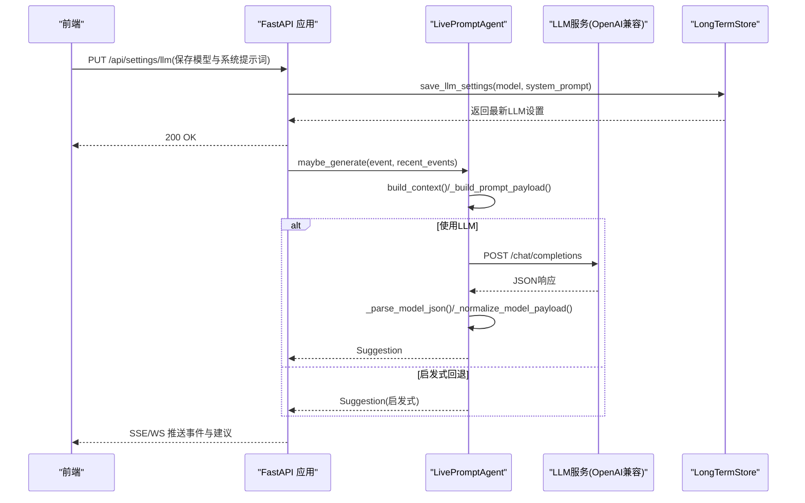
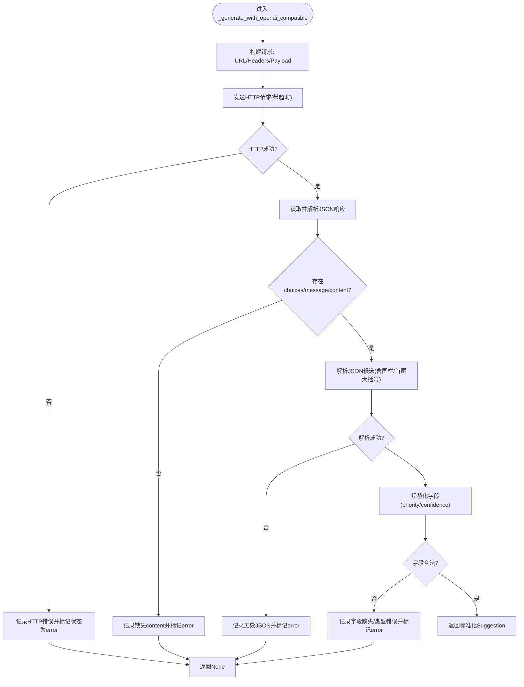
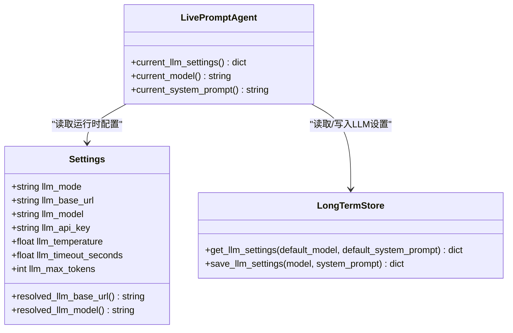
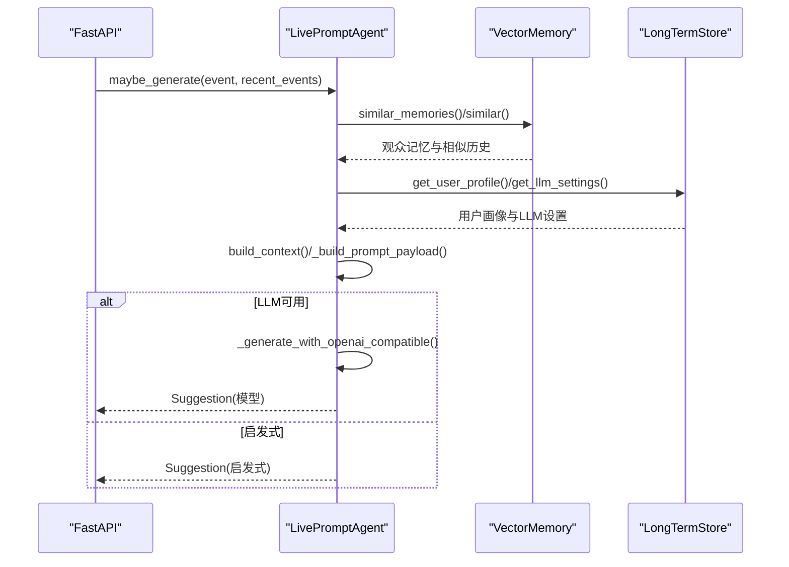
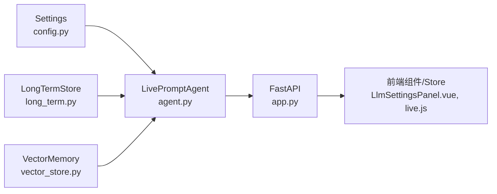

# LLM集成模块

<cite>
**本文引用的文件列表**
- [agent.py](file://backend/services/agent.py)
- [config.py](file://backend/config.py)
- [app.py](file://backend/app.py)
- [long_term.py](file://backend/memory/long_term.py)
- [live.py](file://backend/schemas/live.py)
- [LlmSettingsPanel.vue](file://frontend/src/components/LlmSettingsPanel.vue)
- [live.js](file://frontend/src/stores/live.js)
- [test_llm_settings.py](file://tests/test_llm_settings.py)
- [README.md](file://README.md)
</cite>

## 目录
1. [简介](#简介)
2. [项目结构](#项目结构)
3. [核心组件](#核心组件)
4. [架构总览](#架构总览)
5. [详细组件分析](#详细组件分析)
6. [依赖关系分析](#依赖关系分析)
7. [性能考量](#性能考量)
8. [故障排除指南](#故障排除指南)
9. [结论](#结论)
10. [附录](#附录)

## 简介
本技术文档聚焦于DouYin_llm项目的LLM集成模块，重点阐述LivePromptAgent中OpenAI兼容接口的实现细节，包括HTTP请求构建、响应解析与错误处理机制；同时全面说明LLM配置管理（模型选择、系统提示词、温度与最大token等）、LLM调用流程（从上下文构建到API请求发送），并提供配置不同LLM提供商、处理错误与优化响应质量的具体实践建议。文档还包含性能调优与故障排除指南，帮助开发者在生产环境中稳定高效地使用LLM。

## 项目结构
后端采用FastAPI作为入口，结合内存与持久化存储、向量检索与LLM生成器，形成完整的直播提词工作栈。LLM集成位于后端服务层，通过LivePromptAgent统一调度OpenAI兼容接口与启发式规则，前端通过REST接口与SSE/WebSocket接收实时状态与建议。



图表来源
- [app.py:1-285](file://backend/app.py#L1-L285)
- [agent.py:1-496](file://backend/services/agent.py#L1-L496)
- [config.py:1-113](file://backend/config.py#L1-L113)
- [long_term.py:1-967](file://backend/memory/long_term.py#L1-L967)
- [live.py:1-111](file://backend/schemas/live.py#L1-L111)
- [LlmSettingsPanel.vue:1-122](file://frontend/src/components/LlmSettingsPanel.vue#L1-L122)
- [live.js:338-431](file://frontend/src/stores/live.js#L338-L431)

章节来源
- [README.md:1-223](file://README.md#L1-L223)
- [app.py:1-285](file://backend/app.py#L1-L285)

## 核心组件
- LivePromptAgent：负责构建上下文、调用LLM或回退启发式规则、生成Suggestion并上报状态。
- Settings：集中管理LLM模式、模型名、API Key、温度、超时、最大token等配置项。
- LongTermStore：持久化LLM设置（模型名与系统提示词），并提供默认值回退。
- FastAPI应用：提供REST接口、SSE与WebSocket，承载LLM状态与事件流。
- 前端组件与Store：允许在线编辑LLM设置并通过HTTP接口保存。

章节来源
- [agent.py:23-496](file://backend/services/agent.py#L23-L496)
- [config.py:40-113](file://backend/config.py#L40-L113)
- [long_term.py:821-876](file://backend/memory/long_term.py#L821-L876)
- [app.py:224-235](file://backend/app.py#L224-L235)
- [LlmSettingsPanel.vue:1-122](file://frontend/src/components/LlmSettingsPanel.vue#L1-L122)
- [live.js:354-431](file://frontend/src/stores/live.js#L354-L431)

## 架构总览
LLM调用链路从FastAPI事件处理开始，经LivePromptAgent构建上下文与提示，调用OpenAI兼容接口，解析响应并标准化为Suggestion，最终通过SSE/WebSocket推送到前端。若LLM失败或触发启发式短路，则回退至启发式规则生成建议。



图表来源
- [app.py:224-235](file://backend/app.py#L224-L235)
- [agent.py:200-496](file://backend/services/agent.py#L200-L496)
- [long_term.py:854-876](file://backend/memory/long_term.py#L854-L876)

## 详细组件分析

### LivePromptAgent：OpenAI兼容接口实现
- 请求构建
  - 基础URL与模型解析：根据Settings.resolve_llm_base_url()与resolved_llm_model()确定最终endpoint与模型名。
  - 头部：Content-Type为application/json；若存在API Key则添加Authorization头。
  - 请求体：包含model、temperature、max_tokens与messages数组（system与user两段）。
- 响应解析
  - 成功路径：读取HTTP响应体并反序列化为JSON；提取choices[0].message.content。
  - JSON内容解析：支持纯JSON、带```json...```围栏与首尾大括号包裹的候选，逐个尝试解析。
  - 字段规范化：校验必需字段（priority、reply_text、tone、reason、confidence），并对priority进行归一化（数字或文本映射到low/medium/high），confidence裁剪到[0,1]。
- 错误处理
  - HTTPError：记录状态码与错误体摘要，标记状态为error并返回None。
  - URLError/TimeoutError/OSError：分别记录网络错误、超时与系统错误，标记状态为error并返回None。
  - JSONDecodeError：记录无效JSON包络，标记状态为error并返回None。
  - 缺失content或字段不合法：记录缺失或非法，标记状态为error并返回None。
  - 未捕获异常：记录traceback，标记状态为error并返回None。
- 回退策略
  - 若LLM生成失败或命中启发式短路条件，则回退到启发式规则生成Suggestion。



图表来源
- [agent.py:302-496](file://backend/services/agent.py#L302-L496)

章节来源
- [agent.py:302-496](file://backend/services/agent.py#L302-L496)

### LLM配置管理
- 配置来源与优先级
  - 环境变量与.env文件优先于代码默认值。
  - LLM_MODE控制模式：heuristic/qwen/openai；当LLM_MODE为qwen时，自动选择DashScope兼容端点与默认模型。
- 运行时覆盖
  - 前端通过PUT /api/settings/llm保存模型名与系统提示词，后端写入app_settings表；LivePromptAgent在无长时存储时使用Settings提供的默认值，在有长时存储时读取持久化覆盖。
- 关键配置项
  - LLM_MODE、LLM_BASE_URL、LLM_MODEL、LLM_API_KEY、LLM_TEMPERATURE、LLM_TIMEOUT_SECONDS、LLM_MAX_TOKENS。
- 前端交互
  - LlmSettingsPanel.vue提供输入框与保存/重置按钮；Pinia Store负责加载、更新草稿与保存。



图表来源
- [config.py:40-113](file://backend/config.py#L40-L113)
- [long_term.py:854-876](file://backend/memory/long_term.py#L854-L876)
- [agent.py:48-59](file://backend/services/agent.py#L48-L59)

章节来源
- [config.py:40-113](file://backend/config.py#L40-L113)
- [long_term.py:854-876](file://backend/memory/long_term.py#L854-L876)
- [agent.py:48-59](file://backend/services/agent.py#L48-L59)
- [app.py:224-235](file://backend/app.py#L224-L235)
- [LlmSettingsPanel.vue:1-122](file://frontend/src/components/LlmSettingsPanel.vue#L1-L122)
- [live.js:354-431](file://frontend/src/stores/live.js#L354-L431)

### LLM调用流程详解
- 上下文构建
  - 从向量记忆检索相似事件与观众记忆，压缩用户画像，形成最近事件、相似历史、用户画像与观众记忆文本等上下文。
- 提示构造
  - 将事件与上下文打包为prompt负载，并附加指令约束（要求输出合法JSON且包含priority、reply_text、tone、reason、confidence）。
- LLM生成
  - 发送POST /chat/completions，解析响应并标准化为Suggestion。
- 启发式回退
  - 当事件类型命中特定关键词或LLM失败时，使用启发式规则生成Suggestion并标记来源。



图表来源
- [agent.py:83-142](file://backend/services/agent.py#L83-L142)
- [agent.py:179-198](file://backend/services/agent.py#L179-L198)
- [agent.py:200-301](file://backend/services/agent.py#L200-L301)

章节来源
- [agent.py:83-142](file://backend/services/agent.py#L83-L142)
- [agent.py:179-198](file://backend/services/agent.py#L179-L198)
- [agent.py:200-301](file://backend/services/agent.py#L200-L301)

### 前端LLM设置面板与持久化
- 加载设置：GET /api/settings/llm返回当前模型与系统提示词（含默认值）。
- 保存设置：PUT /api/settings/llm保存模型与系统提示词；若系统提示词为空则删除覆盖项。
- 前端Store：负责草稿同步、错误处理与状态更新。

章节来源
- [app.py:224-235](file://backend/app.py#L224-L235)
- [long_term.py:854-876](file://backend/memory/long_term.py#L854-L876)
- [LlmSettingsPanel.vue:1-122](file://frontend/src/components/LlmSettingsPanel.vue#L1-L122)
- [live.js:354-431](file://frontend/src/stores/live.js#L354-L431)

## 依赖关系分析
- LivePromptAgent依赖Settings解析最终模型与端点，依赖LongTermStore读取/写入LLM设置，依赖VectorMemory与SessionMemory提供上下文。
- FastAPI应用负责路由与事件分发，将LiveEvent交由Agent处理并推送结果。
- 前端通过REST接口与SSE/WebSocket消费数据。



图表来源
- [agent.py:23-59](file://backend/services/agent.py#L23-L59)
- [config.py:40-113](file://backend/config.py#L40-L113)
- [long_term.py:854-876](file://backend/memory/long_term.py#L854-L876)
- [app.py:1-285](file://backend/app.py#L1-L285)
- [LlmSettingsPanel.vue:1-122](file://frontend/src/components/LlmSettingsPanel.vue#L1-L122)
- [live.js:354-431](file://frontend/src/stores/live.js#L354-L431)

章节来源
- [agent.py:23-59](file://backend/services/agent.py#L23-L59)
- [config.py:40-113](file://backend/config.py#L40-L113)
- [long_term.py:854-876](file://backend/memory/long_term.py#L854-L876)
- [app.py:1-285](file://backend/app.py#L1-L285)

## 性能考量
- 超时与并发
  - LLM_TIMEOUT_SECONDS默认6秒，可根据模型与网络状况调整；过短可能导致频繁回退，过长可能影响实时性。
  - 建议在高并发场景下增加后端线程池或异步队列，避免阻塞事件处理。
- 温度与最大token
  - LLM_TEMPERATURE=0.4平衡创造性与稳定性；若希望更保守，可降低温度；若希望更灵活，可适度提高。
  - LLM_MAX_TOKENS=120适合短句口播；若需要更长回复，可适当增大。
- 上下文长度控制
  - 通过限制recent_events、similar_history与viewer_memories数量，控制messages长度，避免超出模型上下文窗口。
- 端点与模型选择
  - LLM_MODE=qwen时使用DashScope兼容端点；openai模式使用OpenAI官方端点；heuristic模式完全不依赖LLM，延迟最低。
- 日志与可观测性
  - 记录LLM状态（last_result/last_error/updated_at）便于前端展示与监控；建议引入指标收集与告警。

章节来源
- [config.py:57-68](file://backend/config.py#L57-L68)
- [agent.py:302-496](file://backend/services/agent.py#L302-L496)
- [app.py:60-101](file://backend/app.py#L60-L101)

## 故障排除指南
- 常见错误与定位
  - HTTP错误：查看HTTP状态码与错误体摘要，确认鉴权、端点与模型名正确。
  - 网络错误：检查网络连通性与代理设置。
  - 超时：提升LLM_TIMEOUT_SECONDS或切换更快的端点/模型。
  - JSON解析失败：检查模型输出格式是否符合要求（合法JSON且包含必需字段）。
  - 字段缺失/类型错误：检查系统提示词与模型输出一致性。
- 回退策略
  - LLM失败时自动回退启发式规则；可在前端面板临时切换为heuristic模式验证问题。
- 配置核对
  - 确认LLM_MODE、LLM_BASE_URL、LLM_MODEL、LLM_API_KEY、LLM_TEMPERATURE、LLM_TIMEOUT_SECONDS、LLM_MAX_TOKENS已正确设置。
  - 通过GET /api/settings/llm核对当前生效设置，必要时通过PUT /api/settings/llm更新。

章节来源
- [agent.py:330-427](file://backend/services/agent.py#L330-L427)
- [app.py:224-235](file://backend/app.py#L224-L235)
- [README.md:95-128](file://README.md#L95-L128)

## 结论
本LLM集成模块通过OpenAI兼容接口与启发式回退策略，实现了在直播场景下的低延迟、高稳定的提词建议生成。配置管理支持运行时覆盖与持久化，前端提供直观的编辑界面。通过合理的超时、温度与token设置，以及严格的错误处理与回退策略，能够在复杂网络环境下保持系统稳健性。建议在生产环境中结合指标监控与日志审计，持续优化LLM参数与上下文控制，以获得更高质量的建议输出。

## 附录

### 配置不同LLM提供商的实践要点
- OpenAI兼容端点
  - 设置LLM_MODE=openai，LLM_BASE_URL为OpenAI官方v1端点，LLM_MODEL为具体模型名，LLM_API_KEY为OpenAI密钥。
- 阿里云DashScope(Qwen)
  - 设置LLM_MODE=qwen，LLM_BASE_URL为DashScope兼容端点，LLM_MODEL为Qwen系列模型名，LLM_API_KEY为DashScope密钥。
- 本地/私有部署
  - 设置LLM_MODE=openai，LLM_BASE_URL为自建兼容端点，LLM_MODEL为自定义模型名，LLM_API_KEY为对应鉴权。

章节来源
- [config.py:84-104](file://backend/config.py#L84-L104)
- [README.md:117-127](file://README.md#L117-L127)

### 处理错误情况的最佳实践
- 在前端显示错误码与简要原因，引导用户检查配置。
- 自动回退到启发式模式，保证系统可用性。
- 记录详细日志与traceback，便于后续排查。
- 对于网络波动，适当提高超时或启用重试策略。

章节来源
- [agent.py:330-427](file://backend/services/agent.py#L330-L427)
- [README.md:151-165](file://README.md#L151-L165)

### 优化响应质量的建议
- 系统提示词：明确输出格式与字段要求，强调中文短句口播风格。
- 温度与最大token：根据业务需求微调，兼顾创意与可控性。
- 上下文精简：控制最近事件与记忆数量，避免冗余信息干扰。
- 字段规范化：严格校验priority与confidence范围，确保前端渲染稳定。

章节来源
- [agent.py:179-198](file://backend/services/agent.py#L179-L198)
- [agent.py:459-495](file://backend/services/agent.py#L459-L495)
- [config.py:57-68](file://backend/config.py#L57-L68)