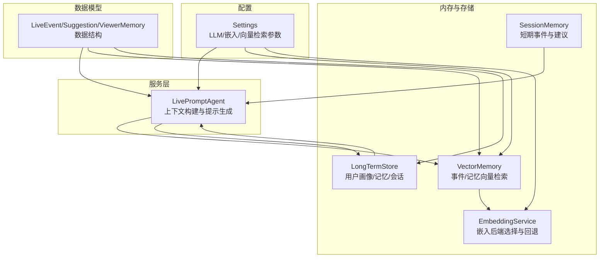
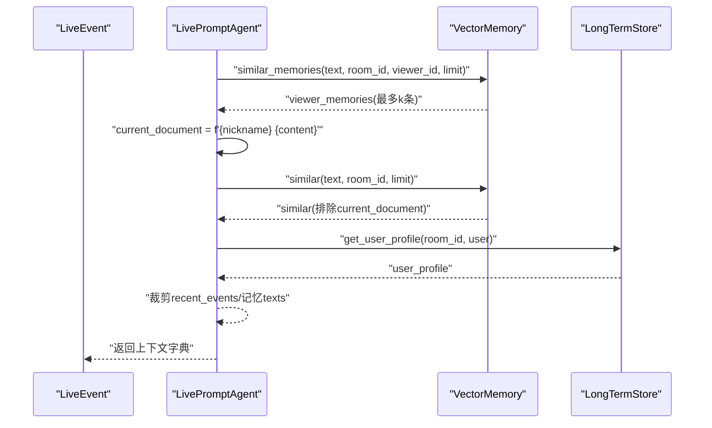
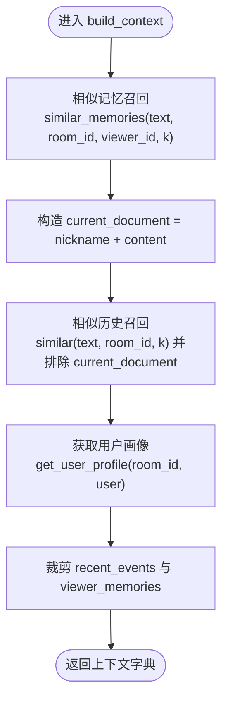
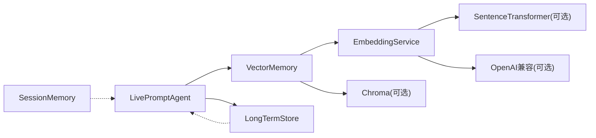

# 上下文构建器

<cite>
**本文引用的文件**
- [backend/services/agent.py](file://backend/services/agent.py)
- [backend/memory/vector_store.py](file://backend/memory/vector_store.py)
- [backend/memory/embedding_service.py](file://backend/memory/embedding_service.py)
- [backend/memory/session_memory.py](file://backend/memory/session_memory.py)
- [backend/memory/long_term.py](file://backend/memory/long_term.py)
- [backend/schemas/live.py](file://backend/schemas/live.py)
- [backend/config.py](file://backend/config.py)
- [tests/test_agent.py](file://tests/test_agent.py)
</cite>

## 目录
1. [简介](#简介)
2. [项目结构](#项目结构)
3. [核心组件](#核心组件)
4. [架构总览](#架构总览)
5. [详细组件分析](#详细组件分析)
6. [依赖分析](#依赖分析)
7. [性能考量](#性能考量)
8. [故障排查指南](#故障排查指南)
9. [结论](#结论)
10. [附录](#附录)

## 简介
本文件面向DouYin_llm的上下文构建器，系统性阐述build_context方法的实现逻辑与数据结构设计，覆盖以下关键能力：
- 最近事件收集（recent_events）
- 相似历史查找（similar_history）
- 用户画像压缩（user_profile）
- 观众记忆整合（viewer_memories）

同时给出上下文元素的作用与重要性、字段含义、质量评估与性能优化建议，并通过测试用例路径与配置项指引，帮助读者在真实环境中调整参数、优化数据收集策略并处理复杂场景。

## 项目结构
围绕上下文构建，相关模块与职责如下：
- 后端服务层：负责上下文组装与提示生成（agent.py）
- 向量检索层：提供事件历史与观众记忆的语义召回（vector_store.py）
- 嵌入服务层：统一本地/云端嵌入后端与回退策略（embedding_service.py）
- 短期会话内存：提供近期事件与建议的高速缓存（session_memory.py）
- 长期存储：提供用户画像、记忆与会话聚合（long_term.py）
- 数据模型：定义事件、建议、记忆等核心数据结构（schemas/live.py）
- 配置中心：集中管理LLM、嵌入、向量检索等参数（config.py）
- 测试用例：验证上下文构建的输入裁剪与输出形态（tests/test_agent.py）

图表来源
- [backend/services/agent.py:83-103](file://backend/services/agent.py#L83-L103)
- [backend/memory/vector_store.py:59-108](file://backend/memory/vector_store.py#L59-L108)
- [backend/memory/embedding_service.py:18-48](file://backend/memory/embedding_service.py#L18-L48)
- [backend/memory/session_memory.py:17-113](file://backend/memory/session_memory.py#L17-L113)
- [backend/memory/long_term.py:44-800](file://backend/memory/long_term.py#L44-L800)
- [backend/schemas/live.py:29-111](file://backend/schemas/live.py#L29-L111)
- [backend/config.py:40-113](file://backend/config.py#L40-L113)

章节来源
- [backend/services/agent.py:83-103](file://backend/services/agent.py#L83-L103)
- [backend/memory/vector_store.py:59-108](file://backend/memory/vector_store.py#L59-L108)
- [backend/memory/embedding_service.py:18-48](file://backend/memory/embedding_service.py#L18-L48)
- [backend/memory/session_memory.py:17-113](file://backend/memory/session_memory.py#L17-L113)
- [backend/memory/long_term.py:44-800](file://backend/memory/long_term.py#L44-L800)
- [backend/schemas/live.py:29-111](file://backend/schemas/live.py#L29-L111)
- [backend/config.py:40-113](file://backend/config.py#L40-L113)

## 核心组件
- LivePromptAgent.build_context：主入口，组装上下文字典，包含recent_events、similar_history、user_profile、viewer_memories、viewer_memory_texts五个关键字段。
- VectorMemory：提供事件相似检索与观众记忆相似检索，支持Chroma向量库与本地回退索引。
- EmbeddingService：根据配置选择本地SentenceTransformer或云端OpenAI兼容接口，失败时回退哈希嵌入。
- SessionMemory：短期事件与建议的高速缓存，支持Redis或进程内deque。
- LongTermStore：用户画像、礼物历史、记忆等长期数据的持久化与查询。
- Settings：集中管理LLM、嵌入、向量检索等参数，影响召回阈值、查询上限与最终K。

章节来源
- [backend/services/agent.py:83-103](file://backend/services/agent.py#L83-L103)
- [backend/memory/vector_store.py:59-108](file://backend/memory/vector_store.py#L59-L108)
- [backend/memory/embedding_service.py:18-48](file://backend/memory/embedding_service.py#L18-L48)
- [backend/memory/session_memory.py:17-113](file://backend/memory/session_memory.py#L17-L113)
- [backend/memory/long_term.py:44-800](file://backend/memory/long_term.py#L44-L800)
- [backend/config.py:40-113](file://backend/config.py#L40-L113)

## 架构总览
上下文构建的调用序列如下：

图表来源
- [backend/services/agent.py:83-103](file://backend/services/agent.py#L83-L103)
- [backend/memory/vector_store.py:257-316](file://backend/memory/vector_store.py#L257-L316)
- [backend/memory/long_term.py:559-598](file://backend/memory/long_term.py#L559-L598)

## 详细组件分析

### 上下文构建器：build_context实现
- 输入
  - event：当前直播事件（包含房间号、用户身份、内容等）
  - recent_events：最近N条事件（通常来自短期会话内存或长期存储）
- 输出
  - 字典，包含：
    - recent_events：最近事件的精简表示（最多3条）
    - similar_history：与当前内容语义相近的历史话术（最多2条，排除与当前事件完全相同的文档）
    - user_profile：用户画像的精简版本（字段白名单裁剪）
    - viewer_memories：与当前观众相关的记忆对象（含memory_text、confidence等元数据）
    - viewer_memory_texts：与当前观众相关的记忆文本（最多2条）

实现要点
- 使用当前事件的“昵称+内容”构造current_document，用于相似检索时排除自身。
- 调用VectorMemory.similar_memories与similar分别获取观众记忆与历史话术。
- 通过LongTermStore.get_user_profile获取用户画像，并进行字段裁剪以降低提示体积。
- 对recent_events、viewer_memories进行截断，确保上下文规模可控。

图表来源
- [backend/services/agent.py:83-103](file://backend/services/agent.py#L83-L103)

章节来源
- [backend/services/agent.py:83-103](file://backend/services/agent.py#L83-L103)

### 相关数据结构与字段含义
- LiveEvent：标准化的直播事件，包含event_id、room_id、event_type、user、content、ts等。
- Suggestion：提示建议，包含priority、reply_text、tone、reason、confidence等。
- ViewerMemory：观众记忆，包含memory_id、room_id、viewer_id、memory_text、memory_type、confidence、created_at、updated_at、last_recalled_at、recall_count等。
- SessionStats：房间统计，包含各类事件计数。
- SessionSnapshot：前端引导载荷，包含recent_events、recent_suggestions、stats等。

章节来源
- [backend/schemas/live.py:29-111](file://backend/schemas/live.py#L29-L111)

### 上下文元素的作用与重要性
- recent_events
  - 作用：提供最邻近的上下文事件，便于快速承接。
  - 重要性：对即时互动（如评论、礼物、关注）的承接至关重要。
  - 处理：最多保留3条，仅包含event_type、nickname、content等必要字段。
- similar_history
  - 作用：提供语义相近的历史话术，复用已验证的有效表达。
  - 重要性：提升回复一致性与成功率。
  - 处理：最多2条，排除与当前事件完全相同的文档，避免自我引用。
- user_profile
  - 作用：压缩后的用户画像，包含互动频次、最近评论、礼物偏好等。
  - 重要性：使回复更具个性化与连贯性。
  - 处理：仅保留非空字段，避免冗余。
- viewer_memories
  - 作用：与当前观众相关的记忆对象，携带memory_text、confidence等元数据。
  - 重要性：实现跨轮次的记忆延续与话题复用。
  - 处理：最多2条记忆文本参与提示，其余保留对象以便后续追踪。
- viewer_memory_texts
  - 作用：纯文本的记忆摘要，直接拼接到提示中。
  - 重要性：作为显式的“旧话题”线索，提高延续对话的概率。

章节来源
- [backend/services/agent.py:94-103](file://backend/services/agent.py#L94-L103)
- [backend/schemas/live.py:64-78](file://backend/schemas/live.py#L64-L78)

### 相似历史与观众记忆的检索策略
- 事件历史相似检索（similar）
  - 优先使用Chroma向量库，若不可用则回退到本地倒排索引。
  - 排序键包含：向量相似度、是否包含查询词、事件类型权重（评论优先）、时间戳。
  - 参数来源：semantic_event_min_score、semantic_event_query_limit、semantic_final_k。
- 观众记忆相似检索（similar_memories）
  - 限定在同一房间与同一观众ID。
  - 排序键包含：向量相似度、记忆置信度、是否包含查询词、召回次数、更新时间。
  - 参数来源：semantic_memory_min_score、semantic_memory_query_limit、semantic_final_k。

章节来源
- [backend/memory/vector_store.py:172-230](file://backend/memory/vector_store.py#L172-L230)
- [backend/memory/vector_store.py:257-316](file://backend/memory/vector_store.py#L257-L316)
- [backend/memory/vector_store.py:110-133](file://backend/memory/vector_store.py#L110-L133)
- [backend/config.py:71-75](file://backend/config.py#L71-L75)

### 嵌入服务与回退机制
- 选择策略
  - local：使用本地SentenceTransformer模型（需安装sentence-transformers）。
  - cloud：调用OpenAI兼容接口（可配置base_url与api_key）。
  - 失败回退：自动切换至HashEmbeddingFunction，保证可用性。
- 性能与稳定性
  - 本地模式可减少网络抖动影响，但需考虑设备资源。
  - 云端模式吞吐更高，但受网络与配额限制。

章节来源
- [backend/memory/embedding_service.py:18-48](file://backend/memory/embedding_service.py#L18-L48)
- [backend/memory/embedding_service.py:50-102](file://backend/memory/embedding_service.py#L50-L102)
- [backend/memory/vector_store.py:34-56](file://backend/memory/vector_store.py#L34-L56)

### 用户画像压缩与长期存储
- 获取与裁剪
  - 通过LongTermStore.get_user_profile(room_id, user)获取完整画像。
  - 使用_LivePromptAgent._compact_user_profile按白名单裁剪，仅保留非空字段。
- 长期存储
  - 维护viewer_profiles、viewer_gifts、viewer_memories等表，提供查询与聚合。
  - 记忆的recall_count与last_recalled_at用于排序与追踪。

章节来源
- [backend/services/agent.py:152-169](file://backend/services/agent.py#L152-L169)
- [backend/memory/long_term.py:559-598](file://backend/memory/long_term.py#L559-L598)
- [backend/memory/long_term.py:676-720](file://backend/memory/long_term.py#L676-L720)

### 最近事件收集与短期会话内存
- 来源
  - 可来自SessionMemory.recent_events或LongTermStore.recent_events。
- 特点
  - 支持Redis或进程内deque两种后端，具备TTL与容量限制。
  - 提供stats与snapshot，便于前端引导与统计。

章节来源
- [backend/memory/session_memory.py:66-84](file://backend/memory/session_memory.py#L66-L84)
- [backend/memory/long_term.py:501-519](file://backend/memory/long_term.py#L501-L519)

## 依赖分析
- 组件耦合
  - LivePromptAgent依赖VectorMemory与LongTermStore，耦合度适中，职责清晰。
  - VectorMemory依赖EmbeddingService与可选Chroma客户端，具备回退能力。
  - SessionMemory与LongTermStore分别承担短期与长期数据，互不直接耦合。
- 外部依赖
  - Redis（可选）：提升短期事件与建议的并发与持久化能力。
  - Chroma（可选）：提供高性能向量检索。
  - sentence-transformers（可选）：本地嵌入模型。
  - OpenAI兼容接口（可选）：云端嵌入服务。

图表来源
- [backend/services/agent.py:23-27](file://backend/services/agent.py#L23-L27)
- [backend/memory/vector_store.py:10-14](file://backend/memory/vector_store.py#L10-L14)
- [backend/memory/embedding_service.py:9-12](file://backend/memory/embedding_service.py#L9-L12)

章节来源
- [backend/services/agent.py:23-27](file://backend/services/agent.py#L23-L27)
- [backend/memory/vector_store.py:10-14](file://backend/memory/vector_store.py#L10-L14)
- [backend/memory/embedding_service.py:9-12](file://backend/memory/embedding_service.py#L9-L12)

## 性能考量
- 向量检索参数
  - semantic_event_min_score / semantic_memory_min_score：提升召回质量，避免噪声。
  - semantic_event_query_limit / semantic_memory_query_limit：扩大候选集，再由最终K筛选。
  - semantic_final_k：控制最终返回数量，平衡上下文长度与计算成本。
- 嵌入后端选择
  - 本地：适合低延迟与离线场景，注意设备资源。
  - 云端：适合高吞吐与高质量嵌入，注意网络与配额。
- 缓存与回退
  - Redis短期缓存：提升并发与响应速度。
  - Chroma回退索引：在无外部向量库时仍可工作。
- 上下文裁剪
  - 严格限制recent_events与viewer_memories数量，避免提示过长导致token浪费与延迟上升。

章节来源
- [backend/config.py:71-75](file://backend/config.py#L71-L75)
- [backend/memory/vector_store.py:92-108](file://backend/memory/vector_store.py#L92-L108)
- [backend/memory/session_memory.py:17-31](file://backend/memory/session_memory.py#L17-L31)

## 故障排查指南
- 常见问题
  - 向量检索为空：检查semantic_min_score是否过高，或查询文本是否为空。
  - 回退到哈希嵌入：确认sentence-transformers是否安装，或云端接口是否可达。
  - Redis连接失败：确认REDIS_URL配置正确，网络可达。
  - LLM生成失败：检查LLM后端URL、API Key与超时设置。
- 定位手段
  - 查看Agent状态记录（last_result、last_error、updated_at）。
  - 检查向量检索返回的score与metadata，确认排序与过滤逻辑。
  - 在测试中模拟build_context输入，验证裁剪与输出形态。

章节来源
- [backend/services/agent.py:28-69](file://backend/services/agent.py#L28-L69)
- [backend/memory/vector_store.py:86-96](file://backend/memory/vector_store.py#L86-L96)
- [backend/memory/embedding_service.py:38-47](file://backend/memory/embedding_service.py#L38-L47)
- [backend/memory/session_memory.py:25-31](file://backend/memory/session_memory.py#L25-L31)

## 结论
上下文构建器通过“最近事件+相似历史+用户画像+观众记忆”的多维组合，实现了对直播场景的高效、可解释且可扩展的提示输入组织。借助可配置的向量检索参数、灵活的嵌入后端与完善的回退机制，系统在不同部署环境下均能稳定运行。建议在生产中结合业务特征微调semantic_*参数，并配合Redis与Chroma以获得最佳性能与质量。

## 附录

### 如何调整上下文构建参数
- 向量检索参数（在Settings中配置）
  - semantic_event_min_score：事件历史召回最低相似度
  - semantic_memory_min_score：观众记忆召回最低相似度
  - semantic_event_query_limit：事件历史查询候选上限
  - semantic_memory_query_limit：观众记忆查询候选上限
  - semantic_final_k：最终返回数量
- 嵌入服务参数
  - embedding_mode：local或cloud
  - embedding_model：模型名称
  - embedding_base_url：云端接口地址
  - embedding_api_key：访问密钥
  - local_embedding_device/batch_size：本地推理设备与批大小
- LLM提示参数
  - llm_mode、llm_model、llm_base_url、llm_api_key、llm_temperature、llm_timeout_seconds、llm_max_tokens

章节来源
- [backend/config.py:40-113](file://backend/config.py#L40-L113)

### 具体用例与测试参考
- 测试用例展示了build_context的裁剪行为与输出形态，可作为参数调优的参考基准。
  - 测试路径：[tests/test_agent.py:42-89](file://tests/test_agent.py#L42-L89)

章节来源
- [tests/test_agent.py:42-89](file://tests/test_agent.py#L42-L89)