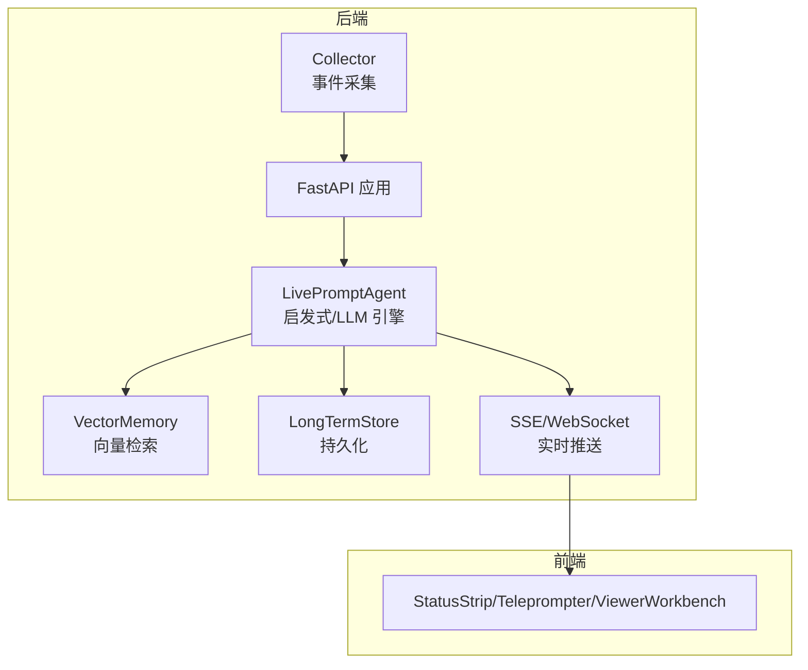
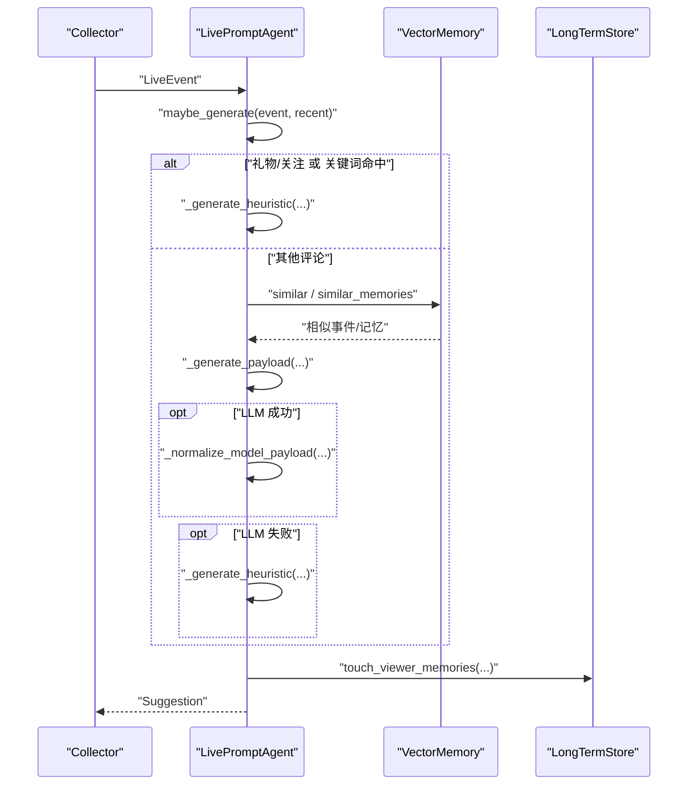
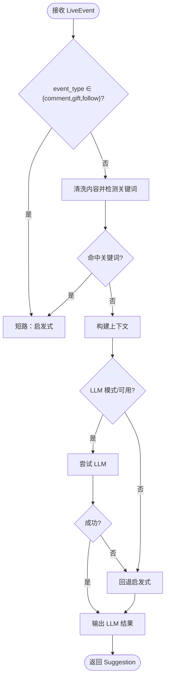
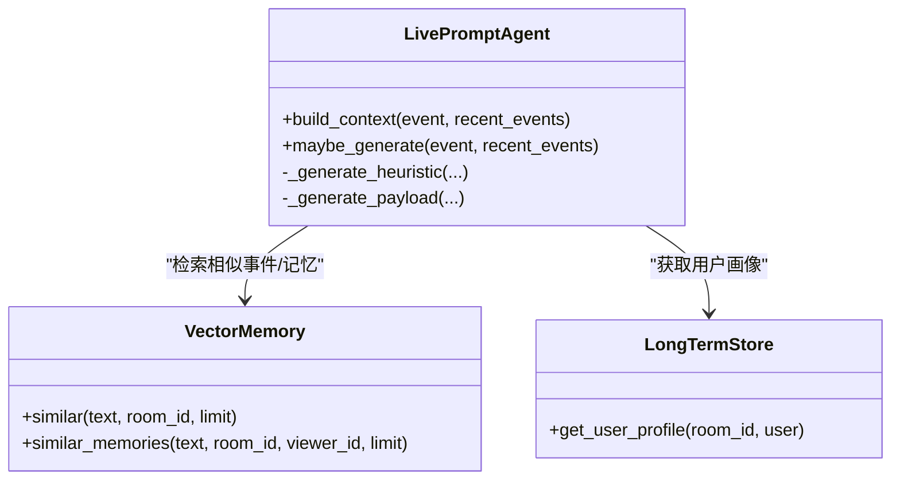
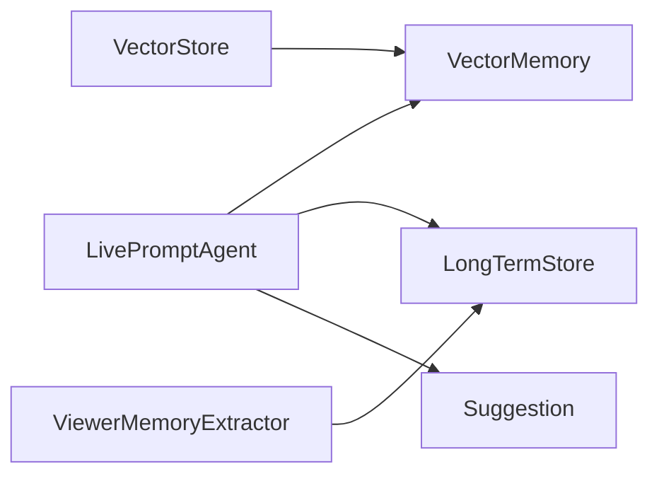

# 启发式规则引擎

<cite>
**本文引用的文件**
- [README.md](file://README.md)
- [backend/services/agent.py](file://backend/services/agent.py)
- [backend/schemas/live.py](file://backend/schemas/live.py)
- [backend/config.py](file://backend/config.py)
- [backend/memory/vector_store.py](file://backend/memory/vector_store.py)
- [backend/services/memory_extractor.py](file://backend/services/memory_extractor.py)
- [tests/test_agent.py](file://tests/test_agent.py)
</cite>

## 目录
1. [简介](#简介)
2. [项目结构](#项目结构)
3. [核心组件](#核心组件)
4. [架构总览](#架构总览)
5. [详细组件分析](#详细组件分析)
6. [依赖分析](#依赖分析)
7. [性能考量](#性能考量)
8. [故障排查指南](#故障排查指南)
9. [结论](#结论)
10. [附录](#附录)

## 简介
本技术文档聚焦于 DouYin_llm 的启发式规则引擎，系统性阐述其设计原理、实现逻辑与扩展方法。引擎以事件类型判断为基础，结合关键词匹配与优先级计算，为礼物感谢、关注欢迎、价格咨询、健身话题、记忆延续等常见直播场景提供即时、稳定的提词建议。同时，引擎具备与 LLM 的双通道回退机制，确保在模型不可用或不稳定时仍能维持低延迟与高可用。

## 项目结构
- 后端核心位于 backend/，其中：
  - services/agent.py：启发式与 LLM 双通道的提词生成器
  - memory/vector_store.py：向量检索与重排序，支撑“记忆延续”等场景
  - services/memory_extractor.py：从评论中抽取语义记忆，为规则提供上下文
  - schemas/live.py：事件与建议的数据模型
  - config.py：运行时配置，含 LLM 模式与语义检索参数
- 前端通过 SSE/WebSocket 接收实时建议，仪表板与工单面板辅助主播使用

图表来源
- [README.md:143-149](file://README.md#L143-L149)

章节来源
- [README.md:32-44](file://README.md#L32-L44)
- [README.md:143-149](file://README.md#L143-L149)

## 核心组件
- LivePromptAgent：负责事件分流、上下文构建、启发式规则匹配与 LLM 回退
- Suggestion：统一的建议输出结构，包含 source、priority、reply_text、tone、reason、confidence
- ViewerMemoryExtractor：从评论中抽取语义记忆，用于“记忆延续”场景
- VectorMemory：提供相似事件与记忆的检索与重排序，影响规则的上下文权重

章节来源
- [backend/services/agent.py:23-142](file://backend/services/agent.py#L23-L142)
- [backend/schemas/live.py:47-62](file://backend/schemas/live.py#L47-L62)
- [backend/services/memory_extractor.py:62-118](file://backend/services/memory_extractor.py#L62-L118)
- [backend/memory/vector_store.py:102-133](file://backend/memory/vector_store.py#L102-L133)

## 架构总览
启发式规则引擎在 LivePromptAgent 中实现，整体流程如下：
- 输入事件（评论/礼物/关注）
- 若事件类型为礼物或关注，或内容命中关键词，则直接进入启发式分支
- 否则构建上下文（最近事件、相似历史、用户画像、语义记忆），并尝试 LLM
- LLM 失败或模式为启发式时，回退至启发式规则
- 输出标准化建议（含置信度与优先级）

图表来源
- [backend/services/agent.py:105-142](file://backend/services/agent.py#L105-L142)
- [backend/services/agent.py:200-217](file://backend/services/agent.py#L200-L217)
- [backend/memory/vector_store.py:102-133](file://backend/memory/vector_store.py#L102-L133)

## 详细组件分析

### 事件类型判断与短路策略
- 事件类型白名单：comment/gift/follow
- 礼物与关注事件直接短路至启发式，避免不必要的 LLM 调用
- 关键词短路：当评论内容包含“价格/多少钱/链接/怎么买/减/瘦/胖/体重/健身”等词时，直接走启发式

图表来源
- [backend/services/agent.py:105-121](file://backend/services/agent.py#L105-L121)
- [backend/services/agent.py:171-178](file://backend/services/agent.py#L171-L178)

章节来源
- [backend/services/agent.py:105-121](file://backend/services/agent.py#L105-L121)
- [tests/test_agent.py:91-114](file://tests/test_agent.py#L91-L114)

### 关键词匹配与优先级计算
- 礼物感谢：高优先级（high），置信度较高，强调即时互动与正反馈
- 关注欢迎：中优先级（medium），强调友好与引导
- 价格咨询：高优先级（high），强调转化效率与路径清晰
- 健身/身材话题：中优先级（medium），强调温和承接与目标认同
- 记忆延续：高优先级（high），强调语义连续与个性化
- 相似历史：中优先级（medium），强调复用已验证话术

章节来源
- [backend/services/agent.py:228-300](file://backend/services/agent.py#L228-L300)

### 上下文构建与语义检索
- 最近事件：压缩为关键字段，控制输入规模
- 相似历史：从向量库检索与当前评论语义相近的历史话术
- 用户画像：从长时存储抽取活跃度、互动频次、最近行为等
- 语义记忆：从评论抽取“偏好/计划/背景/事实”等记忆片段，用于延续对话

图表来源
- [backend/services/agent.py:83-103](file://backend/services/agent.py#L83-L103)
- [backend/memory/vector_store.py:102-133](file://backend/memory/vector_store.py#L102-L133)

章节来源
- [backend/services/agent.py:83-103](file://backend/services/agent.py#L83-L103)
- [backend/memory/vector_store.py:102-133](file://backend/memory/vector_store.py#L102-L133)

### 记忆延续与置信度增强
- 当上下文中存在“viewer_memory_texts”时，优先生成延续建议
- 记忆置信度参与向量检索的重排序，进一步提升相关性
- 记忆类型分为 preference/plan/context/fact，便于后续语义管理

章节来源
- [backend/services/agent.py:272-281](file://backend/services/agent.py#L272-L281)
- [backend/services/memory_extractor.py:78-97](file://backend/services/memory_extractor.py#L78-L97)
- [backend/memory/vector_store.py:120-132](file://backend/memory/vector_store.py#L120-L132)

### LLM 回退与结果规范化
- 当 LLM 返回非法 JSON、缺失字段或异常时，标记状态并回退启发式
- 统一解析与归一化：优先级支持数字/英文/中文表达，置信度裁剪至 [0,1]

章节来源
- [backend/services/agent.py:200-217](file://backend/services/agent.py#L200-L217)
- [backend/services/agent.py:439-495](file://backend/services/agent.py#L439-L495)

## 依赖分析
- LivePromptAgent 依赖 VectorMemory 与 LongTermStore 提供上下文
- 启发式规则与关键词列表集中于 agent.py 与 memory_extractor.py
- Suggestion 作为统一输出结构，贯穿前后端交互

图表来源
- [backend/services/agent.py:23-28](file://backend/services/agent.py#L23-L28)
- [backend/services/memory_extractor.py:62-118](file://backend/services/memory_extractor.py#L62-L118)
- [backend/memory/vector_store.py:102-133](file://backend/memory/vector_store.py#L102-L133)

章节来源
- [backend/services/agent.py:23-28](file://backend/services/agent.py#L23-L28)
- [backend/schemas/live.py:47-62](file://backend/schemas/live.py#L47-L62)

## 性能考量
- 事件分流：礼物/关注与关键词命中直接启发式，显著降低 LLM 调用次数
- 上下文裁剪：最近事件与相似历史数量限制，减少输入规模
- 向量检索参数：通过配置项控制查询上限与最终 K 值，平衡召回与延迟
- 置信度裁剪：统一置信度范围，避免极端值影响排序与展示

章节来源
- [backend/config.py:71-75](file://backend/config.py#L71-L75)
- [backend/services/agent.py:83-103](file://backend/services/agent.py#L83-L103)
- [backend/memory/vector_store.py:102-108](file://backend/memory/vector_store.py#L102-L108)

## 故障排查指南
- LLM 失败回退：查看状态标记与错误码，确认网络、鉴权与超时配置
- JSON 解析失败：检查模型输出格式，确保严格返回 JSON 字典
- 缺失必要字段：确认模型输出包含 priority/reply_text/tone/reason/confidence
- 启发式未触发：核对事件类型与关键词表，确认短路条件是否满足

章节来源
- [backend/services/agent.py:330-393](file://backend/services/agent.py#L330-L393)
- [backend/services/agent.py:439-495](file://backend/services/agent.py#L439-L495)
- [tests/test_agent.py:91-114](file://tests/test_agent.py#L91-L114)

## 结论
该启发式规则引擎以“事件类型 + 关键词 + 上下文”的组合策略，实现了对直播常见场景的稳定覆盖。通过与向量检索与长时存储的协同，进一步增强了“记忆延续”等个性化场景的效果。在 LLM 不可用或不稳定时，引擎能够可靠回退，保障低延迟与高可用。

## 附录

### 如何扩展新的启发式规则
- 在启发式分支中新增条件判断，参考以下路径：
  - [礼物感谢与关注欢迎:228-249](file://backend/services/agent.py#L228-L249)
  - [价格咨询与健身话题:251-270](file://backend/services/agent.py#L251-L270)
  - [记忆延续与相似历史:272-291](file://backend/services/agent.py#L272-L291)
- 输出结构需遵循 Suggestion 字段定义：
  - [Suggestion 定义:47-62](file://backend/schemas/live.py#L47-L62)

章节来源
- [backend/services/agent.py:228-300](file://backend/services/agent.py#L228-L300)
- [backend/schemas/live.py:47-62](file://backend/schemas/live.py#L47-L62)

### 如何调整现有规则权重与优先级
- 修改规则分支中的 priority 与 confidence，参考：
  - [优先级与置信度示例:232-239](file://backend/services/agent.py#L232-L239)
  - [LLM 归一化优先级处理:459-481](file://backend/services/agent.py#L459-L481)
- 调整向量检索参数以影响相似历史与记忆的召回：
  - [语义检索参数:71-75](file://backend/config.py#L71-L75)
  - [重排序权重:120-132](file://backend/memory/vector_store.py#L120-L132)

章节来源
- [backend/services/agent.py:459-481](file://backend/services/agent.py#L459-L481)
- [backend/config.py:71-75](file://backend/config.py#L71-L75)
- [backend/memory/vector_store.py:120-132](file://backend/memory/vector_store.py#L120-L132)

### 规则调试技巧
- 使用单元测试验证短路与回退逻辑：
  - [礼物事件短路测试:91-114](file://tests/test_agent.py#L91-114)
  - [LLM 参数注入测试:116-172](file://tests/test_agent.py#L116-L172)
- 在日志中观察状态变化与错误码，定位失败原因：
  - [状态标记与日志:61-69](file://backend/services/agent.py#L61-69)
  - [LLM 错误处理:330-393](file://backend/services/agent.py#L330-393)

章节来源
- [tests/test_agent.py:91-172](file://tests/test_agent.py#L91-L172)
- [backend/services/agent.py:61-69](file://backend/services/agent.py#L61-L69)
- [backend/services/agent.py:330-393](file://backend/services/agent.py#L330-L393)