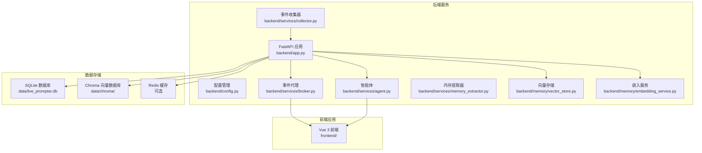
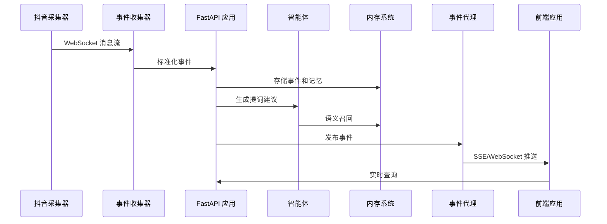
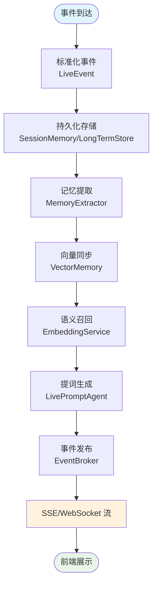
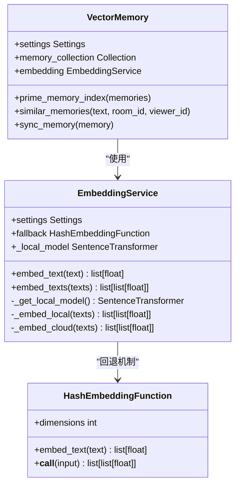
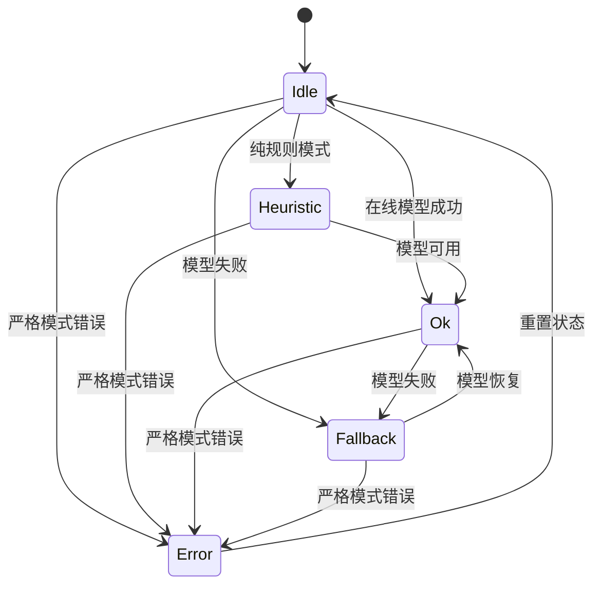
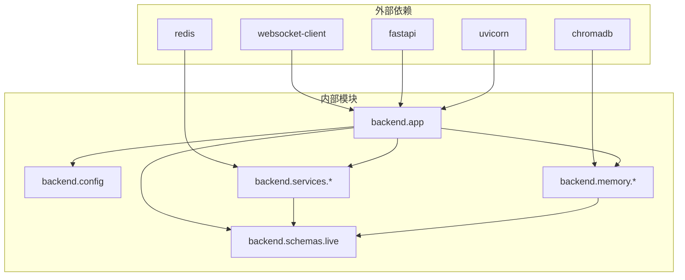
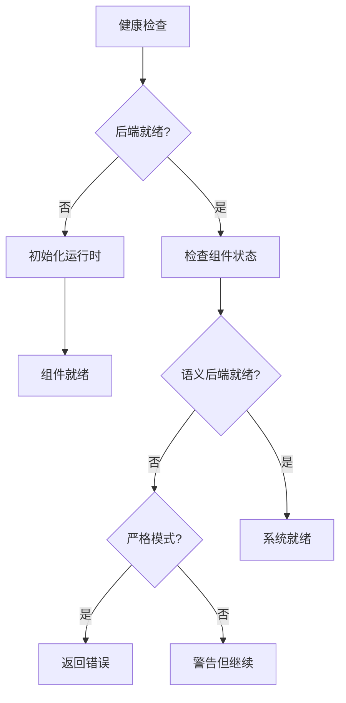

# 建议生成监控系统

<cite>
**本文档引用的文件**
- [backend/app.py](file://backend/app.py)
- [backend/config.py](file://backend/config.py)
- [backend/services/broker.py](file://backend/services/broker.py)
- [backend/services/collector.py](file://backend/services/collector.py)
- [backend/services/agent.py](file://backend/services/agent.py)
- [backend/services/memory_extractor.py](file://backend/services/memory_extractor.py)
- [backend/memory/vector_store.py](file://backend/memory/vector_store.py)
- [backend/memory/embedding_service.py](file://backend/memory/embedding_service.py)
- [backend/schemas/live.py](file://backend/schemas/live.py)
- [README.md](file://README.md)
- [USAGE.md](file://USAGE.md)
- [tests/test_comment_processing_status.py](file://tests/test_comment_processing_status.py)
- [tests/test_embedding_service.py](file://tests/test_embedding_service.py)
- [requirements.txt](file://requirements.txt)
</cite>

## 目录
1. [简介](#简介)
2. [项目结构](#项目结构)
3. [核心组件](#核心组件)
4. [架构概览](#架构概览)
5. [详细组件分析](#详细组件分析)
6. [依赖关系分析](#依赖关系分析)
7. [性能考虑](#性能考虑)
8. [故障排除指南](#故障排除指南)
9. [结论](#结论)

## 简介

这是一个面向抖音直播场景的实时提词与观众记忆工作台系统。该系统的核心目标是为主播提供一套实时辅助系统，通过接收直播间事件、沉淀观众长期记忆、进行真实语义召回，再将可操作的信息反馈到前端工作台，帮助主播更自然地接话、识别老观众、维护互动关系。

系统采用微服务架构，包含事件采集、实时处理、长期存储、语义召回和提词生成等多个核心组件。目前版本已经移除了"历史事件向量召回"，只保留"观众记忆召回"这条主语义链路。

## 项目结构

**图表来源**
- [backend/app.py:1-500](file://backend/app.py#L1-L500)
- [backend/config.py:1-112](file://backend/config.py#L1-L112)

**章节来源**
- [README.md:184-197](file://README.md#L184-L197)
- [backend/app.py:1-500](file://backend/app.py#L1-L500)

## 核心组件

### 1. FastAPI 应用入口
系统的主要入口点，提供 REST API、SSE 流和 WebSocket 连接，负责协调各个服务组件的工作。

### 2. 配置管理系统
集中管理所有运行时配置，包括 LLM 设置、嵌入模式、数据库路径等关键参数。

### 3. 事件收集器
连接本地 `douyinLive` WebSocket 服务，标准化直播事件并分发给后端处理。

### 4. 事件代理系统
进程内事件广播器，负责将处理后的事件通过 SSE 和 WebSocket 推送给前端。

### 5. 智能体系统
负责提词生成、语义召回上下文拼装和模型状态输出的核心业务逻辑。

### 6. 内存提取器
从评论内容中提取可重用的观众记忆，支持多种提取策略和置信度评估。

### 7. 向量存储系统
基于 Chroma 的向量数据库，支持真实的语义嵌入和相似度检索。

### 8. 嵌入服务
提供本地和云端两种嵌入模式，支持严格模式下的错误处理。

**章节来源**
- [backend/app.py:103-134](file://backend/app.py#L103-L134)
- [backend/config.py:40-112](file://backend/config.py#L40-L112)
- [backend/services/collector.py:38-266](file://backend/services/collector.py#L38-L266)

## 架构概览

**图表来源**
- [README.md:30-42](file://README.md#L30-L42)
- [backend/app.py:154-216](file://backend/app.py#L154-L216)

## 详细组件分析

### 事件处理流水线

**图表来源**
- [backend/app.py:154-216](file://backend/app.py#L154-L216)
- [backend/services/memory_extractor.py:99-118](file://backend/services/memory_extractor.py#L99-L118)
- [backend/services/agent.py:131-205](file://backend/services/agent.py#L131-L205)

### 嵌入服务架构

**图表来源**
- [backend/memory/embedding_service.py:18-119](file://backend/memory/embedding_service.py#L18-L119)
- [backend/memory/vector_store.py:59-388](file://backend/memory/vector_store.py#L59-L388)

### 模型状态监控

**图表来源**
- [backend/services/agent.py:23-76](file://backend/services/agent.py#L23-L76)
- [backend/services/agent.py:354-490](file://backend/services/agent.py#L354-L490)

**章节来源**
- [backend/app.py:241-252](file://backend/app.py#L241-L252)
- [backend/services/agent.py:38-76](file://backend/services/agent.py#L38-L76)

## 依赖关系分析

**图表来源**
- [requirements.txt:1-6](file://requirements.txt#L1-L6)
- [backend/app.py:8-25](file://backend/app.py#L8-L25)

**章节来源**
- [requirements.txt:1-6](file://requirements.txt#L1-L6)
- [backend/app.py:1-500](file://backend/app.py#L1-L500)

## 性能考虑

### 1. 嵌入模式优化
- **云嵌入模式**：适用于高质量语义理解，但受网络延迟影响
- **本地嵌入模式**：减少网络开销，但需要 GPU/CPU 资源
- **严格模式**：确保真实语义召回，避免降级回退

### 2. 向量检索优化
- **查询限制**：通过 `semantic_memory_query_limit` 控制检索范围
- **分数阈值**：使用 `semantic_memory_min_score` 过滤低质量结果
- **最终结果数**：通过 `semantic_final_k` 限制返回数量

### 3. 缓存策略
- **会话内存**：短期事件缓存，支持 Redis 可选
- **向量索引**：Chroma 持久化存储，支持批量更新
- **模型状态**：实时状态监控和错误追踪

## 故障排除指南

### 1. 健康检查端点
系统提供 `/health` 端点用于监控整体健康状况：

**图表来源**
- [backend/app.py:241-252](file://backend/app.py#L241-L252)

### 2. 常见问题诊断

#### 问题：前端显示 `fallback`
可能原因：
- 在线模型调用失败
- 网络连接异常
- API 密钥配置错误

#### 问题：前端显示 `heuristic`
可能原因：
- 配置为纯规则模式
- `.env` 文件加载失败

#### 问题：语义召回失败
可能原因：
- Chroma 向量数据库不可用
- 嵌入服务连接失败
- 严格模式下禁止回退

**章节来源**
- [tests/test_comment_processing_status.py:371-393](file://tests/test_comment_processing_status.py#L371-L393)
- [tests/test_embedding_service.py:81-100](file://tests/test_embedding_service.py#L81-L100)

### 3. 日志监控建议

建议重点关注以下日志级别：
- **ERROR**：严重错误，需要立即处理
- **WARNING**：潜在问题，需要关注
- **INFO**：正常操作，用于流程追踪
- **DEBUG**：详细调试信息

## 结论

该监控系统通过多层次的设计实现了对直播提词系统的全面监控：

### 主要优势
1. **实时性**：通过 SSE 和 WebSocket 实现实时事件推送
2. **可观测性**：完整的事件处理轨迹和状态监控
3. **弹性设计**：支持多种嵌入模式和严格模式
4. **可扩展性**：模块化架构便于功能扩展

### 改进建议
1. **增强指标收集**：添加嵌入成功率、召回命中率等运维指标
2. **告警机制**：实现连续失败告警和自动恢复提示
3. **多房间支持**：扩展到多直播间并行处理
4. **权限控制**：实现登录鉴权和多租户隔离

该系统为直播场景提供了可靠的实时提词解决方案，通过完善的监控机制确保了系统的稳定性和可维护性。