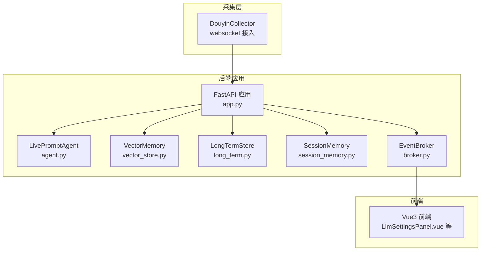
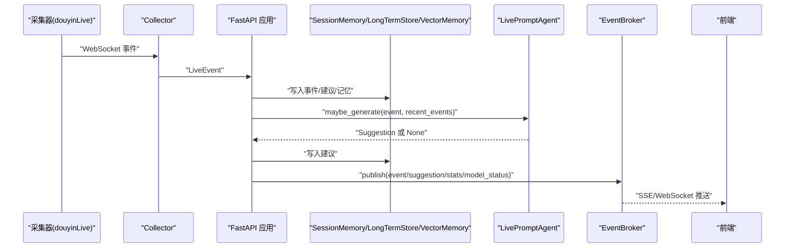
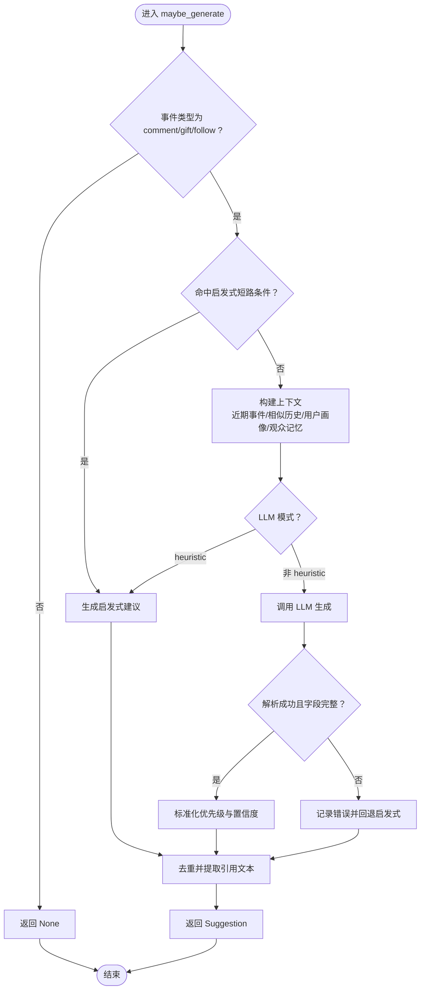
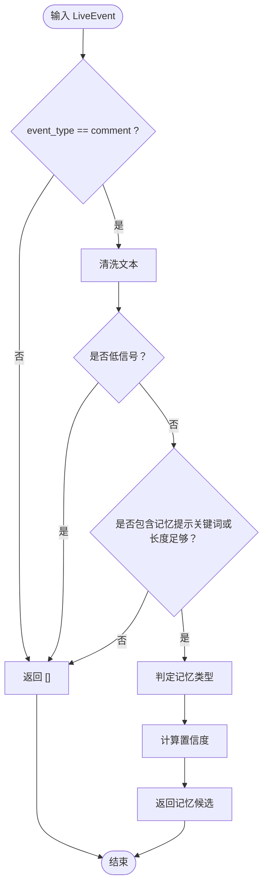
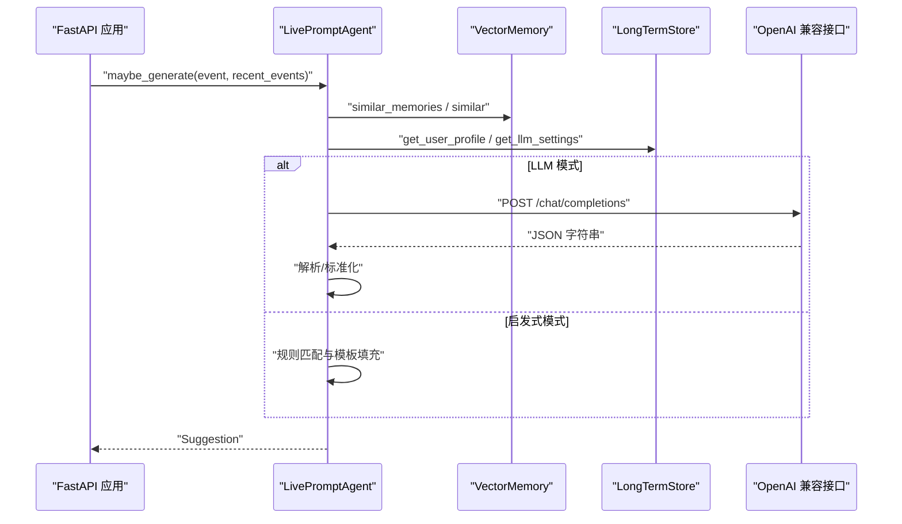
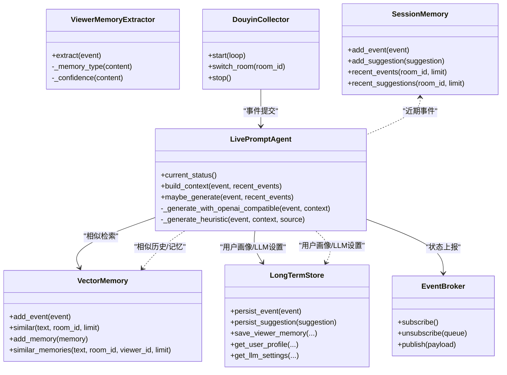

# 智能提词引擎

<cite>
**本文引用的文件**
- [backend/services/agent.py](file://backend/services/agent.py)
- [backend/services/memory_extractor.py](file://backend/services/memory_extractor.py)
- [backend/memory/vector_store.py](file://backend/memory/vector_store.py)
- [backend/memory/long_term.py](file://backend/memory/long_term.py)
- [backend/memory/session_memory.py](file://backend/memory/session_memory.py)
- [backend/config.py](file://backend/config.py)
- [backend/app.py](file://backend/app.py)
- [backend/schemas/live.py](file://backend/schemas/live.py)
- [backend/services/broker.py](file://backend/services/broker.py)
- [backend/services/collector.py](file://backend/services/collector.py)
- [tests/test_agent.py](file://tests/test_agent.py)
- [frontend/src/components/LlmSettingsPanel.vue](file://frontend/src/components/LlmSettingsPanel.vue)
- [README.md](file://README.md)
</cite>

## 目录
1. [简介](#简介)
2. [项目结构](#项目结构)
3. [核心组件](#核心组件)
4. [架构总览](#架构总览)
5. [详细组件分析](#详细组件分析)
6. [依赖关系分析](#依赖关系分析)
7. [性能考量](#性能考量)
8. [故障排查指南](#故障排查指南)
9. [结论](#结论)
10. [附录](#附录)

## 简介
本技术文档围绕 DouYin_llm 智能提词引擎展开，重点解释 LivePromptAgent 的工作原理（LLM 集成、启发式规则与建议生成算法）、ViewerMemoryExtractor 的实现（观众记忆提取策略与置信度计算）、提词建议的生成流程（从上下文构建到最终建议输出），并提供配置与优化建议及常见问题解决方案。文档同时给出可视化架构图与流程图，帮助读者快速理解系统设计与数据流。

## 项目结构
后端采用 FastAPI 应用入口，结合事件采集、短期/长期记忆、向量检索与 LLM/启发式生成模块，形成完整的直播提词闭环。前端通过 SSE/WebSocket 实时接收事件与建议，提供状态条、提词卡、事件流与观众工坊等界面。

图表来源
- [backend/app.py:27-35](file://backend/app.py#L27-L35)
- [backend/services/collector.py:38-53](file://backend/services/collector.py#L38-L53)
- [backend/services/broker.py:10-39](file://backend/services/broker.py#L10-L39)
- [backend/memory/session_memory.py:17-113](file://backend/memory/session_memory.py#L17-L113)
- [backend/memory/long_term.py:44-800](file://backend/memory/long_term.py#L44-L800)
- [backend/memory/vector_store.py:59-317](file://backend/memory/vector_store.py#L59-L317)
- [backend/services/agent.py:23-496](file://backend/services/agent.py#L23-L496)

章节来源
- [README.md:143-166](file://README.md#L143-L166)
- [backend/app.py:108-126](file://backend/app.py#L108-L126)

## 核心组件
- LivePromptAgent：负责根据事件与上下文生成提词建议，支持 LLM 与启发式两种模式，具备错误降级与状态上报。
- ViewerMemoryExtractor：从评论中提取可复用的观众记忆，计算记忆类型与置信度。
- VectorMemory：基于 Chroma 或本地哈希嵌入进行事件与记忆的语义检索。
- LongTermStore：SQLite 持久化层，维护事件、建议、观众画像、记忆、笔记与会话。
- SessionMemory：短期会话缓存（Redis 或内存），用于事件与建议的热数据。
- EventBroker：进程内事件广播器，统一推送至 SSE/WebSocket。
- DouyinCollector：与本地采集器对接，标准化直播事件并提交到后端事件循环。

章节来源
- [backend/services/agent.py:23-496](file://backend/services/agent.py#L23-L496)
- [backend/services/memory_extractor.py:62-118](file://backend/services/memory_extractor.py#L62-L118)
- [backend/memory/vector_store.py:59-317](file://backend/memory/vector_store.py#L59-L317)
- [backend/memory/long_term.py:44-800](file://backend/memory/long_term.py#L44-L800)
- [backend/memory/session_memory.py:17-113](file://backend/memory/session_memory.py#L17-L113)
- [backend/services/broker.py:10-39](file://backend/services/broker.py#L10-L39)
- [backend/services/collector.py:38-266](file://backend/services/collector.py#L38-L266)

## 架构总览
系统通过采集器将直播事件标准化为 LiveEvent，经由 FastAPI 应用写入短期/长期记忆与向量索引，随后由 LivePromptAgent 生成建议并通过 EventBroker 推送到前端。前端组件实时展示模型状态、事件流与建议卡片。

图表来源
- [backend/services/collector.py:145-159](file://backend/services/collector.py#L145-L159)
- [backend/app.py:73-102](file://backend/app.py#L73-L102)
- [backend/services/broker.py:28-39](file://backend/services/broker.py#L28-L39)
- [backend/services/agent.py:105-142](file://backend/services/agent.py#L105-L142)

章节来源
- [README.md:143-149](file://README.md#L143-L149)
- [backend/app.py:108-126](file://backend/app.py#L108-L126)

## 详细组件分析

### LivePromptAgent 工作原理
LivePromptAgent 是提词引擎的核心，负责：
- 上下文构建：聚合近期事件、相似历史、用户画像与观众记忆。
- 生成决策：根据事件类型与关键词触发启发式规则，否则调用 LLM。
- 结果规范化：解析 LLM 返回的 JSON，标准化字段与置信度范围。
- 错误降级：LLM 失败时回退到启发式规则并记录状态。

关键流程与要点
- 上下文构建
  - 使用向量检索获取相似历史与观众记忆，限制返回数量。
  - 用户画像来自长期存储的聚合统计，字段精简以降低 token。
- 启发式规则
  - 礼物与关注事件直接生成高/中优先级建议，强调即时互动。
  - 包含“价格/多少钱/链接/怎么买”等关键词的评论优先级高。
  - 包含“减/瘦/胖/体重/健身”等关键词的评论优先级中等。
  - 若命中观众历史记忆或相似历史，优先延续旧话题。
- LLM 生成
  - 通过 OpenAI 兼容接口发送系统提示词与用户提示负载。
  - 解析返回内容中的 JSON，支持多种包裹形式（含代码块）。
  - 标准化优先级字符串与置信度浮点数，确保输出一致性。
- 状态与错误处理
  - 记录模式、模型、后端、结果与错误码，便于前端展示与诊断。
  - 针对网络、超时、JSON 解析失败等异常分别标记错误类型。

图表来源
- [backend/services/agent.py:105-142](file://backend/services/agent.py#L105-L142)
- [backend/services/agent.py:171-300](file://backend/services/agent.py#L171-L300)
- [backend/services/agent.py:302-437](file://backend/services/agent.py#L302-L437)
- [backend/services/agent.py:439-496](file://backend/services/agent.py#L439-L496)

章节来源
- [backend/services/agent.py:23-496](file://backend/services/agent.py#L23-L496)
- [tests/test_agent.py:41-176](file://tests/test_agent.py#L41-L176)

### ViewerMemoryExtractor 实现
该组件从评论中提取可复用的观众记忆，遵循以下策略：
- 文本清洗：去除多余空白与标点，保留有效内容。
- 低信号过滤：剔除极短、常见应答词与过短的交易型提问。
- 记忆类型判定：依据关键词判断偏好、计划、场景或事实类记忆。
- 置信度计算：综合长度、关键词出现与主语存在情况，上限 0.92。

图表来源
- [backend/services/memory_extractor.py:99-118](file://backend/services/memory_extractor.py#L99-L118)
- [backend/services/memory_extractor.py:62-118](file://backend/services/memory_extractor.py#L62-L118)

章节来源
- [backend/services/memory_extractor.py:62-118](file://backend/services/memory_extractor.py#L62-L118)

### 提词建议生成流程（从上下文到输出）
- 输入：LiveEvent（事件类型、用户、内容、元数据）与近期事件窗口。
- 上下文：近期事件、相似历史、用户画像、观众记忆与记忆文本。
- 生成：启发式或 LLM；若 LLM 成功则标准化输出；失败则回退启发式。
- 输出：Suggestion（包含建议 ID、房间/事件 ID、来源、优先级、回复文本、语调、原因、置信度、引用与创建时间）。

图表来源
- [backend/services/agent.py:83-142](file://backend/services/agent.py#L83-L142)
- [backend/services/agent.py:200-217](file://backend/services/agent.py#L200-L217)
- [backend/services/agent.py:302-437](file://backend/services/agent.py#L302-L437)

章节来源
- [backend/services/agent.py:83-142](file://backend/services/agent.py#L83-L142)
- [backend/services/agent.py:200-217](file://backend/services/agent.py#L200-L217)
- [backend/services/agent.py:302-437](file://backend/services/agent.py#L302-L437)

### LLM 集成与系统提示词
- 模型解析：根据 LLM_MODE 推断默认模型与 Base URL，支持 Qwen/OpenAI 兼容。
- 系统提示词：默认中文短句口播指令，可由前端在线修改并持久化到 app_settings。
- 请求参数：包含 temperature、max_tokens、Authorization（若提供）。
- 错误处理：HTTP 错误、网络错误、超时、JSON 解析失败、缺失内容等均有明确错误码与日志。

章节来源
- [backend/config.py:40-113](file://backend/config.py#L40-L113)
- [backend/app.py:224-235](file://backend/app.py#L224-L235)
- [backend/services/agent.py:17-20](file://backend/services/agent.py#L17-L20)
- [backend/services/agent.py:302-437](file://backend/services/agent.py#L302-L437)

### 向量检索与记忆管理
- 事件与记忆向量化：支持 Chroma 与本地哈希嵌入函数，提供相似检索与排序。
- 排序策略：综合相似度、包含查询词、事件类型、时间戳、记忆置信度、召回次数与更新时间。
- 记忆写入：ViewerMemoryExtractor 提取的记忆写入 SQLite，并同步到向量索引。

章节来源
- [backend/memory/vector_store.py:59-317](file://backend/memory/vector_store.py#L59-L317)
- [backend/memory/long_term.py:693-785](file://backend/memory/long_term.py#L693-L785)

## 依赖关系分析

图表来源
- [backend/services/agent.py:23-496](file://backend/services/agent.py#L23-L496)
- [backend/services/memory_extractor.py:62-118](file://backend/services/memory_extractor.py#L62-L118)
- [backend/memory/vector_store.py:59-317](file://backend/memory/vector_store.py#L59-L317)
- [backend/memory/long_term.py:44-800](file://backend/memory/long_term.py#L44-L800)
- [backend/memory/session_memory.py:17-113](file://backend/memory/session_memory.py#L17-L113)
- [backend/services/broker.py:10-39](file://backend/services/broker.py#L10-L39)
- [backend/services/collector.py:38-266](file://backend/services/collector.py#L38-L266)

章节来源
- [backend/app.py:27-35](file://backend/app.py#L27-L35)

## 性能考量
- LLM 参数调优
  - temperature：较低温度（如 0.4）提升确定性，适合口播建议；过高可能产生漂移。
  - max_tokens：限制输出长度，避免长尾 token 消耗与延迟。
  - timeout：合理设置超时，避免阻塞事件循环。
- 向量检索优化
  - 适当提高 semantic_event_min_score 与 semantic_memory_min_score，减少噪声。
  - 调整 query_limit 与 final_k，平衡召回与性能。
  - 在 Redis 可用时启用 SessionMemory，提升并发场景下的热数据读写效率。
- 启发式优先
  - 对礼物与关注事件直接走启发式，显著降低 token 与延迟。
  - 对明显转化型关键词（价格/链接/怎么买）快速响应，提升互动效率。
- 前端交互
  - 使用 SSE/WebSocket 降低轮询开销，前端按房间过滤事件流。

章节来源
- [backend/config.py:57-76](file://backend/config.py#L57-L76)
- [backend/memory/vector_store.py:86-108](file://backend/memory/vector_store.py#L86-L108)
- [backend/services/agent.py:171-300](file://backend/services/agent.py#L171-L300)

## 故障排查指南
- LLM 无法生成建议
  - 检查 LLM_MODE、Base URL 与 API Key 是否正确配置。
  - 查看模型状态与错误码，定位网络、超时或 JSON 解析问题。
  - 临时切换到启发式模式验证系统其余部分是否正常。
- 建议质量不佳
  - 调整系统提示词与 temperature；必要时增加 max_tokens。
  - 优化相似度阈值与召回数量，提升上下文相关性。
- 记忆未命中
  - 确认评论是否被 ViewerMemoryExtractor 过滤（低信号/关键词不足）。
  - 检查向量索引是否可用，必要时重建嵌入。
- 前端不显示建议
  - 确认 SSE/WebSocket 连接与房间过滤参数。
  - 检查 EventBroker 是否正常广播。

章节来源
- [backend/services/agent.py:302-437](file://backend/services/agent.py#L302-L437)
- [backend/app.py:252-271](file://backend/app.py#L252-L271)
- [backend/services/broker.py:28-39](file://backend/services/broker.py#L28-L39)

## 结论
LivePromptAgent 通过“LLM + 启发式”的双通道设计，在保证稳定性的同时兼顾生成质量。ViewerMemoryExtractor 与 VectorMemory/LongTermStore 形成的语义记忆体系，使得建议更具延续性与个性化。结合合理的参数调优与前端实时推送，系统能够在直播场景中提供高效、稳定的提词支持。

## 附录

### 配置与参数参考
- LLM 模式与模型
  - LLM_MODE：heuristic/qwen/openai
  - LLM_BASE_URL：OpenAI/Qwen 兼容地址
  - LLM_MODEL：模型名称（可被前端覆盖）
  - LLM_API_KEY/DASHSCOPE_API_KEY：鉴权
- 生成参数
  - LLM_TEMPERATURE：0.4
  - LLM_MAX_TOKENS：120
  - LLM_TIMEOUT_SECONDS：6
- 向量与嵌入
  - SEMANTIC_* 系列参数：min_score/query_limit/final_k
  - EMBEDDING_MODE/MODEL/BASE_URL/API_KEY/DEVICE/BATCH_SIZE
- 会话与 Redis
  - SESSION_TTL_SECONDS：短期会话 TTL
  - REDIS_URL：启用 Redis SessionMemory

章节来源
- [backend/config.py:40-113](file://backend/config.py#L40-L113)
- [README.md:95-142](file://README.md#L95-L142)

### 前端设置面板
- LlmSettingsPanel 支持在线编辑模型名与系统提示词，保存后写入 app_settings，供 LivePromptAgent 读取。

章节来源
- [frontend/src/components/LlmSettingsPanel.vue:1-122](file://frontend/src/components/LlmSettingsPanel.vue#L1-L122)
- [backend/app.py:224-235](file://backend/app.py#L224-L235)