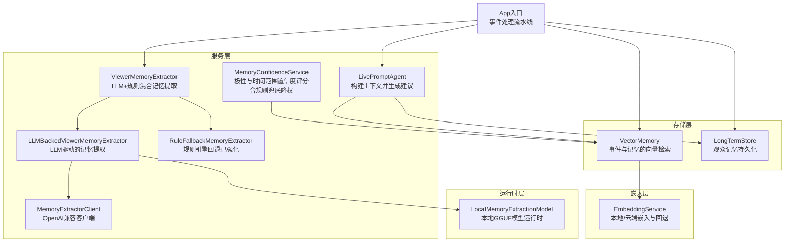
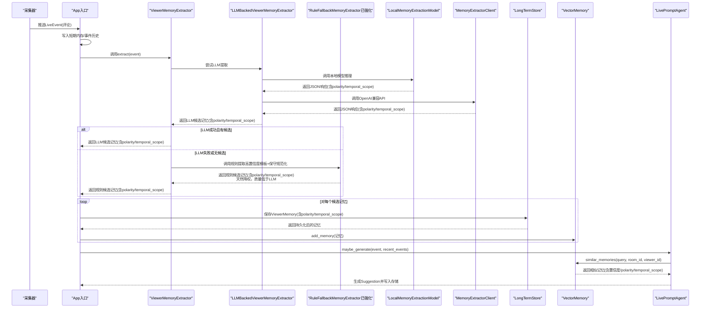
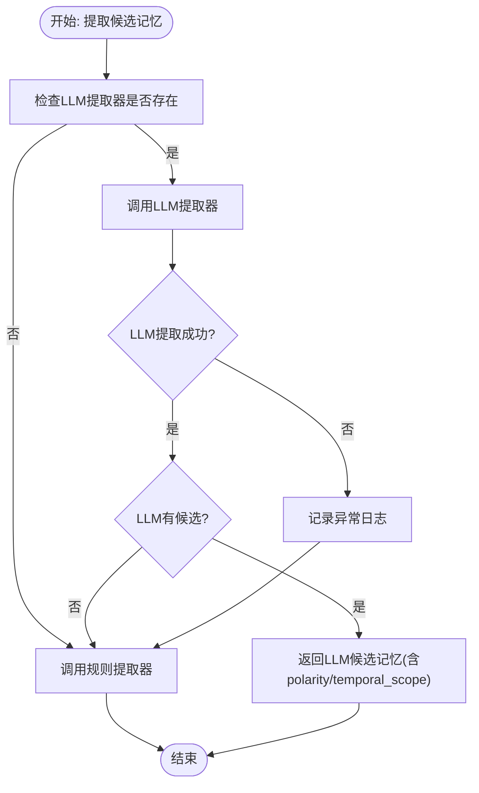
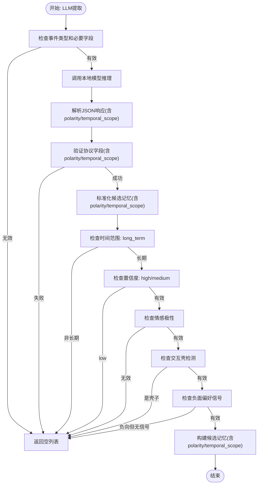
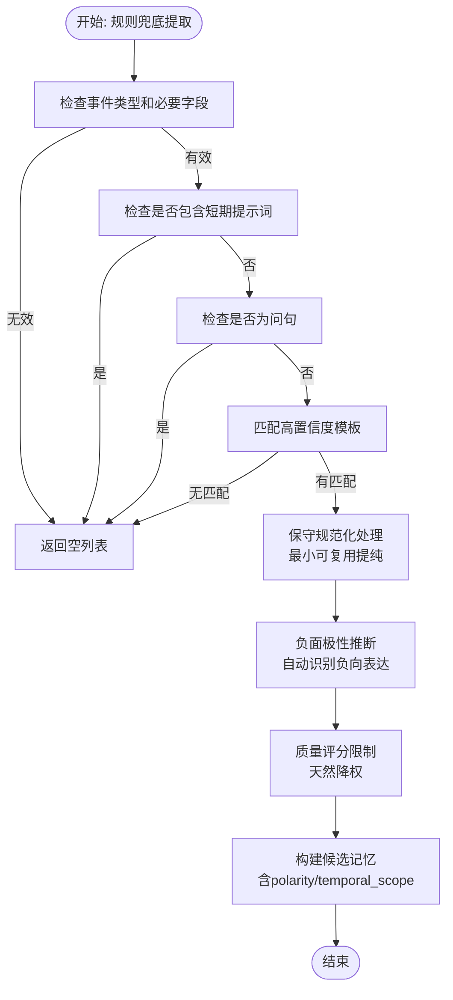
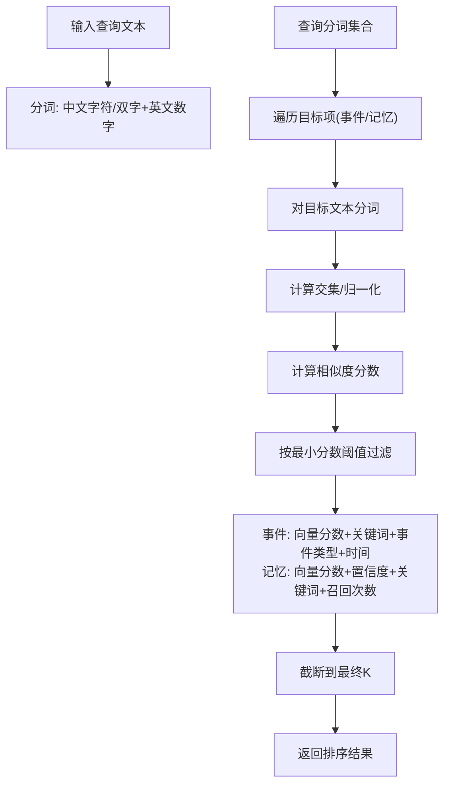
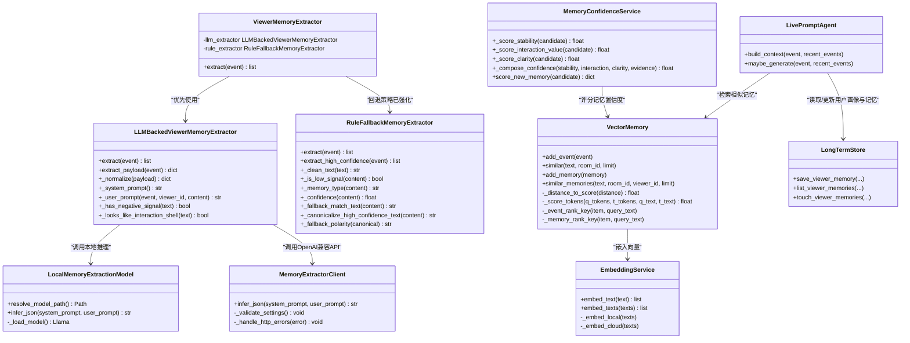

# 记忆提取器

<cite>
**本文引用的文件**
- [backend/services/memory_extractor.py](file://backend/services/memory_extractor.py)
- [backend/services/llm_memory_extractor.py](file://backend/services/llm_memory_extractor.py)
- [backend/services/local_memory_model.py](file://backend/services/local_memory_model.py)
- [backend/services/memory_extractor_client.py](file://backend/services/memory_extractor_client.py)
- [backend/memory/vector_store.py](file://backend/memory/vector_store.py)
- [backend/memory/embedding_service.py](file://backend/memory/embedding_service.py)
- [backend/memory/long_term.py](file://backend/memory/long_term.py)
- [backend/schemas/live.py](file://backend/schemas/live.py)
- [backend/config.py](file://backend/config.py)
- [backend/app.py](file://backend/app.py)
- [backend/services/agent.py](file://backend/services/agent.py)
- [backend/services/memory_confidence_service.py](file://backend/services/memory_confidence_service.py)
- [tests/test_llm_memory_extractor.py](file://tests/test_llm_memory_extractor.py)
- [tests/test_memory_confidence_service.py](file://tests/test_memory_confidence_service.py)
- [docs/superpowers/specs/2026-04-20-rule-fallback-hardening-design.md](file://docs/superpowers/specs/2026-04-20-rule-fallback-hardening-design.md)
</cite>

## 更新摘要
**变更内容**
- **规则回退系统重大强化**：新增高置信度模板、保守规范化处理、负面极性推断和质量评分限制
- **新的高置信度模板**：扩展了饮食限制、负向偏好、稳定偏好和职业背景等模板类型
- **保守规范化处理**：对规则兜底结果进行最小可复用提纯，避免原句整存
- **负面极性推断**：自动识别负面偏好表达并标记为negative
- **质量评分限制**：对规则兜底结果进行天然降权，确保其质量低于LLM结果
- **新增双提示策略**：支持baseline和chain-of-thought(COT)两种提示变体
- **新增交互壳检测**：自动识别和过滤交互壳、问句壳子和情绪壳子
- **新增规范化输出字段**：提供memory_text_raw和memory_text_canonical两个标准化字段
- **新增推理努力级别配置**：支持none、low、medium、high四个推理强度级别
- **新增极性和时间范围提取功能**：LLM记忆提取器现在返回polarity和temporal_scope字段，规则提取器也支持这些默认值

## 目录
1. [简介](#简介)
2. [项目结构](#项目结构)
3. [核心组件](#核心组件)
4. [架构总览](#架构总览)
5. [详细组件分析](#详细组件分析)
6. [依赖关系分析](#依赖关系分析)
7. [性能考量](#性能考量)
8. [故障排查指南](#故障排查指南)
9. [结论](#结论)
10. [附录](#附录)

## 简介
本文件面向DouYin_llm的记忆提取器模块，系统性阐述ViewerMemoryExtractor的工作原理与实现细节，重点覆盖：
- **LLM内存提取器**：基于本地GGUF模型的语义理解记忆提取
- **规则引擎增强**：原有的启发式规则与LLM策略的混合实现，现已大幅强化
- **本地推理支持**：Windows + CPU环境下的本地模型运行时
- **自动降级机制**：LLM失败时的规则引擎回退策略
- **规则回退系统重大强化**：新增高置信度模板、保守规范化处理、负面极性推断和质量评分限制
- **双提示策略**：支持baseline和chain-of-thought(COT)两种提示变体
- **交互壳检测**：自动识别和过滤交互壳、问句壳子和情绪壳子
- **规范化输出字段**：提供memory_text_raw和memory_text_canonical标准化字段
- **推理努力级别**：支持none、low、medium、high四个推理强度级别
- **极性和时间范围提取**：新增polarity和temporal_scope字段支持
- 观众记忆的提取策略与过滤规则
- 文本预处理、相似度计算与置信度评估
- 向量相似度匹配、文本分词与结果排序机制
- 记忆提取在提词建议中的作用与影响因素
- 配置参数、优化技巧与边界情况处理
- 性能调优建议与常见问题解决方案

## 项目结构
记忆提取器位于后端服务层，与向量检索、嵌入服务、长期存储以及主流程集成。关键文件与职责如下：
- **backend/services/memory_extractor.py**：定义ViewerMemoryExtractor，负责从评论事件中抽取可复用的观众记忆，现已增强为LLM+规则混合策略，其中规则引擎经过重大强化
- **backend/services/llm_memory_extractor.py**：新增LLM驱动的记忆提取器，基于本地GGUF模型进行语义理解
- **backend/services/local_memory_model.py**：新增本地内存模型运行时，支持Windows + CPU环境下的本地推理
- **backend/services/memory_extractor_client.py**：新增内存提取器客户端，支持OpenAI兼容的内存提取API
- **backend/memory/vector_store.py**：向量检索与排序、事件与记忆的相似度查询
- **backend/memory/embedding_service.py**：本地/云端嵌入服务与回退哈希嵌入
- **backend/memory/long_term.py**：观众记忆的持久化与更新
- **backend/schemas/live.py**：LiveEvent、ViewerMemory等数据模型
- **backend/config.py**：运行时配置（嵌入模式、阈值、查询限制、LLM内存提取器配置等）
- **backend/app.py**：应用入口，串联事件处理、记忆提取与向量存储
- **backend/services/agent.py**：提词代理，消费记忆用于生成建议
- **backend/services/memory_confidence_service.py**：新增记忆置信度服务，支持极性与时间范围的综合评分，现已针对规则兜底结果进行质量限制

**图表来源**
- [backend/app.py:105-141](file://backend/app.py#L105-L141)
- [backend/services/memory_extractor.py:123-143](file://backend/services/memory_extractor.py#L123-L143)
- [backend/services/llm_memory_extractor.py:35-55](file://backend/services/llm_memory_extractor.py#L35-L55)
- [backend/services/local_memory_model.py:9-89](file://backend/services/local_memory_model.py#L9-L89)
- [backend/services/memory_extractor_client.py:20-44](file://backend/services/memory_extractor_client.py#L20-L44)
- [backend/services/memory_confidence_service.py:1-36](file://backend/services/memory_confidence_service.py#L1-L36)

**章节来源**
- [backend/app.py:105-141](file://backend/app.py#L105-L141)
- [backend/services/memory_extractor.py:123-143](file://backend/services/memory_extractor.py#L123-L143)
- [backend/services/llm_memory_extractor.py:35-55](file://backend/services/llm_memory_extractor.py#L35-L55)
- [backend/services/local_memory_model.py:9-89](file://backend/services/local_memory_model.py#L9-L89)
- [backend/services/memory_extractor_client.py:20-44](file://backend/services/memory_extractor_client.py#L20-L44)
- [backend/services/memory_confidence_service.py:1-36](file://backend/services/memory_confidence_service.py#L1-L36)

## 核心组件
- **ViewerMemoryExtractor**：**已增强**为LLM+规则混合策略，优先使用LLM提取器，失败时回退到规则引擎
- **LLMBackedViewerMemoryExtractor**：**新增**基于本地GGUF模型的记忆提取器，提供更强的语义理解能力
- **LocalMemoryExtractionModel**：**新增**本地内存模型运行时，支持Windows + CPU环境下的本地推理
- **MemoryExtractorClient**：**新增**OpenAI兼容的内存提取器客户端，支持推理努力级别的配置
- **RuleFallbackMemoryExtractor**：**已重大强化**的规则引擎，作为LLM提取器的回退策略，现在包含高置信度模板、保守规范化处理和质量限制
- **MemoryConfidenceService**：**新增**记忆置信度服务，支持极性与时间范围的综合评分，现已针对规则兜底结果进行质量降权
- VectorMemory：提供事件与记忆的向量检索与排序，支持Chroma与内存回退
- EmbeddingService：封装本地SentenceTransformer与云端OpenAI风格接口，失败时回退至HashEmbeddingFunction
- LongTermStore：以SQLite持久化ViewerMemory，维护召回计数、时间戳等元信息
- LivePromptAgent：在生成建议时使用相似记忆作为上下文增强

**章节来源**
- [backend/services/memory_extractor.py:123-143](file://backend/services/memory_extractor.py#L123-L143)
- [backend/services/llm_memory_extractor.py:35-134](file://backend/services/llm_memory_extractor.py#L35-L134)
- [backend/services/local_memory_model.py:9-89](file://backend/services/local_memory_model.py#L9-L89)
- [backend/services/memory_extractor_client.py:20-151](file://backend/services/memory_extractor_client.py#L20-L151)
- [backend/memory/vector_store.py:59-316](file://backend/memory/vector_store.py#L59-L316)
- [backend/memory/embedding_service.py:18-102](file://backend/memory/embedding_service.py#L18-L102)
- [backend/memory/long_term.py:162-174](file://backend/memory/long_term.py#L162-L174)
- [backend/services/agent.py:83-103](file://backend/services/agent.py#L83-L103)
- [backend/services/memory_confidence_service.py:1-36](file://backend/services/memory_confidence_service.py#L1-L36)

## 架构总览
记忆提取器在事件处理流水线中的位置与交互如下：

**图表来源**
- [backend/app.py:161-223](file://backend/app.py#L161-L223)
- [backend/services/memory_extractor.py:129-143](file://backend/services/memory_extractor.py#L129-L143)
- [backend/services/llm_memory_extractor.py:40-54](file://backend/services/llm_memory_extractor.py#L40-L54)
- [backend/services/local_memory_model.py:74-84](file://backend/services/local_memory_model.py#L74-L84)
- [backend/services/memory_extractor_client.py:45-136](file://backend/services/memory_extractor_client.py#L45-L136)

## 详细组件分析

### ViewerMemoryExtractor：LLM+规则混合提取策略
**已更新** ViewerMemoryExtractor现已增强为混合策略，优先使用LLM提取器，失败时回退到规则引擎。

- **输入**：LiveEvent（仅处理评论类型）
- **输出**：候选记忆列表，每项包含memory_text、memory_type、confidence、polarity、temporal_scope
- **关键步骤**
  - **LLM优先尝试**：调用LLMBackedViewerMemoryExtractor.extract()
  - **异常处理**：LLM提取失败时记录异常并回退到规则引擎
  - **空值检查**：LLM返回空列表时回退到规则引擎
  - **规则回退**：调用RuleFallbackMemoryExtractor.extract()生成候选记忆

**图表来源**
- [backend/services/memory_extractor.py:129-143](file://backend/services/memory_extractor.py#L129-L143)

**章节来源**
- [backend/services/memory_extractor.py:123-143](file://backend/services/memory_extractor.py#L123-L143)

### LLMBackedViewerMemoryExtractor：本地GGUF模型驱动的记忆提取
**新增** 基于本地GGUF模型的记忆提取器，提供更强的语义理解能力。

- **输入**：LiveEvent（仅处理评论类型）
- **输出**：标准化的候选记忆列表，包含polarity和temporal_scope字段
- **关键特性**
  - **严格协议验证**：确保返回合法JSON格式，包含polarity和temporal_scope字段
  - **长期记忆过滤**：仅提取长期有效的记忆（temporal_scope必须为long_term）
  - **情感极性检测**：支持positive、negative、neutral三种情感极性
  - **置信度映射**：将模型置信度转换为系统置信度（偏好0.86，上下文0.78，事实0.74）
  - **负面信号处理**：自动检测并验证负面偏好表达
  - **交互壳检测**：自动识别和过滤交互壳、问句壳子和情绪壳子
  - **规范化输出**：提供memory_text_raw和memory_text_canonical两个标准化字段

**图表来源**
- [backend/services/llm_memory_extractor.py:40-103](file://backend/services/llm_memory_extractor.py#L40-L103)

**章节来源**
- [backend/services/llm_memory_extractor.py:35-206](file://backend/services/llm_memory_extractor.py#L35-L206)

### LocalMemoryExtractionModel：本地GGUF模型运行时
**新增** 支持Windows + CPU环境下的本地推理，自动下载和管理GGUF模型文件。

- **模型管理**
  - **路径解析**：支持显式模型路径和默认目录
  - **自动下载**：当模型不存在时自动从URL下载
  - **缓存机制**：本地模型文件复用，避免重复下载
- **推理接口**
  - **JSON格式**：强制返回JSON格式响应，包含polarity和temporal_scope字段
  - **参数配置**：支持上下文大小、线程数、超时设置
  - **错误处理**：完善的异常处理和资源清理

**章节来源**
- [backend/services/local_memory_model.py:9-89](file://backend/services/local_memory_model.py#L9-L89)

### MemoryExtractorClient：OpenAI兼容内存提取器客户端
**新增** 提供OpenAI兼容的内存提取器客户端，支持推理努力级别的配置。

- **推理努力级别**
  - **none**：无额外推理，快速响应
  - **low**：基础推理，平衡性能与准确性
  - **medium**：中等推理，提高准确性
  - **high**：高级推理，最高准确性但可能较慢
- **配置验证**
  - **URL验证**：确保基础URL不为空
  - **模型验证**：确保模型名称不为空
  - **参数验证**：验证max_tokens、timeout_seconds等参数的有效性
- **错误处理**
  - **HTTP错误处理**：捕获并处理HTTP请求错误
  - **JSON解析错误**：处理无效的JSON响应
  - **响应形状验证**：确保响应包含必需的字段（包括polarity和temporal_scope）

**章节来源**
- [backend/services/memory_extractor_client.py:20-151](file://backend/services/memory_extractor_client.py#L20-L151)

### RuleFallbackMemoryExtractor：规则引擎回退策略（已重大强化）
**已重大强化** 作为LLM提取器的回退策略，现在包含高置信度模板、保守规范化处理和质量限制。

- **高置信度模板扩展**
  - **饮食限制**：`我不太能吃...`、`我不能吃...`、`我忌口...`
  - **负向偏好**：`我不喜欢...`
  - **稳定偏好**：`我一直都喜欢...`、`我平时都喝...`
  - **职业背景**：`我在...做...`
  - **保留模板**：`我在...上班`、`我家里养了...`、`我一直都只用...`、`我(租房)住在...附近`
- **保守规范化处理**
  - **最小可复用提纯**：避免原句整存，生成memory_text_canonical
  - **去除口头语**：`其实`、`吧`、`啊`、`呢`
  - **去除问句壳子**：`是不是`、`吗`、`嘛`、`呢`
  - **去除附属解释**：`这样通勤方便点`等
- **负面极性推断**
  - **自动识别**：`不喜欢`、`不能吃`、`不太能吃`、`忌口`
  - **标记为negative**：对明显负向限制表达进行极性标注
- **质量评分限制**
  - **天然降权**：规则兜底结果在质量排序上天然低于LLM结果
  - **保守置信度**：confidence上限低于LLM常规结果
  - **子分降权**：clarity_score和interaction_value_score默认不超过LLM提纯结果

**图表来源**
- [backend/services/memory_extractor.py:190-221](file://backend/services/memory_extractor.py#L190-L221)
- [backend/services/memory_extractor.py:159-163](file://backend/services/memory_extractor.py#L159-L163)

**章节来源**
- [backend/services/memory_extractor.py:65-121](file://backend/services/memory_extractor.py#L65-L121)
- [backend/services/memory_extractor.py:190-221](file://backend/services/memory_extractor.py#L190-L221)
- [backend/services/memory_extractor.py:159-163](file://backend/services/memory_extractor.py#L159-L163)

### MemoryConfidenceService：极性与时间范围置信度服务（已增强）
**新增** 支持极性与时间范围的综合置信度评分，现已针对规则兜底结果进行质量降权。

- **稳定性评分**：基于temporal_scope和记忆类型计算
  - long_term记忆：+0.45稳定性分数
  - preference记忆：+0.1额外稳定性
  - 包含短期提示词：-0.35稳定性分数
- **交互价值评分**：基于记忆内容的高价值提示词和长度
  - 高价值提示词：+0.5交互价值
  - 短记忆（<=16字符）：+0.1额外价值
- **清晰度评分**：基于记忆文本的长度和噪声令牌
  - 4-16字符：+0.45清晰度
  - 4-24字符：+0.25清晰度
  - 包含噪声令牌：-0.25清晰度
  - 包含问号：-0.25清晰度
- **证据评分**：基于证据计数和最后确认时间
  - 基础分数：+0.2
  - 每个证据：+0.15（最多+0.6）
  - 最后确认时间：+0.05
- **规则兜底降权**：对extraction_source为rule_fallback的候选进行质量限制
  - clarity_score上限：0.7
  - interaction_value_score上限：0.65
  - confidence上限：0.75

**章节来源**
- [backend/services/memory_confidence_service.py:1-36](file://backend/services/memory_confidence_service.py#L1-L36)
- [backend/services/memory_confidence_service.py:77-88](file://backend/services/memory_confidence_service.py#L77-L88)

### 文本预处理与相似度计算
- **文本清洗**：统一空白、去首尾标点
- **分词策略**：小写化、去空白；中文按字符与双字符滑窗聚合；英文数字按词
- **向量嵌入**：优先Chroma+EmbeddingService；失败回退至HashEmbeddingFunction
- **相似度与排序**
  - **事件相似度**：向量距离转分数，结合是否包含查询词、事件类型权重、时间戳排序
  - **记忆相似度**：向量分数+置信度加权+包含查询词+召回次数加权，再按更新时间排序

**图表来源**
- [backend/memory/vector_store.py:19-31](file://backend/memory/vector_store.py#L19-L31)
- [backend/memory/vector_store.py:87-133](file://backend/memory/vector_store.py#L87-L133)
- [backend/memory/vector_store.py:172-230](file://backend/memory/vector_store.py#L172-L230)
- [backend/memory/vector_store.py:257-316](file://backend/memory/vector_store.py#L257-L316)

**章节来源**
- [backend/memory/vector_store.py:19-31](file://backend/memory/vector_store.py#L19-L31)
- [backend/memory/vector_store.py:87-133](file://backend/memory/vector_store.py#L87-L133)
- [backend/memory/vector_store.py:172-230](file://backend/memory/vector_store.py#L172-L230)
- [backend/memory/vector_store.py:257-316](file://backend/memory/vector_store.py#L257-L316)

### 置信度评估与记忆类型判定
- **置信度**：基础0.45，长度≥10/18分别+0.1，出现记忆提示词+0.15，出现"我"+0.1，上限0.92
- **记忆类型**：
  - **偏好**：包含"喜欢/爱吃/一直用/常买"
  - **计划**：包含"今晚/明天/周末/准备/打算/要去"
  - **场景**：包含"公司/附近/家里/上班/下班"
  - **其他**：默认事实型
- **极性默认值**：规则引擎默认返回neutral极性
- **时间范围默认值**：规则引擎默认返回long_term时间范围

**章节来源**
- [backend/services/memory_extractor.py:90-100](file://backend/services/memory_extractor.py#L90-L100)
- [backend/services/memory_extractor.py:81-88](file://backend/services/memory_extractor.py#L81-L88)

### 在提词建议中的作用与影响因素
- **影响路径**：事件进入后，先提取记忆并持久化到长库，随后Agent在生成建议时调用similar_memories获取与当前内容最相关的记忆，作为上下文增强
- **影响因素**：
  - **相似度阈值与查询限制**：由配置项控制，影响召回数量与质量
  - **记忆置信度**：提升高可信记忆的排序权重
  - **极性信息**：positive、negative、neutral极性影响建议的情感倾向
  - **时间范围信息**：long_term和short_term影响记忆的适用性
  - **回调次数与更新时间**：增加召回权重，鼓励复用近期活跃记忆
  - **房间与观众维度**：仅在相同房间与同一观众下检索，避免跨房间干扰
  - **规则兜底降权**：规则兜底结果在质量排序上天然低于LLM结果

**章节来源**
- [backend/services/agent.py:83-103](file://backend/services/agent.py#L83-L103)
- [backend/memory/vector_store.py:257-316](file://backend/memory/vector_store.py#L257-L316)
- [backend/config.py:118-121](file://backend/config.py#L118-L121)

### 配置参数与优化建议
**新增** LLM内存提取器相关配置

- **LLM内存提取器配置**
  - `memory_extractor_enabled`：启用/禁用LLM内存提取器，默认true
  - `memory_extractor_mode`：运行模式，local_llm（本地GGUF模型）
  - `memory_extractor_model_path`：模型文件路径，支持绝对路径或相对路径
  - `memory_extractor_model_url`：模型下载URL，当本地模型不存在时自动下载
  - `memory_extractor_model_filename`：模型文件名，默认"memory-extractor.gguf"
  - `memory_extractor_context_size`：上下文大小，默认4096
  - `memory_extractor_max_tokens`：最大生成token数，默认512
  - `memory_extractor_timeout_seconds`：推理超时时间，默认30秒
  - `memory_extractor_threads`：线程数，默认CPU核心数
  - `memory_extractor_prompt_variant`：提示变体，支持"baseline"和"COT"，默认"COT"
  - `memory_extractor_reasoning_effort`：推理努力级别，支持"none"、"low"、"medium"、"high"，默认"none"

- **嵌入相关**
  - embedding_mode：local/cloud/hash回退
  - embedding_model/base_url/api_key/timeout：云端或本地模型参数
  - local_embedding_device/batch_size：本地模型设备与批大小

- **语义检索相关**
  - semantic_event_min_score/semantic_memory_min_score：事件/记忆最小分数阈值
  - semantic_event_query_limit/semantic_memory_query_limit：查询阶段K
  - semantic_final_k：最终返回K

- **新增极性和时间范围配置**
  - `memory_type_confidence`：不同记忆类型的置信度基准值
    - preference：0.86
    - context：0.78  
    - fact：0.74
  - `polarity_detection`：极性检测开关，默认开启

- **规则兜底质量配置**
  - `rule_fallback_clarity_cap`：规则兜底清晰度评分上限，默认0.7
  - `rule_fallback_interaction_cap`：规则兜底交互价值评分上限，默认0.65
  - `rule_fallback_confidence_cap`：规则兜底置信度上限，默认0.75

- **使用建议**
  - 若本地GPU可用，建议设置local_embedding_device为cuda并适当增大batch_size
  - 在低延迟要求下，可降低semantic_final_k以减少排序成本
  - 当云端嵌入不稳定时，启用hash回退并观察fallback日志
  - **LLM内存提取器**：首次启动会自动下载模型文件，确保网络连接正常
  - **推理努力级别**：对于简单任务使用"none"，对于复杂推理使用"high"
  - **极性分析**：negative极性记忆需要包含负面信号词汇才能通过验证
  - **规则兜底质量**：规则兜底结果天然低于LLM结果，这是设计使然

**章节来源**
- [backend/config.py:80-136](file://backend/config.py#L80-L136)
- [backend/memory/embedding_service.py:18-48](file://backend/memory/embedding_service.py#L18-L48)
- [backend/memory/vector_store.py:86-108](file://backend/memory/vector_store.py#L86-L108)
- [backend/services/memory_extractor_client.py:23-43](file://backend/services/memory_extractor_client.py#L23-43)
- [backend/services/memory_confidence_service.py:17-27](file://backend/services/memory_confidence_service.py#L17-L27)

### 边界情况与处理
- **评论为空或非评论事件**：直接返回空列表
- **LLM提取器不可用**：自动回退到规则引擎
- **LLM推理失败**：记录异常并回退到规则引擎
- **LLM返回空候选**：回退到规则引擎
- **低信号内容**：长度过短、高频无意义词、交易类短句等被过滤
- **记忆类型缺失**：未命中任何类别时默认为事实型
- **交互壳检测**：问句壳子、互动壳子、情绪壳子被自动过滤
- **极性验证失败**：negative极性但缺少负面信号词汇会被过滤
- **时间范围验证失败**：非long_term时间范围会被过滤
- **向量检索失败**：Chroma不可用或异常时回退至内存索引与分词相似度
- **规则兜底限制**：仅在LLM异常时触发，且仅高置信模板放行，天然降权

**章节来源**
- [backend/services/memory_extractor.py:133-142](file://backend/services/memory_extractor.py#L133-L142)
- [backend/services/llm_memory_extractor.py:40-47](file://backend/services/llm_memory_extractor.py#L40-L47)
- [backend/memory/vector_store.py:80-84](file://backend/memory/vector_store.py#L80-L84)
- [backend/memory/vector_store.py:108-133](file://backend/memory/vector_store.py#L108-L133)

## 依赖关系分析

**图表来源**
- [backend/services/memory_extractor.py:123-143](file://backend/services/memory_extractor.py#L123-L143)
- [backend/services/llm_memory_extractor.py:35-206](file://backend/services/llm_memory_extractor.py#L35-L206)
- [backend/services/local_memory_model.py:9-89](file://backend/services/local_memory_model.py#L9-L89)
- [backend/services/memory_extractor_client.py:20-151](file://backend/services/memory_extractor_client.py#L20-L151)
- [backend/memory/vector_store.py:59-316](file://backend/memory/vector_store.py#L59-L316)
- [backend/memory/embedding_service.py:18-102](file://backend/memory/embedding_service.py#L18-L102)
- [backend/memory/long_term.py:44-62](file://backend/memory/long_term.py#L44-L62)
- [backend/services/agent.py:23-142](file://backend/services/agent.py#L23-L142)
- [backend/services/memory_confidence_service.py:1-36](file://backend/services/memory_confidence_service.py#L1-L36)

## 性能考量
- **向量检索**
  - 优先使用Chroma与EmbeddingService，失败回退至内存分词相似度
  - 通过semantic_event_query_limit与semantic_final_k平衡召回数量与排序成本
- **文本预处理**
  - 分词采用集合去重与滑窗，复杂度与文本长度近似线性
- **批量嵌入**
  - 本地模型支持batch_size参数，建议根据显存调整
- **LLM推理性能**
  - **本地推理**：首次启动需要下载模型文件，后续启动速度较快
  - **线程配置**：合理设置memory_extractor_threads参数以平衡性能
  - **上下文大小**：根据实际需求调整memory_extractor_context_size
  - **推理努力级别**：选择合适的推理强度以平衡性能与准确性
  - **极性分析**：negative极性检测增加了额外的字符串匹配开销
- **缓存与回退**
  - 失败时记录一次警告日志，避免重复告警
  - LLM失败时自动回退到规则引擎，确保系统稳定性
- **置信度计算**
  - MemoryConfidenceService的评分计算复杂度较低，主要为字符串匹配操作
  - **规则兜底降权**：对rule_fallback候选进行质量限制，避免过度降权影响性能
- **规则兜底性能**
  - **高置信度模板匹配**：使用正则表达式进行快速匹配
  - **保守规范化**：仅进行必要的字符串处理，避免复杂的NLP操作
  - **极性推断**：简单的关键词匹配，性能开销较小

**章节来源**
- [backend/memory/vector_store.py:80-84](file://backend/memory/vector_store.py#L80-L84)
- [backend/memory/embedding_service.py:65-73](file://backend/memory/embedding_service.py#L65-L73)
- [backend/config.py:128-135](file://backend/config.py#L128-L135)
- [backend/services/local_memory_model.py:60-72](file://backend/services/local_memory_model.py#L60-L72)
- [backend/services/memory_extractor_client.py:23-43](file://backend/services/memory_extractor_client.py#L23-43)
- [backend/services/memory_confidence_service.py:17-36](file://backend/services/memory_confidence_service.py#L17-L36)

## 故障排查指南
- **记忆未被提取**
  - 检查事件类型是否为评论
  - 确认内容长度与是否命中低信号规则
  - 查看是否存在记忆提示词或长度阈值
  - **LLM相关**：检查memory_extractor_enabled配置是否正确
  - **交互壳检测**：检查内容是否被误判为交互壳
  - **极性验证**：检查negative极性记忆是否包含负面信号词汇
  - **时间范围**：检查temporal_scope是否为long_term
  - **规则兜底**：检查是否为LLM异常导致的规则兜底触发
- **LLM提取失败**
  - 检查本地模型文件是否存在且有效
  - 确认memory_extractor_model_path和memory_extractor_model_url配置
  - 查看本地推理日志，确认模型加载是否成功
  - 检查memory_extractor_threads和memory_extractor_context_size设置
  - **推理努力级别**：检查memory_extractor_reasoning_effort配置
- **记忆未被检索**
  - 检查房间ID与观众ID是否一致
  - 调整semantic_memory_min_score与semantic_memory_query_limit
  - 确认Chroma可用且集合已创建
  - **极性过滤**：检查是否需要考虑polarity字段的影响
  - **时间范围过滤**：检查temporal_scope字段的过滤逻辑
  - **规则兜底降权**：检查规则兜底结果是否因质量限制而未被检索
- **嵌入失败**
  - 查看EmbeddingService日志，确认云端凭据与超时设置
  - 切换embedding_mode为local或hash回退
- **建议生成质量不佳**
  - 提升semantic_final_k或调整记忆置信度权重
  - 检查相似历史与用户画像是否充足
  - **极性分析**：考虑polarity对建议情感的影响
  - **时间范围**：考虑temporal_scope对记忆适用性的影响
  - **规则兜底质量**：检查规则兜底结果是否因天然降权而影响质量
- **模型下载失败**
  - 检查网络连接和memory_extractor_model_url配置
  - 确认磁盘空间足够存储模型文件
  - 查看下载日志，确认HTTP状态码
- **提示变体问题**
  - 检查memory_extractor_prompt_variant配置
  - 确认提示变体设置是否符合预期
- **规则兜底异常**
  - **模板匹配**：检查高置信度模板是否正确匹配
  - **规范化处理**：确认保守规范化是否正确执行
  - **极性推断**：检查负面极性推断是否正确识别
  - **质量降权**：确认规则兜底质量限制是否生效
  - **测试验证**：运行相关测试确保功能正常

**章节来源**
- [backend/services/memory_extractor.py:133-142](file://backend/services/memory_extractor.py#L133-L142)
- [backend/services/llm_memory_extractor.py:40-54](file://backend/services/llm_memory_extractor.py#L40-L54)
- [backend/memory/vector_store.py:257-316](file://backend/memory/vector_store.py#L257-L316)
- [backend/memory/embedding_service.py:38-48](file://backend/memory/embedding_service.py#L38-L48)
- [backend/services/local_memory_model.py:33-46](file://backend/services/local_memory_model.py#L33-L46)
- [backend/services/memory_extractor_client.py:31-43](file://backend/services/memory_extractor_client.py#L31-43)

## 结论
ViewerMemoryExtractor通过LLM+规则混合策略，实现了从简单的启发式规则到强大的语义理解的演进。**规则回退系统经过重大强化**，新增高置信度模板、保守规范化处理、负面极性推断和质量评分限制，显著提升了规则兜底的质量和安全性。新增的LLM内存提取器提供了更强的语义理解和记忆提取能力，同时保持了系统的稳定性。其设计兼顾准确性与性能，在云端/本地/回退多模式下保持稳定性。结合合理的配置与调优，可在直播场景中有效提升提词建议的个性化与连贯性。

**主要改进**：
- **规则回退系统重大强化**：新增高置信度模板、保守规范化处理、负面极性推断和质量评分限制
- **增强语义理解**：LLM驱动的记忆提取提供更准确的语义理解
- **本地推理支持**：Windows + CPU环境下无需网络即可运行
- **自动降级机制**：确保系统在各种情况下都能稳定运行
- **双提示策略**：支持baseline和chain-of-thought(COT)两种提示变体，提升提取准确性
- **交互壳检测**：自动识别和过滤交互壳、问句壳子和情绪壳子，提高提取质量
- **规范化输出**：提供memory_text_raw和memory_text_canonical标准化字段
- **推理努力级别**：支持none、low、medium、high四个推理强度级别
- **极性和时间范围支持**：新增polarity和temporal_scope字段，提供更丰富的语义信息
- **置信度综合评分**：MemoryConfidenceService支持极性与时间范围的综合置信度评估，现已针对规则兜底结果进行质量限制
- **配置灵活性**：支持多种部署模式和参数调优

## 附录
- **数据模型参考**
  - LiveEvent：事件载体，包含用户身份、内容与元数据
  - ViewerMemory：观众记忆，包含记忆文本、类型、置信度、极性、时间范围与元信息
- **关键流程路径**
  - 事件处理与记忆提取：[backend/app.py:161-223](file://backend/app.py#L161-L223)
  - LLM内存提取器实现：[backend/services/llm_memory_extractor.py:35-206](file://backend/services/llm_memory_extractor.py#L35-L206)
  - 本地模型运行时：[backend/services/local_memory_model.py:9-89](file://backend/services/local_memory_model.py#L9-L89)
  - 内存提取器客户端：[backend/services/memory_extractor_client.py:20-151](file://backend/services/memory_extractor_client.py#L20-L151)
  - 规则引擎回退（已强化）：[backend/services/memory_extractor.py:65-121](file://backend/services/memory_extractor.py#L65-L121)
  - 相似记忆检索：[backend/memory/vector_store.py:257-316](file://backend/memory/vector_store.py#L257-L316)
  - 嵌入服务与回退：[backend/memory/embedding_service.py:18-102](file://backend/memory/embedding_service.py#L18-L102)
  - 长期存储与持久化：[backend/memory/long_term.py:162-174](file://backend/memory/long_term.py#L162-L174)
  - 提词代理上下文构建：[backend/services/agent.py:83-103](file://backend/services/agent.py#L83-L103)
  - 极性与时间范围置信度服务（已增强）：[backend/services/memory_confidence_service.py:1-36](file://backend/services/memory_confidence_service.py#L1-L36)
- **测试参考**
  - 规则兜底质量测试：[tests/test_llm_memory_extractor.py:369-377](file://tests/test_llm_memory_extractor.py#L369-L377)
  - 规则兜底质量评分测试：[tests/test_memory_confidence_service.py:81-107](file://tests/test_memory_confidence_service.py#L81-L107)
- **设计文档参考**
  - 规则兜底强化设计文档：[docs/superpowers/specs/2026-04-20-rule-fallback-hardening-design.md](file://docs/superpowers/specs/2026-04-20-rule-fallback-hardening-design.md)