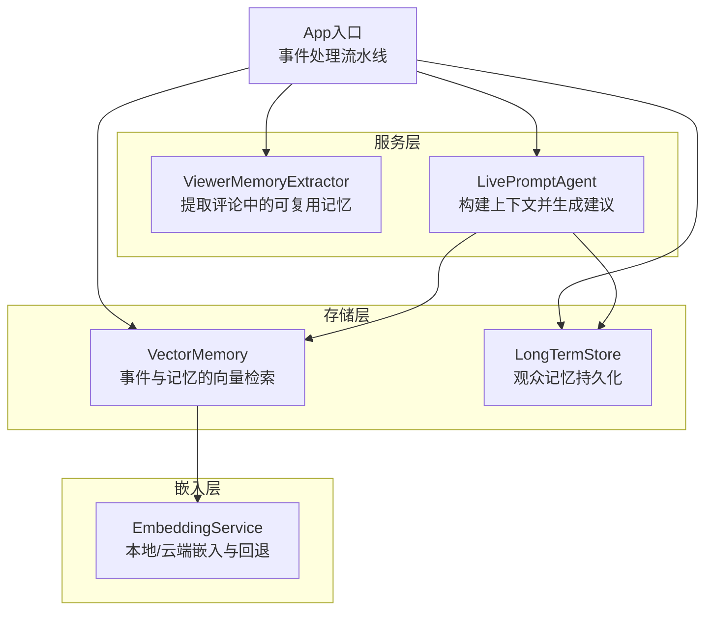
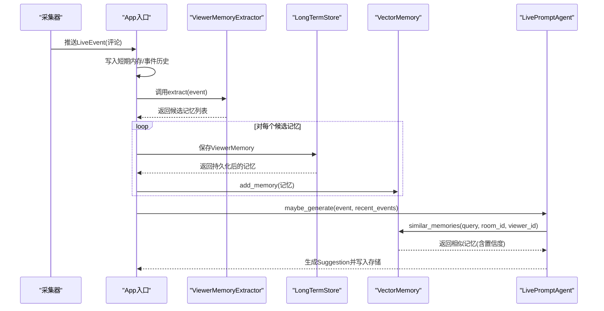
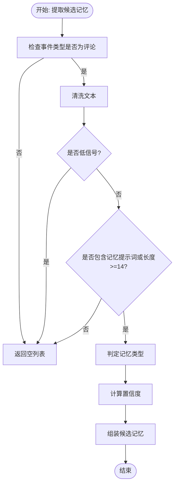
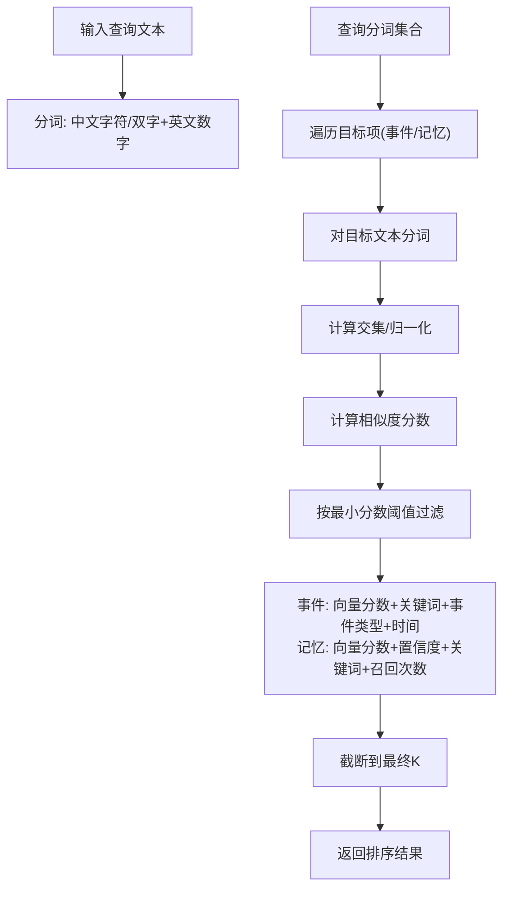
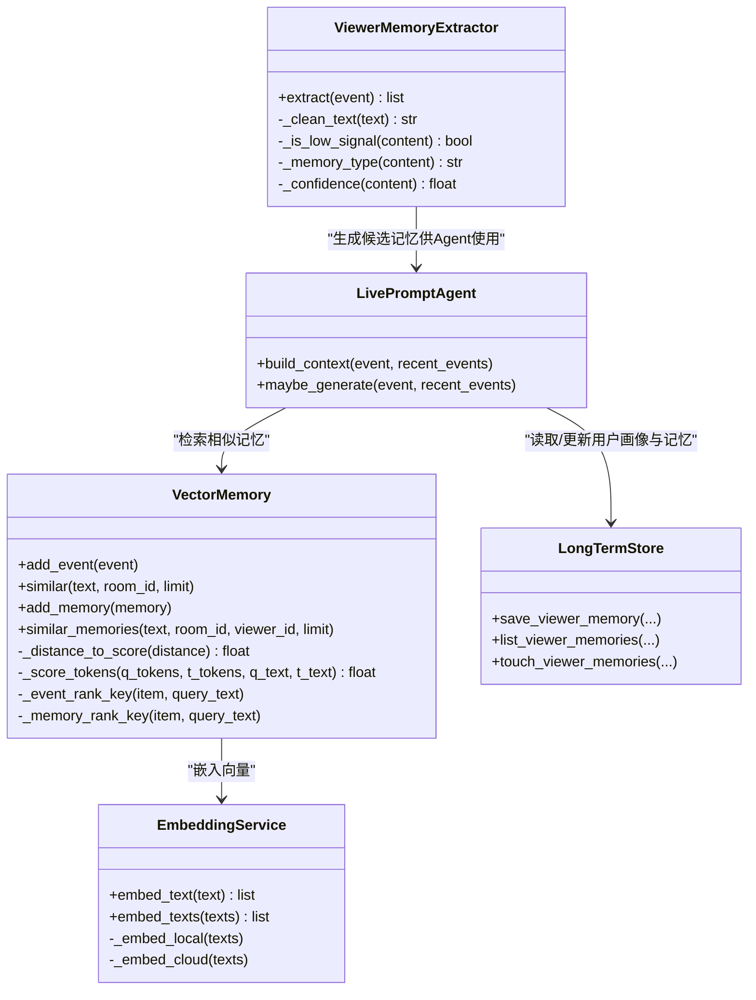

# 记忆提取器

<cite>
**本文引用的文件**
- [backend/services/memory_extractor.py](file://backend/services/memory_extractor.py)
- [backend/memory/vector_store.py](file://backend/memory/vector_store.py)
- [backend/memory/embedding_service.py](file://backend/memory/embedding_service.py)
- [backend/memory/long_term.py](file://backend/memory/long_term.py)
- [backend/schemas/live.py](file://backend/schemas/live.py)
- [backend/config.py](file://backend/config.py)
- [backend/app.py](file://backend/app.py)
- [backend/services/agent.py](file://backend/services/agent.py)
</cite>

## 目录
1. [简介](#简介)
2. [项目结构](#项目结构)
3. [核心组件](#核心组件)
4. [架构总览](#架构总览)
5. [详细组件分析](#详细组件分析)
6. [依赖关系分析](#依赖关系分析)
7. [性能考量](#性能考量)
8. [故障排查指南](#故障排查指南)
9. [结论](#结论)
10. [附录](#附录)

## 简介
本文件面向DouYin_llm的记忆提取器模块，系统性阐述ViewerMemoryExtractor的工作原理与实现细节，重点覆盖：
- 观众记忆的提取策略与过滤规则
- 文本预处理、相似度计算与置信度评估
- 向量相似度匹配、文本分词与结果排序机制
- 记忆提取在提词建议中的作用与影响因素
- 配置参数、优化技巧与边界情况处理
- 性能调优建议与常见问题解决方案

## 项目结构
记忆提取器位于后端服务层，与向量检索、嵌入服务、长期存储以及主流程集成。关键文件与职责如下：
- backend/services/memory_extractor.py：定义ViewerMemoryExtractor，负责从评论事件中抽取可复用的观众记忆
- backend/memory/vector_store.py：向量检索与排序、事件与记忆的相似度查询
- backend/memory/embedding_service.py：本地/云端嵌入服务与回退哈希嵌入
- backend/memory/long_term.py：观众记忆的持久化与更新
- backend/schemas/live.py：LiveEvent、ViewerMemory等数据模型
- backend/config.py：运行时配置（嵌入模式、阈值、查询限制等）
- backend/app.py：应用入口，串联事件处理、记忆提取与向量存储
- backend/services/agent.py：提词代理，消费记忆用于生成建议

图表来源
- [backend/app.py:73-102](file://backend/app.py#L73-L102)
- [backend/services/memory_extractor.py:99-117](file://backend/services/memory_extractor.py#L99-L117)
- [backend/services/agent.py:83-103](file://backend/services/agent.py#L83-L103)
- [backend/memory/vector_store.py:59-84](file://backend/memory/vector_store.py#L59-L84)
- [backend/memory/embedding_service.py:18-48](file://backend/memory/embedding_service.py#L18-L48)
- [backend/memory/long_term.py:44-62](file://backend/memory/long_term.py#L44-L62)

章节来源
- [backend/app.py:73-102](file://backend/app.py#L73-L102)
- [backend/services/memory_extractor.py:99-117](file://backend/services/memory_extractor.py#L99-L117)
- [backend/services/agent.py:83-103](file://backend/services/agent.py#L83-L103)
- [backend/memory/vector_store.py:59-84](file://backend/memory/vector_store.py#L59-L84)
- [backend/memory/embedding_service.py:18-48](file://backend/memory/embedding_service.py#L18-L48)
- [backend/memory/long_term.py:44-62](file://backend/memory/long_term.py#L44-L62)

## 核心组件
- ViewerMemoryExtractor：从LiveEvent的评论内容中提取“可复用记忆”，返回memory_text、memory_type、confidence三元组
- VectorMemory：提供事件与记忆的向量检索与排序，支持Chroma与内存回退
- EmbeddingService：封装本地SentenceTransformer与云端OpenAI风格接口，失败时回退至HashEmbeddingFunction
- LongTermStore：以SQLite持久化ViewerMemory，维护召回计数、时间戳等元信息
- LivePromptAgent：在生成建议时使用相似记忆作为上下文增强

章节来源
- [backend/services/memory_extractor.py:62-117](file://backend/services/memory_extractor.py#L62-L117)
- [backend/memory/vector_store.py:59-316](file://backend/memory/vector_store.py#L59-L316)
- [backend/memory/embedding_service.py:18-102](file://backend/memory/embedding_service.py#L18-L102)
- [backend/memory/long_term.py:162-174](file://backend/memory/long_term.py#L162-L174)
- [backend/services/agent.py:83-103](file://backend/services/agent.py#L83-L103)

## 架构总览
记忆提取器在事件处理流水线中的位置与交互如下：

图表来源
- [backend/app.py:73-102](file://backend/app.py#L73-L102)
- [backend/services/memory_extractor.py:99-117](file://backend/services/memory_extractor.py#L99-L117)
- [backend/memory/vector_store.py:257-316](file://backend/memory/vector_store.py#L257-L316)
- [backend/services/agent.py:83-103](file://backend/services/agent.py#L83-L103)

## 详细组件分析

### ViewerMemoryExtractor：评论到记忆的提取策略
- 输入：LiveEvent（仅处理评论类型）
- 输出：候选记忆列表，每项包含memory_text、memory_type、confidence
- 关键步骤
  - 文本清洗：去除多余空白与标点，保留中文字符与英文数字
  - 低信号过滤：长度过短、特定高频无意义词、交易类关键词且长度较短
  - 记忆类型判定：偏好、计划、场景、事实四类
  - 置信度评分：基于长度、提示词出现次数、第一人称等加权，上限0.92
  - 最终筛选：若无记忆提示词且长度不足阈值，则丢弃

图表来源
- [backend/services/memory_extractor.py:99-117](file://backend/services/memory_extractor.py#L99-L117)
- [backend/services/memory_extractor.py:63-97](file://backend/services/memory_extractor.py#L63-L97)

章节来源
- [backend/services/memory_extractor.py:62-117](file://backend/services/memory_extractor.py#L62-L117)

### 文本预处理与相似度计算
- 文本清洗：统一空白、去首尾标点
- 分词策略：小写化、去空白；中文按字符与双字符滑窗聚合；英文数字按词
- 向量嵌入：优先Chroma+EmbeddingService；失败回退至HashEmbeddingFunction
- 相似度与排序
  - 事件相似度：向量距离转分数，结合是否包含查询词、事件类型权重、时间戳排序
  - 记忆相似度：向量分数+置信度加权+包含查询词+召回次数加权，再按更新时间排序

图表来源
- [backend/memory/vector_store.py:19-31](file://backend/memory/vector_store.py#L19-L31)
- [backend/memory/vector_store.py:87-133](file://backend/memory/vector_store.py#L87-L133)
- [backend/memory/vector_store.py:172-230](file://backend/memory/vector_store.py#L172-L230)
- [backend/memory/vector_store.py:257-316](file://backend/memory/vector_store.py#L257-L316)

章节来源
- [backend/memory/vector_store.py:19-31](file://backend/memory/vector_store.py#L19-L31)
- [backend/memory/vector_store.py:87-133](file://backend/memory/vector_store.py#L87-L133)
- [backend/memory/vector_store.py:172-230](file://backend/memory/vector_store.py#L172-L230)
- [backend/memory/vector_store.py:257-316](file://backend/memory/vector_store.py#L257-L316)

### 置信度评估与记忆类型判定
- 置信度：基础0.45，长度≥10/18分别+0.1，出现记忆提示词+0.15，出现“我”+0.1，上限0.92
- 记忆类型：
  - 偏好：包含“喜欢/爱吃/一直用/常买”
  - 计划：包含“今晚/明天/周末/准备/打算/要去”
  - 场景：包含“公司/附近/家里/上班/下班”
  - 其他：默认事实型

章节来源
- [backend/services/memory_extractor.py:87-97](file://backend/services/memory_extractor.py#L87-L97)
- [backend/services/memory_extractor.py:78-85](file://backend/services/memory_extractor.py#L78-L85)

### 在提词建议中的作用与影响因素
- 影响路径：事件进入后，先提取记忆并持久化到长库，随后Agent在生成建议时调用similar_memories获取与当前内容最相关的记忆，作为上下文增强
- 影响因素：
  - 相似度阈值与查询限制：由配置项控制，影响召回数量与质量
  - 记忆置信度：提升高可信记忆的排序权重
  - 回调次数与更新时间：增加召回权重，鼓励复用近期活跃记忆
  - 房间与观众维度：仅在相同房间与同一观众下检索，避免跨房间干扰

章节来源
- [backend/services/agent.py:83-103](file://backend/services/agent.py#L83-L103)
- [backend/memory/vector_store.py:257-316](file://backend/memory/vector_store.py#L257-L316)
- [backend/config.py:71-75](file://backend/config.py#L71-L75)

### 配置参数与优化建议
- 嵌入相关
  - embedding_mode：local/cloud/hash回退
  - embedding_model/base_url/api_key/timeout：云端或本地模型参数
  - local_embedding_device/batch_size：本地模型设备与批大小
- 语义检索相关
  - semantic_event_min_score/semantic_memory_min_score：事件/记忆最小分数阈值
  - semantic_event_query_limit/semantic_memory_query_limit：查询阶段K
  - semantic_final_k：最终返回K
- 使用建议
  - 若本地GPU可用，建议设置local_embedding_device为cuda并适当增大batch_size
  - 在低延迟要求下，可降低semantic_final_k以减少排序成本
  - 当云端嵌入不稳定时，启用hash回退并观察fallback日志

章节来源
- [backend/config.py:64-75](file://backend/config.py#L64-L75)
- [backend/memory/embedding_service.py:18-48](file://backend/memory/embedding_service.py#L18-L48)
- [backend/memory/vector_store.py:86-108](file://backend/memory/vector_store.py#L86-L108)

### 边界情况与处理
- 评论为空或非评论事件：直接返回空列表
- 低信号内容：长度过短、高频无意义词、交易类短句等被过滤
- 记忆类型缺失：未命中任何类别时默认为事实型
- 向量检索失败：Chroma不可用或异常时回退至内存索引与分词相似度

章节来源
- [backend/services/memory_extractor.py:100-109](file://backend/services/memory_extractor.py#L100-L109)
- [backend/memory/vector_store.py:80-84](file://backend/memory/vector_store.py#L80-L84)
- [backend/memory/vector_store.py:108-133](file://backend/memory/vector_store.py#L108-L133)

## 依赖关系分析

图表来源
- [backend/services/memory_extractor.py:62-117](file://backend/services/memory_extractor.py#L62-L117)
- [backend/memory/vector_store.py:59-316](file://backend/memory/vector_store.py#L59-L316)
- [backend/memory/embedding_service.py:18-102](file://backend/memory/embedding_service.py#L18-L102)
- [backend/memory/long_term.py:44-62](file://backend/memory/long_term.py#L44-L62)
- [backend/services/agent.py:23-142](file://backend/services/agent.py#L23-L142)

## 性能考量
- 向量检索
  - 优先使用Chroma与EmbeddingService，失败回退至内存分词相似度
  - 通过semantic_event_query_limit与semantic_final_k平衡召回数量与排序成本
- 文本预处理
  - 分词采用集合去重与滑窗，复杂度与文本长度近似线性
- 批量嵌入
  - 本地模型支持batch_size参数，建议根据显存调整
- 缓存与回退
  - 失败时记录一次警告日志，避免重复告警

章节来源
- [backend/memory/vector_store.py:80-84](file://backend/memory/vector_store.py#L80-L84)
- [backend/memory/embedding_service.py:65-73](file://backend/memory/embedding_service.py#L65-L73)
- [backend/config.py:71-75](file://backend/config.py#L71-L75)

## 故障排查指南
- 记忆未被提取
  - 检查事件类型是否为评论
  - 确认内容长度与是否命中低信号规则
  - 查看是否存在记忆提示词或长度阈值
- 记忆未被检索
  - 检查房间ID与观众ID是否一致
  - 调整semantic_memory_min_score与semantic_memory_query_limit
  - 确认Chroma可用且集合已创建
- 嵌入失败
  - 查看EmbeddingService日志，确认云端凭据与超时设置
  - 切换embedding_mode为local或hash回退
- 建议生成质量不佳
  - 提升semantic_final_k或调整记忆置信度权重
  - 检查相似历史与用户画像是否充足

章节来源
- [backend/services/memory_extractor.py:100-109](file://backend/services/memory_extractor.py#L100-L109)
- [backend/memory/vector_store.py:257-316](file://backend/memory/vector_store.py#L257-L316)
- [backend/memory/embedding_service.py:38-48](file://backend/memory/embedding_service.py#L38-L48)

## 结论
ViewerMemoryExtractor通过明确的启发式规则与置信度评估，从评论中稳健地抽取可复用记忆，并与向量检索、嵌入服务、长期存储形成闭环。其设计兼顾准确性与性能，在云端/本地/回退多模式下保持稳定性。结合合理的配置与调优，可在直播场景中有效提升提词建议的个性化与连贯性。

## 附录
- 数据模型参考
  - LiveEvent：事件载体，包含用户身份、内容与元数据
  - ViewerMemory：观众记忆，包含记忆文本、类型、置信度与元信息
- 关键流程路径
  - 事件处理与记忆提取：[backend/app.py:73-102](file://backend/app.py#L73-L102)
  - 记忆提取实现：[backend/services/memory_extractor.py:99-117](file://backend/services/memory_extractor.py#L99-L117)
  - 相似记忆检索：[backend/memory/vector_store.py:257-316](file://backend/memory/vector_store.py#L257-L316)
  - 嵌入服务与回退：[backend/memory/embedding_service.py:18-102](file://backend/memory/embedding_service.py#L18-L102)
  - 长期存储与持久化：[backend/memory/long_term.py:162-174](file://backend/memory/long_term.py#L162-L174)
  - 提词代理上下文构建：[backend/services/agent.py:83-103](file://backend/services/agent.py#L83-L103)