# AI建议生成器

<cite>
**本文档引用的文件**
- [backend/services/agent.py](file://backend/services/agent.py)
- [backend/memory/session_memory.py](file://backend/memory/session_memory.py)
- [backend/memory/vector_store.py](file://backend/memory/vector_store.py)
- [backend/memory/long_term.py](file://backend/memory/long_term.py)
- [backend/schemas/live.py](file://backend/schemas/live.py)
- [backend/config.py](file://backend/config.py)
- [backend/app.py](file://backend/app.py)
- [backend/services/broker.py](file://backend/services/broker.py)
- [backend/services/collector.py](file://backend/services/collector.py)
- [tool/config.yaml](file://tool/config.yaml)
- [README.md](file://README.md)
- [requirements.txt](file://requirements.txt)
</cite>

## 目录
1. [简介](#简介)
2. [项目结构](#项目结构)
3. [核心组件](#核心组件)
4. [架构概览](#架构概览)
5. [详细组件分析](#详细组件分析)
6. [依赖关系分析](#依赖关系分析)
7. [性能考虑](#性能考虑)
8. [故障排除指南](#故障排除指南)
9. [结论](#结论)
10. [附录](#附录)

## 简介

AI建议生成器是一个专为抖音直播场景设计的实时提词系统，能够从直播事件流中智能生成主播可直接使用的口头建议。该系统采用双模式支持架构，结合在线AI模型和本地规则引擎，确保在各种网络条件下都能提供稳定的建议服务。

系统的核心功能包括：
- 实时直播事件采集和标准化
- 多层次记忆系统（短期、长期、向量检索）
- 智能上下文构建算法
- 双模式建议生成（AI模型 + 本地规则）
- 实时状态监控和错误统计
- 适配器模式的AI模型集成

## 项目结构

该项目采用清晰的分层架构，主要分为以下模块：

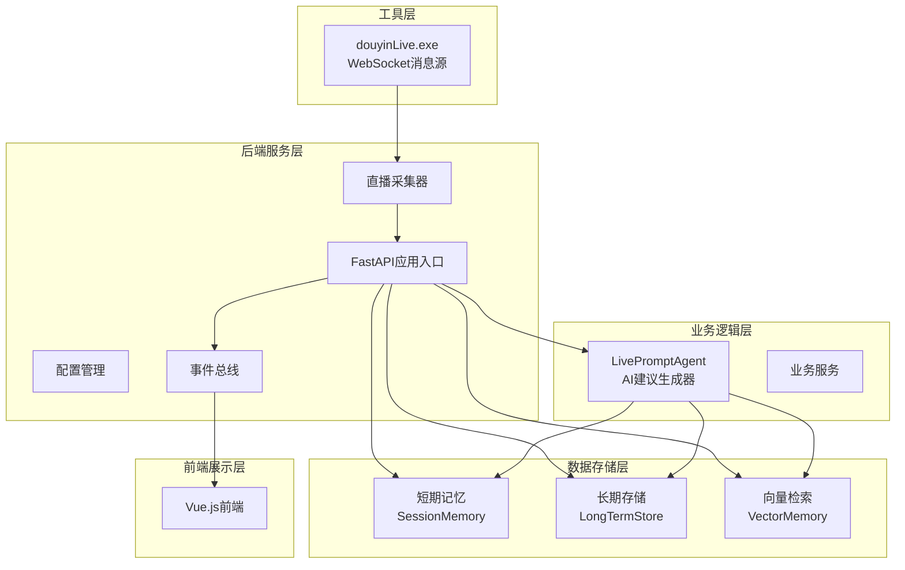

**图表来源**
- [backend/app.py:1-220](file://backend/app.py#L1-L220)
- [backend/services/agent.py:1-393](file://backend/services/agent.py#L1-L393)

**章节来源**
- [README.md:21-349](file://README.md#L21-L349)

## 核心组件

### LivePromptAgent - AI建议生成器

LivePromptAgent是系统的核心组件，负责智能建议生成。它实现了双模式支持架构，能够在在线AI模型和本地规则引擎之间无缝切换。

#### 主要特性

1. **双模式支持系统**
   - 在线OpenAI兼容接口模式
   - 本地启发式规则模式
   - 自动故障转移机制

2. **智能上下文构建**
   - 最近事件窗口（8个事件）
   - 相似历史片段检索（3个）
   - 用户画像分析

3. **状态监控**
   - 模型运行状态跟踪
   - 错误统计和日志记录
   - 实时性能指标

**章节来源**
- [backend/services/agent.py:23-393](file://backend/services/agent.py#L23-L393)

### 记忆系统

系统实现了多层次的记忆架构，确保能够有效利用历史信息：

1. **短期记忆**（SessionMemory）
   - Redis持久化或进程内内存
   - 最近事件和建议缓存
   - TTL过期管理

2. **长期存储**（LongTermStore）
   - SQLite数据库
   - 用户画像和交互历史
   - 会话管理和统计

3. **向量检索**（VectorMemory）
   - Chroma向量数据库
   - 文本相似度匹配
   - 哈希嵌入函数

**章节来源**
- [backend/memory/session_memory.py:17-113](file://backend/memory/session_memory.py#L17-L113)
- [backend/memory/long_term.py:36-750](file://backend/memory/long_term.py#L36-L750)
- [backend/memory/vector_store.py:52-108](file://backend/memory/vector_store.py#L52-L108)

## 架构概览

系统采用事件驱动的异步架构，通过WebSocket连接实时直播消息源，经过标准化处理后进入建议生成流程。

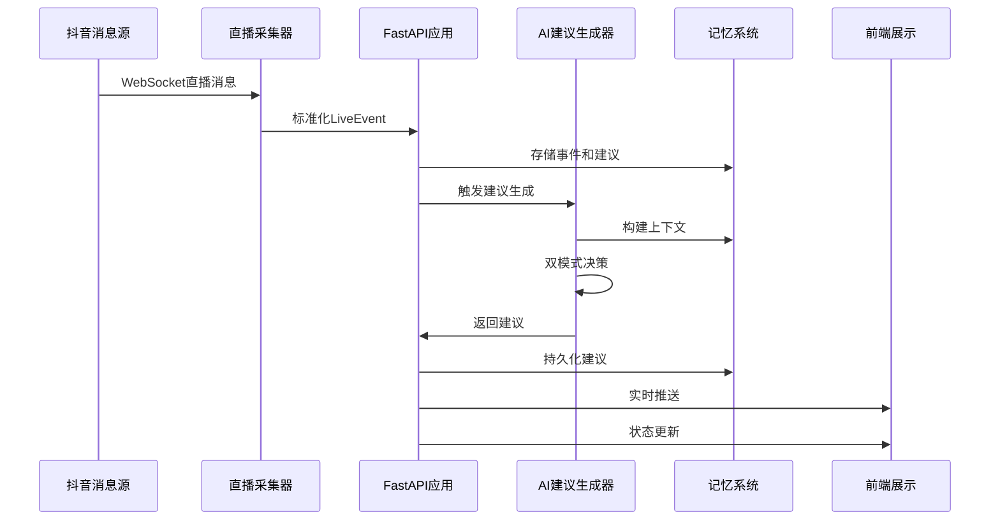

**图表来源**
- [backend/app.py:61-78](file://backend/app.py#L61-L78)
- [backend/services/agent.py:73-114](file://backend/services/agent.py#L73-L114)

## 详细组件分析

### LivePromptAgent实现详解

#### 双模式支持系统

LivePromptAgent实现了智能的双模式切换机制：

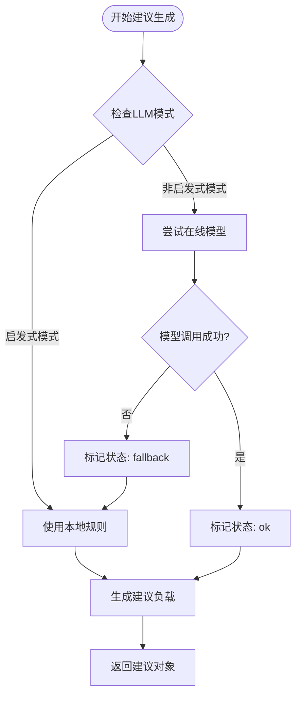

**图表来源**
- [backend/services/agent.py:96-114](file://backend/services/agent.py#L96-L114)

#### 上下文构建算法

系统采用多维度上下文构建策略：

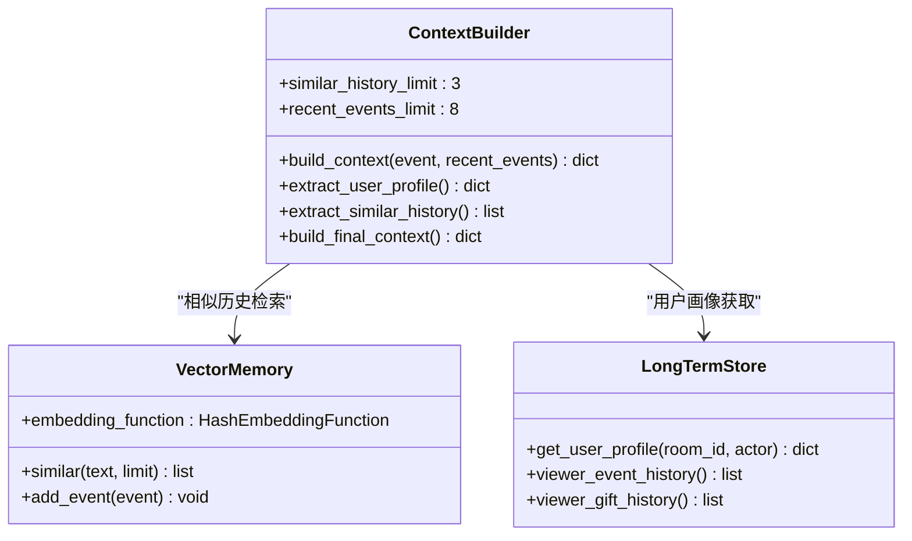

**图表来源**
- [backend/services/agent.py:56-71](file://backend/services/agent.py#L56-L71)
- [backend/memory/vector_store.py:85-108](file://backend/memory/vector_store.py#L85-L108)
- [backend/memory/long_term.py:718-734](file://backend/memory/long_term.py#L718-L734)

#### 建议生成决策流程

系统实现了复杂的决策逻辑，根据不同事件类型和上下文条件生成最优建议：

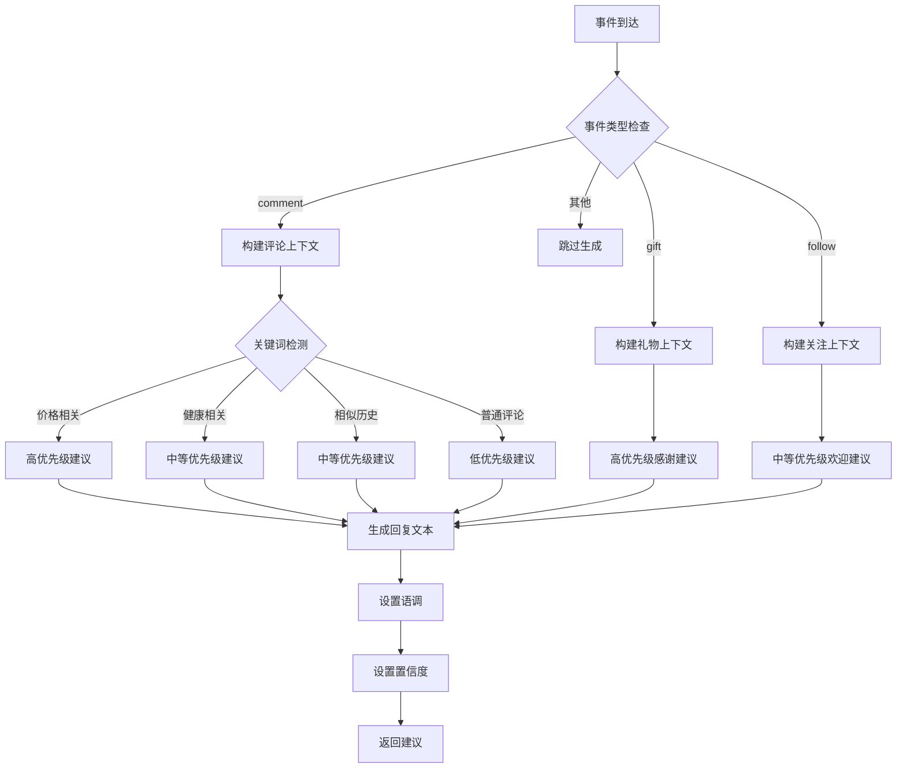

**图表来源**
- [backend/services/agent.py:115-181](file://backend/services/agent.py#L115-L181)

#### AI模型集成与适配器模式

系统采用适配器模式集成多种AI模型：

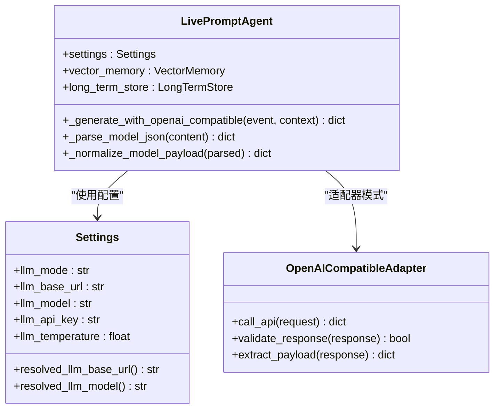

**图表来源**
- [backend/services/agent.py:183-329](file://backend/services/agent.py#L183-L329)
- [backend/config.py:40-94](file://backend/config.py#L40-L94)

**章节来源**
- [backend/services/agent.py:96-393](file://backend/services/agent.py#L96-L393)

### 记忆系统详细分析

#### SessionMemory - 短期记忆

短期记忆系统提供了灵活的存储策略：

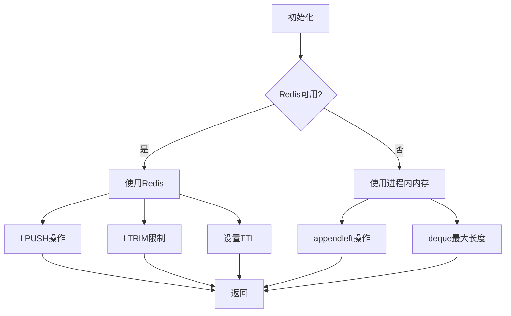

**图表来源**
- [backend/memory/session_memory.py:17-84](file://backend/memory/session_memory.py#L17-L84)

#### VectorMemory - 向量检索

向量检索系统实现了智能降级策略：

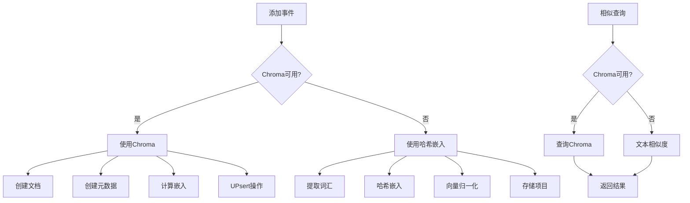

**图表来源**
- [backend/memory/vector_store.py:64-108](file://backend/memory/vector_store.py#L64-L108)

**章节来源**
- [backend/memory/session_memory.py:17-113](file://backend/memory/session_memory.py#L17-L113)
- [backend/memory/vector_store.py:19-108](file://backend/memory/vector_store.py#L19-L108)

### 配置管理系统

系统提供了灵活的配置管理机制：

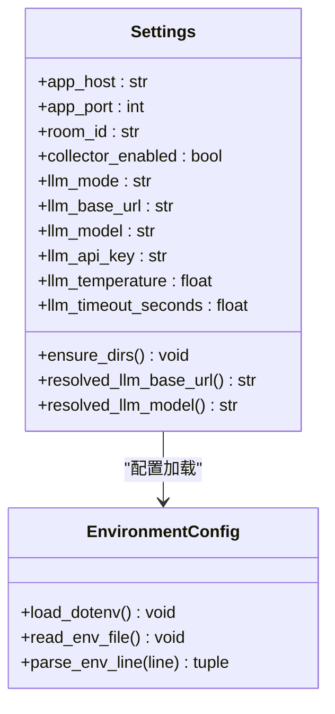

**图表来源**
- [backend/config.py:40-94](file://backend/config.py#L40-L94)

**章节来源**
- [backend/config.py:11-94](file://backend/config.py#L11-L94)

## 依赖关系分析

系统采用了松耦合的设计，各组件之间的依赖关系清晰明确：

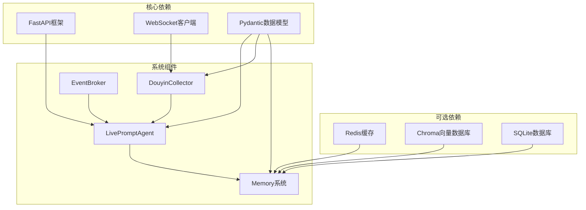

**图表来源**
- [requirements.txt:1-6](file://requirements.txt#L1-L6)
- [backend/app.py:13-21](file://backend/app.py#L13-L21)

**章节来源**
- [requirements.txt:1-6](file://requirements.txt#L1-L6)
- [backend/app.py:13-21](file://backend/app.py#L13-L21)

## 性能考虑

### 异步处理架构

系统采用异步编程模式，确保高并发场景下的性能表现：

1. **事件驱动处理**
   - WebSocket消息异步接收
   - 事件处理异步执行
   - 建议生成异步触发

2. **内存优化策略**
   - 事件窗口大小限制
   - 向量检索结果限制
   - 缓存过期管理

3. **网络优化**
   - 连接池管理
   - 超时控制
   - 重连机制

### 缓存策略

系统实现了多层次的缓存机制：

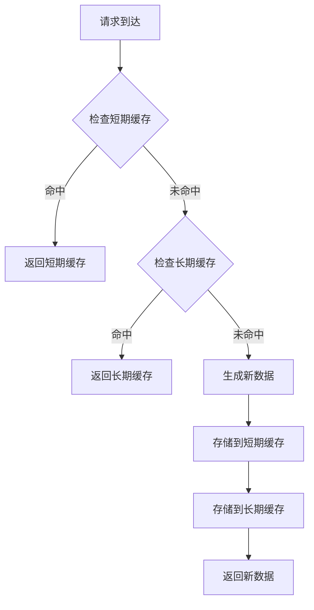

### 错误处理和恢复

系统具备完善的错误处理机制：

1. **网络异常处理**
   - 连接超时检测
   - 断线自动重连
   - 重试策略

2. **AI模型异常处理**
   - 请求失败回退
   - 结果格式验证
   - 错误日志记录

3. **内存溢出防护**
   - 队列长度限制
   - 内存使用监控
   - 自动清理机制

## 故障排除指南

### 常见问题诊断

#### AI模型集成问题

**问题症状**：建议生成失败，返回启发式模式

**诊断步骤**：
1. 检查网络连接状态
2. 验证API密钥配置
3. 查看模型响应格式
4. 检查超时设置

**解决方案**：
- 确认网络可达性
- 验证API密钥有效性
- 调整超时参数
- 检查模型兼容性

#### 记忆系统问题

**问题症状**：历史数据丢失或检索异常

**诊断步骤**：
1. 检查Redis连接状态
2. 验证Chroma数据库完整性
3. 查看SQLite表结构
4. 检查磁盘空间

**解决方案**：
- 重启Redis服务
- 重建Chroma集合
- 执行数据库修复
- 清理磁盘空间

#### 前端连接问题

**问题症状**：前端无法接收实时更新

**诊断步骤**：
1. 检查SSE连接状态
2. 验证WebSocket连接
3. 查看事件总线状态
4. 检查CORS配置

**解决方案**：
- 重启后端服务
- 检查防火墙设置
- 验证跨域配置
- 更新前端版本

**章节来源**
- [backend/services/agent.py:222-285](file://backend/services/agent.py#L222-L285)
- [backend/memory/session_memory.py:11-17](file://backend/memory/session_memory.py#L11-L17)

## 结论

AI建议生成器是一个设计精良的实时直播提词系统，具有以下优势：

1. **双模式可靠性**：在线AI模型与本地规则的智能切换确保系统稳定性
2. **多层次记忆**：短期、长期、向量检索的组合提供丰富的上下文信息
3. **适配器模式**：灵活的AI模型集成支持多种服务提供商
4. **异步架构**：高性能的事件驱动处理满足实时性需求
5. **完整监控**：全面的状态跟踪和错误统计便于运维管理

系统在抖音直播场景中表现出色，能够有效提升主播的互动效率和直播质量。通过合理的配置和调优，可以在不同环境下获得最佳的性能表现。

## 附录

### 配置选项说明

#### 基础配置
- `ROOM_ID`: 直播间ID
- `APP_HOST`: 应用监听地址
- `APP_PORT`: 应用监听端口

#### 采集配置
- `COLLECTOR_ENABLED`: 是否启用采集器
- `COLLECTOR_HOST`: 采集器主机地址
- `COLLECTOR_PORT`: 采集器端口
- `COLLECTOR_PING_INTERVAL_SECONDS`: Ping间隔
- `COLLECTOR_RECONNECT_DELAY_SECONDS`: 重连延迟

#### AI模型配置
- `LLM_MODE`: 模式选择（heuristic/qwen/openai）
- `LLM_BASE_URL`: 模型服务地址
- `LLM_MODEL`: 模型名称
- `LLM_API_KEY`: API密钥
- `DASHSCOPE_API_KEY`: DashScope密钥
- `LLM_TEMPERATURE`: 采样温度
- `LLM_TIMEOUT_SECONDS`: 超时时间

#### 存储配置
- `REDIS_URL`: Redis连接URL
- `DATA_DIR`: 数据目录
- `DATABASE_PATH`: SQLite数据库路径
- `CHROMA_DIR`: Chroma存储目录
- `SESSION_TTL_SECONDS`: 会话TTL

### 实际使用示例

#### 启动流程
1. 启动抖音消息源
2. 配置环境变量
3. 安装依赖包
4. 启动后端服务
5. 启动前端界面

#### 建议生成示例
系统支持多种事件类型的智能建议生成，包括评论回复、礼物感谢、关注欢迎等场景。

#### 性能优化建议
1. 合理配置Redis集群提高缓存性能
2. 优化Chroma向量索引提升检索速度
3. 调整事件窗口大小平衡内存使用
4. 监控模型响应时间优化超时设置
5. 实施适当的日志轮转避免磁盘占用