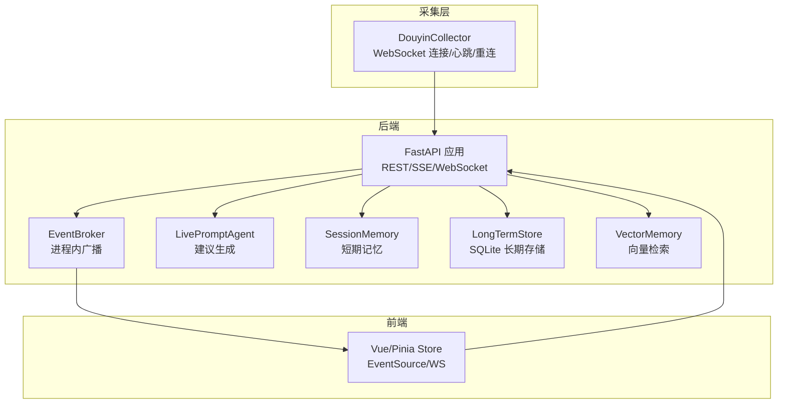
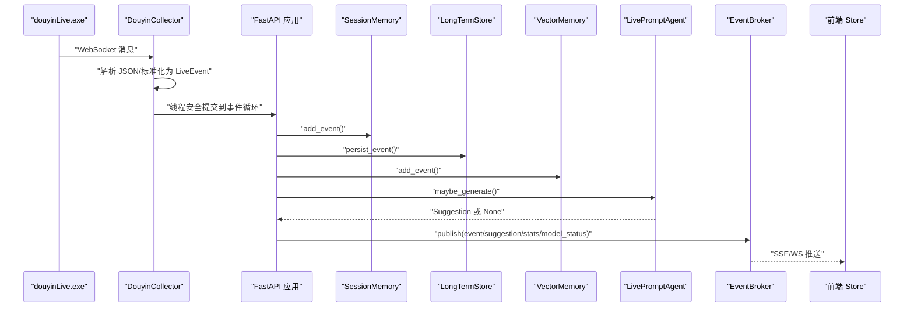
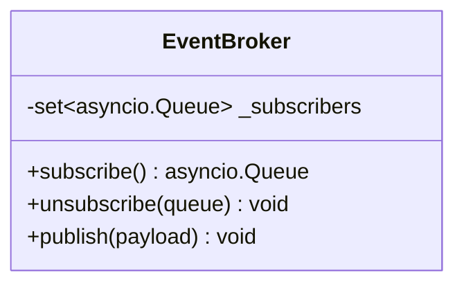
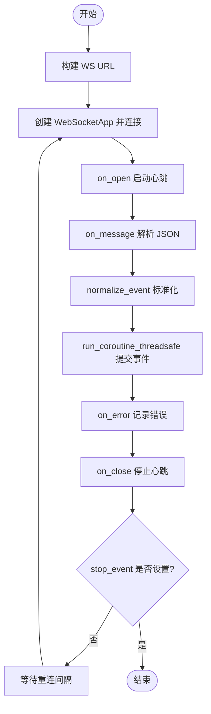
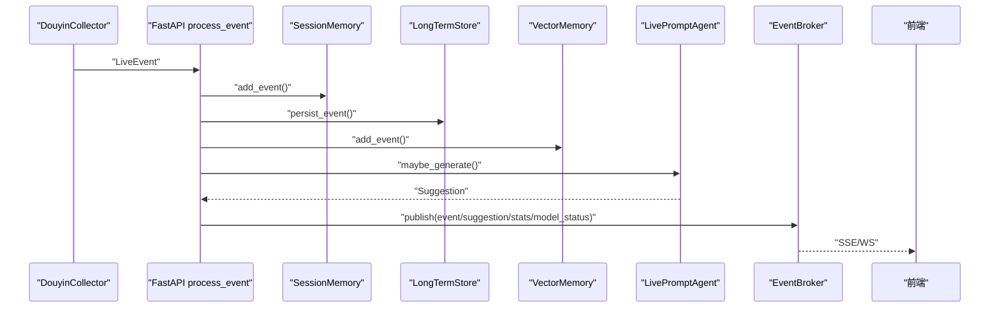
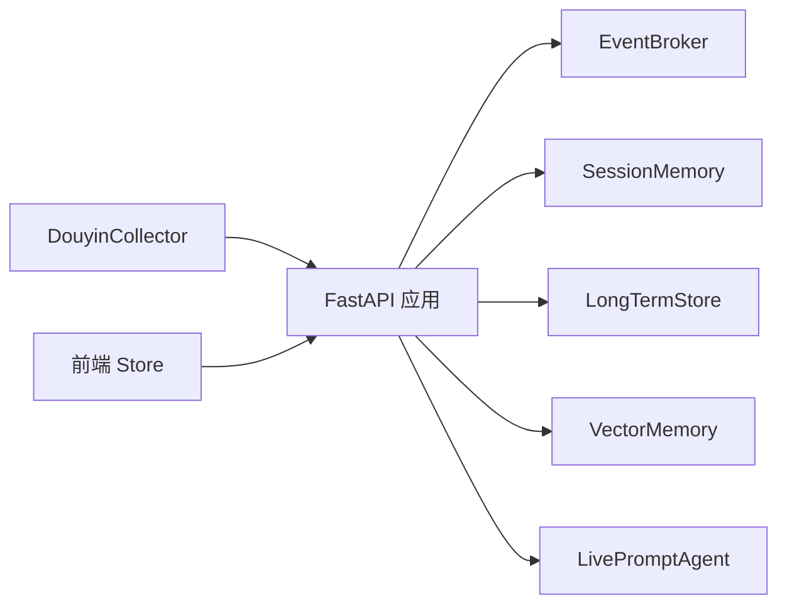

# 事件处理系统

<cite>
**本文引用的文件**
- [backend/app.py](file://backend/app.py)
- [backend/services/broker.py](file://backend/services/broker.py)
- [backend/services/collector.py](file://backend/services/collector.py)
- [backend/services/agent.py](file://backend/services/agent.py)
- [backend/schemas/live.py](file://backend/schemas/live.py)
- [backend/config.py](file://backend/config.py)
- [backend/memory/session_memory.py](file://backend/memory/session_memory.py)
- [backend/memory/long_term.py](file://backend/memory/long_term.py)
- [backend/memory/vector_store.py](file://backend/memory/vector_store.py)
- [frontend/src/stores/live.js](file://frontend/src/stores/live.js)
- [README.md](file://README.md)
- [USAGE.md](file://USAGE.md)
</cite>

## 目录
1. [简介](#简介)
2. [项目结构](#项目结构)
3. [核心组件](#核心组件)
4. [架构总览](#架构总览)
5. [详细组件分析](#详细组件分析)
6. [依赖关系分析](#依赖关系分析)
7. [性能与可靠性](#性能与可靠性)
8. [故障排查指南](#故障排查指南)
9. [结论](#结论)
10. [附录](#附录)

## 简介
本项目围绕“事件发布-订阅”模式构建，实现从抖音直播 WebSocket 消息采集、事件标准化、短期/长期存储、向量检索、提词建议生成到前端实时推送的完整链路。系统采用进程内事件广播器（EventBroker）进行事件分发，DouyinCollector 负责 WebSocket 连接、消息解析与事件标准化，FastAPI 提供 REST、SSE、WebSocket 接口，前端通过 EventSource/WS 实时消费事件流。

## 项目结构
- 后端
  - 应用入口与路由：backend/app.py
  - 事件发布订阅：backend/services/broker.py
  - 采集器：backend/services/collector.py
  - 提词代理：backend/services/agent.py
  - 数据模型：backend/schemas/live.py
  - 配置：backend/config.py
  - 内存层：backend/memory/session_memory.py
  - 长期存储：backend/memory/long_term.py
  - 向量检索：backend/memory/vector_store.py
- 前端
  - 状态与事件流：frontend/src/stores/live.js

图表来源
- [backend/app.py:187-220](file://backend/app.py#L187-L220)
- [backend/services/broker.py:10-40](file://backend/services/broker.py#L10-L40)
- [backend/services/collector.py:38-284](file://backend/services/collector.py#L38-L284)
- [backend/services/agent.py:23-393](file://backend/services/agent.py#L23-L393)
- [backend/memory/session_memory.py:17-113](file://backend/memory/session_memory.py#L17-L113)
- [backend/memory/long_term.py:36-750](file://backend/memory/long_term.py#L36-L750)
- [backend/memory/vector_store.py:52-108](file://backend/memory/vector_store.py#L52-L108)
- [frontend/src/stores/live.js:70-310](file://frontend/src/stores/live.js#L70-L310)

章节来源
- [README.md:21-349](file://README.md#L21-L349)
- [backend/app.py:1-220](file://backend/app.py#L1-L220)

## 核心组件
- EventBroker：进程内事件广播器，维护订阅队列集合，负责将事件广播给所有订阅者，并清理过期/阻塞队列。
- DouyinCollector：WebSocket 客户端，负责连接本地 douyinLive WebSocket，解析 JSON，标准化为 LiveEvent，通过线程安全方式提交到 FastAPI 事件循环。
- FastAPI 应用：事件处理入口，将 LiveEvent 写入短期/长期存储，生成建议并调用 EventBroker 广播事件、建议、统计与模型状态。
- LivePromptAgent：建议生成器，优先调用 OpenAI 兼容接口，失败时回退到本地启发式规则。
- Memory 层：SessionMemory（Redis/进程内）、LongTermStore（SQLite）、VectorMemory（Chroma/本地哈希嵌入）。
- 前端 Store：通过 EventSource/WS 订阅事件流，渲染事件、建议、统计与模型状态。

章节来源
- [backend/services/broker.py:10-40](file://backend/services/broker.py#L10-L40)
- [backend/services/collector.py:38-284](file://backend/services/collector.py#L38-L284)
- [backend/app.py:61-78](file://backend/app.py#L61-L78)
- [backend/services/agent.py:23-393](file://backend/services/agent.py#L23-L393)
- [backend/memory/session_memory.py:17-113](file://backend/memory/session_memory.py#L17-L113)
- [backend/memory/long_term.py:36-750](file://backend/memory/long_term.py#L36-L750)
- [backend/memory/vector_store.py:52-108](file://backend/memory/vector_store.py#L52-L108)
- [frontend/src/stores/live.js:70-310](file://frontend/src/stores/live.js#L70-L310)

## 架构总览
事件从采集器进入后端，经过标准化、存储、建议生成与广播，最终由前端实时消费。系统通过 SSE/WS 提供低延迟的事件流，前端可按房间过滤事件。

图表来源
- [backend/services/collector.py:145-160](file://backend/services/collector.py#L145-L160)
- [backend/app.py:61-78](file://backend/app.py#L61-L78)
- [backend/services/broker.py:28-40](file://backend/services/broker.py#L28-L40)
- [backend/services/agent.py:73-94](file://backend/services/agent.py#L73-L94)
- [backend/memory/session_memory.py:42-64](file://backend/memory/session_memory.py#L42-L64)
- [backend/memory/long_term.py:420-454](file://backend/memory/long_term.py#L420-L454)
- [backend/memory/vector_store.py:64-83](file://backend/memory/vector_store.py#L64-L83)
- [frontend/src/stores/live.js:173-205](file://frontend/src/stores/live.js#L173-L205)

## 详细组件分析

### EventBroker 设计与工作原理
- 订阅管理：每个订阅者获得一个 asyncio.Queue，EventBroker 维护集合，用于广播。
- 发布机制：遍历订阅队列尝试非阻塞放入，若队列满则标记为“过期队列”，随后统一移除，避免内存泄漏。
- 生命周期：订阅在 SSE/WS 连接建立时创建，断开时注销，确保资源回收。

图表来源
- [backend/services/broker.py:10-40](file://backend/services/broker.py#L10-L40)

章节来源
- [backend/services/broker.py:10-40](file://backend/services/broker.py#L10-L40)

### DouyinCollector 实现
- WebSocket 连接与心跳
  - 连接地址：ws://{host}:{port}/ws/{room_id}
  - 心跳：独立线程定时发送 ping，异常时记录日志并继续重连
  - 断线重连：指数退避或固定间隔重试，避免频繁抖动
- 消息解析与事件标准化
  - 解析 JSON，忽略非 JSON 消息
  - 方法到事件类型的映射：WebcastChatMessage->comment，WebcastGiftMessage->gift，WebcastLikeMessage->like，WebcastMemberMessage->member，WebcastSocialMessage->follow
  - 提取用户身份、礼物数量、钻石数等元数据，生成 LiveEvent
- 事件提交
  - 通过 asyncio.run_coroutine_threadsafe 将事件处理器提交到 FastAPI 事件循环，回调记录异常
- 房间切换
  - 停止当前连接与心跳，更新 room_id，重新启动采集

图表来源
- [backend/services/collector.py:117-139](file://backend/services/collector.py#L117-L139)
- [backend/services/collector.py:145-160](file://backend/services/collector.py#L145-L160)
- [backend/services/collector.py:225-284](file://backend/services/collector.py#L225-L284)

章节来源
- [backend/services/collector.py:38-284](file://backend/services/collector.py#L38-L284)
- [backend/config.py:39-94](file://backend/config.py#L39-L94)

### 事件处理生命周期（从采集到分发）
- 采集：DouyinCollector 接收消息，标准化为 LiveEvent
- 处理：FastAPI 的 process_event 将事件写入短期/长期存储，调用向量检索，生成建议
- 广播：将 event/suggestion/stats/model_status 通过 EventBroker 推送
- 前端：SSE/WS 订阅，按房间过滤，渲染事件流与建议

图表来源
- [backend/app.py:61-78](file://backend/app.py#L61-L78)
- [backend/services/broker.py:28-40](file://backend/services/broker.py#L28-L40)
- [frontend/src/stores/live.js:173-205](file://frontend/src/stores/live.js#L173-L205)

章节来源
- [backend/app.py:61-78](file://backend/app.py#L61-L78)

### 事件去重、过滤与聚合策略
- 去重
  - 长期存储层以 event_id 作为主键，重复事件会被替换写入，确保幂等
  - 采集器在提交事件前未见显式去重逻辑，建议在上游或采集器增加去重策略（如基于 msgId 的缓存）
- 过滤
  - 前端支持事件类型过滤（comment/gift/follow/member/like/system），按用户选择显示
  - SSE/WS 侧按房间过滤，避免跨房间事件泄露
- 聚合
  - SessionStats 聚合最近窗口内的事件类型计数
  - 向量检索聚合相似历史片段，辅助建议生成
  - 用户画像聚合：LongTermStore 统计用户互动、礼物、会话等指标

章节来源
- [backend/memory/long_term.py:420-454](file://backend/memory/long_term.py#L420-L454)
- [backend/memory/session_memory.py:86-102](file://backend/memory/session_memory.py#L86-L102)
- [backend/services/agent.py:56-71](file://backend/services/agent.py#L56-L71)
- [frontend/src/stores/live.js:109-111](file://frontend/src/stores/live.js#L109-L111)
- [backend/app.py:187-206](file://backend/app.py#L187-L206)

### 实时性与可靠性保障
- 实时性
  - SSE/WS：前端通过 EventSource/WS 实时接收事件，延迟低
  - 事件广播：EventBroker 使用 asyncio.Queue，非阻塞放入，避免主线程阻塞
- 可靠性
  - WebSocket 心跳：独立线程定时 ping，异常时记录并重连
  - 断线重连：固定重连间隔，避免频繁抖动
  - 异常处理：采集器捕获异常并记录日志，不影响主流程
  - 建议生成：模型失败自动回退到启发式规则，保证系统可用性

章节来源
- [backend/services/collector.py:182-198](file://backend/services/collector.py#L182-L198)
- [backend/services/collector.py:117-139](file://backend/services/collector.py#L117-L139)
- [backend/services/agent.py:96-113](file://backend/services/agent.py#L96-L113)

### 性能优化与故障恢复策略
- 性能优化
  - 内存层：SessionMemory 支持 Redis 与进程内两种模式，Redis 模式下利用 lpush/ltrim 控制窗口大小，减少内存占用
  - 向量检索：Chroma 可选启用，无依赖时使用本地哈希嵌入函数，保证检索能力
  - 建议生成：模型失败快速回退，降低端到端延迟
- 故障恢复
  - 采集器：心跳失败、网络异常、连接关闭均记录日志并重连
  - 建议生成：HTTP 错误、超时、JSON 解析失败均有明确分支处理，回退到启发式规则
  - 前端：EventSource 自动重连，连接状态实时反馈

章节来源
- [backend/memory/session_memory.py:17-113](file://backend/memory/session_memory.py#L17-L113)
- [backend/memory/vector_store.py:52-108](file://backend/memory/vector_store.py#L52-L108)
- [backend/services/agent.py:183-393](file://backend/services/agent.py#L183-L393)
- [frontend/src/stores/live.js:173-205](file://frontend/src/stores/live.js#L173-L205)

## 依赖关系分析
- 组件耦合
  - FastAPI 应用依赖 EventBroker、SessionMemory、LongTermStore、VectorMemory、LivePromptAgent
  - DouyinCollector 依赖 Settings 与事件处理器（process_event），通过线程与事件循环交互
  - 前端 Store 依赖后端 REST/SSE/WS 接口
- 外部依赖
  - websocket-client：WebSocket 客户端
  - fastapi/uvicorn：后端服务
  - redis/chromadb：可选增强

图表来源
- [backend/app.py:19-29](file://backend/app.py#L19-L29)
- [backend/services/collector.py:38-52](file://backend/services/collector.py#L38-L52)
- [frontend/src/stores/live.js:70-310](file://frontend/src/stores/live.js#L70-L310)

章节来源
- [backend/app.py:19-29](file://backend/app.py#L19-L29)
- [backend/services/collector.py:38-52](file://backend/services/collector.py#L38-L52)

## 性能与可靠性
- 性能特性
  - SSE/WS 低延迟推送，前端事件窗口限制（最多 30 条事件、12 条建议），避免内存膨胀
  - Redis/Chroma 可选增强，满足不同部署环境需求
- 可靠性保障
  - 采集器心跳与断线重连，异常日志记录
  - 建议生成多分支错误处理与回退策略
  - 前端连接状态与错误提示，便于用户感知

[本节为通用性能讨论，无需特定文件引用]

## 故障排查指南
- 采集层
  - 确认本地 douyinLive.exe 已启动且 WebSocket 地址可达
  - 检查 ROOM_ID 是否正确，采集器日志是否显示连接成功
- 后端
  - 查看 FastAPI 日志，确认事件是否进入 process_event
  - 检查 Redis/Chroma 是否可用，必要时降级为进程内内存与本地检索
- 建议生成
  - 若模型失败，检查 API Key、网络与超时设置，观察模型状态变化
- 前端
  - EventSource 是否正常 open/error/reconnect
  - 事件类型过滤与房间过滤是否符合预期

章节来源
- [USAGE.md:179-256](file://USAGE.md#L179-L256)
- [backend/services/collector.py:117-139](file://backend/services/collector.py#L117-L139)
- [backend/services/agent.py:183-393](file://backend/services/agent.py#L183-L393)
- [frontend/src/stores/live.js:173-205](file://frontend/src/stores/live.js#L173-L205)

## 结论
该事件处理系统以“发布-订阅”为核心，结合 WebSocket 采集、标准化、存储与建议生成，形成完整的实时链路。系统具备良好的可扩展性与可降级能力，通过 SSE/WS 与前端实现低延迟交互。建议后续在采集层增加去重策略、完善监控与告警，并考虑引入更丰富的事件过滤与聚合能力。

[本节为总结性内容，无需特定文件引用]

## 附录

### 事件标准化与数据模型
- LiveEvent 字段：event_id、room_id、source_room_id、session_id、platform、event_type、method、livename、ts、user、content、metadata、raw
- 建议模型：Suggestion 包含优先级、回复文本、语气、理由、置信度等
- 会话统计：SessionStats 聚合事件类型计数
- 模型状态：ModelStatus 记录当前模式、模型、后端、结果与时间戳

章节来源
- [backend/schemas/live.py:29-95](file://backend/schemas/live.py#L29-L95)

### 接口与事件流
- SSE 接口：/api/events/stream，支持按房间过滤
- WebSocket 接口：/ws/live，连接后先推送 bootstrap 快照
- 健康检查：/health
- 房间切换：/api/room
- 手动注入事件：/api/events

章节来源
- [backend/app.py:187-220](file://backend/app.py#L187-L220)
- [README.md:208-275](file://README.md#L208-L275)