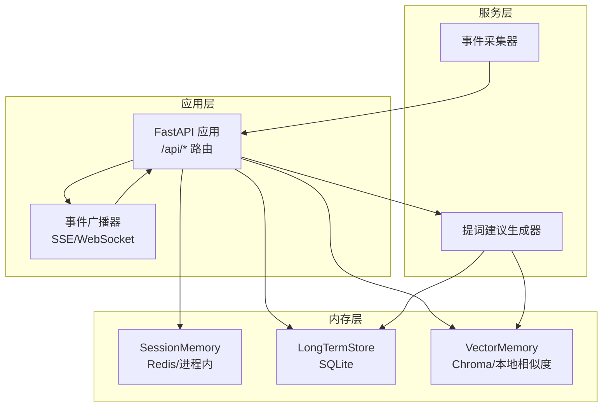
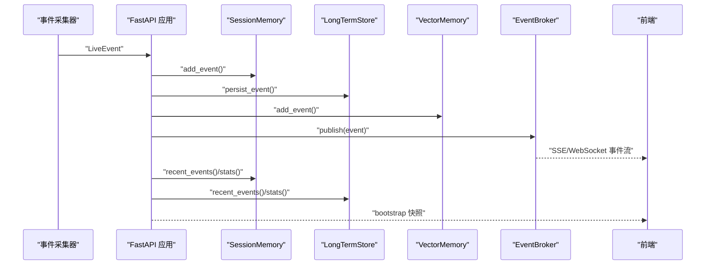
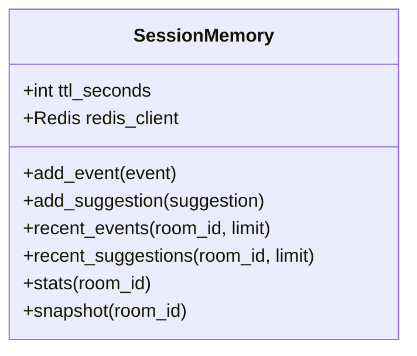
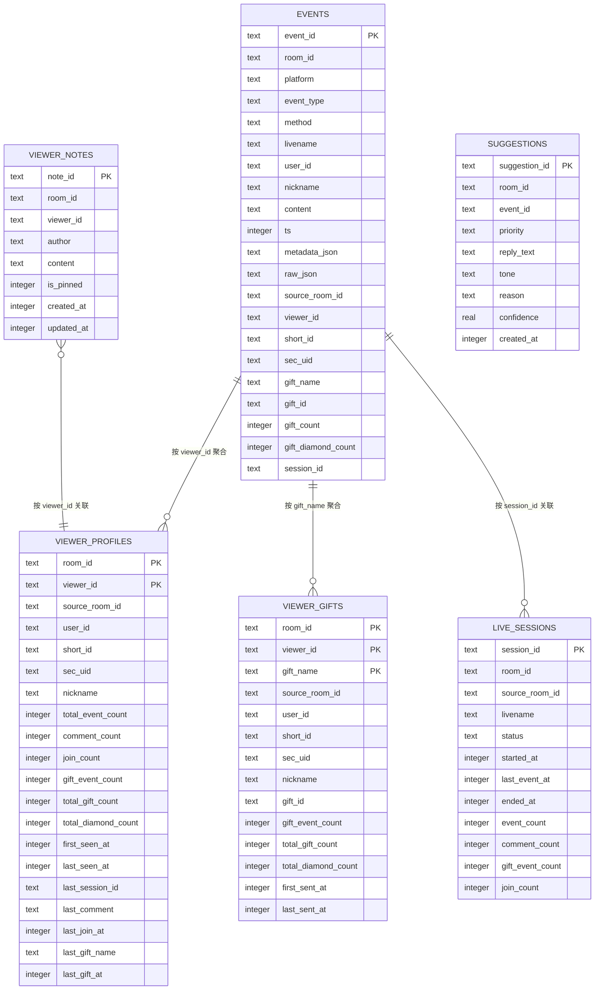
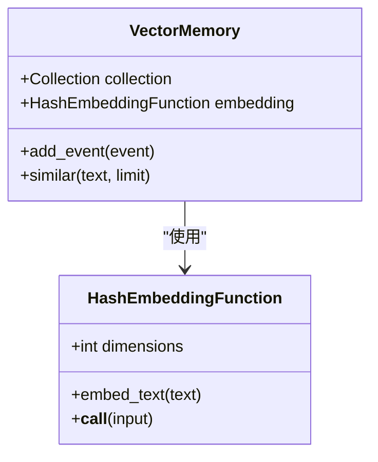
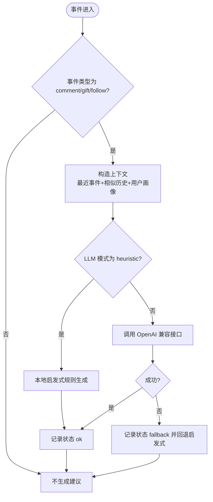
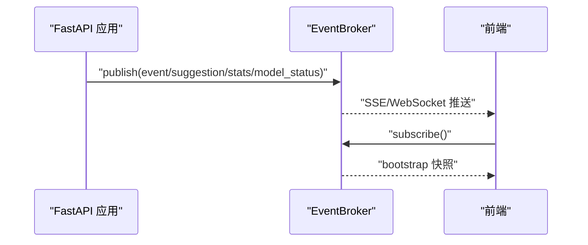
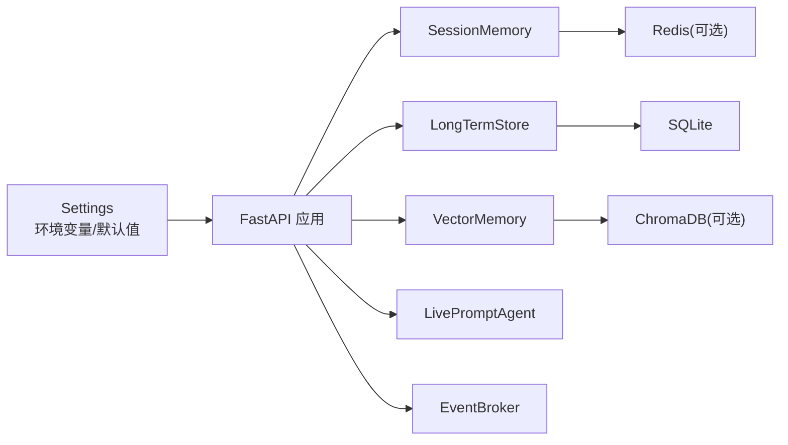

# 内存管理系统

<cite>
**本文引用的文件**
- [backend/memory/session_memory.py](file://backend/memory/session_memory.py)
- [backend/memory/long_term.py](file://backend/memory/long_term.py)
- [backend/memory/vector_store.py](file://backend/memory/vector_store.py)
- [backend/config.py](file://backend/config.py)
- [backend/app.py](file://backend/app.py)
- [backend/schemas/live.py](file://backend/schemas/live.py)
- [backend/services/agent.py](file://backend/services/agent.py)
- [backend/services/broker.py](file://backend/services/broker.py)
- [data/DATABASE.md](file://data/DATABASE.md)
- [README.md](file://README.md)
</cite>

## 目录
1. [简介](#简介)
2. [项目结构](#项目结构)
3. [核心组件](#核心组件)
4. [架构总览](#架构总览)
5. [详细组件分析](#详细组件分析)
6. [依赖关系分析](#依赖关系分析)
7. [性能考量](#性能考量)
8. [故障排查指南](#故障排查指南)
9. [结论](#结论)
10. [附录](#附录)

## 简介
本项目是一个面向直播场景的实时提词系统，采用三层存储架构：
- SessionMemory（短期会话内存）：优先使用 Redis，若不可用则退化为进程内内存，用于热数据的快速读写与统计。
- LongTermStore（长期存储）：基于 SQLite，负责事件流水、观众画像、礼物聚合、直播场次、建议与备注等持久化。
- VectorMemory（向量检索）：优先使用 ChromaDB，若不可用则退化为轻量文本相似度，用于历史相似事件检索。

三层存储协同工作，确保数据在不同生命周期阶段的高效访问与一致性，同时提供进程内退化机制保障系统在缺失外部组件时仍可运行。

## 项目结构
后端主要由以下模块构成：
- 应用入口与路由：FastAPI 应用，负责事件处理、SSE/WebSocket 广播、房间切换与健康检查。
- 配置模块：加载环境变量与默认值，解析 LLM 服务地址与模型名，确保数据目录存在。
- 服务层：事件采集器、提词建议生成器、事件广播器。
- 内存层：短期会话内存、长期存储、向量检索。
- 数据模型：统一的事件、建议、统计与快照模型。

图表来源
- [backend/app.py:1-220](file://backend/app.py#L1-L220)
- [backend/services/broker.py:1-40](file://backend/services/broker.py#L1-L40)
- [backend/services/agent.py:1-393](file://backend/services/agent.py#L1-L393)
- [backend/memory/session_memory.py:1-113](file://backend/memory/session_memory.py#L1-L113)
- [backend/memory/long_term.py:1-750](file://backend/memory/long_term.py#L1-L750)
- [backend/memory/vector_store.py:1-108](file://backend/memory/vector_store.py#L1-L108)

章节来源
- [backend/app.py:1-220](file://backend/app.py#L1-L220)
- [backend/config.py:1-94](file://backend/config.py#L1-L94)
- [README.md:1-349](file://README.md#L1-L349)

## 核心组件
- SessionMemory：短期会话内存，支持 Redis 与进程内两种模式，提供事件与建议的写入、读取与统计。
- LongTermStore：长期存储，基于 SQLite，提供事件流水、观众画像、礼物聚合、直播场次、建议与备注等持久化能力。
- VectorMemory：向量检索，优先使用 ChromaDB，若不可用则退化为本地哈希嵌入与文本相似度，提供历史相似事件检索。
- LivePromptAgent：提词建议生成器，结合短期事件窗口、相似历史与用户画像，优先调用 OpenAI 兼容接口，失败时回退到本地启发式规则。
- EventBroker：进程内事件广播器，负责将事件、建议、统计与模型状态通过 SSE/WebSocket 推送给前端。

章节来源
- [backend/memory/session_memory.py:17-113](file://backend/memory/session_memory.py#L17-L113)
- [backend/memory/long_term.py:36-750](file://backend/memory/long_term.py#L36-L750)
- [backend/memory/vector_store.py:52-108](file://backend/memory/vector_store.py#L52-L108)
- [backend/services/agent.py:23-393](file://backend/services/agent.py#L23-L393)
- [backend/services/broker.py:10-40](file://backend/services/broker.py#L10-L40)

## 架构总览
三层存储的协作机制：
- 写入路径：事件到达后，同时写入 SessionMemory（热数据）、LongTermStore（持久化）、VectorMemory（相似度索引），随后通过 EventBroker 推送至前端。
- 读取路径：前端首次加载时，若短期内存无数据，则回退到 LongTermStore 的最近事件与建议；统计信息亦可从短期或长期获取。
- 一致性保证：事件写入时，LongTermStore 自动分配 session_id 并维护直播场次；向量索引仅对有内容的事件建立；短期内存的 TTL 控制热数据生命周期。

图表来源
- [backend/app.py:61-78](file://backend/app.py#L61-L78)
- [backend/memory/session_memory.py:42-102](file://backend/memory/session_memory.py#L42-L102)
- [backend/memory/long_term.py:420-454](file://backend/memory/long_term.py#L420-L454)
- [backend/memory/vector_store.py:64-83](file://backend/memory/vector_store.py#L64-L83)
- [backend/services/broker.py:28-39](file://backend/services/broker.py#L28-L39)

## 详细组件分析

### SessionMemory（短期会话内存）
- Redis 集成与进程内退化：
  - 若配置了 Redis 地址且可导入 redis 包，则使用 Redis 的列表结构存储事件与建议，并设置 TTL 控制热数据生命周期。
  - 若 Redis 不可用，则退化为进程内双端队列（deque），限制事件与建议的最大长度，避免内存无限增长。
- 键空间设计：
  - 事件键：room:{room_id}:events
  - 建议键：room:{room_id}:suggestions
- 写入策略：
  - 写入事件时，使用左压（lpush）将新事件插入头部，随后 ltrim 限制长度，最后 expire 设置过期时间。
  - 写入建议时同理。
- 读取与统计：
  - 读取最近事件与建议时，Redis 模式直接 lrange 返回；进程内模式返回对应队列的切片。
  - 统计函数基于最近事件窗口进行轻量统计，汇总各类事件数量。
- 快照与统计：
  - snapshot 构造包含最近事件、最近建议与统计信息的 SessionSnapshot，供前端初始化使用。

图表来源
- [backend/memory/session_memory.py:17-113](file://backend/memory/session_memory.py#L17-L113)

章节来源
- [backend/memory/session_memory.py:17-113](file://backend/memory/session_memory.py#L17-L113)

### LongTermStore（SQLite 长期存储）
- 表结构设计与演进：
  - events：事件流水表，包含事件主键、房间号、平台、事件类型、方法、直播名称、用户身份、内容、时间戳、元数据与原始消息等字段，并新增 gift_* 与 session_id 等列以支持礼物与会话关联。
  - viewer_profiles：按房间与观众 ID 聚合的画像表，包含事件总数、各类事件计数、首次与末次出现时间、最近会话 ID、最近评论、最近加入与礼物信息等。
  - viewer_gifts：按房间、观众与礼物名聚合的礼物历史表，包含礼物事件次数、总赠送次数、钻石总计、首次与末次赠送时间。
  - live_sessions：直播场次表，包含会话 ID、房间号、来源房间、直播名称、状态、开始与最后事件时间、结束时间以及各类事件计数。
  - viewer_notes：观众备注表，包含作者、内容、置顶标记、创建与更新时间。
  - 历史兼容：保留 user_profiles 以兼容旧数据，但不再作为主读表。
- 索引优化：
  - events 上建立 room_id+ts、room_id+viewer_id+ts、room_id+event_type+ts、session_id 等索引，提升按房间、时间、事件类型与会话的查询效率。
  - viewer_profiles、viewer_gifts、live_sessions、viewer_notes 上建立相应复合索引，优化画像、礼物、场次与备注查询。
- 查询性能：
  - 最近事件与建议查询按时间倒序限制条数，利用索引实现高效分页。
  - 统计查询使用聚合函数一次性统计各类事件数量。
  - 观众画像与历史查询通过多表联结与分组聚合，返回完整画像与历史明细。
- 会话管理：
  - 写入事件时自动维护活动直播场次，包括创建、触达更新与结束。
  - 支持列出直播场次、获取当前活动场次、结束当前活动场次等操作。
- 数据一致性：
  - 写入事件时，若已有 session_id 则复用；否则创建或获取活动会话并写入。
  - 更新 viewer_profiles 与 viewer_gifts 使用 upsert（INSERT OR REPLACE/ON CONFLICT），保证画像与礼物聚合的正确性。
  - 若事件变更导致历史数据不一致，提供重建聚合的逻辑。

图表来源
- [backend/memory/long_term.py:54-148](file://backend/memory/long_term.py#L54-L148)
- [data/DATABASE.md:16-151](file://data/DATABASE.md#L16-L151)

章节来源
- [backend/memory/long_term.py:36-750](file://backend/memory/long_term.py#L36-L750)
- [data/DATABASE.md:16-151](file://data/DATABASE.md#L16-L151)

### VectorMemory（ChromaDB 向量检索）
- 集成与退化：
  - 若安装了 chromadb，则使用持久化客户端与集合“live_history”进行向量索引与查询。
  - 若不可用，则退化为本地哈希嵌入函数与轻量文本相似度，维持检索能力。
- 嵌入函数：
  - HashEmbeddingFunction：对中文与英文词元进行哈希，生成固定维度向量并归一化，作为本地嵌入方案。
- 检索流程：
  - add_event：对有内容的事件构建文档（昵称+内容），写入向量索引或本地相似度池。
  - similar：对输入文本计算嵌入并查询最相似的历史文档，返回前 N 条历史片段。
- 与 Agent 协作：
  - LivePromptAgent 在生成建议时，从 VectorMemory 获取相似历史片段，结合最近事件与用户画像构造上下文。

图表来源
- [backend/memory/vector_store.py:19-108](file://backend/memory/vector_store.py#L19-L108)

章节来源
- [backend/memory/vector_store.py:52-108](file://backend/memory/vector_store.py#L52-L108)

### 提词建议生成器（LivePromptAgent）
- 生成策略：
  - 仅对 comment、gift、follow 事件生成建议。
  - 优先调用 OpenAI 兼容接口，失败时回退到本地启发式规则。
- 上下文构造：
  - 结合最近事件窗口、相似历史片段与用户画像，形成建议生成的上下文。
- 状态管理：
  - 维护当前模型模式、模型名、后端地址、最后结果与错误信息，便于前端展示与诊断。
- 回退逻辑：
  - 当模型调用失败时，记录错误并切换到启发式模式，保证系统稳定性。

图表来源
- [backend/services/agent.py:73-114](file://backend/services/agent.py#L73-L114)
- [backend/services/agent.py:183-329](file://backend/services/agent.py#L183-L329)

章节来源
- [backend/services/agent.py:23-393](file://backend/services/agent.py#L23-L393)

### 事件广播与前端交互（EventBroker）
- 广播机制：
  - 维护订阅队列集合，发布时将消息投递到所有活跃队列。
  - 对阻塞队列进行清理，移除过期或阻塞的订阅。
- SSE/WebSocket：
  - 提供 /api/events/stream 与 /ws/live 接口，前端可订阅事件、建议、统计与模型状态。

图表来源
- [backend/services/broker.py:10-40](file://backend/services/broker.py#L10-L40)
- [backend/app.py:187-220](file://backend/app.py#L187-L220)

章节来源
- [backend/services/broker.py:10-40](file://backend/services/broker.py#L10-L40)
- [backend/app.py:187-220](file://backend/app.py#L187-L220)

## 依赖关系分析
- 组件耦合：
  - FastAPI 应用依赖 SessionMemory、LongTermStore、VectorMemory 与 LivePromptAgent。
  - LivePromptAgent 依赖 VectorMemory 与 LongTermStore。
  - EventBroker 为应用与前端之间的解耦层。
- 外部依赖：
  - Redis（可选）：用于 SessionMemory 的高性能存储。
  - ChromaDB（可选）：用于 VectorMemory 的向量检索。
  - SQLite：LongTermStore 的持久化存储。
- 配置驱动：
  - Settings 通过环境变量与默认值解析 Redis、数据库路径、Chroma 目录与会话 TTL 等参数。

图表来源
- [backend/config.py:39-94](file://backend/config.py#L39-L94)
- [backend/app.py:25-29](file://backend/app.py#L25-L29)

章节来源
- [backend/config.py:39-94](file://backend/config.py#L39-L94)
- [backend/app.py:25-29](file://backend/app.py#L25-L29)

## 性能考量
- Redis 热点与 TTL：
  - 使用列表结构与 ltrim 限制长度，配合 expire 控制热数据生命周期，避免无限增长。
  - 建议合理设置 TTL（如 4 小时），平衡短期数据可用性与内存占用。
- SQLite 索引与查询：
  - events 上的复合索引（room_id, ts DESC）、（room_id, viewer_id, ts DESC）、（room_id, event_type, ts DESC）、（session_id）显著提升按房间、时间、事件类型与会话的查询性能。
  - 建议定期分析与优化查询计划，避免全表扫描。
- 向量检索：
  - ChromaDB 的持久化集合与本地哈希嵌入函数在无外部模型时提供近似检索能力。
  - 建议对文档长度与维度进行评估，必要时调整嵌入维度与相似度阈值。
- 会话管理：
  - LongTermStore 在写入事件时自动维护直播场次，减少前端复杂度。
  - 建议在房间切换与服务关闭时及时结束活动场次，保证统计数据准确。
- 监控与调优建议：
  - 前端展示模型状态与错误信息，便于定位 LLM 调用异常。
  - 建议增加慢查询日志与指标埋点，监控 Redis、SQLite 与 Chroma 的延迟与吞吐。

[本节为通用性能讨论，无需具体文件来源]

## 故障排查指南
- Redis 不可用：
  - 现象：短期会话内存退化为进程内内存，事件与建议仍可写入，但无 TTL 生效。
  - 处理：确认 Redis_URL 是否为空；若为空则为预期退化；若配置了地址但仍不可用，检查网络与权限。
- Chroma 不可用：
  - 现象：向量检索退化为本地相似度，仍可返回相似历史片段。
  - 处理：确认 chromadb 是否安装；若未安装，系统仍可运行基础功能。
- LLM 调用失败：
  - 现象：模型状态显示 fallback 或 error，建议回退到启发式规则。
  - 处理：检查 LLM_MODE、LLM_BASE_URL、LLM_MODEL、LLM_API_KEY 等配置；查看日志中的错误类型（HTTP、网络、超时、JSON 解析等）。
- 数据不一致：
  - 现象：画像或礼物聚合与期望不符。
  - 处理：LongTermStore 提供重建聚合逻辑；可在维护窗口执行重建，确保历史数据一致性。
- 房间切换异常：
  - 现象：切换房间后活动场次未结束或事件丢失。
  - 处理：确认 /api/room 请求与 /api/sessions/current 接口；服务关闭时应自动结束活动场次。

章节来源
- [backend/services/agent.py:99-113](file://backend/services/agent.py#L99-L113)
- [backend/memory/long_term.py:404-420](file://backend/memory/long_term.py#L404-L420)
- [backend/app.py:115-126](file://backend/app.py#L115-L126)

## 结论
本内存管理系统通过三层存储架构实现了直播场景下的高效数据处理与检索：
- SessionMemory 提供热数据的快速读写与统计，具备 Redis 与进程内双模式退化能力。
- LongTermStore 以 SQLite 为核心，提供完善的事件流水、画像、礼物聚合与直播场次管理，并通过索引优化保证查询性能。
- VectorMemory 优先使用 ChromaDB，若不可用则退化为本地嵌入与相似度，确保检索能力持续可用。
- 三层存储协同工作，结合事件广播与前端交互，形成完整的实时提词闭环。系统在缺失外部组件时仍可运行，具备良好的鲁棒性与可维护性。

[本节为总结性内容，无需具体文件来源]

## 附录

### 存储操作示例（路径指引）
- 写入事件并生成建议
  - 路径：[backend/app.py:61-78](file://backend/app.py#L61-L78)
  - 说明：事件到达后写入短期内存、长期存储与向量索引，随后生成建议并推送。
- 获取最近事件与建议
  - 路径：[backend/memory/session_memory.py:66-84](file://backend/memory/session_memory.py#L66-L84)
  - 路径：[backend/memory/long_term.py:467-502](file://backend/memory/long_term.py#L467-L502)
- 构造会话快照
  - 路径：[backend/memory/session_memory.py:104-113](file://backend/memory/session_memory.py#L104-L113)
  - 路径：[backend/memory/long_term.py:522-523](file://backend/memory/long_term.py#L522-L523)
- 向量检索相似历史
  - 路径：[backend/memory/vector_store.py:85-108](file://backend/memory/vector_store.py#L85-L108)
- 获取用户画像与历史
  - 路径：[backend/memory/long_term.py:718-749](file://backend/memory/long_term.py#L718-L749)

### 数据生命周期与清理策略
- 短期内存（SessionMemory）：
  - 使用 Redis 时设置 TTL 控制热数据生命周期；进程内模式通过队列长度限制避免无限增长。
  - 路径：[backend/memory/session_memory.py:18-52](file://backend/memory/session_memory.py#L18-L52)
- 长期存储（LongTermStore）：
  - 事件与画像数据持久化，通过索引与查询优化保证性能；支持重建聚合以修复历史不一致。
  - 路径：[backend/memory/long_term.py:404-420](file://backend/memory/long_term.py#L404-L420)
- 向量索引（VectorMemory）：
  - 仅对有内容的事件建立索引；Chroma 不可用时退化为本地相似度，不影响检索能力。
  - 路径：[backend/memory/vector_store.py:64-83](file://backend/memory/vector_store.py#L64-L83)

### 配置项与环境变量
- Redis 与会话 TTL
  - 路径：[backend/config.py:54-55](file://backend/config.py#L54-L55)
- 数据库路径与 Chroma 目录
  - 路径：[backend/config.py:52-53](file://backend/config.py#L52-L53)
- LLM 模式与模型解析
  - 路径：[backend/config.py:70-91](file://backend/config.py#L70-L91)
- 应用启动与目录创建
  - 路径：[backend/config.py:63-69](file://backend/config.py#L63-L69)