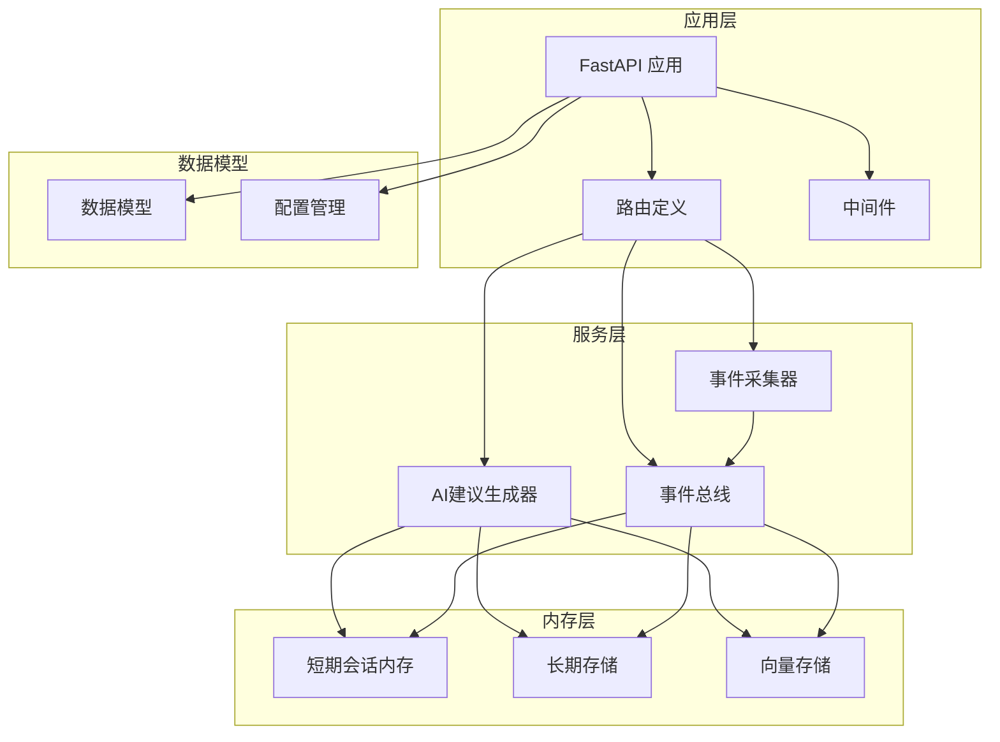
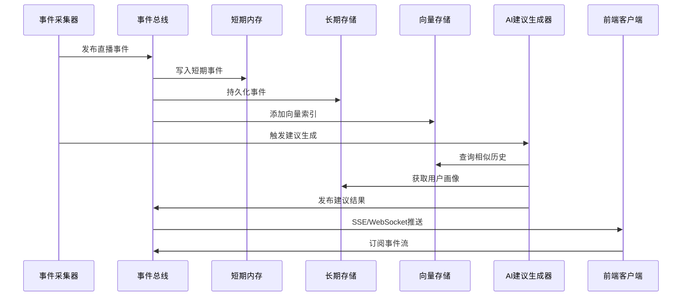
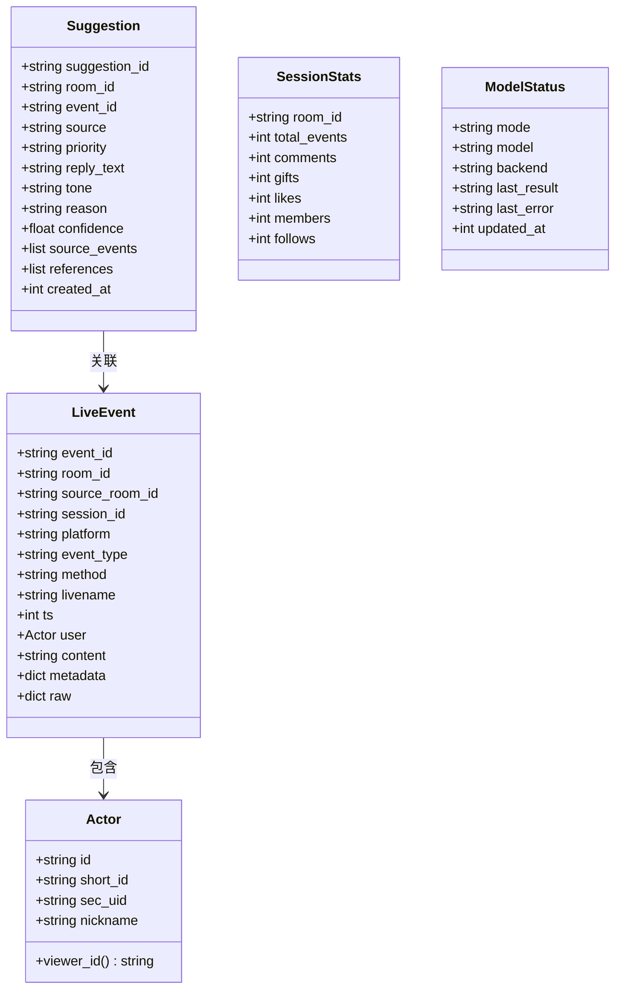
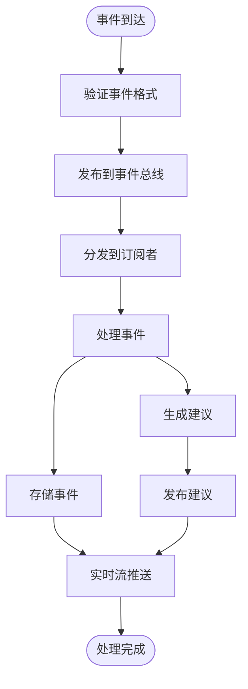
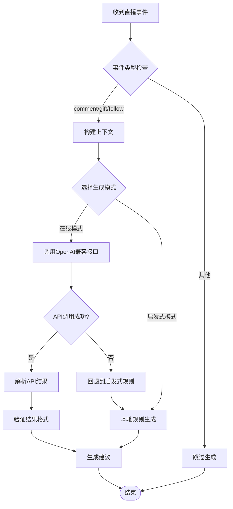
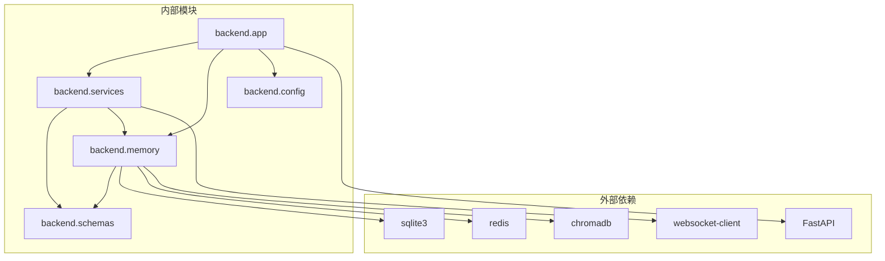

# 后端系统

<cite>
**本文档引用的文件**
- [backend/app.py](file://backend/app.py)
- [backend/config.py](file://backend/config.py)
- [backend/schemas/live.py](file://backend/schemas/live.py)
- [backend/memory/session_memory.py](file://backend/memory/session_memory.py)
- [backend/memory/long_term.py](file://backend/memory/long_term.py)
- [backend/memory/vector_store.py](file://backend/memory/vector_store.py)
- [backend/services/agent.py](file://backend/services/agent.py)
- [backend/services/broker.py](file://backend/services/broker.py)
- [backend/services/collector.py](file://backend/services/collector.py)
- [requirements.txt](file://requirements.txt)
- [README.md](file://README.md)
- [USAGE.md](file://USAGE.md)
</cite>

## 目录
1. [简介](#简介)
2. [项目结构](#项目结构)
3. [核心组件](#核心组件)
4. [架构概览](#架构概览)
5. [详细组件分析](#详细组件分析)
6. [依赖关系分析](#依赖关系分析)
7. [性能考虑](#性能考虑)
8. [故障排除指南](#故障排除指南)
9. [结论](#结论)

## 简介

这是一个面向抖音直播场景的实时提词项目，采用Python后端技术栈构建。系统实现了完整的直播事件采集、处理、存储和AI建议生成功能，为直播主播提供智能化的实时提词支持。

该后端系统基于FastAPI框架，集成了事件发布订阅模式、多层记忆系统（短期会话记忆、长期存储、向量检索）和双模式AI建议生成器，能够在模型不可用时自动回退到本地启发式规则。

## 项目结构

后端系统采用清晰的分层架构设计，主要包含以下核心模块：

**图表来源**
- [backend/app.py:1-220](file://backend/app.py#L1-L220)
- [backend/config.py:1-94](file://backend/config.py#L1-L94)

**章节来源**
- [backend/app.py:1-220](file://backend/app.py#L1-L220)
- [backend/config.py:1-94](file://backend/config.py#L1-L94)

## 核心组件

### FastAPI应用入口点

应用入口点位于`backend/app.py`，采用异步上下文管理器模式管理生命周期，确保资源的正确初始化和清理。

**关键特性：**
- 异步生命周期管理（lifespan）
- CORS跨域中间件配置
- 事件发布订阅系统集成
- 多种API接口提供

### 配置管理系统

配置系统实现了.env文件读取和环境变量解析，提供灵活的运行时配置管理。

**核心功能：**
- .env文件自动加载
- 环境变量优先级处理
- 默认值设置和类型转换
- 目录自动创建机制

**章节来源**
- [backend/app.py:84-92](file://backend/app.py#L84-L92)
- [backend/config.py:11-36](file://backend/config.py#L11-L36)
- [backend/config.py:40-94](file://backend/config.py#L40-L94)

## 架构概览

系统采用事件驱动架构，通过发布订阅模式实现组件间的松耦合通信：

**图表来源**
- [backend/app.py:61-78](file://backend/app.py#L61-L78)
- [backend/services/broker.py:28-39](file://backend/services/broker.py#L28-L39)
- [backend/services/collector.py:145-159](file://backend/services/collector.py#L145-L159)

## 详细组件分析

### 数据模型设计

系统定义了完整的数据模型体系，确保事件处理的一致性和完整性：

**图表来源**
- [backend/schemas/live.py:29-95](file://backend/schemas/live.py#L29-L95)

**章节来源**
- [backend/schemas/live.py:8-95](file://backend/schemas/live.py#L8-L95)

### 事件处理系统

事件处理系统实现了完整的事件发布订阅模式，支持多种事件类型的处理和分发：

#### 事件发布订阅模式

**图表来源**
- [backend/app.py:61-78](file://backend/app.py#L61-L78)
- [backend/services/broker.py:28-39](file://backend/services/broker.py#L28-L39)

#### 事件收集器工作原理

事件收集器负责从本地WebSocket服务接收直播事件，进行标准化处理后提交到事件循环：

**核心功能：**
- WebSocket连接管理
- 事件标准化转换
- 自动重连机制
- 线程安全的消息传递

**章节来源**
- [backend/services/collector.py:38-284](file://backend/services/collector.py#L38-L284)

### AI建议生成器

AI建议生成器实现了双模式支持，能够在在线模型和本地启发式规则之间无缝切换：

**图表来源**
- [backend/services/agent.py:73-114](file://backend/services/agent.py#L73-L114)
- [backend/services/agent.py:183-329](file://backend/services/agent.py#L183-L329)

**章节来源**
- [backend/services/agent.py:23-393](file://backend/services/agent.py#L23-L393)

### 内存管理系统

内存管理系统采用多层架构，结合短期会话内存、长期存储和向量检索，实现高效的数据管理：

#### 短期会话内存

短期会话内存支持Redis和进程内两种模式，确保在不同部署环境下都能正常运行：

**Redis模式特性：**
- 分布式共享内存
- TTL自动过期
- 持久化支持

**进程内模式特性：**
- 自动降级机制
- 内存限制保护
- 简单可靠

#### 长期存储

长期存储基于SQLite实现，提供完整的事件持久化和查询能力：

**核心表结构：**
- events: 直播事件存储
- suggestions: 建议记录
- viewer_profiles: 用户画像
- live_sessions: 直播会话
- viewer_notes: 用户备注

#### 向量存储

向量存储支持Chroma和轻量文本相似度两种模式：

**Chroma模式：**
- 持久化向量索引
- 高精度相似度检索
- 大规模数据支持

**轻量模式：**
- 基于哈希的嵌入函数
- 文本相似度计算
- 无需外部依赖

**章节来源**
- [backend/memory/session_memory.py:17-113](file://backend/memory/session_memory.py#L17-L113)
- [backend/memory/long_term.py:36-750](file://backend/memory/long_term.py#L36-L750)
- [backend/memory/vector_store.py:52-108](file://backend/memory/vector_store.py#L52-L108)

## 依赖关系分析

系统依赖关系清晰，各模块职责明确，耦合度适中：

**图表来源**
- [requirements.txt:1-6](file://requirements.txt#L1-L6)
- [backend/app.py:13-20](file://backend/app.py#L13-L20)

**章节来源**
- [requirements.txt:1-6](file://requirements.txt#L1-L6)

## 性能考虑

系统在设计时充分考虑了性能优化：

### 异步处理
- 事件处理完全基于异步I/O
- WebSocket连接非阻塞
- 内存操作无锁化设计

### 缓存策略
- Redis缓存热点数据
- 进程内缓存降级保护
- 向量索引预热机制

### 资源管理
- 连接池复用
- 自动资源清理
- 内存使用限制

## 故障排除指南

### 常见问题诊断

**1. 事件无法接收**
- 检查douyinLive服务是否启动
- 验证ROOM_ID配置正确性
- 确认WebSocket连接状态

**2. 建议生成失败**
- 检查LLM_MODE配置
- 验证API密钥有效性
- 查看网络连接状态

**3. 数据存储异常**
- 检查SQLite数据库文件权限
- 验证磁盘空间充足
- 确认Chroma服务可用性

**章节来源**
- [USAGE.md:198-256](file://USAGE.md#L198-L256)

## 结论

该后端系统展现了良好的架构设计和实现质量，具有以下特点：

**优势：**
- 清晰的分层架构和职责分离
- 强大的事件驱动处理能力
- 灵活的配置管理和部署适应性
- 完善的错误处理和降级机制

**扩展建议：**
- 增加更多的监控指标
- 实现更精细的权限控制
- 添加更多AI模型支持
- 优化大规模数据处理能力

系统为直播场景提供了可靠的实时提词解决方案，具备良好的可维护性和扩展性。