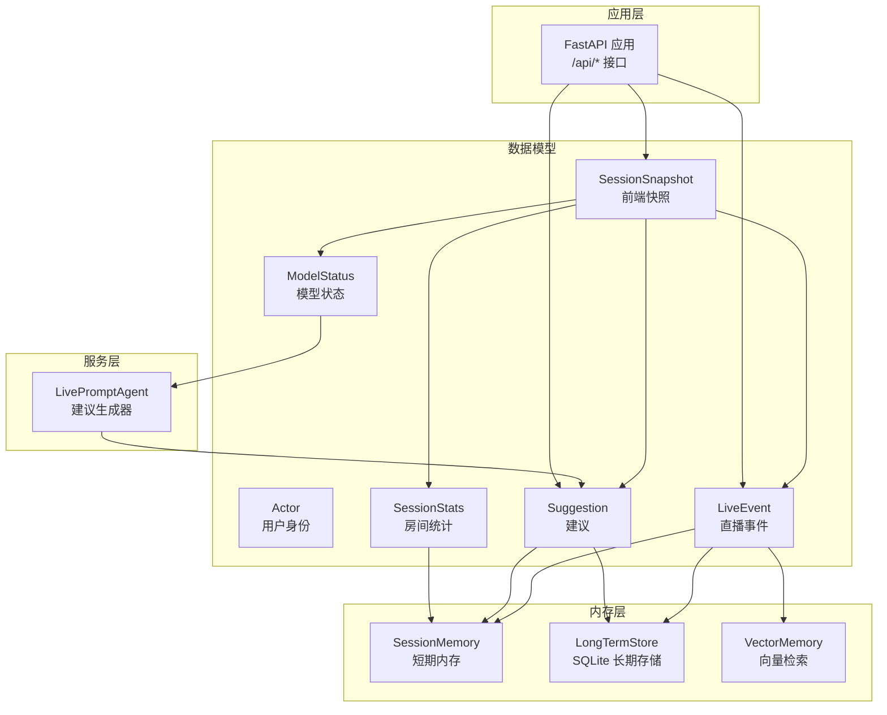
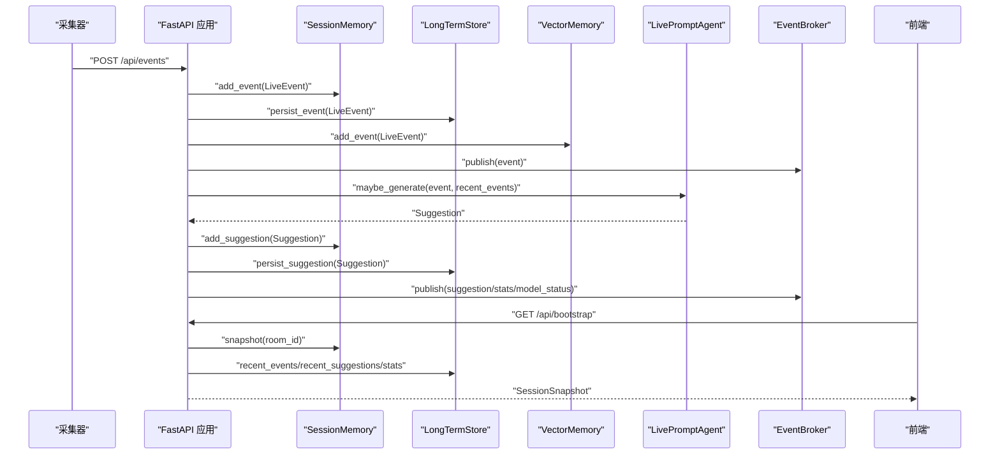
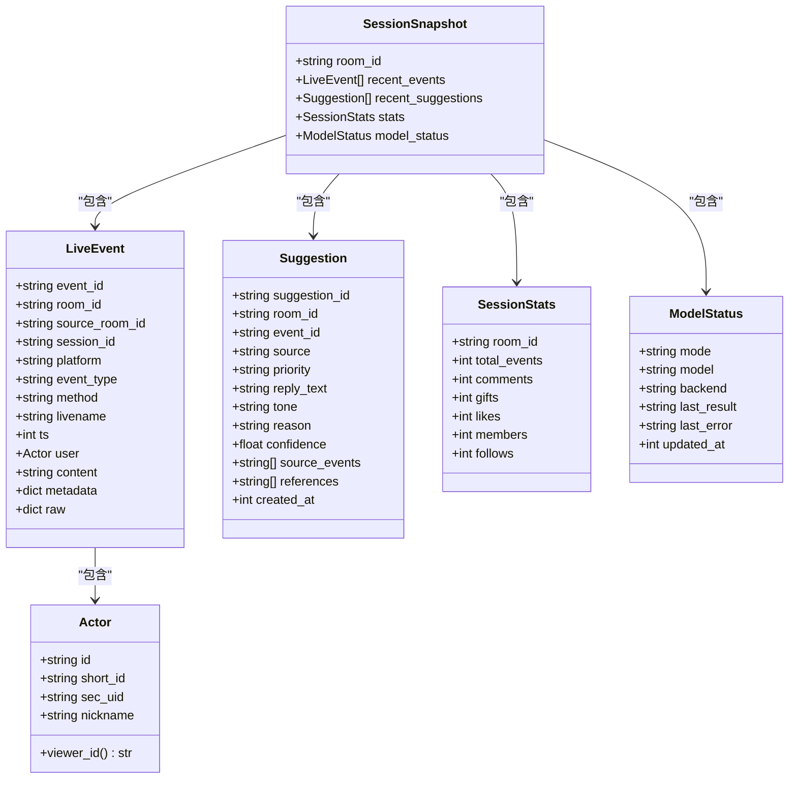

# 数据模型

<cite>
**本文引用的文件**
- [backend/schemas/live.py](file://backend/schemas/live.py)
- [backend/memory/session_memory.py](file://backend/memory/session_memory.py)
- [backend/memory/long_term.py](file://backend/memory/long_term.py)
- [backend/services/agent.py](file://backend/services/agent.py)
- [backend/app.py](file://backend/app.py)
- [README.md](file://README.md)
</cite>

## 目录
1. [简介](#简介)
2. [项目结构](#项目结构)
3. [核心组件](#核心组件)
4. [架构总览](#架构总览)
5. [详细组件分析](#详细组件分析)
6. [依赖分析](#依赖分析)
7. [性能考量](#性能考量)
8. [故障排查指南](#故障排查指南)
9. [结论](#结论)
10. [附录](#附录)

## 简介
本文件系统性梳理后端共享数据模型，重点覆盖以下 Pydantic 模型：
- LiveEvent：标准化的直播事件模型，贯穿采集、存储、API 与前端展示
- Suggestion：建议生成结果模型，承载回复文本、语气、置信度等
- SessionSnapshot：前端初始化快照，聚合近期事件、建议、统计与模型状态
- ModelStatus：模型后端状态，用于前端展示与监控
- SessionStats：房间轻量统计，汇总事件类型计数
- Actor：事件中的最小用户身份信息

文档将详细说明字段定义、数据类型、验证规则、序列化/反序列化过程、模型间关系与依赖、以及常见使用场景与错误处理策略。

## 项目结构
数据模型主要位于 backend/schemas/live.py，配合内存层（短期/长期）与服务层（Agent）共同完成事件流转与建议生成。

图表来源
- [backend/schemas/live.py:8-94](file://backend/schemas/live.py#L8-L94)
- [backend/memory/session_memory.py:17-113](file://backend/memory/session_memory.py#L17-L113)
- [backend/memory/long_term.py:36-750](file://backend/memory/long_term.py#L36-L750)
- [backend/services/agent.py:23-393](file://backend/services/agent.py#L23-L393)
- [backend/app.py:1-220](file://backend/app.py#L1-L220)

章节来源
- [backend/schemas/live.py:1-95](file://backend/schemas/live.py#L1-L95)
- [backend/memory/session_memory.py:1-113](file://backend/memory/session_memory.py#L1-L113)
- [backend/memory/long_term.py:1-750](file://backend/memory/long_term.py#L1-L750)
- [backend/services/agent.py:1-393](file://backend/services/agent.py#L1-L393)
- [backend/app.py:1-220](file://backend/app.py#L1-L220)

## 核心组件
本节对每个模型进行字段定义、数据类型、默认值与验证规则的说明，并指出其在系统中的职责与约束。

- Actor
  - 字段：id、short_id、sec_uid、nickname
  - 类型：字符串
  - 默认值：空字符串或“未知用户”
  - 行为：提供 viewer_id 属性，按 id/sec_uid/short_id/nickname 优先级拼接标识
  - 用途：封装事件中的用户身份，便于后续统计与画像

- LiveEvent
  - 字段：event_id、room_id、source_room_id、session_id、platform、event_type、method、livename、ts、user、content、metadata、raw
  - 类型：字符串、整数、字典、模型实例
  - 默认值：部分字段提供默认值（如 platform、livename、ts）
  - 验证：Pydantic 自动校验字段类型与必填项
  - 用途：统一直播事件结构，贯穿采集、存储、API 与前端

- Suggestion
  - 字段：suggestion_id、room_id、event_id、source、priority、reply_text、tone、reason、confidence、source_events、references、created_at
  - 类型：字符串、浮点数、列表、整数
  - 默认值：source、priority、confidence 等提供默认值
  - 验证：Agent 在生成建议时会规范化字段（如 priority 归一化、confidence 限定范围）
  - 用途：承载建议生成结果，供前端展示与后续持久化

- SessionStats
  - 字段：room_id、total_events、comments、gifts、likes、members、follows
  - 类型：整数
  - 默认值：非负整数
  - 用途：前端轻量统计，展示事件类型分布

- ModelStatus
  - 字段：mode、model、backend、last_result、last_error、updated_at
  - 类型：字符串、整数
  - 默认值：默认模式与状态
  - 用途：展示当前模型后端状态（在线/回退/错误），用于前端监控

- SessionSnapshot
  - 字段：room_id、recent_events、recent_suggestions、stats、model_status
  - 类型：模型实例
  - 默认值：默认工厂函数
  - 用途：前端初始化快照，聚合近期事件、建议、统计与模型状态

章节来源
- [backend/schemas/live.py:8-94](file://backend/schemas/live.py#L8-L94)

## 架构总览
数据模型在系统中的流转路径如下：
- 采集器将原始直播消息标准化为 LiveEvent
- LiveEvent 写入短期内存与长期存储，并构建向量索引
- Agent 基于上下文生成 Suggestion，写入短期与长期存储
- SessionSnapshot 聚合近期事件、建议、统计与模型状态，返回给前端
- FastAPI 接口提供 /api/bootstrap、/api/events 等，支撑前端初始化与实时流

图表来源
- [backend/app.py:61-78](file://backend/app.py#L61-L78)
- [backend/memory/session_memory.py:42-112](file://backend/memory/session_memory.py#L42-L112)
- [backend/memory/long_term.py:420-524](file://backend/memory/long_term.py#L420-L524)
- [backend/services/agent.py:73-94](file://backend/services/agent.py#L73-L94)
- [backend/services/agent.py:183-329](file://backend/services/agent.py#L183-L329)

## 详细组件分析

### LiveEvent 模型
- 设计要点
  - 统一事件字段，确保跨模块一致性
  - user 字段为 Actor 模型，便于后续画像与统计
  - metadata/raw 字段保留原始与扩展信息
- 验证规则
  - 必填字段由 Pydantic 校验
  - 平台默认值、时间戳等提供默认值
- 使用场景
  - API 请求体、WebSocket/SSE 推送、数据库持久化
- 序列化/反序列化
  - 写入短期内存时使用 model_dump_json
  - 读取时使用 model_validate_json 还原对象
- 错误处理
  - 若缺少必要字段，Pydantic 抛出异常
  - 建议在上游采集阶段保证字段完整性

章节来源
- [backend/schemas/live.py:29-44](file://backend/schemas/live.py#L29-L44)
- [backend/memory/session_memory.py:42-73](file://backend/memory/session_memory.py#L42-L73)
- [backend/app.py:129-132](file://backend/app.py#L129-L132)

### Suggestion 模型
- 设计要点
  - 包含建议来源（启发式/模型）、优先级、回复文本、语气、理由、置信度
  - source_events/references 记录关联事件与相似历史
  - created_at 记录生成时间
- 生成与规范化
  - Agent 优先调用在线模型，失败回退启发式规则
  - 规范化逻辑将 priority 归一化为 low/medium/high，confidence 限定在 0~1
- 使用场景
  - 写入短期/长期存储、前端展示、SSE/WebSocket 推送
- 序列化/反序列化
  - 写入短期内存时使用 model_dump_json
  - 读取时使用 model_validate_json 还原对象
- 错误处理
  - 模型返回格式异常、缺失关键字段时，Agent 标记错误状态并回退

章节来源
- [backend/schemas/live.py:47-61](file://backend/schemas/live.py#L47-L61)
- [backend/services/agent.py:96-113](file://backend/services/agent.py#L96-L113)
- [backend/services/agent.py:353-392](file://backend/services/agent.py#L353-L392)
- [backend/memory/session_memory.py:54-84](file://backend/memory/session_memory.py#L54-L84)

### SessionSnapshot 模型
- 设计要点
  - 聚合近期事件、建议、统计与模型状态，作为前端初始化数据包
  - stats 与 model_status 为独立模型，便于扩展
- 生成流程
  - 优先从短期内存获取，若为空则回退到长期存储
  - model_status 来自 Agent 的当前状态
- 使用场景
  - /api/bootstrap 接口返回前端初始化快照
- 序列化/反序列化
  - 返回时使用 model_dump

章节来源
- [backend/schemas/live.py:87-94](file://backend/schemas/live.py#L87-L94)
- [backend/app.py:49-58](file://backend/app.py#L49-L58)
- [backend/memory/long_term.py:522-524](file://backend/memory/long_term.py#L522-L524)

### ModelStatus 模型
- 设计要点
  - 记录当前模式（在线/启发式）、模型名、后端地址、最近结果、错误信息、更新时间
- 更新机制
  - Agent 在每次建议生成后更新状态
- 使用场景
  - 前端状态展示、健康检查、运维监控

章节来源
- [backend/schemas/live.py:76-84](file://backend/schemas/live.py#L76-L84)
- [backend/services/agent.py:39-54](file://backend/services/agent.py#L39-L54)

### SessionStats 模型
- 设计要点
  - 轻量统计，包含各类事件计数
- 生成来源
  - 短期内存窗口统计或长期存储聚合查询
- 使用场景
  - 前端统计展示、快照 stats 字段

章节来源
- [backend/schemas/live.py:64-73](file://backend/schemas/live.py#L64-L73)
- [backend/memory/session_memory.py:86-102](file://backend/memory/session_memory.py#L86-L102)
- [backend/memory/long_term.py:504-521](file://backend/memory/long_term.py#L504-L521)

### Actor 模型
- 设计要点
  - 最小用户身份信息，提供 viewer_id 属性用于唯一标识
- 使用场景
  - LiveEvent.user 字段、长期存储用户画像、统计与标签

章节来源
- [backend/schemas/live.py:8-26](file://backend/schemas/live.py#L8-L26)

## 依赖分析
- 模型间依赖
  - LiveEvent 包含 Actor
  - SessionSnapshot 聚合 LiveEvent、Suggestion、SessionStats、ModelStatus
- 模块间依赖
  - SessionMemory 依赖 LiveEvent、Suggestion、SessionStats、SessionSnapshot
  - LongTermStore 依赖 LiveEvent、Suggestion、SessionStats、SessionSnapshot
  - LivePromptAgent 依赖 Suggestion，并维护 ModelStatus
  - FastAPI 应用依赖上述所有模型与服务

图表来源
- [backend/schemas/live.py:8-94](file://backend/schemas/live.py#L8-L94)

章节来源
- [backend/schemas/live.py:1-95](file://backend/schemas/live.py#L1-L95)
- [backend/memory/session_memory.py:9-113](file://backend/memory/session_memory.py#L9-L113)
- [backend/memory/long_term.py:8-750](file://backend/memory/long_term.py#L8-L750)
- [backend/services/agent.py:17-393](file://backend/services/agent.py#L17-L393)
- [backend/app.py:17-29](file://backend/app.py#L17-L29)

## 性能考量
- 序列化/反序列化
  - 短期内存使用 model_dump_json/model_validate_json，减少对象开销
  - 长期存储使用 Pydantic model_dump/model_validate，便于 ORM 映射
- 缓存与降级
  - Redis 可选：未安装时短期内存退化为进程内队列
  - Chroma 可选：未安装时向量检索退化为轻量相似度方案
- 内存窗口
  - 短期事件与建议采用定长队列，避免无限增长
- 查询优化
  - 长期存储建立索引，提升统计与历史查询效率

章节来源
- [backend/memory/session_memory.py:11-31](file://backend/memory/session_memory.py#L11-L31)
- [backend/memory/long_term.py:183-195](file://backend/memory/long_term.py#L183-L195)
- [backend/memory/vector_store.py:13-16](file://backend/memory/vector_store.py#L13-L16)

## 故障排查指南
- 建议生成失败
  - 现象：last_result 为 error，last_error 记录具体原因
  - 处理：检查 LLM 接口连通性、鉴权、超时设置
- JSON 解析异常
  - 现象：模型返回内容无法解析为 JSON
  - 处理：Agent 会尝试多种候选，若仍失败，回退启发式规则
- 字段缺失或类型不符
  - 现象：规范化失败，标记 invalid_payload_shape
  - 处理：修正模型输出格式，确保包含 priority、reply_text、tone、reason、confidence
- Redis/Chroma 未安装
  - 现象：短期/向量能力降级
  - 处理：安装对应依赖或接受降级能力

章节来源
- [backend/services/agent.py:222-285](file://backend/services/agent.py#L222-L285)
- [backend/services/agent.py:331-392](file://backend/services/agent.py#L331-L392)
- [backend/memory/session_memory.py:11-31](file://backend/memory/session_memory.py#L11-L31)
- [backend/memory/vector_store.py:13-16](file://backend/memory/vector_store.py#L13-L16)

## 结论
数据模型以 Pydantic 为基础，围绕 LiveEvent、Suggestion、SessionSnapshot、ModelStatus、SessionStats、Actor 构建了统一、可扩展且具备强约束的数据契约。通过短期/长期内存与向量检索的协同，结合 Agent 的建议生成与状态管理，实现了从采集到前端展示的完整闭环。建议在生产环境中：
- 严格遵循模型字段与默认值约定
- 关注序列化/反序列化性能与可靠性
- 预留可选依赖的降级策略
- 加强日志与状态监控，快速定位问题

## 附录

### 使用示例与序列化/反序列化流程
- 写入短期内存（事件）
  - 步骤：LiveEvent.model_dump_json() -> Redis/队列 -> lpush/ltrim/expire
  - 参考：[backend/memory/session_memory.py:42-53](file://backend/memory/session_memory.py#L42-L53)
- 读取短期内存（事件）
  - 步骤：lrange -> model_validate_json -> LiveEvent 列表
  - 参考：[backend/memory/session_memory.py:66-73](file://backend/memory/session_memory.py#L66-L73)
- 写入短期内存（建议）
  - 步骤：Suggestion.model_dump_json() -> Redis/队列 -> lpush/ltrim/expire
  - 参考：[backend/memory/session_memory.py:54-64](file://backend/memory/session_memory.py#L54-L64)
- 读取短期内存（建议）
  - 步骤：lrange -> model_validate_json -> Suggestion 列表
  - 参考：[backend/memory/session_memory.py:75-84](file://backend/memory/session_memory.py#L75-L84)
- 生成 SessionSnapshot
  - 步骤：snapshot() -> 聚合 recent_events/recent_suggestions/stats -> model_status.from(agent.current_status())
  - 参考：[backend/app.py:49-58](file://backend/app.py#L49-L58)

### API 响应格式
- /api/bootstrap
  - 返回：SessionSnapshot.model_dump()
  - 参考：[backend/app.py:109-112](file://backend/app.py#L109-L112)
- /api/events
  - 请求：LiveEvent
  - 响应：{ accepted, event_id, session_id, suggestion }
  - 参考：[backend/app.py:129-132](file://backend/app.py#L129-L132)

### 实际数据示例（字段说明）
- LiveEvent 示例字段
  - event_id、room_id、platform、event_type、method、livename、ts、user、content、metadata、raw
  - 参考：[README.md:276-297](file://README.md#L276-L297)
- Suggestion 示例字段
  - suggestion_id、room_id、event_id、source、priority、reply_text、tone、reason、confidence、source_events、references、created_at
  - 参考：[backend/schemas/live.py:47-61](file://backend/schemas/live.py#L47-L61)
- SessionSnapshot 示例字段
  - room_id、recent_events、recent_suggestions、stats、model_status
  - 参考：[backend/schemas/live.py:87-94](file://backend/schemas/live.py#L87-L94)