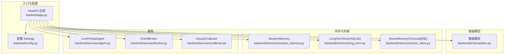
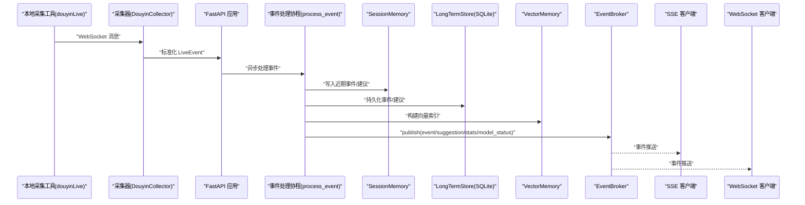
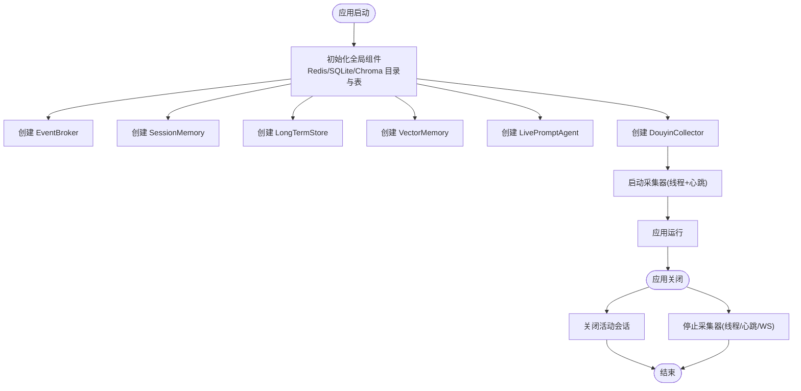
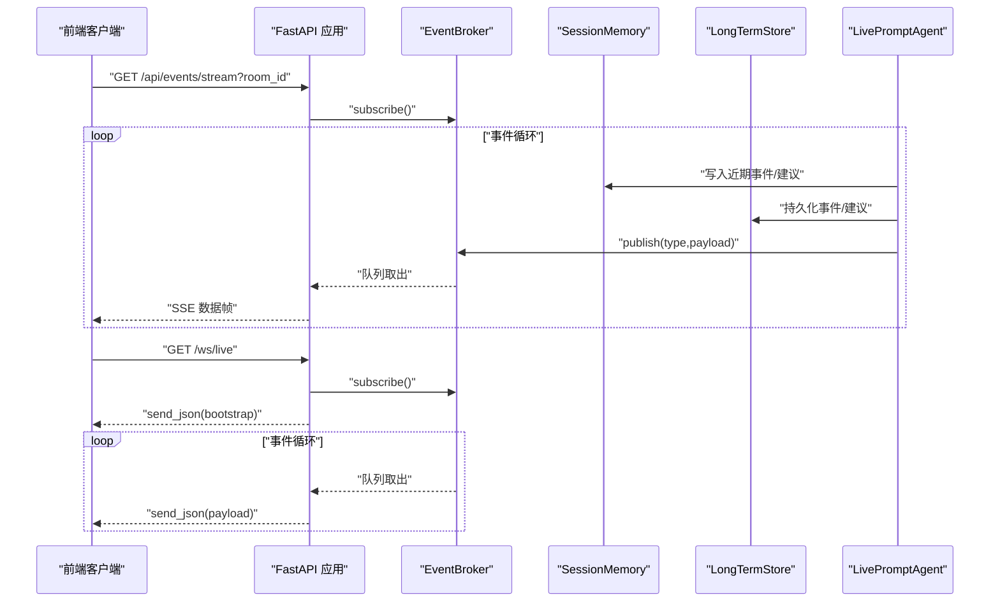
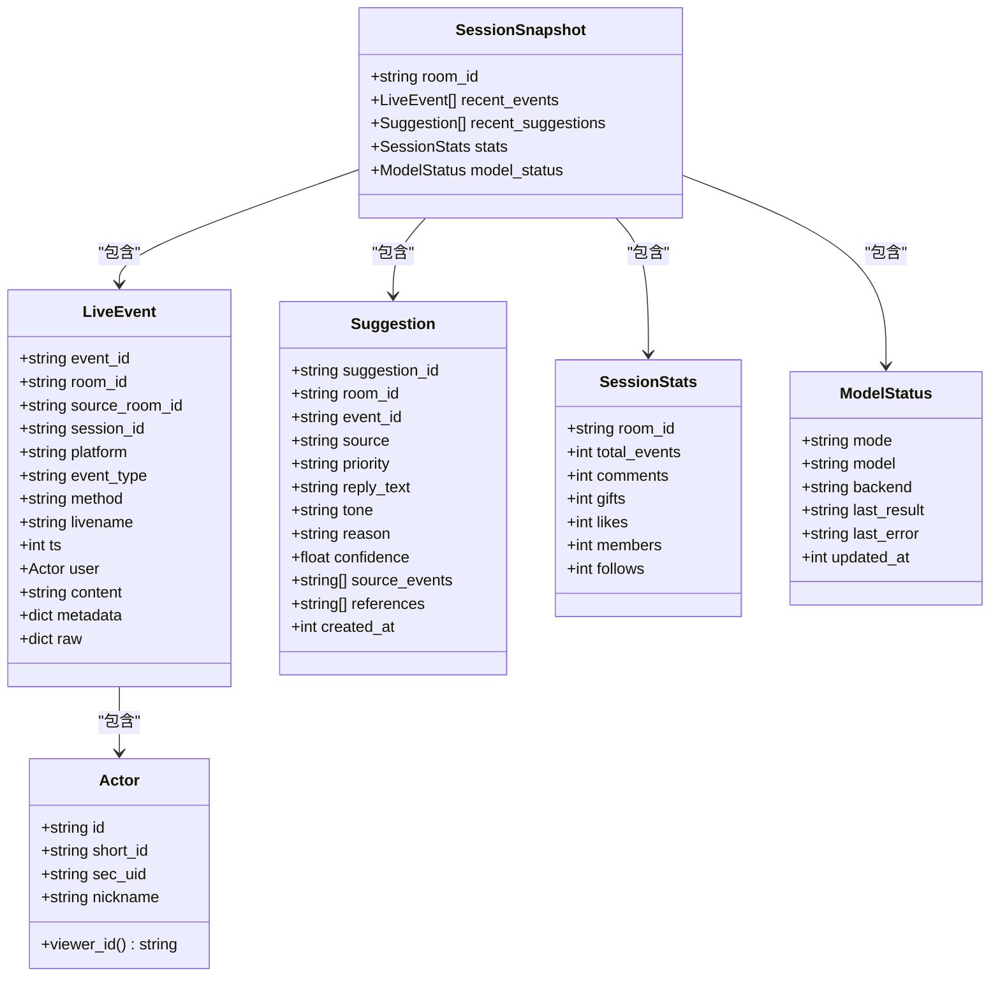
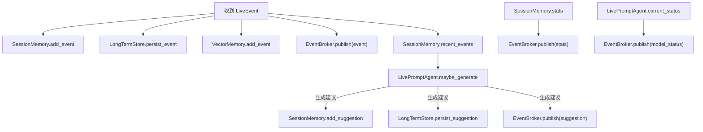
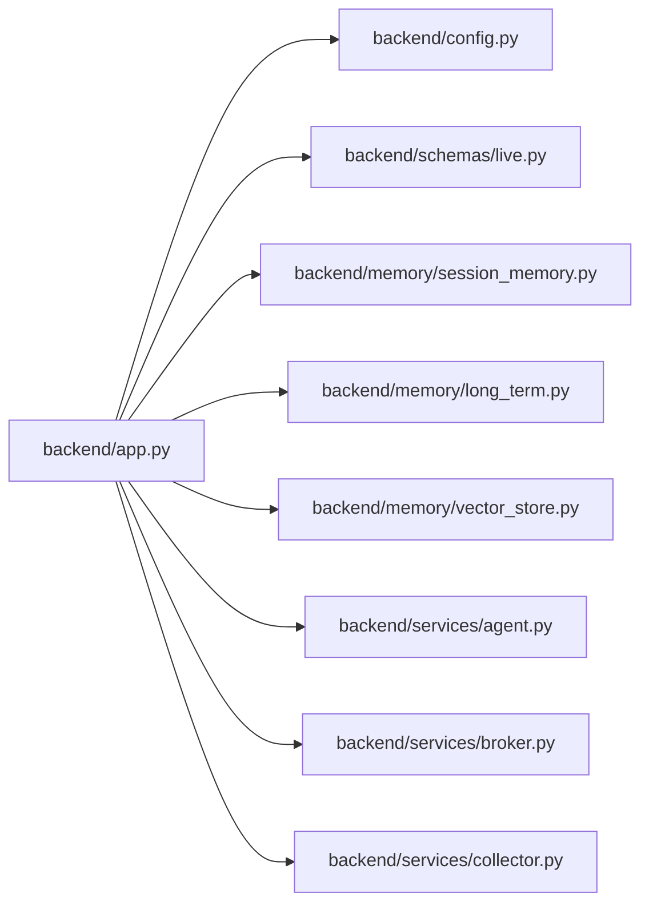

# 核心应用

<cite>
**本文引用的文件**
- [backend/app.py](file://backend/app.py)
- [backend/config.py](file://backend/config.py)
- [backend/schemas/live.py](file://backend/schemas/live.py)
- [backend/memory/session_memory.py](file://backend/memory/session_memory.py)
- [backend/memory/long_term.py](file://backend/memory/long_term.py)
- [backend/memory/vector_store.py](file://backend/memory/vector_store.py)
- [backend/services/agent.py](file://backend/services/agent.py)
- [backend/services/broker.py](file://backend/services/broker.py)
- [backend/services/collector.py](file://backend/services/collector.py)
- [README.md](file://README.md)
</cite>

## 目录
1. [简介](#简介)
2. [项目结构](#项目结构)
3. [核心组件](#核心组件)
4. [架构总览](#架构总览)
5. [详细组件分析](#详细组件分析)
6. [依赖分析](#依赖分析)
7. [性能考量](#性能考量)
8. [故障排查指南](#故障排查指南)
9. [结论](#结论)
10. [附录](#附录)

## 简介
本文件围绕 FastAPI 应用入口点 backend/app.py 展开，系统性阐述应用生命周期管理（lifespan 钩子）、CORS 中间件配置与安全考量、API 路由定义与实现（健康检查、房间切换、事件注入、用户管理等）、事件流处理机制（Server-Sent Events 与 WebSocket）、异常处理策略与错误响应格式，并结合内存层、长程存储、向量检索、提词代理与事件广播器等组件，帮助开发者全面理解整体架构与工作流程。

## 项目结构
后端采用“入口应用 + 配置 + 数据模型 + 内存/存储/检索 + 服务”的分层组织：
- 入口应用：backend/app.py，定义 FastAPI 应用、lifespan 生命周期、CORS、路由与事件流
- 配置模块：backend/config.py，加载 .env 并提供 Settings
- 数据模型：backend/schemas/live.py，定义 LiveEvent、Suggestion、SessionStats、ModelStatus、SessionSnapshot
- 内存层：backend/memory/session_memory.py（短期会话内存，支持 Redis 或进程内）
- 长程存储：backend/memory/long_term.py（SQLite，含事件、建议、用户画像、会话、备注等表）
- 向量检索：backend/memory/vector_store.py（Chroma 或本地哈希近似）
- 服务组件：backend/services/agent.py（提词建议生成器）、backend/services/broker.py（事件广播器）、backend/services/collector.py（Douyin 采集器）
- 文档：README.md，提供架构概览、接口说明与运行指引

图表来源
- [backend/app.py:94-101](file://backend/app.py#L94-L101)
- [backend/config.py:39-94](file://backend/config.py#L39-L94)
- [backend/schemas/live.py:29-95](file://backend/schemas/live.py#L29-L95)
- [backend/memory/session_memory.py:17-113](file://backend/memory/session_memory.py#L17-L113)
- [backend/memory/long_term.py:36-750](file://backend/memory/long_term.py#L36-L750)
- [backend/memory/vector_store.py:52-108](file://backend/memory/vector_store.py#L52-L108)
- [backend/services/agent.py:23-393](file://backend/services/agent.py#L23-L393)
- [backend/services/broker.py:10-40](file://backend/services/broker.py#L10-L40)
- [backend/services/collector.py:38-284](file://backend/services/collector.py#L38-L284)

章节来源
- [backend/app.py:1-220](file://backend/app.py#L1-L220)
- [backend/config.py:1-94](file://backend/config.py#L1-L94)
- [README.md:21-349](file://README.md#L21-L349)

## 核心组件
- FastAPI 应用与生命周期
  - 应用实例化与 lifespan 钩子：在应用启动时启动采集器，在关闭时关闭活动会话并停止采集器
  - CORS 中间件：允许任意来源、凭证、方法与头，便于前端跨域访问
- 事件处理流水线
  - 采集器接收本地 WebSocket 消息，标准化为 LiveEvent，提交至事件处理协程
  - 处理协程写入短期内存、长期存储、向量检索，发布事件到广播器，驱动 SSE/WS 推送
- 记忆与存储
  - SessionMemory：短期事件与建议，支持 Redis 或进程内
  - LongTermStore：SQLite 事件、建议、用户画像、会话、备注等
  - VectorMemory：Chroma 或本地哈希嵌入近似
- 提词代理
  - LivePromptAgent：优先 OpenAI 兼容接口，失败回退启发式规则，生成 Suggestion 并上报状态
- 事件广播器
  - EventBroker：维护订阅队列，广播事件、建议、统计与模型状态

章节来源
- [backend/app.py:84-92](file://backend/app.py#L84-L92)
- [backend/app.py:95-101](file://backend/app.py#L95-L101)
- [backend/services/collector.py:61-78](file://backend/services/collector.py#L61-L78)
- [backend/memory/session_memory.py:17-113](file://backend/memory/session_memory.py#L17-L113)
- [backend/memory/long_term.py:36-750](file://backend/memory/long_term.py#L36-L750)
- [backend/memory/vector_store.py:52-108](file://backend/memory/vector_store.py#L52-L108)
- [backend/services/agent.py:23-393](file://backend/services/agent.py#L23-L393)
- [backend/services/broker.py:10-40](file://backend/services/broker.py#L10-L40)

## 架构总览
应用以 FastAPI 为核心，通过生命周期钩子串联采集器与存储检索，事件处理完成后经广播器推送至 SSE/WS。前端通过 REST、SSE、WebSocket 获取实时数据与建议。

图表来源
- [backend/services/collector.py:145-159](file://backend/services/collector.py#L145-L159)
- [backend/app.py:61-78](file://backend/app.py#L61-L78)
- [backend/services/broker.py:28-39](file://backend/services/broker.py#L28-L39)

## 详细组件分析

### 应用生命周期与资源管理
- 启动阶段
  - 初始化：Redis/SQLite/Chroma 目录与数据库表结构
  - 创建事件广播器、短期内存、长期存储、向量检索、提词代理
  - 启动采集器（若启用且房间号有效）
- 关闭阶段
  - 关闭当前房间的活动会话
  - 停止采集器（关闭 WebSocket、等待线程退出）

图表来源
- [backend/app.py:25-29](file://backend/app.py#L25-L29)
- [backend/app.py:84-92](file://backend/app.py#L84-L92)
- [backend/services/collector.py:61-78](file://backend/services/collector.py#L61-L78)
- [backend/memory/long_term.py:50-155](file://backend/memory/long_term.py#L50-L155)
- [backend/memory/long_term.py:700-717](file://backend/memory/long_term.py#L700-L717)

章节来源
- [backend/app.py:84-92](file://backend/app.py#L84-L92)
- [backend/services/collector.py:99-116](file://backend/services/collector.py#L99-L116)
- [backend/memory/long_term.py:700-717](file://backend/memory/long_term.py#L700-L717)

### CORS 中间件配置与安全考虑
- 配置项
  - 允许任意来源、凭证、方法与头
- 安全建议
  - 生产环境建议限定 allow_origins 为受信域名
  - 明确 allow_methods 与 allow_headers，避免通配符扩大攻击面
  - 如需细粒度控制，结合认证中间件与速率限制

章节来源
- [backend/app.py:95-101](file://backend/app.py#L95-L101)

### API 路由定义与实现
- 健康检查
  - GET /health：返回服务状态、房间号与当前活动会话
- 前端初始化快照
  - GET /api/bootstrap：返回最近事件、建议、统计与模型状态
- 房间切换
  - POST /api/room：切换采集房间，必要时关闭旧会话并重启采集
- 事件注入
  - POST /api/events：手动注入标准化事件，触发处理流水线
- 用户与会话管理
  - GET /api/viewer：按 viewer_id 或 nickname 查询用户详情
  - GET /api/viewer/notes：列出用户备注
  - POST /api/viewer/notes：保存/更新用户备注
  - DELETE /api/viewer/notes/{note_id}：删除用户备注
  - GET /api/sessions：列出直播会话
  - GET /api/sessions/current：查询当前活动会话

章节来源
- [backend/app.py:104-107](file://backend/app.py#L104-L107)
- [backend/app.py:109-112](file://backend/app.py#L109-L112)
- [backend/app.py:115-126](file://backend/app.py#L115-L126)
- [backend/app.py:129-132](file://backend/app.py#L129-L132)
- [backend/app.py:135-141](file://backend/app.py#L135-L141)
- [backend/app.py:144-150](file://backend/app.py#L144-L150)
- [backend/app.py:153-164](file://backend/app.py#L153-L164)
- [backend/app.py:167-171](file://backend/app.py#L167-L171)
- [backend/app.py:174-178](file://backend/app.py#L174-L178)
- [backend/app.py:181-184](file://backend/app.py#L181-L184)

### 事件流处理机制（SSE 与 WebSocket）
- Server-Sent Events
  - GET /api/events/stream：按房间过滤事件，持续推送 event/suggestion/stats/model_status
  - 采用 JSON 包装与事件类型标注，支持重连与房间过滤
- WebSocket
  - GET /ws/live：连接后先发送 bootstrap 快照，随后持续推送广播事件

图表来源
- [backend/app.py:187-206](file://backend/app.py#L187-L206)
- [backend/app.py:209-220](file://backend/app.py#L209-L220)
- [backend/services/broker.py:16-39](file://backend/services/broker.py#L16-L39)
- [backend/app.py:61-78](file://backend/app.py#L61-L78)

章节来源
- [backend/app.py:187-220](file://backend/app.py#L187-L220)
- [backend/services/broker.py:10-40](file://backend/services/broker.py#L10-L40)

### 异常处理策略与错误响应格式
- HTTP 异常
  - 房间切换/保存备注/删除备注等接口在参数缺失或未找到时返回 4xx 错误
- WebSocket 断开
  - 连接断开时清理订阅队列，避免悬挂引用
- 采集器异常
  - 连接错误、消息非 JSON、标准化失败等均记录警告并忽略无效消息
- LLM 生成异常
  - OpenAI 兼容接口超时、网络错误、JSON 解析失败、返回结构缺失等情况均有日志与状态标记，并回退启发式规则

章节来源
- [backend/app.py:118-119](file://backend/app.py#L118-L119)
- [backend/app.py:139-140](file://backend/app.py#L139-L140)
- [backend/app.py:158-163](file://backend/app.py#L158-L163)
- [backend/app.py:168-170](file://backend/app.py#L168-L170)
- [backend/app.py:218-219](file://backend/app.py#L218-L219)
- [backend/services/collector.py:145-153](file://backend/services/collector.py#L145-L153)
- [backend/services/agent.py:222-285](file://backend/services/agent.py#L222-L285)

### 数据模型与快照
- LiveEvent：标准化直播事件，包含平台、事件类型、用户、内容、元数据与原始数据
- Suggestion：提词建议，包含优先级、回复文本、语气、理由、置信度等
- SessionStats：房间统计（事件总数、评论、礼物、点赞、成员、关注）
- ModelStatus：模型状态（模式、模型名、后端、最后结果、错误、更新时间）
- SessionSnapshot：前端初始化快照，包含最近事件、建议、统计与模型状态

图表来源
- [backend/schemas/live.py:29-95](file://backend/schemas/live.py#L29-L95)

章节来源
- [backend/schemas/live.py:29-95](file://backend/schemas/live.py#L29-L95)

### 事件处理流水线与状态更新
- process_event：写入短期内存、长期存储、向量检索，发布事件、建议、统计与模型状态
- snapshot_with_status：聚合短期与长期数据，补充模型状态

图表来源
- [backend/app.py:61-78](file://backend/app.py#L61-L78)
- [backend/app.py:49-58](file://backend/app.py#L49-L58)
- [backend/services/agent.py:73-94](file://backend/services/agent.py#L73-L94)

章节来源
- [backend/app.py:49-78](file://backend/app.py#L49-L78)
- [backend/services/agent.py:73-94](file://backend/services/agent.py#L73-L94)

## 依赖分析
- 组件耦合
  - app.py 依赖配置、内存、存储、检索、代理与广播器
  - 采集器通过回调将事件注入应用事件循环，解耦采集与处理
- 外部依赖
  - websocket-client：采集器连接本地 WebSocket
  - fastapi/uvicorn：应用与 ASGI 服务器
  - redis/chromadb：可选增强短期与向量检索能力
- 循环依赖
  - 无直接循环依赖，模块职责清晰

图表来源
- [backend/app.py:13-21](file://backend/app.py#L13-L21)
- [backend/config.py:39-94](file://backend/config.py#L39-L94)
- [backend/schemas/live.py:29-95](file://backend/schemas/live.py#L29-L95)
- [backend/memory/session_memory.py:17-113](file://backend/memory/session_memory.py#L17-L113)
- [backend/memory/long_term.py:36-750](file://backend/memory/long_term.py#L36-L750)
- [backend/memory/vector_store.py:52-108](file://backend/memory/vector_store.py#L52-L108)
- [backend/services/agent.py:23-393](file://backend/services/agent.py#L23-L393)
- [backend/services/broker.py:10-40](file://backend/services/broker.py#L10-L40)
- [backend/services/collector.py:38-284](file://backend/services/collector.py#L38-L284)

章节来源
- [backend/app.py:13-21](file://backend/app.py#L13-L21)
- [backend/services/collector.py:145-159](file://backend/services/collector.py#L145-L159)

## 性能考量
- 短期内存
  - Redis 模式下使用列表与过期键，限制窗口长度，降低内存占用
  - 进程内模式使用双端队列，避免频繁扩容
- 长期存储
  - SQLite 表与索引优化常见查询（房间、事件类型、时间戳、会话）
  - 批量重建与增量更新策略减少重复计算
- 向量检索
  - Chroma 持久化集合；无依赖时使用哈希嵌入近似，兼顾可用性
- 事件流
  - SSE/WS 采用队列分发，避免阻塞主线程
- 采集器
  - 线程+心跳保活，断线重连与指数退避策略

[本节为通用指导，无需具体文件分析]

## 故障排查指南
- 采集器无法连接
  - 检查本地采集工具是否运行、端口与房间号配置
  - 查看采集器日志与重连间隔设置
- SSE/WS 无数据
  - 确认房间号过滤与订阅队列是否正确
  - 检查广播器队列是否被清理或溢出
- 事件未入库
  - 核对 SQLite 表结构与索引是否存在
  - 检查事件标准化是否成功
- LLM 生成失败
  - 检查模型网关地址、API Key、超时与返回格式
  - 关注状态标记与日志输出

章节来源
- [backend/services/collector.py:117-139](file://backend/services/collector.py#L117-L139)
- [backend/services/broker.py:31-39](file://backend/services/broker.py#L31-L39)
- [backend/memory/long_term.py:50-155](file://backend/memory/long_term.py#L50-L155)
- [backend/services/agent.py:222-285](file://backend/services/agent.py#L222-L285)

## 结论
该 FastAPI 应用以清晰的生命周期管理、完善的事件处理流水线与灵活的事件流推送为核心，结合短期内存、SQLite 长期存储与向量检索，实现了从采集、处理到实时展示的完整闭环。通过合理的 CORS 配置与异常处理策略，兼顾易用性与安全性。生产部署建议收紧 CORS、完善鉴权与限流，并监控关键指标与日志。

[本节为总结，无需具体文件分析]

## 附录
- 快速启动与运行
  - 启动本地采集工具、安装依赖、配置环境变量、启动后端与前端
- 接口清单
  - 健康检查、初始化快照、房间切换、事件注入、用户与会话管理、SSE/WS 实时流

章节来源
- [README.md:66-141](file://README.md#L66-L141)
- [README.md:208-275](file://README.md#L208-L275)