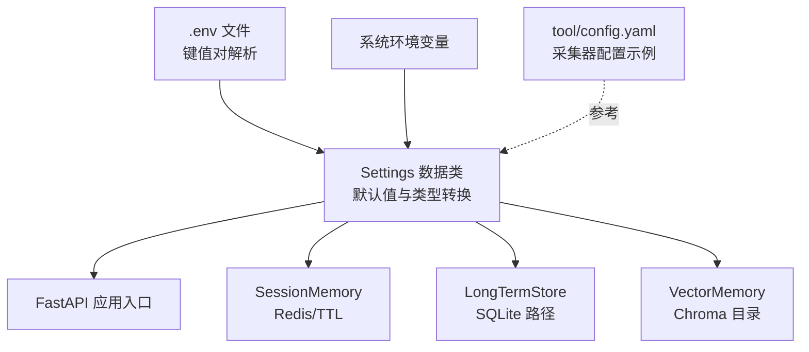
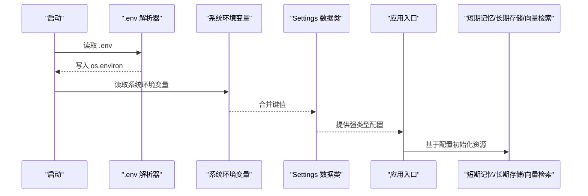
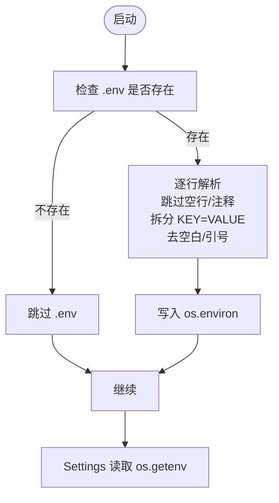
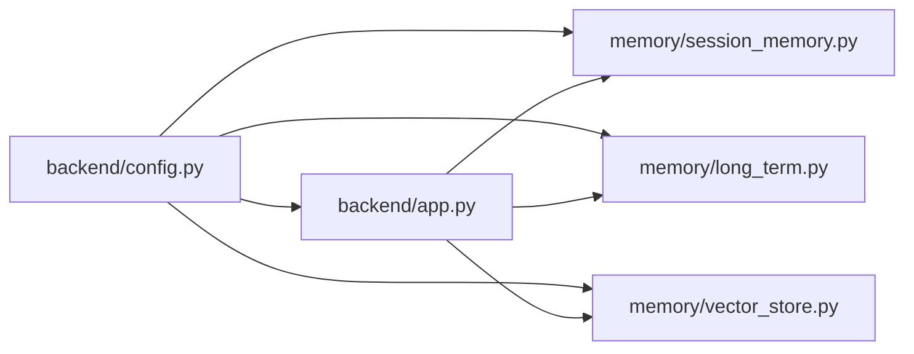

# 配置管理

<cite>
**本文引用的文件**
- [backend/config.py](file://backend/config.py)
- [backend/app.py](file://backend/app.py)
- [backend/memory/vector_store.py](file://backend/memory/vector_store.py)
- [backend/memory/long_term.py](file://backend/memory/long_term.py)
- [backend/memory/session_memory.py](file://backend/memory/session_memory.py)
- [tool/config.yaml](file://tool/config.yaml)
- [README.md](file://README.md)
- [USAGE.md](file://USAGE.md)
- [deprecated/config.py](file://deprecated/config.py)
</cite>

## 目录
1. [简介](#简介)
2. [项目结构](#项目结构)
3. [核心组件](#核心组件)
4. [架构总览](#架构总览)
5. [详细组件分析](#详细组件分析)
6. [依赖分析](#依赖分析)
7. [性能考虑](#性能考虑)
8. [故障排查指南](#故障排查指南)
9. [结论](#结论)
10. [附录](#附录)

## 简介
本文件系统性梳理配置管理的设计与实现，覆盖以下要点：
- 环境变量读取机制：.env 文件解析与加载顺序
- 配置参数作用与默认值：Redis 连接、数据库路径、向量存储目录等
- 加载顺序与优先级：.env 与系统环境变量的合并策略
- 验证与错误处理：类型转换、布尔解析、路径创建与回退策略
- 配置示例与最佳实践：开发与生产环境差异
- 配置变更影响与热重载：当前实现与建议

## 项目结构
配置相关的核心位置与职责：
- backend/config.py：.env 解析、Settings 数据类、运行时默认值与目录确保
- backend/app.py：应用入口，消费 settings 并初始化各子系统
- backend/memory/session_memory.py：短期记忆层，依赖 Redis URL 与 TTL
- backend/memory/long_term.py：长期存储层，依赖 SQLite 数据库路径
- backend/memory/vector_store.py：向量检索层，依赖 Chroma 目录
- tool/config.yaml：抖音采集工具的 YAML 配置示例
- README.md / USAGE.md：配置说明与示例
- deprecated/config.py：遗留配置示例（仅用于历史参考）

图表来源
- [backend/config.py:11-36](file://backend/config.py#L11-L36)
- [backend/config.py:39-94](file://backend/config.py#L39-L94)
- [backend/app.py:22-29](file://backend/app.py#L22-L29)

章节来源
- [backend/config.py:11-36](file://backend/config.py#L11-L36)
- [backend/config.py:39-94](file://backend/config.py#L39-L94)
- [backend/app.py:22-29](file://backend/app.py#L22-L29)

## 核心组件
- .env 解析器：按行读取，跳过空行与注释，解析 KEY=VALUE，去除多余空白与引号，写入 os.environ
- Settings 数据类：集中声明所有运行时配置，提供 ensure_dirs 创建必要目录，以及 LLM 地址/模型解析方法
- 应用初始化：在 app.py 中调用 ensure_dirs，随后基于 settings 初始化 Redis、SQLite、Chroma、Agent 等组件

章节来源
- [backend/config.py:11-36](file://backend/config.py#L11-L36)
- [backend/config.py:39-94](file://backend/config.py#L39-L94)
- [backend/app.py:22-29](file://backend/app.py#L22-L29)

## 架构总览
配置在系统中的流转路径：
- 启动时优先加载 .env，未找到则跳过
- 之后读取系统环境变量，后者覆盖前者
- Settings 统一解析为强类型值，提供默认值与回退策略
- 各子系统根据 Settings 初始化资源

图表来源
- [backend/config.py:11-36](file://backend/config.py#L11-L36)
- [backend/config.py:39-94](file://backend/config.py#L39-L94)
- [backend/app.py:22-29](file://backend/app.py#L22-L29)

## 详细组件分析

### .env 解析与加载顺序
- 行级解析：跳过空行与注释，仅处理 KEY=VALUE 形式
- 值清洗：去空白、去除首尾引号，避免多余转义
- 写入 os.environ：为后续 os.getenv 提供来源
- 加载时机：模块导入即执行，确保 Settings 初始化前可用

图表来源
- [backend/config.py:11-36](file://backend/config.py#L11-L36)

章节来源
- [backend/config.py:11-36](file://backend/config.py#L11-L36)

### Settings 数据类与默认值
- 基础服务：APP_HOST、APP_PORT
- 采集器：COLLECTOR_ENABLED、COLLECTOR_HOST、COLLECTOR_PORT、PING_INTERVAL、RECONNECT_DELAY
- 数据目录：DATA_DIR、DATABASE_PATH、CHROMA_DIR
- Redis：REDIS_URL、SESSION_TTL_SECONDS
- LLM：LLM_MODE、LLM_BASE_URL、LLM_MODEL、LLM_API_KEY、LLM_TEMPERATURE、LLM_TIMEOUT_SECONDS
- 辅助方法：
  - ensure_dirs：创建 data、数据库父目录、Chroma 目录
  - resolved_llm_base_url：根据 LLM_MODE 回退到 DashScope/OpenAI
  - resolved_llm_model：根据 LLM_MODE 回退到 qwen-plus-latest/gpt-4.1-mini

章节来源
- [backend/config.py:39-94](file://backend/config.py#L39-L94)

### 应用初始化与配置使用
- app.py 在启动时调用 settings.ensure_dirs
- 基于 settings 初始化：
  - SessionMemory：依赖 REDIS_URL 与 SESSION_TTL_SECONDS
  - LongTermStore：依赖 DATABASE_PATH
  - VectorMemory：依赖 CHROMA_DIR
  - Agent：依赖 Settings（LLM 模式、超时、温度等）
  - Collector：依赖 ROOM_ID、COLLECTOR_* 参数

章节来源
- [backend/app.py:22-29](file://backend/app.py#L22-L29)

### 短期记忆层（SessionMemory）与 Redis
- 优先使用 Redis：列表存储事件与建议，限制长度并设置 TTL
- 降级策略：若未安装 Redis 或未提供 URL，则使用进程内双端队列
- TTL 仅在 Redis 模式生效

章节来源
- [backend/memory/session_memory.py:17-113](file://backend/memory/session_memory.py#L17-L113)

### 长期存储层（LongTermStore）与 SQLite
- 初始化时创建表与索引，自动迁移列结构
- 事件持久化、会话聚合、用户画像、礼物统计、会话查询等
- 数据库路径由 DATABASE_PATH 决定

章节来源
- [backend/memory/long_term.py:36-750](file://backend/memory/long_term.py#L36-L750)

### 向量检索层（VectorMemory）与 Chroma
- 若安装 chromadb：使用 PersistentClient 与集合 live_history
- 未安装：使用哈希嵌入函数与内存列表，维持检索能力
- 存储目录由 CHROMA_DIR 决定

章节来源
- [backend/memory/vector_store.py:52-108](file://backend/memory/vector_store.py#L52-L108)

### 采集器配置示例（tool/config.yaml）
- 采集器端口、未知消息开关、Cookie 配置（可选）
- 该文件为采集器工具的 YAML 示例，非后端配置，但与 ROOM_ID 等参数配合使用

章节来源
- [tool/config.yaml:1-16](file://tool/config.yaml#L1-L16)

### 遗留配置示例（deprecated/config.py）
- 仅用于历史参考，不参与当前主流程

章节来源
- [deprecated/config.py:1-28](file://deprecated/config.py#L1-L28)

## 依赖分析
- 配置依赖链：
  - backend/config.py 为唯一配置源，.env 与系统环境变量在此汇聚
  - backend/app.py 依赖 settings 初始化各子系统
  - memory/* 层依赖 settings 的具体键值
- 外部依赖：
  - Redis：可选，用于短期记忆
  - Chroma：可选，用于向量检索
  - SQLite：必选，用于长期存储

图表来源
- [backend/config.py:39-94](file://backend/config.py#L39-L94)
- [backend/app.py:22-29](file://backend/app.py#L22-L29)
- [backend/memory/session_memory.py:17-113](file://backend/memory/session_memory.py#L17-L113)
- [backend/memory/long_term.py:36-750](file://backend/memory/long_term.py#L36-L750)
- [backend/memory/vector_store.py:52-108](file://backend/memory/vector_store.py#L52-L108)

## 性能考虑
- 目录创建：ensure_dirs 在启动时一次性创建，避免运行时 IO
- Redis TTL：在 Redis 模式下控制热数据生命周期，降低内存压力
- 向量检索降级：未安装 Chroma 时采用轻量策略，保证功能可用
- SQLite 自动迁移：在首次启动时进行，后续运行无额外开销

## 故障排查指南
- 无法加载 .env
  - 确认项目根目录存在 .env
  - 检查行格式是否为 KEY=VALUE，避免注释与空行干扰
- LLM 模式异常
  - LLM_MODE=heuristic：完全不调用远程模型
  - LLM_MODE=qwen：默认回退到 DashScope OpenAI 兼容接口
  - LLM_MODE=openai：可接入任意 OpenAI 兼容网关
  - API Key 为空时会回退读取 DASHSCOPE_API_KEY
- Redis 未生效
  - REDIS_URL 为空时短期记忆退化为进程内内存
  - 检查 Redis 可达性与 URL 格式
- Chroma 未生效
  - 未安装 chromadb 时向量检索退化为轻量文本相似策略
  - 检查 CHROMA_DIR 权限与磁盘空间
- 数据库路径异常
  - DATABASE_PATH 为 SQLite 文件路径，确保父目录可写
- 端口冲突
  - APP_HOST/APP_PORT 与 COLLECTOR_HOST/COLLECTOR_PORT 冲突时需调整

章节来源
- [README.md:142-207](file://README.md#L142-L207)
- [USAGE.md:198-240](file://USAGE.md#L198-L240)

## 结论
本配置系统以最小实现满足本地开箱即用的目标：
- .env 与系统环境变量的合并策略清晰，后者覆盖前者
- Settings 提供强类型默认值与回退策略，确保各子系统稳定初始化
- Redis、Chroma、SQLite 均为可选增强，未安装也可运行基本流程
- 建议在生产环境明确区分 .env 与 CI/CD 注入的环境变量，严格校验敏感参数

## 附录

### 配置参数清单与默认值
- 基础服务
  - APP_HOST: 127.0.0.1
  - APP_PORT: 8010
- 采集器
  - COLLECTOR_ENABLED: true
  - COLLECTOR_HOST: 127.0.0.1
  - COLLECTOR_PORT: 1088
  - COLLECTOR_PING_INTERVAL_SECONDS: 30
  - COLLECTOR_RECONNECT_DELAY_SECONDS: 3
- 数据目录
  - DATA_DIR: data
  - DATABASE_PATH: data/live_prompter.db
  - CHROMA_DIR: data/chroma
- Redis
  - REDIS_URL: ""
  - SESSION_TTL_SECONDS: 14400
- LLM
  - LLM_MODE: heuristic
  - LLM_BASE_URL: 空字符串（解析时根据 LLM_MODE 回退）
  - LLM_MODEL: 空字符串（解析时根据 LLM_MODE 回退）
  - LLM_API_KEY: 空字符串（为空时回退读取 DASHSCOPE_API_KEY）
  - LLM_TEMPERATURE: 0.4
  - LLM_TIMEOUT_SECONDS: 6.0

章节来源
- [backend/config.py:43-60](file://backend/config.py#L43-L60)
- [backend/config.py:70-90](file://backend/config.py#L70-L90)

### 加载顺序与优先级
- 启动时先加载 .env（若存在），再读取系统环境变量
- 系统环境变量覆盖 .env 中同名键
- Settings 初始化时提供默认值，确保类型安全

章节来源
- [backend/config.py:11-36](file://backend/config.py#L11-L36)
- [backend/config.py:39-94](file://backend/config.py#L39-L94)

### 配置验证与错误处理
- 类型转换：整数、浮点数、布尔值均通过显式转换，失败时使用默认值
- 布尔解析：支持 "1"/"true"/"yes"/"on" 等大小写无关的真值
- 路径创建：ensure_dirs 在启动时创建必要目录，避免运行时异常
- LLM 回退：resolved_llm_base_url/resolved_llm_model 根据 LLM_MODE 返回合理默认值

章节来源
- [backend/config.py:43-60](file://backend/config.py#L43-L60)
- [backend/config.py:63-90](file://backend/config.py#L63-L90)

### 配置示例与最佳实践
- 开发环境
  - ROOM_ID：填写有效抖音房间标识
  - LLM_MODE：可设为 heuristic 以离线调试
  - REDIS_URL：留空以使用进程内短期记忆
  - DATABASE_PATH：保持默认 SQLite 路径
- 生产环境
  - REDIS_URL：指向可用 Redis 实例，设置合理 SESSION_TTL_SECONDS
  - LLM_MODE：qwen 或 openai，确保 API Key 正确
  - LLM_BASE_URL：根据供应商配置
  - CHROMA_DIR：指向持久化目录，具备写权限
- 安全建议
  - 不将 .env 提交至版本库
  - 使用 CI/CD 注入敏感参数，避免硬编码

章节来源
- [README.md:142-207](file://README.md#L142-L207)
- [USAGE.md:24-48](file://USAGE.md#L24-L48)

### 配置变更对系统行为的影响
- 修改 ROOM_ID：影响采集器连接的房间
- 修改 LLM_*：影响建议生成来源（模型/规则）与超时、温度等参数
- 修改 Redis/Chroma/SQLite 路径：影响短期/长期/向量存储的可用性与持久化
- 修改端口：影响后端服务与采集器的连通性

章节来源
- [backend/app.py:81-81](file://backend/app.py#L81-L81)
- [backend/config.py:70-90](file://backend/config.py#L70-L90)

### 热重载机制
- 当前实现：配置在模块导入时解析并固化为 Settings 实例，未提供运行时热重载
- 建议：若需热重载，可在应用中增加配置监听与重新初始化逻辑，或通过外部配置中心注入

章节来源
- [backend/config.py:39-94](file://backend/config.py#L39-L94)
- [backend/app.py:22-29](file://backend/app.py#L22-L29)