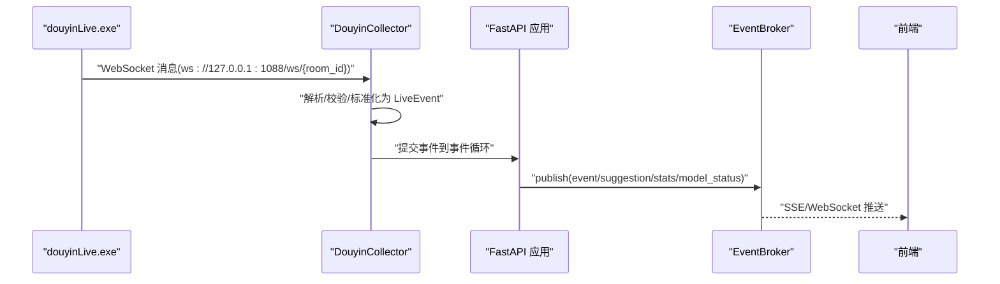
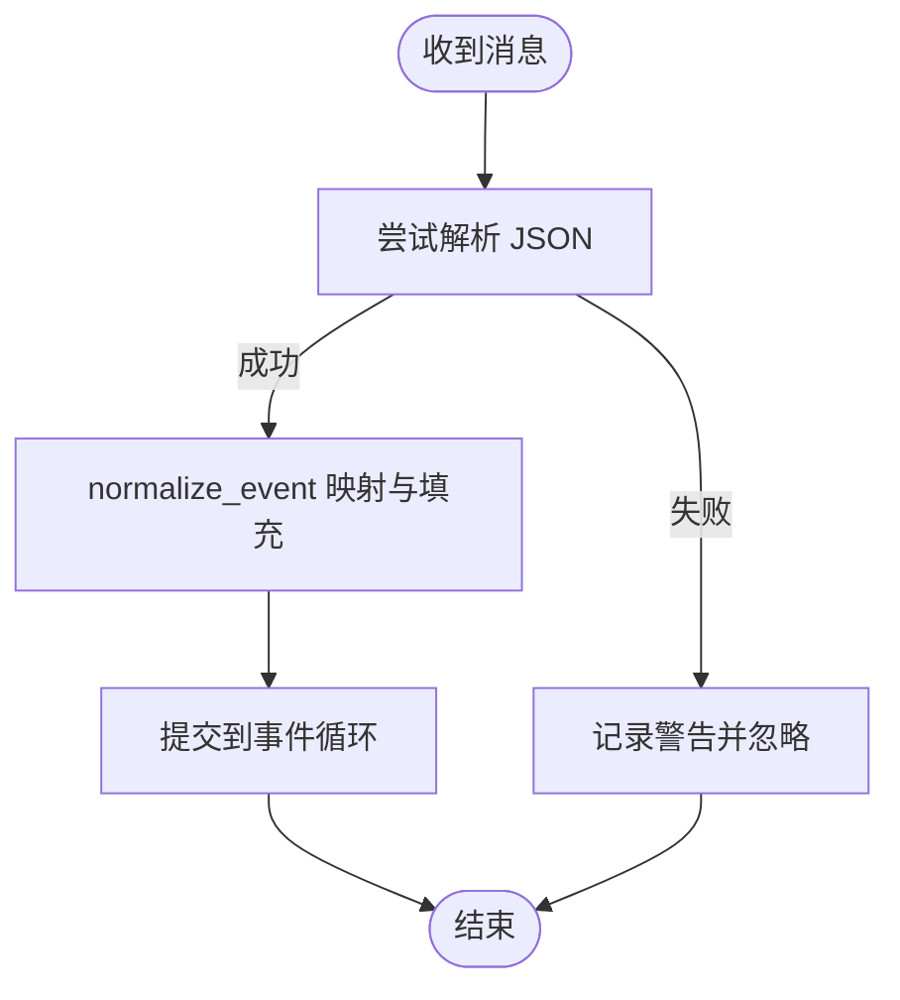
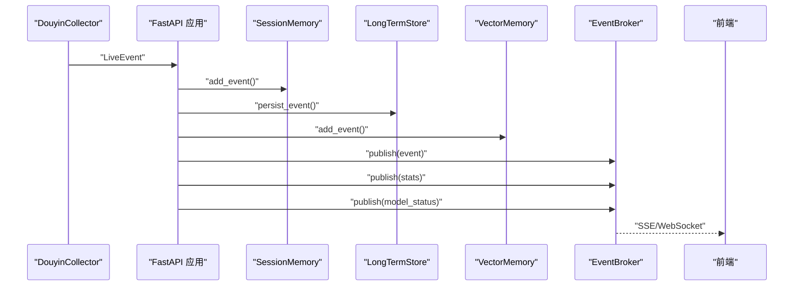
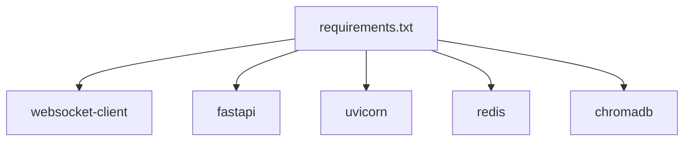

# 工具系统

<cite>
**本文引用的文件**
- [README.md](file://README.md)
- [USAGE.md](file://USAGE.md)
- [requirements.txt](file://requirements.txt)
- [start_all.ps1](file://start_all.ps1)
- [start_backend_qwen.ps1](file://start_backend_qwen.ps1)
- [start_frontend.ps1](file://start_frontend.ps1)
- [tool/config.yaml](file://tool/config.yaml)
- [backend/app.py](file://backend/app.py)
- [backend/config.py](file://backend/config.py)
- [backend/services/collector.py](file://backend/services/collector.py)
- [backend/services/broker.py](file://backend/services/broker.py)
- [backend/services/agent.py](file://backend/services/agent.py)
- [backend/schemas/live.py](file://backend/schemas/live.py)
</cite>

## 目录
1. [简介](#简介)
2. [项目结构](#项目结构)
3. [核心组件](#核心组件)
4. [架构总览](#架构总览)
5. [组件详解](#组件详解)
6. [依赖关系分析](#依赖关系分析)
7. [性能考量](#性能考量)
8. [故障排查指南](#故障排查指南)
9. [结论](#结论)
10. [附录](#附录)

## 简介
本文件面向抖音直播数据采集器工具系统，聚焦以下目标：
- 详述 tool/douyinLive 可执行文件的作用与工作原理：WebSocket 连接、直播消息捕获、数据格式化处理。
- 解析配置文件 tool/config.yaml 的结构与参数：连接参数、消息过滤、输出格式等。
- 说明工具的启动与停止流程：命令行参数、环境要求、运行状态监控。
- 介绍工具与后端服务的集成方式：WebSocket 连接管理、消息传输协议、错误处理机制。
- 提供调试与故障排除方法：日志分析、网络诊断、性能监控。
- 说明扩展与定制方式：新增事件类型、自定义过滤规则、输出格式修改。

## 项目结构
该系统由三部分组成：
- tool/douyinLive 可执行文件：负责连接抖音直播房间，将消息以 WebSocket 形式暴露在本地。
- backend：FastAPI 应用，内置采集器、事件处理、存储与建议生成，提供 REST、SSE、WebSocket 接口。
- frontend：Vue 前端，实时展示事件流、建议与模型状态。

```mermaid
graph TB
subgraph "工具端(tool)"
DL["douyinLive.exe<br/>本地WebSocket消息源"]
CFG["config.yaml<br/>连接与Cookie配置"]
end
subgraph "后端(backend)"
APP["FastAPI 应用<br/>app.py"]
COL["DouyinCollector<br/>collector.py"]
BRK["EventBroker<br/>broker.py"]
AG["LivePromptAgent<br/>agent.py"]
SCH["数据模型<br/>schemas/live.py"]
CFT["配置解析<br/>config.py"]
end
subgraph "前端(frontend)"
FE["Vue 前端"]
end
DL --> |ws://127.0.0.1:1088/ws/{room_id}| COL
COL --> |标准化事件| APP
APP --> BRK
BRK --> FE
APP --> AG
APP --> SCH
APP --> CFT
```

图表来源
- [backend/app.py:94-220](file://backend/app.py#L94-L220)
- [backend/services/collector.py:38-284](file://backend/services/collector.py#L38-L284)
- [backend/services/broker.py:10-40](file://backend/services/broker.py#L10-L40)
- [backend/services/agent.py:23-393](file://backend/services/agent.py#L23-L393)
- [backend/schemas/live.py:29-95](file://backend/schemas/live.py#L29-L95)
- [backend/config.py:39-94](file://backend/config.py#L39-L94)
- [tool/config.yaml:1-16](file://tool/config.yaml#L1-L16)

章节来源
- [README.md:21-34](file://README.md#L21-L34)
- [USAGE.md:15-23](file://USAGE.md#L15-L23)

## 核心组件
- tool/douyinLive 可执行文件：作为本地 WebSocket 服务器，抓取抖音直播消息并按房间号暴露 ws://127.0.0.1:1088/ws/{room_id}。
- backend/services/collector.py：内置采集器，连接本地 WebSocket，解析消息，标准化为 LiveEvent 并提交至事件循环。
- backend/app.py：FastAPI 应用入口，负责生命周期管理、事件处理、SSE/WebSocket 广播。
- backend/services/broker.py：进程内事件广播器，将事件分发给 SSE 与 WebSocket 订阅者。
- backend/services/agent.py：提词建议生成器，支持在线模型与启发式规则双轨。
- backend/schemas/live.py：统一数据模型，定义 LiveEvent、Suggestion、SessionStats、ModelStatus 等。
- backend/config.py：配置解析与默认值，支持 .env 与环境变量。
- tool/config.yaml：douyinLive 的连接与 Cookie 配置。

章节来源
- [backend/services/collector.py:38-284](file://backend/services/collector.py#L38-L284)
- [backend/app.py:61-78](file://backend/app.py#L61-L78)
- [backend/services/broker.py:10-40](file://backend/services/broker.py#L10-L40)
- [backend/services/agent.py:23-393](file://backend/services/agent.py#L23-L393)
- [backend/schemas/live.py:29-95](file://backend/schemas/live.py#L29-L95)
- [backend/config.py:39-94](file://backend/config.py#L39-L94)
- [tool/config.yaml:1-16](file://tool/config.yaml#L1-L16)

## 架构总览
系统采用“本地消息源 + 后端采集 + 事件广播 + 前端展示”的分层架构。douyinLive 作为消息源，后端内置采集器负责连接与标准化，随后事件进入内存广播器，再由 SSE/WebSocket 推送到前端。



图表来源
- [backend/services/collector.py:145-160](file://backend/services/collector.py#L145-L160)
- [backend/app.py:61-78](file://backend/app.py#L61-L78)
- [backend/services/broker.py:28-40](file://backend/services/broker.py#L28-L40)
- [backend/app.py:187-220](file://backend/app.py#L187-L220)

## 组件详解

### tool/douyinLive 可执行文件
- 功能概述
  - 作为本地 WebSocket 服务器，抓取抖音直播消息并按房间号暴露 ws://127.0.0.1:1088/ws/{room_id}。
  - 支持通过 tool/config.yaml 配置 Cookie，以便在需要登录态的场景下抓取。
- 工作原理
  - 启动后监听本地端口，建立与抖音直播间的连接，持续推送消息。
  - 消息格式为 JSON，包含 common、user、gift 等字段，后端采集器据此进行标准化。
- 配置要点
  - port：本地 WebSocket 服务端口（默认 1088）。
  - cookie：可选，用于携带抖音 Cookie 以维持登录态。
  - unknown：是否输出未知消息类型（调试用）。
- 启动与停止
  - 启动：直接运行 tool/douyinLive-windows-amd64.exe。
  - 停止：关闭进程即可断开连接。
- 与后端集成
  - 后端采集器通过 ws://127.0.0.1:1088/ws/{room_id} 连接本地消息源。
  - 若需登录态，需在 tool/config.yaml 中正确填写 Cookie。

章节来源
- [README.md:66-80](file://README.md#L66-L80)
- [USAGE.md:49-72](file://USAGE.md#L49-L72)
- [tool/config.yaml:1-16](file://tool/config.yaml#L1-L16)

### 后端采集器（DouyinCollector）
- 连接与生命周期
  - 通过 settings.collector_host 与 settings.collector_port 组合 ws 地址。
  - start() 在指定事件循环中启动采集线程；stop() 关闭连接并等待线程退出。
  - 支持房间切换 switch_room()，内部会停止旧连接并重新连接新房间。
- 消息处理
  - on_message() 解析 JSON，若非 JSON 则记录警告并忽略。
  - normalize_event() 将原始消息映射为 LiveEvent，包含事件类型、用户信息、元数据等。
  - _submit_event() 将事件通过 asyncio.run_coroutine_threadsafe 提交到后端事件循环。
- 错误处理与重连
  - on_error/on_close 记录警告；断开后按 settings.collector_reconnect_delay_seconds 间隔重连。
  - _start_ping_loop() 定期发送 ping 保持连接活跃。
- 事件类型映射
  - WebcastChatMessage -> comment
  - WebcastGiftMessage -> gift
  - WebcastLikeMessage -> like
  - WebcastMemberMessage -> member
  - WebcastSocialMessage -> follow
  - 其他 -> system



图表来源
- [backend/services/collector.py:145-160](file://backend/services/collector.py#L145-L160)
- [backend/services/collector.py:225-284](file://backend/services/collector.py#L225-L284)

章节来源
- [backend/services/collector.py:61-98](file://backend/services/collector.py#L61-L98)
- [backend/services/collector.py:117-181](file://backend/services/collector.py#L117-L181)
- [backend/services/collector.py:225-284](file://backend/services/collector.py#L225-L284)

### 后端应用（FastAPI）
- 生命周期管理
  - lifespan() 在应用启动时启动采集器，在关闭时清理会话并停止采集器。
- 事件处理与广播
  - process_event() 将事件写入短期/长期存储与向量库，发布 event/suggestion/stats/model_status。
  - EventBroker 统一分发给 SSE 与 WebSocket 订阅者。
- 接口能力
  - /health 健康检查
  - /api/bootstrap 获取前端初始化快照
  - /api/room 切换房间
  - /api/events 手动注入事件
  - /api/events/stream SSE 实时流
  - /ws/live WebSocket 实时流



图表来源
- [backend/app.py:61-78](file://backend/app.py#L61-L78)
- [backend/app.py:187-220](file://backend/app.py#L187-L220)
- [backend/services/broker.py:28-40](file://backend/services/broker.py#L28-L40)

章节来源
- [backend/app.py:84-92](file://backend/app.py#L84-L92)
- [backend/app.py:104-107](file://backend/app.py#L104-L107)
- [backend/app.py:115-127](file://backend/app.py#L115-L127)
- [backend/app.py:187-220](file://backend/app.py#L187-L220)

### 事件广播器（EventBroker）
- 职责
  - 维护订阅队列集合，支持 subscribe()/unsubscribe()。
  - publish() 将消息广播给所有订阅者，对阻塞队列进行清理。
- 适用场景
  - SSE 与 WebSocket 同时消费同一事件源，确保多订阅者一致性。

章节来源
- [backend/services/broker.py:10-40](file://backend/services/broker.py#L10-L40)

### 提词建议生成器（LivePromptAgent）
- 生成策略
  - 优先调用在线 OpenAI 兼容接口；失败时回退到本地启发式规则。
  - 仅对 comment/gift/follow 事件生成建议。
- 上下文构建
  - 最近事件窗口、相似历史片段、用户画像。
- 状态管理
  - 维护当前模式、模型、后端、最后结果、错误信息与更新时间。
- 输出规范
  - 返回 Suggestion，包含 priority、reply_text、tone、reason、confidence 等字段。

章节来源
- [backend/services/agent.py:73-114](file://backend/services/agent.py#L73-L114)
- [backend/services/agent.py:183-330](file://backend/services/agent.py#L183-L330)

### 数据模型（schemas/live.py）
- LiveEvent：统一事件结构，包含 event_id、room_id、platform、event_type、method、livename、ts、user、content、metadata、raw。
- Suggestion：建议结构，包含 suggestion_id、room_id、event_id、priority、reply_text、tone、reason、confidence、references、created_at。
- SessionStats：房间统计，包含 total_events、comments、gifts、likes、members、follows。
- ModelStatus：模型状态，包含 mode、model、backend、last_result、last_error、updated_at。
- SessionSnapshot：前端引导快照，包含 recent_events、recent_suggestions、stats、model_status。

章节来源
- [backend/schemas/live.py:29-95](file://backend/schemas/live.py#L29-L95)

### 配置系统（backend/config.py）
- 配置来源优先级：.env 文件 > 环境变量。
- 关键配置项
  - ROOM_ID：当前采集房间标识。
  - COLLECTOR_ENABLED：是否启用内置采集器。
  - COLLECTOR_HOST/PORT：本地采集器连接地址。
  - COLLECTOR_PING_INTERVAL_SECONDS：心跳间隔。
  - COLLECTOR_RECONNECT_DELAY_SECONDS：断线重连间隔。
  - LLM_MODE：模型模式（heuristic/qwen/openai）。
  - LLM_BASE_URL/LLM_MODEL/LLM_API_KEY/LLM_TEMPERATURE/LLM_TIMEOUT_SECONDS：模型相关参数。
  - REDIS_URL/DATA_DIR/DATABASE_PATH/CHROMA_DIR/SESSION_TTL_SECONDS：存储与记忆相关。
- 默认值与目录创建：ensure_dirs() 自动创建数据目录。

章节来源
- [backend/config.py:39-94](file://backend/config.py#L39-L94)

## 依赖关系分析
- 后端依赖
  - websocket-client：用于连接本地 WebSocket。
  - fastapi/uvicorn：提供 REST、SSE、WebSocket 接口。
  - redis/chromadb：可选，用于短期记忆与向量检索。
- 工具端依赖
  - 无额外 Python 依赖，直接运行可执行文件。



图表来源
- [requirements.txt:1-6](file://requirements.txt#L1-L6)

章节来源
- [requirements.txt:1-6](file://requirements.txt#L1-L6)

## 性能考量
- 连接与心跳
  - 采集器定期发送 ping，避免长时间空闲导致连接中断。
  - 断线重连间隔可配置，避免频繁抖动。
- 广播与队列
  - EventBroker 使用异步队列，对阻塞队列进行清理，防止内存膨胀。
- 模型调用
  - 在线模型调用具备超时控制与回退策略，降低对实时性的影响。
- 存储与检索
  - Redis 与 Chroma 为可选增强，未安装时系统仍可运行基础流程。

## 故障排查指南
- 页面无建议
  - 检查 tool/douyinLive 是否已启动、ROOM_ID 是否正确、直播间是否开播、后端是否已重启。
- 顶部显示 fallback
  - 检查 DASHSCOPE_API_KEY 是否正确、网络是否可达、是否存在超时或限流。
- 顶部显示 heuristic
  - 检查 .env 中 LLM_MODE 设置或 .env 加载是否生效。
- 前端无法打开
  - 检查 start_frontend.ps1 是否正常启动、5173 端口是否被占用。
- 后端启动但未写入数据
  - 检查 tool/douyinLive 是否运行、后端日志是否连接到 ws://127.0.0.1:1088/ws/{room_id}、房间是否有消息。
- 日志与诊断
  - 后端日志位于标准输出，采集器与代理均记录异常与警告。
  - 可使用 deprecated/debug_client.py 查看原始消息结构与写入 logs/。

章节来源
- [USAGE.md:179-240](file://USAGE.md#L179-L240)

## 结论
该工具系统以 tool/douyinLive 为本地消息源，后端内置采集器负责连接与标准化，结合事件广播与前端展示，形成完整的抖音直播实时提词链路。通过 .env 与 tool/config.yaml 的配置，用户可在不同运行环境下灵活调整采集与模型策略。系统提供完善的错误处理与回退机制，便于在复杂网络环境中稳定运行。

## 附录

### 启动与停止流程
- 启动顺序
  - 先启动 tool/douyinLive，再启动后端 FastAPI，最后启动前端。
  - 也可使用 start_all.ps1 一键启动后端与前端。
- 停止流程
  - 关闭前端开发服务器、后端 Uvicorn 进程、tool/douyinLive 进程。

章节来源
- [USAGE.md:89-114](file://USAGE.md#L89-L114)
- [start_all.ps1:11-15](file://start_all.ps1#L11-L15)

### 配置文件（tool/config.yaml）结构与参数
- port：本地 WebSocket 服务端口（默认 1088）。
- unknown：是否输出未知消息类型（调试用）。
- cookie：可选，用于携带抖音 Cookie 以维持登录态。

章节来源
- [tool/config.yaml:1-16](file://tool/config.yaml#L1-L16)

### 后端配置（.env 与 config.py）
- 直播与采集
  - ROOM_ID、COLLECTOR_ENABLED、COLLECTOR_HOST、COLLECTOR_PORT、COLLECTOR_PING_INTERVAL_SECONDS、COLLECTOR_RECONNECT_DELAY_SECONDS。
- 服务端口
  - APP_HOST、APP_PORT。
- 模型相关
  - LLM_MODE、LLM_BASE_URL、LLM_MODEL、LLM_API_KEY、LLM_TEMPERATURE、LLM_TIMEOUT_SECONDS。
- 存储与记忆
  - REDIS_URL、DATA_DIR、DATABASE_PATH、CHROMA_DIR、SESSION_TTL_SECONDS。

章节来源
- [README.md:142-207](file://README.md#L142-L207)
- [backend/config.py:39-94](file://backend/config.py#L39-L94)

### 数据模型与事件类型
- LiveEvent 字段与含义参见 schemas/live.py。
- 事件类型映射：
  - WebcastChatMessage -> comment
  - WebcastGiftMessage -> gift
  - WebcastLikeMessage -> like
  - WebcastMemberMessage -> member
  - WebcastSocialMessage -> follow
  - 其他 -> system

章节来源
- [backend/schemas/live.py:29-95](file://backend/schemas/live.py#L29-L95)
- [README.md:299-307](file://README.md#L299-L307)

### 扩展与定制
- 新增事件类型
  - 在 METHOD_EVENT_TYPE_MAP 中增加映射；在 normalize_event() 中补充字段提取与元数据填充。
- 自定义过滤规则
  - 在 agent.py 的启发式规则中增加关键词匹配与优先级策略。
- 输出格式修改
  - 修改 LiveEvent/Suggestion 的字段或序列化逻辑，确保前端渲染兼容。

章节来源
- [backend/services/collector.py:22-28](file://backend/services/collector.py#L22-L28)
- [backend/services/collector.py:225-284](file://backend/services/collector.py#L225-L284)
- [backend/services/agent.py:115-182](file://backend/services/agent.py#L115-L182)