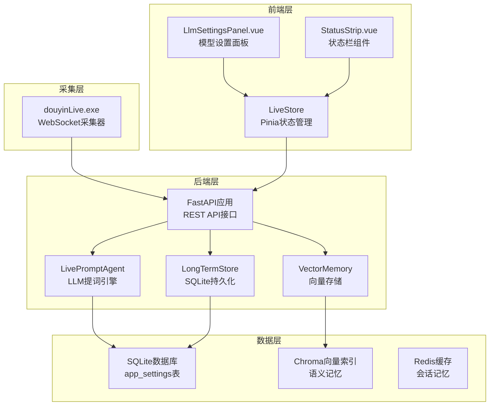
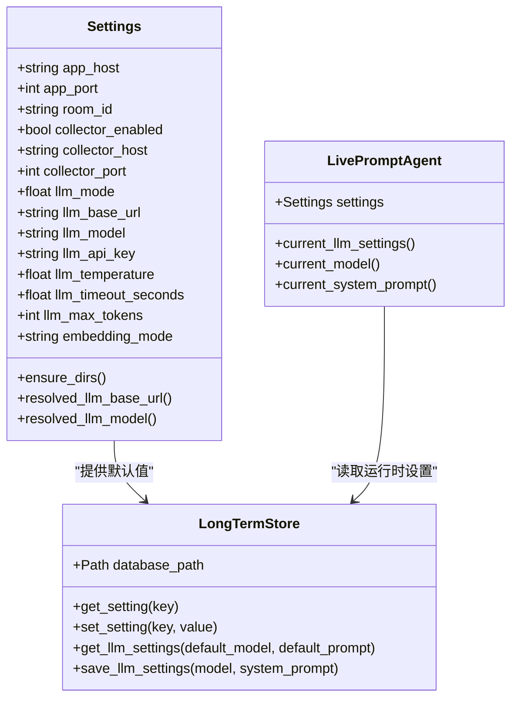
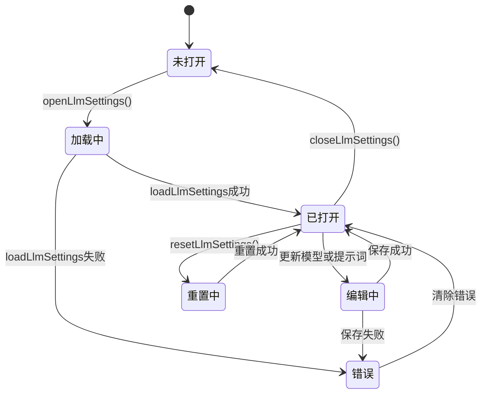
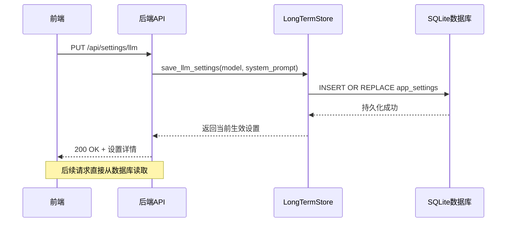
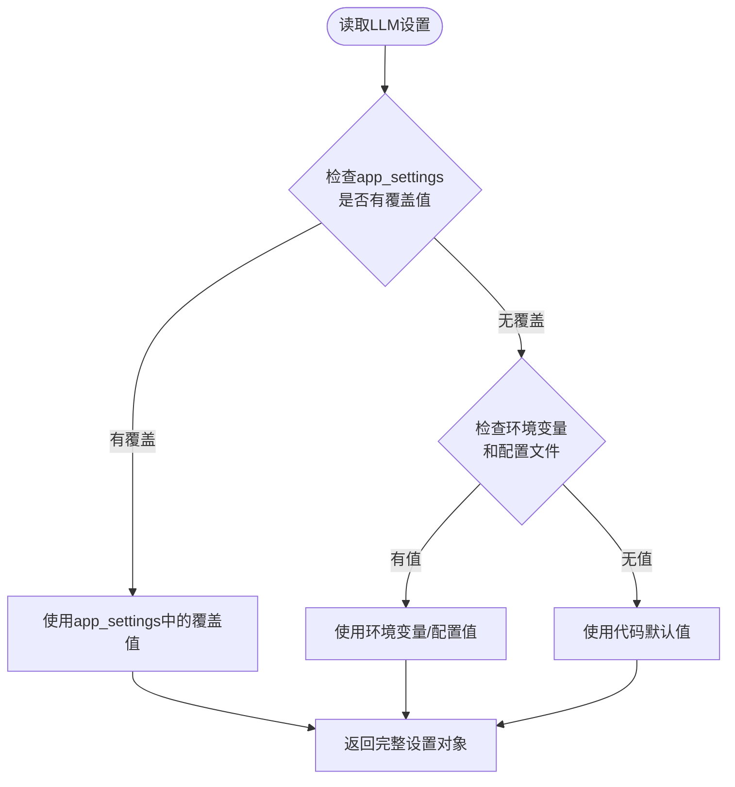
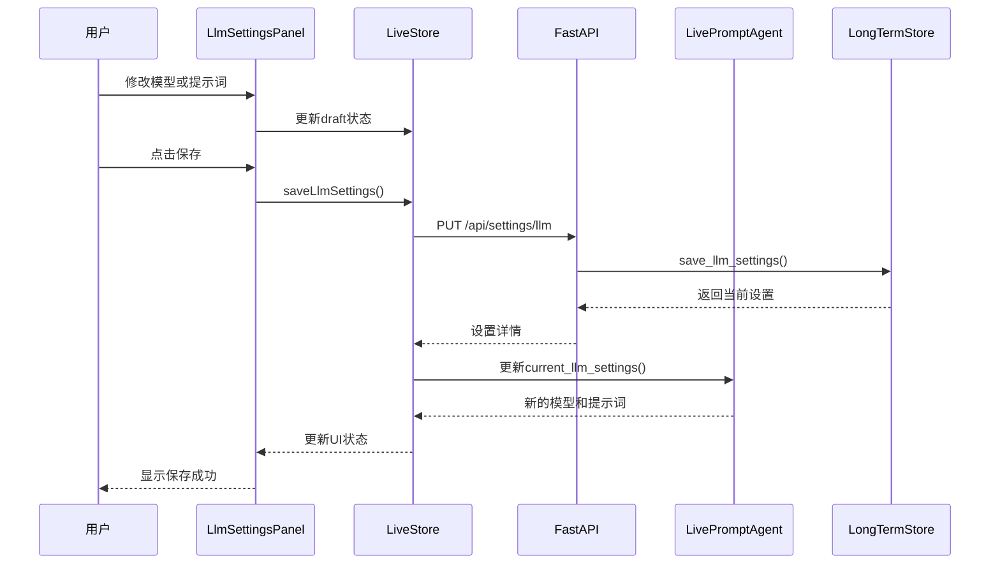
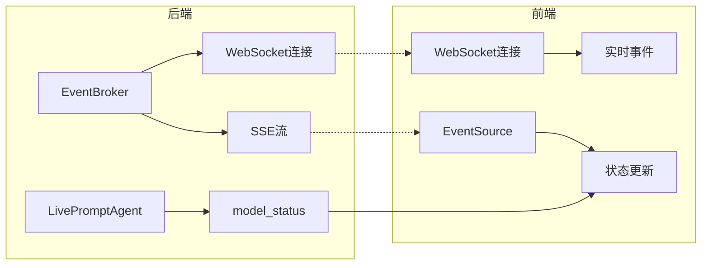
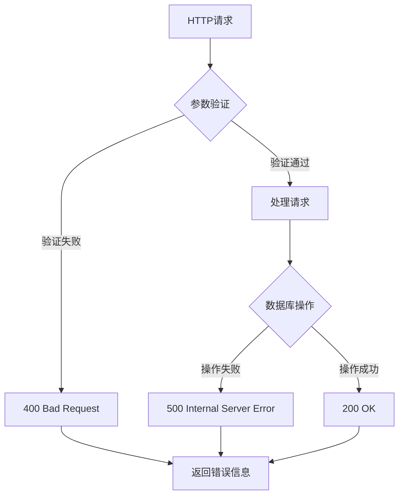

# LLM设置实现计划

<cite>
**本文档引用的文件**
- [README.md](file://README.md)
- [docs/superpowers/plans/2026-04-13-llm-settings.md](file://docs/superpowers/plans/2026-04-13-llm-settings.md)
- [docs/superpowers/specs/2026-04-13-llm-settings-design.md](file://docs/superpowers/specs/2026-04-13-llm-settings-design.md)
- [backend/config.py](file://backend/config.py)
- [backend/app.py](file://backend/app.py)
- [backend/services/agent.py](file://backend/services/agent.py)
- [backend/memory/long_term.py](file://backend/memory/long_term.py)
- [frontend/src/components/LlmSettingsPanel.vue](file://frontend/src/components/LlmSettingsPanel.vue)
- [frontend/src/stores/live.js](file://frontend/src/stores/live.js)
- [frontend/src/components/StatusStrip.vue](file://frontend/src/components/StatusStrip.vue)
- [frontend/src/stores/llm-settings.test.mjs](file://frontend/src/stores/llm-settings.test.mjs)
- [tests/test_llm_settings.py](file://tests/test_llm_settings.py)
</cite>

## 目录
1. [项目概述](#项目概述)
2. [架构总览](#架构总览)
3. [核心组件分析](#核心组件分析)
4. [详细实现分析](#详细实现分析)
5. [数据流分析](#数据流分析)
6. [错误处理机制](#错误处理机制)
7. [性能考量](#性能考量)
8. [故障排除指南](#故障排除指南)
9. [总结](#总结)

## 项目概述

Live Prompter Stack是一个面向抖音直播间的实时提词工作栈，由本地采集工具、FastAPI后端与Vue 3前端组成。该项目的核心目标是将douyinLive WebSocket流中的评论、礼物与关注事件转换为结构化的LiveEvent，通过LLM或启发式规则生成提词建议，并以前端仪表板的形式推送给主持人。

该项目采用了现代化的技术栈，包括Python FastAPI后端、Vue 3前端框架、SQLite数据库、Chroma向量存储等技术组件。整个系统支持实时事件流处理、语义记忆系统、多面板前端展示等功能特性。

**章节来源**
- [README.md:1-223](file://README.md#L1-L223)

## 架构总览

系统采用分层架构设计，主要分为四个层次：

**图表来源**
- [backend/app.py:108-127](file://backend/app.py#L108-L127)
- [backend/services/agent.py:23-40](file://backend/services/agent.py#L23-L40)
- [backend/memory/long_term.py:176-182](file://backend/memory/long_term.py#L176-L182)

## 核心组件分析

### 后端配置系统

后端配置系统采用Settings类进行集中管理，支持从环境变量、.env文件和代码默认值三个层级读取配置。配置优先级确保了灵活性和可维护性。

**图表来源**
- [backend/config.py:40-113](file://backend/config.py#L40-L113)
- [backend/memory/long_term.py:821-876](file://backend/memory/long_term.py#L821-L876)
- [backend/services/agent.py:48-59](file://backend/services/agent.py#L48-L59)

### 前端状态管理系统

前端使用Pinia进行状态管理，实现了完整的LLM设置状态流转：

**图表来源**
- [frontend/src/stores/live.js:354-438](file://frontend/src/stores/live.js#L354-L438)

**章节来源**
- [backend/config.py:1-113](file://backend/config.py#L1-L113)
- [frontend/src/stores/live.js:1-846](file://frontend/src/stores/live.js#L1-L846)

## 详细实现分析

### LLM设置持久化机制

系统通过SQLite的app_settings表实现运行时配置的持久化存储：

| 字段名 | 类型 | 描述 | 默认值 |
|--------|------|------|--------|
| setting_key | TEXT | 主键，配置项标识符 | - |
| setting_value | TEXT | 配置值 | - |
| updated_at | INTEGER | 更新时间戳 | 当前时间 |

支持的配置项：
- `llm_model_override`: 模型名称覆盖
- `system_prompt_override`: 系统提示词覆盖

**图表来源**
- [backend/app.py:229-235](file://backend/app.py#L229-L235)
- [backend/memory/long_term.py:866-876](file://backend/memory/long_term.py#L866-L876)

### LLM设置读取优先级

系统实现了三层设置读取优先级，确保配置的灵活性和可靠性：

**图表来源**
- [backend/memory/long_term.py:854-864](file://backend/memory/long_term.py#L854-L864)
- [backend/services/agent.py:48-59](file://backend/services/agent.py#L48-L59)

**章节来源**
- [backend/memory/long_term.py:821-876](file://backend/memory/long_term.py#L821-L876)
- [backend/services/agent.py:17-60](file://backend/services/agent.py#L17-L60)

## 数据流分析

### 完整的设置变更流程

**图表来源**
- [frontend/src/components/LlmSettingsPanel.vue:53-122](file://frontend/src/components/LlmSettingsPanel.vue#L53-L122)
- [frontend/src/stores/live.js:400-431](file://frontend/src/stores/live.js#L400-L431)
- [backend/app.py:229-235](file://backend/app.py#L229-L235)

### 实时状态同步机制

系统通过Server-Sent Events (SSE)实现前端状态的实时同步：

**图表来源**
- [backend/app.py:252-285](file://backend/app.py#L252-L285)
- [frontend/src/stores/live.js:474-523](file://frontend/src/stores/live.js#L474-L523)

**章节来源**
- [backend/app.py:224-235](file://backend/app.py#L224-L235)
- [frontend/src/stores/live.js:354-438](file://frontend/src/stores/live.js#L354-L438)

## 错误处理机制

### 前端错误处理

前端实现了完善的错误处理机制，包括：

- **加载失败**: `errors.llmSettingsLoadFailed`
- **保存失败**: `errors.llmSettingsSaveFailed`
- **房间切换失败**: `errors.roomSwitchFailed`
- **模型名称必填**: 400错误响应

### 后端错误处理

后端提供了多层次的错误处理：

**图表来源**
- [backend/app.py:231-234](file://backend/app.py#L231-L234)

**章节来源**
- [frontend/src/stores/live.js:400-431](file://frontend/src/stores/live.js#L400-L431)
- [backend/app.py:229-235](file://backend/app.py#L229-L235)

## 性能考量

### 数据库优化

系统采用了多项数据库优化策略：

1. **索引优化**: 为events、viewer_profiles、live_sessions等表建立了复合索引
2. **事务管理**: 使用SQLite的PRAGMA设置优化写入性能
3. **连接池**: 通过ClosingConnection类管理数据库连接生命周期

### 缓存策略

- **会话缓存**: SessionMemory支持Redis分布式缓存
- **模型状态缓存**: LivePromptAgent缓存当前模型状态
- **前端缓存**: Vue组件和Pinia store的状态缓存

### 异步处理

系统广泛使用异步编程模式：
- FastAPI的异步路由处理
- asyncio事件循环处理实时事件
- 异步WebSocket连接管理

## 故障排除指南

### 常见问题诊断

1. **设置无法保存**
   - 检查数据库连接权限
   - 验证模型名称非空
   - 查看后端日志中的SQL错误

2. **前端设置界面不响应**
   - 检查网络连接到后端API
   - 验证CORS配置
   - 查看浏览器开发者工具的网络请求

3. **模型状态显示异常**
   - 检查LLM API密钥配置
   - 验证模型名称正确性
   - 查看后端日志中的模型调用错误

### 调试工具

- **后端调试**: 使用uvicorn的reload模式进行开发调试
- **前端调试**: Vue DevTools进行组件状态检查
- **数据库调试**: 直接查询SQLite数据库验证设置持久化

**章节来源**
- [tests/test_llm_settings.py:1-63](file://tests/test_llm_settings.py#L1-L63)
- [frontend/src/stores/llm-settings.test.mjs:1-70](file://frontend/src/stores/llm-settings.test.mjs#L1-L70)

## 总结

LLM设置实现计划成功地将运行时配置管理集成到了现有的Live Prompter Stack架构中。通过以下关键改进实现了完整的功能：

### 技术成就

1. **架构完整性**: 新增了SQLite配置表和相应的API接口
2. **状态一致性**: 实现了前后端状态的实时同步
3. **错误处理**: 建立了完善的错误处理和恢复机制
4. **测试覆盖**: 包含了全面的单元测试和集成测试

### 架构优势

- **可扩展性**: 支持未来添加更多配置项
- **可靠性**: 多层配置优先级确保系统稳定
- **易用性**: 简洁的前端界面和直观的操作流程
- **性能**: 优化的数据库查询和缓存策略

### 未来发展方向

1. **配置版本控制**: 添加配置历史和回滚功能
2. **多房间支持**: 实现按房间区分的配置管理
3. **配置模板**: 提供预设的配置模板和最佳实践
4. **监控告警**: 添加配置变更的监控和通知机制

该实现为直播提词系统的智能化运营提供了坚实的基础，通过灵活的配置管理支持不同场景下的个性化需求。