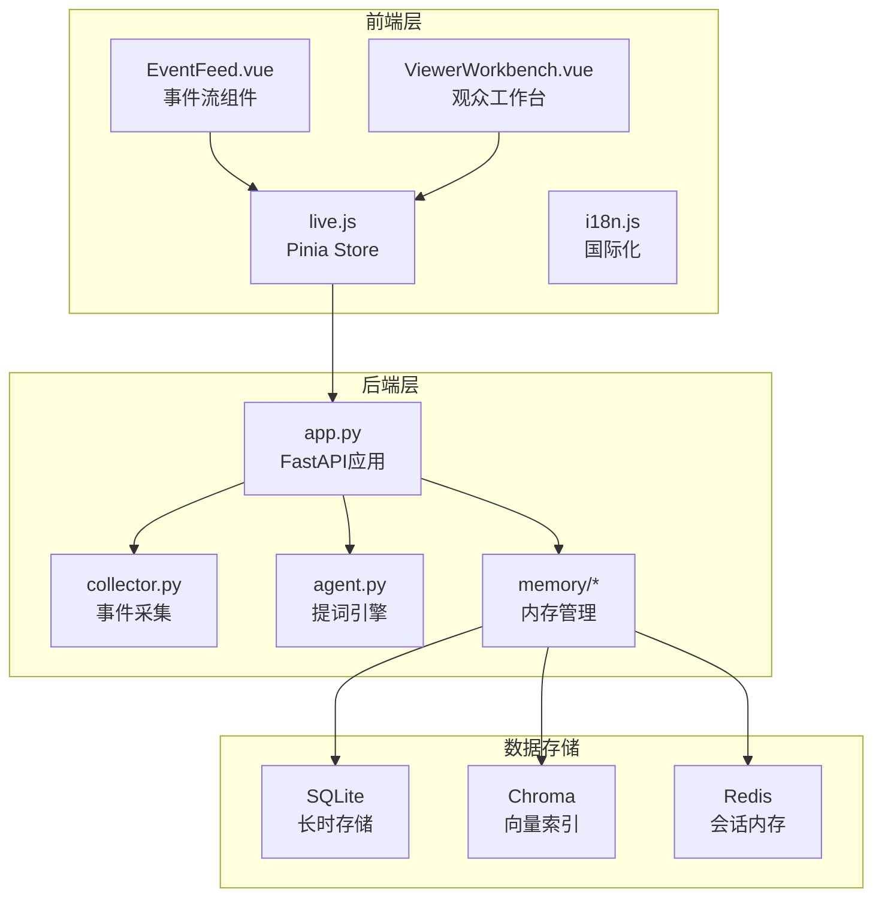
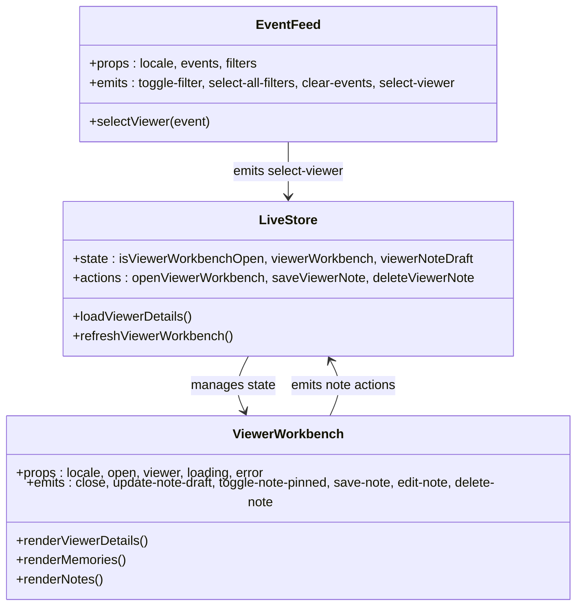
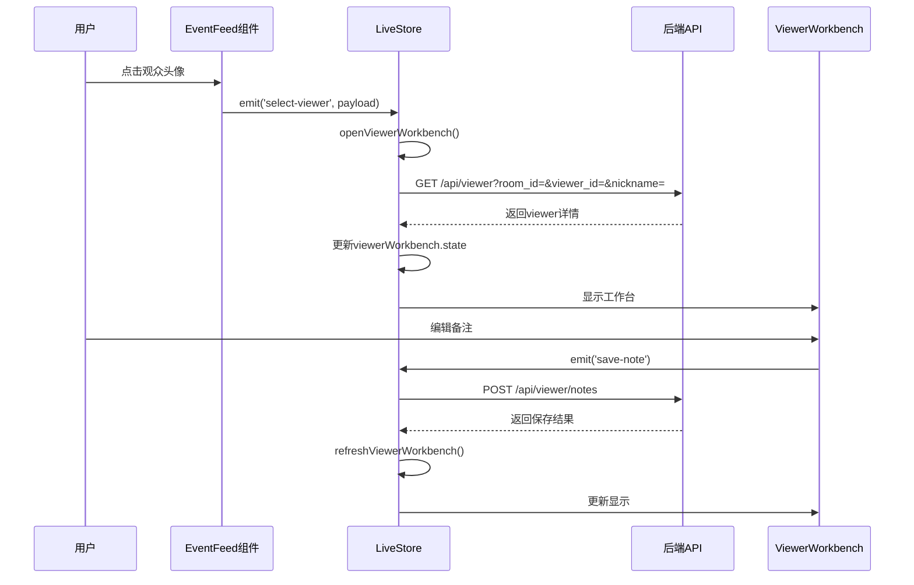
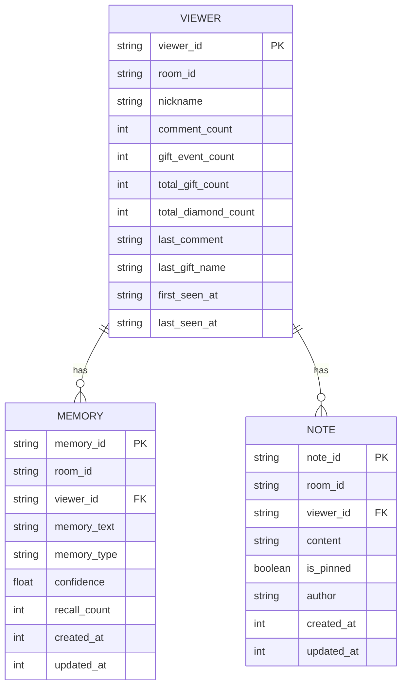
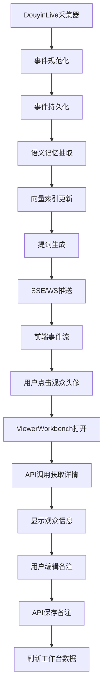
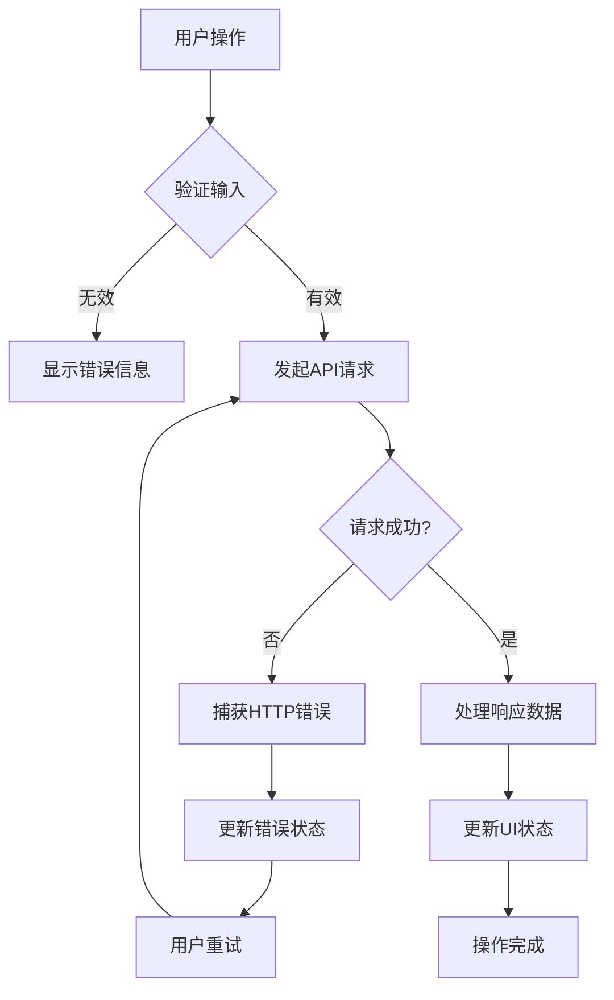
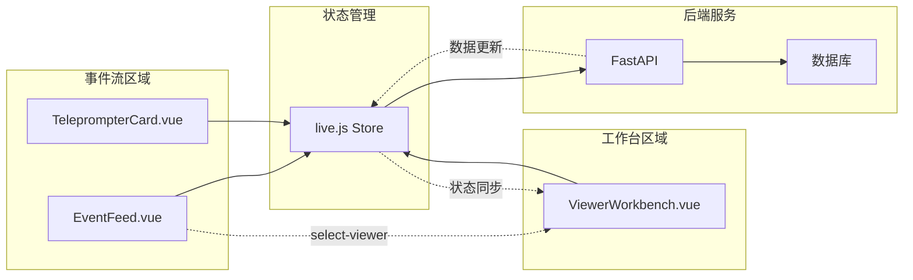
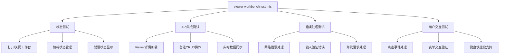

# Viewer工作台实现计划

<cite>
**本文档引用的文件**
- [2026-04-12-viewer-workbench.md](file://docs/superpowers/plans/2026-04-12-viewer-workbench.md)
- [ViewerWorkbench.vue](file://frontend/src/components/ViewerWorkbench.vue)
- [EventFeed.vue](file://frontend/src/components/EventFeed.vue)
- [App.vue](file://frontend/src/App.vue)
- [live.js](file://frontend/src/stores/live.js)
- [viewer-workbench.test.mjs](file://frontend/src/stores/viewer-workbench.test.mjs)
- [i18n.js](file://frontend/src/i18n.js)
- [app.py](file://backend/app.py)
- [config.py](file://backend/config.py)
- [README.md](file://README.md)
- [live.py](file://backend/schemas/live.py)
- [test_agent.py](file://tests/test_agent.py)
</cite>

## 目录
1. [项目概述](#项目概述)
2. [架构概览](#架构概览)
3. [Viewer工作台核心功能](#viewer工作台核心功能)
4. [前端实现分析](#前端实现分析)
5. [后端API分析](#后端api分析)
6. [数据流分析](#数据流分析)
7. [组件交互图](#组件交互图)
8. [错误处理机制](#错误处理机制)
9. [国际化支持](#国际化支持)
10. [性能优化考虑](#性能优化考虑)
11. [测试策略](#测试策略)
12. [部署与运维](#部署与运维)
13. [总结](#总结)

## 项目概述

Viewer工作台是Live Prompter Stack项目中的一个重要功能模块，旨在为直播运营人员提供一个专门的观众信息查看和管理工作界面。该功能允许运营人员通过点击事件流中的观众头像来打开右侧的工作台，查看观众的详细资料、历史互动记录、语义记忆以及编辑备注信息。

该项目是一个基于Vue 3 + FastAPI的实时直播提词工作栈，包含本地采集工具、后端服务和前端界面三个主要部分。

**章节来源**
- [README.md:1-223](file://README.md#L1-L223)

## 架构概览

整个系统采用前后端分离的架构设计，通过REST API、SSE和WebSocket进行实时通信。

**图表来源**
- [README.md:7-17](file://README.md#L7-L17)
- [app.py:1-35](file://backend/app.py#L1-L35)

## Viewer工作台核心功能

### 主要功能特性

1. **观众详情展示**
   - 基本信息：昵称、用户ID、评论数、礼物数
   - 时间统计：首次出现、最近出现时间
   - 最近互动：最近评论、最近礼物、最近场次

2. **语义记忆管理**
   - 展示观众的语义记忆条目
   - 显示记忆类型、置信度、召回次数
   - 支持记忆的增删改查

3. **备注系统**
   - 创建、编辑、删除备注
   - 支持备注置顶功能
   - 实时同步备注状态

4. **交互式工作台**
   - 右侧抽屉式UI设计
   - 响应式布局适配不同屏幕尺寸
   - 实时状态反馈和错误处理

**章节来源**
- [2026-04-12-viewer-workbench.md:5-27](file://docs/superpowers/plans/2026-04-12-viewer-workbench.md#L5-L27)

## 前端实现分析

### 组件架构

**图表来源**
- [EventFeed.vue:1-214](file://frontend/src/components/EventFeed.vue#L1-L214)
- [ViewerWorkbench.vue:1-302](file://frontend/src/components/ViewerWorkbench.vue#L1-L302)
- [live.js:598-772](file://frontend/src/stores/live.js#L598-L772)

### 状态管理

Viewer工作台的状态管理采用了Pinia Store模式，实现了以下关键状态：

- `isViewerWorkbenchOpen`: 控制工作台的显示/隐藏
- `viewerWorkbench`: 包含viewer对象、loading状态、error信息
- `viewerNoteDraft`: 备注草稿内容
- `viewerNotePinned`: 备注置顶状态
- `editingViewerNoteId`: 正在编辑的备注ID
- `isSavingViewerNote`: 保存状态指示

**章节来源**
- [live.js:114-124](file://frontend/src/stores/live.js#L114-L124)

### 事件处理流程

**图表来源**
- [EventFeed.vue:90-106](file://frontend/src/components/EventFeed.vue#L90-L106)
- [live.js:598-607](file://frontend/src/stores/live.js#L598-L607)
- [ViewerWorkbench.vue:45-52](file://frontend/src/components/ViewerWorkbench.vue#L45-L52)

**章节来源**
- [App.vue:107-123](file://frontend/src/App.vue#L107-L123)

## 后端API分析

### Viewer相关API

后端提供了完整的观众信息管理API：

1. **获取观众详情**
   - `GET /api/viewer?room_id=&viewer_id=&nickname=`
   - 返回观众的基本信息、历史互动、语义记忆等

2. **获取观众记忆**
   - `GET /api/viewer/memories?room_id=&viewer_id=&limit=`
   - 获取指定观众的语义记忆列表

3. **获取观众备注**
   - `GET /api/viewer/notes?room_id=&viewer_id=&limit=`
   - 获取指定观众的备注列表

4. **备注管理**
   - `POST /api/viewer/notes` - 创建/更新备注
   - `DELETE /api/viewer/notes/{note_id}` - 删除备注

**章节来源**
- [app.py:169-221](file://backend/app.py#L169-L221)

### 数据模型

**图表来源**
- [app.py:169-221](file://backend/app.py#L169-L221)

**章节来源**
- [live.py:64-78](file://backend/schemas/live.py#L64-L78)

## 数据流分析

### 完整的数据流路径

**图表来源**
- [README.md:143-149](file://README.md#L143-L149)

### 错误处理流程

**图表来源**
- [live.js:201-212](file://frontend/src/stores/live.js#L201-L212)

**章节来源**
- [live.js:682-725](file://frontend/src/stores/live.js#L682-L725)

## 组件交互图

### 组件间通信关系

**图表来源**
- [App.vue:87-123](file://frontend/src/App.vue#L87-L123)
- [live.js:787-800](file://frontend/src/stores/live.js#L787-L800)

**章节来源**
- [EventFeed.vue:27-32](file://frontend/src/components/EventFeed.vue#L27-L32)

## 错误处理机制

### 前端错误处理策略

Viewer工作台实现了多层次的错误处理机制：

1. **输入验证**
   - 备注内容不能为空
   - 保存备注需要有效的viewer_id
   - 删除备注需要有效的note_id

2. **网络错误处理**
   - API请求失败时显示友好的错误信息
   - 自动重试机制和错误恢复
   - 网络异常时的状态回滚

3. **并发控制**
   - 请求ID跟踪防止竞态条件
   - 加载状态指示避免重复提交
   - 请求取消机制

**章节来源**
- [live.js:682-772](file://frontend/src/stores/live.js#L682-L772)

### 国际化错误信息

错误信息支持中英文双语显示，通过翻译函数动态切换语言。

**章节来源**
- [i18n.js:126-137](file://frontend/src/i18n.js#L126-L137)

## 国际化支持

### 多语言实现

Viewer工作台完全支持国际化，包括：

1. **文本翻译**
   - 标题、按钮、占位符等所有UI文本
   - 错误信息和状态提示
   - 数字格式化和日期显示

2. **语言切换**
   - 动态语言切换功能
   - 本地存储用户偏好设置
   - 响应式布局适配

3. **文化适配**
   - 数字、日期、货币格式
   - 文本方向和字体渲染
   - 特定文化下的交互模式

**章节来源**
- [i18n.js:1-316](file://frontend/src/i18n.js#L1-L316)

## 性能优化考虑

### 前端性能优化

1. **组件懒加载**
   - ViewerWorkbench按需加载
   - 减少初始包体积

2. **状态缓存**
   - Viewer详情缓存机制
   - 避免重复API调用
   - 内存状态管理

3. **渲染优化**
   - 虚拟滚动处理大量数据
   - 条件渲染减少DOM节点
   - 计算属性缓存

### 后端性能优化

1. **数据库查询优化**
   - 索引优化和查询缓存
   - 分页查询避免大数据集
   - 连接池管理

2. **API响应优化**
   - 数据压缩和传输
   - 异步处理非关键操作
   - 缓存策略

**章节来源**
- [app.py:169-221](file://backend/app.py#L169-L221)

## 测试策略

### 前端测试覆盖

**图表来源**
- [viewer-workbench.test.mjs:1-445](file://frontend/src/stores/viewer-workbench.test.mjs#L1-L445)

### 后端测试策略

后端提供了全面的单元测试覆盖：

1. **API接口测试**
   - Viewer相关API的完整测试
   - 错误场景和边界条件测试
   - 性能基准测试

2. **业务逻辑测试**
   - 记忆抽取算法测试
   - 提词生成逻辑测试
   - 数据一致性验证

3. **集成测试**
   - 端到端数据流测试
   - 多组件协作测试
   - 环境配置测试

**章节来源**
- [test_agent.py:1-176](file://tests/test_agent.py#L1-L176)

## 部署与运维

### 环境配置

系统支持灵活的环境配置，主要配置项包括：

1. **后端配置**
   - 数据库连接和存储路径
   - LLM模型参数和API密钥
   - 向量索引配置
   - Redis会话存储

2. **前端配置**
   - 主题和语言偏好
   - 组件状态持久化
   - API端点配置

### 运维监控

1. **健康检查**
   - 后端健康状态监控
   - 数据库连接状态
   - LLM服务可用性

2. **性能监控**
   - API响应时间
   - 内存使用情况
   - 数据库查询性能

3. **日志管理**
   - 结构化日志输出
   - 错误追踪和告警
   - 性能分析日志

**章节来源**
- [config.py:40-113](file://backend/config.py#L40-L113)

## 总结

Viewer工作台作为Live Prompter Stack的重要组成部分，成功实现了以下目标：

### 技术成就

1. **完整的功能实现**
   - 观众详情展示、语义记忆管理、备注系统
   - 实时数据同步和状态管理
   - 完善的错误处理和用户体验

2. **优秀的架构设计**
   - 前后端分离的清晰边界
   - 组件化的前端架构
   - 可扩展的后端API设计

3. **高质量的代码实现**
   - 完善的测试覆盖率
   - 国际化和无障碍支持
   - 性能优化和错误处理

### 未来发展方向

1. **功能扩展**
   - 观众记忆的手动编辑功能
   - 更丰富的数据分析和可视化
   - 多房间同时管理能力

2. **技术升级**
   - 微服务架构演进
   - 更高效的向量检索算法
   - 实时协作功能

3. **用户体验优化**
   - 移动端适配和响应式设计
   - 更直观的操作流程
   - 个性化定制选项

Viewer工作台的成功实现为整个Live Prompter Stack奠定了坚实的基础，展现了现代Web应用开发的最佳实践。