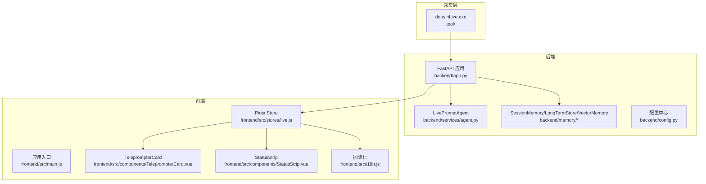
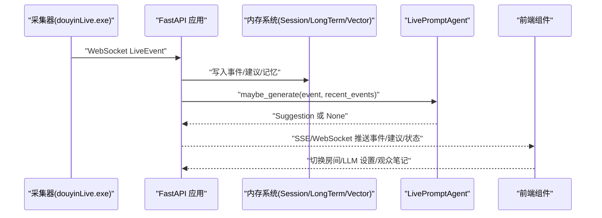
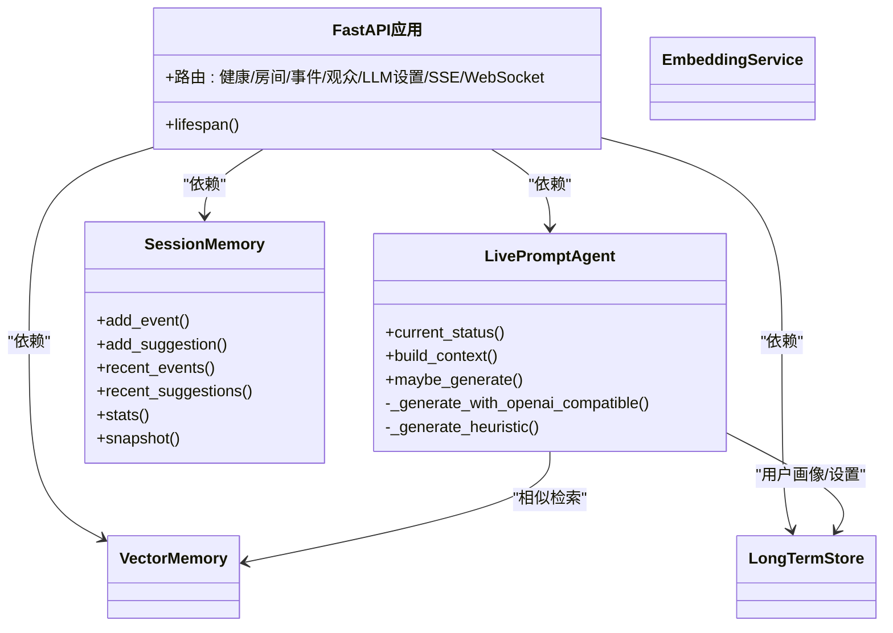
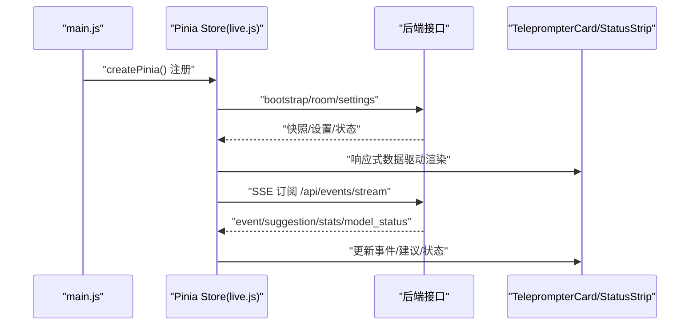
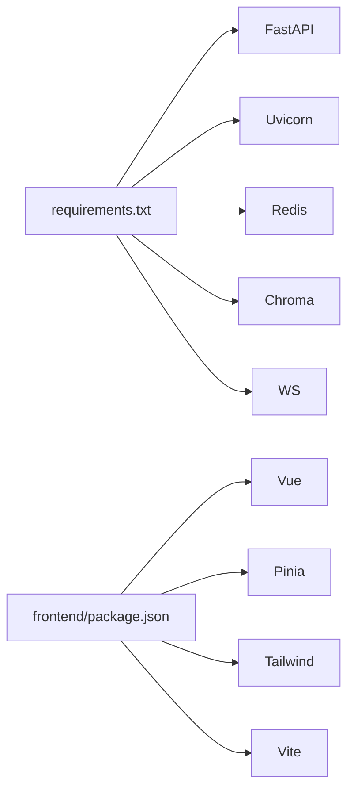

# 代码开发流程

<cite>
**本文引用的文件**
- [README.md](file://README.md)
- [USAGE.md](file://USAGE.md)
- [requirements.txt](file://requirements.txt)
- [backend/app.py](file://backend/app.py)
- [backend/config.py](file://backend/config.py)
- [backend/services/agent.py](file://backend/services/agent.py)
- [backend/memory/session_memory.py](file://backend/memory/session_memory.py)
- [frontend/src/main.js](file://frontend/src/main.js)
- [frontend/src/stores/live.js](file://frontend/src/stores/live.js)
- [frontend/src/components/TeleprompterCard.vue](file://frontend/src/components/TeleprompterCard.vue)
- [frontend/src/components/StatusStrip.vue](file://frontend/src/components/StatusStrip.vue)
- [frontend/src/i18n.js](file://frontend/src/i18n.js)
- [tests/test_agent.py](file://tests/test_agent.py)
- [tests/test_embedding_service.py](file://tests/test_embedding_service.py)
- [.gitignore](file://.gitignore)
</cite>

## 目录
1. [简介](#简介)
2. [项目结构](#项目结构)
3. [核心组件](#核心组件)
4. [架构总览](#架构总览)
5. [详细组件分析](#详细组件分析)
6. [依赖关系分析](#依赖关系分析)
7. [性能考量](#性能考量)
8. [故障排查指南](#故障排查指南)
9. [结论](#结论)
10. [附录](#附录)

## 简介
本文件为 DouYin_llm 项目制定标准的代码开发流程规范，覆盖需求分析、设计文档、代码实现、单元测试、代码审查、前后端开发规范、代码格式化与命名约定、注释规范、Git 工作流与分支管理、Pull Request 审查标准、本地与集成测试、性能测试最佳实践等内容。目标是统一团队协作流程，提升代码质量与交付效率。

## 项目结构
项目采用前后端分离架构：
- 后端：FastAPI 应用，负责事件处理、记忆系统、LLM 提示词引擎、SSE/WebSocket 推送。
- 前端：Vue 3 + Pinia，通过 SSE 订阅事件流，实时展示状态、建议与消息流。
- 测试：Python 单元测试覆盖 Agent、嵌入服务、向量存储等核心模块。
- 文档：设计稿与实施计划位于 docs/superpowers。

图表来源
- [backend/app.py:108-127](file://backend/app.py#L108-L127)
- [backend/services/agent.py:23-41](file://backend/services/agent.py#L23-L41)
- [backend/memory/session_memory.py:17-31](file://backend/memory/session_memory.py#L17-L31)
- [frontend/src/main.js:6-16](file://frontend/src/main.js#L6-L16)
- [frontend/src/stores/live.js:75-800](file://frontend/src/stores/live.js#L75-L800)
- [frontend/src/components/TeleprompterCard.vue:1-97](file://frontend/src/components/TeleprompterCard.vue#L1-L97)
- [frontend/src/components/StatusStrip.vue:1-316](file://frontend/src/components/StatusStrip.vue#L1-L316)
- [frontend/src/i18n.js:1-316](file://frontend/src/i18n.js#L1-L316)

章节来源
- [README.md:32-44](file://README.md#L32-L44)
- [USAGE.md:15-256](file://USAGE.md#L15-L256)

## 核心组件
- 后端应用与路由：提供健康检查、房间切换、事件注入、观众详情、LLM 设置、SSE/WebSocket 等接口。
- 配置中心：集中管理运行时配置，支持环境变量与 .env 读取。
- 智能提词引擎：根据事件类型与上下文选择 LLM 或启发式规则生成建议。
- 内存系统：短期会话内存（可选 Redis）、长期存储（SQLite）、向量记忆（Chroma）。
- 前端应用：Pinia 管理全局状态，组件订阅 SSE 实时渲染。

章节来源
- [backend/app.py:129-285](file://backend/app.py#L129-L285)
- [backend/config.py:40-113](file://backend/config.py#L40-L113)
- [backend/services/agent.py:23-496](file://backend/services/agent.py#L23-L496)
- [backend/memory/session_memory.py:17-113](file://backend/memory/session_memory.py#L17-L113)
- [frontend/src/main.js:6-16](file://frontend/src/main.js#L6-L16)
- [frontend/src/stores/live.js:75-800](file://frontend/src/stores/live.js#L75-L800)

## 架构总览
系统通过采集器将直播事件标准化后进入后端，经由事件处理、记忆写入、提词生成与状态上报，最终通过 SSE/WebSocket 推送到前端组件展示。

图表来源
- [README.md:7-17](file://README.md#L7-L17)
- [backend/app.py:73-102](file://backend/app.py#L73-L102)
- [backend/services/agent.py:105-142](file://backend/services/agent.py#L105-L142)
- [frontend/src/stores/live.js:474-523](file://frontend/src/stores/live.js#L474-L523)

## 详细组件分析

### 后端服务开发规范（FastAPI、内存管理、智能提词引擎）
- 服务入口与生命周期
  - 使用 lifespan 管理采集器启停与会话关闭，确保资源释放。
  - CORS 中间件允许任意来源，便于前端开发调试。
- 接口设计
  - 健康检查、房间切换、事件注入、观众详情、LLM 设置、SSE/WebSocket 等接口清晰分层。
  - 参数校验与错误处理遵循 HTTP 状态码与错误体规范。
- 内存系统
  - SessionMemory 支持 Redis 与进程内退化，具备 TTL 控制与队列截断。
  - LongTermStore/VectorMemory 负责持久化与向量检索，支持重建嵌入。
- 智能提词引擎
  - LivePromptAgent 优先启发式规则，失败时回退至 LLM；支持系统提示词与模型参数。
  - 输出结构化 Suggestion，包含来源、优先级、语气、理由、置信度与引用。

图表来源
- [backend/app.py:108-127](file://backend/app.py#L108-L127)
- [backend/services/agent.py:23-41](file://backend/services/agent.py#L23-L41)
- [backend/memory/session_memory.py:17-113](file://backend/memory/session_memory.py#L17-L113)

章节来源
- [backend/app.py:108-127](file://backend/app.py#L108-L127)
- [backend/app.py:129-285](file://backend/app.py#L129-L285)
- [backend/services/agent.py:23-496](file://backend/services/agent.py#L23-L496)
- [backend/memory/session_memory.py:17-113](file://backend/memory/session_memory.py#L17-L113)

### 前端组件开发规范（Vue 3、Pinia 状态管理）
- 应用入口
  - 创建 Vue 应用并注册 Pinia，挂载全局样式。
- 状态管理
  - Pinia Store 统一管理房间号、过滤器、主题、SSE 连接状态、事件与建议、LLM 设置、观众工作台等。
  - 支持本地持久化（localStorage）与响应式计算属性。
- 组件
  - TeleprompterCard：展示最高优先级建议及其来源、优先级、语气与理由。
  - StatusStrip：展示房间号、连接状态、模型状态、统计数据与工具按钮。
  - 国际化：i18n.js 提供中英双语翻译与占位符替换。
- 事件流
  - 通过 EventSource 订阅 /api/events/stream，按事件类型分发到对应状态。

图表来源
- [frontend/src/main.js:6-16](file://frontend/src/main.js#L6-L16)
- [frontend/src/stores/live.js:75-800](file://frontend/src/stores/live.js#L75-L800)
- [frontend/src/components/TeleprompterCard.vue:1-97](file://frontend/src/components/TeleprompterCard.vue#L1-L97)
- [frontend/src/components/StatusStrip.vue:1-316](file://frontend/src/components/StatusStrip.vue#L1-L316)
- [frontend/src/i18n.js:1-316](file://frontend/src/i18n.js#L1-L316)

章节来源
- [frontend/src/main.js:6-16](file://frontend/src/main.js#L6-L16)
- [frontend/src/stores/live.js:75-800](file://frontend/src/stores/live.js#L75-L800)
- [frontend/src/components/TeleprompterCard.vue:1-97](file://frontend/src/components/TeleprompterCard.vue#L1-L97)
- [frontend/src/components/StatusStrip.vue:1-316](file://frontend/src/components/StatusStrip.vue#L1-L316)
- [frontend/src/i18n.js:1-316](file://frontend/src/i18n.js#L1-L316)

### 单元测试与集成测试
- Python 单元测试
  - 覆盖智能提词引擎、嵌入服务、向量存储、LLM 设置、空房间引导等。
  - 使用 unittest 与 mock 验证关键逻辑与边界条件。
- 前端测试
  - 使用 Node 原生命令行测试 Store/Presenters，验证状态变更与请求流程。
- 集成测试
  - 通过后端健康检查、SSE/WebSocket 连接、事件注入接口进行端到端验证。

章节来源
- [tests/test_agent.py:1-176](file://tests/test_agent.py#L1-L176)
- [tests/test_embedding_service.py:1-83](file://tests/test_embedding_service.py#L1-L83)
- [README.md:167-191](file://README.md#L167-L191)
- [USAGE.md:179-256](file://USAGE.md#L179-L256)

## 依赖关系分析
- 后端依赖
  - FastAPI、Uvicorn、Redis、Chroma、websocket-client。
- 前端依赖
  - Vue 3、Pinia、TailwindCSS、Vite。
- 运行与数据
  - .env 优先于代码默认值；数据目录与 Chroma 存储可配置。

图表来源
- [requirements.txt:1-6](file://requirements.txt#L1-L6)
- [frontend/package.json:1-23](file://frontend/package.json#L1-L23)

章节来源
- [requirements.txt:1-6](file://requirements.txt#L1-L6)
- [frontend/package.json:1-23](file://frontend/package.json#L1-L23)
- [backend/config.py:52-113](file://backend/config.py#L52-L113)

## 性能考量
- 事件窗口与内存
  - SessionMemory 限制事件与建议数量，避免无限增长；Redis 模式支持 TTL。
- LLM 调用
  - 超时控制、失败回退至启发式规则；输出解析严格校验 JSON 结构。
- 向量检索
  - 相似度阈值与召回数量可配置，降低无关检索带来的延迟。
- 前端渲染
  - 事件与建议上限控制，避免 DOM 过载；组件按需渲染与懒加载。

章节来源
- [backend/memory/session_memory.py:24-113](file://backend/memory/session_memory.py#L24-L113)
- [backend/services/agent.py:200-496](file://backend/services/agent.py#L200-L496)
- [backend/config.py:71-113](file://backend/config.py#L71-L113)
- [frontend/src/stores/live.js:5-7](file://frontend/src/stores/live.js#L5-L7)

## 故障排查指南
- 常见问题
  - 页面无建议：检查采集器是否启动、房间号是否正确、后端是否重启。
  - 显示 fallback：检查 API Key、网络与超时；查看后端日志。
  - 前端无法打开：检查前端端口占用与启动脚本。
  - 后端未写入数据：确认采集器 WebSocket 地址与直播开播状态。
- 日志与调试
  - logs 目录输出调试信息；可使用调试客户端复现原始事件。
- 配置优先级
  - .env > 当前 shell > 代码默认值。

章节来源
- [USAGE.md:198-256](file://USAGE.md#L198-L256)
- [README.md:193-213](file://README.md#L193-L213)
- [.gitignore:1-19](file://.gitignore#L1-L19)

## 结论
通过标准化的开发流程与严格的测试规范，DouYin_llm 能够在本地高效迭代并稳定交付。建议在新增功能时严格遵循本文规范，确保前后端一致性与可维护性。

## 附录

### 新功能开发标准流程
- 需求分析
  - 明确业务目标、用户场景与验收标准；必要时输出设计稿与实施计划。
- 设计文档
  - 后端：接口定义、数据模型、错误码与配置项；前端：组件职责、状态流转、国际化与测试点。
- 代码实现
  - 后端：FastAPI 路由与服务模块；前端：组件与 Store 操作。
- 单元测试
  - Python：unittest + mock；前端：Node 原生命令行测试。
- 代码审查
  - 重点检查：接口契约、异常处理、性能影响、可测试性与可维护性。

章节来源
- [README.md:199-213](file://README.md#L199-L213)
- [USAGE.md:1-256](file://USAGE.md#L1-L256)

### 代码格式化、命名约定与注释规范
- Python
  - 使用标准库与第三方库的通用命名；函数/类/模块使用清晰语义命名；关键逻辑添加简洁注释。
- JavaScript/Vue
  - 变量与函数使用小驼峰；组件文件使用帕斯卡命名；导出对象与方法添加必要注释。
- 文档与注释
  - README/USAGE 作为对外文档；内部注释聚焦“为什么”而非“是什么”。

章节来源
- [backend/app.py:1-285](file://backend/app.py#L1-L285)
- [frontend/src/stores/live.js:1-800](file://frontend/src/stores/live.js#L1-L800)

### Git 工作流程与分支管理
- 分支策略
  - main：稳定发布；feature/*：功能开发；hotfix/*：紧急修复；docs/*：文档更新。
- 提交规范
  - 标准化前缀：feat、fix、docs、refactor、test、chore；附带简要描述与关联 Issue。
- Pull Request
  - 必须包含测试用例、变更说明与风险评估；至少一次代码审查通过后合并。

章节来源
- [.gitignore:1-19](file://.gitignore#L1-L19)

### Pull Request 审查标准
- 代码质量
  - 无明显性能退化；异常处理完善；边界条件覆盖。
- 可测试性
  - 新增逻辑具备可测性；必要时补充单元测试。
- 文档与兼容性
  - 接口变更同步更新文档；向后兼容或提供迁移指引。

章节来源
- [tests/test_agent.py:1-176](file://tests/test_agent.py#L1-L176)
- [tests/test_embedding_service.py:1-83](file://tests/test_embedding_service.py#L1-L83)

### 本地测试与集成测试
- 本地启动
  - 后端：uvicorn 启动 FastAPI；前端：Vite dev；采集器：douyinLive.exe。
- 接口验证
  - 健康检查、房间切换、事件注入、SSE/WebSocket 连接。
- 前端测试
  - 使用 Node 原生命令行运行 Store/Presenters 测试脚本。

章节来源
- [USAGE.md:51-122](file://USAGE.md#L51-L122)
- [README.md:167-191](file://README.md#L167-L191)

### 性能测试最佳实践
- 压力测试
  - 模拟高并发事件流，观察 SSE/WebSocket 推送延迟与前端渲染性能。
- LLM 调用
  - 配置合理超时与重试；监控失败率与回退比例。
- 内存与存储
  - 监控 SessionMemory 队列长度与 Redis/SQLite/Chroma 占用；定期清理与重建嵌入。

章节来源
- [backend/services/agent.py:302-496](file://backend/services/agent.py#L302-L496)
- [backend/memory/session_memory.py:42-113](file://backend/memory/session_memory.py#L42-L113)
- [backend/config.py:71-113](file://backend/config.py#L71-L113)