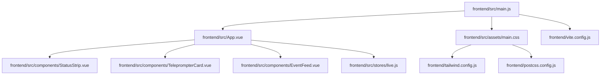
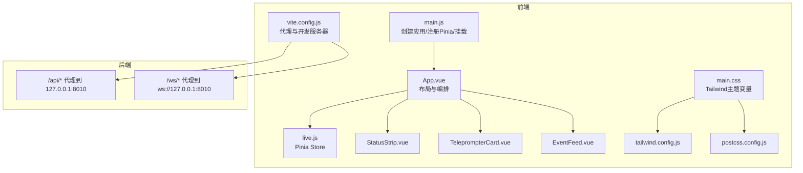
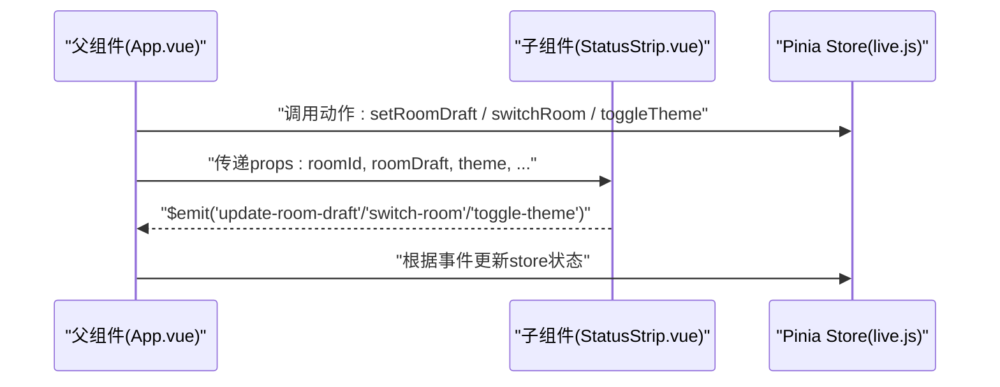
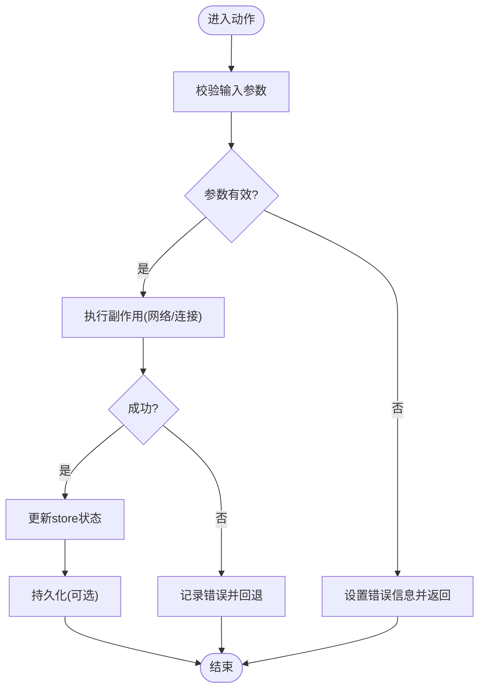
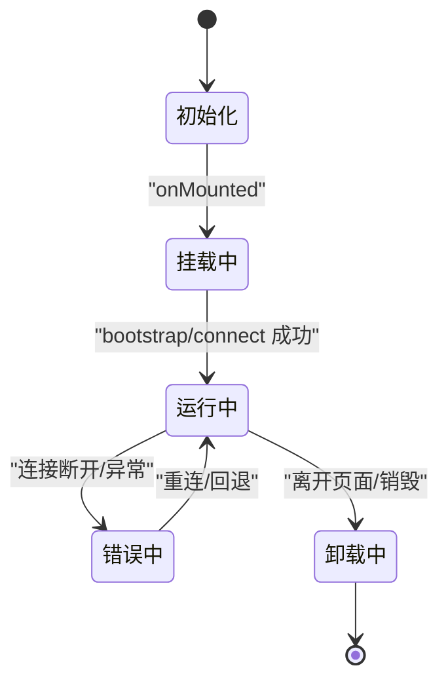
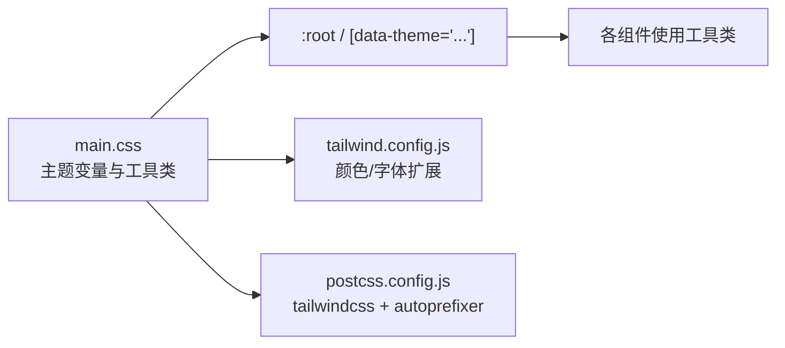
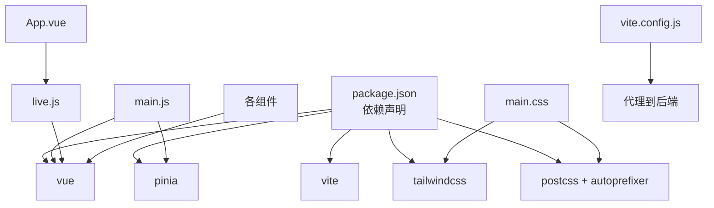

# JavaScript/Vue.js前端代码规范

<cite>
**本文引用的文件**
- [frontend/src/main.js](file://frontend/src/main.js)
- [frontend/src/App.vue](file://frontend/src/App.vue)
- [frontend/src/stores/live.js](file://frontend/src/stores/live.js)
- [frontend/src/components/EventFeed.vue](file://frontend/src/components/EventFeed.vue)
- [frontend/src/components/StatusStrip.vue](file://frontend/src/components/StatusStrip.vue)
- [frontend/src/components/TeleprompterCard.vue](file://frontend/src/components/TeleprompterCard.vue)
- [frontend/src/assets/main.css](file://frontend/src/assets/main.css)
- [frontend/package.json](file://frontend/package.json)
- [frontend/vite.config.js](file://frontend/vite.config.js)
- [frontend/postcss.config.js](file://frontend/postcss.config.js)
- [frontend/tailwind.config.js](file://frontend/tailwind.config.js)
- [README.md](file://README.md)
- [USAGE.md](file://USAGE.md)
</cite>

## 目录
1. [简介](#简介)
2. [项目结构](#项目结构)
3. [核心组件](#核心组件)
4. [架构总览](#架构总览)
5. [详细组件分析](#详细组件分析)
6. [依赖关系分析](#依赖关系分析)
7. [性能考虑](#性能考虑)
8. [故障排查指南](#故障排查指南)
9. [结论](#结论)
10. [附录](#附录)

## 简介
本规范旨在为该Vue 3 + Pinia + Tailwind前端项目建立一致、可维护且高性能的开发标准。内容覆盖：
- ESLint配置与规则建议
- Vue组件命名与结构规范（PascalCase）
- Composition API使用规范（setup函数、响应式数据）
- 样式组织原则（CSS-in-JS vs SCSS）
- 组件通信模式（props、events、provide/inject）
- Pinia状态管理最佳实践（store设计、action定义、getter使用）
- 生命周期管理、错误边界处理
- 性能优化原则（懒加载、虚拟滚动）

本规范严格基于仓库现有实现进行提炼与扩展，确保与实际代码一致。

## 项目结构
前端采用Vite + Vue 3 + Pinia + Tailwind的现代工程化结构，核心目录与职责如下：
- src/main.js：应用入口，注册Pinia并挂载应用
- src/App.vue：根组件，负责布局与子组件编排
- src/stores/live.js：Pinia Store，集中管理直播状态、事件流与主题
- src/components/*：可复用UI组件（EventFeed、StatusStrip、TeleprompterCard）
- src/assets/main.css：Tailwind基础样式与主题变量
- vite.config.js：开发服务器与代理配置
- tailwind.config.js / postcss.config.js：样式管线配置

**图表来源**
- [frontend/src/main.js:1-17](file://frontend/src/main.js#L1-L17)
- [frontend/src/App.vue:1-66](file://frontend/src/App.vue#L1-L66)
- [frontend/src/stores/live.js:1-310](file://frontend/src/stores/live.js#L1-L310)
- [frontend/src/components/EventFeed.vue:1-183](file://frontend/src/components/EventFeed.vue#L1-L183)
- [frontend/src/components/StatusStrip.vue:1-144](file://frontend/src/components/StatusStrip.vue#L1-L144)
- [frontend/src/components/TeleprompterCard.vue:1-83](file://frontend/src/components/TeleprompterCard.vue#L1-L83)
- [frontend/src/assets/main.css:1-144](file://frontend/src/assets/main.css#L1-L144)
- [frontend/vite.config.js:1-23](file://frontend/vite.config.js#L1-L23)
- [frontend/tailwind.config.js:1-23](file://frontend/tailwind.config.js#L1-L23)
- [frontend/postcss.config.js:1-9](file://frontend/postcss.config.js#L1-L9)

**章节来源**
- [frontend/src/main.js:1-17](file://frontend/src/main.js#L1-L17)
- [frontend/src/App.vue:1-66](file://frontend/src/App.vue#L1-L66)
- [frontend/package.json:1-23](file://frontend/package.json#L1-L23)
- [frontend/vite.config.js:1-23](file://frontend/vite.config.js#L1-L23)
- [frontend/tailwind.config.js:1-23](file://frontend/tailwind.config.js#L1-L23)
- [frontend/postcss.config.js:1-9](file://frontend/postcss.config.js#L1-L9)

## 核心组件
- 应用入口与状态注入
  - 在入口文件中创建应用实例并注册Pinia，确保全局共享状态可用
  - 在挂载前加载全局样式主题，保证首屏渲染一致性
- 根组件编排
  - 使用<script setup>与组合式API
  - 通过storeToRefs解构store，避免丢失响应性
  - 在onMounted中执行引导与连接逻辑
- Store设计
  - 使用defineStore与setup风格返回值，集中管理房间号、主题、连接状态、事件过滤器、统计数据、事件与建议队列
  - 计算属性用于派生状态（如活跃建议、活跃事件、过滤后的事件）
  - 动作（actions）封装副作用（如bootstrap、connect、switchRoom），并处理错误回退
- 组件通信
  - 父子组件通过props传递数据，通过$emit触发事件
  - 未使用provide/inject，保持组件间依赖清晰

**章节来源**
- [frontend/src/main.js:1-17](file://frontend/src/main.js#L1-L17)
- [frontend/src/App.vue:1-66](file://frontend/src/App.vue#L1-L66)
- [frontend/src/stores/live.js:1-310](file://frontend/src/stores/live.js#L1-L310)

## 架构总览
前端通过Vite开发服务器与后端进行同源代理，统一走/api与/ws路径，简化跨域与部署复杂度。Tailwind提供原子化样式与主题变量，配合PostCSS与Autoprefixer实现自动补全与工具类展开。

**图表来源**
- [frontend/src/main.js:1-17](file://frontend/src/main.js#L1-L17)
- [frontend/src/App.vue:1-66](file://frontend/src/App.vue#L1-L66)
- [frontend/src/stores/live.js:1-310](file://frontend/src/stores/live.js#L1-L310)
- [frontend/src/components/EventFeed.vue:1-183](file://frontend/src/components/EventFeed.vue#L1-L183)
- [frontend/src/components/StatusStrip.vue:1-144](file://frontend/src/components/StatusStrip.vue#L1-L144)
- [frontend/src/components/TeleprompterCard.vue:1-83](file://frontend/src/components/TeleprompterCard.vue#L1-L83)
- [frontend/src/assets/main.css:1-144](file://frontend/src/assets/main.css#L1-L144)
- [frontend/vite.config.js:1-23](file://frontend/vite.config.js#L1-L23)
- [frontend/tailwind.config.js:1-23](file://frontend/tailwind.config.js#L1-L23)
- [frontend/postcss.config.js:1-9](file://frontend/postcss.config.js#L1-L9)

## 详细组件分析

### 组件通信与props/事件规范
- Props定义
  - 明确类型、必填与默认值，便于IDE提示与运行时校验
  - 使用defineProps在<script setup>中声明
- 事件发射
  - 使用defineEmits声明事件名，父组件通过事件监听器接收
  - 避免在子组件内部直接修改父组件传入的响应式对象
- provide/inject
  - 本项目未使用，建议仅在深层嵌套或跨层级共享配置时谨慎使用

**图表来源**
- [frontend/src/App.vue:1-66](file://frontend/src/App.vue#L1-L66)
- [frontend/src/components/StatusStrip.vue:1-144](file://frontend/src/components/StatusStrip.vue#L1-L144)
- [frontend/src/stores/live.js:1-310](file://frontend/src/stores/live.js#L1-L310)

**章节来源**
- [frontend/src/components/StatusStrip.vue:1-144](file://frontend/src/components/StatusStrip.vue#L1-L144)
- [frontend/src/components/EventFeed.vue:1-183](file://frontend/src/components/EventFeed.vue#L1-L183)
- [frontend/src/components/TeleprompterCard.vue:1-83](file://frontend/src/components/TeleprompterCard.vue#L1-L83)
- [frontend/src/App.vue:1-66](file://frontend/src/App.vue#L1-L66)

### Pinia状态管理最佳实践
- Store设计
  - 使用defineStore与setup风格返回值，集中管理响应式状态与计算属性
  - 将副作用（如网络请求、SSE连接）封装为动作（actions），保持store纯净
- Getter使用
  - 使用computed派生状态，避免在模板中重复计算
- 动作定义
  - 将异步逻辑（bootstrap、connect、switchRoom）封装为动作，集中处理错误与回退
  - 对外暴露简洁的API，隐藏内部实现细节
- 错误处理
  - 在动作中捕获异常并设置错误信息，必要时回滚到上一个有效状态

**图表来源**
- [frontend/src/stores/live.js:158-250](file://frontend/src/stores/live.js#L158-L250)

**章节来源**
- [frontend/src/stores/live.js:1-310](file://frontend/src/stores/live.js#L1-L310)

### 组件生命周期管理
- onMounted：在根组件中执行引导与连接逻辑，确保DOM与状态准备就绪后再发起网络请求
- onUnmounted：在需要时清理资源（如SSE连接），避免内存泄漏
- keep-alive：对于频繁切换但状态稳定的组件，可结合keep-alive减少重渲染

**图表来源**
- [frontend/src/App.vue:29-32](file://frontend/src/App.vue#L29-L32)
- [frontend/src/stores/live.js:137-205](file://frontend/src/stores/live.js#L137-L205)

**章节来源**
- [frontend/src/App.vue:1-66](file://frontend/src/App.vue#L1-L66)
- [frontend/src/stores/live.js:1-310](file://frontend/src/stores/live.js#L1-L310)

### 样式组织原则（CSS-in-JS vs SCSS）
- 本项目采用Tailwind原子化样式与CSS变量的主题系统，不引入SCSS
- 优点：样式集中、主题切换简单、无命名冲突
- 建议：
  - 优先使用Tailwind工具类
  - 通过CSS变量控制主题（如data-theme），在组件中按需切换
  - 避免在组件内使用内联样式（CSS-in-JS），保持样式与逻辑分离

**图表来源**
- [frontend/src/assets/main.css:1-144](file://frontend/src/assets/main.css#L1-L144)
- [frontend/tailwind.config.js:1-23](file://frontend/tailwind.config.js#L1-L23)
- [frontend/postcss.config.js:1-9](file://frontend/postcss.config.js#L1-L9)

**章节来源**
- [frontend/src/assets/main.css:1-144](file://frontend/src/assets/main.css#L1-L144)
- [frontend/tailwind.config.js:1-23](file://frontend/tailwind.config.js#L1-L23)
- [frontend/postcss.config.js:1-9](file://frontend/postcss.config.js#L1-L9)

### 组件命名规范（PascalCase）
- 组件文件与导出名称统一使用PascalCase（如EventFeed.vue、StatusStrip.vue、TeleprompterCard.vue）
- 导入时保持大小写一致，避免路径大小写差异导致的问题
- 在模板中使用PascalCase组件标签

**章节来源**
- [frontend/src/components/EventFeed.vue:1-183](file://frontend/src/components/EventFeed.vue#L1-L183)
- [frontend/src/components/StatusStrip.vue:1-144](file://frontend/src/components/StatusStrip.vue#L1-L144)
- [frontend/src/components/TeleprompterCard.vue:1-83](file://frontend/src/components/TeleprompterCard.vue#L1-L83)

### ESLint配置与规则建议
- 语言与框架
  - 使用Vue官方ESLint插件与解析器，启用Vue 3语法支持
  - 规则集建议：基础规则 + Vue特定规则 + 代码质量规则
- 文件与导入
  - 禁止相对路径导入超出范围
  - 统一文件扩展名（.vue/.js）
- 组件与Composition API
  - 强制使用<script setup>与组合式API
  - 禁止在模板中直接调用方法，应使用计算属性或事件处理器
- 响应式与副作用
  - 禁止在模板中直接修改响应式数据
  - 强制在动作中处理副作用与错误
- 样式与主题
  - 禁止在组件内硬编码颜色，统一使用CSS变量与Tailwind工具类
- 提交前检查
  - 集成pre-commit钩子，确保提交前自动修复与静态检查

[本节为通用规范建议，不直接分析具体文件，故无“章节来源”]

## 依赖关系分析
- 应用入口依赖：Vue、Pinia
- 组件依赖：组合式API（ref/computed）、storeToRefs
- 样式管线：Tailwind、PostCSS、Autoprefixer
- 开发服务器：Vite代理至后端

**图表来源**
- [frontend/package.json:1-23](file://frontend/package.json#L1-L23)
- [frontend/src/main.js:1-17](file://frontend/src/main.js#L1-L17)
- [frontend/src/App.vue:1-66](file://frontend/src/App.vue#L1-L66)
- [frontend/src/stores/live.js:1-310](file://frontend/src/stores/live.js#L1-L310)
- [frontend/src/assets/main.css:1-144](file://frontend/src/assets/main.css#L1-L144)
- [frontend/vite.config.js:1-23](file://frontend/vite.config.js#L1-L23)

**章节来源**
- [frontend/package.json:1-23](file://frontend/package.json#L1-L23)
- [frontend/vite.config.js:1-23](file://frontend/vite.config.js#L1-L23)

## 性能考虑
- 渲染优化
  - 使用计算属性缓存派生结果，避免重复计算
  - 在列表渲染中使用key，提升diff效率
- 网络与流
  - SSE连接在store中集中管理，避免重复连接
  - 对事件与建议数组设置上限，防止内存膨胀
- 主题与样式
  - 通过CSS变量切换主题，避免重绘与重排
- 懒加载与虚拟滚动
  - 对长列表组件（如EventFeed）限制渲染数量，必要时引入虚拟滚动
- 缓存与持久化
  - 事件与建议队列长度限制，localStorage持久化用户偏好

**章节来源**
- [frontend/src/stores/live.js:4-6](file://frontend/src/stores/live.js#L4-L6)
- [frontend/src/stores/live.js:165-171](file://frontend/src/stores/live.js#L165-L171)
- [frontend/src/components/EventFeed.vue:141-171](file://frontend/src/components/EventFeed.vue#L141-L171)
- [frontend/src/assets/main.css:1-144](file://frontend/src/assets/main.css#L1-L144)

## 故障排查指南
- 启动与代理
  - 确认Vite开发服务器端口与代理配置正确
  - 检查/api与/ws代理是否指向后端地址
- 状态与连接
  - 查看store中的connectionState与roomError，定位连接问题
  - 在switchRoom动作中捕获异常并回退到上一个有效状态
- 样式与主题
  - 确认:data-theme与CSS变量生效
  - 检查Tailwind与PostCSS配置是否正确
- 常见问题
  - 页面空白：检查main.js挂载点与入口文件
  - 无事件：检查SSE连接与后端健康状态

**章节来源**
- [frontend/vite.config.js:1-23](file://frontend/vite.config.js#L1-L23)
- [frontend/src/stores/live.js:207-250](file://frontend/src/stores/live.js#L207-L250)
- [frontend/src/assets/main.css:1-144](file://frontend/src/assets/main.css#L1-L144)
- [USAGE.md:179-256](file://USAGE.md#L179-L256)

## 结论
本规范以仓库现有实现为基础，总结了Vue 3 + Pinia + Tailwind项目的编码标准与最佳实践。遵循这些规范有助于：
- 提升代码一致性与可维护性
- 降低组件间耦合与心智负担
- 增强性能与稳定性
- 为后续扩展（懒加载、虚拟滚动等）奠定基础

## 附录
- 参考文档
  - [README.md](file://README.md)
  - [USAGE.md](file://USAGE.md)