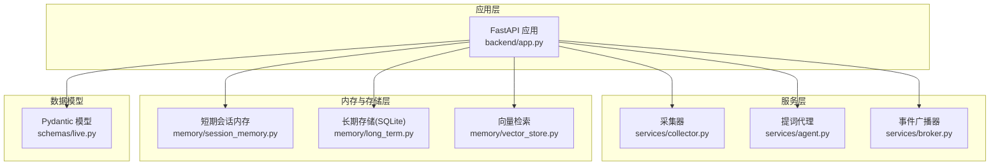
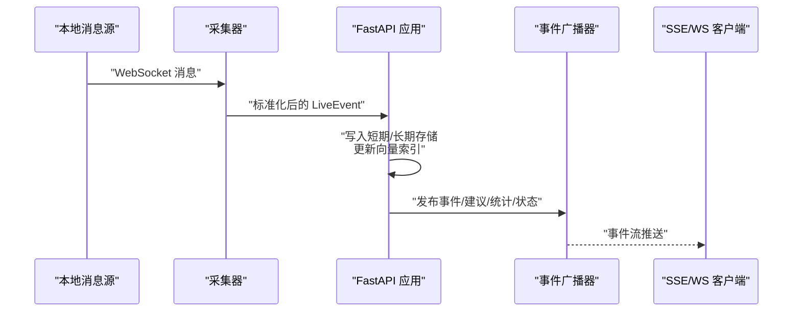
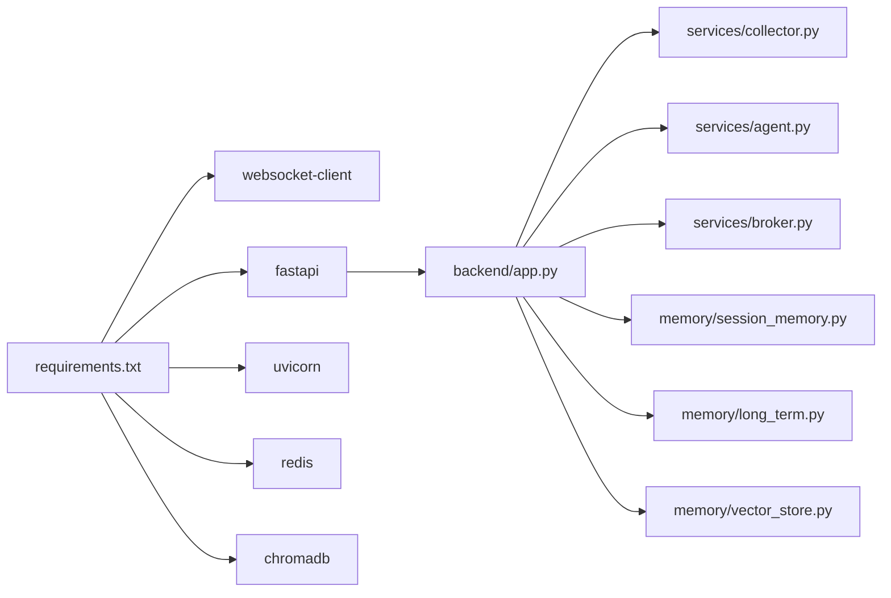

# Python后端代码规范

<cite>
**本文引用的文件**
- [backend/app.py](file://backend/app.py)
- [backend/config.py](file://backend/config.py)
- [backend/memory/long_term.py](file://backend/memory/long_term.py)
- [backend/memory/session_memory.py](file://backend/memory/session_memory.py)
- [backend/memory/vector_store.py](file://backend/memory/vector_store.py)
- [backend/schemas/live.py](file://backend/schemas/live.py)
- [backend/services/agent.py](file://backend/services/agent.py)
- [backend/services/broker.py](file://backend/services/broker.py)
- [backend/services/collector.py](file://backend/services/collector.py)
- [requirements.txt](file://requirements.txt)
- [README.md](file://README.md)
</cite>

## 目录
1. [简介](#简介)
2. [项目结构](#项目结构)
3. [核心组件](#核心组件)
4. [架构总览](#架构总览)
5. [详细组件分析](#详细组件分析)
6. [依赖分析](#依赖分析)
7. [性能考虑](#性能考虑)
8. [故障排查指南](#故障排查指南)
9. [结论](#结论)
10. [附录](#附录)

## 简介
本规范旨在统一后端代码风格与工程实践，覆盖 FastAPI 应用、服务层、内存管理等模块的编码标准。内容涵盖 PEP8 规范遵循、函数命名约定、类设计原则（单例模式、工厂模式）、异常处理模式（HTTPException 使用、自定义异常）、日志记录标准（logging 模块使用、日志级别）、注释规范（docstring 格式、参数说明），以及异步编程最佳实践（async/await 使用、事件循环管理）、FastAPI 装饰器使用规范、Pydantic 模型定义规范、依赖注入模式。同时提供具体代码示例的“正确/错误”对比路径，帮助团队保持一致性与可维护性。

## 项目结构
后端采用按职责分层的组织方式：
- 应用入口与路由：backend/app.py
- 配置管理：backend/config.py
- 数据模型：backend/schemas/live.py
- 服务层：
  - 事件采集器：backend/services/collector.py
  - 事件代理（提词）：backend/services/agent.py
  - 事件广播器：backend/services/broker.py
- 内存与存储层：
  - 短期会话内存：backend/memory/session_memory.py
  - 长期存储（SQLite）：backend/memory/long_term.py
  - 向量检索：backend/memory/vector_store.py

图表来源
- [backend/app.py:1-220](file://backend/app.py#L1-L220)
- [backend/services/collector.py:1-284](file://backend/services/collector.py#L1-L284)
- [backend/services/agent.py:1-393](file://backend/services/agent.py#L1-L393)
- [backend/services/broker.py:1-40](file://backend/services/broker.py#L1-L40)
- [backend/memory/session_memory.py:1-113](file://backend/memory/session_memory.py#L1-L113)
- [backend/memory/long_term.py:1-750](file://backend/memory/long_term.py#L1-L750)
- [backend/memory/vector_store.py:1-108](file://backend/memory/vector_store.py#L1-L108)
- [backend/schemas/live.py:1-95](file://backend/schemas/live.py#L1-L95)

章节来源
- [backend/app.py:1-220](file://backend/app.py#L1-L220)
- [README.md:21-34](file://README.md#L21-L34)

## 核心组件
- FastAPI 应用与路由：提供健康检查、房间切换、事件注入、SSE/WS 实时流等接口，使用 lifespan 管理生命周期资源。
- 配置模块：集中读取 .env 与环境变量，提供运行期配置与默认值。
- Pydantic 模型：Actor、LiveEvent、Suggestion、SessionStats、ModelStatus、SessionSnapshot。
- 服务层：
  - 采集器：连接本地 WebSocket，标准化消息，提交到事件循环。
  - 提词代理：优先调用 OpenAI 兼容接口，失败回退启发式规则。
  - 广播器：进程内事件广播，供 SSE/WS 分发。
- 内存与存储：
  - SessionMemory：Redis 或进程内 deque，维护短期事件与建议。
  - LongTermStore：SQLite 表结构、索引、聚合与查询。
  - VectorMemory：Chroma 或本地哈希嵌入，提供相似历史检索。

章节来源
- [backend/app.py:104-220](file://backend/app.py#L104-L220)
- [backend/config.py:39-94](file://backend/config.py#L39-L94)
- [backend/schemas/live.py:8-95](file://backend/schemas/live.py#L8-L95)
- [backend/services/collector.py:38-284](file://backend/services/collector.py#L38-L284)
- [backend/services/agent.py:23-393](file://backend/services/agent.py#L23-L393)
- [backend/services/broker.py:10-40](file://backend/services/broker.py#L10-L40)
- [backend/memory/session_memory.py:17-113](file://backend/memory/session_memory.py#L17-L113)
- [backend/memory/long_term.py:36-750](file://backend/memory/long_term.py#L36-L750)
- [backend/memory/vector_store.py:52-108](file://backend/memory/vector_store.py#L52-L108)

## 架构总览
系统通过本地消息源提供 WebSocket，采集器将其标准化为 LiveEvent 并提交到 FastAPI 事件循环；随后事件被写入短期/长期存储与向量索引，提词代理根据上下文生成建议并通过广播器推送到前端。

图表来源
- [backend/services/collector.py:145-207](file://backend/services/collector.py#L145-L207)
- [backend/app.py:61-78](file://backend/app.py#L61-L78)
- [backend/services/broker.py:28-40](file://backend/services/broker.py#L28-L40)

## 详细组件分析

### FastAPI 应用与路由规范
- 路由装饰器使用
  - 使用 async def 定义异步路由，避免阻塞事件循环。
  - 使用 HTTPException 抛出业务错误，配合状态码与 detail 字段。
  - 使用 Pydantic 模型进行请求体与响应体的序列化/反序列化。
- 生命周期管理
  - 使用 lifespan 管理采集器启动与停止、数据库关闭等资源回收。
- 日志记录
  - 使用 logging.basicConfig 设置基础日志格式与级别。
- 异步流
  - SSE 使用 StreamingResponse 返回事件流。
  - WebSocket 使用 subscribe/unsubscribe 管理订阅队列。

章节来源
- [backend/app.py:84-92](file://backend/app.py#L84-L92)
- [backend/app.py:104-220](file://backend/app.py#L104-L220)
- [backend/app.py:23](file://backend/app.py#L23)

### 配置模块规范
- 优先级：.env 文件 > 环境变量
- dataclass 组织配置项，提供 ensure_dirs 创建必要目录
- resolved_* 方法解析最终使用的 LLM 地址与模型名
- 默认值保证本地开箱即用

章节来源
- [backend/config.py:11-36](file://backend/config.py#L11-L36)
- [backend/config.py:39-94](file://backend/config.py#L39-L94)

### Pydantic 模型定义规范
- 字段类型与默认值：明确字段类型与默认值，避免运行时类型错误
- Field(default_factory=...)：用于复杂默认对象
- model_dump()/model_dump_json()：序列化输出
- model_validate_json()：反序列化输入
- 属性 property：如 Actor.viewer_id，提供派生属性

章节来源
- [backend/schemas/live.py:8-95](file://backend/schemas/live.py#L8-L95)

### 服务层组件规范

#### 采集器（DouyinCollector）
- 线程+事件循环：在独立线程中运行 WebSocket，通过 run_coroutine_threadsafe 将事件提交到 FastAPI 事件循环
- 重连与心跳：断线自动重连，定时发送 ping 保持连接
- 错误处理：捕获网络异常与 JSON 解析异常，记录日志并降级处理
- 事件映射：method -> event_type 映射，提取礼物数量、钻石数等元数据

章节来源
- [backend/services/collector.py:38-284](file://backend/services/collector.py#L38-L284)

#### 提词代理（LivePromptAgent）
- 模式选择：优先 OpenAI 兼容接口，失败回退启发式规则
- 上下文构建：最近事件、相似历史、用户画像
- 状态管理：维护当前模型状态（mode/model/backend/last_result/last_error/updated_at）
- JSON 解析与规范化：尝试多种包裹形式，严格校验字段与类型范围

章节来源
- [backend/services/agent.py:23-393](file://backend/services/agent.py#L23-L393)

#### 事件广播器（EventBroker）
- 订阅/取消订阅：维护订阅队列集合，支持并发广播
- 广播策略：非阻塞 put，清理满队列的订阅

章节来源
- [backend/services/broker.py:10-40](file://backend/services/broker.py#L10-L40)

### 内存与存储层规范

#### SessionMemory（短期会话内存）
- Redis 优先：若可用且配置有效，则使用 Redis 列表维护事件与建议
- 进程内降级：否则使用 deque，限制窗口大小
- TTL 控制：Redis 模式下设置过期时间

章节来源
- [backend/memory/session_memory.py:17-113](file://backend/memory/session_memory.py#L17-L113)

#### LongTermStore（长期存储）
- SQLite 表结构：events、suggestions、viewer_profiles、viewer_gifts、live_sessions、viewer_notes
- 动态迁移：自动添加缺失列、创建索引、重建聚合
- 事务与批量操作：使用上下文管理器与批量更新
- 查询优化：索引覆盖常见查询路径

章节来源
- [backend/memory/long_term.py:36-750](file://backend/memory/long_term.py#L36-L750)

#### VectorMemory（向量检索）
- Chroma 优先：持久化客户端与集合
- 本地降级：HashEmbeddingFunction + 文本相似度近似
- 文档与元数据：按事件内容与用户昵称组合文档，携带 room_id、event_type

章节来源
- [backend/memory/vector_store.py:52-108](file://backend/memory/vector_store.py#L52-L108)

### 异步编程最佳实践
- 使用 async/await 定义异步函数，避免阻塞 I/O
- 使用 asyncio.Queue 进行协程间通信
- 使用 run_coroutine_threadsafe 在线程与事件循环之间传递任务
- 使用 lifespan 管理资源生命周期，确保优雅退出

章节来源
- [backend/app.py:84-92](file://backend/app.py#L84-L92)
- [backend/services/collector.py:200-207](file://backend/services/collector.py#L200-L207)
- [backend/services/broker.py:28-40](file://backend/services/broker.py#L28-L40)

### FastAPI 装饰器与依赖注入规范
- 路由装饰器：@app.get/@app.post/@app.websocket/@app.on_event 等
- 依赖注入：通过 Pydantic 模型自动解析请求体，避免手动解析
- CORS 中间件：允许跨域访问，便于前端开发调试

章节来源
- [backend/app.py:94-101](file://backend/app.py#L94-L101)
- [backend/app.py:104-220](file://backend/app.py#L104-L220)

### 异常处理与自定义异常
- HTTPException：用于业务错误（如参数缺失、未找到），设置合理状态码与 detail
- 日志记录：使用 logging 模块记录错误堆栈与上下文信息
- 网络异常：对 URLError、HTTPError、TimeoutError、JSONDecodeError 等进行分类处理

章节来源
- [backend/app.py:118-126](file://backend/app.py#L118-L126)
- [backend/app.py:139-141](file://backend/app.py#L139-L141)
- [backend/services/agent.py:222-285](file://backend/services/agent.py#L222-L285)

### 日志记录标准
- 日志级别：INFO 用于常规状态，WARNING/ERROR 用于异常与错误
- 日志格式：统一格式字符串，包含级别、模块名与消息
- 关键路径日志：采集器、代理、广播器均记录关键事件与错误

章节来源
- [backend/app.py:23](file://backend/app.py#L23)
- [backend/services/collector.py:140-180](file://backend/services/collector.py#L140-L180)
- [backend/services/agent.py:232-284](file://backend/services/agent.py#L232-L284)

### 注释规范
- 模块 docstring：描述模块职责与边界
- 类 docstring：说明类用途、关键方法与注意事项
- 方法 docstring：简述目的、参数、返回值与异常
- 行内注释：仅在复杂逻辑处提供必要说明

章节来源
- [backend/memory/long_term.py:1-13](file://backend/memory/long_term.py#L1-L13)
- [backend/services/agent.py:1-6](file://backend/services/agent.py#L1-L6)
- [backend/services/broker.py:1-4](file://backend/services/broker.py#L1-L4)

## 依赖分析
- 第三方依赖：websocket-client、fastapi、uvicorn、redis、chromadb
- 可选依赖：redis、chromadb，未安装时系统自动降级为本地内存与文本相似策略

图表来源
- [requirements.txt:1-6](file://requirements.txt#L1-L6)
- [backend/app.py:13-20](file://backend/app.py#L13-L20)

章节来源
- [requirements.txt:1-6](file://requirements.txt#L1-L6)
- [backend/app.py:13-20](file://backend/app.py#L13-L20)

## 性能考虑
- I/O 密集：使用异步与事件循环，避免阻塞
- 缓存与降级：Redis 与 Chroma 可选，无依赖时仍可运行
- 窗口限制：短期内存使用固定窗口，避免无限增长
- 索引优化：SQLite 建立常用索引，减少查询成本
- 超时与重试：LLM 请求设置超时，网络异常自动重试

## 故障排查指南
- 采集器无法连接：检查 ROOM_ID、COLLECTOR_HOST/PORT、网络连通性
- SSE/WS 无推送：确认广播器订阅队列与事件发布流程
- LLM 调用失败：检查 LLM_MODE、LLM_BASE_URL、LLM_MODEL、API_KEY
- SQLite/Chroma 异常：确认 DATA_DIR、DATABASE_PATH、CHROMA_DIR 权限与磁盘空间

章节来源
- [backend/services/collector.py:61-78](file://backend/services/collector.py#L61-L78)
- [backend/services/agent.py:183-329](file://backend/services/agent.py#L183-L329)
- [backend/config.py:63-91](file://backend/config.py#L63-L91)

## 结论
本规范总结了项目在 FastAPI 应用、服务层、内存管理等方面的编码标准与最佳实践。通过统一的命名约定、类设计原则、异常处理与日志记录，结合异步编程与依赖注入，能够显著提升代码一致性与可维护性。建议在新功能开发中严格遵循本规范，并在评审中重点关注上述要点。

## 附录

### 代码示例对比（路径指引）
- 正确：使用 HTTPException 抛出业务错误
  - [backend/app.py:118-126](file://backend/app.py#L118-L126)
- 错误：直接返回错误字典而非 HTTPException
  - [backend/app.py:118-126](file://backend/app.py#L118-L126)
- 正确：使用 lifespan 管理资源生命周期
  - [backend/app.py:84-92](file://backend/app.py#L84-L92)
- 错误：未在生命周期中释放资源
  - [backend/app.py:84-92](file://backend/app.py#L84-L92)
- 正确：使用 Pydantic 模型进行请求体解析
  - [backend/app.py:116](file://backend/app.py#L116)
- 错误：手动解析 JSON 并自行校验
  - [backend/app.py:116](file://backend/app.py#L116)
- 正确：使用 run_coroutine_threadsafe 提交任务到事件循环
  - [backend/services/collector.py:200-207](file://backend/services/collector.py#L200-L207)
- 错误：直接在 WebSocket 线程中调用异步函数
  - [backend/services/collector.py:200-207](file://backend/services/collector.py#L200-L207)
- 正确：使用 logging 记录关键事件与错误
  - [backend/services/agent.py:232-284](file://backend/services/agent.py#L232-L284)
- 错误：忽略异常或仅打印异常
  - [backend/services/agent.py:232-284](file://backend/services/agent.py#L232-L284)