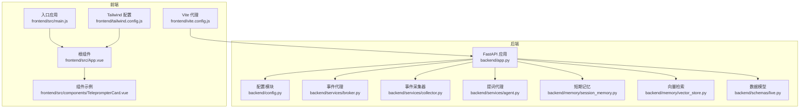
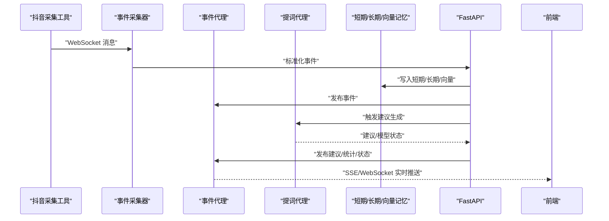
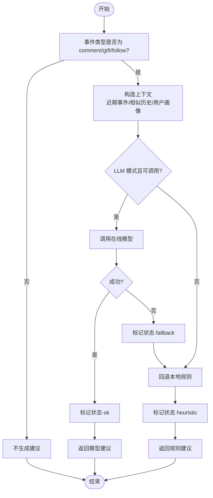
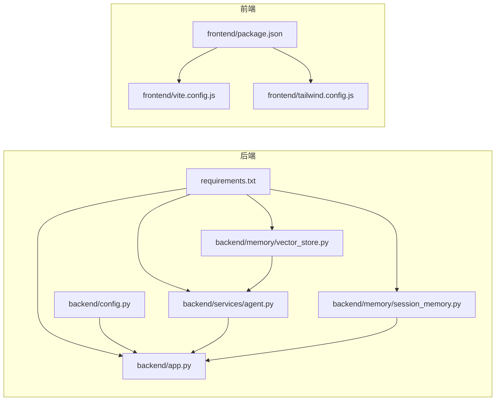

# 代码规范

<cite>
**本文引用的文件**
- [README.md](file://README.md)
- [USAGE.md](file://USAGE.md)
- [requirements.txt](file://requirements.txt)
- [backend/app.py](file://backend/app.py)
- [backend/config.py](file://backend/config.py)
- [backend/memory/session_memory.py](file://backend/memory/session_memory.py)
- [backend/memory/vector_store.py](file://backend/memory/vector_store.py)
- [backend/services/agent.py](file://backend/services/agent.py)
- [backend/services/broker.py](file://backend/services/broker.py)
- [backend/schemas/live.py](file://backend/schemas/live.py)
- [frontend/package.json](file://frontend/package.json)
- [frontend/vite.config.js](file://frontend/vite.config.js)
- [frontend/tailwind.config.js](file://frontend/tailwind.config.js)
- [frontend/src/main.js](file://frontend/src/main.js)
- [frontend/src/App.vue](file://frontend/src/App.vue)
- [frontend/src/components/TeleprompterCard.vue](file://frontend/src/components/TeleprompterCard.vue)
</cite>

## 目录
1. [简介](#简介)
2. [项目结构](#项目结构)
3. [核心组件](#核心组件)
4. [架构总览](#架构总览)
5. [详细组件分析](#详细组件分析)
6. [依赖关系分析](#依赖关系分析)
7. [性能考虑](#性能考虑)
8. [故障排查指南](#故障排查指南)
9. [结论](#结论)
10. [附录](#附录)

## 简介
本文件旨在为本项目建立统一、可执行的代码规范，覆盖后端 Python 与前端 JavaScript/Vue.js 的编码风格、命名约定、模块导入、错误处理、日志记录、注释规范、文件组织、性能优化与可维护性提升等方面。规范以现有代码为依据，结合最佳实践，提供“正确”与“错误”的对比指引，帮助团队保持一致性。

## 项目结构
项目采用前后端分离架构：
- 后端：FastAPI 应用，负责事件采集、短期/长期记忆、向量检索、建议生成与实时推送（SSE/WebSocket）。
- 前端：Vue 3 + Pinia + Tailwind，负责状态管理、UI 展示与实时连接。
- 配置：后端通过环境变量与 .env 解析运行参数；前端通过 Vite 代理对接后端。

图表来源
- [backend/app.py:1-220](file://backend/app.py#L1-L220)
- [backend/config.py:1-94](file://backend/config.py#L1-L94)
- [backend/services/broker.py:1-40](file://backend/services/broker.py#L1-L40)
- [backend/services/agent.py:1-393](file://backend/services/agent.py#L1-L393)
- [backend/memory/session_memory.py:1-113](file://backend/memory/session_memory.py#L1-L113)
- [backend/memory/vector_store.py:1-108](file://backend/memory/vector_store.py#L1-L108)
- [backend/schemas/live.py:1-95](file://backend/schemas/live.py#L1-L95)
- [frontend/vite.config.js:1-23](file://frontend/vite.config.js#L1-L23)
- [frontend/tailwind.config.js:1-23](file://frontend/tailwind.config.js#L1-L23)
- [frontend/src/main.js:1-17](file://frontend/src/main.js#L1-L17)
- [frontend/src/App.vue:1-66](file://frontend/src/App.vue#L1-L66)
- [frontend/src/components/TeleprompterCard.vue:1-83](file://frontend/src/components/TeleprompterCard.vue#L1-L83)

章节来源
- [README.md:21-349](file://README.md#L21-L349)
- [USAGE.md:1-256](file://USAGE.md#L1-L256)

## 核心组件
- 后端应用与路由：集中于入口文件，统一注册中间件、生命周期钩子与路由。
- 配置模块：集中解析环境变量与 .env，提供默认值与目录确保。
- 事件代理：进程内异步广播，供 SSE/WebSocket 分发。
- 记忆与检索：短期内存（可选 Redis）、长期存储（SQLite）、向量检索（可选 Chroma）。
- 建议生成：优先在线模型，失败回退本地规则。
- 前端应用：Vue 3 Composition API、Pinia 状态管理、Tailwind 样式组织。

章节来源
- [backend/app.py:1-220](file://backend/app.py#L1-L220)
- [backend/config.py:1-94](file://backend/config.py#L1-L94)
- [backend/services/broker.py:1-40](file://backend/services/broker.py#L1-L40)
- [backend/memory/session_memory.py:1-113](file://backend/memory/session_memory.py#L1-L113)
- [backend/memory/vector_store.py:1-108](file://backend/memory/vector_store.py#L1-L108)
- [backend/services/agent.py:1-393](file://backend/services/agent.py#L1-L393)
- [backend/schemas/live.py:1-95](file://backend/schemas/live.py#L1-L95)
- [frontend/src/main.js:1-17](file://frontend/src/main.js#L1-L17)
- [frontend/src/App.vue:1-66](file://frontend/src/App.vue#L1-L66)
- [frontend/src/components/TeleprompterCard.vue:1-83](file://frontend/src/components/TeleprompterCard.vue#L1-L83)

## 架构总览
后端通过 FastAPI 提供 REST/SSE/WebSocket 接口，事件经短期记忆与长期存储落盘，同时构建向量索引辅助检索。建议生成器优先调用在线模型，失败回退本地规则，并将结果通过事件代理广播至前端。

图表来源
- [backend/app.py:61-78](file://backend/app.py#L61-L78)
- [backend/services/broker.py:28-39](file://backend/services/broker.py#L28-L39)
- [backend/services/agent.py:73-114](file://backend/services/agent.py#L73-L114)
- [backend/memory/session_memory.py:42-64](file://backend/memory/session_memory.py#L42-L64)
- [backend/memory/vector_store.py:64-83](file://backend/memory/vector_store.py#L64-L83)

## 详细组件分析

### 后端：FastAPI 应用与路由
- 命名与职责
  - 路由函数采用小写下划线风格，如 health、bootstrap、stream_events。
  - 请求体/响应体使用 Pydantic 模型，避免裸字典。
- 错误处理
  - 显式校验输入并返回 HTTP 异常，便于前端统一处理。
  - SSE/WebSocket 连接断开时清理订阅队列。
- 日志
  - 全局基础日志配置，按模块输出级别与消息。
- 并发与生命周期
  - 使用 lifespan 管理采集器启停与资源释放。

章节来源
- [backend/app.py:104-133](file://backend/app.py#L104-L133)
- [backend/app.py:187-206](file://backend/app.py#L187-L206)
- [backend/app.py:209-220](file://backend/app.py#L209-L220)
- [backend/app.py:84-92](file://backend/app.py#L84-L92)
- [backend/app.py:22-23](file://backend/app.py#L22-L23)

### 后端：配置模块
- 环境变量优先级
  - 优先读取 .env，其次读取当前 shell 环境变量。
- 默认值与目录确保
  - 所有关键路径与数值均提供默认值，并在启动时创建必要目录。
- 模型地址与模型名解析
  - 根据模式自动解析最终调用地址与模型名，减少配置歧义。

章节来源
- [backend/config.py:11-36](file://backend/config.py#L11-L36)
- [backend/config.py:63-69](file://backend/config.py#L63-L69)
- [backend/config.py:70-91](file://backend/config.py#L70-L91)

### 后端：事件代理（EventBroker）
- 设计要点
  - 使用 asyncio.Queue 维护订阅队列，广播时忽略阻塞队列并清理过期队列。
- 并发安全
  - 发布时捕获队列满的情况，延迟剔除，避免阻塞主循环。

章节来源
- [backend/services/broker.py:10-40](file://backend/services/broker.py#L10-L40)

### 后端：短期记忆（SessionMemory）
- 降级策略
  - 无 Redis 时自动退化为进程内双端队列，保证基本可用。
- TTL 控制
  - Redis 模式下设置过期时间，控制热数据生命周期。
- 读写窗口
  - 事件与建议列表长度限制，避免无限增长。

章节来源
- [backend/memory/session_memory.py:17-113](file://backend/memory/session_memory.py#L17-L113)

### 后端：向量检索（VectorMemory）
- 可选依赖
  - 未安装 Chroma 时，使用轻量哈希嵌入与本地近似检索，保证检索能力。
- 文档与元数据
  - 事件内容与用户昵称组合为文档，携带房间与事件类型元数据。

章节来源
- [backend/memory/vector_store.py:52-108](file://backend/memory/vector_store.py#L52-L108)

### 后端：提词代理（LivePromptAgent）
- 生成策略
  - 优先在线 OpenAI 兼容接口，失败回退本地规则；回退状态写入模型状态。
- 上下文构造
  - 包含近期事件、相似历史与用户画像，便于生成一致建议。
- 错误处理
  - 对网络、HTTP、JSON、超时等异常进行分类记录与状态标记。
- 输出规范化
  - 统一字段与类型，保证前端消费稳定性。

图表来源
- [backend/services/agent.py:73-114](file://backend/services/agent.py#L73-L114)
- [backend/services/agent.py:183-329](file://backend/services/agent.py#L183-L329)

章节来源
- [backend/services/agent.py:23-43](file://backend/services/agent.py#L23-L43)
- [backend/services/agent.py:56-72](file://backend/services/agent.py#L56-L72)
- [backend/services/agent.py:96-114](file://backend/services/agent.py#L96-L114)
- [backend/services/agent.py:115-182](file://backend/services/agent.py#L115-L182)
- [backend/services/agent.py:222-285](file://backend/services/agent.py#L222-L285)
- [backend/services/agent.py:331-352](file://backend/services/agent.py#L331-L352)
- [backend/services/agent.py:353-393](file://backend/services/agent.py#L353-L393)

### 后端：数据模型（Pydantic）
- 字段约束
  - 使用 Field/default_factory 管理默认值与可空字段。
- 类型安全
  - 前端消费的模型字段严格定义，避免运行期类型错误。

章节来源
- [backend/schemas/live.py:8-27](file://backend/schemas/live.py#L8-L27)
- [backend/schemas/live.py:29-44](file://backend/schemas/live.py#L29-L44)
- [backend/schemas/live.py:47-62](file://backend/schemas/live.py#L47-L62)
- [backend/schemas/live.py:64-74](file://backend/schemas/live.py#L64-L74)
- [backend/schemas/live.py:76-84](file://backend/schemas/live.py#L76-L84)
- [backend/schemas/live.py:87-95](file://backend/schemas/live.py#L87-L95)

### 前端：入口与应用
- 入口职责
  - 创建 Vue 应用、注册 Pinia、挂载根组件。
- 根组件职责
  - 初始化引导与连接，传递状态与事件到子组件。

章节来源
- [frontend/src/main.js:1-17](file://frontend/src/main.js#L1-L17)
- [frontend/src/App.vue:1-66](file://frontend/src/App.vue#L1-L66)

### 前端：组件（TeleprompterCard）
- Props 规范
  - 明确类型与默认值，便于 TS 推断与运行期校验。
- 条件渲染
  - 根据建议是否存在进行分支渲染，避免空值渲染。
- 标签与文案
  - 来源标签与优先级、语气等通过计算映射，保持 UI 一致性。

章节来源
- [frontend/src/components/TeleprompterCard.vue:1-83](file://frontend/src/components/TeleprompterCard.vue#L1-L83)

### 前端：构建与样式
- Vite 代理
  - 将 /api 与 /ws 代理到后端 8010 端口，统一前端请求路径。
- Tailwind 配置
  - 自定义颜色变量与字体族，配合 CSS 变量实现主题切换。

章节来源
- [frontend/vite.config.js:1-23](file://frontend/vite.config.js#L1-L23)
- [frontend/tailwind.config.js:1-23](file://frontend/tailwind.config.js#L1-L23)

## 依赖关系分析
- 后端依赖
  - FastAPI、Uvicorn、websocket-client、redis、chromadb 等。
- 前端依赖
  - Vue 3、Pinia、Vite、TailwindCSS、PostCSS 等。

图表来源
- [requirements.txt:1-6](file://requirements.txt#L1-L6)
- [backend/app.py:1-220](file://backend/app.py#L1-L220)
- [backend/config.py:1-94](file://backend/config.py#L1-94)
- [backend/services/agent.py:1-393](file://backend/services/agent.py#L1-L393)
- [backend/memory/session_memory.py:1-113](file://backend/memory/session_memory.py#L1-L113)
- [backend/memory/vector_store.py:1-108](file://backend/memory/vector_store.py#L1-L108)
- [frontend/package.json:1-23](file://frontend/package.json#L1-L23)
- [frontend/vite.config.js:1-23](file://frontend/vite.config.js#L1-L23)
- [frontend/tailwind.config.js:1-23](file://frontend/tailwind.config.js#L1-L23)

章节来源
- [requirements.txt:1-6](file://requirements.txt#L1-L6)
- [frontend/package.json:1-23](file://frontend/package.json#L1-L23)

## 性能考虑
- 后端
  - SSE/WS 广播：使用异步队列，避免阻塞；及时清理阻塞队列。
  - Redis/Chroma：在可用时启用，降低 CPU 与 IO 压力；不可用时自动降级。
  - 事件窗口：短期记忆与向量索引限制大小，防止内存膨胀。
- 前端
  - 组件按需渲染与条件分支，减少无效 DOM 更新。
  - Tailwind 自定义变量与主题切换，避免重复样式计算。

章节来源
- [backend/services/broker.py:31-39](file://backend/services/broker.py#L31-L39)
- [backend/memory/session_memory.py:24-31](file://backend/memory/session_memory.py#L24-L31)
- [backend/memory/vector_store.py:60-63](file://backend/memory/vector_store.py#L60-L63)
- [frontend/src/components/TeleprompterCard.vue:43-81](file://frontend/src/components/TeleprompterCard.vue#L43-L81)

## 故障排查指南
- 后端
  - 健康检查：确认服务状态与当前房间号。
  - 模型状态：查看 last_result 与 last_error，定位失败原因。
  - 日志：关注 LLM 相关错误分类（HTTP、网络、超时、JSON、OS 等）。
- 前端
  - 代理配置：确认 /api 与 /ws 代理到 127.0.0.1:8010。
  - 主题与样式：检查 Tailwind 颜色变量与字体配置。

章节来源
- [backend/app.py:104-107](file://backend/app.py#L104-L107)
- [backend/services/agent.py:39-54](file://backend/services/agent.py#L39-L54)
- [backend/services/agent.py:222-285](file://backend/services/agent.py#L222-L285)
- [frontend/vite.config.js:10-22](file://frontend/vite.config.js#L10-L22)
- [frontend/tailwind.config.js:6-18](file://frontend/tailwind.config.js#L6-L18)

## 结论
本规范以现有代码为蓝本，明确了后端与前端的命名、导入、错误处理、日志与性能优化等关键实践。建议在后续迭代中持续遵循，逐步引入静态检查与自动化测试，进一步提升质量与可维护性。

## 附录

### Python 后端编码规范（PEP8 及扩展）
- 命名约定
  - 模块与包：小写下划线（如 backend/app.py）。
  - 类名：大驼峰（如 LivePromptAgent）。
  - 函数与方法：小写下划线（如 process_event、snapshot_with_status）。
  - 常量：全大写（如 APP_PORT）。
- 导入顺序
  - 标准库 → 第三方库 → 项目内部模块（按层级分组）。
- 注释与文档字符串
  - 模块与类：使用三引号文档字符串说明用途与默认值。
  - 函数：说明参数、返回值、异常与副作用。
- 异常处理
  - 明确捕获具体异常类型，记录上下文并返回 HTTP 异常。
- 日志记录
  - 使用模块级 logger，输出关键上下文（房间号、事件 ID、模型名）。
- 类设计
  - 单一职责：每个类聚焦一个领域对象或能力。
  - 依赖注入：通过构造函数注入配置与外部依赖。
- 数据模型
  - 使用 Pydantic BaseModel，明确字段类型与默认值，避免裸字典。

章节来源
- [backend/app.py:1-220](file://backend/app.py#L1-L220)
- [backend/config.py:1-94](file://backend/config.py#L1-L94)
- [backend/services/agent.py:1-393](file://backend/services/agent.py#L1-L393)
- [backend/memory/session_memory.py:1-113](file://backend/memory/session_memory.py#L1-L113)
- [backend/memory/vector_store.py:1-108](file://backend/memory/vector_store.py#L1-L108)
- [backend/schemas/live.py:1-95](file://backend/schemas/live.py#L1-L95)

### JavaScript/Vue.js 前端编码规范
- ESLint 与 Prettier
  - 建议引入 ESLint 与 Prettier，统一语法与格式。
- Vue 组件命名
  - 组件文件名：帕斯卡命名（如 TeleprompterCard.vue）。
  - 组件导出：默认导出组件对象。
- Composition API 使用
  - 使用 script setup 语法，props 明确类型与默认值。
- 样式组织
  - 使用 Tailwind 自定义变量与主题切换，避免内联样式。
- TypeScript 类型定义
  - 在需要强类型保障处引入 TS，为 props、状态与 API 返回值提供类型。
- 文件命名
  - 入口：src/main.js；根组件：src/App.vue；组件：src/components/*.vue；样式：src/assets/*.css。
- 模块导入
  - 优先相对路径导入，避免深层相对路径导致维护困难。
- 错误处理
  - 前端统一拦截网络错误与解析异常，提示用户并记录日志。
- 性能优化
  - 组件懒加载与条件渲染，减少不必要的重渲染。

章节来源
- [frontend/src/main.js:1-17](file://frontend/src/main.js#L1-L17)
- [frontend/src/App.vue:1-66](file://frontend/src/App.vue#L1-L66)
- [frontend/src/components/TeleprompterCard.vue:1-83](file://frontend/src/components/TeleprompterCard.vue#L1-L83)
- [frontend/vite.config.js:1-23](file://frontend/vite.config.js#L1-L23)
- [frontend/tailwind.config.js:1-23](file://frontend/tailwind.config.js#L1-L23)
- [frontend/package.json:1-23](file://frontend/package.json#L1-L23)

### 错误与正确示例（路径指引）
- 后端：SSE 事件类型过滤
  - 正确：在事件生成器中按房间号过滤后再发送。
  - 错误：直接发送所有事件，未区分房间。
  - 参考路径：[backend/app.py:191-206](file://backend/app.py#L191-L206)
- 后端：HTTP 异常处理
  - 正确：对必填参数缺失抛出 HTTP 异常并返回明确错误信息。
  - 错误：忽略参数校验，导致后续处理失败。
  - 参考路径：[backend/app.py:117-126](file://backend/app.py#L117-L126)，[backend/app.py:137-141](file://backend/app.py#L137-L141)
- 后端：日志记录
  - 正确：在 LLM 失败时记录详细上下文与错误类型。
  - 错误：静默失败或仅打印通用信息。
  - 参考路径：[backend/services/agent.py:232-285](file://backend/services/agent.py#L232-L285)
- 前端：组件 Props
  - 正确：明确类型与默认值，避免运行期类型错误。
  - 错误：使用 any 或不设默认值，导致渲染异常。
  - 参考路径：[frontend/src/components/TeleprompterCard.vue:2-11](file://frontend/src/components/TeleprompterCard.vue#L2-L11)
- 前端：代理配置
  - 正确：统一代理 /api 与 /ws 到后端端口。
  - 错误：硬编码后端地址，跨环境不一致。
  - 参考路径：[frontend/vite.config.js:10-22](file://frontend/vite.config.js#L10-L22)