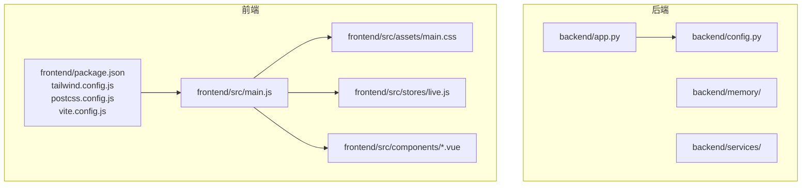
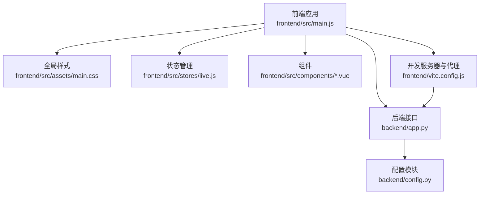
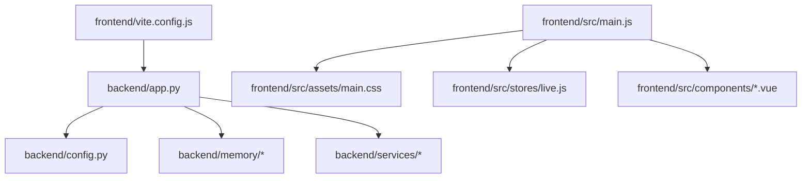

# 文件命名约定

<cite>
**本文档引用的文件**
- [backend/config.py](file://backend/config.py)
- [backend/app.py](file://backend/app.py)
- [frontend/src/main.js](file://frontend/src/main.js)
- [frontend/src/assets/main.css](file://frontend/src/assets/main.css)
- [frontend/src/stores/live.js](file://frontend/src/stores/live.js)
- [frontend/src/components/EventFeed.vue](file://frontend/src/components/EventFeed.vue)
- [frontend/src/components/StatusStrip.vue](file://frontend/src/components/StatusStrip.vue)
- [frontend/src/components/TeleprompterCard.vue](file://frontend/src/components/TeleprompterCard.vue)
- [frontend/package.json](file://frontend/package.json)
- [frontend/tailwind.config.js](file://frontend/tailwind.config.js)
- [frontend/postcss.config.js](file://frontend/postcss.config.js)
- [frontend/vite.config.js](file://frontend/vite.config.js)
- [backend/memory/__init__.py](file://backend/memory/__init__.py)
- [backend/services/__init__.py](file://backend/services/__init__.py)
- [backend/__init__.py](file://backend/__init__.py)
</cite>

## 目录
1. [引言](#引言)
2. [项目结构](#项目结构)
3. [核心组件](#核心组件)
4. [架构总览](#架构总览)
5. [详细组件分析](#详细组件分析)
6. [依赖分析](#依赖分析)
7. [性能考虑](#性能考虑)
8. [故障排除指南](#故障排除指南)
9. [结论](#结论)
10. [附录](#附录)

## 引言
本文件命名约定文档旨在统一并规范项目中的各类文件命名标准，涵盖以下方面：
- Python 文件命名：采用小写加下划线风格，包初始化文件使用 __init__.py。
- 模块导入规范：在本仓库中，后端使用显式绝对导入；前端 JavaScript/Vue 使用 ES Module 的相对路径导入。
- 配置文件命名：后端使用 config.py；前端使用 package.json、tailwind.config.js、postcss.config.js、vite.config.js 等。
- 测试文件命名：未在仓库中发现测试文件，建议遵循 test_*.py 或 *_test.py 的通用约定。
- 静态资源文件命名：CSS 文件采用语义化命名，如 main.css；图片等资源采用描述性名称。
- Vue 组件文件命名：采用 PascalCase，如 EventFeed.vue。
- JavaScript 模块文件命名：采用小写加下划线，如 live.js。
- CSS 文件组织原则：使用 Tailwind CSS 工具类，按主题与组件划分，避免重复定义。

本规范以仓库现有文件为依据，并结合前端构建配置与后端模块组织给出具体示例与反例，帮助团队保持一致的文件结构与命名风格。

## 项目结构
项目采用前后端分离结构：
- 后端（Python）：位于 backend/，包含应用入口、配置、内存与服务模块。
- 前端（Vue + Vite）：位于 frontend/，包含源码、构建配置与静态资源。
- 数据与日志：data/、logs/ 等目录用于存放数据库与日志文件。
- 工具与废弃文件：tool/、deprecated/ 用于存放辅助脚本与历史文件。

图表来源
- [backend/app.py:1-220](file://backend/app.py#L1-L220)
- [backend/config.py:1-94](file://backend/config.py#L1-L94)
- [frontend/src/main.js:1-17](file://frontend/src/main.js#L1-L17)
- [frontend/src/assets/main.css:1-144](file://frontend/src/assets/main.css#L1-L144)
- [frontend/src/stores/live.js:1-310](file://frontend/src/stores/live.js#L1-L310)
- [frontend/package.json:1-23](file://frontend/package.json#L1-L23)
- [frontend/tailwind.config.js:1-23](file://frontend/tailwind.config.js#L1-L23)
- [frontend/postcss.config.js:1-9](file://frontend/postcss.config.js#L1-L9)
- [frontend/vite.config.js:1-23](file://frontend/vite.config.js#L1-L23)

章节来源
- [backend/app.py:1-220](file://backend/app.py#L1-L220)
- [backend/config.py:1-94](file://backend/config.py#L1-L94)
- [frontend/src/main.js:1-17](file://frontend/src/main.js#L1-L17)
- [frontend/src/assets/main.css:1-144](file://frontend/src/assets/main.css#L1-L144)
- [frontend/src/stores/live.js:1-310](file://frontend/src/stores/live.js#L1-L310)
- [frontend/package.json:1-23](file://frontend/package.json#L1-L23)
- [frontend/tailwind.config.js:1-23](file://frontend/tailwind.config.js#L1-L23)
- [frontend/postcss.config.js:1-9](file://frontend/postcss.config.js#L1-L9)
- [frontend/vite.config.js:1-23](file://frontend/vite.config.js#L1-L23)

## 核心组件
- 后端应用入口与路由：backend/app.py 定义了 FastAPI 应用、中间件与接口路由。
- 后端配置模块：backend/config.py 提供 Settings 类与环境变量加载逻辑。
- 前端入口与主题：frontend/src/main.js 创建 Vue 应用并引入全局样式 main.css。
- 前端状态管理：frontend/src/stores/live.js 使用 Pinia 定义状态与方法。
- 前端组件：EventFeed.vue、StatusStrip.vue、TeleprompterCard.vue 采用 PascalCase 命名。
- 构建与工具：package.json、tailwind.config.js、postcss.config.js、vite.config.js。

章节来源
- [backend/app.py:1-220](file://backend/app.py#L1-L220)
- [backend/config.py:1-94](file://backend/config.py#L1-L94)
- [frontend/src/main.js:1-17](file://frontend/src/main.js#L1-L17)
- [frontend/src/assets/main.css:1-144](file://frontend/src/assets/main.css#L1-L144)
- [frontend/src/stores/live.js:1-310](file://frontend/src/stores/live.js#L1-L310)
- [frontend/src/components/EventFeed.vue:1-183](file://frontend/src/components/EventFeed.vue#L1-L183)
- [frontend/src/components/StatusStrip.vue:1-144](file://frontend/src/components/StatusStrip.vue#L1-L144)
- [frontend/src/components/TeleprompterCard.vue:1-83](file://frontend/src/components/TeleprompterCard.vue#L1-L83)
- [frontend/package.json:1-23](file://frontend/package.json#L1-L23)
- [frontend/tailwind.config.js:1-23](file://frontend/tailwind.config.js#L1-L23)
- [frontend/postcss.config.js:1-9](file://frontend/postcss.config.js#L1-L9)
- [frontend/vite.config.js:1-23](file://frontend/vite.config.js#L1-L23)

## 架构总览
后端通过 FastAPI 提供 REST 与 SSE 接口，前端通过 Vite 开发服务器代理到后端。前端入口文件引入全局样式与组件，状态通过 Pinia 管理。

图表来源
- [frontend/src/main.js:1-17](file://frontend/src/main.js#L1-L17)
- [frontend/src/assets/main.css:1-144](file://frontend/src/assets/main.css#L1-L144)
- [frontend/src/stores/live.js:1-310](file://frontend/src/stores/live.js#L1-L310)
- [frontend/src/components/EventFeed.vue:1-183](file://frontend/src/components/EventFeed.vue#L1-L183)
- [frontend/src/components/StatusStrip.vue:1-144](file://frontend/src/components/StatusStrip.vue#L1-L144)
- [frontend/src/components/TeleprompterCard.vue:1-83](file://frontend/src/components/TeleprompterCard.vue#L1-L83)
- [frontend/vite.config.js:1-23](file://frontend/vite.config.js#L1-L23)
- [backend/app.py:1-220](file://backend/app.py#L1-L220)
- [backend/config.py:1-94](file://backend/config.py#L1-L94)

## 详细组件分析

### Python 文件命名与包组织
- 文件命名：采用小写加下划线，如 config.py、app.py、long_term.py、session_memory.py、vector_store.py、agent.py、broker.py、collector.py。
- 包初始化：每个子包包含 __init__.py，用于标识包与导出公共接口。
- 导入规范：后端使用显式绝对导入，例如 from backend.config import settings，从包内相对路径导入模块。

命名示例
- ✅ 正例：backend/config.py、backend/app.py、backend/memory/long_term.py
- ❌ 反例：BackendConfig.py、App.py、LongTerm.py

章节来源
- [backend/config.py:1-94](file://backend/config.py#L1-L94)
- [backend/app.py:1-220](file://backend/app.py#L1-L220)
- [backend/memory/__init__.py:1-2](file://backend/memory/__init__.py#L1-L2)
- [backend/services/__init__.py:1-2](file://backend/services/__init__.py#L1-L2)
- [backend/__init__.py:1-2](file://backend/__init__.py#L1-L2)

### 配置文件命名
- 后端配置：backend/config.py 提供 Settings 类与环境变量加载。
- 前端配置：
  - package.json：定义包信息与脚本，type 为 module。
  - tailwind.config.js：Tailwind CSS 配置，扩展颜色与字体。
  - postcss.config.js：PostCSS 插件链，先 Tailwind 再 Autoprefixer。
  - vite.config.js：Vite 开发服务器与代理配置，将 /api 与 /ws 代理至后端。

命名示例
- ✅ 正例：backend/config.py、frontend/package.json、frontend/tailwind.config.js、frontend/postcss.config.js、frontend/vite.config.js
- ❌ 反例：backend/settings.py、frontend/vite.js、frontend/tailwind.js

章节来源
- [backend/config.py:1-94](file://backend/config.py#L1-L94)
- [frontend/package.json:1-23](file://frontend/package.json#L1-L23)
- [frontend/tailwind.config.js:1-23](file://frontend/tailwind.config.js#L1-L23)
- [frontend/postcss.config.js:1-9](file://frontend/postcss.config.js#L1-L9)
- [frontend/vite.config.js:1-23](file://frontend/vite.config.js#L1-L23)

### 测试文件命名
- 现状：仓库未包含测试文件。
- 建议：遵循 test_*.py 或 *_test.py 的通用约定，例如 test_app.py、test_config.py、test_live.js（前端）。

命名示例
- ✅ 正例：test_app.py、test_config.py、test_live.js
- ❌ 反例：TestApp.py、config_test.py、live.test.js

[本节为通用建议，不直接分析具体文件，故无章节来源]

### 静态资源文件命名
- CSS 文件：frontend/src/assets/main.css 采用语义化命名，使用 Tailwind 工具类组织样式。
- 图片与媒体：建议采用描述性名称，如 icon.png、avatar.jpg，便于识别与维护。
- 组织原则：按功能或页面划分目录，避免全局样式污染；使用 CSS 变量与主题开关控制明暗模式。

命名示例
- ✅ 正例：frontend/src/assets/main.css、icon.png、avatar.jpg
- ❌ 反例：frontend/src/assets/style.css、frontend/src/assets/images/icon.png

章节来源
- [frontend/src/assets/main.css:1-144](file://frontend/src/assets/main.css#L1-L144)

### Vue 组件文件命名
- 命名：采用 PascalCase，如 EventFeed.vue、StatusStrip.vue、TeleprompterCard.vue。
- 单文件组件：.vue 文件包含模板、脚本与样式，组件名与文件名一致。

命名示例
- ✅ 正例：EventFeed.vue、StatusStrip.vue、TeleprompterCard.vue
- ❌ 反例：event-feed.vue、status-strip.vue、teleprompter-card.vue

章节来源
- [frontend/src/components/EventFeed.vue:1-183](file://frontend/src/components/EventFeed.vue#L1-L183)
- [frontend/src/components/StatusStrip.vue:1-144](file://frontend/src/components/StatusStrip.vue#L1-L144)
- [frontend/src/components/TeleprompterCard.vue:1-83](file://frontend/src/components/TeleprompterCard.vue#L1-L83)

### JavaScript 模块文件命名
- 命名：采用小写加下划线，如 live.js。
- 导入方式：ES Module，前端入口通过相对路径导入组件与样式。

命名示例
- ✅ 正例：frontend/src/stores/live.js
- ❌ 反例：frontend/src/stores/Live.js、frontend/src/stores/liveStore.js

章节来源
- [frontend/src/stores/live.js:1-310](file://frontend/src/stores/live.js#L1-L310)
- [frontend/src/main.js:1-17](file://frontend/src/main.js#L1-L17)

### CSS 文件组织原则
- 使用 Tailwind CSS 工具类，减少自定义 CSS 数量。
- 通过 CSS 变量与 data-theme 控制主题，避免重复定义颜色与阴影。
- 将组件样式与全局样式分离，避免样式冲突。

命名示例
- ✅ 正例：frontend/src/assets/main.css
- ❌ 反例：frontend/src/styles/global.css、frontend/src/css/theme.css

章节来源
- [frontend/src/assets/main.css:1-144](file://frontend/src/assets/main.css#L1-L144)
- [frontend/tailwind.config.js:1-23](file://frontend/tailwind.config.js#L1-L23)

### 模块导入规范
- 后端：使用显式绝对导入，如 from backend.config import settings，从包内相对路径导入模块。
- 前端：使用 ES Module 的相对路径导入，如 import App from "./App.vue"、import "./assets/main.css"。

命名示例
- ✅ 正例：from backend.config import settings、import App from "./App.vue"
- ❌ 反例：from ..config import settings、import App from "../App.vue"

章节来源
- [backend/app.py:1-220](file://backend/app.py#L1-L220)
- [frontend/src/main.js:1-17](file://frontend/src/main.js#L1-L17)

## 依赖分析
后端应用入口依赖配置模块与各服务模块；前端入口依赖组件与全局样式；构建配置负责开发服务器与代理。

图表来源
- [backend/app.py:1-220](file://backend/app.py#L1-L220)
- [backend/config.py:1-94](file://backend/config.py#L1-L94)
- [frontend/src/main.js:1-17](file://frontend/src/main.js#L1-L17)
- [frontend/src/assets/main.css:1-144](file://frontend/src/assets/main.css#L1-L144)
- [frontend/src/stores/live.js:1-310](file://frontend/src/stores/live.js#L1-L310)
- [frontend/vite.config.js:1-23](file://frontend/vite.config.js#L1-L23)

章节来源
- [backend/app.py:1-220](file://backend/app.py#L1-L220)
- [backend/config.py:1-94](file://backend/config.py#L1-L94)
- [frontend/src/main.js:1-17](file://frontend/src/main.js#L1-L17)
- [frontend/src/assets/main.css:1-144](file://frontend/src/assets/main.css#L1-L144)
- [frontend/src/stores/live.js:1-310](file://frontend/src/stores/live.js#L1-L310)
- [frontend/vite.config.js:1-23](file://frontend/vite.config.js#L1-L23)

## 性能考虑
- 前端构建：Vite 提供快速冷启动与热更新；代理配置减少跨域与网络往返。
- 样式组织：Tailwind 工具类减少 CSS 体积，避免重复定义；主题切换通过 CSS 变量实现，降低重绘成本。
- 后端接口：SSE 与 WebSocket 用于实时推送，注意连接池与队列大小，避免内存泄漏。

[本节为通用指导，不直接分析具体文件，故无章节来源]

## 故障排除指南
- 环境变量未生效：检查 backend/config.py 中的环境变量加载逻辑与 .env 文件是否存在。
- 前端样式异常：确认 frontend/src/main.js 是否正确引入 frontend/src/assets/main.css。
- 构建代理问题：检查 frontend/vite.config.js 的代理配置是否指向正确的后端地址与端口。
- 组件导入错误：确认 Vue 组件文件名采用 PascalCase，且导入路径使用相对路径。

章节来源
- [backend/config.py:1-94](file://backend/config.py#L1-L94)
- [frontend/src/main.js:1-17](file://frontend/src/main.js#L1-L17)
- [frontend/vite.config.js:1-23](file://frontend/vite.config.js#L1-L23)

## 结论
本文件命名约定基于仓库现有结构制定，明确了 Python 文件、配置文件、静态资源、Vue 组件与 JavaScript 模块的命名与组织原则。建议团队在新增文件时严格遵循本规范，以提升项目的一致性与可维护性。对于尚未覆盖的测试文件命名，建议参考通用约定并在团队内达成共识。

[本节为总结性内容，不直接分析具体文件，故无章节来源]

## 附录
- 命名清单
  - Python 文件：小写加下划线，包初始化文件使用 __init__.py。
  - 配置文件：backend/config.py、frontend/package.json、tailwind.config.js、postcss.config.js、vite.config.js。
  - 测试文件：建议 test_*.py 或 *_test.py。
  - 静态资源：语义化命名，如 main.css、icon.png。
  - Vue 组件：PascalCase，如 EventFeed.vue。
  - JavaScript 模块：小写加下划线，如 live.js。
  - 导入规范：后端使用显式绝对导入；前端使用 ES Module 相对路径导入。

[本节为汇总性内容，不直接分析具体文件，故无章节来源]