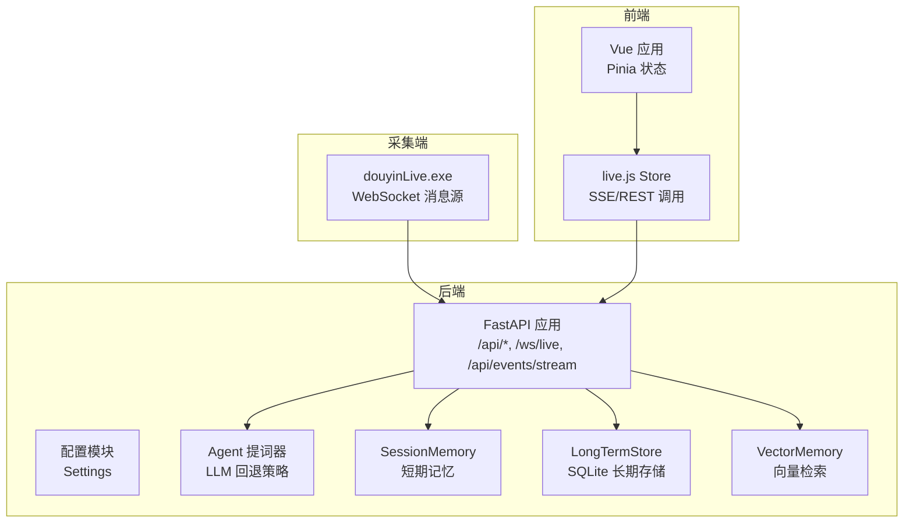
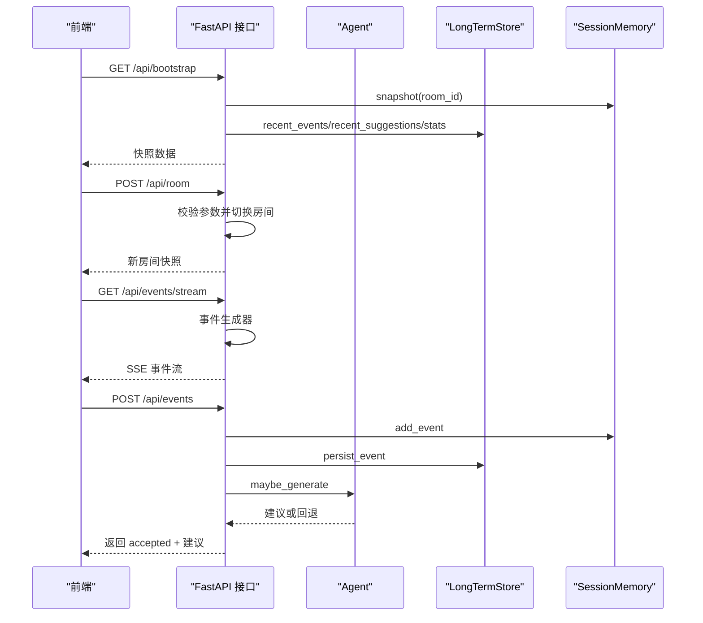
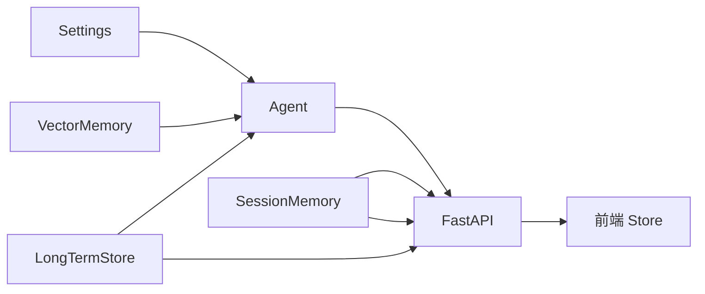

# 错误处理模式

<cite>
**本文引用的文件**
- [backend/app.py](file://backend/app.py)
- [backend/config.py](file://backend/config.py)
- [backend/services/agent.py](file://backend/services/agent.py)
- [backend/memory/session_memory.py](file://backend/memory/session_memory.py)
- [backend/memory/long_term.py](file://backend/memory/long_term.py)
- [backend/memory/vector_store.py](file://backend/memory/vector_store.py)
- [backend/schemas/live.py](file://backend/schemas/live.py)
- [frontend/src/main.js](file://frontend/src/main.js)
- [frontend/src/stores/live.js](file://frontend/src/stores/live.js)
- [frontend/src/App.vue](file://frontend/src/App.vue)
- [README.md](file://README.md)
</cite>

## 目录
1. [简介](#简介)
2. [项目结构](#项目结构)
3. [核心组件](#核心组件)
4. [架构总览](#架构总览)
5. [详细组件分析](#详细组件分析)
6. [依赖分析](#依赖分析)
7. [性能考虑](#性能考虑)
8. [故障排查指南](#故障排查指南)
9. [结论](#结论)

## 简介
本文件旨在建立项目统一的错误处理模式规范，覆盖后端 HTTP 异常、WebSocket 错误、前端错误处理、日志记录与异常追踪等关键环节。文档同时给出异步函数中的错误传播、Promise 链中的错误处理、组件中的错误边界设计建议，并提供可落地的实现参考路径，确保错误处理的一致性与用户体验的稳定性。

## 项目结构
该项目采用“采集端(douyinLive) -> 后端(FastAPI) -> 前端(Vue)”的三层架构。后端提供 REST、SSE、WebSocket 接口；前端通过 SSE/REST 与后端交互；数据层包含短期记忆、长期存储、向量检索与模型推理。

图表来源
- [backend/app.py:104-220](file://backend/app.py#L104-L220)
- [backend/config.py:39-94](file://backend/config.py#L39-L94)
- [backend/services/agent.py:23-393](file://backend/services/agent.py#L23-L393)
- [backend/memory/session_memory.py:17-113](file://backend/memory/session_memory.py#L17-L113)
- [backend/memory/long_term.py:36-750](file://backend/memory/long_term.py#L36-L750)
- [backend/memory/vector_store.py:52-108](file://backend/memory/vector_store.py#L52-L108)
- [frontend/src/stores/live.js:158-250](file://frontend/src/stores/live.js#L158-L250)

章节来源
- [README.md:35-48](file://README.md#L35-L48)
- [backend/app.py:94-220](file://backend/app.py#L94-L220)

## 核心组件
- 后端应用与路由：提供健康检查、房间切换、事件注入、SSE/WS 实时流等接口，统一使用 HTTPException 抛出业务错误。
- 提词器 Agent：优先调用在线 LLM，失败时回退至启发式规则，并记录模型状态与错误信息。
- 记忆与存储：短期记忆支持 Redis/内存退化；长期存储基于 SQLite；向量检索支持 Chroma/本地哈希退化。
- 前端 Store：封装 SSE/REST 调用，统一处理响应状态、错误提示与回退逻辑。

章节来源
- [backend/app.py:104-220](file://backend/app.py#L104-L220)
- [backend/services/agent.py:23-114](file://backend/services/agent.py#L23-L114)
- [backend/memory/session_memory.py:17-113](file://backend/memory/session_memory.py#L17-L113)
- [backend/memory/long_term.py:36-750](file://backend/memory/long_term.py#L36-L750)
- [backend/memory/vector_store.py:52-108](file://backend/memory/vector_store.py#L52-L108)
- [frontend/src/stores/live.js:158-250](file://frontend/src/stores/live.js#L158-L250)

## 架构总览
后端通过 FastAPI 提供 REST/SSE/WS 接口，前端通过 EventSource/REST 与后端交互。Agent 在生成建议时进行 LLM 调用与回退处理，所有错误均通过日志记录与状态上报，前端据此展示错误提示与重连策略。

图表来源
- [backend/app.py:109-133](file://backend/app.py#L109-L133)
- [backend/app.py:187-206](file://backend/app.py#L187-L206)
- [backend/services/agent.py:73-114](file://backend/services/agent.py#L73-L114)
- [backend/memory/session_memory.py:42-64](file://backend/memory/session_memory.py#L42-L64)
- [backend/memory/long_term.py:420-454](file://backend/memory/long_term.py#L420-L454)

## 详细组件分析

### 后端 HTTP 异常处理（HTTPException）
- 参数校验与业务错误：在房间切换、事件注入、查看者笔记等接口中，对必填参数进行校验，未满足条件时抛出 HTTPException 并指定状态码与错误详情。
- 状态码选择建议：
  - 400 Bad Request：缺少必要参数或参数非法
  - 404 Not Found：资源不存在（如查看者、笔记）
  - 500 Internal Server Error：未覆盖的异常（由框架统一处理）
- 错误响应格式：detail 字段承载人类可读的错误描述，便于前端统一消费。

章节来源
- [backend/app.py:115-126](file://backend/app.py#L115-L126)
- [backend/app.py:129-133](file://backend/app.py#L129-L133)
- [backend/app.py:135-141](file://backend/app.py#L135-L141)
- [backend/app.py:144-150](file://backend/app.py#L144-L150)
- [backend/app.py:153-164](file://backend/app.py#L153-L164)
- [backend/app.py:167-171](file://backend/app.py#L167-L171)

### WebSocket 错误处理（WebSocketDisconnect）
- WS 连接中使用 try/catch 捕获 WebSocketDisconnect，确保断开时正确清理订阅队列，避免资源泄漏。
- 断开后前端应触发重连策略，保持实时流的连续性。

章节来源
- [backend/app.py:209-220](file://backend/app.py#L209-L220)

### 前端错误处理（try-catch、错误提示）
- 房间切换流程：使用 try/catch 包裹 fetch 请求，若响应非 ok，解析 JSON 中的 detail 并设置错误提示；随后回退到 bootstrap 并重新连接，确保界面状态一致。
- SSE 连接状态：onerror 时将连接状态标记为 reconnecting，配合 UI 展示重连提示。
- 本地存储读取：localStorage 解析失败时使用默认值，避免异常中断。

章节来源
- [frontend/src/stores/live.js:207-250](file://frontend/src/stores/live.js#L207-L250)
- [frontend/src/stores/live.js:186-188](file://frontend/src/stores/live.js#L186-L188)
- [frontend/src/stores/live.js:46-51](file://frontend/src/stores/live.js#L46-L51)

### 日志记录与异常追踪（异常堆栈记录）
- 后端 Agent 对 LLM 调用进行多类异常捕获与日志记录，包括 HTTPError、URLError、TimeoutError、JSON 解析错误、OS 错误以及通用异常，并将错误原因写入模型状态 last_error，便于前端展示。
- 建议：统一使用 logger.error 记录异常堆栈摘要，避免在生产环境打印完整堆栈，必要时通过日志系统集中收集。

章节来源
- [backend/services/agent.py:222-285](file://backend/services/agent.py#L222-L285)
- [backend/services/agent.py:287-329](file://backend/services/agent.py#L287-L329)

### 异步函数中的错误传播
- 后端异步处理：FastAPI 视图函数与事件生成器均为异步，错误在协程中传播，HTTPException 由框架捕获并返回标准错误响应。
- 前端异步处理：store 方法使用 async/await，Promise 链中通过 try/catch 捕获错误并回退，确保 UI 状态一致性。

章节来源
- [backend/app.py:61-78](file://backend/app.py#L61-L78)
- [frontend/src/stores/live.js:158-250](file://frontend/src/stores/live.js#L158-L250)

### Promise 链中的错误处理
- 前端 fetch 调用链：在 .then/.catch 中统一处理响应状态与错误，避免未捕获异常导致的 UI 卡死。
- 建议：在 store 中封装统一的 fetch 工具，集中处理非 2xx 响应与 JSON 解析错误。

章节来源
- [frontend/src/stores/live.js:225-249](file://frontend/src/stores/live.js#L225-L249)

### 组件中的错误边界设计
- 前端组件通过 store 管理错误状态（如 roomError），并在模板中展示错误提示，形成“组件级错误边界”。
- 建议：在关键组件外层增加错误边界包装，捕获子组件异常并降级渲染。

章节来源
- [frontend/src/App.vue:10-32](file://frontend/src/App.vue#L10-L32)
- [frontend/src/stores/live.js:75](file://frontend/src/stores/live.js#L75)

### 数据层与可选依赖的错误处理
- Redis/Chroma/SQLite：通过 try/except 导入与使用，未安装依赖时自动退化为本地内存/轻量检索/基础 SQL 能力，保证系统可用性。
- 建议：在配置中显式标注可选依赖，避免因导入失败导致的崩溃。

章节来源
- [backend/memory/session_memory.py:11-14](file://backend/memory/session_memory.py#L11-L14)
- [backend/memory/vector_store.py:13-16](file://backend/memory/vector_store.py#L13-L16)
- [backend/memory/long_term.py:41-44](file://backend/memory/long_term.py#L41-L44)

## 依赖分析
后端各模块之间的耦合关系清晰，Agent 依赖配置与向量/存储模块；App 聚合各服务并通过 FastAPI 暴露接口；前端 Store 依赖 App 的 REST/SSE 接口。

图表来源
- [backend/config.py:39-94](file://backend/config.py#L39-L94)
- [backend/services/agent.py:23-42](file://backend/services/agent.py#L23-L42)
- [backend/memory/vector_store.py:52-63](file://backend/memory/vector_store.py#L52-L63)
- [backend/memory/long_term.py:36-40](file://backend/memory/long_term.py#L36-L40)
- [backend/memory/session_memory.py:17-31](file://backend/memory/session_memory.py#L17-L31)
- [backend/app.py:25-29](file://backend/app.py#L25-L29)

章节来源
- [backend/app.py:25-29](file://backend/app.py#L25-L29)
- [backend/services/agent.py:23-42](file://backend/services/agent.py#L23-L42)

## 性能考虑
- SSE/WS 连接：前端 onerror 时进入重连状态，避免频繁重建连接；后端在 finally 中清理订阅，防止内存泄漏。
- LLM 调用：设置超时时间，失败时快速回退至启发式规则，减少前端等待时间。
- 存储退化：Redis/Chroma 不可用时自动切换到内存/轻量检索，保证核心功能可用。

章节来源
- [backend/app.py:187-206](file://backend/app.py#L187-L206)
- [backend/services/agent.py:222-285](file://backend/services/agent.py#L222-L285)
- [backend/memory/session_memory.py:29-31](file://backend/memory/session_memory.py#L29-L31)
- [backend/memory/vector_store.py:60-63](file://backend/memory/vector_store.py#L60-L63)

## 故障排查指南
- 后端 HTTP 错误：检查请求参数与业务前置条件，确认 detail 是否返回；关注 400/404 场景。
- WebSocket 断开：确认前端是否正确处理 WebSocketDisconnect 并重新订阅；检查后端订阅清理逻辑。
- 前端错误提示：核对 switchRoom 中的错误分支与 fallback 流程；确保 bootstrap 后重新 connect。
- LLM 失败：查看 Agent 日志中的错误分类（HTTP、网络、超时、JSON、OS、异常）；检查配置中的模型地址与密钥。
- 存储退化：确认 Redis/Chroma 依赖是否安装；若未安装，短期/向量能力将退化为内存/轻量方案。

章节来源
- [backend/app.py:115-171](file://backend/app.py#L115-L171)
- [backend/app.py:209-220](file://backend/app.py#L209-L220)
- [frontend/src/stores/live.js:207-250](file://frontend/src/stores/live.js#L207-L250)
- [backend/services/agent.py:222-285](file://backend/services/agent.py#L222-L285)

## 结论
本项目在错误处理方面形成了较为完善的实践：后端统一使用 HTTPException 并结合日志记录；前端通过 try/catch 与错误状态管理实现稳健的用户体验；Agent 在 LLM 调用失败时快速回退并上报状态。建议在现有基础上进一步标准化错误响应结构、完善前端错误边界组件与统一的 fetch 工具，以提升一致性与可维护性。