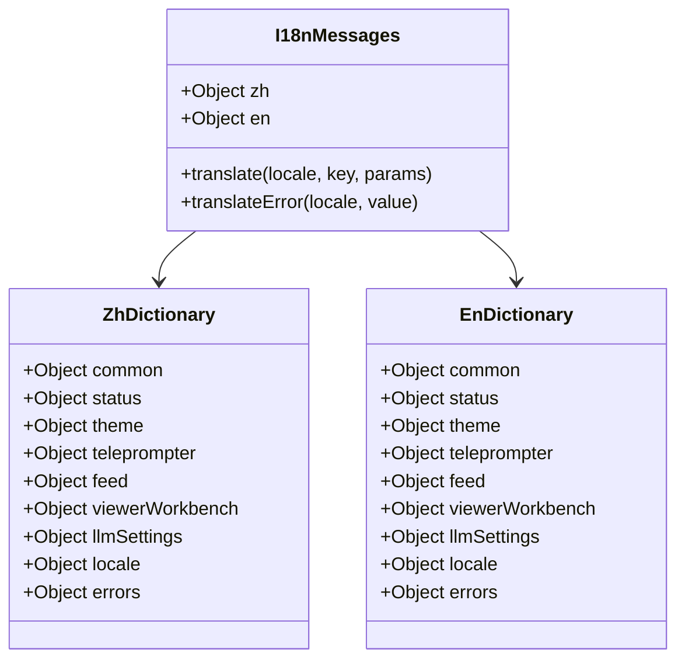
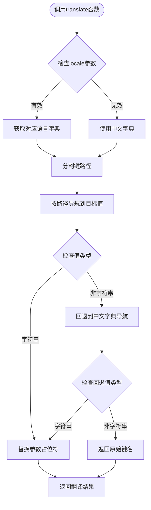
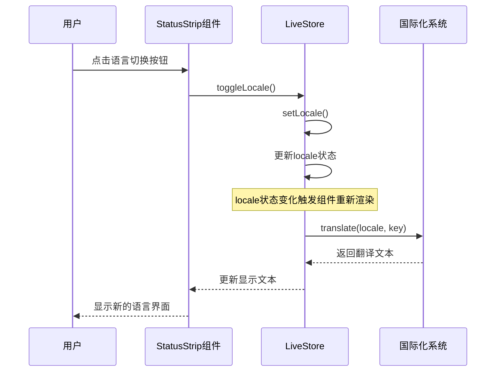
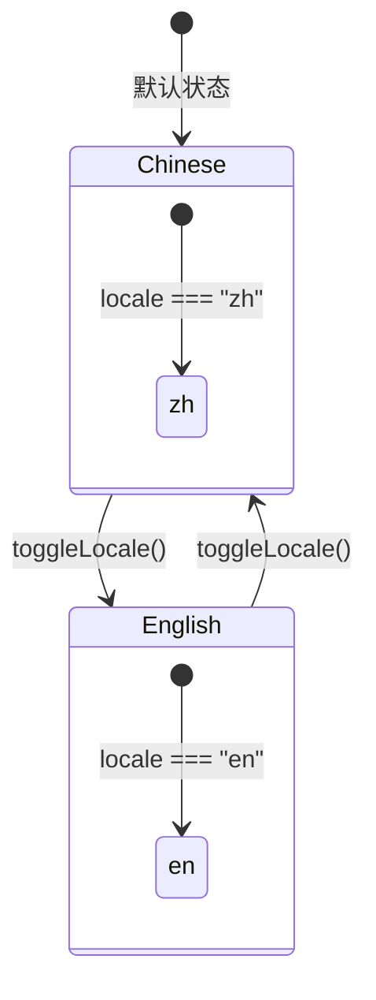
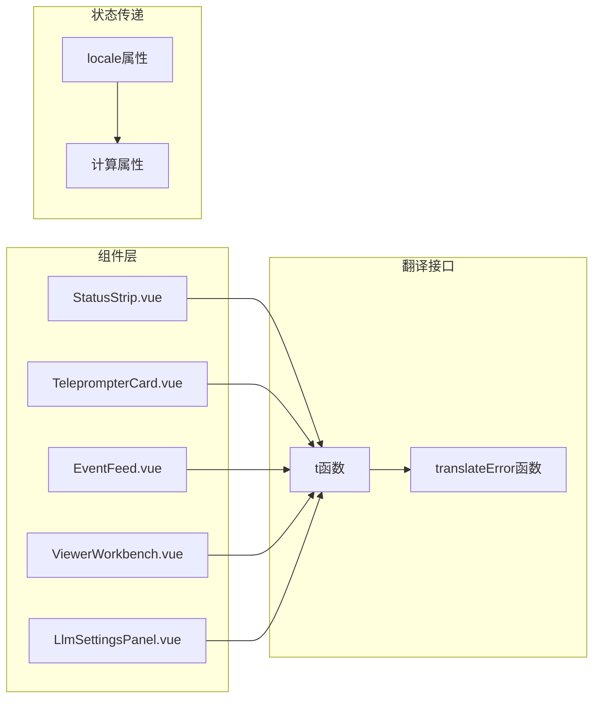
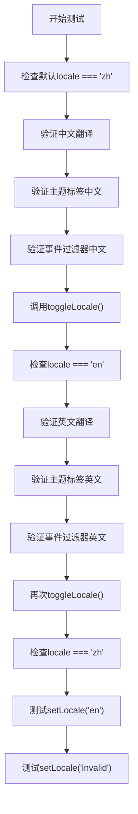

# 前端语言切换实现计划

<cite>
**本文档引用的文件**
- [frontend/src/i18n.js](file://frontend/src/i18n.js)
- [frontend/src/stores/live.js](file://frontend/src/stores/live.js)
- [frontend/src/components/StatusStrip.vue](file://frontend/src/components/StatusStrip.vue)
- [frontend/src/App.vue](file://frontend/src/App.vue)
- [frontend/src/components/TeleprompterCard.vue](file://frontend/src/components/TeleprompterCard.vue)
- [frontend/src/components/EventFeed.vue](file://frontend/src/components/EventFeed.vue)
- [frontend/src/components/ViewerWorkbench.vue](file://frontend/src/components/ViewerWorkbench.vue)
- [frontend/src/components/LlmSettingsPanel.vue](file://frontend/src/components/LlmSettingsPanel.vue)
- [frontend/src/stores/locale.test.mjs](file://frontend/src/stores/locale.test.mjs)
- [docs/superpowers/plans/2026-04-13-frontend-locale-toggle.md](file://docs/superpowers/plans/2026-04-13-frontend-locale-toggle.md)
- [docs/superpowers/specs/2026-04-13-frontend-locale-toggle-design.md](file://docs/superpowers/specs/2026-04-13-frontend-locale-toggle-design.md)
- [frontend/package.json](file://frontend/package.json)
</cite>

## 目录
1. [项目概述](#项目概述)
2. [技术架构](#技术架构)
3. [核心组件分析](#核心组件分析)
4. [语言切换实现](#语言切换实现)
5. [组件集成方案](#组件集成方案)
6. [测试策略](#测试策略)
7. [性能考虑](#性能考虑)
8. [故障排除指南](#故障排除指南)
9. [总结](#总结)

## 项目概述

本项目是一个基于Vue 3和Pinia的直播互动前端应用，实现了中英文双语支持的语言切换功能。该功能采用轻量级本地化方案，通过内置的消息字典和Pinia状态管理实现临时性的语言切换。

### 核心目标
- 实现中英文双语切换，默认中文显示
- 切换结果仅在当前页面会话内生效
- 不引入复杂的国际化框架，避免持久化存储
- 覆盖核心静态UI文本内容

**章节来源**
- [docs/superpowers/plans/2026-04-13-frontend-locale-toggle.md:1-12](file://docs/superpowers/plans/2026-04-13-frontend-locale-toggle.md#L1-L12)
- [docs/superpowers/specs/2026-04-13-frontend-locale-toggle-design.md:3-6](file://docs/superpowers/specs/2026-04-13-frontend-locale-toggle-design.md#L3-L6)

## 技术架构

### 整体架构设计

```mermaid
graph TB
subgraph "前端应用层"
App[App.vue]
StatusStrip[StatusStrip.vue]
Teleprompter[TeleprompterCard.vue]
EventFeed[EventFeed.vue]
ViewerWorkbench[ViewerWorkbench.vue]
LlmSettings[LlmSettingsPanel.vue]
end
subgraph "状态管理层"
LiveStore[live.js<br/>Pinia Store]
LocaleState[locale<br/>ref("zh")]
end
subgraph "国际化层"
I18n[i18n.js<br/>messages字典]
Translate[translate函数]
ErrorTranslate[translateError函数]
end
subgraph "依赖关系"
Vue[Vue 3]
Pinia[Pinia]
Vite[Vite]
end
App --> LiveStore
StatusStrip --> LiveStore
Teleprompter --> LiveStore
EventFeed --> LiveStore
ViewerWorkbench --> LiveStore
LlmSettings --> LiveStore
LiveStore --> I18n
I18n --> Translate
I18n --> ErrorTranslate
LiveStore -.-> Vue
LiveStore -.-> Pinia
App -.-> Vite
```

**图表来源**
- [frontend/src/App.vue:1-139](file://frontend/src/App.vue#L1-L139)
- [frontend/src/stores/live.js:75-800](file://frontend/src/stores/live.js#L75-L800)
- [frontend/src/i18n.js:1-316](file://frontend/src/i18n.js#L1-L316)

### 技术栈
- **前端框架**: Vue 3 (Composition API)
- **状态管理**: Pinia
- **构建工具**: Vite
- **样式框架**: Tailwind CSS
- **测试框架**: Node.js 内置断言

**章节来源**
- [frontend/package.json:1-23](file://frontend/package.json#L1-L23)

## 核心组件分析

### 国际化字典系统

国际化系统采用轻量级设计，通过单一的`messages`对象提供中英文双语文本：



**图表来源**
- [frontend/src/i18n.js:1-276](file://frontend/src/i18n.js#L1-L276)

### 翻译函数实现

翻译系统提供了两个核心函数：

1. **translate函数**: 主要翻译函数，支持参数替换
2. **translateError函数**: 错误信息专门翻译函数



**图表来源**
- [frontend/src/i18n.js:278-316](file://frontend/src/i18n.js#L278-L316)

**章节来源**
- [frontend/src/i18n.js:1-316](file://frontend/src/i18n.js#L1-L316)

## 语言切换实现

### Pinia Store集成

语言切换功能通过Pinia Store的状态管理实现：



**图表来源**
- [frontend/src/stores/live.js:323-329](file://frontend/src/stores/live.js#L323-L329)
- [frontend/src/components/StatusStrip.vue:80-84](file://frontend/src/components/StatusStrip.vue#L80-L84)

### 状态管理实现

LiveStore中新增的语言切换功能包括：

1. **locale状态**: 默认值为"zh"
2. **setLocale方法**: 设置指定语言（仅接受"en"或"zh"）
3. **toggleLocale方法**: 在中英文之间切换



**图表来源**
- [frontend/src/stores/live.js:76-76](file://frontend/src/stores/live.js#L76-L76)
- [frontend/src/stores/live.js:323-329](file://frontend/src/stores/live.js#L323-L329)

**章节来源**
- [frontend/src/stores/live.js:75-800](file://frontend/src/stores/live.js#L75-L800)

## 组件集成方案

### 组件级翻译集成

所有前端组件都通过统一的翻译接口实现语言切换：



**图表来源**
- [frontend/src/components/StatusStrip.vue:58-89](file://frontend/src/components/StatusStrip.vue#L58-L89)
- [frontend/src/components/TeleprompterCard.vue:19-27](file://frontend/src/components/TeleprompterCard.vue#L19-L27)
- [frontend/src/components/EventFeed.vue:34-53](file://frontend/src/components/EventFeed.vue#L34-L53)

### 具体组件实现

#### 状态栏组件集成

状态栏组件实现了完整的语言切换功能：

- **切换按钮**: 显示当前语言标识（"EN"/"中文"）
- **按钮标签**: 根据当前语言动态切换
- **工具卡片**: 包含语言切换和主题切换功能

#### 提词器组件集成

提词器组件支持动态翻译：
- **标题文本**: "当前优先展示的回复建议" / "Highest-priority reply suggestion"
- **源内容标签**: "原始内容" / "Source Content"
- **建议回复标签**: "建议回复" / "Suggested Reply"

#### 事件流组件集成

事件流组件通过计算属性实现：
- **过滤器标签**: 动态翻译事件类型标签
- **统计信息**: 翻译各种统计指标名称
- **操作按钮**: 翻译清除、显示全部等操作按钮

**章节来源**
- [frontend/src/components/StatusStrip.vue:1-316](file://frontend/src/components/StatusStrip.vue#L1-L316)
- [frontend/src/components/TeleprompterCard.vue:1-97](file://frontend/src/components/TeleprompterCard.vue#L1-L97)
- [frontend/src/components/EventFeed.vue:1-214](file://frontend/src/components/EventFeed.vue#L1-L214)

## 测试策略

### 单元测试实现

项目包含专门的国际化测试套件，验证语言切换功能：



**图表来源**
- [frontend/src/stores/locale.test.mjs:1-35](file://frontend/src/stores/locale.test.mjs#L1-L35)

### 测试覆盖范围

测试套件验证以下关键功能：
1. **默认状态**: locale初始值为"zh"
2. **切换功能**: toggleLocale()正确切换语言
3. **双向切换**: 英文切换回中文
4. **直接设置**: setLocale()方法正常工作
5. **边界处理**: 无效语言代码回退到中文

**章节来源**
- [frontend/src/stores/locale.test.mjs:1-35](file://frontend/src/stores/locale.test.mjs#L1-L35)

## 性能考虑

### 内存优化

- **字典缓存**: messages对象在模块级别缓存，避免重复创建
- **计算属性**: 使用Vue计算属性缓存翻译结果
- **按需加载**: 仅在组件需要时进行翻译查找

### 渲染优化

- **响应式更新**: 仅当locale状态变化时重新渲染相关组件
- **批量更新**: 多个组件共享同一个翻译函数引用
- **最小DOM操作**: 通过计算属性避免不必要的DOM更新

### 加载性能

- **零依赖**: 不引入额外的国际化库，减少包体积
- **内联翻译**: 翻译逻辑直接集成在组件中
- **轻量实现**: 最小化的API设计，降低维护成本

## 故障排除指南

### 常见问题及解决方案

#### 语言切换无效
**症状**: 点击切换按钮但界面语言不变
**可能原因**:
1. 组件未正确接收locale prop
2. 翻译函数调用错误
3. Pinia状态未正确更新

**解决步骤**:
1. 检查App.vue中是否正确传递locale状态
2. 验证组件props定义是否包含locale属性
3. 确认toggleLocale方法调用链路

#### 翻译文本显示异常
**症状**: 显示原始键名而非翻译文本
**可能原因**:
1. 键名拼写错误
2. 字典中缺少对应键值
3. 参数替换格式不正确

**解决步骤**:
1. 检查i18n.js中的键名拼写
2. 验证字典结构完整性
3. 确认参数占位符格式

#### 状态同步问题
**症状**: 不同组件显示不同的语言状态
**可能原因**:
1. 多个独立的locale状态实例
2. 组件间状态传递错误
3. Pinia store实例问题

**解决步骤**:
1. 确保所有组件使用同一个store实例
2. 检查storeToRefs的正确使用
3. 验证组件间的prop传递

**章节来源**
- [frontend/src/stores/live.js:75-800](file://frontend/src/stores/live.js#L75-L800)
- [frontend/src/i18n.js:278-316](file://frontend/src/i18n.js#L278-L316)

## 总结

本前端语言切换实现计划成功地在现有Vue 3 + Pinia架构基础上，添加了轻量级的中英文双语支持功能。该实现具有以下特点：

### 技术优势
- **简洁性**: 采用最小化设计，仅添加必要的翻译函数和状态管理
- **一致性**: 所有组件通过统一的翻译接口实现语言切换
- **可维护性**: 清晰的代码结构和完善的测试覆盖
- **性能友好**: 零外部依赖，内存和渲染性能优化

### 功能特性
- **临时生效**: 切换结果仅在当前会话内保留
- **默认中文**: 页面加载时自动默认中文显示
- **完整覆盖**: 涵盖核心静态UI文本内容
- **错误处理**: 优雅的回退机制确保用户体验

### 扩展性考虑
该实现为未来的国际化需求奠定了良好基础，可以在不破坏现有功能的前提下逐步扩展更多语言支持和更复杂的国际化场景。