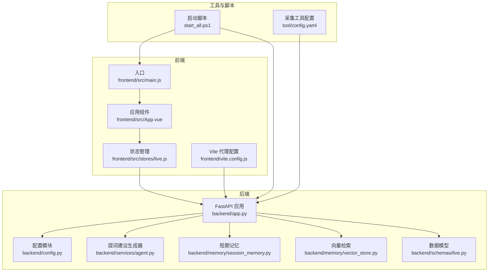
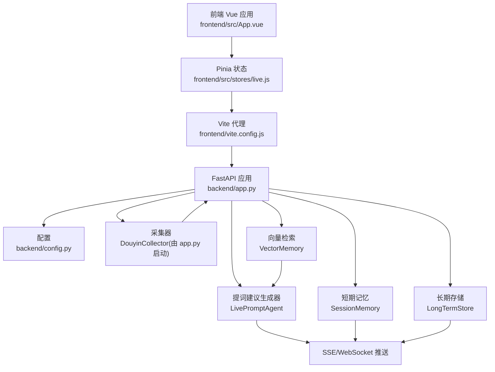
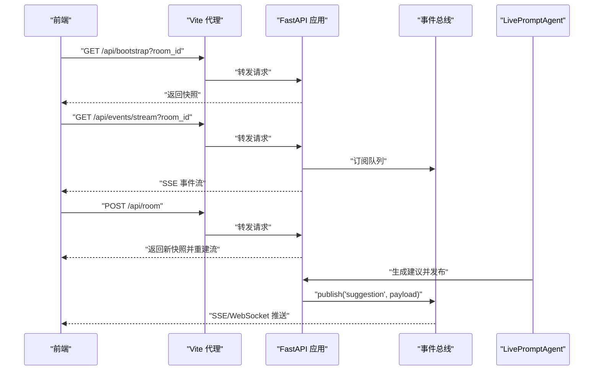
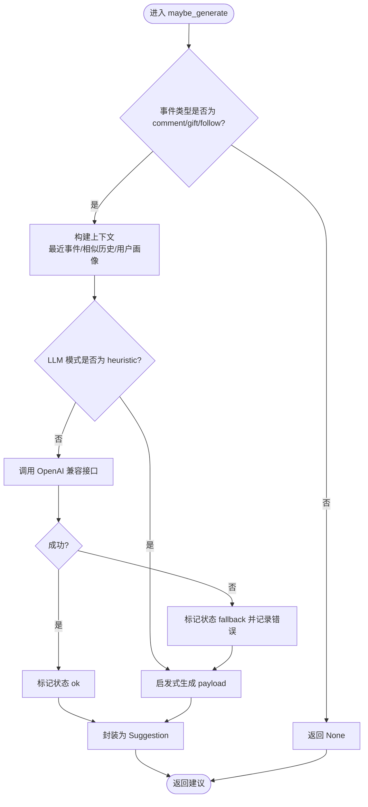
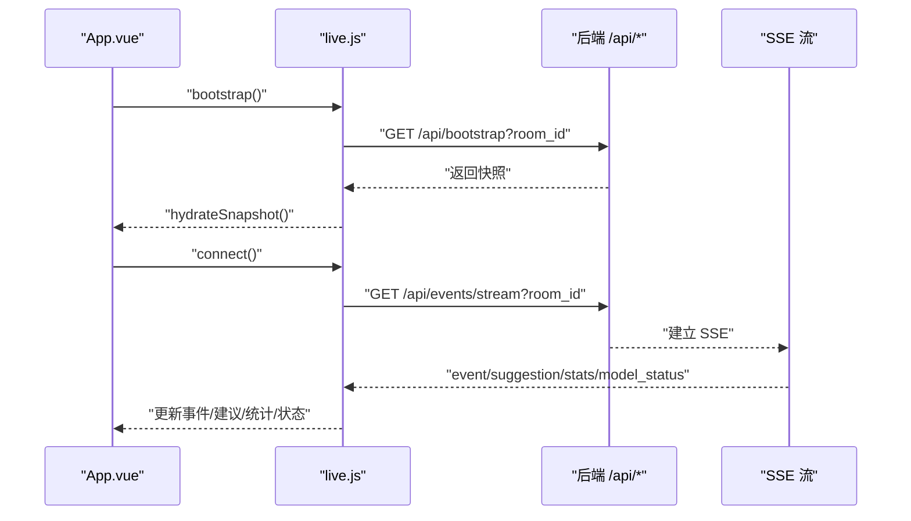
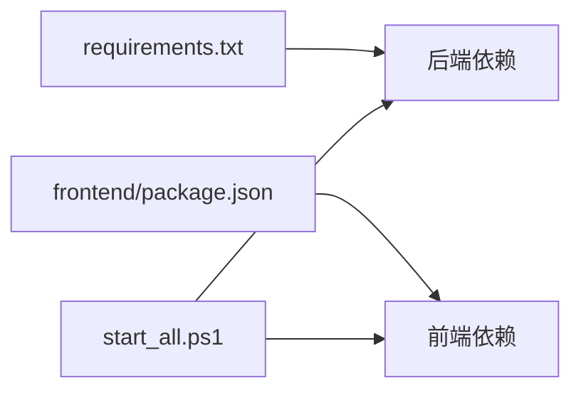

# 开发指南

<cite>
**本文引用的文件**
- [README.md](file://README.md)
- [USAGE.md](file://USAGE.md)
- [requirements.txt](file://requirements.txt)
- [backend/app.py](file://backend/app.py)
- [backend/config.py](file://backend/config.py)
- [backend/services/agent.py](file://backend/services/agent.py)
- [backend/memory/session_memory.py](file://backend/memory/session_memory.py)
- [backend/memory/vector_store.py](file://backend/memory/vector_store.py)
- [backend/schemas/live.py](file://backend/schemas/live.py)
- [frontend/src/main.js](file://frontend/src/main.js)
- [frontend/src/App.vue](file://frontend/src/App.vue)
- [frontend/src/stores/live.js](file://frontend/src/stores/live.js)
- [frontend/vite.config.js](file://frontend/vite.config.js)
- [frontend/package.json](file://frontend/package.json)
- [start_all.ps1](file://start_all.ps1)
- [tool/config.yaml](file://tool/config.yaml)
</cite>

## 目录
1. [简介](#简介)
2. [项目结构](#项目结构)
3. [核心组件](#核心组件)
4. [架构总览](#架构总览)
5. [详细组件分析](#详细组件分析)
6. [依赖分析](#依赖分析)
7. [性能考虑](#性能考虑)
8. [故障排查指南](#故障排查指南)
9. [结论](#结论)
10. [附录](#附录)

## 简介
本开发指南面向贡献者，提供从开发环境搭建、代码规范与最佳实践、测试策略、调试与性能分析、代码审查与质量保障，到扩展开发与维护的全流程指导。项目采用“采集-处理-存储-建议-展示”的链路，后端基于 FastAPI，前端基于 Vue 3 + Pinia + Tailwind，通过 SSE/WebSocket 实时推送事件与建议。

## 项目结构
- 后端 backend/
  - 应用入口与路由：backend/app.py
  - 配置解析：backend/config.py
  - 服务层：backend/services/*
  - 记忆与存储：backend/memory/*
  - 数据模型：backend/schemas/live.py
- 前端 frontend/
  - 入口与应用：frontend/src/main.js, frontend/src/App.vue
  - 状态管理：frontend/src/stores/live.js
  - 构建与代理：frontend/vite.config.js, frontend/package.json
- 工具与脚本
  - 启动脚本：start_all.ps1
  - 抖音采集工具配置：tool/config.yaml
- 文档与依赖
  - 项目说明：README.md, USAGE.md
  - 依赖清单：requirements.txt

图表来源
- [backend/app.py:1-220](file://backend/app.py#L1-L220)
- [backend/config.py:1-94](file://backend/config.py#L1-L94)
- [backend/services/agent.py:1-393](file://backend/services/agent.py#L1-L393)
- [backend/memory/session_memory.py:1-113](file://backend/memory/session_memory.py#L1-L113)
- [backend/memory/vector_store.py:1-108](file://backend/memory/vector_store.py#L1-L108)
- [backend/schemas/live.py:1-95](file://backend/schemas/live.py#L1-L95)
- [frontend/src/main.js:1-17](file://frontend/src/main.js#L1-L17)
- [frontend/src/App.vue:1-66](file://frontend/src/App.vue#L1-L66)
- [frontend/src/stores/live.js:1-310](file://frontend/src/stores/live.js#L1-L310)
- [frontend/vite.config.js:1-23](file://frontend/vite.config.js#L1-L23)
- [start_all.ps1:1-18](file://start_all.ps1#L1-L18)
- [tool/config.yaml](file://tool/config.yaml)

章节来源
- [README.md:21-34](file://README.md#L21-L34)
- [USAGE.md:15-256](file://USAGE.md#L15-L256)

## 核心组件
- 应用入口与路由：提供健康检查、房间切换、事件注入、SSE/WebSocket 实时流等接口，负责事件处理与发布。
- 配置模块：统一读取 .env 与环境变量，解析 LLM 模式、存储路径、Redis/Chroma 等配置。
- 提词建议生成器：优先调用 OpenAI 兼容接口，失败时回退本地启发式规则，输出结构化建议。
- 短期记忆：优先使用 Redis，未安装时退化为进程内队列，保存最近事件与建议并统计。
- 向量检索：优先使用 Chroma，未安装时使用哈希嵌入与轻量相似度方案，提供历史相似片段。
- 数据模型：统一事件、建议、统计、状态与快照的数据结构。
- 前端应用：基于 Vue 3 + Pinia，通过 SSE 连接后端，展示事件流、建议、统计与模型状态。
- 构建与代理：Vite 代理将 /api 与 /ws 转发至后端，便于本地联调。

章节来源
- [backend/app.py:104-220](file://backend/app.py#L104-L220)
- [backend/config.py:39-94](file://backend/config.py#L39-L94)
- [backend/services/agent.py:23-393](file://backend/services/agent.py#L23-L393)
- [backend/memory/session_memory.py:17-113](file://backend/memory/session_memory.py#L17-L113)
- [backend/memory/vector_store.py:52-108](file://backend/memory/vector_store.py#L52-L108)
- [backend/schemas/live.py:8-95](file://backend/schemas/live.py#L8-L95)
- [frontend/src/main.js:1-17](file://frontend/src/main.js#L1-L17)
- [frontend/src/App.vue:1-66](file://frontend/src/App.vue#L1-L66)
- [frontend/src/stores/live.js:70-310](file://frontend/src/stores/live.js#L70-L310)
- [frontend/vite.config.js:8-23](file://frontend/vite.config.js#L8-L23)

## 架构总览
系统从前端发起初始化与连接，后端通过内置采集器连接本地 WebSocket 源，标准化事件后写入短期/长期存储，同时生成建议并通过 SSE/WebSocket 推送至前端。

图表来源
- [backend/app.py:84-220](file://backend/app.py#L84-L220)
- [backend/config.py:39-94](file://backend/config.py#L39-L94)
- [backend/services/agent.py:23-393](file://backend/services/agent.py#L23-L393)
- [backend/memory/session_memory.py:17-113](file://backend/memory/session_memory.py#L17-L113)
- [backend/memory/vector_store.py:52-108](file://backend/memory/vector_store.py#L52-L108)
- [frontend/src/App.vue:1-66](file://frontend/src/App.vue#L1-L66)
- [frontend/src/stores/live.js:158-205](file://frontend/src/stores/live.js#L158-L205)
- [frontend/vite.config.js:8-23](file://frontend/vite.config.js#L8-L23)

## 详细组件分析

### 后端应用与路由（FastAPI）
- 生命周期管理：启动采集器，关闭时清理会话与停止采集。
- 接口职责：
  - 健康检查：返回房间号与活动会话。
  - 初始化快照：返回最近事件、建议、统计与模型状态。
  - 房间切换：关闭当前会话并切换采集房间。
  - 事件注入：手动注入标准化事件，便于联调。
  - SSE 流：按房间过滤事件类型，推送 event/suggestion/stats/model_status。
  - WebSocket：先发送 bootstrap 快照，随后持续推送。

图表来源
- [backend/app.py:104-220](file://backend/app.py#L104-L220)
- [frontend/src/stores/live.js:158-205](file://frontend/src/stores/live.js#L158-L205)

章节来源
- [backend/app.py:84-220](file://backend/app.py#L84-L220)

### 配置模块（Settings）
- 优先读取 .env，其次读取环境变量，提供默认值确保本地可运行。
- 关键配置项：房间号、采集开关与网络参数、数据目录与数据库路径、Redis/Chroma、LLM 模式与认证、温度与超时等。
- 提供解析逻辑：根据模式解析最终模型服务地址与模型名。

章节来源
- [backend/config.py:11-94](file://backend/config.py#L11-L94)

### 提词建议生成器（LivePromptAgent）
- 生成策略：
  - 仅对 comment/gift/follow 生成建议。
  - 构造上下文：最近事件、相似历史、用户画像。
  - 优先 OpenAI 兼容接口，失败回退本地启发式规则。
- 状态管理：记录模式、模型、后端、结果与错误、更新时间。
- 错误处理：覆盖 HTTP/网络/超时/JSON 解析/OS 异常等，统一标记状态并记录日志。

图表来源
- [backend/services/agent.py:73-114](file://backend/services/agent.py#L73-L114)
- [backend/services/agent.py:183-330](file://backend/services/agent.py#L183-L330)

章节来源
- [backend/services/agent.py:23-393](file://backend/services/agent.py#L23-L393)

### 短期记忆（SessionMemory）
- 优先使用 Redis 列表保存事件与建议，限制长度并设置 TTL。
- 未安装 Redis 时退化为进程内 deque，保证基本可用。
- 提供最近事件/建议查询与轻量统计。

章节来源
- [backend/memory/session_memory.py:17-113](file://backend/memory/session_memory.py#L17-L113)

### 向量检索（VectorMemory）
- 优先使用 Chroma 持久化集合，支持 upsert/query。
- 未安装时使用哈希嵌入函数与轻量相似度方案，维持检索能力。

章节来源
- [backend/memory/vector_store.py:52-108](file://backend/memory/vector_store.py#L52-L108)

### 数据模型（schemas/live.py）
- Actor：最小化用户身份，提供 viewer_id 计算。
- LiveEvent：标准化直播事件，包含来源、类型、内容、元数据等。
- Suggestion：建议实体，包含来源、优先级、口播文案、语气、理由、置信度等。
- SessionStats：房间统计，计数各类事件。
- ModelStatus：模型状态，记录模式、模型、后端、结果、错误与更新时间。
- SessionSnapshot：前端初始化快照，包含最近事件、建议、统计与模型状态。

章节来源
- [backend/schemas/live.py:8-95](file://backend/schemas/live.py#L8-L95)

### 前端应用与状态管理（Vue 3 + Pinia）
- 入口：创建应用实例、注册 Pinia、挂载根节点。
- 应用：初始化快照与连接，渲染状态条、主提词卡与事件流。
- 状态管理：
  - 房间切换：调用 /api/room，失败回滚并重建流。
  - SSE 连接：监听 event/suggestion/stats/model_status 事件，更新状态。
  - 事件过滤与主题持久化：localStorage 记录可见事件类型与主题。

图表来源
- [frontend/src/App.vue:29-32](file://frontend/src/App.vue#L29-L32)
- [frontend/src/stores/live.js:158-205](file://frontend/src/stores/live.js#L158-L205)
- [frontend/src/stores/live.js:207-250](file://frontend/src/stores/live.js#L207-L250)

章节来源
- [frontend/src/main.js:1-17](file://frontend/src/main.js#L1-L17)
- [frontend/src/App.vue:1-66](file://frontend/src/App.vue#L1-L66)
- [frontend/src/stores/live.js:70-310](file://frontend/src/stores/live.js#L70-L310)

### 构建与代理（Vite）
- 代理规则：将 /api 转发至后端 8010 端口，/ws 透传 WebSocket。
- 便于前端在本地开发时与后端联调，避免跨域与端口差异。

章节来源
- [frontend/vite.config.js:8-23](file://frontend/vite.config.js#L8-L23)

## 依赖分析
- 后端依赖：websocket-client、fastapi、uvicorn、redis、chromadb。
- 前端依赖：vue、pinia、vite、tailwindcss、postcss 等。
- 启动脚本：start_all.ps1 同时启动后端与前端。

图表来源
- [requirements.txt:1-6](file://requirements.txt#L1-L6)
- [frontend/package.json:1-23](file://frontend/package.json#L1-L23)
- [start_all.ps1:1-18](file://start_all.ps1#L1-L18)

章节来源
- [requirements.txt:1-6](file://requirements.txt#L1-L6)
- [frontend/package.json:1-23](file://frontend/package.json#L1-L23)
- [start_all.ps1:1-18](file://start_all.ps1#L1-L18)

## 性能考虑
- 短期记忆与建议列表长度限制与 TTL 控制，降低内存占用与查询成本。
- 向量检索在未安装 Chroma 时使用哈希嵌入与轻量相似度，保证检索可用性。
- SSE/WebSocket 推送按房间过滤，减少无关事件传输。
- 建议生成优先使用在线模型，失败快速回退本地规则，保障稳定性。

[本节为通用性能建议，无需特定文件引用]

## 故障排查指南
- 页面打开但无建议：检查采集工具是否启动、房间号是否正确、后端是否已重启。
- 顶部显示 fallback：检查 API Key、网络访问、是否触发超时或限流。
- 顶部显示 heuristic：检查 LLM_MODE 配置与 .env 加载。
- 前端无法访问：检查前端脚本是否正常启动、5173 端口占用情况。
- 后端启动但未写入数据：确认采集 WebSocket 地址、房间是否开播且有消息。
- 日志与调试：后端使用基础日志配置，前端可通过浏览器开发者工具查看网络与控制台。

章节来源
- [USAGE.md:179-240](file://USAGE.md#L179-L240)
- [backend/app.py:22-23](file://backend/app.py#L22-L23)

## 结论
本指南提供了从开发环境到生产运维的完整路径。建议在贡献代码时遵循统一的命名与注释规范，完善测试与日志，严格遵循 Pull Request 流程与代码检查清单，配合 CI/CD 与自动化脚本，确保系统稳定演进。

[本节为总结性内容，无需特定文件引用]

## 附录

### 开发环境搭建与配置
- 后端
  - Python 3.10+，安装依赖：pip install -r requirements.txt
  - 启动：python -m uvicorn backend.app:app --host 127.0.0.1 --port 8010 --reload
- 前端
  - Node.js 18+，安装依赖：npm install
  - 启动：npm run dev -- --host 127.0.0.1 --strictPort --port 5173
- 一键启动：PowerShell 执行 start_all.ps1

章节来源
- [README.md:95-140](file://README.md#L95-L140)
- [USAGE.md:73-114](file://USAGE.md#L73-L114)
- [start_all.ps1:1-18](file://start_all.ps1#L1-L18)

### 代码规范与最佳实践
- Python 编码规范
  - 使用类型注解与 Pydantic 模型，保持数据结构清晰。
  - 采用模块化设计，服务层、记忆层、存储层职责分离。
  - 错误处理覆盖常见异常类型，统一记录日志并更新状态。
- JavaScript/Vue.js 编码规范
  - 使用 Composition API 与 Pinia 管理状态，避免副作用。
  - 通过 Vite 代理统一转发 /api 与 /ws，减少跨域问题。
  - 事件过滤与主题持久化使用 localStorage，提升用户体验。
- 命名约定
  - 模块与类名：PascalCase；函数与变量：snake_case；常量：UPPER_CASE。
  - 文件名：小写，单词间以下划线分隔。
- 注释标准
  - 模块头部提供目的与职责说明；复杂函数提供输入/输出与异常说明。
  - 关键流程添加简要注释，避免过度注释冗余。

[本节为通用规范建议，无需特定文件引用]

### 测试策略与实施
- 单元测试
  - 针对 Agent 的建议生成逻辑、上下文构造与回退策略进行断言。
  - 针对 SessionMemory 的增删查与 TTL 行为进行断言。
  - 针对 VectorMemory 的相似检索与降级逻辑进行断言。
- 集成测试
  - 模拟 SSE/WebSocket 流，验证事件、建议、统计与模型状态的推送顺序与一致性。
  - 验证房间切换流程与快照重建。
- 端到端测试
  - 使用浏览器自动化工具，模拟用户操作（切换房间、事件筛选、主题切换）并验证界面状态。

[本节为通用测试建议，无需特定文件引用]

### 调试技巧与工具使用
- 日志配置
  - 后端使用基础日志配置，建议在本地开发时调整日志级别以便观察。
- 错误排查
  - 检查采集 WebSocket 地址与房间号，确认事件是否到达后端。
  - 查看建议生成器的日志与状态，识别模型调用失败原因。
- 性能分析
  - 使用 Python 性能分析工具定位慢点；前端使用浏览器性能面板分析渲染与网络。
- 内存泄漏检测
  - 前端：监控事件监听器与定时器，确保在组件卸载时清理。
  - 后端：监控 Redis/Chroma 连接与队列长度，避免无限增长。

[本节为通用调试建议，无需特定文件引用]

### 代码审查流程与质量保证
- Pull Request 规范
  - 提交前运行本地测试与格式化检查。
  - PR 描述清晰说明变更目的、影响范围与测试结果。
- 代码检查清单
  - 代码风格与命名一致性、注释完整性、错误处理覆盖、边界条件处理。
  - 性能与资源使用评估，避免引入阻塞或内存泄漏。
- 持续集成配置
  - 建议在 CI 中执行：依赖安装、单元测试、静态检查、打包预检。
  - 对关键分支启用保护规则，强制通过检查后合并。

[本节为通用流程建议，无需特定文件引用]

### 扩展开发指导
- 新功能添加
  - 明确模块边界，优先在服务层或记忆层扩展，保持路由层薄。
  - 提供数据模型与序列化/反序列化逻辑，确保前后端一致。
- 第三方集成
  - 通过配置模块集中管理外部服务地址与密钥，提供默认值与回退策略。
- 性能优化
  - 优化检索与缓存策略，减少重复计算；合理设置 TTL 与队列长度。
- 安全加固
  - 严格校验与过滤输入，避免注入；敏感信息使用环境变量与只读权限。

[本节为通用扩展建议，无需特定文件引用]