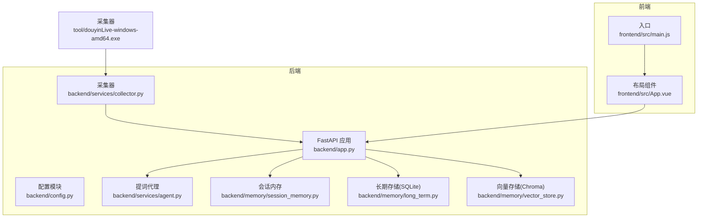
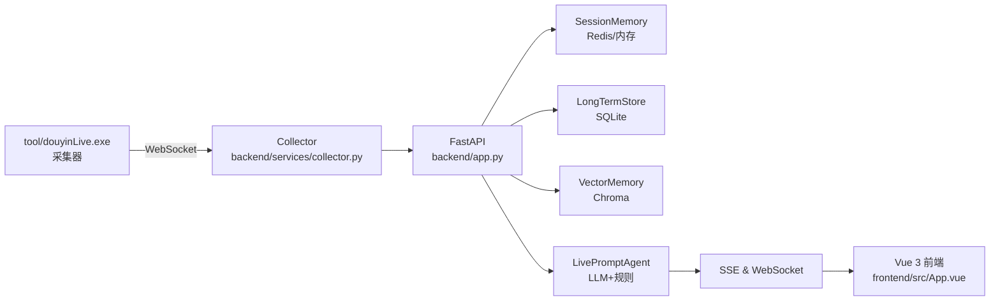
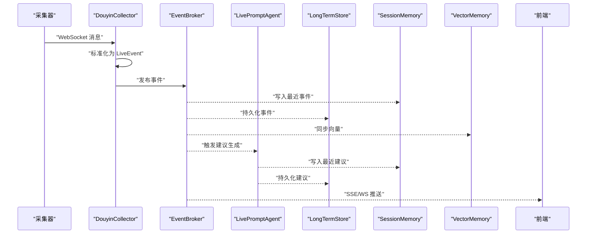
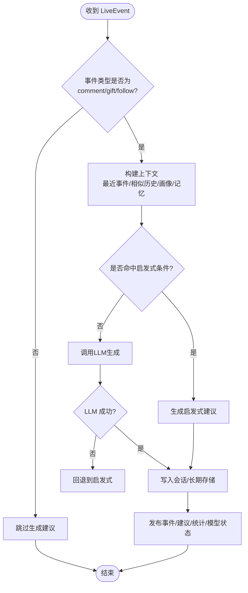
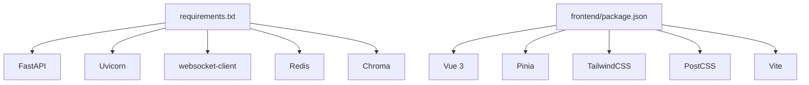

# 开发指南

<cite>
**本文引用的文件**
- [README.md](file://README.md)
- [USAGE.md](file://USAGE.md)
- [requirements.txt](file://requirements.txt)
- [backend/app.py](file://backend/app.py)
- [backend/config.py](file://backend/config.py)
- [backend/services/collector.py](file://backend/services/collector.py)
- [backend/services/agent.py](file://backend/services/agent.py)
- [backend/memory/session_memory.py](file://backend/memory/session_memory.py)
- [backend/memory/long_term.py](file://backend/memory/long_term.py)
- [backend/memory/vector_store.py](file://backend/memory/vector_store.py)
- [frontend/package.json](file://frontend/package.json)
- [frontend/src/main.js](file://frontend/src/main.js)
- [frontend/src/App.vue](file://frontend/src/App.vue)
- [start_all.ps1](file://start_all.ps1)
- [start_frontend.ps1](file://start_frontend.ps1)
- [tests/test_agent.py](file://tests/test_agent.py)
</cite>

## 目录
1. [简介](#简介)
2. [项目结构](#项目结构)
3. [核心组件](#核心组件)
4. [架构总览](#架构总览)
5. [详细组件分析](#详细组件分析)
6. [依赖分析](#依赖分析)
7. [性能考量](#性能考量)
8. [故障排查指南](#故障排查指南)
9. [结论](#结论)
10. [附录](#附录)

## 简介
本指南面向DouYin_llm项目的开发者，提供从环境搭建、IDE配置、调试设置、代码规范到新功能开发流程、插件与API扩展、代码审查与版本控制、性能优化、安全编码、可维护性设计、常见问题解决与调试技巧，以及扩展开发的架构考虑与设计模式的完整说明。项目采用本地采集工具、FastAPI后端与Vue 3前端的组合，将抖音直播WebSocket流中的评论、礼物与关注事件转化为结构化LiveEvent，沉淀观众记忆并通过LLM或启发式规则生成提词建议，最终以前端仪表板形式呈现。

章节来源
- [README.md:1-223](file://README.md#L1-L223)

## 项目结构
项目采用前后端分离与模块化组织：
- backend：FastAPI应用入口、服务层（采集、代理、Broker、记忆抽取）、内存与存储层（会话、长期、向量）
- frontend：Vue 3应用，Pinia状态管理，组件化展示（状态条、提词卡、事件流、Viewer工作台、LLM设置面板）
- tool：本地采集器可执行文件与配置
- tests：Python单元测试
- docs/superpowers：设计稿与实施计划
- data：SQLite与Chroma数据目录
- logs：历史调试输出
- 启动脚本：start_all.ps1、start_backend_qwen.ps1、start_frontend.ps1

图表来源
- [backend/app.py:1-285](file://backend/app.py#L1-L285)
- [backend/config.py:1-113](file://backend/config.py#L1-L113)
- [backend/services/collector.py:1-266](file://backend/services/collector.py#L1-L266)
- [backend/services/agent.py:1-496](file://backend/services/agent.py#L1-L496)
- [backend/memory/session_memory.py:1-113](file://backend/memory/session_memory.py#L1-L113)
- [backend/memory/long_term.py:1-967](file://backend/memory/long_term.py#L1-L967)
- [backend/memory/vector_store.py:1-317](file://backend/memory/vector_store.py#L1-L317)
- [frontend/src/main.js:1-17](file://frontend/src/main.js#L1-L17)
- [frontend/src/App.vue:1-139](file://frontend/src/App.vue#L1-L139)

章节来源
- [README.md:32-44](file://README.md#L32-L44)
- [USAGE.md:15-256](file://USAGE.md#L15-L256)

## 核心组件
- FastAPI应用入口与路由：提供健康检查、引导、房间切换、事件注入、观众画像与笔记、LLM设置、SSE与WebSocket流等REST接口
- 配置模块：集中管理环境变量与默认值，解析LLM与嵌入服务地址、模型名、超时与令牌等
- 采集器：连接本地采集器WebSocket，标准化为LiveEvent并提交至事件循环
- 提词代理：根据事件类型与上下文选择LLM或启发式规则生成建议，回退机制与状态上报
- 记忆与存储：会话内存（Redis/内存）、长期存储（SQLite）、向量存储（Chroma/哈希回退）

章节来源
- [backend/app.py:129-285](file://backend/app.py#L129-L285)
- [backend/config.py:40-113](file://backend/config.py#L40-L113)
- [backend/services/collector.py:38-266](file://backend/services/collector.py#L38-L266)
- [backend/services/agent.py:23-496](file://backend/services/agent.py#L23-L496)
- [backend/memory/session_memory.py:17-113](file://backend/memory/session_memory.py#L17-L113)
- [backend/memory/long_term.py:44-967](file://backend/memory/long_term.py#L44-L967)
- [backend/memory/vector_store.py:59-317](file://backend/memory/vector_store.py#L59-L317)

## 架构总览

图表来源
- [README.md:7-17](file://README.md#L7-L17)
- [backend/app.py:108-126](file://backend/app.py#L108-L126)
- [backend/services/collector.py:54-60](file://backend/services/collector.py#L54-L60)

章节来源
- [README.md:5-31](file://README.md#L5-L31)

## 详细组件分析

### FastAPI 应用与路由
- 生命周期管理：启动时初始化采集器、Broker、会话/长期/向量内存，关闭时清理活动会话与停止采集
- 接口职责：
  - 健康检查：返回运行状态与当前房间
  - 引导：返回快照（最近事件/建议、统计、模型状态）
  - 房间切换：关闭旧会话、切换房间并返回新快照
  - 事件注入：手动注入LiveEvent用于联调/回放
  - 观众画像与笔记：查询、增删改查
  - LLM设置：获取/保存模型与系统提示词
  - 实时流：SSE与WebSocket，按房间过滤

图表来源
- [backend/app.py:73-102](file://backend/app.py#L73-L102)
- [backend/services/collector.py:145-160](file://backend/services/collector.py#L145-L160)
- [backend/services/agent.py:105-142](file://backend/services/agent.py#L105-L142)
- [backend/memory/session_memory.py:42-64](file://backend/memory/session_memory.py#L42-L64)
- [backend/memory/long_term.py:454-488](file://backend/memory/long_term.py#L454-L488)
- [backend/memory/vector_store.py:149-171](file://backend/memory/vector_store.py#L149-L171)

章节来源
- [backend/app.py:108-285](file://backend/app.py#L108-L285)

### 配置模块
- 优先级：.env > 当前shell > 代码默认值
- 关键配置：
  - 直播采集：房间号、采集器开关、主机/端口、心跳与重连间隔
  - 后端进程：监听地址、会话TTL、Redis连接
  - 模型与提示词：模式、BaseURL、模型名、API Key、超时、温度、最大Token
  - 向量与嵌入：数据目录、数据库路径、Chroma目录、嵌入模式/模型/设备/批大小、语义阈值与召回参数
- 解析逻辑：根据模式解析最终使用的模型与BaseURL

章节来源
- [backend/config.py:12-113](file://backend/config.py#L12-L113)
- [README.md:95-142](file://README.md#L95-L142)

### 采集器（DouyinCollector）
- 功能：连接本地WebSocket，解析消息为LiveEvent，提交到FastAPI事件循环
- 容错：异常捕获、重连机制、心跳、线程安全停止
- 映射：将不同method映射为事件类型，提取礼物数量与钻石数等元数据

章节来源
- [backend/services/collector.py:38-266](file://backend/services/collector.py#L38-L266)

### 提词代理（LivePromptAgent）
- 决策：根据事件类型与关键词短路走启发式规则；否则构建上下文并调用LLM
- 上下文：最近事件、相似历史、用户画像、观众记忆
- 回退：LLM失败或命中特定关键词时回退到启发式规则
- 状态：记录模式、模型、后端、结果、错误与更新时间

图表来源
- [backend/services/agent.py:105-142](file://backend/services/agent.py#L105-L142)
- [backend/services/agent.py:200-217](file://backend/services/agent.py#L200-L217)
- [backend/services/agent.py:228-301](file://backend/services/agent.py#L228-L301)

章节来源
- [backend/services/agent.py:23-496](file://backend/services/agent.py#L23-L496)

### 会话内存（SessionMemory）
- 优先使用Redis存储最近事件与建议，支持TTL；未安装Redis时退化为进程内deque
- 提供最近事件/建议读取、统计与快照生成

章节来源
- [backend/memory/session_memory.py:17-113](file://backend/memory/session_memory.py#L17-L113)

### 长期存储（LongTermStore，SQLite）
- 表结构：events、suggestions、viewer_profiles、viewer_gifts、live_sessions、viewer_notes、viewer_memories、app_settings
- 功能：事件与建议持久化、观众画像与礼物聚合、会话生命周期管理、观众笔记与记忆管理、应用设置
- 索引：为高频查询建立索引，支持按房间、事件类型、时间戳等维度检索

章节来源
- [backend/memory/long_term.py:44-967](file://backend/memory/long_term.py#L44-L967)

### 向量存储（VectorMemory，Chroma/哈希回退）
- 事件与观众记忆向量化检索，支持按房间过滤与阈值/召回限制
- 回退：当Chroma不可用时使用内存中的倒排索引与分词匹配

章节来源
- [backend/memory/vector_store.py:59-317](file://backend/memory/vector_store.py#L59-L317)

### 前端入口与布局
- 入口：创建Vue应用与Pinia，挂载全局样式
- 布局：状态条、提词卡、事件流、Viewer工作台、LLM设置面板

章节来源
- [frontend/src/main.js:1-17](file://frontend/src/main.js#L1-L17)
- [frontend/src/App.vue:1-139](file://frontend/src/App.vue#L1-L139)

## 依赖分析
- 后端依赖：FastAPI、Uvicorn、websocket-client、Redis、Chroma
- 前端依赖：Vue 3、Pinia、TailwindCSS、PostCSS、Vite

图表来源
- [requirements.txt:1-6](file://requirements.txt#L1-L6)
- [frontend/package.json:1-23](file://frontend/package.json#L1-L23)

章节来源
- [requirements.txt:1-6](file://requirements.txt#L1-L6)
- [frontend/package.json:1-23](file://frontend/package.json#L1-L23)

## 性能考量
- 事件窗口与TTL：会话内存限制最近事件/建议数量并设置TTL，避免无限增长
- 查询索引：SQLite为高频查询建立索引，减少扫描成本
- 向量检索阈值与召回：通过配置项控制相似度阈值与查询/最终K，平衡召回与性能
- 本地回退：Chroma不可用时使用哈希分词匹配，保证基本检索能力
- LLM超时与回退：合理设置超时，失败时快速回退启发式规则，降低端到端延迟

章节来源
- [backend/memory/session_memory.py:24-64](file://backend/memory/session_memory.py#L24-L64)
- [backend/memory/long_term.py:216-229](file://backend/memory/long_term.py#L216-L229)
- [backend/memory/vector_store.py:92-108](file://backend/memory/vector_store.py#L92-L108)
- [backend/services/agent.py:330-393](file://backend/services/agent.py#L330-L393)

## 故障排查指南
- 页面无建议
  - 检查采集器是否启动、房间号是否正确、直播间是否开播、后端是否重启
- 顶部显示回退
  - 检查模型API Key、网络访问、是否触发超时或限流
- 顶部显示启发式
  - 检查LLM模式配置或.env加载是否正确
- 前端无法启动
  - 检查Node.js路径与端口占用
- 后端启动但无数据
  - 检查采集器WebSocket连接与房间开播状态

章节来源
- [USAGE.md:198-240](file://USAGE.md#L198-L240)

## 结论
本指南提供了从环境搭建到扩展开发的全流程说明。建议在开发新功能时遵循统一的配置优先级、接口契约与测试覆盖，利用会话/长期/向量三层存储与LLM/启发式双通道机制，结合SSE/WS实现实时推送，并通过脚本化启动简化本地联调。

## 附录

### 开发环境搭建与IDE配置
- 环境要求
  - Windows 10/11
  - Python 3.10+（推荐3.11）
  - Node.js 18+
  - 可选：Redis 6+、Chroma 0.5+
- 安装依赖
  - Python：pip install -r requirements.txt
  - 前端：npm install（位于frontend目录）
- 启动方式
  - 脚本：start_all.ps1、start_frontend.ps1
  - 手动：后端uvicorn、前端npm run dev

章节来源
- [README.md:46-94](file://README.md#L46-L94)
- [USAGE.md:15-115](file://USAGE.md#L15-L115)
- [requirements.txt:1-6](file://requirements.txt#L1-6)
- [frontend/package.json:6-10](file://frontend/package.json#L6-L10)

### 调试设置与日志
- 后端日志：INFO级别格式化输出
- 前端：控制台错误输出与beforeunload关闭SSE/WS
- 调试客户端：deprecated/debug_client.py可打印原始消息并写入logs/

章节来源
- [backend/app.py:24-25](file://backend/app.py#L24-L25)
- [frontend/src/App.vue:43-64](file://frontend/src/App.vue#L43-L64)
- [USAGE.md:179-197](file://USAGE.md#L179-L197)

### 新功能开发流程与最佳实践
- 遵循现有接口契约与数据模型（LiveEvent、Suggestion、SessionSnapshot等）
- 在collector处理后统一进入process_event，确保事件/建议/统计一致性
- 优先使用配置模块集中管理参数，避免硬编码
- 编写单元测试覆盖关键逻辑（参考tests/test_agent.py）

章节来源
- [backend/app.py:73-102](file://backend/app.py#L73-L102)
- [backend/config.py:40-113](file://backend/config.py#L40-L113)
- [tests/test_agent.py:41-176](file://tests/test_agent.py#L41-L176)

### 插件开发与API扩展
- 扩展采集器：在collector.py中新增method映射与元数据提取
- 扩展LLM：在agent.py中调整提示词与回退策略
- 扩展存储：在long_term.py中新增表与查询，在vector_store.py中扩展检索逻辑
- 扩展前端：在App.vue中注册组件，使用Pinia管理状态

章节来源
- [backend/services/collector.py:22-28](file://backend/services/collector.py#L22-L28)
- [backend/services/agent.py:179-198](file://backend/services/agent.py#L179-L198)
- [backend/memory/long_term.py:63-187](file://backend/memory/long_term.py#L63-L187)
- [backend/memory/vector_store.py:172-230](file://backend/memory/vector_store.py#L172-L230)
- [frontend/src/App.vue:5-12](file://frontend/src/App.vue#L5-L12)

### 代码审查、版本控制与分支管理
- 代码审查：遵循统一命名、日志与错误处理规范，确保配置解析与接口契约一致
- 版本控制：.gitignore已配置，建议使用特性分支开发，合并前运行测试
- 分支管理：master/main用于稳定版本，develop用于集成，hotfix用于紧急修复

章节来源
- [README.md:199-213](file://README.md#L199-L213)

### 性能优化与安全编码
- 性能：限制事件窗口、设置TTL、建立索引、控制向量召回与阈值、合理超时与回退
- 安全：敏感信息（API Key）不提交到仓库，.env优先于代码默认值，WebSocket与SSE仅本地监听

章节来源
- [backend/config.py:12-37](file://backend/config.py#L12-L37)
- [README.md:95-142](file://README.md#L95-L142)

### 可维护性设计与设计模式
- 依赖注入：在app.py中集中初始化各组件，便于替换与测试
- 发布订阅：EventBroker作为事件中枢，解耦生产与消费
- 策略模式：LLM与启发式规则可互换
- 回退策略：网络/模型失败时快速回退，保证系统稳定性

章节来源
- [backend/app.py:27-35](file://backend/app.py#L27-L35)
- [backend/app.py:252-285](file://backend/app.py#L252-L285)
- [backend/services/agent.py:200-217](file://backend/services/agent.py#L200-L217)

### 常见开发问题与调试技巧
- 采集器未连接：检查ROOM_ID、采集器WebSocket地址与登录态配置
- LLM失败：检查API Key、BaseURL、超时与网络，查看后端错误日志
- 前端端口冲突：修改Vite端口或释放占用端口
- 数据库异常：检查journal_mode与索引，必要时重建聚合

章节来源
- [USAGE.md:198-240](file://USAGE.md#L198-L240)
- [backend/memory/long_term.py:36-41](file://backend/memory/long_term.py#L36-L41)

### 扩展开发的架构考虑与设计模式
- 可扩展采集器：抽象method映射与元数据提取，便于新增平台
- 可插拔LLM：统一请求体与响应解析，支持多厂商兼容
- 可演进存储：SQLite Schema迁移与索引演进，向量存储可平滑切换
- 前后端解耦：SSE/WS协议与前端Store解耦，便于替换UI框架

章节来源
- [backend/services/collector.py:207-266](file://backend/services/collector.py#L207-L266)
- [backend/services/agent.py:302-437](file://backend/services/agent.py#L302-L437)
- [backend/memory/long_term.py:188-187](file://backend/memory/long_term.py#L188-L187)

### 开发工具链与辅助脚本
- 启动脚本：start_all.ps1一键启动后端与前端；start_frontend.ps1自动安装依赖并启动
- 测试：Python单元测试与前端mjs测试

章节来源
- [start_all.ps1:1-18](file://start_all.ps1#L1-L18)
- [start_frontend.ps1:1-22](file://start_frontend.ps1#L1-L22)
- [USAGE.md:167-178](file://USAGE.md#L167-L178)