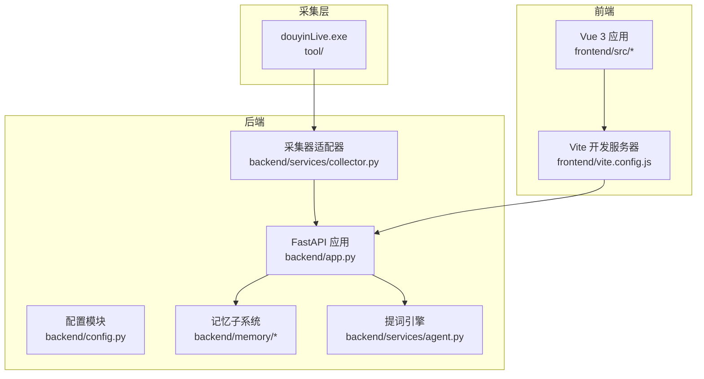
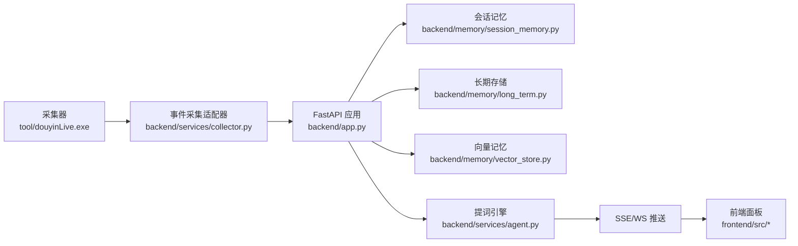
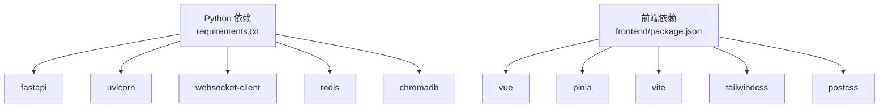

# 开发环境搭建

<cite>
**本文引用的文件**
- [README.md](file://README.md)
- [USAGE.md](file://USAGE.md)
- [requirements.txt](file://requirements.txt)
- [backend/config.py](file://backend/config.py)
- [backend/app.py](file://backend/app.py)
- [frontend/package.json](file://frontend/package.json)
- [frontend/vite.config.js](file://frontend/vite.config.js)
- [frontend/tailwind.config.js](file://frontend/tailwind.config.js)
- [frontend/postcss.config.js](file://frontend/postcss.config.js)
- [start_all.ps1](file://start_all.ps1)
- [start_backend_qwen.ps1](file://start_backend_qwen.ps1)
- [start_frontend.ps1](file://start_frontend.ps1)
</cite>

## 目录
1. [简介](#简介)
2. [项目结构](#项目结构)
3. [核心组件](#核心组件)
4. [架构总览](#架构总览)
5. [详细组件分析](#详细组件分析)
6. [依赖分析](#依赖分析)
7. [性能考虑](#性能考虑)
8. [故障排除指南](#故障排除指南)
9. [结论](#结论)
10. [附录](#附录)

## 简介
本指南面向在 Windows 10/11 上搭建 DouYin_llm 开发环境的开发者，涵盖以下内容：
- 系统与工具要求（Python 3.10+，推荐 3.11；Node.js 18+）
- 依赖安装流程（pip 安装后端 Python 包、npm 安装前端依赖）
- 环境变量配置（关键变量 ROOM_ID、LLM_API_KEY 等）
- 启动与验证步骤（采集器、后端、前端）
- 常见问题与解决方案
- IDE 配置建议（VS Code、PyCharm）

## 项目结构
该项目由三部分组成：
- 后端：基于 FastAPI 的实时处理服务，负责事件采集、记忆存储、LLM 提词与实时推送
- 前端：基于 Vue 3 + Vite 的可视化面板，通过代理访问后端接口
- 采集器：Windows 可执行文件，负责从抖音直播抓取 WebSocket 流

图表来源
- [backend/app.py:108-126](file://backend/app.py#L108-L126)
- [backend/config.py:40-76](file://backend/config.py#L40-L76)
- [frontend/vite.config.js:8-22](file://frontend/vite.config.js#L8-L22)

章节来源
- [README.md:32-44](file://README.md#L32-L44)
- [USAGE.md:15-23](file://USAGE.md#L15-L23)

## 核心组件
- 后端应用入口与生命周期管理
- 配置模块：从 .env 读取并解析运行时参数
- 记忆子系统：会话记忆、长期存储、向量记忆与嵌入服务
- 提词引擎：根据事件与上下文生成建议，支持在线模型与启发式规则
- 前端开发服务器：通过代理将 /api 与 /ws 请求转发至后端

章节来源
- [backend/app.py:108-126](file://backend/app.py#L108-L126)
- [backend/config.py:12-37](file://backend/config.py#L12-L37)
- [backend/config.py:40-112](file://backend/config.py#L40-L112)
- [frontend/vite.config.js:8-22](file://frontend/vite.config.js#L8-L22)

## 架构总览
系统通过采集器将直播事件标准化后，交由后端进行持久化、记忆抽取与提词生成，并通过 SSE/WS 推送至前端展示。

图表来源
- [README.md:7-17](file://README.md#L7-L17)
- [backend/app.py:73-102](file://backend/app.py#L73-L102)

章节来源
- [README.md:7-17](file://README.md#L7-L17)
- [backend/app.py:73-102](file://backend/app.py#L73-L102)

## 详细组件分析

### 环境与工具要求
- 操作系统：Windows 10/11（采集器为 Windows 可执行文件）
- Python：3.10+，推荐 3.11
- Node.js：18+（Vite 4 与原生 ES 模块）
- 可选依赖：Redis 6+（共享会话记忆）、Chroma 0.5+（向量索引）
- 在线模型：Qwen 或 OpenAI 兼容 API Key（若启用 LLM）

章节来源
- [README.md:46-52](file://README.md#L46-L52)
- [USAGE.md:15-22](file://USAGE.md#L15-L22)

### 依赖安装流程
- 安装 Python 依赖
  - 使用 pip 安装 requirements.txt 中的包
- 安装前端依赖
  - 进入 frontend 目录，使用 npm 安装依赖
- 可选：安装 Redis 与 Chroma（如需启用相应功能）

章节来源
- [requirements.txt:1-6](file://requirements.txt#L1-L6)
- [USAGE.md:73-87](file://USAGE.md#L73-L87)
- [frontend/package.json:11-21](file://frontend/package.json#L11-L21)

### 环境变量配置
- 创建 .env 文件并至少填写 ROOM_ID 与 LLM API Key（如 DASHSCOPE_API_KEY 或 LLM_API_KEY）
- 配置优先级：.env > 当前 shell > 代码默认值
- 常用变量（节选）：
  - ROOM_ID：当前监听的抖音直播间 ID
  - LLM_MODE：heuristic/qwen/openai
  - LLM_BASE_URL/LLM_MODEL/LLM_API_KEY：模型服务地址、模型名与密钥
  - DATA_DIR/DATABASE_PATH/CHROMA_DIR：数据与数据库位置
  - REDIS_URL：Redis 连接串（可选）
  - COLLECTOR_*：采集器相关参数（主机、端口、心跳等）

章节来源
- [README.md:62-67](file://README.md#L62-L67)
- [README.md:97-142](file://README.md#L97-L142)
- [backend/config.py:40-76](file://backend/config.py#L40-L76)
- [backend/config.py:57-67](file://backend/config.py#L57-L67)

### 启动与验证步骤
- 启动采集器
  - 运行 tool/douyinLive-windows-amd64.exe，确保监听 ws://127.0.0.1:1088/ws/{ROOM_ID}
- 准备 .env 并安装依赖
  - 复制 .env.example 为 .env，填写必要变量
  - 安装 Python 与前端依赖
- 启动后端
  - 使用 uvicorn 启动 FastAPI 应用（默认 127.0.0.1:8010）
- 启动前端
  - 进入 frontend，运行 npm run dev（默认 127.0.0.1:5173）
- 验证
  - 健康检查：http://127.0.0.1:8010/health
  - 前端页面：http://127.0.0.1:5173/
  - 状态条与来源标签用于判断模型/规则运行情况

章节来源
- [README.md:54-93](file://README.md#L54-L93)
- [USAGE.md:24-48](file://USAGE.md#L24-L48)
- [USAGE.md:89-114](file://USAGE.md#L89-L114)
- [USAGE.md:116-166](file://USAGE.md#L116-L166)
- [backend/app.py:129-135](file://backend/app.py#L129-L135)

### IDE 配置建议
- VS Code
  - 推荐插件：Python、Pylance、ESLint、Volar、Tailwind CSS IntelliSense
  - Python 解释器选择：指向已安装的 Python 3.11
  - 前端开发：在终端中进入 frontend 目录运行 npm 脚本
- PyCharm
  - 使用项目解释器指向 Python 3.11
  - 为 backend 与 tests 目录配置运行/调试配置
  - 前端开发：在 PyCharm 终端中切换到 frontend 目录执行 npm 脚本

章节来源
- [README.md:46-52](file://README.md#L46-L52)
- [USAGE.md:167-178](file://USAGE.md#L167-L178)

## 依赖分析
- 后端依赖
  - websocket-client：与采集器通信
  - fastapi/uvicorn：Web 服务框架与 ASGI 服务器
  - redis：可选，用于共享会话记忆
  - chromadb：可选，用于向量索引
- 前端依赖
  - vue/pinia：视图与状态管理
  - vite、tailwindcss、postcss：构建与样式管线

图表来源
- [requirements.txt:1-6](file://requirements.txt#L1-L6)
- [frontend/package.json:11-21](file://frontend/package.json#L11-L21)

章节来源
- [requirements.txt:1-6](file://requirements.txt#L1-L6)
- [frontend/package.json:11-21](file://frontend/package.json#L11-L21)

## 性能考虑
- 本地开发时建议使用 CPU 运行本地嵌入模型，避免 GPU 依赖
- 合理设置 LLM 超时与最大 token 数，平衡延迟与质量
- 向量检索的相似度阈值与召回数量可根据数据规模调整
- 前端代理仅用于开发阶段，生产部署应通过反向代理统一暴露后端接口

章节来源
- [backend/config.py:64-76](file://backend/config.py#L64-L76)
- [frontend/vite.config.js:8-22](file://frontend/vite.config.js#L8-L22)

## 故障排除指南
- 页面打开但无建议
  - 检查采集器是否已启动、ROOM_ID 是否正确、直播间是否开播、后端是否已重启
- 顶部显示 fallback
  - 检查 LLM API Key 是否正确、网络是否可达、是否存在超时或限流
- 顶部显示 heuristic
  - 检查 .env 中 LLM_MODE 是否被设置为 heuristic，或 .env 未正确加载
- 前端无法启动
  - 检查 start_frontend.ps1 是否正常、5173 端口是否被占用
- 后端启动但未写入数据
  - 检查采集器是否运行、后端日志是否连接到 ws://127.0.0.1:1088/ws/{room_id}、房间是否有消息

章节来源
- [USAGE.md:198-240](file://USAGE.md#L198-L240)

## 结论
按照本指南完成环境准备与依赖安装后，即可在 Windows 10/11 上成功启动采集器、后端与前端，并通过健康检查与页面验证确认系统运行状态。建议在开发过程中结合 IDE 插件提升效率，并根据实际需求启用 Redis 与 Chroma 以增强记忆与检索能力。

## 附录

### 环境变量清单（节选）
- ROOM_ID：当前监听的抖音直播间 ID
- LLM_MODE：heuristic/qwen/openai
- LLM_BASE_URL/LLM_MODEL/LLM_API_KEY：模型服务地址、模型名与密钥
- DATA_DIR/DATABASE_PATH/CHROMA_DIR：数据与数据库位置
- REDIS_URL：Redis 连接串（可选）
- COLLECTOR_*：采集器相关参数（主机、端口、心跳等）

章节来源
- [README.md:97-142](file://README.md#L97-L142)
- [backend/config.py:40-76](file://backend/config.py#L40-L76)

### 启动脚本说明
- start_all.ps1：同时启动后端与前端
- start_backend_qwen.ps1：启动后端（内置采集器与 Qwen 在线模式）
- start_frontend.ps1：安装前端依赖并启动开发服务器

章节来源
- [start_all.ps1:1-18](file://start_all.ps1#L1-L18)
- [start_backend_qwen.ps1:1-13](file://start_backend_qwen.ps1#L1-L13)
- [start_frontend.ps1:1-22](file://start_frontend.ps1#L1-L22)