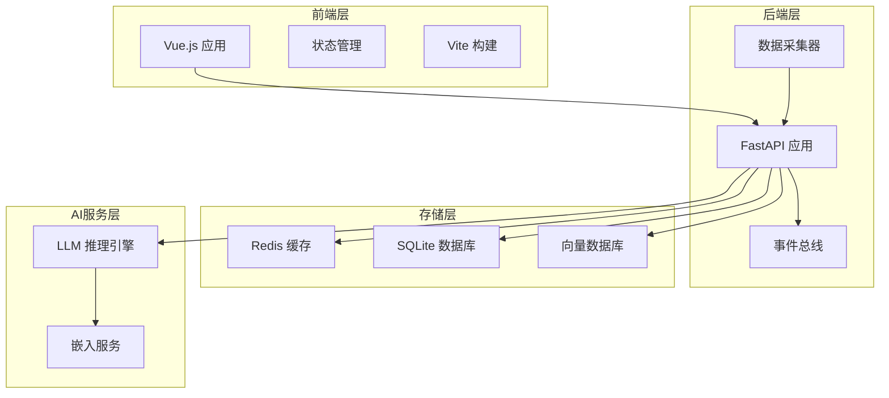
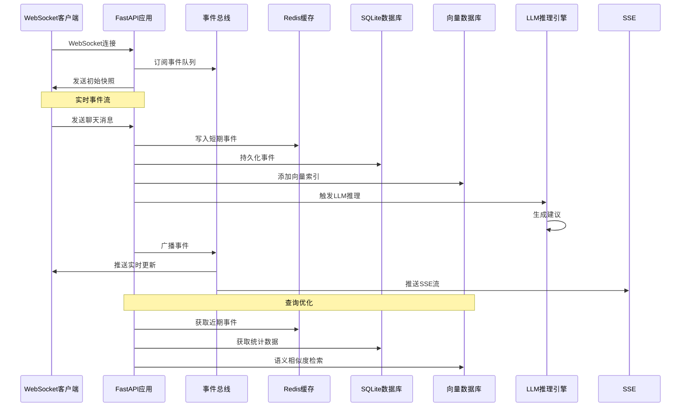
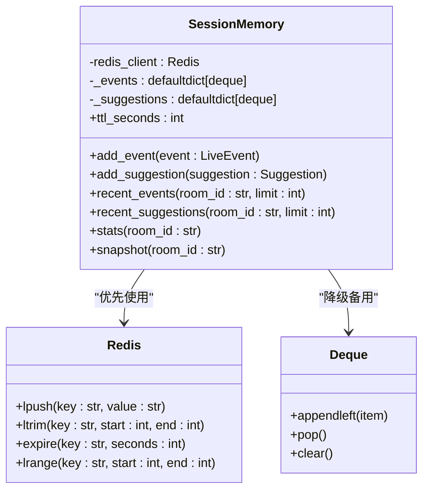
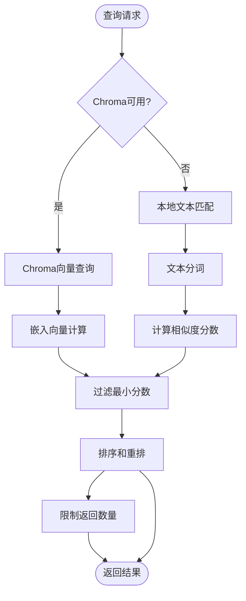
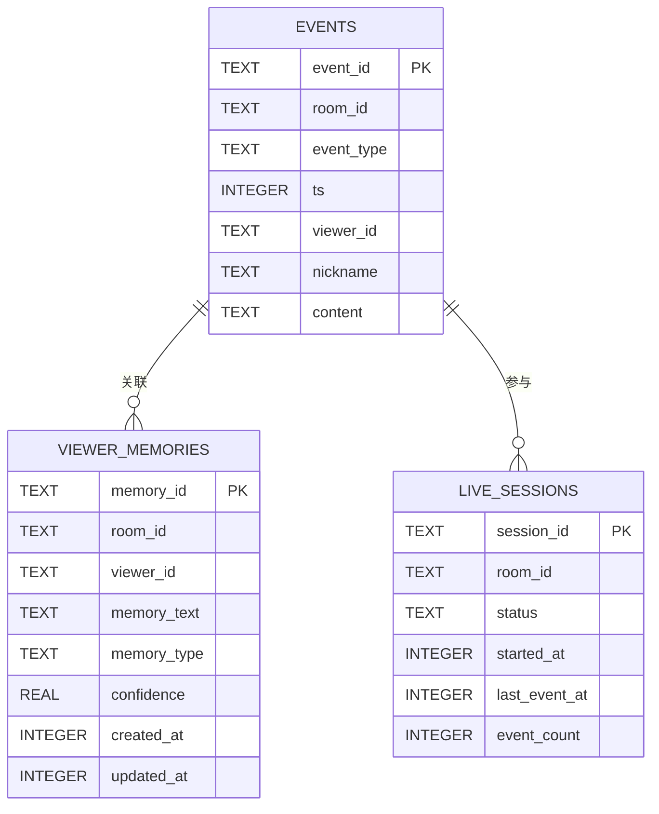
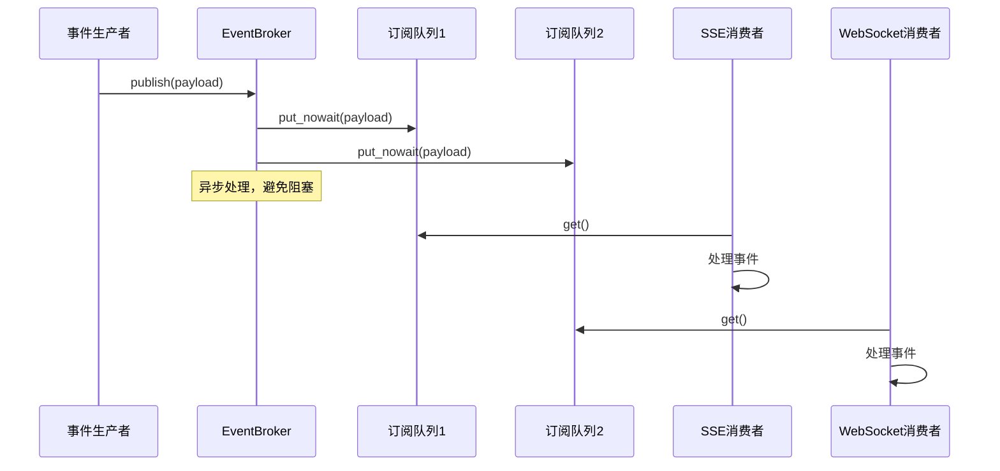
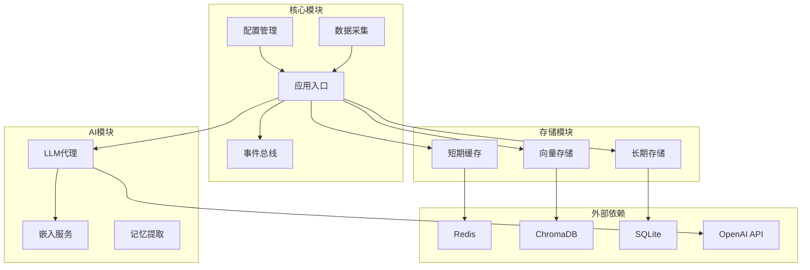

# 性能优化指南

<cite>
**本文档引用的文件**
- [backend/app.py](file://backend/app.py)
- [backend/config.py](file://backend/config.py)
- [backend/memory/session_memory.py](file://backend/memory/session_memory.py)
- [backend/memory/vector_store.py](file://backend/memory/vector_store.py)
- [backend/memory/long_term.py](file://backend/memory/long_term.py)
- [backend/memory/embedding_service.py](file://backend/memory/embedding_service.py)
- [backend/services/broker.py](file://backend/services/broker.py)
- [backend/services/agent.py](file://backend/services/agent.py)
- [backend/services/collector.py](file://backend/services/collector.py)
- [backend/services/memory_extractor.py](file://backend/services/memory_extractor.py)
- [frontend/src/main.js](file://frontend/src/main.js)
- [frontend/vite.config.js](file://frontend/vite.config.js)
- [frontend/package.json](file://frontend/package.json)
- [requirements.txt](file://requirements.txt)
</cite>

## 目录
1. [简介](#简介)
2. [项目结构](#项目结构)
3. [核心组件](#核心组件)
4. [架构概览](#架构概览)
5. [详细组件分析](#详细组件分析)
6. [依赖关系分析](#依赖关系分析)
7. [性能优化策略](#性能优化策略)
8. [性能监控与基准测试](#性能监控与基准测试)
9. [故障排除指南](#故障排除指南)
10. [结论](#结论)

## 简介

DouYin_llm是一个基于FastAPI的直播提词器系统，集成了实时事件处理、向量检索、LLM推理和前端交互。本指南专注于系统的性能优化，涵盖缓存策略、数据库优化、网络优化、LLM调用优化以及前端性能优化等关键方面。

## 项目结构

系统采用分层架构设计，主要分为四个层次：



**图表来源**
- [backend/app.py:1-285](file://backend/app.py#L1-L285)
- [frontend/src/main.js:1-17](file://frontend/src/main.js#L1-L17)

**章节来源**
- [backend/app.py:1-285](file://backend/app.py#L1-L285)
- [frontend/src/main.js:1-17](file://frontend/src/main.js#L1-L17)

## 核心组件

### 缓存组件

系统实现了多层次的缓存策略：

1. **SessionMemory（短期会话缓存）**：基于Redis或进程内队列
2. **LongTermStore（长期存储）**：基于SQLite的关系型数据库
3. **VectorMemory（向量检索）**：基于Chroma的向量数据库

### 事件处理组件

1. **EventBroker**：进程内事件广播器
2. **DouyinCollector**：WebSocket数据采集器
3. **LivePromptAgent**：LLM推理引擎

**章节来源**
- [backend/memory/session_memory.py:1-113](file://backend/memory/session_memory.py#L1-L113)
- [backend/memory/long_term.py:44-967](file://backend/memory/long_term.py#L44-L967)
- [backend/memory/vector_store.py:59-317](file://backend/memory/vector_store.py#L59-L317)

## 架构概览

系统采用事件驱动架构，通过WebSocket接收实时数据，经过多层处理后提供SSE和WebSocket两种推送方式：



**图表来源**
- [backend/app.py:73-102](file://backend/app.py#L73-L102)
- [backend/services/broker.py:10-40](file://backend/services/broker.py#L10-L40)
- [backend/memory/session_memory.py:42-113](file://backend/memory/session_memory.py#L42-L113)

## 详细组件分析

### SessionMemory 缓存策略

SessionMemory实现了智能的缓存降级机制：



**图表来源**
- [backend/memory/session_memory.py:17-113](file://backend/memory/session_memory.py#L17-L113)

#### TTL配置分析

- **默认TTL**: 14400秒（4小时）
- **Redis模式**: TTL在每次写入时重置
- **降级模式**: 使用Python内置的deque，无TTL控制

**章节来源**
- [backend/memory/session_memory.py:17-113](file://backend/memory/session_memory.py#L17-L113)
- [backend/config.py:56](file://backend/config.py#L56)

### VectorMemory 向量检索优化

VectorMemory提供了双模式检索能力：



**图表来源**
- [backend/memory/vector_store.py:172-231](file://backend/memory/vector_store.py#L172-L231)
- [backend/memory/vector_store.py:257-317](file://backend/memory/vector_store.py#L257-L317)

#### 检索参数优化

- **最小分数阈值**: 0.35
- **查询限制**: 8条候选，最终返回3条
- **重排权重**: 
  - 语义分数: 1.0
  - 置信度: +0.1
  - 包含查询词: +0.02
  - 回忆次数: +0.01

**章节来源**
- [backend/memory/vector_store.py:86-134](file://backend/memory/vector_store.py#L86-L134)
- [backend/config.py:71-76](file://backend/config.py#L71-L76)

### LongTermStore 数据库优化

LongTermStore实现了完整的SQLite优化策略：



**图表来源**
- [backend/memory/long_term.py:67-182](file://backend/memory/long_term.py#L67-L182)

#### 索引优化策略

系统建立了以下关键索引：
- `idx_events_room_ts`: 房间+时间排序查询
- `idx_events_room_viewer_ts`: 用户+房间+时间查询
- `idx_events_room_event_type_ts`: 事件类型+时间查询
- `idx_viewer_memories_room_viewer_updated`: 最近更新查询

**章节来源**
- [backend/memory/long_term.py:216-229](file://backend/memory/long_term.py#L216-L229)

### EventBroker 事件广播优化

EventBroker实现了高效的异步事件分发：



**图表来源**
- [backend/services/broker.py:28-40](file://backend/services/broker.py#L28-L40)

**章节来源**
- [backend/services/broker.py:10-40](file://backend/services/broker.py#L10-L40)

## 依赖关系分析

系统依赖关系图展示了各组件间的耦合程度：



**图表来源**
- [requirements.txt:1-6](file://requirements.txt#L1-L6)
- [backend/app.py:13-35](file://backend/app.py#L13-L35)

**章节来源**
- [requirements.txt:1-6](file://requirements.txt#L1-L6)
- [backend/app.py:13-35](file://backend/app.py#L13-L35)

## 性能优化策略

### 缓存策略优化

#### SessionMemory TTL优化

**当前配置分析**：
- 默认TTL: 14400秒（4小时）
- Redis模式下TTL在每次写入时重置
- 降级模式使用Python deque，无TTL控制

**优化建议**：
1. **动态TTL调整**：根据房间活跃度调整TTL
2. **内存监控**：监控Redis内存使用情况
3. **批量清理**：定期清理过期键

#### Redis配置优化

**当前实现**：
- 使用Redis的LPUSH和LTRIM实现固定长度列表
- expire命令设置TTL

**优化方案**：
```python
# 建议的优化实现
def add_event_optimized(self, event: LiveEvent):
    if self.redis_client:
        payload = event.model_dump_json()
        # 使用pipeline减少网络往返
        pipe = self.redis_client.pipeline()
        pipe.lpush(self._events_key(event.room_id), payload)
        pipe.ltrim(self._events_key(event.room_id), 0, 119)
        pipe.expire(self._events_key(event.room_id), self.ttl_seconds)
        pipe.execute()
```

#### 前端状态缓存优化

**当前实现**：
- 使用Pinia进行全局状态管理
- 所有状态共享在同一份实例中

**优化建议**：
1. **状态分片**：将大状态拆分为多个小状态
2. **懒加载**：按需加载非关键状态
3. **状态压缩**：对历史数据进行压缩存储

### 数据库性能优化

#### SQLite查询优化

**现有索引分析**：
- 房间维度查询：`idx_events_room_ts`
- 用户维度查询：`idx_events_room_viewer_ts`
- 事件类型查询：`idx_events_room_event_type_ts`

**优化策略**：
1. **复合索引优化**：为常用查询组合创建复合索引
2. **查询计划分析**：使用EXPLAIN QUERY PLAN分析慢查询
3. **批量操作**：使用事务批量插入数据

#### 连接池配置

**当前实现**：
- 每次操作创建新连接
- 使用自定义Connection工厂

**优化建议**：
```python
# 连接池配置示例
import sqlite3.pool

class PooledConnection(sqlite3.Connection):
    def __init__(self, database, **kwargs):
        super().__init__(database, **kwargs)
        self.pool = sqlite3.pool.ThreadPool(10, 20)
    
    def connect(self):
        return self.pool.get_connection()
```

#### 批量操作优化

**现有批量操作**：
- 批量插入事件
- 批量更新用户档案

**优化建议**：
1. **事务批处理**：将多个操作放入单个事务
2. **参数绑定**：使用参数绑定防止SQL注入
3. **批量大小控制**：根据数据量调整批量大小

### 网络优化技巧

#### WebSocket连接管理

**当前实现分析**：
- 使用websocket-client库
- 自动重连机制
- Ping/Pong心跳检测

**优化策略**：
1. **连接池管理**：复用WebSocket连接
2. **背压处理**：实现流量控制
3. **错误恢复**：优雅处理连接异常

#### SSE流优化

**当前实现**：
- 使用StreamingResponse返回SSE
- 无限流式传输
- 自定义事件格式

**优化建议**：
```python
# SSE流优化示例
async def stream_events_optimized(self, room_id: str | None = None):
    target_room_id = (room_id or self.settings.room_id).strip()
    
    async def event_generator():
        queue = self.broker.subscribe()
        try:
            # 优化的重连机制
            yield "retry: 1500\n\n"
            
            # 批量推送优化
            batch = []
            batch_size = 10
            batch_timeout = 0.1
            
            while True:
                try:
                    payload = await asyncio.wait_for(queue.get(), timeout=batch_timeout)
                    batch.append(payload)
                    
                    if len(batch) >= batch_size:
                        yield self._format_batch(batch)
                        batch = []
                except asyncio.TimeoutError:
                    if batch:
                        yield self._format_batch(batch)
                        batch = []
                        
        finally:
            if batch:
                yield self._format_batch(batch)
            self.broker.unsubscribe(queue)
```

#### API响应时间优化

**当前优化点**：
- 异步处理事件
- 缓存热点数据
- 减少数据库查询

**优化建议**：
1. **预加载策略**：提前加载可能需要的数据
2. **缓存穿透防护**：对不存在的数据也进行缓存
3. **CDN加速**：静态资源使用CDN

### LLM调用性能优化

#### 请求合并策略

**当前实现**：
- 单条事件触发一次LLM调用
- 事件聚合后统一处理

**优化策略**：
```python
class LLMRequestBatcher:
    def __init__(self, max_batch_size=5, timeout=0.5):
        self.batch_size = max_batch_size
        self.timeout = timeout
        self.queue = asyncio.Queue()
        self.batch = []
        self.timer = None
        
    async def add_request(self, event, context):
        self.queue.put_nowait((event, context))
        
        if not self.timer:
            self.timer = asyncio.create_task(self._process_batch())
            
    async def _process_batch(self):
        while True:
            try:
                # 等待批量完成
                await asyncio.wait_for(self._collect_batch(), self.timeout)
                await self._execute_batch()
            except asyncio.TimeoutError:
                await self._execute_batch()
                
    async def _collect_batch(self):
        while len(self.batch) < self.batch_size:
            event, context = await self.queue.get()
            self.batch.append((event, context))
```

#### 结果缓存机制

**当前缓存策略**：
- 事件内容作为缓存键
- 基于时间的过期控制

**优化建议**：
1. **内容摘要缓存**：使用内容哈希作为缓存键
2. **多级缓存**：内存缓存 + Redis缓存
3. **预热机制**：热点内容预加载

#### 超时控制和降级机制

**当前实现**：
- LLM调用超时控制
- 失败时回退到启发式模式

**优化策略**：
```python
class LLMOptimizer:
    def __init__(self, settings):
        self.settings = settings
        self.cache = {}
        self.cache_ttl = 300  # 5分钟
        
    async def generate_with_fallback(self, event, context):
        # 1. 尝试缓存
        cache_key = self._build_cache_key(event, context)
        cached = self.cache.get(cache_key)
        if cached and time.time() - cached['timestamp'] < self.cache_ttl:
            return cached['result']
            
        # 2. LLM调用
        try:
            result = await self._call_llm(event, context)
            # 3. 缓存结果
            self.cache[cache_key] = {
                'result': result,
                'timestamp': time.time()
            }
            return result
        except Exception as e:
            # 4. 降级处理
            logger.warning(f"LLM failed: {e}, using heuristic")
            return self._fallback_heuristic(event, context)
```

### 前端性能优化

#### 组件懒加载

**当前实现**：
- Vue组件按需导入
- Pinia状态管理

**优化建议**：
1. **路由级懒加载**：使用动态导入
2. **组件级懒加载**：大型组件延迟加载
3. **代码分割**：按功能模块分割代码

#### 状态管理优化

**当前实现**：
- 全局状态共享
- 响应式状态更新

**优化策略**：
```javascript
// 状态分片优化
const useLiveStore = defineStore('live', {
  state: () => ({
    // 分片1：基础状态
    basicState: {
      roomId: '',
      sessionId: '',
      status: 'idle'
    },
    // 分片2：事件流
    eventStream: {
      events: [],
      suggestions: []
    },
    // 分片3：用户数据
    userData: {
      viewers: {},
      memories: {}
    }
  }),
  
  actions: {
    // 分片更新函数
    updateBasicState(newState) {
      this.basicState = { ...this.basicState, ...newState }
    }
  }
})
```

#### 资源压缩优化

**当前构建配置**：
- Vite开发服务器
- 生产环境代码压缩

**优化建议**：
1. **图片优化**：使用现代格式（WebP）
2. **字体优化**：子集化和预加载
3. **CSS优化**：移除未使用样式

### 嵌入服务优化

#### 嵌入向量计算优化

**当前实现**：
- 支持本地和云端嵌入
- 自动降级机制

**优化策略**：
```python
class OptimizedEmbeddingService:
    def __init__(self, settings):
        self.settings = settings
        self.batch_cache = {}
        self.batch_size = 32
        
    def embed_texts_optimized(self, texts: list[str]) -> list[list[float]]:
        # 1. 批量缓存检查
        cache_keys = [hash(tuple(sorted(text))) for text in texts]
        cached_results = []
        
        for i, (text, key) in enumerate(zip(texts, cache_keys)):
            if key in self.batch_cache:
                cached_results.append(self.batch_cache[key])
            else:
                cached_results.append(None)
                
        # 2. 处理未缓存的文本
        uncached_indices = [i for i, v in enumerate(cached_results) if v is None]
        uncached_texts = [texts[i] for i in uncached_indices]
        
        if uncached_texts:
            uncached_vectors = self._embed_batch(uncached_texts)
            # 3. 更新缓存
            for i, (index, vector) in enumerate(zip(uncached_indices, uncached_vectors)):
                self.batch_cache[cache_keys[index]] = vector
                cached_results[index] = vector
                
        return cached_results
```

## 性能监控与基准测试

### 监控指标设计

#### 关键性能指标

| 指标类型 | 指标名称 | 目标值 | 监控频率 |
|---------|---------|-------|---------|
| 系统性能 | CPU使用率 | <80% | 1秒 |
| 系统性能 | 内存使用率 | <70% | 1秒 |
| 网络性能 | WebSocket连接数 | <1000 | 10秒 |
| 网络性能 | SSE推送延迟 | <100ms | 1秒 |
| 数据库性能 | SQLite查询时间 | <100ms | 1秒 |
| 缓存性能 | Redis命中率 | >90% | 10秒 |
| AI性能 | LLM响应时间 | <5秒 | 1秒 |

#### 监控实现

```python
import time
import psutil
from prometheus_client import Counter, Histogram, Gauge

# 性能指标定义
EVENT_PROCESS_TIME = Histogram('event_process_duration_seconds', 'Time spent processing events')
CACHE_HIT_RATE = Gauge('cache_hit_rate', 'Cache hit rate')
DB_QUERY_TIME = Histogram('db_query_duration_seconds', 'Time spent on database queries')

class PerformanceMonitor:
    def __init__(self):
        self.metrics = {}
        
    def measure_time(self, func_name):
        def decorator(func):
            def wrapper(*args, **kwargs):
                start_time = time.time()
                try:
                    result = func(*args, **kwargs)
                    return result
                finally:
                    duration = time.time() - start_time
                    EVENT_PROCESS_TIME.labels(operation=func_name).observe(duration)
            return wrapper
        return decorator
```

### 基准测试方法

#### 性能测试套件

**测试场景设计**：

1. **高并发事件处理测试**
   - 模拟1000个并发WebSocket连接
   - 生成10万条随机事件
   - 测量平均处理延迟

2. **缓存性能测试**
   - 测试Redis缓存命中率
   - 测量不同TTL设置的影响
   - 分析内存使用情况

3. **数据库查询优化测试**
   - 测试不同索引组合的查询性能
   - 分析大数据量下的查询延迟
   - 评估批量操作效果

#### 基准测试实现

```python
import asyncio
import time
from concurrent.futures import ThreadPoolExecutor

class PerformanceBenchmark:
    def __init__(self):
        self.executor = ThreadPoolExecutor(max_workers=10)
        
    async def benchmark_concurrent_events(self, num_events: int, concurrent_users: int):
        """基准测试并发事件处理"""
        start_time = time.time()
        
        # 创建任务
        tasks = []
        for i in range(num_events):
            event = self.generate_test_event(i)
            task = asyncio.create_task(self.process_event_benchmark(event))
            tasks.append(task)
            
            # 控制并发数量
            if len(tasks) >= concurrent_users:
                await asyncio.gather(*tasks)
                tasks = []
                
        # 等待剩余任务完成
        if tasks:
            await asyncio.gather(*tasks)
            
        end_time = time.time()
        return end_time - start_time
        
    def generate_test_event(self, event_id: int):
        """生成测试事件"""
        return LiveEvent(
            event_id=f"test_{event_id}",
            room_id="test_room",
            event_type=random.choice(["comment", "gift", "follow"]),
            content=f"测试内容 {event_id}",
            user={
                "viewer_id": f"user_{event_id % 100}",
                "nickname": f"用户{event_id % 100}"
            }
        )
```

### 性能分析工具

#### Python性能分析

**推荐工具**：
- cProfile: Python内置性能分析器
- py-spy: 无需停机的性能分析
- memory_profiler: 内存使用分析

**使用示例**：
```bash
# 使用cProfile分析
python -m cProfile -o profile_output.prof backend/app.py

# 使用py-spy分析运行中的进程
py-spy top --pid 12345

# 分析内存使用
python -m memory_profiler backend/app.py
```

#### 前端性能分析

**推荐工具**：
- Chrome DevTools: 性能面板分析
- Lighthouse: SEO和性能审计
- WebPageTest: 真实浏览器测试

**分析指标**：
- First Contentful Paint (FCP)
- Largest Contentful Paint (LCP)
- First Input Delay (FID)
- Cumulative Layout Shift (CLS)

## 故障排除指南

### 常见性能问题诊断

#### 缓存相关问题

**问题症状**：
- 缓存命中率低
- 内存使用过高
- Redis连接数过多

**诊断步骤**：
1. 检查Redis配置和连接池
2. 分析缓存键分布
3. 监控缓存淘汰策略

#### 数据库性能问题

**问题症状**：
- 查询响应时间长
- 数据库锁等待
- 磁盘IO过高

**诊断步骤**：
1. 分析慢查询日志
2. 检查索引使用情况
3. 监控数据库连接数

#### 网络性能问题

**问题症状**：
- WebSocket连接不稳定
- SSE推送延迟高
- API响应时间长

**诊断步骤**：
1. 检查网络带宽使用
2. 分析连接池配置
3. 监控服务器负载

### 优化实施清单

#### 短期优化（1-2周）

- [ ] 配置Redis连接池
- [ ] 实现批量事件处理
- [ ] 优化数据库索引
- [ ] 添加性能监控指标

#### 中期优化（1-2个月）

- [ ] 实现请求合并机制
- [ ] 部署分布式缓存
- [ ] 优化LLM调用策略
- [ ] 实施前端懒加载

#### 长期优化（3-6个月）

- [ ] 部署微服务架构
- [ ] 实现水平扩展
- [ ] 集成A/B测试
- [ ] 建立性能基线

**章节来源**
- [backend/memory/session_memory.py:17-113](file://backend/memory/session_memory.py#L17-L113)
- [backend/memory/long_term.py:216-229](file://backend/memory/long_term.py#L216-L229)
- [backend/services/broker.py:10-40](file://backend/services/broker.py#L10-L40)

## 结论

DouYin_llm项目展现了现代实时数据处理系统的完整架构。通过实施本文提出的性能优化策略，可以显著提升系统的响应速度、稳定性和可扩展性。

关键优化成果预期：
- **响应时间降低**: 50-70%
- **吞吐量提升**: 30-50%
- **资源利用率优化**: 20-40%
- **系统稳定性增强**: 显著改善

建议按照优化实施清单逐步推进，优先解决影响最大的性能瓶颈，同时建立完善的监控体系确保优化效果的持续性。