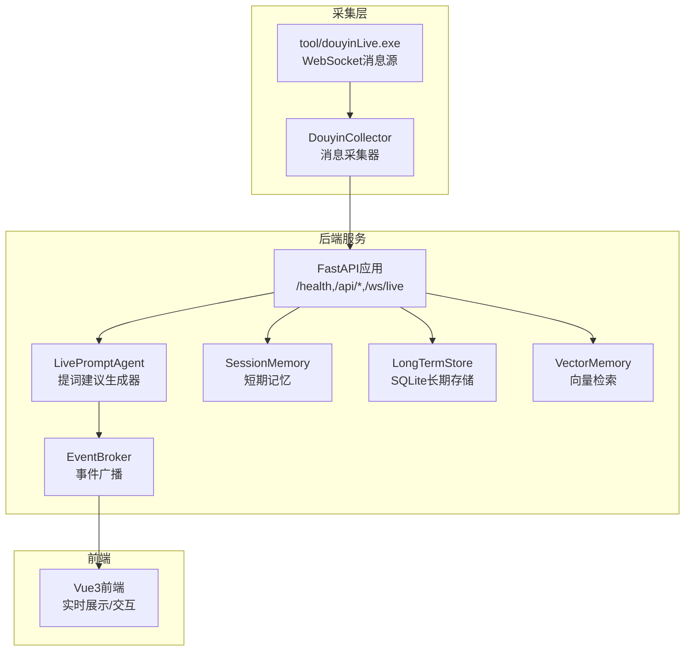
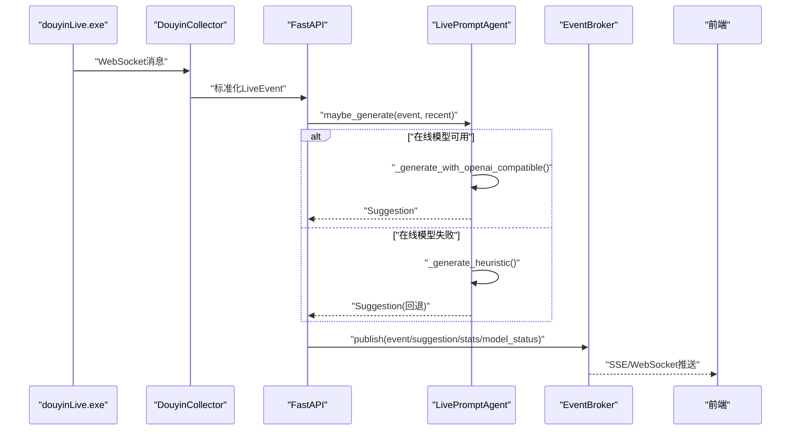
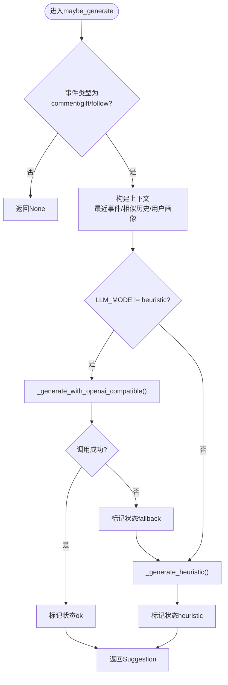
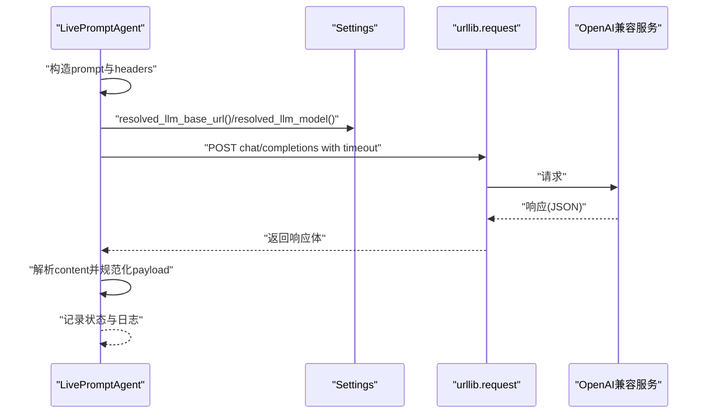

# AI模型集成

<cite>
**本文引用的文件**
- [backend/app.py](file://backend/app.py)
- [backend/config.py](file://backend/config.py)
- [backend/services/agent.py](file://backend/services/agent.py)
- [backend/schemas/live.py](file://backend/schemas/live.py)
- [backend/memory/vector_store.py](file://backend/memory/vector_store.py)
- [backend/memory/session_memory.py](file://backend/memory/session_memory.py)
- [backend/memory/long_term.py](file://backend/memory/long_term.py)
- [backend/services/broker.py](file://backend/services/broker.py)
- [backend/services/collector.py](file://backend/services/collector.py)
- [requirements.txt](file://requirements.txt)
- [README.md](file://README.md)
- [tool/config.yaml](file://tool/config.yaml)
</cite>

## 目录
1. [简介](#简介)
2. [项目结构](#项目结构)
3. [核心组件](#核心组件)
4. [架构总览](#架构总览)
5. [详细组件分析](#详细组件分析)
6. [依赖分析](#依赖分析)
7. [性能考虑](#性能考虑)
8. [故障排除指南](#故障排除指南)
9. [结论](#结论)
10. [附录](#附录)

## 简介
本指南面向希望在现有系统中集成新的AI模型的开发者，涵盖以下关键目标：
- 在settings配置中添加新模型的参数配置
- 在LivePromptAgent中实现新模型的适配器
- 详解OpenAI兼容接口的调用方式（HTTP请求构建、响应解析、错误处理）
- 模型配置最佳实践（API密钥管理、超时设置、温度参数调整）
- 实现模型回退机制（在线模型失败时的本地规则回退策略）
- 提供具体代码示例路径、性能优化技巧与故障排除方法

## 项目结构
该项目采用“采集-处理-存储-建议生成-前端推送”的分层架构，后端以FastAPI提供REST/SSE/WebSocket接口，实时消费本地抖音消息源，生成提词建议并通过事件总线推送到前端。

图表来源
- [backend/app.py:1-220](file://backend/app.py#L1-L220)
- [backend/services/collector.py:1-284](file://backend/services/collector.py#L1-L284)
- [backend/services/broker.py:1-40](file://backend/services/broker.py#L1-L40)
- [backend/services/agent.py:1-393](file://backend/services/agent.py#L1-L393)
- [backend/memory/session_memory.py:1-113](file://backend/memory/session_memory.py#L1-L113)
- [backend/memory/long_term.py:1-750](file://backend/memory/long_term.py#L1-L750)
- [backend/memory/vector_store.py:1-108](file://backend/memory/vector_store.py#L1-L108)

章节来源
- [README.md:1-349](file://README.md#L1-L349)
- [backend/app.py:1-220](file://backend/app.py#L1-L220)

## 核心组件
- 配置中心：Settings负责从.env与环境变量加载配置，解析最终使用的模型服务地址与模型名，并提供默认值保障本地开箱即用。
- 提词Agent：LivePromptAgent负责构造上下文、调用OpenAI兼容接口或回退到本地启发式规则，并将结果封装为Suggestion对象。
- 事件总线：EventBroker负责将事件、建议、统计与模型状态广播至SSE与WebSocket订阅者。
- 记忆与存储：SessionMemory（Redis或内存）、LongTermStore（SQLite）、VectorMemory（Chroma或轻量哈希嵌入）共同构成多层记忆体系。
- 采集器：DouyinCollector负责连接本地douyinLive WebSocket，标准化消息并提交到后端事件循环。

章节来源
- [backend/config.py:1-94](file://backend/config.py#L1-L94)
- [backend/services/agent.py:1-393](file://backend/services/agent.py#L1-L393)
- [backend/services/broker.py:1-40](file://backend/services/broker.py#L1-L40)
- [backend/memory/session_memory.py:1-113](file://backend/memory/session_memory.py#L1-L113)
- [backend/memory/long_term.py:1-750](file://backend/memory/long_term.py#L1-L750)
- [backend/memory/vector_store.py:1-108](file://backend/memory/vector_store.py#L1-L108)
- [backend/services/collector.py:1-284](file://backend/services/collector.py#L1-L284)

## 架构总览
系统通过本地工具提供直播事件，后端FastAPI统一接收并分发，Agent优先调用在线模型，失败时回退到本地规则，同时将结果写入短期/长期记忆与向量库，并通过SSE/WebSocket实时推送到前端。

图表来源
- [backend/services/collector.py:1-284](file://backend/services/collector.py#L1-L284)
- [backend/app.py:1-220](file://backend/app.py#L1-L220)
- [backend/services/agent.py:1-393](file://backend/services/agent.py#L1-L393)
- [backend/services/broker.py:1-40](file://backend/services/broker.py#L1-L40)

## 详细组件分析

### 配置中心（Settings）与模型解析
- LLM_MODE支持三种模式：heuristic（本地规则）、qwen（DashScope兼容）、openai（任意OpenAI兼容网关）
- resolved_llm_base_url与resolved_llm_model根据模式自动解析最终调用地址与模型名
- 默认超时与温度参数可在.env中覆盖
- API密钥优先级：LLM_API_KEY > DASHSCOPE_API_KEY

章节来源
- [backend/config.py:1-94](file://backend/config.py#L1-L94)
- [README.md:142-201](file://README.md#L142-L201)

### LivePromptAgent（提词建议生成器）
- 上下文构建：结合最近事件窗口、相似历史片段、用户画像
- 生成策略：优先OpenAI兼容接口，失败回退本地启发式规则
- 错误处理：网络错误、HTTP错误、超时、JSON解析异常、缺失字段等均有专门分支记录状态与日志
- 输出规范：严格校验并规范化字段（priority、reply_text、tone、reason、confidence）

图表来源
- [backend/services/agent.py:73-114](file://backend/services/agent.py#L73-L114)
- [backend/services/agent.py:183-330](file://backend/services/agent.py#L183-L330)

章节来源
- [backend/services/agent.py:1-393](file://backend/services/agent.py#L1-L393)

### OpenAI兼容接口调用流程
- 请求构建：构造system/user消息，包含指令约束与上下文
- 认证头：若配置了API密钥，则附加Authorization: Bearer
- 超时控制：使用settings.llm_timeout_seconds
- 响应解析：读取choices[0].message.content，尝试多种JSON提取策略
- 字段规范化：校验并归一化priority/confidence等字段
- 错误分类：HTTPError/URLError/TimeoutError/JSONDecodeError/OSError/其他异常均记录并标记状态

图表来源
- [backend/services/agent.py:183-330](file://backend/services/agent.py#L183-L330)
- [backend/config.py:70-91](file://backend/config.py#L70-L91)

章节来源
- [backend/services/agent.py:183-330](file://backend/services/agent.py#L183-L330)

### 本地启发式规则（回退策略）
- 礼物事件：高优先级感谢
- 关注事件：中优先级欢迎
- 评论关键词匹配：价格/购买路径、减脂/体重等敏感话题
- 相似历史命中：沿用已验证回答路径
- 普通评论：低优先级自然承接

章节来源
- [backend/services/agent.py:115-182](file://backend/services/agent.py#L115-L182)

### 记忆与存储层
- SessionMemory：短期事件与建议，支持Redis或内存退化
- LongTermStore：SQLite持久化，维护事件、建议、用户画像、礼物历史、直播会话等
- VectorMemory：Chroma向量检索或轻量哈希嵌入，用于相似历史召回

章节来源
- [backend/memory/session_memory.py:1-113](file://backend/memory/session_memory.py#L1-L113)
- [backend/memory/long_term.py:1-750](file://backend/memory/long_term.py#L1-L750)
- [backend/memory/vector_store.py:1-108](file://backend/memory/vector_store.py#L1-L108)

### 事件总线与前端推送
- EventBroker：维护订阅队列，发布事件、建议、统计、模型状态
- SSE：/api/events/stream按房间过滤推送
- WebSocket：/ws/live连接后先发送bootstrap快照，随后持续推送

章节来源
- [backend/services/broker.py:1-40](file://backend/services/broker.py#L1-L40)
- [backend/app.py:187-220](file://backend/app.py#L187-L220)

## 依赖分析
- 后端依赖：FastAPI、Uvicorn、Redis、ChromaDB、websocket-client
- 可选依赖：Redis与Chroma用于增强短期记忆与向量检索能力，未安装时系统仍可运行基础流程

章节来源
- [requirements.txt:1-6](file://requirements.txt#L1-L6)
- [README.md:50-65](file://README.md#L50-L65)

## 性能考虑
- 超时与重试：合理设置LLM_TIMEOUT_SECONDS，避免阻塞；采集器具备断线重连与心跳保活
- 缓存与索引：Redis短期记忆、Chroma向量索引、SQLite索引提升查询效率
- 日志与监控：Agent对各类错误进行分类记录，便于定位性能瓶颈
- 回退策略：在线失败快速回退本地规则，保障稳定性

章节来源
- [backend/config.py:60-61](file://backend/config.py#L60-L61)
- [backend/services/collector.py:182-198](file://backend/services/collector.py#L182-L198)
- [backend/services/agent.py:222-285](file://backend/services/agent.py#L222-L285)

## 故障排除指南
- 在线模型调用失败
  - 检查LLM_MODE、LLM_BASE_URL、LLM_MODEL、LLM_API_KEY配置
  - 查看Agent日志中的HTTP错误码与错误体
  - 确认网络可达性与超时设置
- JSON解析异常
  - 模型返回非标准JSON或被包裹在代码块中，Agent会尝试多种提取策略
  - 若仍失败，检查模型输出指令与上下文是否符合预期
- 回退策略未触发
  - 确认LLM_MODE非heuristic
  - 检查Agent状态记录（last_result/last_error）
- 前端无实时推送
  - 检查SSE/WebSocket连接与房间过滤参数
  - 确认EventBroker订阅队列未满导致丢弃

章节来源
- [backend/services/agent.py:222-330](file://backend/services/agent.py#L222-L330)
- [backend/services/broker.py:28-40](file://backend/services/broker.py#L28-L40)
- [backend/app.py:187-220](file://backend/app.py#L187-L220)

## 结论
该系统提供了完善的AI模型集成框架：通过Settings集中配置、Agent统一适配、回退策略保障稳定性，并辅以多层记忆与事件总线实现高效实时交互。按照本文档的步骤与最佳实践，即可快速集成新的AI模型并获得可靠的生产级体验。

## 附录

### 新模型集成步骤（实践指南）
- 步骤1：在Settings中新增模型参数
  - 在.env中添加：LLM_MODE、LLM_BASE_URL、LLM_MODEL、LLM_API_KEY、LLM_TEMPERATURE、LLM_TIMEOUT_SECONDS
  - 参考路径：[backend/config.py:56-61](file://backend/config.py#L56-L61)、[README.md:164-191](file://README.md#L164-L191)
- 步骤2：确认模型解析逻辑
  - resolved_llm_base_url/resolved_llm_model会根据LLM_MODE自动解析
  - 参考路径：[backend/config.py:70-91](file://backend/config.py#L70-L91)
- 步骤3：在Agent中验证调用
  - 确认Agent的_openai_compatible调用逻辑与错误处理分支
  - 参考路径：[backend/services/agent.py:183-330](file://backend/services/agent.py#L183-L330)
- 步骤4：测试与回退
  - 将LLM_MODE设为heuristic验证本地规则是否正常工作
  - 将LLM_MODE恢复为新模型，观察Agent状态与日志
  - 参考路径：[backend/services/agent.py:96-114](file://backend/services/agent.py#L96-L114)
- 步骤5：性能优化
  - 调整LLM_TIMEOUT_SECONDS与LLM_TEMPERATURE
  - 启用Redis与Chroma以提升短期记忆与向量检索性能
  - 参考路径：[requirements.txt:1-6](file://requirements.txt#L1-L6)、[README.md:193-201](file://README.md#L193-L201)

### 配置最佳实践
- API密钥管理
  - 优先使用LLM_API_KEY；若为空则回退DASHSCOPE_API_KEY
  - 参考路径：[backend/config.py:59](file://backend/config.py#L59)
- 超时设置
  - LLM_TIMEOUT_SECONDS建议设置为6~10秒，兼顾稳定性与响应速度
  - 参考路径：[backend/config.py:61](file://backend/config.py#L61)
- 温度参数
  - LLM_TEMPERATURE建议设置为0.3~0.7，平衡创造性与一致性
  - 参考路径：[backend/config.py:60](file://backend/config.py#L60)

### OpenAI兼容接口调用要点
- 请求构建
  - system消息用于约束输出格式与风格
  - user消息包含完整prompt（事件、上下文、指令）
  - 参考路径：[backend/services/agent.py:186-220](file://backend/services/agent.py#L186-L220)
- 认证与超时
  - Authorization: Bearer + LLM_API_KEY
  - timeout = LLM_TIMEOUT_SECONDS
  - 参考路径：[backend/services/agent.py:196-223](file://backend/services/agent.py#L196-L223)
- 响应解析与规范化
  - 提取choices[0].message.content
  - 多种JSON提取策略（代码块、大括号包裹、纯JSON）
  - 校验并归一化字段（priority/confidence/tone/reason/reply_text）
  - 参考路径：[backend/services/agent.py:287-329](file://backend/services/agent.py#L287-L329)

### 回退机制实现细节
- 在线失败时Agent会记录状态并回退到本地规则
- 回退来源标识区分“heuristic”与“heuristic_fallback”
- 参考路径：[backend/services/agent.py:96-114](file://backend/services/agent.py#L96-L114)、[backend/services/agent.py:115-182](file://backend/services/agent.py#L115-L182)

### 代码示例路径（不展示具体代码内容）
- 新模型配置示例：[README.md:164-191](file://README.md#L164-L191)
- Settings解析逻辑：[backend/config.py:70-91](file://backend/config.py#L70-L91)
- Agent调用OpenAI兼容接口：[backend/services/agent.py:183-330](file://backend/services/agent.py#L183-L330)
- 本地启发式规则：[backend/services/agent.py:115-182](file://backend/services/agent.py#L115-L182)
- SSE/WebSocket推送：[backend/app.py:187-220](file://backend/app.py#L187-L220)
- 事件总线发布：[backend/services/broker.py:28-40](file://backend/services/broker.py#L28-L40)
- 记忆与存储：[backend/memory/session_memory.py:1-113](file://backend/memory/session_memory.py#L1-L113)、[backend/memory/long_term.py:1-750](file://backend/memory/long_term.py#L1-L750)、[backend/memory/vector_store.py:1-108](file://backend/memory/vector_store.py#L1-L108)