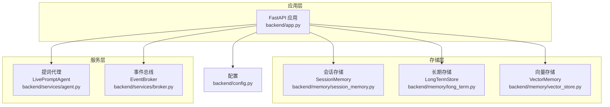
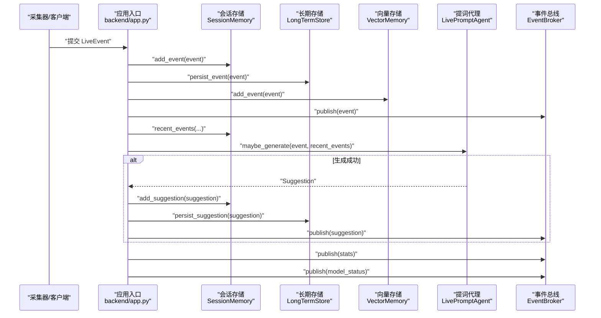
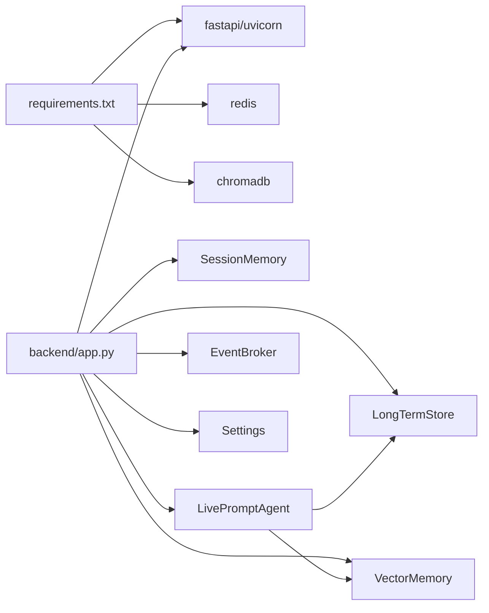

# 存储后端扩展

<cite>
**本文引用的文件**
- [backend/app.py](file://backend/app.py)
- [backend/config.py](file://backend/config.py)
- [backend/memory/vector_store.py](file://backend/memory/vector_store.py)
- [backend/memory/long_term.py](file://backend/memory/long_term.py)
- [backend/memory/session_memory.py](file://backend/memory/session_memory.py)
- [backend/schemas/live.py](file://backend/schemas/live.py)
- [backend/services/agent.py](file://backend/services/agent.py)
- [backend/services/broker.py](file://backend/services/broker.py)
- [data/DATABASE.md](file://data/DATABASE.md)
- [requirements.txt](file://requirements.txt)
</cite>

## 目录
1. [简介](#简介)
2. [项目结构](#项目结构)
3. [核心组件](#核心组件)
4. [架构总览](#架构总览)
5. [详细组件分析](#详细组件分析)
6. [依赖分析](#依赖分析)
7. [性能考量](#性能考量)
8. [故障排查指南](#故障排查指南)
9. [结论](#结论)
10. [附录](#附录)

## 简介
本指南面向希望扩展“存储后端”的开发者，系统讲解如何在现有架构上新增存储适配器（如 Elasticsearch、MongoDB 等），并确保与向量存储、长期存储、会话存储的无缝集成。文档涵盖：
- 抽象基类设计与接口规范
- 具体实现步骤与最佳实践
- 数据迁移方案（导入/导出、格式转换、一致性）
- 兼容性与版本升级策略
- 性能优化（查询、索引、缓存、并发）
- 实战扩展示例与集成方法

## 项目结构
后端采用“多存储层 + 服务编排”的分层架构：
- 应用入口负责事件编排与对外接口
- 会话存储（短期）：Redis 或进程内内存
- 长期存储（持久化）：SQLite
- 向量存储（检索增强）：Chroma 或本地退化方案
- 代理与事件总线：提词建议生成与事件广播

图表来源
- [backend/app.py:1-220](file://backend/app.py#L1-L220)
- [backend/memory/session_memory.py:1-113](file://backend/memory/session_memory.py#L1-L113)
- [backend/memory/long_term.py:1-750](file://backend/memory/long_term.py#L1-L750)
- [backend/memory/vector_store.py:1-108](file://backend/memory/vector_store.py#L1-L108)
- [backend/services/agent.py:1-393](file://backend/services/agent.py#L1-L393)
- [backend/services/broker.py:1-40](file://backend/services/broker.py#L1-L40)
- [backend/config.py:1-94](file://backend/config.py#L1-L94)

章节来源
- [backend/app.py:1-220](file://backend/app.py#L1-L220)
- [backend/config.py:1-94](file://backend/config.py#L1-L94)

## 核心组件
- 会话存储（短期）：优先 Redis，失败退化为进程内双端队列，用于高频热数据与低延迟读写
- 长期存储（持久化）：SQLite，提供事件、画像、会话、建议等完整数据模型与索引
- 向量存储（检索增强）：Chroma 向量库，失败时使用本地哈希嵌入函数进行文本相似度退化
- 提词代理：结合短期事件窗口、向量检索与用户画像生成建议
- 事件总线：统一发布事件与统计，供 SSE/WebSocket 推送
- 数据模型：标准化事件、建议、统计、快照等实体

章节来源
- [backend/memory/session_memory.py:1-113](file://backend/memory/session_memory.py#L1-L113)
- [backend/memory/long_term.py:1-750](file://backend/memory/long_term.py#L1-L750)
- [backend/memory/vector_store.py:1-108](file://backend/memory/vector_store.py#L1-L108)
- [backend/services/agent.py:1-393](file://backend/services/agent.py#L1-L393)
- [backend/services/broker.py:1-40](file://backend/services/broker.py#L1-L40)
- [backend/schemas/live.py:1-95](file://backend/schemas/live.py#L1-L95)

## 架构总览
事件处理流程（含建议生成与推送）：

图表来源
- [backend/app.py:61-78](file://backend/app.py#L61-L78)
- [backend/memory/session_memory.py:42-112](file://backend/memory/session_memory.py#L42-L112)
- [backend/memory/long_term.py:420-454](file://backend/memory/long_term.py#L420-L454)
- [backend/memory/vector_store.py:64-107](file://backend/memory/vector_store.py#L64-L107)
- [backend/services/agent.py:73-94](file://backend/services/agent.py#L73-L94)
- [backend/services/broker.py:28-39](file://backend/services/broker.py#L28-L39)

## 详细组件分析

### 抽象基类设计与接口规范
为新增存储适配器提供统一抽象，建议定义如下接口族（以伪代码形式描述，便于对照实现）：
- 通用存储接口
  - 写入事件：persist_event(event)
  - 查询近期事件：recent_events(room_id, limit)
  - 统计：stats(room_id)
  - 关闭活动会话：close_active_session(room_id, ended_at)
  - 列表会话：list_live_sessions(room_id, status, limit)
  - 获取当前会话：get_active_session(room_id)
  - 用户画像：get_user_profile(room_id, actor_or_nickname)
  - 观众详情：get_viewer_detail(room_id, viewer_id, nickname)
  - 观众备注：list_viewer_notes、save_viewer_note、delete_viewer_note
- 建议存储接口
  - persist_suggestion(suggestion)
  - recent_suggestions(room_id, limit)
- 向量检索接口
  - add_event(event)
  - similar(text, limit)
- 会话内存接口
  - add_event(event)
  - add_suggestion(suggestion)
  - recent_events(room_id, limit)
  - recent_suggestions(room_id, limit)
  - stats(room_id)
  - snapshot(room_id)

实现要点
- 保持幂等与事务一致性（尤其 SQLite/Redis）
- 明确错误处理与降级策略（如 Redis 不可用时退化为内存）
- 严格遵循数据模型（LiveEvent/Suggestion/SessionStats 等）

章节来源
- [backend/schemas/live.py:1-95](file://backend/schemas/live.py#L1-L95)
- [backend/memory/long_term.py:420-749](file://backend/memory/long_term.py#L420-L749)
- [backend/memory/vector_store.py:64-107](file://backend/memory/vector_store.py#L64-L107)
- [backend/memory/session_memory.py:42-112](file://backend/memory/session_memory.py#L42-L112)

### 具体实现步骤（以 Elasticsearch 为例）
- 步骤 1：定义适配器类与连接管理
  - 初始化客户端/连接池
  - 定义索引映射（事件、建议、画像、会话、备注）
- 步骤 2：实现事件持久化
  - 将 LiveEvent 转换为 ES 文档，写入 events 索引
  - 自动创建/获取活动会话并回填 session_id
- 步骤 3：实现检索与统计
  - recent_events：按时间倒序分页
  - stats：基于窗口聚合
  - list_live_sessions/get_active_session/close_active_session
- 步骤 4：实现建议与画像
  - persist_suggestion/recent_suggestions
  - get_user_profile/get_viewer_detail/list_viewer_notes/save_viewer_note/delete_viewer_note
- 步骤 5：向量检索（可选）
  - 使用 ES 向量插件或自建向量索引，实现 similar(text, limit)
- 步骤 6：与现有组件集成
  - 在应用入口替换 LongTermStore/VectorMemory/SessionMemory 的实例
  - 确保接口一致，避免侵入式改动

章节来源
- [backend/app.py:25-29](file://backend/app.py#L25-L29)
- [backend/memory/long_term.py:50-195](file://backend/memory/long_term.py#L50-L195)
- [backend/memory/vector_store.py:52-107](file://backend/memory/vector_store.py#L52-L107)
- [backend/memory/session_memory.py:17-112](file://backend/memory/session_memory.py#L17-L112)

### MongoDB 实现要点
- 文档模型映射
  - events：与 SQLite 表结构等价
  - suggestions：建议文档
  - viewer_profiles/viewer_gifts：聚合文档
  - live_sessions：会话文档
  - viewer_notes：备注文档
- 索引设计
  - 事件：room_id + ts（倒序）、room_id + viewer_id + ts、room_id + event_type + ts、session_id
  - 会话：room_id + status + last_event_at
  - 画像/备注：room_id + nickname/author 等
- 事务与一致性
  - 使用单文档更新或事务（副本集/分片场景）
  - 聚合重建：批量重算 viewer_profiles/viewer_gifts
- 与向量检索集成
  - 使用 Atlas Vector Search 或自建向量字段 + kNN

章节来源
- [backend/memory/long_term.py:155-195](file://backend/memory/long_term.py#L155-L195)
- [backend/memory/long_term.py:404-420](file://backend/memory/long_term.py#L404-L420)

### 数据迁移方案
- 导出阶段
  - 从 SQLite 导出 events、suggestions、viewer_profiles、viewer_gifts、live_sessions、viewer_notes
  - 保持字段映射与类型一致
- 格式转换
  - ES/MongoDB 文档结构与 SQLite 表结构一一对应
  - 注意 JSON 字段（metadata_json/raw_json）的序列化/反序列化
- 导入阶段
  - 批量写入（ES 使用 bulk，MongoDB 使用 insertMany/聚合管道）
  - 并行导入 + 断点续传
- 一致性保证
  - 导入前锁定/备份
  - 导入后校验：计数、采样比对
  - 切流策略：灰度导入 → 全量切换 → 回滚预案

章节来源
- [backend/memory/long_term.py:420-454](file://backend/memory/long_term.py#L420-L454)
- [data/DATABASE.md:16-151](file://data/DATABASE.md#L16-L151)

### 兼容性与版本升级
- 向后兼容
  - 字段演进：通过 _ensure_* 方法动态添加列/索引
  - 类型兼容：字符串/整数安全转换
  - 旧表兼容：user_profiles 保留但不再主读
- 版本升级策略
  - 数据库迁移：脚本化迁移 + 升级标记
  - 配置兼容：Settings 解析最终模型地址/名称
  - 依赖降级：可选依赖（redis/chromadb）未安装时自动退化
- 数据格式演进
  - JSON 字段（metadata_json/raw_json）支持扩展
  - 新增字段默认值与回填逻辑

章节来源
- [backend/memory/long_term.py:155-182](file://backend/memory/long_term.py#L155-L182)
- [backend/config.py:70-91](file://backend/config.py#L70-L91)
- [backend/memory/long_term.py:245-276](file://backend/memory/long_term.py#L245-L276)

### 性能考量
- 查询优化
  - SQLite：合理使用索引（见 DATABASE.md），避免全表扫描
  - Redis：列表操作 O(1)，注意 ltrim 控制长度
  - ES/MongoDB：利用复合索引与查询路由
- 索引设计
  - 事件：room_id/ts、room_id/viewer_id/ts、room_id/event_type/ts、session_id
  - 会话：room_id/status/last_event_at
- 缓存策略
  - Redis 热数据（事件/建议）+ TTL
  - 进程内内存作为降级缓存
- 并发访问控制
  - 事件总线异步广播，避免阻塞
  - 代理生成建议时避免长耗时阻塞

章节来源
- [backend/memory/long_term.py:183-195](file://backend/memory/long_term.py#L183-L195)
- [backend/memory/session_memory.py:17-112](file://backend/memory/session_memory.py#L17-L112)
- [backend/services/broker.py:10-39](file://backend/services/broker.py#L10-L39)

## 依赖分析
- 外部依赖
  - fastapi/uvicorn：Web 服务
  - redis：会话存储
  - chromadb：向量检索
- 内部耦合
  - 应用入口依赖三类存储与代理、总线
  - 代理依赖向量存储与长期存储
  - 长期存储依赖 SQLite 与 JSON 字段

图表来源
- [requirements.txt:1-6](file://requirements.txt#L1-L6)
- [backend/app.py:13-29](file://backend/app.py#L13-L29)
- [backend/services/agent.py:23-37](file://backend/services/agent.py#L23-L37)

章节来源
- [requirements.txt:1-6](file://requirements.txt#L1-L6)
- [backend/app.py:13-29](file://backend/app.py#L13-L29)

## 性能考量
- 事件吞吐
  - 会话存储：Redis 列表 + ltrim，控制窗口大小
  - 长期存储：批量写入 + 事务封装
- 检索性能
  - 向量检索：Chroma 向量索引 + 嵌入维度权衡
  - 文本相似度：本地哈希嵌入函数作为降级
- 广播延迟
  - 事件总线使用异步队列，避免阻塞
- 资源占用
  - SQLite：定期 VACUUM/优化
  - Redis：合理 TTL 与内存淘汰策略

## 故障排查指南
- Redis 不可用
  - 现象：会话存储退化为内存
  - 处理：检查连接串与网络；确认降级逻辑生效
- Chroma 不可用
  - 现象：向量检索退化为本地相似度
  - 处理：检查依赖安装与路径权限
- SQLite 异常
  - 现象：锁冲突/索引缺失
  - 处理：检查 _setup/_create_indexes 是否执行；必要时重建索引
- 建议生成失败
  - 现象：HTTP/超时/JSON 解析异常
  - 处理：查看代理日志与状态；自动回退至 heuristic

章节来源
- [backend/memory/session_memory.py:11-31](file://backend/memory/session_memory.py#L11-L31)
- [backend/memory/vector_store.py:13-16](file://backend/memory/vector_store.py#L13-L16)
- [backend/memory/long_term.py:50-195](file://backend/memory/long_term.py#L50-L195)
- [backend/services/agent.py:183-329](file://backend/services/agent.py#L183-L329)

## 结论
通过抽象统一接口、严格的降级策略与完善的迁移方案，可以在不破坏现有功能的前提下，平滑引入新的存储后端（如 ES/MongoDB）。建议优先完成：
- 接口对齐与最小实现
- 数据迁移与一致性校验
- 性能基准测试与索引优化
- 兼容性与版本升级策略

## 附录

### 数据模型与索引参考
- events/suggestions/viewer_profiles/viewer_gifts/live_sessions/viewer_notes 的字段与常用查询参考 [data/DATABASE.md:16-151](file://data/DATABASE.md#L16-L151)

章节来源
- [data/DATABASE.md:16-151](file://data/DATABASE.md#L16-L151)