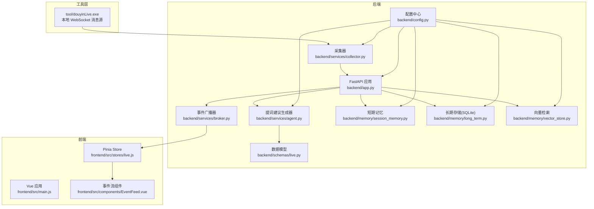
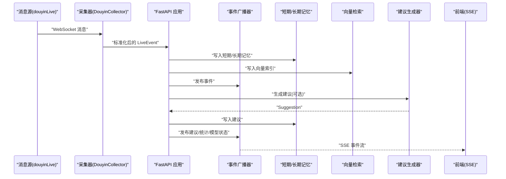
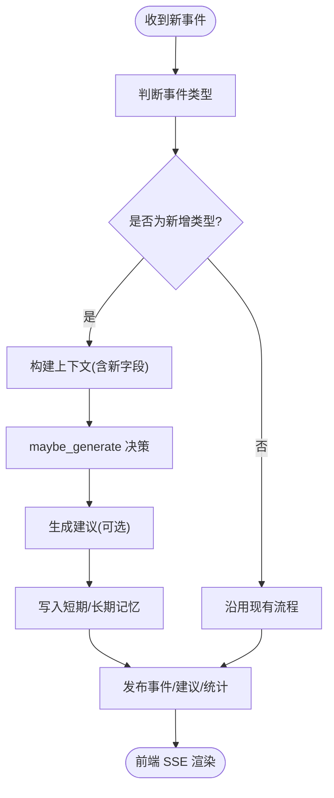
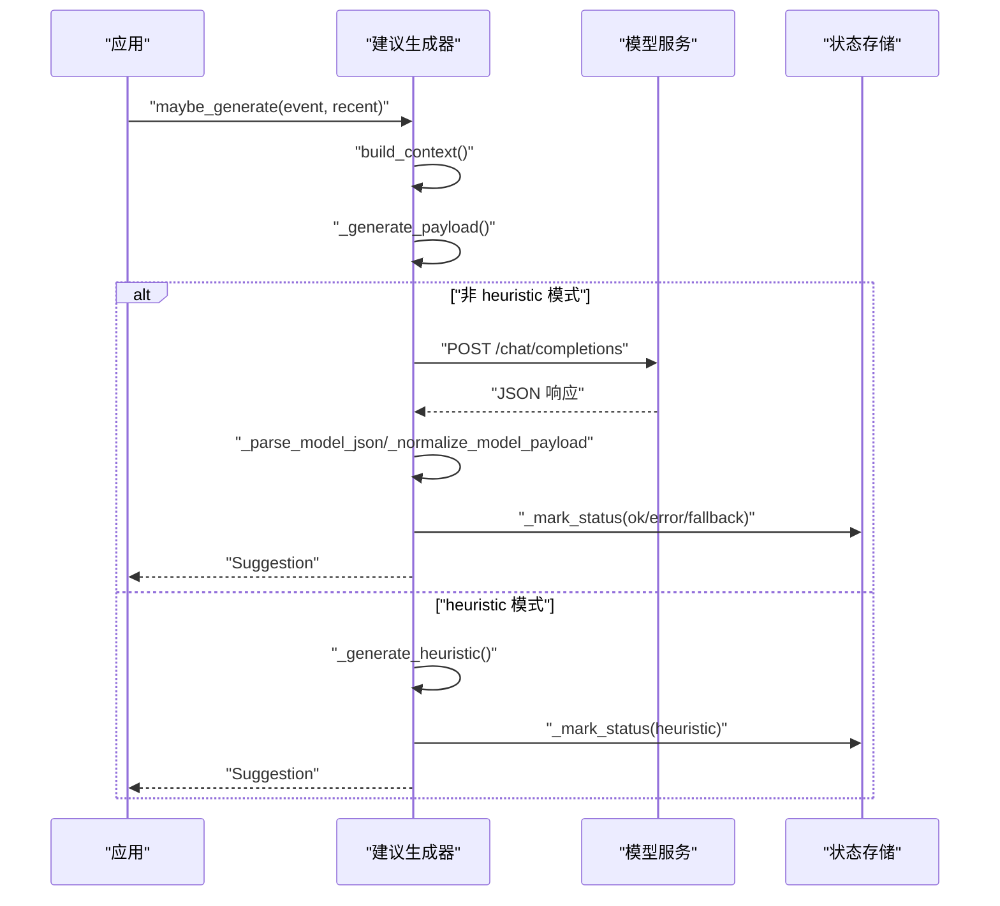
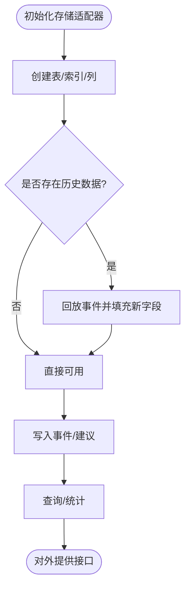
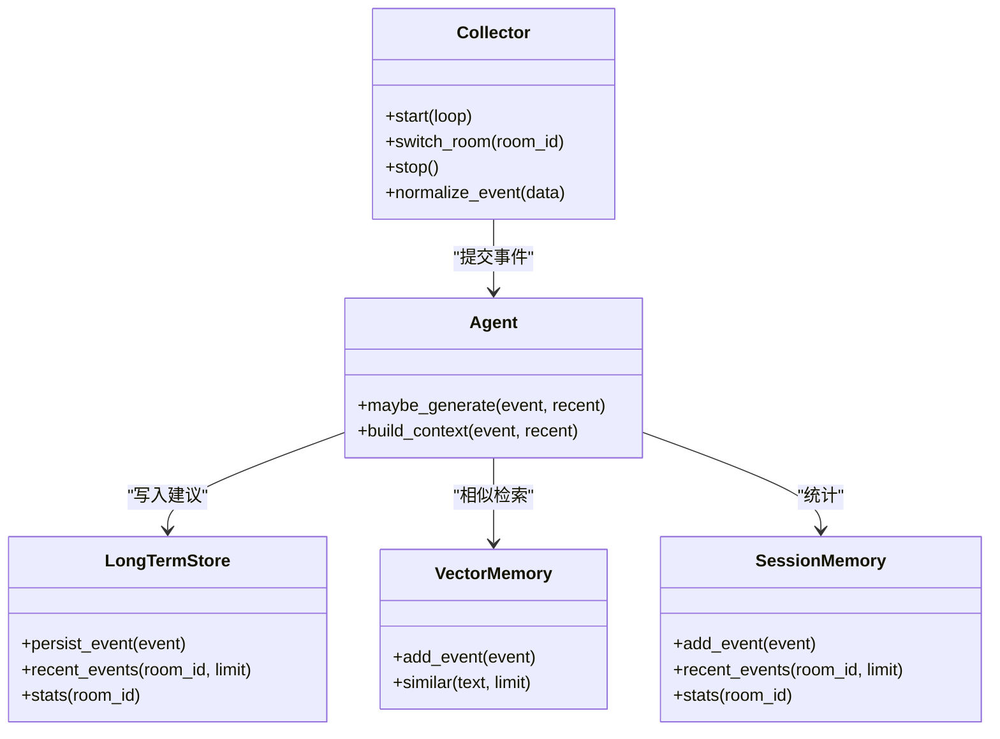
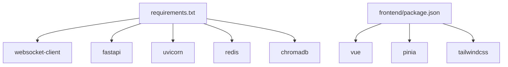

# 扩展开发

<cite>
**本文引用的文件**
- [README.md](file://README.md)
- [USAGE.md](file://USAGE.md)
- [backend/app.py](file://backend/app.py)
- [backend/config.py](file://backend/config.py)
- [backend/schemas/live.py](file://backend/schemas/live.py)
- [backend/services/broker.py](file://backend/services/broker.py)
- [backend/services/collector.py](file://backend/services/collector.py)
- [backend/services/agent.py](file://backend/services/agent.py)
- [backend/memory/session_memory.py](file://backend/memory/session_memory.py)
- [backend/memory/long_term.py](file://backend/memory/long_term.py)
- [backend/memory/vector_store.py](file://backend/memory/vector_store.py)
- [frontend/src/main.js](file://frontend/src/main.js)
- [frontend/src/stores/live.js](file://frontend/src/stores/live.js)
- [frontend/src/components/EventFeed.vue](file://frontend/src/components/EventFeed.vue)
- [frontend/package.json](file://frontend/package.json)
- [requirements.txt](file://requirements.txt)
</cite>

## 目录
1. [简介](#简介)
2. [项目结构](#项目结构)
3. [核心组件](#核心组件)
4. [架构总览](#架构总览)
5. [详细组件分析](#详细组件分析)
6. [依赖分析](#依赖分析)
7. [性能考虑](#性能考虑)
8. [故障排查指南](#故障排查指南)
9. [结论](#结论)
10. [附录](#附录)

## 简介
本指南面向希望为项目新增功能与第三方集成的开发者，围绕以下扩展方向提供系统化的步骤、图示与最佳实践：
- 新增事件类型：涵盖事件数据模型扩展、事件处理流程修改、前端展示更新
- AI 模型集成：新模型适配器开发、配置参数管理、错误处理机制、性能优化策略
- 存储后端扩展：新存储适配器开发、数据迁移方案、兼容性处理、性能考量
- 插件系统：事件源插件、AI 模型插件、存储插件的开发与集成流程
- 具体扩展示例与最佳实践：确保扩展的稳定性与可维护性

## 项目结构
后端采用 FastAPI 提供 REST/SSE/WebSocket 接口，核心链路包括采集、事件处理、短期/长期记忆、向量检索、建议生成与广播分发。前端基于 Vue 3 + Pinia + Tailwind，通过 SSE 实时消费事件流。

**图表来源**
- [backend/app.py:1-220](file://backend/app.py#L1-L220)
- [backend/config.py:1-94](file://backend/config.py#L1-L94)
- [backend/services/collector.py:1-284](file://backend/services/collector.py#L1-L284)
- [backend/services/broker.py:1-40](file://backend/services/broker.py#L1-L40)
- [backend/services/agent.py:1-393](file://backend/services/agent.py#L1-L393)
- [backend/memory/session_memory.py:1-113](file://backend/memory/session_memory.py#L1-L113)
- [backend/memory/long_term.py:1-750](file://backend/memory/long_term.py#L1-L750)
- [backend/memory/vector_store.py:1-108](file://backend/memory/vector_store.py#L1-L108)
- [backend/schemas/live.py:1-95](file://backend/schemas/live.py#L1-L95)
- [frontend/src/main.js:1-17](file://frontend/src/main.js#L1-L17)
- [frontend/src/stores/live.js:1-310](file://frontend/src/stores/live.js#L1-L310)
- [frontend/src/components/EventFeed.vue:1-183](file://frontend/src/components/EventFeed.vue#L1-L183)

**章节来源**
- [README.md:21-50](file://README.md#L21-L50)
- [backend/app.py:1-220](file://backend/app.py#L1-L220)
- [backend/config.py:1-94](file://backend/config.py#L1-L94)
- [frontend/src/main.js:1-17](file://frontend/src/main.js#L1-L17)

## 核心组件
- 配置中心：集中管理运行期配置（房间号、采集器参数、LLM 模式与参数、存储路径等），并提供解析与默认值。
- 采集器：连接本地 WebSocket 消息源，将原始消息标准化为统一事件模型并提交到事件循环。
- 事件处理：写入短期/长期记忆、向量检索、生成建议、发布事件流。
- 广播器：将事件按类型分发至 SSE/WebSocket 订阅端。
- 建议生成器：优先调用在线模型，失败时回退到本地启发式规则。
- 记忆与存储：短期记忆支持 Redis 或进程内内存；长期存储基于 SQLite；向量检索支持 Chroma 或本地文本相似度。
- 前端：通过 SSE 订阅事件流，渲染事件流与建议卡片，支持过滤、主题切换与房间切换。

**章节来源**
- [backend/config.py:39-94](file://backend/config.py#L39-L94)
- [backend/services/collector.py:38-284](file://backend/services/collector.py#L38-L284)
- [backend/app.py:61-78](file://backend/app.py#L61-L78)
- [backend/services/broker.py:10-40](file://backend/services/broker.py#L10-L40)
- [backend/services/agent.py:23-393](file://backend/services/agent.py#L23-L393)
- [backend/memory/session_memory.py:17-113](file://backend/memory/session_memory.py#L17-L113)
- [backend/memory/long_term.py:36-750](file://backend/memory/long_term.py#L36-L750)
- [backend/memory/vector_store.py:52-108](file://backend/memory/vector_store.py#L52-L108)
- [frontend/src/stores/live.js:70-310](file://frontend/src/stores/live.js#L70-L310)

## 架构总览
下图展示了从采集到前端展示的端到端流程，以及各组件间的依赖关系。

**图表来源**
- [backend/services/collector.py:145-284](file://backend/services/collector.py#L145-L284)
- [backend/app.py:61-78](file://backend/app.py#L61-L78)
- [backend/services/broker.py:28-40](file://backend/services/broker.py#L28-L40)
- [backend/services/agent.py:73-114](file://backend/services/agent.py#L73-L114)
- [frontend/src/stores/live.js:173-205](file://frontend/src/stores/live.js#L173-L205)

## 详细组件分析

### 事件类型扩展指南
新增事件类型涉及三个层面的改动：数据模型、处理流程与前端展示。

- 数据模型扩展
  - 在统一事件模型中增加新的事件类型字段与必要元数据。
  - 若涉及礼物等复杂字段，需在标准化阶段补充解析逻辑。
  - 参考路径：[事件模型定义:29-44](file://backend/schemas/live.py#L29-L44)，[采集器事件映射与解析:22-284](file://backend/services/collector.py#L22-L284)

- 事件处理流程修改
  - 在事件处理入口处，根据新事件类型决定是否生成建议。
  - 更新统计逻辑与向量检索上下文。
  - 参考路径：[事件处理主流程:61-78](file://backend/app.py#L61-78)，[建议生成决策:73-78](file://backend/services/agent.py#L73-L78)

- 前端展示更新
  - 在事件过滤器中新增类型选项，并在事件卡片中展示对应内容。
  - 参考路径：[事件过滤器与渲染:7-18](file://frontend/src/stores/live.js#L7-L18)，[事件卡片样式与内容:23-85](file://frontend/src/components/EventFeed.vue#L23-L85)

**图表来源**
- [backend/app.py:61-78](file://backend/app.py#L61-L78)
- [backend/services/agent.py:73-114](file://backend/services/agent.py#L73-L114)
- [backend/services/collector.py:225-284](file://backend/services/collector.py#L225-L284)
- [frontend/src/stores/live.js:165-171](file://frontend/src/stores/live.js#L165-L171)

**章节来源**
- [backend/schemas/live.py:29-44](file://backend/schemas/live.py#L29-L44)
- [backend/services/collector.py:22-284](file://backend/services/collector.py#L22-L284)
- [backend/app.py:61-78](file://backend/app.py#L61-L78)
- [frontend/src/stores/live.js:7-18](file://frontend/src/stores/live.js#L7-L18)
- [frontend/src/components/EventFeed.vue:23-85](file://frontend/src/components/EventFeed.vue#L23-L85)

### AI 模型集成指南
支持新模型适配器、配置参数管理、错误处理与性能优化。

- 新模型适配器开发
  - 在建议生成器中新增模式分支，实现与新模型的请求封装与响应解析。
  - 参考路径：[模式选择与回退:96-114](file://backend/services/agent.py#L96-L114)，[OpenAI 兼容调用:183-330](file://backend/services/agent.py#L183-L330)

- 配置参数管理
  - 通过配置中心设置模型模式、基础地址、模型名、API Key、温度与超时等。
  - 参考路径：[配置解析与默认值:39-94](file://backend/config.py#L39-94)

- 错误处理机制
  - 明确网络错误、HTTP 错误、超时、JSON 解析异常等分支，并记录状态与错误码。
  - 参考路径：[错误分支与状态标记:222-285](file://backend/services/agent.py#L222-L285)，[状态上报:44-54](file://backend/services/agent.py#L44-L54)

- 性能优化策略
  - 控制提示词长度与上下文大小，合理设置温度与超时，避免阻塞事件循环。
  - 参考路径：[提示词构造与上下文:56-71](file://backend/services/agent.py#L56-L71)，[超时与并发:60-61](file://backend/config.py#L60-L61)

**图表来源**
- [backend/services/agent.py:73-114](file://backend/services/agent.py#L73-L114)
- [backend/services/agent.py:183-330](file://backend/services/agent.py#L183-L330)
- [backend/services/agent.py:44-54](file://backend/services/agent.py#L44-L54)
- [backend/config.py:56-61](file://backend/config.py#L56-L61)

**章节来源**
- [backend/services/agent.py:23-393](file://backend/services/agent.py#L23-L393)
- [backend/config.py:39-94](file://backend/config.py#L39-L94)

### 存储后端扩展指南
支持新增存储适配器、数据迁移与兼容性处理。

- 新存储适配器开发
  - 遵循现有接口契约：写入事件、写入建议、查询最近事件/建议、统计、会话管理等。
  - 参考路径：[长期存储接口:36-750](file://backend/memory/long_term.py#L36-L750)，[短期记忆接口:17-113](file://backend/memory/session_memory.py#L17-L113)

- 数据迁移方案
  - 通过增量迁移策略，逐条回放历史事件，填充新增字段或重建聚合表。
  - 参考路径：[列补齐与索引重建:155-195](file://backend/memory/long_term.py#L155-L195)，[历史重算:404-420](file://backend/memory/long_term.py#L404-L420)

- 兼容性处理
  - 保持与现有数据模型一致的字段与约束，避免破坏前端渲染与统计逻辑。
  - 参考路径：[模型序列化/反序列化:29-95](file://backend/schemas/live.py#L29-L95)

- 性能考量
  - 合理设置批量写入、索引与缓存策略，避免阻塞事件循环。
  - 参考路径：[Redis 写入与 TTL:42-64](file://backend/memory/session_memory.py#L42-L64)，[SQLite 索引:183-195](file://backend/memory/long_term.py#L183-L195)

**图表来源**
- [backend/memory/long_term.py:50-195](file://backend/memory/long_term.py#L50-L195)
- [backend/memory/session_memory.py:17-64](file://backend/memory/session_memory.py#L17-L64)
- [backend/schemas/live.py:29-95](file://backend/schemas/live.py#L29-L95)

**章节来源**
- [backend/memory/long_term.py:36-750](file://backend/memory/long_term.py#L36-L750)
- [backend/memory/session_memory.py:17-113](file://backend/memory/session_memory.py#L17-L113)
- [backend/schemas/live.py:29-95](file://backend/schemas/live.py#L29-L95)

### 插件系统使用指南
当前系统未提供官方插件框架，但可通过以下方式实现扩展：

- 事件源插件
  - 自定义采集器类，遵循统一事件接口，替换或扩展采集器。
  - 参考路径：[采集器接口与标准化:38-284](file://backend/services/collector.py#L38-L284)

- AI 模型插件
  - 在建议生成器中新增模式分支，或通过配置切换不同模型。
  - 参考路径：[模式解析与调用:96-114](file://backend/services/agent.py#L96-L114)，[配置解析:70-90](file://backend/config.py#L70-L90)

- 存储插件
  - 替换短期/长期/向量存储实现，保持接口一致。
  - 参考路径：[短期记忆接口:17-113](file://backend/memory/session_memory.py#L17-L113)，[长期存储接口:36-750](file://backend/memory/long_term.py#L36-L750)，[向量存储接口:52-108](file://backend/memory/vector_store.py#L52-L108)

**图表来源**
- [backend/services/collector.py:38-284](file://backend/services/collector.py#L38-L284)
- [backend/services/agent.py:23-393](file://backend/services/agent.py#L23-L393)
- [backend/memory/long_term.py:36-750](file://backend/memory/long_term.py#L36-L750)
- [backend/memory/session_memory.py:17-113](file://backend/memory/session_memory.py#L17-L113)
- [backend/memory/vector_store.py:52-108](file://backend/memory/vector_store.py#L52-L108)

**章节来源**
- [backend/services/collector.py:38-284](file://backend/services/collector.py#L38-L284)
- [backend/services/agent.py:23-393](file://backend/services/agent.py#L23-L393)
- [backend/memory/long_term.py:36-750](file://backend/memory/long_term.py#L36-L750)
- [backend/memory/session_memory.py:17-113](file://backend/memory/session_memory.py#L17-L113)
- [backend/memory/vector_store.py:52-108](file://backend/memory/vector_store.py#L52-L108)

## 依赖分析
后端依赖主要集中在 WebSocket 客户端、FastAPI、Uvicorn、Redis 与 Chroma。前端依赖 Vue 3、Pinia 与 Tailwind。

**图表来源**
- [requirements.txt:1-6](file://requirements.txt#L1-L6)
- [frontend/package.json:11-22](file://frontend/package.json#L11-L22)

**章节来源**
- [requirements.txt:1-6](file://requirements.txt#L1-L6)
- [frontend/package.json:11-22](file://frontend/package.json#L11-L22)

## 性能考虑
- 事件循环与并发
  - 采集器通过线程与事件循环解耦，避免阻塞 FastAPI 主循环。
  - 建议生成器在非 heuristic 模式下进行异步调用，设置合理超时。
- 缓存与索引
  - Redis 用于短期记忆缓存，提升读写性能；SQLite 索引覆盖常用查询。
  - 向量检索在可用时使用 Chroma，不可用时回退到本地文本相似度。
- 前端渲染
  - 事件与建议列表限制最大长度，避免 DOM 过大；SSE 分流事件类型，降低前端压力。

[本节为通用性能建议，无需特定文件引用]

## 故障排查指南
- 采集层
  - 确认消息源已启动且可访问 WebSocket 地址；检查房间号与 Ping/Pong 机制。
  - 参考路径：[采集器连接与重连:117-139](file://backend/services/collector.py#L117-L139)，[URL 构造:54-59](file://backend/services/collector.py#L54-L59)

- 建议生成层
  - 查看模型状态与错误码，确认 API Key、网络与超时设置；必要时回退到 heuristic 模式。
  - 参考路径：[状态上报与错误分支:44-54](file://backend/services/agent.py#L44-L54)，[错误处理:222-285](file://backend/services/agent.py#L222-L285)

- 存储层
  - 检查 SQLite 表结构与索引是否完整；确认 Redis 可用性与 TTL 设置。
  - 参考路径：[表与索引初始化:50-195](file://backend/memory/long_term.py#L50-L195)，[Redis 写入:42-64](file://backend/memory/session_memory.py#L42-L64)

- 前端
  - 检查 SSE 连接状态与事件过滤器；确认主题持久化与本地存储。
  - 参考路径：[SSE 订阅与事件监听:173-205](file://frontend/src/stores/live.js#L173-L205)，[主题持久化:121-127](file://frontend/src/stores/live.js#L121-L127)

**章节来源**
- [backend/services/collector.py:117-139](file://backend/services/collector.py#L117-L139)
- [backend/services/agent.py:44-54](file://backend/services/agent.py#L44-L54)
- [backend/memory/long_term.py:50-195](file://backend/memory/long_term.py#L50-L195)
- [backend/memory/session_memory.py:42-64](file://backend/memory/session_memory.py#L42-L64)
- [frontend/src/stores/live.js:173-205](file://frontend/src/stores/live.js#L173-L205)

## 结论
通过以上扩展指南，开发者可以在不破坏现有架构的前提下，安全地新增事件类型、集成新模型、扩展存储后端并实现插件化集成。建议在每次变更后进行端到端回归测试，确保事件流、建议生成与前端展示的一致性。

[本节为总结性内容，无需特定文件引用]

## 附录
- 快速开始与配置参考
  - 参考路径：[快速开始与配置说明:66-141](file://README.md#L66-L141)，[使用说明:24-48](file://USAGE.md#L24-L48)
- 接口与事件类型
  - 参考路径：[后端接口:208-275](file://README.md#L208-L275)，[标准事件格式与映射:276-307](file://README.md#L276-L307)，[采集器事件映射:22-28](file://backend/services/collector.py#L22-L28)

**章节来源**
- [README.md:66-141](file://README.md#L66-L141)
- [USAGE.md:24-48](file://USAGE.md#L24-L48)
- [README.md:208-307](file://README.md#L208-L307)
- [backend/services/collector.py:22-28](file://backend/services/collector.py#L22-L28)