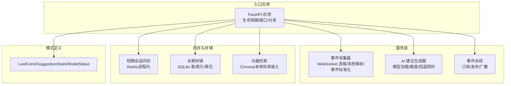
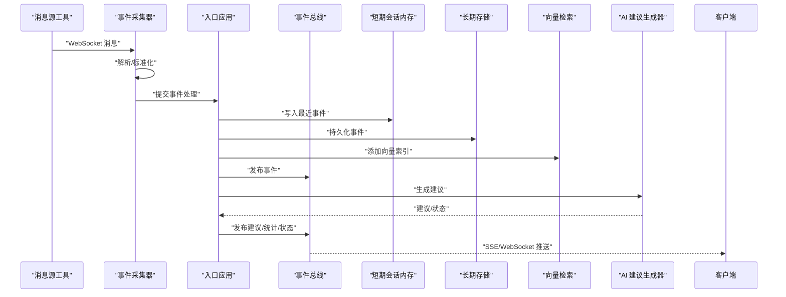
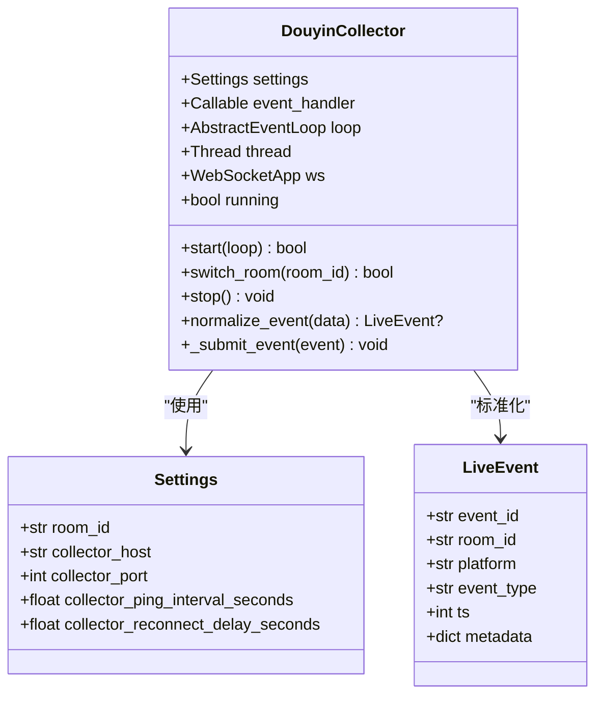
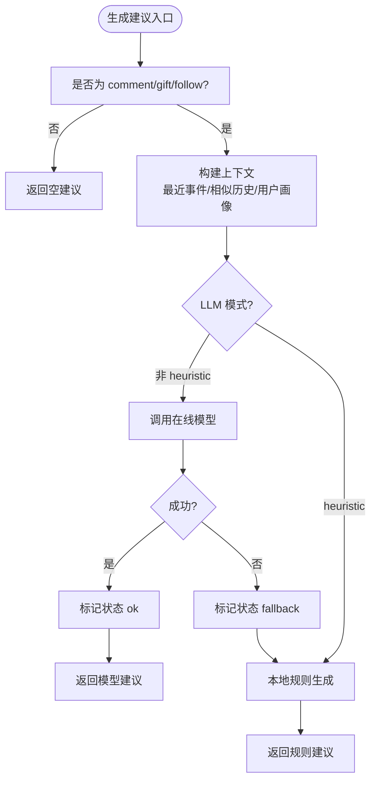
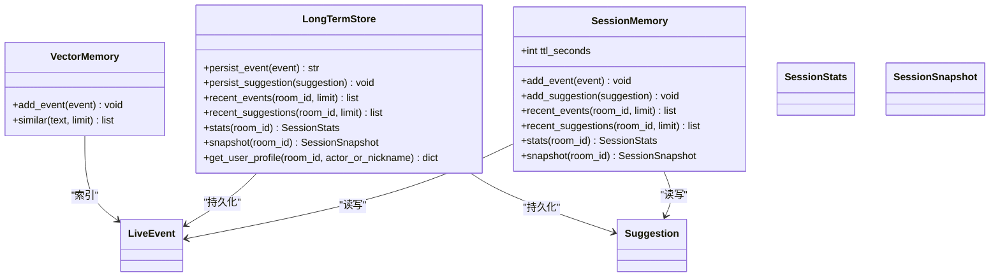
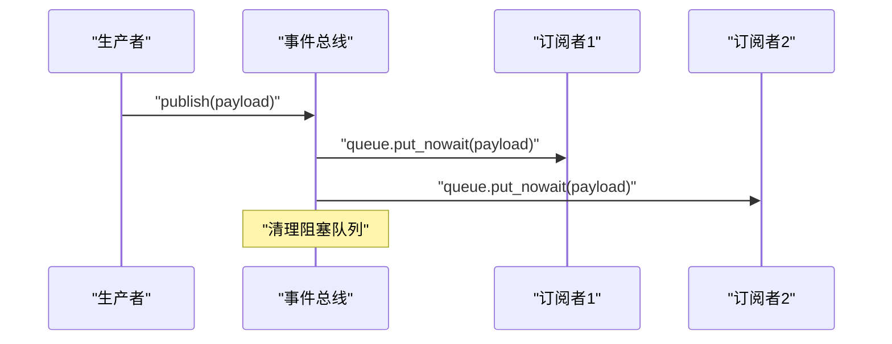
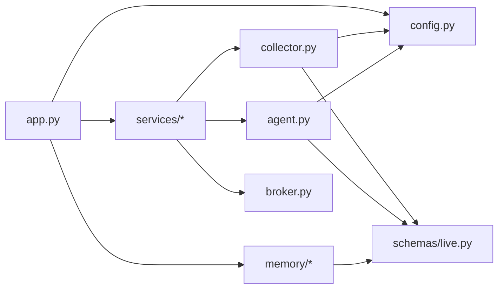

# 插件系统开发

<cite>
**本文引用的文件**
- [backend/app.py](file://backend/app.py)
- [backend/config.py](file://backend/config.py)
- [backend/services/collector.py](file://backend/services/collector.py)
- [backend/services/agent.py](file://backend/services/agent.py)
- [backend/services/broker.py](file://backend/services/broker.py)
- [backend/memory/session_memory.py](file://backend/memory/session_memory.py)
- [backend/memory/long_term.py](file://backend/memory/long_term.py)
- [backend/memory/vector_store.py](file://backend/memory/vector_store.py)
- [backend/schemas/live.py](file://backend/schemas/live.py)
- [README.md](file://README.md)
- [USAGE.md](file://USAGE.md)
</cite>

## 目录
1. [简介](#简介)
2. [项目结构](#项目结构)
3. [核心组件](#核心组件)
4. [架构总览](#架构总览)
5. [详细组件分析](#详细组件分析)
6. [依赖分析](#依赖分析)
7. [性能考量](#性能考量)
8. [故障排查指南](#故障排查指南)
9. [结论](#结论)
10. [附录](#附录)

## 简介
本指南围绕该直播提词项目的插件系统设计与实现，系统性阐述事件源插件、AI模型插件、存储插件的开发模式与最佳实践。文档基于现有代码库进行深入分析，总结事件采集、标准化、内存与持久化、向量检索、AI建议生成等关键环节的插件化思路，并提供可复用的模板与规范，帮助开发者构建稳定、可扩展、易维护的插件体系。

## 项目结构
该项目采用“入口应用 + 服务层 + 内存与存储层 + 模式定义”的分层组织方式：
- 入口应用负责生命周期管理、HTTP/SSE/WebSocket 接口、事件分发
- 服务层包含事件采集器（事件源插件）、事件代理（AI模型插件）、事件总线（事件分发）
- 内存与存储层包含短期会话内存、长期 SQLite 存储、向量检索
- 模式定义提供统一的数据模型与状态结构

图表来源
- [backend/app.py:84-92](file://backend/app.py#L84-L92)
- [backend/services/collector.py:38-78](file://backend/services/collector.py#L38-L78)
- [backend/services/agent.py:23-42](file://backend/services/agent.py#L23-L42)
- [backend/services/broker.py:10-21](file://backend/services/broker.py#L10-L21)
- [backend/memory/session_memory.py:17-31](file://backend/memory/session_memory.py#L17-L31)
- [backend/memory/long_term.py:36-40](file://backend/memory/long_term.py#L36-L40)
- [backend/memory/vector_store.py:52-63](file://backend/memory/vector_store.py#L52-L63)
- [backend/schemas/live.py:8-95](file://backend/schemas/live.py#L8-L95)

章节来源
- [backend/app.py:84-92](file://backend/app.py#L84-L92)
- [README.md:21-34](file://README.md#L21-L34)

## 核心组件
- 事件源插件（DouyinCollector）：负责连接本地 WebSocket 消息源，解析原始消息，标准化为统一事件模型，并提交到事件处理循环
- AI 模型插件（LivePromptAgent）：根据事件与上下文生成建议，支持在线模型与本地规则回退
- 存储插件（SessionMemory/LongTermStore/VectorMemory）：短期会话内存、长期 SQLite 存储、向量检索
- 事件总线（EventBroker）：在应用内部进行事件广播，供 SSE/WebSocket 分发
- 模式定义（schemas/live.py）：统一事件、建议、统计、状态的数据结构

章节来源
- [backend/services/collector.py:38-78](file://backend/services/collector.py#L38-L78)
- [backend/services/agent.py:23-42](file://backend/services/agent.py#L23-L42)
- [backend/memory/session_memory.py:17-31](file://backend/memory/session_memory.py#L17-L31)
- [backend/memory/long_term.py:36-40](file://backend/memory/long_term.py#L36-L40)
- [backend/memory/vector_store.py:52-63](file://backend/memory/vector_store.py#L52-L63)
- [backend/services/broker.py:10-21](file://backend/services/broker.py#L10-L21)
- [backend/schemas/live.py:8-95](file://backend/schemas/live.py#L8-L95)

## 架构总览
系统通过入口应用统一编排，事件源插件负责采集与标准化，AI 插件负责生成建议，存储与检索插件负责数据持久化与上下文构建，事件总线负责实时分发。

图表来源
- [backend/app.py:61-78](file://backend/app.py#L61-L78)
- [backend/services/collector.py:145-159](file://backend/services/collector.py#L145-L159)
- [backend/services/broker.py:28-39](file://backend/services/broker.py#L28-L39)
- [backend/services/agent.py:73-94](file://backend/services/agent.py#L73-L94)
- [backend/memory/session_memory.py:42-53](file://backend/memory/session_memory.py#L42-L53)
- [backend/memory/long_term.py:420-454](file://backend/memory/long_term.py#L420-L454)
- [backend/memory/vector_store.py:64-83](file://backend/memory/vector_store.py#L64-L83)

## 详细组件分析

### 事件源插件：DouyinCollector
- 连接管理：在独立线程中维护 WebSocket 连接，支持重连、心跳、优雅关闭
- 消息解析：将原始 JSON 解析为结构化对象，按方法映射事件类型
- 事件标准化：构造统一的 LiveEvent，填充用户身份、时间戳、元数据
- 线程安全：通过 asyncio.run_coroutine_threadsafe 将事件提交到事件循环

图表来源
- [backend/services/collector.py:38-78](file://backend/services/collector.py#L38-L78)
- [backend/services/collector.py:225-283](file://backend/services/collector.py#L225-L283)
- [backend/config.py:40-61](file://backend/config.py#L40-L61)
- [backend/schemas/live.py:29-44](file://backend/schemas/live.py#L29-L44)

章节来源
- [backend/services/collector.py:38-78](file://backend/services/collector.py#L38-L78)
- [backend/services/collector.py:117-139](file://backend/services/collector.py#L117-L139)
- [backend/services/collector.py:145-159](file://backend/services/collector.py#L145-L159)
- [backend/services/collector.py:225-283](file://backend/services/collector.py#L225-L283)

### AI 模型插件：LivePromptAgent
- 生命周期：在应用启动时初始化，持有配置、向量内存与长期存储引用
- 上下文构建：结合最近事件、相似历史、用户画像生成建议输入
- 模型调用：优先调用 OpenAI 兼容接口，失败时回退到本地启发式规则
- 错误处理：覆盖网络、超时、JSON 解析、响应结构缺失等异常路径，维护模型状态

图表来源
- [backend/services/agent.py:73-114](file://backend/services/agent.py#L73-L114)
- [backend/services/agent.py:183-329](file://backend/services/agent.py#L183-L329)
- [backend/services/agent.py:331-392](file://backend/services/agent.py#L331-L392)

章节来源
- [backend/services/agent.py:23-42](file://backend/services/agent.py#L23-L42)
- [backend/services/agent.py:56-71](file://backend/services/agent.py#L56-L71)
- [backend/services/agent.py:96-114](file://backend/services/agent.py#L96-L114)
- [backend/services/agent.py:183-329](file://backend/services/agent.py#L183-L329)

### 存储插件：SessionMemory/LongTermStore/VectorMemory
- SessionMemory：短期会话内存，优先使用 Redis，否则退化为进程内队列；提供事件与建议的增删查与统计
- LongTermStore：长期 SQLite 存储，负责事件、建议、用户画像、礼物历史、直播会话、备注等表的持久化与查询
- VectorMemory：向量检索，优先使用 Chroma，否则使用本地哈希嵌入函数进行相似度检索

图表来源
- [backend/memory/session_memory.py:17-113](file://backend/memory/session_memory.py#L17-L113)
- [backend/memory/long_term.py:36-750](file://backend/memory/long_term.py#L36-L750)
- [backend/memory/vector_store.py:52-108](file://backend/memory/vector_store.py#L52-L108)
- [backend/schemas/live.py:29-95](file://backend/schemas/live.py#L29-L95)

章节来源
- [backend/memory/session_memory.py:17-113](file://backend/memory/session_memory.py#L17-L113)
- [backend/memory/long_term.py:36-750](file://backend/memory/long_term.py#L36-L750)
- [backend/memory/vector_store.py:52-108](file://backend/memory/vector_store.py#L52-L108)

### 事件总线：EventBroker
- 订阅/取消订阅：维护订阅队列集合，支持动态增删
- 广播：向所有订阅者投递消息，自动清理阻塞队列

图表来源
- [backend/services/broker.py:16-39](file://backend/services/broker.py#L16-L39)

章节来源
- [backend/services/broker.py:10-40](file://backend/services/broker.py#L10-L40)

### 模式定义：LiveEvent/Suggestion/SessionStats/ModelStatus
- Actor：最小用户身份，支持多种 ID 归一化
- LiveEvent：标准化事件模型，包含事件 ID、房间、平台、类型、时间戳、用户、内容、元数据、原始数据
- Suggestion：建议模型，包含来源、优先级、回复文本、语调、理由、置信度、引用与创建时间
- SessionStats：会话统计，包含各类事件计数
- ModelStatus：模型状态，包含模式、模型名、后端、结果、错误与更新时间
- SessionSnapshot：前端引导快照，包含最近事件、建议、统计与模型状态

章节来源
- [backend/schemas/live.py:8-95](file://backend/schemas/live.py#L8-L95)

## 依赖分析
- 入口应用依赖：配置、内存、存储、向量、代理、采集器、事件总线
- 采集器依赖：配置、事件模型、WebSocket 客户端
- 代理依赖：配置、向量内存、长期存储、事件模型
- 存储依赖：SQLite、可选 Redis、可选 Chroma
- 事件总线依赖：异步队列

图表来源
- [backend/app.py:13-29](file://backend/app.py#L13-L29)
- [backend/services/collector.py:16-17](file://backend/services/collector.py#L16-L17)
- [backend/services/agent.py:17](file://backend/services/agent.py#L17)
- [backend/memory/session_memory.py:9](file://backend/memory/session_memory.py#L9)
- [backend/memory/long_term.py:8](file://backend/memory/long_term.py#L8)
- [backend/memory/vector_store.py:11](file://backend/memory/vector_store.py#L11)
- [backend/schemas/live.py:5](file://backend/schemas/live.py#L5)

章节来源
- [backend/app.py:13-29](file://backend/app.py#L13-L29)
- [backend/services/collector.py:16-17](file://backend/services/collector.py#L16-L17)
- [backend/services/agent.py:17](file://backend/services/agent.py#L17)
- [backend/memory/session_memory.py:9](file://backend/memory/session_memory.py#L9)
- [backend/memory/long_term.py:8](file://backend/memory/long_term.py#L8)
- [backend/memory/vector_store.py:11](file://backend/memory/vector_store.py#L11)
- [backend/schemas/live.py:5](file://backend/schemas/live.py#L5)

## 性能考量
- 短期内存：Redis 优先，提升并发读写与跨进程共享；无 Redis 时使用进程内队列，避免阻塞
- 长期存储：SQLite 事务与索引优化，批量写入减少锁竞争；增量重建用户画像与礼物历史
- 向量检索：Chroma 持久化与查询加速；无 Chroma 时使用本地哈希嵌入，保持检索可用性
- 事件总线：异步队列广播，自动清理阻塞队列，降低内存压力
- 模型调用：超时控制、回退策略、错误分类记录，保障稳定性

[本节为通用性能讨论，无需列出具体文件来源]

## 故障排查指南
- 采集器连接问题：检查 ROOM_ID、采集器地址与端口、心跳间隔与重连延迟
- WebSocket 异常：查看 on_error/on_close 日志，确认连接状态与断线原因
- 事件处理失败：检查事件标准化过程与回调日志，定位 JSON 解析与字段缺失
- 模型调用失败：检查 API Key、网络连通性、超时设置、响应结构与 JSON 解析
- 存储写入异常：检查数据库路径、权限、表结构与索引是否存在
- 前端无数据：确认 SSE/WebSocket 连接、过滤条件与房间切换

章节来源
- [backend/services/collector.py:161-180](file://backend/services/collector.py#L161-L180)
- [backend/services/collector.py:208-214](file://backend/services/collector.py#L208-L214)
- [backend/services/agent.py:222-285](file://backend/services/agent.py#L222-L285)
- [backend/memory/long_term.py:420-454](file://backend/memory/long_term.py#L420-L454)

## 结论
该插件系统以清晰的分层与职责划分实现了事件采集、标准化、存储检索与 AI 建议生成的插件化架构。通过可选依赖与回退策略，系统在不同环境下均能稳定运行。遵循本文提供的开发模式与最佳实践，可快速扩展新的事件源、模型与存储插件，同时保持系统的稳定性与可维护性。

[本节为总结性内容，无需列出具体文件来源]

## 附录

### 插件接口与生命周期规范
- 事件源插件接口
  - 初始化：接收配置与事件处理器回调
  - 启停：start/stop，支持房间切换
  - 连接管理：心跳、重连、优雅关闭
  - 事件标准化：将原始消息映射为统一事件模型
- AI 模型插件接口
  - 初始化：接收配置、上下文组件引用
  - 建议生成：根据事件与上下文生成建议
  - 回退策略：在线失败时的本地规则
  - 状态上报：维护与上报模型状态
- 存储插件接口
  - 事件/建议持久化：支持幂等写入
  - 查询接口：按房间、时间、类型等维度查询
  - 聚合与统计：提供统计与画像能力
  - 事务与一致性：在 SQLite 场景下使用事务与索引

[本节为概念性规范说明，无需列出具体文件来源]

### 开发模板与最佳实践
- 事件源插件模板
  - 使用独立线程管理连接，避免阻塞事件循环
  - 统一异常捕获与日志记录，区分可恢复与不可恢复错误
  - 提供房间切换与优雅关闭
- AI 模型插件模板
  - 明确输入输出格式，严格校验与规范化
  - 分层错误处理与状态标记，便于前端展示
  - 支持超时与回退策略，保证可用性
- 存储插件模板
  - 优先使用可选依赖，无依赖时提供降级实现
  - 事务与索引优化，避免热点写入
  - 提供幂等写入与增量重建能力

[本节为通用开发指导，无需列出具体文件来源]