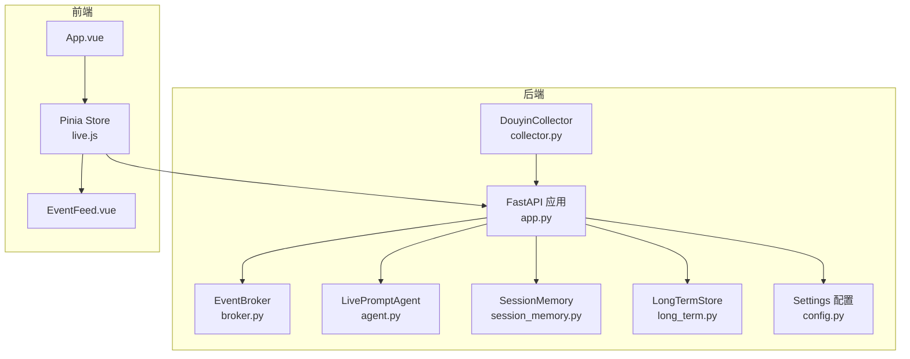
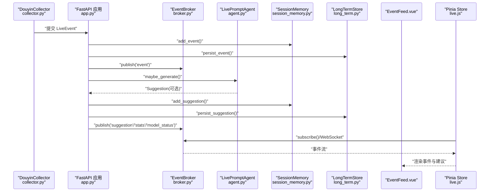
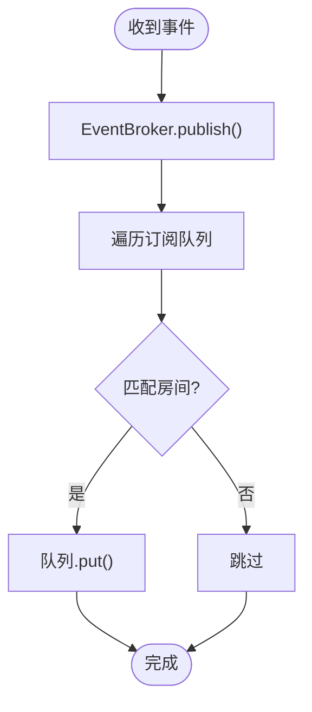
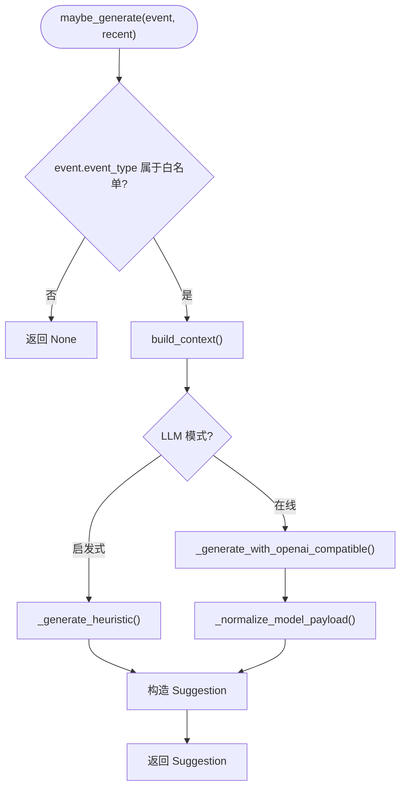
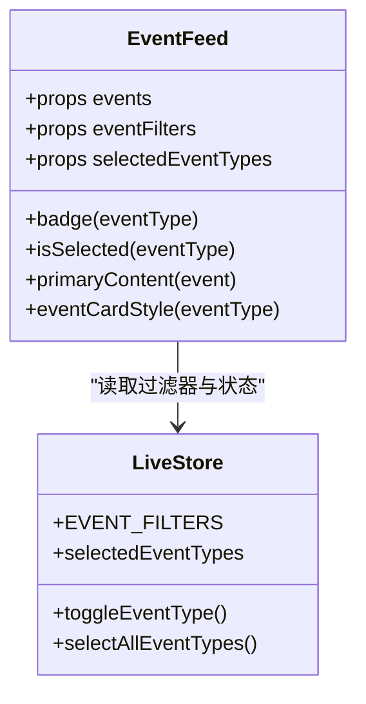
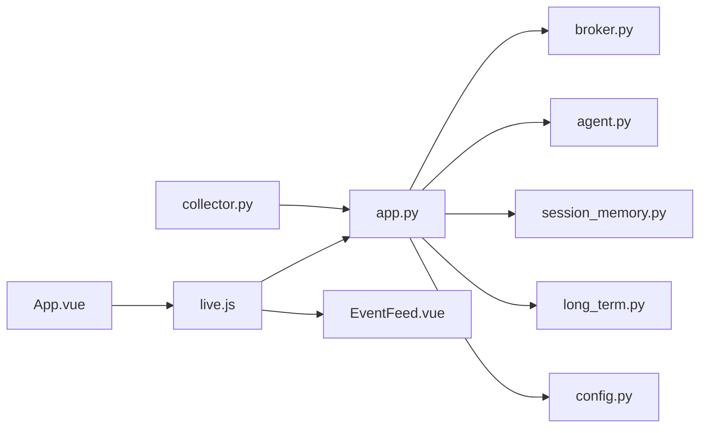

# 新增事件类型扩展

<cite>
**本文引用的文件**
- [backend/schemas/live.py](file://backend/schemas/live.py)
- [backend/services/broker.py](file://backend/services/broker.py)
- [backend/services/agent.py](file://backend/services/agent.py)
- [backend/app.py](file://backend/app.py)
- [backend/services/collector.py](file://backend/services/collector.py)
- [backend/memory/session_memory.py](file://backend/memory/session_memory.py)
- [backend/memory/long_term.py](file://backend/memory/long_term.py)
- [backend/config.py](file://backend/config.py)
- [frontend/src/components/EventFeed.vue](file://frontend/src/components/EventFeed.vue)
- [frontend/src/stores/live.js](file://frontend/src/stores/live.js)
- [frontend/src/App.vue](file://frontend/src/App.vue)
</cite>

## 目录
1. [简介](#简介)
2. [项目结构](#项目结构)
3. [核心组件](#核心组件)
4. [架构总览](#架构总览)
5. [详细组件分析](#详细组件分析)
6. [依赖分析](#依赖分析)
7. [性能考虑](#性能考虑)
8. [故障排查指南](#故障排查指南)
9. [结论](#结论)
10. [附录](#附录)

## 简介
本指南面向希望在现有直播事件系统中“新增事件类型”的开发者，提供从数据模型扩展、事件处理流程修改、到前端展示更新的完整实现步骤与最佳实践。我们将以“新增一种直播事件类型”为例，逐步说明如何：
- 在 LiveEvent 数据模型中定义新事件类型的字段与验证规则
- 在 EventBroker 中注册新的事件处理器（如 SSE/WS 分发）
- 在 LivePromptAgent 中添加相应的事件处理逻辑与建议生成规则
- 在前端 EventFeed 组件中添加新事件类型的渲染、样式与交互
- 提供常见问题的排查方法与优化建议

## 项目结构
该系统采用前后端分离架构：
- 后端使用 FastAPI 提供 API 与事件流，内部通过 EventBroker 广播事件，LivePromptAgent 负责建议生成，Collector 负责采集抖音直播消息并归一化为 LiveEvent
- 前端使用 Vue + Pinia，通过 EventSource 接收后端推送的事件流，渲染事件与建议

图表来源
- [backend/app.py:1-220](file://backend/app.py#L1-L220)
- [backend/services/collector.py:1-284](file://backend/services/collector.py#L1-L284)
- [backend/services/broker.py:1-40](file://backend/services/broker.py#L1-L40)
- [backend/services/agent.py:1-393](file://backend/services/agent.py#L1-L393)
- [backend/memory/session_memory.py:1-113](file://backend/memory/session_memory.py#L1-L113)
- [backend/memory/long_term.py:1-200](file://backend/memory/long_term.py#L1-L200)
- [backend/config.py:1-94](file://backend/config.py#L1-L94)
- [frontend/src/App.vue:1-66](file://frontend/src/App.vue#L1-L66)
- [frontend/src/stores/live.js:1-310](file://frontend/src/stores/live.js#L1-L310)
- [frontend/src/components/EventFeed.vue:1-183](file://frontend/src/components/EventFeed.vue#L1-L183)

章节来源
- [backend/app.py:1-220](file://backend/app.py#L1-L220)
- [frontend/src/App.vue:1-66](file://frontend/src/App.vue#L1-L66)

## 核心组件
- 数据模型：LiveEvent 定义了事件的统一结构，包括事件 ID、房间 ID、平台、事件类型、时间戳、用户信息、内容与元数据等
- 事件采集：DouyinCollector 将原始直播消息映射为 LiveEvent，并提交给后端处理
- 事件处理：app.py 的 process_event 负责持久化、广播与建议生成
- 建议生成：LivePromptAgent 根据事件类型生成建议，支持在线模型与启发式规则
- 事件广播：EventBroker 通过 SSE/WS 将事件与建议推送给前端
- 前端展示：EventFeed.vue 渲染事件卡片，Pinia store 管理事件过滤与连接

章节来源
- [backend/schemas/live.py:29-44](file://backend/schemas/live.py#L29-L44)
- [backend/services/collector.py:22-28](file://backend/services/collector.py#L22-L28)
- [backend/app.py:61-78](file://backend/app.py#L61-L78)
- [backend/services/agent.py:73-94](file://backend/services/agent.py#L73-L94)
- [backend/services/broker.py:28-40](file://backend/services/broker.py#L28-L40)
- [frontend/src/components/EventFeed.vue:23-85](file://frontend/src/components/EventFeed.vue#L23-L85)
- [frontend/src/stores/live.js:7-14](file://frontend/src/stores/live.js#L7-L14)

## 架构总览
下面的序列图展示了从采集到前端展示的完整流程，以及新增事件类型时需要修改的关键节点。

图表来源
- [backend/services/collector.py:225-284](file://backend/services/collector.py#L225-L284)
- [backend/app.py:61-78](file://backend/app.py#L61-L78)
- [backend/services/broker.py:28-40](file://backend/services/broker.py#L28-L40)
- [backend/services/agent.py:73-94](file://backend/services/agent.py#L73-L94)
- [backend/memory/session_memory.py:42-64](file://backend/memory/session_memory.py#L42-L64)
- [backend/memory/long_term.py:197-200](file://backend/memory/long_term.py#L197-L200)
- [frontend/src/stores/live.js:173-205](file://frontend/src/stores/live.js#L173-L205)
- [frontend/src/components/EventFeed.vue:88-182](file://frontend/src/components/EventFeed.vue#L88-L182)

## 详细组件分析

### 1. 数据模型扩展：在 LiveEvent 中定义新事件类型
- 目标：为新事件类型增加必要的字段与默认值，确保序列化/反序列化与数据库存储兼容
- 关键点：
  - event_type 字段用于区分事件类型，需与采集器映射一致
  - metadata 字段用于承载特定事件的附加信息（如礼物名称、数量等）
  - content 字段用于展示文本内容，必要时可从 metadata 补充
- 实施步骤：
  - 在采集器 normalize_event 中为新事件类型设置 event_type 与 metadata
  - 在建议生成逻辑中针对新事件类型补充上下文或规则
  - 在前端 EventFeed.vue 中为新事件类型添加标签、样式与内容渲染

章节来源
- [backend/schemas/live.py:29-44](file://backend/schemas/live.py#L29-L44)
- [backend/services/collector.py:225-284](file://backend/services/collector.py#L225-L284)
- [frontend/src/components/EventFeed.vue:23-85](file://frontend/src/components/EventFeed.vue#L23-L85)

### 2. 事件处理流程修改：在 EventBroker 中注册事件处理器
- 目标：确保新事件类型通过 SSE/WS 正确分发到前端
- 关键点：
  - EventBroker 维护订阅队列，publish 将消息广播给所有订阅者
  - SSE/WS 端点会过滤房间 ID 并按事件类型推送
- 实施步骤：
  - 在 app.py 的 /api/events/stream 与 /ws/live 中确认新事件类型会被正确推送
  - 如需新增事件类型专属通道，可在 EventBroker 中扩展订阅/发布逻辑

图表来源
- [backend/services/broker.py:28-40](file://backend/services/broker.py#L28-L40)
- [backend/app.py:187-206](file://backend/app.py#L187-L206)
- [backend/app.py:209-220](file://backend/app.py#L209-L220)

章节来源
- [backend/services/broker.py:10-40](file://backend/services/broker.py#L10-L40)
- [backend/app.py:187-220](file://backend/app.py#L187-L220)

### 3. 建议生成规则扩展：在 LivePromptAgent 中添加新事件类型处理
- 目标：为新事件类型提供建议生成逻辑，支持在线模型与启发式规则
- 关键点：
  - maybe_generate 中仅对特定事件类型生成建议，需将新事件类型纳入判断
  - _generate_heuristic 中按事件类型返回不同优先级、语气与理由
  - _generate_with_openai_compatible 中构造提示词，确保新事件类型具备合理的模板
- 实施步骤：
  - 在 maybe_generate 中允许新事件类型进入建议生成
  - 在 _generate_heuristic 中为新事件类型编写启发式规则
  - 在 _generate_with_openai_compatible 中完善提示词模板
  - 更新 _normalize_model_payload 以兼容新字段（如需要）

图表来源
- [backend/services/agent.py:73-114](file://backend/services/agent.py#L73-L114)
- [backend/services/agent.py:115-182](file://backend/services/agent.py#L115-L182)
- [backend/services/agent.py:183-330](file://backend/services/agent.py#L183-L330)
- [backend/services/agent.py:353-393](file://backend/services/agent.py#L353-L393)

章节来源
- [backend/services/agent.py:73-182](file://backend/services/agent.py#L73-L182)
- [backend/services/agent.py:183-393](file://backend/services/agent.py#L183-L393)

### 4. 前端展示更新：在 EventFeed 中添加新事件类型
- 目标：为新事件类型提供标签、样式与内容渲染，并保持与现有事件类型一致的交互体验
- 关键点：
  - badge 函数将事件类型映射为中文标签
  - eventCardStyle 为不同事件类型设置边框与背景色
  - primaryContent 用于展示事件主要内容
  - 事件过滤器与可见性逻辑在 Pinia store 中管理
- 实施步骤：
  - 在 badge 中为新事件类型添加标签映射
  - 在 eventCardStyle 中为新事件类型添加样式
  - 在 primaryContent 中补充新事件类型的内容展示逻辑
  - 在 Pinia store 的 EVENT_FILTERS 中添加新事件类型，确保过滤器显示与持久化

图表来源
- [frontend/src/components/EventFeed.vue:23-85](file://frontend/src/components/EventFeed.vue#L23-L85)
- [frontend/src/stores/live.js:7-14](file://frontend/src/stores/live.js#L7-L14)
- [frontend/src/stores/live.js:252-277](file://frontend/src/stores/live.js#L252-L277)

章节来源
- [frontend/src/components/EventFeed.vue:1-183](file://frontend/src/components/EventFeed.vue#L1-L183)
- [frontend/src/stores/live.js:1-310](file://frontend/src/stores/live.js#L1-L310)

### 5. 采集器映射与数据一致性
- 目标：确保新事件类型在采集阶段被正确识别与归一化
- 关键点：
  - METHOD_EVENT_TYPE_MAP 将原始消息 method 映射为事件类型
  - normalize_event 构造 LiveEvent，并填充 metadata
- 实施步骤：
  - 在 METHOD_EVENT_TYPE_MAP 中添加新 method 到事件类型的映射
  - 在 normalize_event 中为新事件类型填充 metadata 字段
  - 确保 content 字段在必要时从 metadata 补充

章节来源
- [backend/services/collector.py:22-28](file://backend/services/collector.py#L22-L28)
- [backend/services/collector.py:225-284](file://backend/services/collector.py#L225-L284)

### 6. 存储与统计更新
- 目标：确保新事件类型在短期与长期存储中得到正确统计与查询
- 关键点：
  - SessionStats 与 SessionMemory.stats 中对事件类型进行计数
  - LongTermStore.events 表结构包含 event_type 字段，支持后续查询与聚合
- 实施步骤：
  - 在 SessionMemory.stats 中为新事件类型增加计数逻辑
  - 在前端筛选器中添加新事件类型，确保统计数据与 UI 一致

章节来源
- [backend/memory/session_memory.py:86-102](file://backend/memory/session_memory.py#L86-L102)
- [backend/memory/long_term.py:50-149](file://backend/memory/long_term.py#L50-L149)
- [frontend/src/stores/live.js:7-14](file://frontend/src/stores/live.js#L7-L14)

## 依赖分析
- 后端模块耦合关系：
  - app.py 依赖 collector、broker、agent、session_memory、long_term_store、config
  - collector 依赖 config 与 schemas/live.py
  - agent 依赖 schemas/live.py 与向量/长期存储
  - broker 为事件分发中心，被 app.py 与前端订阅
- 前端模块耦合关系：
  - App.vue 使用 Pinia store
  - EventFeed.vue 依赖 store 的事件过滤与样式函数
  - store 通过 SSE/WS 与后端交互

图表来源
- [backend/app.py:1-220](file://backend/app.py#L1-L220)
- [backend/services/collector.py:1-284](file://backend/services/collector.py#L1-L284)
- [backend/services/broker.py:1-40](file://backend/services/broker.py#L1-L40)
- [backend/services/agent.py:1-393](file://backend/services/agent.py#L1-L393)
- [backend/memory/session_memory.py:1-113](file://backend/memory/session_memory.py#L1-L113)
- [backend/memory/long_term.py:1-200](file://backend/memory/long_term.py#L1-L200)
- [backend/config.py:1-94](file://backend/config.py#L1-L94)
- [frontend/src/App.vue:1-66](file://frontend/src/App.vue#L1-L66)
- [frontend/src/stores/live.js:1-310](file://frontend/src/stores/live.js#L1-L310)
- [frontend/src/components/EventFeed.vue:1-183](file://frontend/src/components/EventFeed.vue#L1-L183)

## 性能考虑
- 事件流吞吐：EventBroker 使用 asyncio.Queue，注意队列满载时的清理逻辑
- 建议生成延迟：在线模型调用存在网络与超时风险，应合理设置超时参数与降级策略
- 前端渲染：EventFeed.vue 限制展示数量，避免 DOM 过大
- 存储写入：Redis/SQLite 写入频率较高，建议评估 TTL 与索引策略

## 故障排查指南
- 事件未出现在前端：
  - 检查 METHOD_EVENT_TYPE_MAP 是否包含新事件的 method 映射
  - 确认 app.py 的 /api/events/stream 与 /ws/live 是否正确过滤房间与事件类型
- 建议未生成：
  - 检查 LivePromptAgent.maybe_generate 是否包含新事件类型
  - 查看 _generate_with_openai_compatible 的错误日志与状态标记
- 样式与标签异常：
  - 确认 EventFeed.vue.badge 与 eventCardStyle 是否包含新事件类型
  - 检查 Pinia store 的 EVENT_FILTERS 与本地持久化

章节来源
- [backend/services/collector.py:22-28](file://backend/services/collector.py#L22-L28)
- [backend/app.py:187-220](file://backend/app.py#L187-L220)
- [backend/services/agent.py:44-54](file://backend/services/agent.py#L44-L54)
- [frontend/src/components/EventFeed.vue:23-85](file://frontend/src/components/EventFeed.vue#L23-L85)
- [frontend/src/stores/live.js:7-14](file://frontend/src/stores/live.js#L7-L14)

## 结论
新增事件类型的核心在于“采集—处理—建议—展示”的闭环打通。通过在采集器中建立 method→event_type 映射、在建议生成中扩展规则、在前端完善标签与样式，即可快速上线新事件类型。同时，务必关注事件流的稳定性、建议生成的降级策略与前端渲染性能，确保用户体验与系统可靠性。

## 附录
- 最佳实践清单
  - 在采集阶段即明确事件类型与元数据结构，避免后续反复修改
  - 建议生成规则应覆盖“高/中/低”优先级场景，并提供可解释的理由
  - 前端样式与交互应与既有事件类型保持一致，减少认知负担
  - 对新事件类型进行充分的日志记录与错误监控，便于定位问题
- 常见问题速查
  - 新事件类型不显示：检查事件类型是否在前端过滤器中注册
  - 新事件类型无建议：确认 LivePromptAgent 是否允许该事件类型生成建议
  - SSE/WS 不推送：检查房间过滤与事件类型过滤逻辑