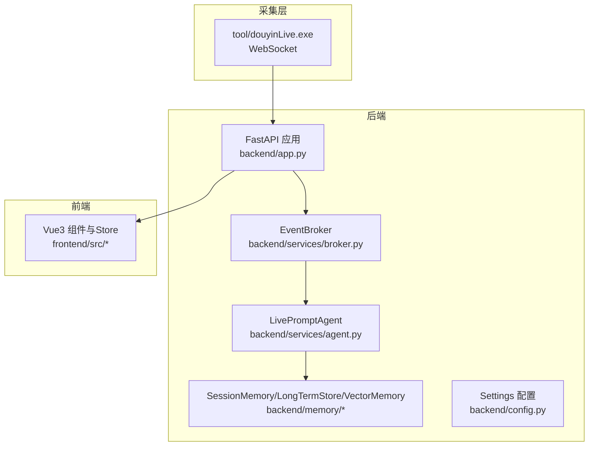
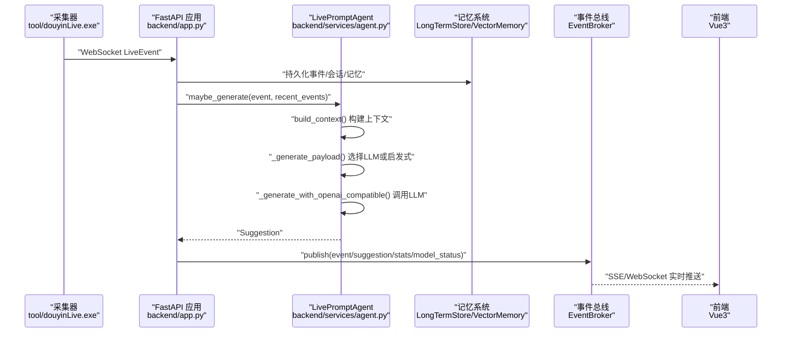
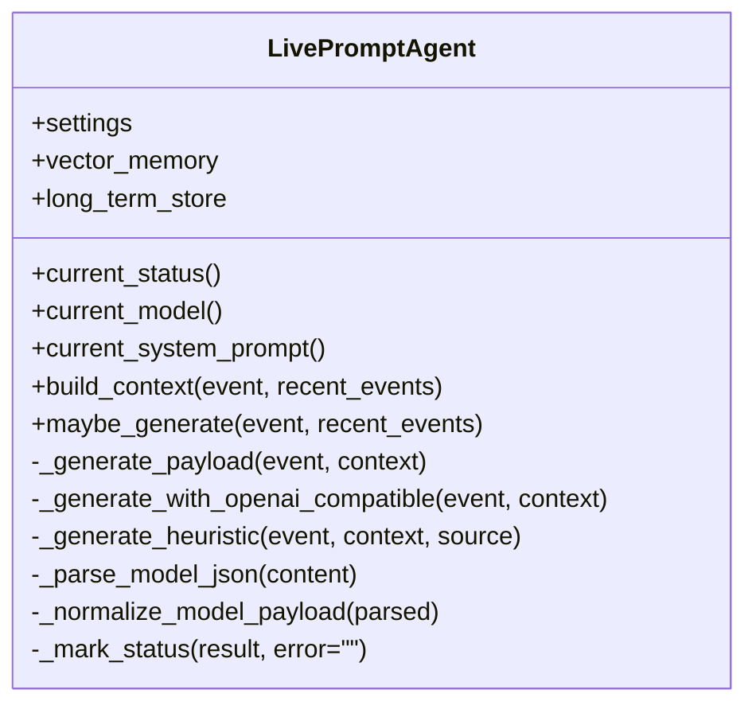
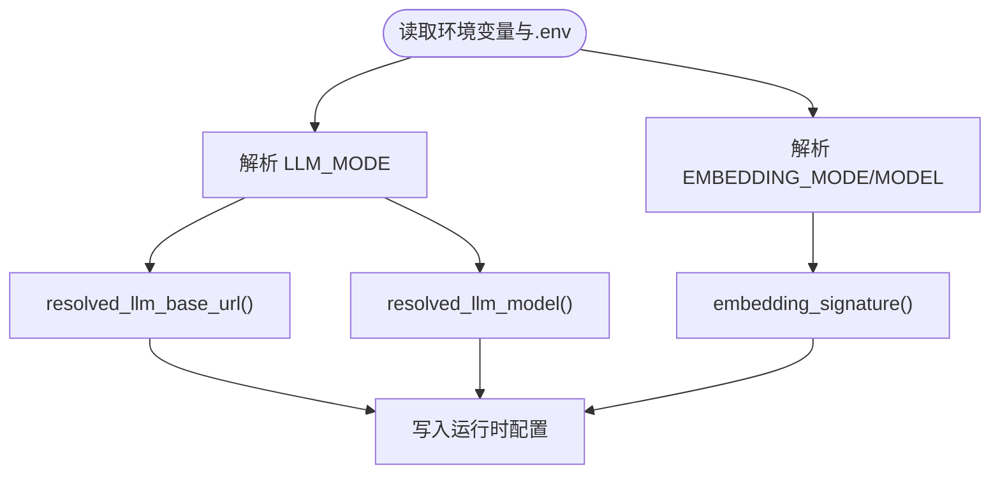
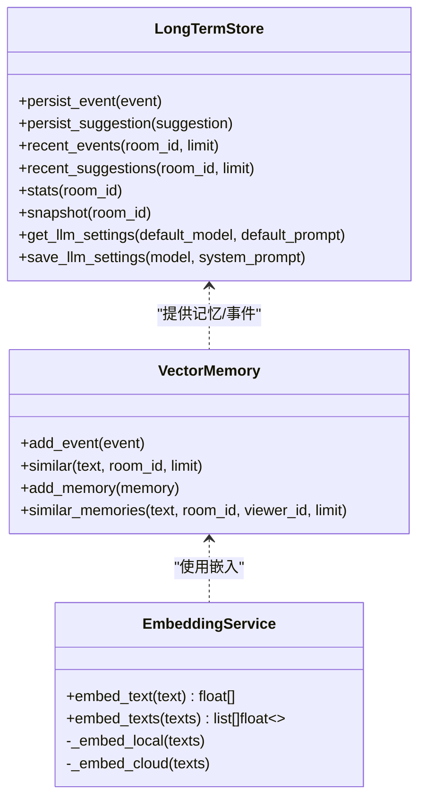
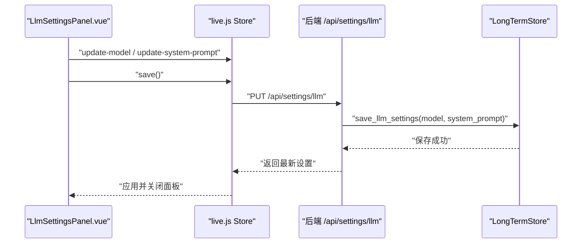
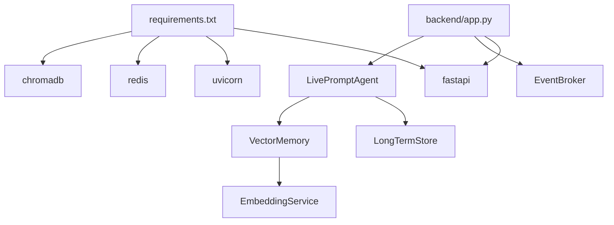

# LLM集成插件开发

<cite>
**本文引用的文件**
- [README.md](file://README.md)
- [USAGE.md](file://USAGE.md)
- [backend/app.py](file://backend/app.py)
- [backend/config.py](file://backend/config.py)
- [backend/services/agent.py](file://backend/services/agent.py)
- [backend/services/broker.py](file://backend/services/broker.py)
- [backend/memory/embedding_service.py](file://backend/memory/embedding_service.py)
- [backend/memory/vector_store.py](file://backend/memory/vector_store.py)
- [backend/memory/long_term.py](file://backend/memory/long_term.py)
- [backend/schemas/live.py](file://backend/schemas/live.py)
- [frontend/src/components/LlmSettingsPanel.vue](file://frontend/src/components/LlmSettingsPanel.vue)
- [frontend/src/stores/live.js](file://frontend/src/stores/live.js)
- [frontend/src/stores/llm-settings.test.mjs](file://frontend/src/stores/llm-settings.test.mjs)
- [tests/test_llm_settings.py](file://tests/test_llm_settings.py)
- [requirements.txt](file://requirements.txt)
- [tool/config.yaml](file://tool/config.yaml)
</cite>

## 目录
1. [简介](#简介)
2. [项目结构](#项目结构)
3. [核心组件](#核心组件)
4. [架构总览](#架构总览)
5. [详细组件分析](#详细组件分析)
6. [依赖关系分析](#依赖关系分析)
7. [性能考量](#性能考量)
8. [故障排查指南](#故障排查指南)
9. [结论](#结论)
10. [附录](#附录)

## 简介
本技术指南围绕“LLM集成插件”的开发与最佳实践展开，基于现有代码库总结出一套可复用的实现范式。重点涵盖：
- 智能提词引擎的架构设计与LLM调用流程
- 系统提示词管理与上下文构建机制
- 新LLM集成插件的开发方法（OpenAI兼容接口与自定义模型适配）
- LLM配置管理与参数调优（温度、最大令牌数等）
- 自定义LLM后端的API封装、重试与错误处理策略
- 启发式规则与LLM结合的实现方法
- 性能优化与成本控制要点
- 完整插件开发示例与测试验证方法

## 项目结构
整体采用“采集器-后端-FastAPI-前端”的三层架构，后端通过事件总线将采集到的直播事件进行标准化、持久化、记忆抽取与提词生成，并通过SSE/WebSocket实时推送到前端。

图表来源
- [backend/app.py:108-126](file://backend/app.py#L108-L126)
- [backend/services/broker.py:10-39](file://backend/services/broker.py#L10-L39)
- [backend/services/agent.py:23-60](file://backend/services/agent.py#L23-L60)
- [backend/config.py:40-112](file://backend/config.py#L40-L112)

章节来源
- [README.md:32-44](file://README.md#L32-L44)
- [backend/app.py:108-126](file://backend/app.py#L108-L126)

## 核心组件
- 配置中心（Settings）：集中管理LLM模式、模型名、API Key、超时、温度、最大令牌数、嵌入模式与向量检索参数等。
- 事件总线（EventBroker）：统一发布/订阅事件，支撑SSE与WebSocket实时推送。
- 提词代理（LivePromptAgent）：根据事件类型与上下文选择LLM或启发式规则生成建议。
- 记忆系统（SessionMemory/LongTermStore/VectorMemory）：短期会话、长期事件与语义向量记忆。
- 嵌入服务（EmbeddingService）：本地SentenceTransformer或云端OpenAI风格嵌入。
- 前端Store与组件：LLM设置面板、状态条、提词卡片、事件流等。

章节来源
- [backend/config.py:40-112](file://backend/config.py#L40-L112)
- [backend/services/broker.py:10-39](file://backend/services/broker.py#L10-L39)
- [backend/services/agent.py:23-60](file://backend/services/agent.py#L23-L60)
- [backend/memory/vector_store.py:59-84](file://backend/memory/vector_store.py#L59-L84)
- [backend/memory/embedding_service.py:18-48](file://backend/memory/embedding_service.py#L18-L48)
- [frontend/src/components/LlmSettingsPanel.vue:1-122](file://frontend/src/components/LlmSettingsPanel.vue#L1-L122)

## 架构总览
下图展示了从采集到前端展示的完整链路，以及LLM调用与回退路径。

图表来源
- [backend/app.py:73-102](file://backend/app.py#L73-L102)
- [backend/services/agent.py:105-142](file://backend/services/agent.py#L105-L142)
- [backend/services/agent.py:200-216](file://backend/services/agent.py#L200-L216)
- [backend/services/agent.py:302-437](file://backend/services/agent.py#L302-L437)
- [backend/services/broker.py:28-39](file://backend/services/broker.py#L28-L39)

章节来源
- [README.md:5-17](file://README.md#L5-L17)
- [backend/app.py:73-102](file://backend/app.py#L73-L102)

## 详细组件分析

### 智能提词引擎（LivePromptAgent）
- 模式选择：根据配置决定走在线LLM还是启发式规则；失败时自动回退。
- 上下文构建：融合最近事件、相似历史、用户画像、观众记忆与记忆文本片段。
- LLM调用：构造OpenAI兼容的messages负载，支持Authorization头与超时控制。
- 结果解析：严格校验JSON结构、字段完整性与数值范围，失败则回退启发式。
- 状态上报：维护模型状态（模式、模型名、后端、结果、错误、更新时间）。

图表来源
- [backend/services/agent.py:23-60](file://backend/services/agent.py#L23-L60)
- [backend/services/agent.py:83-142](file://backend/services/agent.py#L83-L142)
- [backend/services/agent.py:200-216](file://backend/services/agent.py#L200-L216)
- [backend/services/agent.py:302-437](file://backend/services/agent.py#L302-L437)

章节来源
- [backend/services/agent.py:23-60](file://backend/services/agent.py#L23-L60)
- [backend/services/agent.py:83-142](file://backend/services/agent.py#L83-L142)
- [backend/services/agent.py:200-216](file://backend/services/agent.py#L200-L216)
- [backend/services/agent.py:302-437](file://backend/services/agent.py#L302-L437)

### 配置管理（Settings）
- LLM模式：heuristic/qwen/openai等。
- 模型解析：根据模式推导默认模型名与兼容Base URL。
- 嵌入签名：基于嵌入模式与模型名生成向量集合后缀，避免冲突。
- 语义检索参数：事件与记忆的最小分数、查询上限、最终K等。

图表来源
- [backend/config.py:40-112](file://backend/config.py#L40-L112)

章节来源
- [backend/config.py:40-112](file://backend/config.py#L40-L112)

### 记忆系统（LongTermStore/VectorMemory/EmbeddingService）
- LongTermStore：SQLite持久化事件、建议、观众画像、笔记与记忆，提供聚合统计与快照。
- VectorMemory：Chroma向量索引或内存回退，支持按房间与观众维度检索相似历史与记忆。
- EmbeddingService：本地SentenceTransformer或云端OpenAI风格嵌入，异常时回退哈希嵌入函数。

图表来源
- [backend/memory/long_term.py:44-500](file://backend/memory/long_term.py#L44-L500)
- [backend/memory/vector_store.py:59-317](file://backend/memory/vector_store.py#L59-L317)
- [backend/memory/embedding_service.py:18-102](file://backend/memory/embedding_service.py#L18-L102)

章节来源
- [backend/memory/long_term.py:44-500](file://backend/memory/long_term.py#L44-L500)
- [backend/memory/vector_store.py:59-317](file://backend/memory/vector_store.py#L59-L317)
- [backend/memory/embedding_service.py:18-102](file://backend/memory/embedding_service.py#L18-L102)

### 前端LLM设置与测试
- LlmSettingsPanel：在线编辑模型名与系统提示词，支持保存与重置。
- Pinia Store：加载/保存LLM设置，同步到后端并更新模型状态。
- 单元测试：覆盖设置持久化、回退逻辑与运行时覆盖。

图表来源
- [frontend/src/components/LlmSettingsPanel.vue:1-122](file://frontend/src/components/LlmSettingsPanel.vue#L1-L122)
- [frontend/src/stores/live.js:354-431](file://frontend/src/stores/live.js#L354-L431)
- [backend/app.py:224-235](file://backend/app.py#L224-L235)
- [backend/memory/long_term.py:734-785](file://backend/memory/long_term.py#L734-L785)

章节来源
- [frontend/src/components/LlmSettingsPanel.vue:1-122](file://frontend/src/components/LlmSettingsPanel.vue#L1-L122)
- [frontend/src/stores/live.js:354-431](file://frontend/src/stores/live.js#L354-L431)
- [tests/test_llm_settings.py:23-62](file://tests/test_llm_settings.py#L23-L62)

## 依赖关系分析
- 后端依赖：FastAPI、事件总线、SQLite/Chroma、可选Redis。
- 前端依赖：Vue3、Pinia、SSE/WebSocket。
- 采集器：Windows可执行文件，提供WebSocket流。

图表来源
- [requirements.txt:1-6](file://requirements.txt#L1-L6)
- [backend/app.py:13-35](file://backend/app.py#L13-L35)
- [backend/services/agent.py:23-35](file://backend/services/agent.py#L23-L35)
- [backend/memory/vector_store.py:59-74](file://backend/memory/vector_store.py#L59-L74)
- [backend/memory/embedding_service.py:18-23](file://backend/memory/embedding_service.py#L18-L23)

章节来源
- [requirements.txt:1-6](file://requirements.txt#L1-L6)
- [backend/app.py:13-35](file://backend/app.py#L13-L35)

## 性能考量
- 响应延迟
  - LLM超时：合理设置超时阈值，避免阻塞事件处理。
  - 回退策略：LLM失败立即回退启发式，保障实时性。
  - 上下文裁剪：限制最近事件与相似历史数量，降低输入长度。
- 成本控制
  - 温度与最大令牌数：适度降低温度与最大令牌数，减少Token消耗。
  - 模型选择：优先选择性价比更高的模型；必要时使用本地嵌入与向量回退。
  - 语义召回：通过最小分数与最终K限制召回规模，避免过度检索。
- 存储与索引
  - SQLite与Chroma：事件与记忆分表索引，避免全表扫描。
  - 向量集合后缀：基于嵌入模式与模型名生成唯一后缀，避免冲突。
- 网络与并发
  - SSE/WS：事件总线异步广播，避免阻塞主线程。
  - 重连与心跳：采集器与后端的心跳与重连参数需平衡稳定性与资源占用。

[本节为通用指导，无需特定文件来源]

## 故障排查指南
- LLM调用失败
  - 检查API Key、Base URL与模型名是否正确。
  - 查看后端日志中的HTTP状态码、网络错误与超时信息。
  - 若失败，系统会标记状态为回退并走启发式规则。
- 前端无建议
  - 确认采集器已启动且WebSocket连接正常。
  - 检查房间ID与后端日志中的连接状态。
- 数据未入库
  - 确认事件已进入事件总线并被持久化。
  - 检查SQLite与Chroma目录是否存在与权限是否正确。
- LLM设置不生效
  - 确认前端Store已成功PUT到后端并返回最新设置。
  - 测试用例覆盖了设置保存与回退逻辑，可参考其断言。

章节来源
- [backend/services/agent.py:330-437](file://backend/services/agent.py#L330-L437)
- [tests/test_llm_settings.py:23-62](file://tests/test_llm_settings.py#L23-L62)
- [USAGE.md:198-256](file://USAGE.md#L198-L256)

## 结论
该代码库提供了完整的LLM集成插件范式：以事件驱动为核心，结合语义记忆与启发式规则，既保证实时性又具备良好的可扩展性。通过配置中心统一管理模型参数与嵌入策略，前端提供在线编辑与可视化监控，形成从采集到展示的一体化方案。后续可在以下方向演进：
- 多房间并行接入与调度
- 更丰富的提示词模板与A/B测试
- 观察性与可观测性增强（指标、日志、追踪）
- 更灵活的LLM后端抽象与重试策略

[本节为总结，无需特定文件来源]

## 附录

### 开发新LLM集成插件（OpenAI兼容与自定义模型）
- 步骤概览
  - 在配置中选择模式与Base URL，或直接指定兼容Endpoint。
  - 在Agent中扩展或替换LLM调用逻辑，保持统一的错误处理与状态上报。
  - 通过后端接口保存/读取系统提示词，前端提供在线编辑面板。
- 关键点
  - 统一messages格式与Authorization头。
  - 严格的JSON解析与字段校验，失败即回退启发式。
  - 通过Settings解析默认模型与Base URL，便于切换与迁移。

章节来源
- [backend/config.py:84-104](file://backend/config.py#L84-L104)
- [backend/services/agent.py:302-437](file://backend/services/agent.py#L302-L437)
- [backend/app.py:224-235](file://backend/app.py#L224-L235)
- [frontend/src/components/LlmSettingsPanel.vue:1-122](file://frontend/src/components/LlmSettingsPanel.vue#L1-L122)

### LLM配置管理最佳实践
- 模型参数调优
  - 温度：0.3–0.7之间通常兼顾创造性与稳定性。
  - 最大令牌数：根据建议长度与上下文裁剪综合评估。
  - 超时：结合网络质量设置合理超时，避免阻塞。
- 系统提示词
  - 明确角色与输出格式约束，减少歧义。
  - 支持在线编辑与回退策略，保障稳定性。
- 嵌入与向量
  - 云端与本地混合策略，异常时回退哈希嵌入。
  - 通过最小分数与最终K控制召回质量与性能。

章节来源
- [backend/config.py:57-76](file://backend/config.py#L57-L76)
- [backend/services/agent.py:17-21](file://backend/services/agent.py#L17-L21)
- [backend/memory/embedding_service.py:18-102](file://backend/memory/embedding_service.py#L18-L102)
- [backend/memory/vector_store.py:86-108](file://backend/memory/vector_store.py#L86-L108)

### 自定义LLM后端实现要点
- API封装
  - 统一请求构造（headers、body、endpoint）。
  - 支持Authorization与自定义Headers。
- 错误处理
  - 捕获HTTP/网络/超时/JSON解析等异常，记录详细日志。
  - 失败时标记状态并回退启发式。
- 状态上报
  - 维护模式、模型、后端、结果、错误与更新时间。

章节来源
- [backend/services/agent.py:302-437](file://backend/services/agent.py#L302-L437)

### 启发式规则与LLM结合
- 触发条件：特定事件类型（礼物、关注）或命中关键词。
- 规则优先级：高/中/低，结合历史记忆与相似历史进行微调。
- 回退策略：LLM失败即刻回退，提升鲁棒性。

章节来源
- [backend/services/agent.py:171-300](file://backend/services/agent.py#L171-L300)

### 性能优化与成本控制
- 输入裁剪：限制最近事件与相似历史数量。
- 模型选择：优先低成本模型；必要时使用本地嵌入。
- 语义召回：通过阈值与K限制召回规模。
- 超时与重试：合理设置超时，避免阻塞；错误即回退。

章节来源
- [backend/services/agent.py:83-103](file://backend/services/agent.py#L83-L103)
- [backend/memory/vector_store.py:86-108](file://backend/memory/vector_store.py#L86-L108)

### 插件开发示例与测试验证
- 示例流程
  - 前端编辑模型名与系统提示词 → PUT到后端 → 持久化到SQLite → Agent读取运行时覆盖。
- 测试验证
  - 前端Store测试：覆盖GET/PUT与回退逻辑。
  - 后端单元测试：覆盖设置持久化与回退。

章节来源
- [frontend/src/stores/llm-settings.test.mjs:1-70](file://frontend/src/stores/llm-settings.test.mjs#L1-L70)
- [tests/test_llm_settings.py:23-62](file://tests/test_llm_settings.py#L23-L62)