# 存储后端插件开发

<cite>
**本文档引用的文件**
- [vector_store.py](file://backend/memory/vector_store.py)
- [embedding_service.py](file://backend/memory/embedding_service.py)
- [long_term.py](file://backend/memory/long_term.py)
- [session_memory.py](file://backend/memory/session_memory.py)
- [config.py](file://backend/config.py)
- [live.py](file://backend/schemas/live.py)
- [app.py](file://backend/app.py)
- [rebuild_embeddings.py](file://backend/memory/rebuild_embeddings.py)
- [test_vector_store.py](file://tests/test_vector_store.py)
- [test_long_term.py](file://tests/test_long_term.py)
- [requirements.txt](file://requirements.txt)
</cite>

## 目录
1. [简介](#简介)
2. [项目结构](#项目结构)
3. [核心组件](#核心组件)
4. [架构概览](#架构概览)
5. [详细组件分析](#详细组件分析)
6. [依赖关系分析](#依赖关系分析)
7. [性能考虑](#性能考虑)
8. [故障排除指南](#故障排除指南)
9. [结论](#结论)
10. [附录](#附录)

## 简介

本指南面向存储后端插件开发者，深入解释向量存储插件的架构设计与实现机制。项目采用多层存储架构，包括：

- **ChromaDB 向量存储**：用于事件历史和观众记忆的语义检索
- **SQLite 持久化**：长期数据存储和复杂查询支持
- **Redis 缓存**：短期会话内存和实时数据缓存

系统通过嵌入服务提供统一的向量化能力，支持本地和云端两种模式，并具备智能降级机制。本文将详细说明如何开发新的存储后端插件，包括接口抽象、数据模型映射和查询优化策略。

## 项目结构

项目采用分层架构设计，主要目录结构如下：

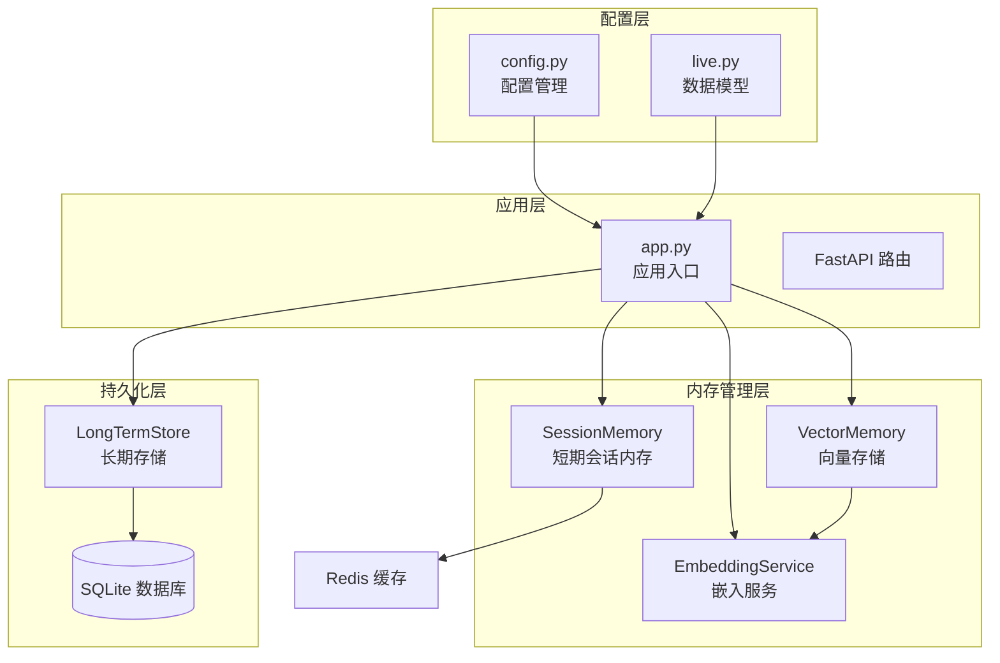

**图表来源**
- [app.py:1-285](file://backend/app.py#L1-L285)
- [config.py:1-113](file://backend/config.py#L1-L113)

**章节来源**
- [app.py:1-285](file://backend/app.py#L1-L285)
- [config.py:1-113](file://backend/config.py#L1-L113)

## 核心组件

### 向量存储组件

向量存储是系统的核心组件，负责语义相似度搜索和向量索引管理：

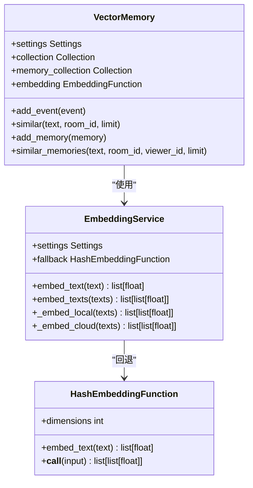

**图表来源**
- [vector_store.py:59-317](file://backend/memory/vector_store.py#L59-L317)
- [embedding_service.py:18-102](file://backend/memory/embedding_service.py#L18-L102)

### 长期存储组件

长期存储提供持久化的数据管理和复杂查询能力：

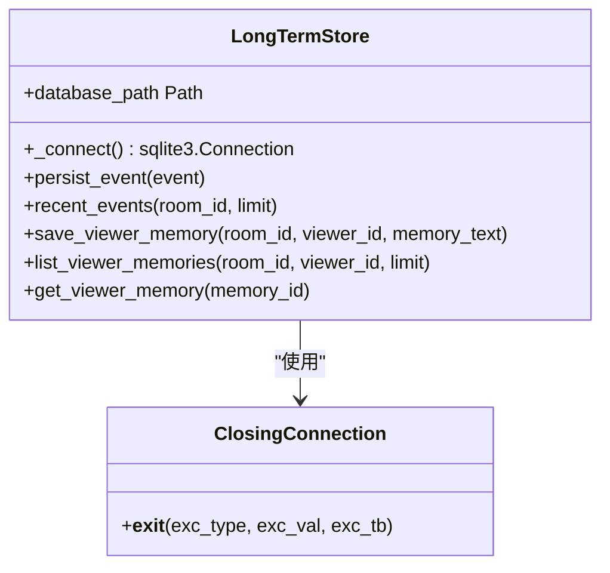

**图表来源**
- [long_term.py:44-967](file://backend/memory/long_term.py#L44-L967)

### 短期会话内存组件

短期会话内存提供高性能的实时数据缓存：

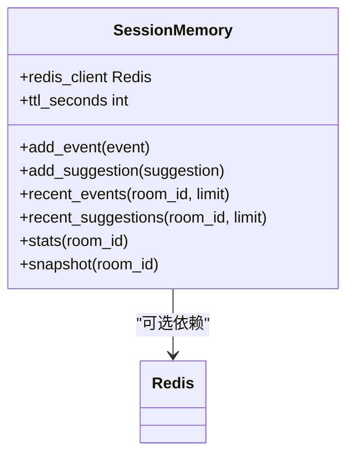

**图表来源**
- [session_memory.py:17-113](file://backend/memory/session_memory.py#L17-L113)

**章节来源**
- [vector_store.py:59-317](file://backend/memory/vector_store.py#L59-L317)
- [embedding_service.py:18-102](file://backend/memory/embedding_service.py#L18-L102)
- [long_term.py:44-967](file://backend/memory/long_term.py#L44-L967)
- [session_memory.py:17-113](file://backend/memory/session_memory.py#L17-L113)

## 架构概览

系统采用分层架构，各层职责明确：

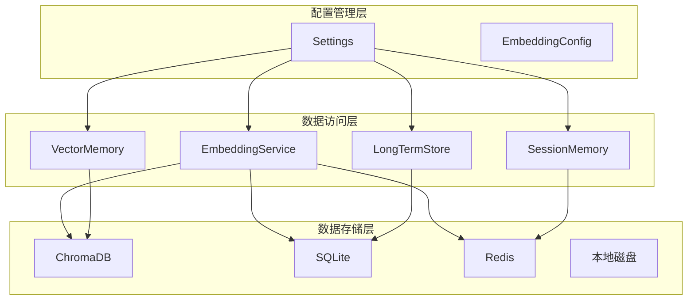

**图表来源**
- [app.py:27-35](file://backend/app.py#L27-L35)
- [config.py:40-113](file://backend/config.py#L40-L113)

### 数据流处理

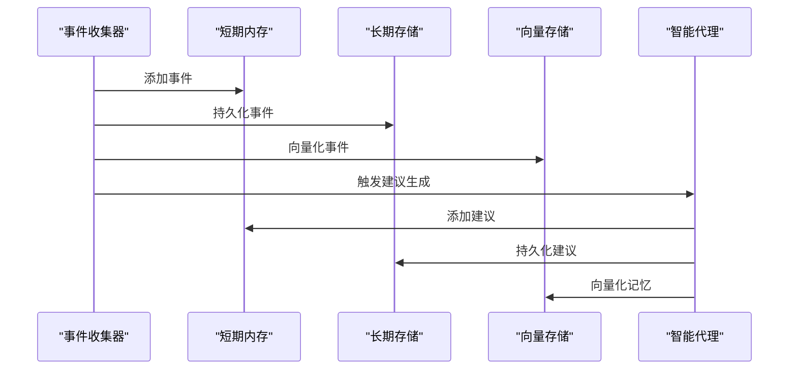

**图表来源**
- [app.py:73-102](file://backend/app.py#L73-L102)

**章节来源**
- [app.py:27-35](file://backend/app.py#L27-L35)
- [app.py:73-102](file://backend/app.py#L73-L102)

## 详细组件分析

### 向量相似度搜索实现

向量相似度搜索是系统的核心功能，实现了多种搜索策略：

#### 距离计算方法

系统提供了多种距离到分数的转换方法：

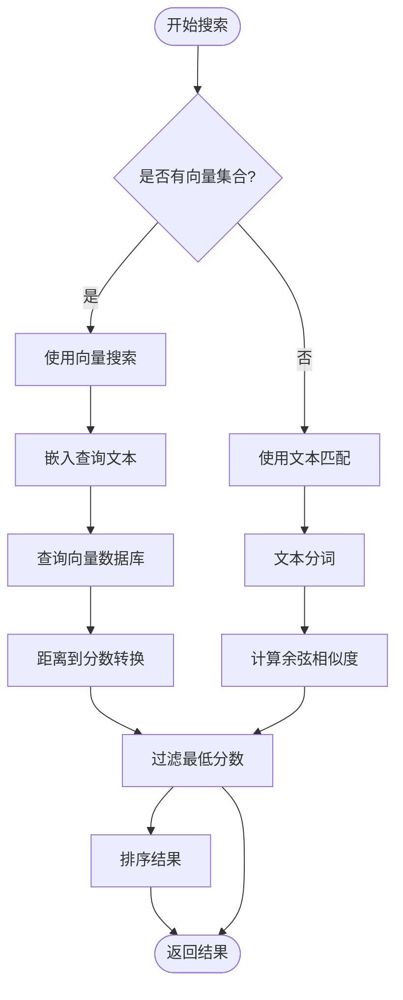

**图表来源**
- [vector_store.py:172-230](file://backend/memory/vector_store.py#L172-L230)
- [vector_store.py:87-90](file://backend/memory/vector_store.py#L87-L90)

#### 查询优化策略

系统实现了多层次的查询优化：

1. **预过滤策略**：根据房间ID和时间戳进行预过滤
2. **查询限制**：动态调整查询结果数量
3. **分数阈值**：设置最低相似度阈值
4. **最终裁剪**：根据业务需求进行最终结果裁剪

**章节来源**
- [vector_store.py:86-108](file://backend/memory/vector_store.py#L86-L108)
- [vector_store.py:172-230](file://backend/memory/vector_store.py#L172-L230)

### 嵌入服务架构

嵌入服务提供了统一的向量化接口，支持多种后端：

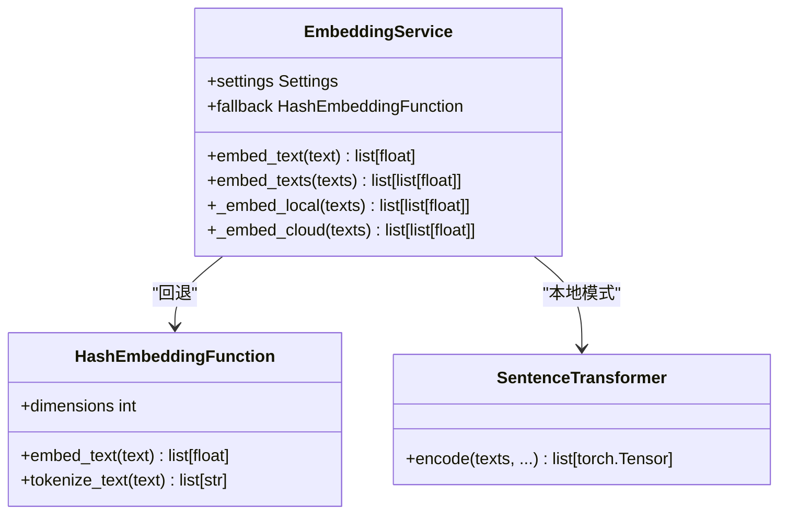

**图表来源**
- [embedding_service.py:18-102](file://backend/memory/embedding_service.py#L18-L102)
- [vector_store.py:34-56](file://backend/memory/vector_store.py#L34-L56)

#### 嵌入模式切换

系统支持三种嵌入模式：

1. **本地模式**：使用本地SentenceTransformer模型
2. **云端模式**：调用外部API获取嵌入向量
3. **回退模式**：使用哈希函数生成固定维度向量

**章节来源**
- [embedding_service.py:25-48](file://backend/memory/embedding_service.py#L25-L48)
- [embedding_service.py:65-101](file://backend/memory/embedding_service.py#L65-L101)

### 配置管理系统

配置系统提供了灵活的参数管理机制：

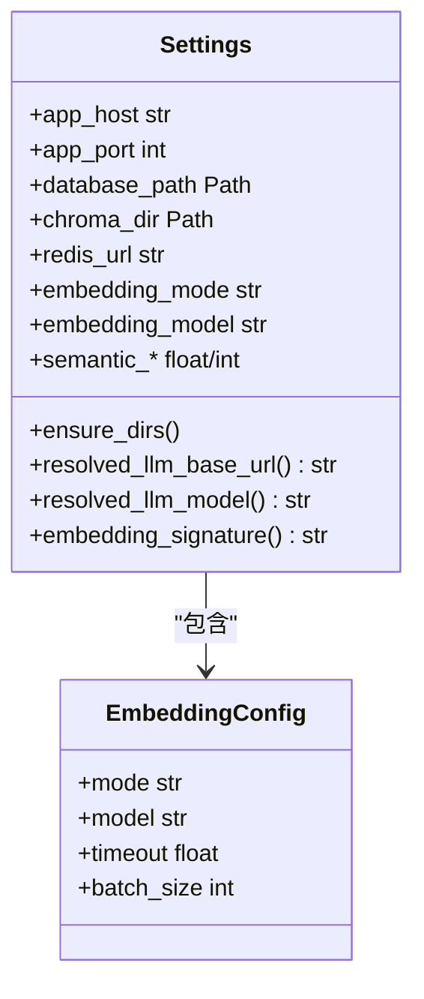

**图表来源**
- [config.py:40-113](file://backend/config.py#L40-L113)

**章节来源**
- [config.py:40-113](file://backend/config.py#L40-L113)

## 依赖关系分析

系统依赖关系清晰，采用松耦合设计：

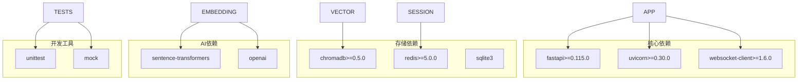

**图表来源**
- [requirements.txt:1-6](file://requirements.txt#L1-L6)

### 外部依赖管理

系统通过条件导入处理可选依赖，确保在缺少某些依赖时仍能正常运行：

```python
try:
    import chromadb
except ImportError:
    chromadb = None

try:
    import redis
except ImportError:
    redis = None

try:
    from sentence_transformers import SentenceTransformer
except ImportError:
    SentenceTransformer = None
```

**章节来源**
- [vector_store.py:10-13](file://backend/memory/vector_store.py#L10-L13)
- [session_memory.py:11-14](file://backend/memory/session_memory.py#L11-L14)
- [embedding_service.py:9-12](file://backend/memory/embedding_service.py#L9-L12)

## 性能考虑

### 查询性能优化

系统在多个层面实现了性能优化：

1. **索引策略**：
   - SQLite创建了多个复合索引
   - 向量数据库使用分区集合
   - Redis使用列表结构优化时间序列数据

2. **缓存策略**：
   - Redis缓存短期活跃数据
   - 内存缓存最近事件和建议
   - 向量索引缓存常用查询结果

3. **批处理优化**：
   - 批量插入和更新操作
   - 分块处理大量数据
   - 异步处理非关键任务

### 内存管理

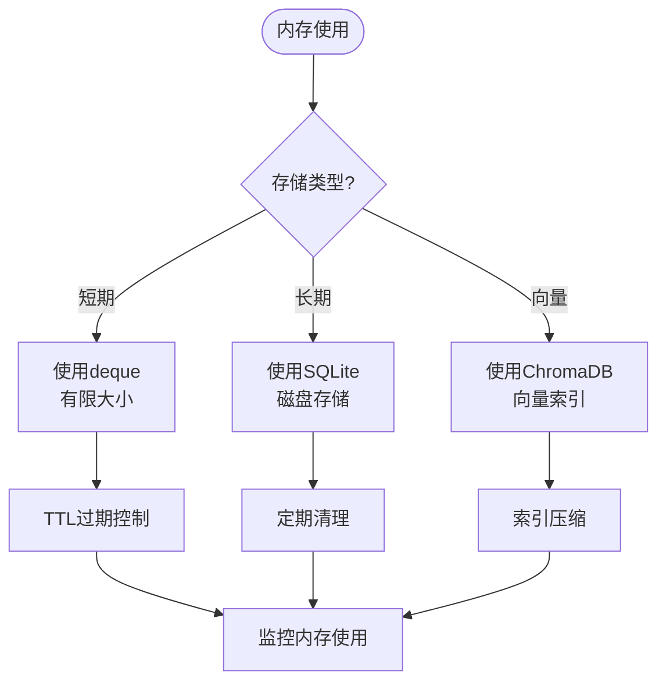

**图表来源**
- [session_memory.py:26-27](file://backend/memory/session_memory.py#L26-L27)
- [long_term.py:438-454](file://backend/memory/long_term.py#L438-L454)

**章节来源**
- [session_memory.py:26-27](file://backend/memory/session_memory.py#L26-L27)
- [long_term.py:438-454](file://backend/memory/long_term.py#L438-L454)

## 故障排除指南

### 常见问题诊断

#### 向量存储问题

1. **ChromaDB连接失败**：
   - 检查存储路径权限
   - 验证ChromaDB版本兼容性
   - 确认磁盘空间充足

2. **嵌入向量为空**：
   - 验证输入文本格式
   - 检查嵌入服务配置
   - 确认网络连接状态

#### SQLite性能问题

1. **查询缓慢**：
   - 检查索引是否正确创建
   - 分析SQL执行计划
   - 考虑添加复合索引

2. **数据库锁定**：
   - 检查并发访问模式
   - 调整事务隔离级别
   - 实现重试机制

#### Redis连接问题

1. **连接超时**：
   - 检查Redis服务器状态
   - 验证网络连接
   - 调整超时参数

2. **内存不足**：
   - 检查TTL设置
   - 分析键空间使用情况
   - 实施内存回收策略

**章节来源**
- [test_vector_store.py:20-103](file://tests/test_vector_store.py#L20-L103)
- [test_long_term.py:7-29](file://tests/test_long_term.py#L7-L29)

### 日志和监控

系统提供了全面的日志记录机制：

```python
logger = logging.getLogger(__name__)

# 嵌入服务日志
logger.info("加载本地嵌入模型: model=%s device=%s", model_name, device)

# 向量存储日志  
logger.warning("Chroma不可用，使用内存索引")

# 配置日志
logger.debug("配置加载完成: %s", settings_dict)
```

**章节来源**
- [embedding_service.py:54-62](file://backend/memory/embedding_service.py#L54-L62)
- [vector_store.py:81-84](file://backend/memory/vector_store.py#L81-L84)

## 结论

本存储后端插件开发指南详细介绍了系统的架构设计和实现机制。系统通过分层架构实现了高可用性和可扩展性，支持多种存储后端和查询策略。

关键特性包括：
- **多后端支持**：ChromaDB、SQLite、Redis的统一接口
- **智能降级**：在依赖缺失时自动回退到备用方案
- **性能优化**：多层次缓存和索引策略
- **配置灵活**：动态参数调整和环境适配

对于新存储后端插件的开发，建议遵循以下原则：
1. 实现统一的数据模型接口
2. 提供智能降级机制
3. 优化查询性能和内存使用
4. 完善错误处理和监控
5. 支持配置管理和动态调整

## 附录

### 开发新存储后端插件步骤

#### 1. 接口抽象设计

```python
class BaseStorageBackend:
    """存储后端基础接口"""
    
    def upsert(self, records: List[Record]) -> bool:
        """插入或更新记录"""
        raise NotImplementedError
    
    def query(self, query_params: Dict) -> List[Record]:
        """查询记录"""
        raise NotImplementedError
    
    def delete(self, record_id: str) -> bool:
        """删除记录"""
        raise NotImplementedError
    
    def close(self) -> None:
        """关闭连接"""
        pass
```

#### 2. 数据模型映射

参考现有数据模型设计：

```python
class LiveEvent(BaseModel):
    """直播事件数据模型"""
    event_id: str
    room_id: str
    event_type: str
    content: str
    user: Actor
    ts: int
    metadata: Dict[str, Any] = Field(default_factory=dict)
```

#### 3. 集成验证流程

```python
# 测试用例模板
def test_storage_backend():
    """存储后端集成测试"""
    
    # 初始化存储后端
    backend = StorageBackend(config)
    
    # 插入测试数据
    test_records = create_test_data()
    backend.upsert(test_records)
    
    # 验证查询结果
    results = backend.query({"room_id": "test_room"})
    assert len(results) == len(test_records)
    
    # 清理测试数据
    backend.delete_all()
    backend.close()
```

#### 4. 性能基准测试

```python
import time
import pytest

@pytest.mark.performance
def test_storage_performance():
    """存储性能基准测试"""
    
    backend = StorageBackend(config)
    
    # 测试批量插入性能
    start_time = time.time()
    backend.upsert(large_dataset)
    end_time = time.time()
    
    insert_time = end_time - start_time
    assert insert_time < threshold
    
    # 测试查询性能
    start_time = time.time()
    results = backend.query({"limit": 1000})
    end_time = time.time()
    
    query_time = end_time - start_time
    assert query_time < threshold
```

#### 5. 配置管理最佳实践

```python
@dataclass
class StorageConfig:
    """存储配置类"""
    
    # 基础配置
    host: str = "localhost"
    port: int = 5432
    database: str = "storage_db"
    
    # 连接池配置
    pool_size: int = 10
    max_overflow: int = 20
    pool_timeout: int = 30
    
    # 超时配置
    connect_timeout: int = 10
    query_timeout: int = 30
    
    # 重试配置
    max_retries: int = 3
    retry_delay: int = 1
    
    def get_connection_string(self) -> str:
        """生成连接字符串"""
        return f"postgresql://{self.host}:{self.port}/{self.database}"
```

#### 6. 错误处理和重试机制

```python
import time
import random
from functools import wraps

def retry_on_failure(max_retries: int = 3, delay: int = 1):
    """重试装饰器"""
    
    def decorator(func):
        @wraps(func)
        def wrapper(*args, **kwargs):
            last_exception = None
            
            for attempt in range(max_retries):
                try:
                    return func(*args, **kwargs)
                except Exception as e:
                    last_exception = e
                    if attempt < max_retries - 1:
                        wait_time = delay * (2 ** attempt) + random.uniform(0, 1)
                        time.sleep(wait_time)
            
            raise last_exception
        
        return wrapper
    return decorator
```

#### 7. 监控和指标收集

```python
from prometheus_client import Counter, Histogram, Gauge

# 定义监控指标
STORAGE_OPERATIONS = Counter(
    'storage_operations_total',
    'Total storage operations',
    ['operation', 'backend']
)

STORAGE_DURATION = Histogram(
    'storage_duration_seconds',
    'Storage operation duration',
    ['operation', 'backend']
)

ACTIVE_CONNECTIONS = Gauge(
    'storage_active_connections',
    'Active storage connections',
    ['backend']
)
```

#### 8. 备份和恢复策略

```python
import shutil
from datetime import datetime

class StorageBackup:
    """存储备份管理"""
    
    def __init__(self, storage_backend: BaseStorageBackend):
        self.storage = storage_backend
        self.backup_dir = Path("backups")
        self.backup_dir.mkdir(exist_ok=True)
    
    def create_backup(self, backup_name: str = None) -> Path:
        """创建存储备份"""
        
        if not backup_name:
            backup_name = f"backup_{datetime.now().strftime('%Y%m%d_%H%M%S')}"
        
        backup_path = self.backup_dir / backup_name
        backup_path.mkdir()
        
        # 导出数据
        data = self.storage.export_data()
        
        # 保存备份文件
        backup_file = backup_path / "data.json"
        with open(backup_file, 'w') as f:
            json.dump(data, f)
        
        return backup_path
    
    def restore_backup(self, backup_path: Path) -> bool:
        """从备份恢复数据"""
        
        backup_file = backup_path / "data.json"
        if not backup_file.exists():
            return False
        
        with open(backup_file, 'r') as f:
            data = json.load(f)
        
        # 恢复数据
        self.storage.import_data(data)
        return True
```

#### 9. 容量规划指南

```python
class StorageCapacityPlanner:
    """存储容量规划器"""
    
    def __init__(self, config: StorageConfig):
        self.config = config
    
    def estimate_required_space(self, expected_events_per_day: int, retention_days: int) -> int:
        """估算所需存储空间"""
        
        # 基础数据大小（字节）
        base_size_per_event = 500  # 平均每个事件的JSON大小
        metadata_size = 200       # 元数据大小
        index_size_factor = 2.0   # 索引占用比例
        
        # 计算总大小
        total_events = expected_events_per_day * retention_days
        total_size = (base_size_per_event + metadata_size) * total_events
        index_size = total_size * index_size_factor
        
        return total_size + index_size
    
    def recommend_config(self, estimated_space: int) -> StorageConfig:
        """推荐配置参数"""
        
        # 根据容量推荐配置
        if estimated_space < 100 * 1024 * 1024:  # < 100MB
            return StorageConfig(pool_size=5, max_overflow=10)
        elif estimated_space < 1024 * 1024 * 1024:  # < 1GB
            return StorageConfig(pool_size=10, max_overflow=20)
        else:
            return StorageConfig(pool_size=20, max_overflow=50)
```

#### 10. 安全和权限管理

```python
from cryptography.fernet import Fernet

class SecureStorageConfig:
    """安全存储配置"""
    
    def __init__(self, encryption_key: bytes = None):
        self.encryption_key = encryption_key or Fernet.generate_key()
        self.cipher_suite = Fernet(self.encryption_key)
    
    def encrypt_connection_string(self, connection_string: str) -> str:
        """加密连接字符串"""
        return self.cipher_suite.encrypt(connection_string.encode()).decode()
    
    def decrypt_connection_string(self, encrypted_string: str) -> str:
        """解密连接字符串"""
        return self.cipher_suite.decrypt(encrypted_string.encode()).decode()
    
    def validate_permissions(self, user_role: str, resource_access: str) -> bool:
        """验证用户权限"""
        
        permissions = {
            "admin": ["read", "write", "delete", "admin"],
            "writer": ["read", "write"],
            "reader": ["read"]
        }
        
        return resource_access in permissions.get(user_role, [])
```

通过遵循这些开发指南和最佳实践，开发者可以创建高质量的存储后端插件，为系统提供可靠的存储解决方案。