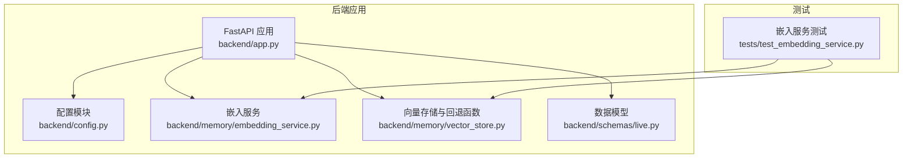
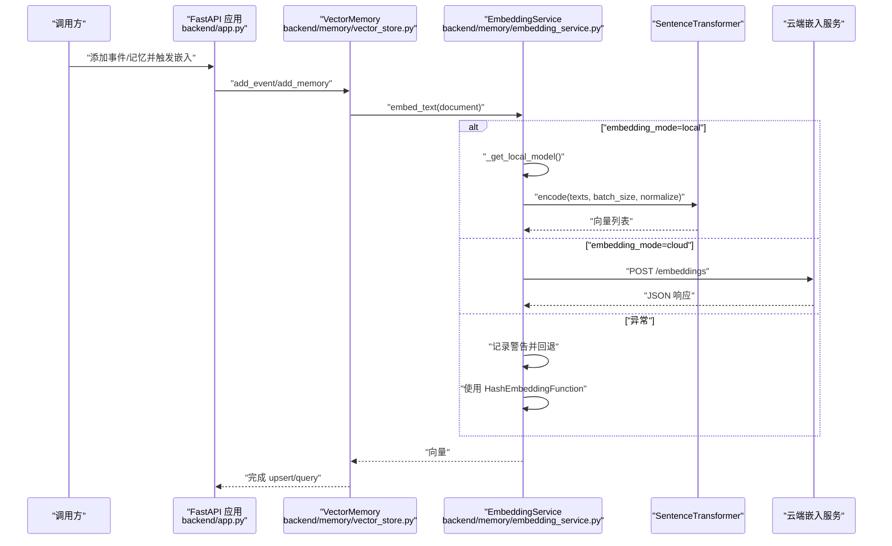
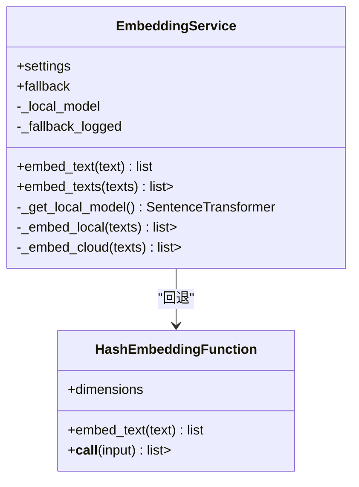
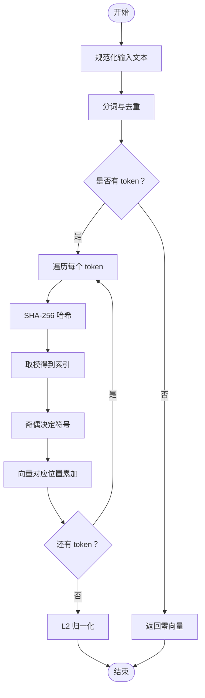
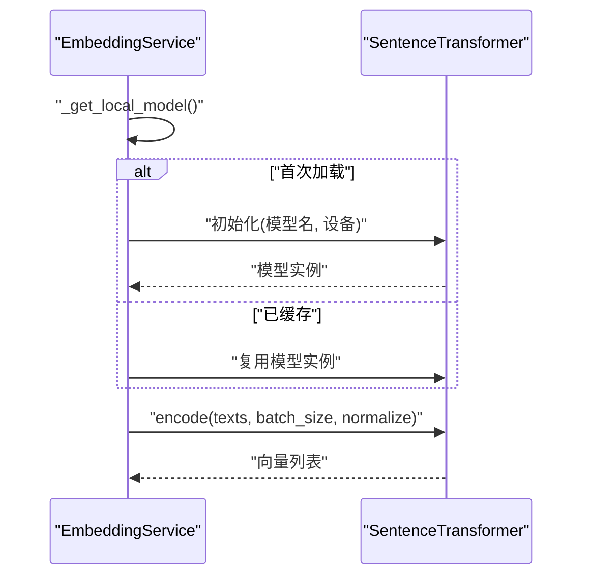
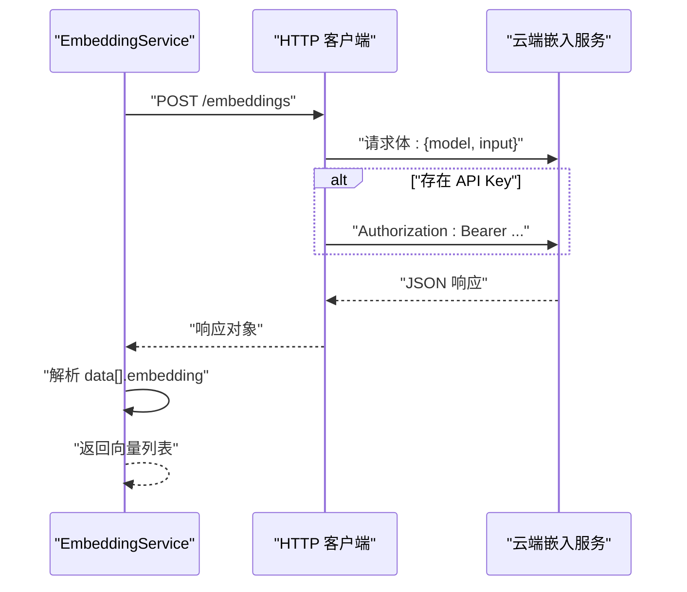
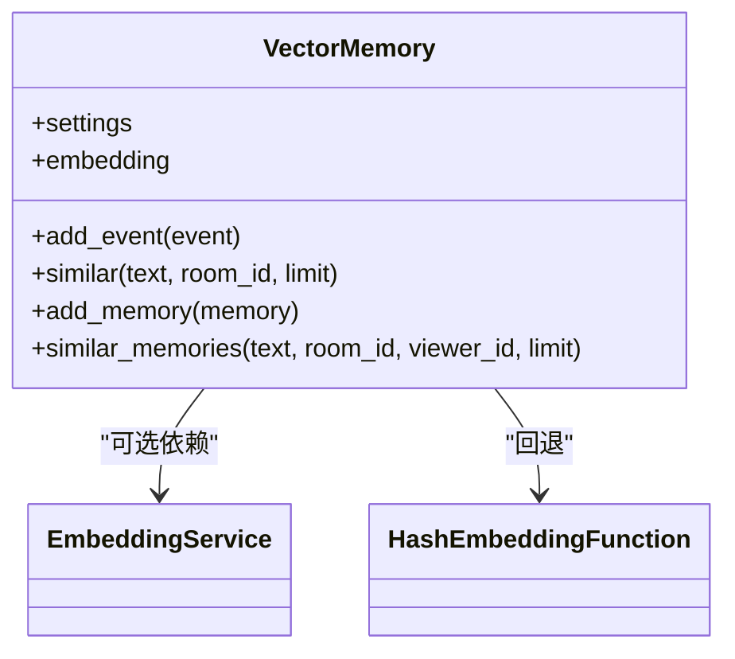
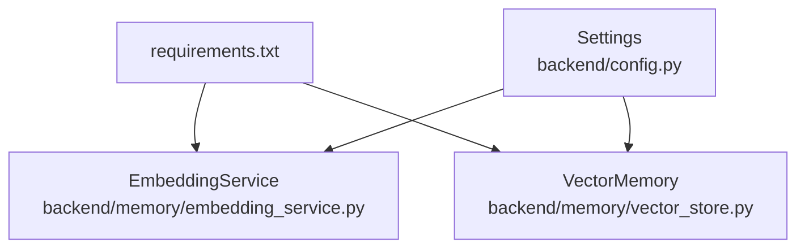

# 嵌入模型插件开发

<cite>
**本文引用的文件列表**
- [embedding_service.py](file://backend/memory/embedding_service.py)
- [vector_store.py](file://backend/memory/vector_store.py)
- [config.py](file://backend/config.py)
- [app.py](file://backend/app.py)
- [live.py](file://backend/schemas/live.py)
- [test_embedding_service.py](file://tests/test_embedding_service.py)
- [requirements.txt](file://requirements.txt)
- [README.md](file://README.md)
- [USAGE.md](file://USAGE.md)
</cite>

## 目录
1. [简介](#简介)
2. [项目结构](#项目结构)
3. [核心组件](#核心组件)
4. [架构总览](#架构总览)
5. [详细组件分析](#详细组件分析)
6. [依赖关系分析](#依赖关系分析)
7. [性能考量](#性能考量)
8. [故障排除指南](#故障排除指南)
9. [结论](#结论)
10. [附录](#附录)

## 简介
本技术文档围绕嵌入模型插件开发展开，重点解释 EmbeddingService 类的设计架构与实现细节，涵盖本地模型（SentenceTransformer）与云端模型（OpenAI 兼容）的双模式支持机制，以及 HashEmbeddingFunction 回退机制的工作原理与使用场景。文档还提供开发新嵌入模型插件的接口实现、配置参数设置、错误处理策略、SentenceTransformer 本地模型集成步骤（设备选择、批处理大小配置与性能优化）、OpenAI 兼容云端嵌入 API 集成方法（认证机制、请求格式与响应处理），并给出插件配置示例、最佳实践与故障排除指南。

## 项目结构
后端采用 FastAPI 应用入口，内存子系统包含会话记忆、长期存储与向量存储，嵌入服务位于 memory 子模块中，配置集中于 config 模块，单元测试覆盖嵌入服务行为。

**图表来源**
- [app.py:13-31](file://backend/app.py#L13-L31)
- [embedding_service.py:18-102](file://backend/memory/embedding_service.py#L18-L102)
- [vector_store.py:34-57](file://backend/memory/vector_store.py#L34-L57)
- [config.py:40-113](file://backend/config.py#L40-L113)
- [live.py:29-111](file://backend/schemas/live.py#L29-L111)
- [test_embedding_service.py:1-83](file://tests/test_embedding_service.py#L1-L83)

**章节来源**
- [app.py:13-31](file://backend/app.py#L13-L31)
- [README.md:32-44](file://README.md#L32-L44)

## 核心组件
- EmbeddingService：统一的嵌入服务抽象，支持本地与云端两种模式，异常时自动回退到 HashEmbeddingFunction。
- HashEmbeddingFunction：轻量级本地哈希回退函数，用于在外部嵌入不可用时提供向量表示。
- Settings：集中配置，包含嵌入模式、模型名、基础 URL、API Key、超时、本地设备与批大小等。
- VectorMemory：基于 Chroma 的向量存储，内部可使用 EmbeddingService 或 HashEmbeddingFunction 作为嵌入函数。
- LiveEvent/ViewerMemory 等数据模型：事件与记忆的数据结构，支撑嵌入与检索流程。

**章节来源**
- [embedding_service.py:18-102](file://backend/memory/embedding_service.py#L18-L102)
- [vector_store.py:34-57](file://backend/memory/vector_store.py#L34-L57)
- [config.py:40-113](file://backend/config.py#L40-L113)
- [live.py:29-111](file://backend/schemas/live.py#L29-L111)

## 架构总览
嵌入服务在应用启动时被注入到 VectorMemory 中，用于事件与记忆的向量化与相似检索。当嵌入服务处于云端模式时，会向 OpenAI 兼容的 /embeddings 端点发起请求；当处于本地模式时，使用 SentenceTransformer 进行编码；若任一模式发生异常，则回退到 HashEmbeddingFunction。

**图表来源**
- [app.py:27-35](file://backend/app.py#L27-L35)
- [vector_store.py:149-170](file://backend/memory/vector_store.py#L149-L170)
- [embedding_service.py:28-102](file://backend/memory/embedding_service.py#L28-L102)

## 详细组件分析

### EmbeddingService 类设计与实现
- 初始化：接收 Settings，构造 HashEmbeddingFunction 作为回退函数，缓存本地模型句柄。
- embed_text/embed_texts：统一入口，对输入进行规范化处理，根据 Settings.embedding_mode 选择本地或云端路径；异常时记录警告并回退到哈希向量。
- 本地模式：延迟加载 SentenceTransformer，支持设备选择与批大小配置，开启归一化。
- 云端模式：构造 OpenAI 兼容请求，支持 Authorization 头与超时控制，解析响应中的 embedding 字段。

**图表来源**
- [embedding_service.py:18-102](file://backend/memory/embedding_service.py#L18-L102)
- [vector_store.py:34-57](file://backend/memory/vector_store.py#L34-L57)

**章节来源**
- [embedding_service.py:18-102](file://backend/memory/embedding_service.py#L18-L102)

### HashEmbeddingFunction 回退机制
- 作用：在外部嵌入服务不可用或异常时，提供稳定的本地向量表示，保证系统可用性。
- 算法：对文本进行分词，使用 SHA-256 对每个 token 做哈希，按维度数取模分配符号位，最后做 L2 归一化。
- 使用场景：依赖缺失（如 sentence-transformers 未安装）、网络异常、云端服务不可达、模型加载失败等。

**图表来源**
- [vector_store.py:34-57](file://backend/memory/vector_store.py#L34-L57)

**章节来源**
- [vector_store.py:34-57](file://backend/memory/vector_store.py#L34-L57)

### SentenceTransformer 本地模型集成
- 设备选择：通过 Settings.local_embedding_device 指定 CPU/GPU 等设备。
- 批处理大小：通过 Settings.local_embedding_batch_size 控制 encode 的批大小。
- 归一化：启用 normalize_embeddings，确保向量 L2 归一化，便于后续相似度计算。
- 异常处理：当 sentence-transformers 未安装时抛出运行时错误，避免静默失败。

**图表来源**
- [embedding_service.py:50-73](file://backend/memory/embedding_service.py#L50-L73)
- [config.py:69-70](file://backend/config.py#L69-L70)

**章节来源**
- [embedding_service.py:50-73](file://backend/memory/embedding_service.py#L50-L73)
- [config.py:69-70](file://backend/config.py#L69-L70)

### OpenAI 兼容云端嵌入 API 集成
- 认证机制：若设置了 Settings.embedding_api_key，则在请求头添加 Authorization: Bearer {key}。
- 请求格式：POST /embeddings，Body 包含 model 与 input（字符串数组）。
- 响应处理：解析 JSON，提取 data 数组中的 embedding 字段，组装为向量列表。
- 超时控制：使用 Settings.embedding_timeout_seconds 控制请求超时。

**图表来源**
- [embedding_service.py:75-102](file://backend/memory/embedding_service.py#L75-L102)
- [config.py:66-68](file://backend/config.py#L66-L68)

**章节来源**
- [embedding_service.py:75-102](file://backend/memory/embedding_service.py#L75-L102)
- [config.py:66-68](file://backend/config.py#L66-L68)

### 向量存储与嵌入函数的耦合
- VectorMemory 在初始化时可接受 EmbeddingService 或 HashEmbeddingFunction 作为嵌入函数。
- 当存在 Chroma 客户端时，使用 Collection 进行 upsert/query；否则回退到内存索引。
- 相似查询时，先尝试 Chroma 查询，失败则回退到基于分词的相似度计算。

**图表来源**
- [vector_store.py:59-84](file://backend/memory/vector_store.py#L59-L84)
- [embedding_service.py:18-23](file://backend/memory/embedding_service.py#L18-L23)
- [vector_store.py:34-57](file://backend/memory/vector_store.py#L34-L57)

**章节来源**
- [vector_store.py:59-84](file://backend/memory/vector_store.py#L59-L84)

## 依赖关系分析
- 运行时依赖：FastAPI、Redis（可选）、Chroma（可选）。
- 可选依赖：sentence-transformers（本地嵌入）、chromadb（向量存储）。
- 配置依赖：Settings 从环境变量与 .env 加载，提供默认值以保证本地开箱即用。

**图表来源**
- [requirements.txt:1-6](file://requirements.txt#L1-L6)
- [config.py:40-113](file://backend/config.py#L40-L113)
- [embedding_service.py:1-15](file://backend/memory/embedding_service.py#L1-L15)
- [vector_store.py:10-14](file://backend/memory/vector_store.py#L10-L14)

**章节来源**
- [requirements.txt:1-6](file://requirements.txt#L1-L6)
- [config.py:40-113](file://backend/config.py#L40-L113)

## 性能考量
- 本地嵌入性能优化
  - 设备选择：GPU 显存充足时优先使用 GPU，减少 CPU 负载。
  - 批大小：适当增大 batch_size 可提升吞吐，但需平衡内存占用与延迟。
  - 归一化：启用 normalize_embeddings 有利于相似度计算稳定性。
- 云端嵌入性能优化
  - 超时设置：合理设置 embedding_timeout_seconds，避免阻塞。
  - 错误回退：异常时自动切换到 HashEmbeddingFunction，保证系统可用性。
- 向量存储性能
  - Chroma：启用持久化客户端与集合，提高查询效率。
  - 内存回退：在 Chroma 不可用时，使用内存索引与分词相似度计算。

[本节为通用性能指导，无需具体文件分析]

## 故障排除指南
- 本地嵌入失败
  - 现象：抛出“sentence-transformers 未安装”错误。
  - 处理：安装可选依赖，或切换到云端模式。
- 云端嵌入失败
  - 现象：网络异常、API Key 错误、超时。
  - 处理：检查 embedding_base_url、embedding_api_key、embedding_timeout_seconds；观察日志中的警告信息。
- 回退机制生效
  - 现象：日志出现“Embedding backend failed; falling back to hash embeddings”。
  - 处理：确认异常原因并修复；修复后云端模式会自动恢复。
- 测试验证
  - 使用单元测试验证云端端点、本地模型与回退逻辑的行为。

**章节来源**
- [embedding_service.py:38-48](file://backend/memory/embedding_service.py#L38-L48)
- [test_embedding_service.py:23-83](file://tests/test_embedding_service.py#L23-L83)

## 结论
EmbeddingService 通过统一接口实现了本地与云端嵌入的无缝切换，并在异常情况下可靠回退至 HashEmbeddingFunction，确保系统稳定运行。结合 Settings 的灵活配置与 VectorMemory 的向量存储能力，该架构既满足本地离线需求，又支持云端高吞吐场景。开发者可据此扩展新的嵌入模型插件，遵循相同的接口约定与错误处理策略，即可平滑集成到现有系统中。

[本节为总结性内容，无需具体文件分析]

## 附录

### 插件开发指南（新嵌入模型）
- 接口实现
  - 保持与 EmbeddingService 相同的 embed_text/embed_texts 签名，返回浮点数列表。
  - 在异常时抛出可识别的异常，以便上层捕获并触发回退。
- 配置参数
  - 在 Settings 中新增必要配置项（如模型名、基础 URL、API Key、超时等），并提供合理的默认值。
  - 通过环境变量与 .env 支持动态覆盖。
- 错误处理策略
  - 记录详细日志，包含模式、模型名与错误摘要。
  - 在首次异常后避免重复告警，恢复正常后重置状态。
- 集成步骤
  - 在 VectorMemory 初始化时注入自定义嵌入函数。
  - 在应用启动阶段，将自定义嵌入函数注入到 VectorMemory。
  - 编写单元测试，覆盖成功路径、异常路径与回退路径。

[本节为概念性指导，无需具体文件分析]

### 配置参数清单与示例
- 嵌入模式与模型
  - EMBEDDING_MODE：cloud/local/hash（默认 cloud）
  - EMBEDDING_MODEL：云端/本地嵌入模型名（默认 text-embedding-3-small）
  - EMBEDDING_BASE_URL：云端嵌入服务基础 URL（默认 OpenAI）
  - EMBEDDING_API_KEY：云端嵌入服务 API Key
  - EMBEDDING_TIMEOUT_SECONDS：请求超时（秒）
- 本地嵌入参数
  - LOCAL_EMBEDDING_DEVICE：设备（默认 cpu）
  - LOCAL_EMBEDDING_BATCH_SIZE：批大小（默认 32）
- 向量存储与相似度
  - DATA_DIR、DATABASE_PATH、CHROMA_DIR：数据与索引目录
  - SEMANTIC_EVENT_MIN_SCORE、SEMANTIC_MEMORY_MIN_SCORE：相似度阈值
  - SEMANTIC_EVENT_QUERY_LIMIT、SEMANTIC_MEMORY_QUERY_LIMIT：查询上限
  - SEMANTIC_FINAL_K：最终返回条数

**章节来源**
- [config.py:64-76](file://backend/config.py#L64-L76)
- [README.md:129-142](file://README.md#L129-L142)

### 最佳实践
- 本地优先：在具备 GPU 且显存充足的环境中优先使用本地嵌入，降低对外部服务依赖。
- 云端兜底：在本地不可用或网络受限时，自动回退至云端或哈希回退，保证系统可用性。
- 参数调优：根据硬件条件调整 batch_size 与设备选择；根据业务需求调整相似度阈值与查询上限。
- 日志监控：在生产环境中开启详细日志，便于定位嵌入失败原因与性能瓶颈。

[本节为通用最佳实践，无需具体文件分析]