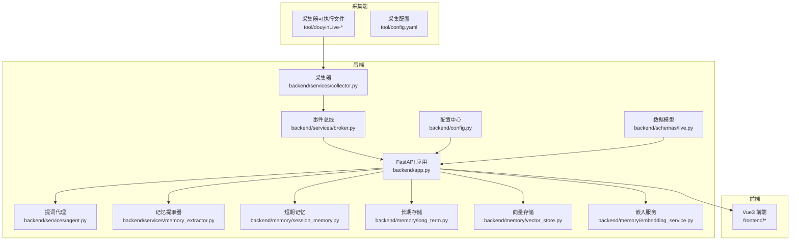
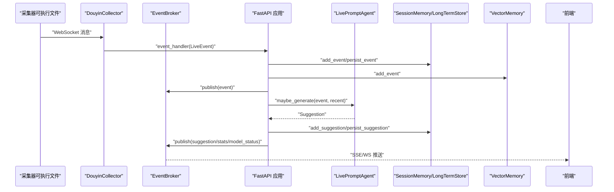
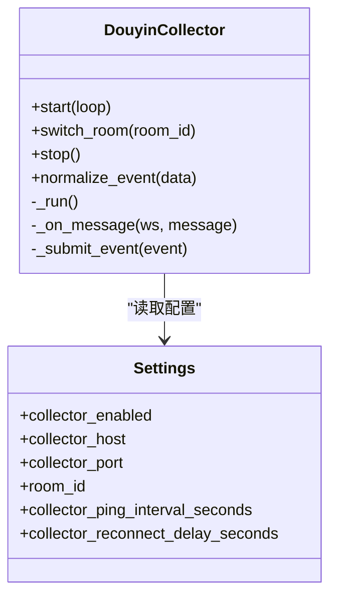
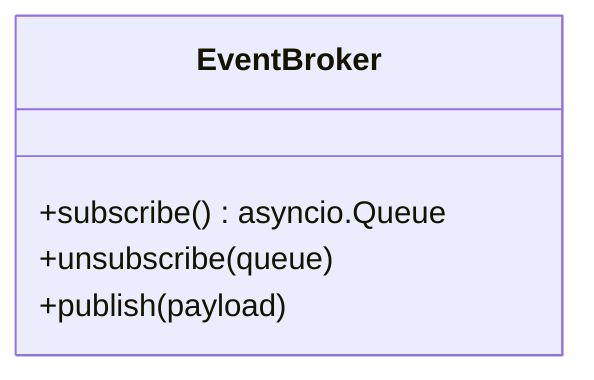
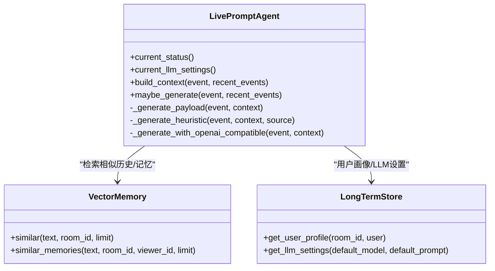
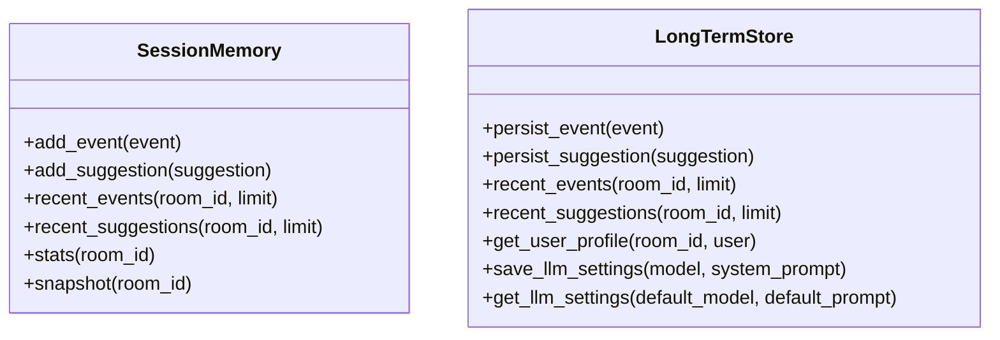
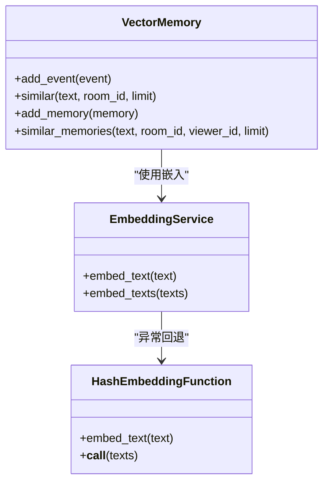
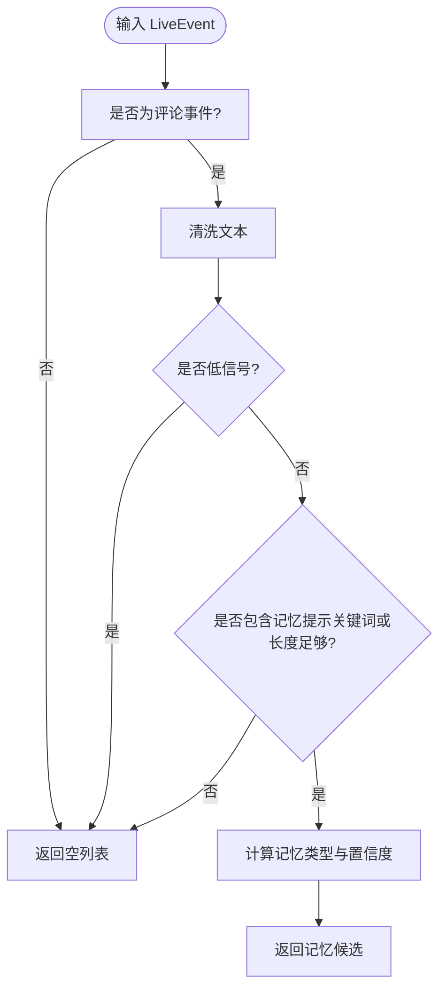
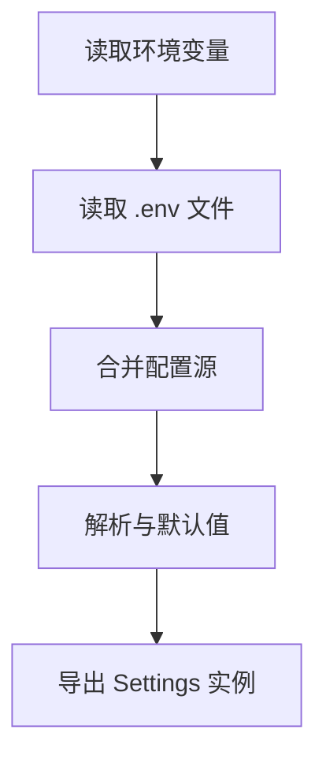
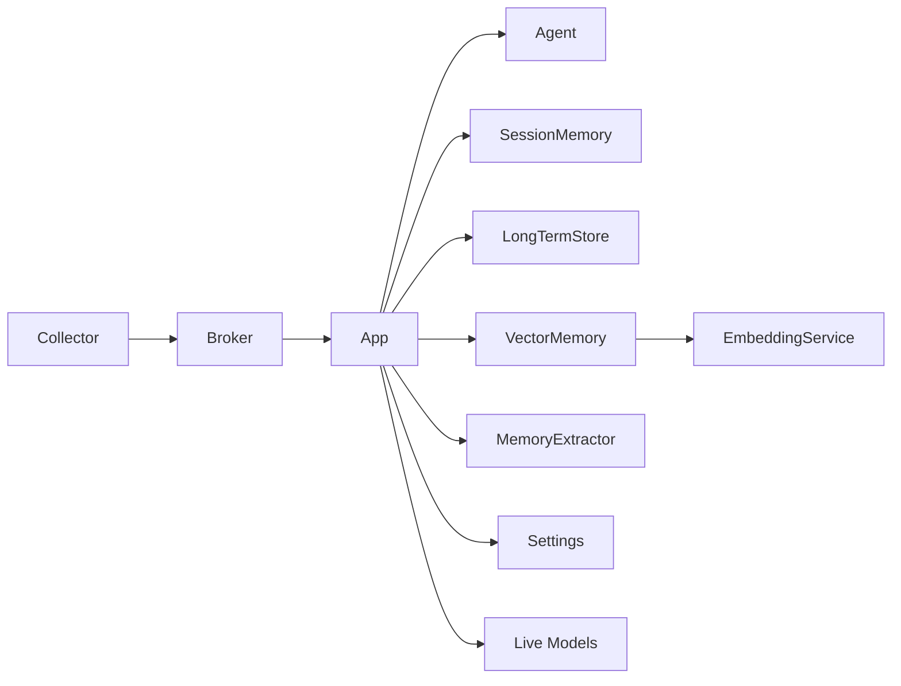

# 扩展点架构设计

<cite>
**本文引用的文件**
- [README.md](file://README.md)
- [backend/app.py](file://backend/app.py)
- [backend/config.py](file://backend/config.py)
- [backend/services/collector.py](file://backend/services/collector.py)
- [backend/services/agent.py](file://backend/services/agent.py)
- [backend/services/broker.py](file://backend/services/broker.py)
- [backend/services/memory_extractor.py](file://backend/services/memory_extractor.py)
- [backend/memory/session_memory.py](file://backend/memory/session_memory.py)
- [backend/memory/long_term.py](file://backend/memory/long_term.py)
- [backend/memory/vector_store.py](file://backend/memory/vector_store.py)
- [backend/memory/embedding_service.py](file://backend/memory/embedding_service.py)
- [backend/schemas/live.py](file://backend/schemas/live.py)
- [tool/config.yaml](file://tool/config.yaml)
</cite>

## 目录
1. [简介](#简介)
2. [项目结构](#项目结构)
3. [核心组件](#核心组件)
4. [架构总览](#架构总览)
5. [详细组件分析](#详细组件分析)
6. [依赖关系分析](#依赖关系分析)
7. [性能考量](#性能考量)
8. [故障排查指南](#故障排查指南)
9. [结论](#结论)
10. [附录](#附录)

## 简介
本文件面向DouYin_llm项目的插件系统扩展点架构设计，系统性阐述可插拔组件的抽象层次、接口定义、注册机制、生命周期管理与依赖注入实现方法。文档同时给出扩展点识别与设计最佳实践、插件配置系统的设计思路（动态加载、热更新与配置验证）、插件间通信与数据共享策略，并提供工具链支持与性能监控、故障诊断的方法论。

## 项目结构
项目采用“后端服务 + 内存层 + Schema模型”的分层组织方式，核心入口位于FastAPI应用，围绕事件采集、事件处理、内存存储、向量检索与LLM生成建议形成闭环。前端通过SSE/WS消费后端事件流，形成完整的直播提词工作栈。

图表来源
- [backend/app.py:1-285](file://backend/app.py#L1-L285)
- [backend/services/collector.py:1-266](file://backend/services/collector.py#L1-L266)
- [backend/services/broker.py:1-40](file://backend/services/broker.py#L1-L40)
- [backend/services/agent.py:1-496](file://backend/services/agent.py#L1-L496)
- [backend/memory/session_memory.py:1-113](file://backend/memory/session_memory.py#L1-L113)
- [backend/memory/long_term.py:1-967](file://backend/memory/long_term.py#L1-L967)
- [backend/memory/vector_store.py:1-317](file://backend/memory/vector_store.py#L1-L317)
- [backend/memory/embedding_service.py:1-102](file://backend/memory/embedding_service.py#L1-L102)
- [backend/config.py:1-113](file://backend/config.py#L1-L113)
- [backend/schemas/live.py:1-111](file://backend/schemas/live.py#L1-L111)
- [tool/config.yaml](file://tool/config.yaml)

章节来源
- [README.md:1-223](file://README.md#L1-L223)
- [backend/app.py:1-285](file://backend/app.py#L1-L285)

## 核心组件
- 采集器（DouyinCollector）：对接本地采集器WebSocket，标准化为LiveEvent并交由事件循环处理。
- 事件总线（EventBroker）：进程内事件广播，统一向SSE/WS订阅者分发。
- 提词代理（LivePromptAgent）：根据事件与上下文生成建议，支持LLM与启发式双通道。
- 内存层：
  - SessionMemory：短期会话缓存，支持Redis或内存退化。
  - LongTermStore：SQLite持久化，维护事件、建议、观众画像、笔记、记忆与会话。
  - VectorMemory：Chroma向量索引与本地哈希嵌入回退。
  - EmbeddingService：本地/云端嵌入服务，异常时回退至哈希嵌入。
- 记忆提取器（ViewerMemoryExtractor）：从评论中提取语义记忆。
- 配置中心（Settings）：集中管理运行参数，支持环境变量与.env文件。
- 数据模型（schemas/live.py）：统一的事件、建议、记忆、统计与状态模型。

章节来源
- [backend/services/collector.py:38-266](file://backend/services/collector.py#L38-L266)
- [backend/services/broker.py:10-40](file://backend/services/broker.py#L10-L40)
- [backend/services/agent.py:23-496](file://backend/services/agent.py#L23-L496)
- [backend/memory/session_memory.py:17-113](file://backend/memory/session_memory.py#L17-L113)
- [backend/memory/long_term.py:44-967](file://backend/memory/long_term.py#L44-L967)
- [backend/memory/vector_store.py:59-317](file://backend/memory/vector_store.py#L59-L317)
- [backend/memory/embedding_service.py:18-102](file://backend/memory/embedding_service.py#L18-L102)
- [backend/services/memory_extractor.py:62-118](file://backend/services/memory_extractor.py#L62-L118)
- [backend/config.py:40-113](file://backend/config.py#L40-L113)
- [backend/schemas/live.py:8-111](file://backend/schemas/live.py#L8-L111)

## 架构总览
系统通过FastAPI应用作为控制中枢，采集器将外部事件注入事件总线，随后依次进入短期记忆、长期存储、向量检索与提词生成，最终通过SSE/WS推送到前端。该流程体现了清晰的扩展点：采集器、事件总线、记忆层、向量层、嵌入层、LLM通道与前端。

图表来源
- [backend/app.py:73-102](file://backend/app.py#L73-L102)
- [backend/services/collector.py:145-196](file://backend/services/collector.py#L145-L196)
- [backend/services/broker.py:28-40](file://backend/services/broker.py#L28-L40)
- [backend/services/agent.py:105-142](file://backend/services/agent.py#L105-L142)
- [backend/memory/session_memory.py:42-84](file://backend/memory/session_memory.py#L42-L84)
- [backend/memory/long_term.py:454-500](file://backend/memory/long_term.py#L454-L500)
- [backend/memory/vector_store.py:149-171](file://backend/memory/vector_store.py#L149-L171)

## 详细组件分析

### 采集器（DouyinCollector）
- 职责：建立WebSocket连接，解析消息，标准化为LiveEvent，通过事件循环回调交给应用处理。
- 扩展点：支持禁用、房间切换、心跳与重连策略、错误处理与日志。
- 生命周期：start/stop/switch_room，内部线程与ping线程管理。
- 依赖注入：接收Settings与event_handler回调函数。

图表来源
- [backend/services/collector.py:38-266](file://backend/services/collector.py#L38-L266)
- [backend/config.py:40-76](file://backend/config.py#L40-L76)

章节来源
- [backend/services/collector.py:61-98](file://backend/services/collector.py#L61-L98)
- [backend/services/collector.py:118-189](file://backend/services/collector.py#L118-L189)

### 事件总线（EventBroker）
- 职责：维护订阅队列，发布消息，清理阻塞队列。
- 扩展点：订阅/取消订阅接口，异步队列广播。
- 适用场景：SSE/WS推送、跨组件解耦。

图表来源
- [backend/services/broker.py:10-40](file://backend/services/broker.py#L10-L40)

章节来源
- [backend/services/broker.py:16-40](file://backend/services/broker.py#L16-L40)

### 提词代理（LivePromptAgent）
- 职责：根据事件与上下文生成建议，支持LLM与启发式双通道，具备状态上报与错误降级。
- 扩展点：LLM模式切换、系统提示词持久化、提示词构建与解析、启发式规则扩展。
- 依赖注入：依赖VectorMemory与LongTermStore进行上下文检索与用户画像。

图表来源
- [backend/services/agent.py:23-496](file://backend/services/agent.py#L23-L496)
- [backend/memory/vector_store.py:59-317](file://backend/memory/vector_store.py#L59-L317)
- [backend/memory/long_term.py:44-967](file://backend/memory/long_term.py#L44-L967)

章节来源
- [backend/services/agent.py:83-142](file://backend/services/agent.py#L83-L142)
- [backend/services/agent.py:200-217](file://backend/services/agent.py#L200-L217)
- [backend/services/agent.py:228-300](file://backend/services/agent.py#L228-L300)

### 内存层（SessionMemory/LongTermStore）
- SessionMemory：短期事件与建议缓存，支持Redis或内存退化，TTL控制。
- LongTermStore：SQLite持久化，维护事件、建议、观众画像、礼物、会话、笔记、记忆与应用设置。
- 扩展点：表结构演进、索引优化、增量迁移与回填。

图表来源
- [backend/memory/session_memory.py:17-113](file://backend/memory/session_memory.py#L17-L113)
- [backend/memory/long_term.py:44-967](file://backend/memory/long_term.py#L44-L967)

章节来源
- [backend/memory/session_memory.py:42-112](file://backend/memory/session_memory.py#L42-L112)
- [backend/memory/long_term.py:454-557](file://backend/memory/long_term.py#L454-L557)

### 向量存储与嵌入（VectorMemory/EmbeddingService）
- VectorMemory：Chroma向量索引与本地哈希回退，支持房间维度查询与重排序。
- EmbeddingService：本地SentenceTransformer与云端OpenAI兼容接口，异常回退至HashEmbeddingFunction。
- 扩展点：嵌入模型切换、维度适配、查询阈值与重排策略。

图表来源
- [backend/memory/vector_store.py:59-317](file://backend/memory/vector_store.py#L59-L317)
- [backend/memory/embedding_service.py:18-102](file://backend/memory/embedding_service.py#L18-L102)
- [backend/memory/vector_store.py:34-57](file://backend/memory/vector_store.py#L34-L57)

章节来源
- [backend/memory/vector_store.py:149-231](file://backend/memory/vector_store.py#L149-L231)
- [backend/memory/vector_store.py:257-317](file://backend/memory/vector_store.py#L257-L317)
- [backend/memory/embedding_service.py:25-48](file://backend/memory/embedding_service.py#L25-L48)

### 记忆提取器（ViewerMemoryExtractor）
- 职责：从评论中提取语义记忆，判定记忆类型与置信度，避免低价值内容。
- 扩展点：关键词规则、正则清洗、记忆类型分类与置信度计算。

图表来源
- [backend/services/memory_extractor.py:99-118](file://backend/services/memory_extractor.py#L99-L118)

章节来源
- [backend/services/memory_extractor.py:62-118](file://backend/services/memory_extractor.py#L62-L118)

### 配置中心（Settings）
- 职责：集中管理运行参数，支持环境变量与.env文件，提供解析与默认值。
- 扩展点：新增配置项时遵循“环境变量优先、.env次之、代码默认值”的顺序，提供解析与校验。

图表来源
- [backend/config.py:12-37](file://backend/config.py#L12-L37)
- [backend/config.py:40-113](file://backend/config.py#L40-L113)

章节来源
- [backend/config.py:40-113](file://backend/config.py#L40-L113)

## 依赖关系分析
- 组件耦合：应用层（app.py）聚合各服务与存储，形成高内聚、低耦合的控制流；采集器与事件总线解耦，便于替换与扩展。
- 外部依赖：Redis、Chroma、SentenceTransformer、OpenAI兼容接口；未安装时提供回退策略。
- 循环依赖：未发现直接循环依赖，模块间通过接口与回调传递数据。

图表来源
- [backend/app.py:27-35](file://backend/app.py#L27-L35)
- [backend/services/collector.py:105-105](file://backend/services/collector.py#L105-L105)
- [backend/services/broker.py:28-28](file://backend/services/broker.py#L28-L28)
- [backend/memory/vector_store.py:60-68](file://backend/memory/vector_store.py#L60-L68)
- [backend/memory/embedding_service.py:18-23](file://backend/memory/embedding_service.py#L18-L23)

章节来源
- [backend/app.py:27-35](file://backend/app.py#L27-L35)

## 性能考量
- 异步事件循环：采集器通过线程+事件循环回调，避免阻塞主线程。
- 缓存与索引：短期内存窗口限制、Redis TTL、SQLite索引与Chroma向量索引提升查询效率。
- 回退策略：嵌入失败回退至哈希嵌入，LLM失败回退至启发式规则，保障可用性。
- 批处理与限流：本地嵌入支持批大小配置，向量查询支持阈值与K值控制。

## 故障排查指南
- 采集器连接问题：检查ROOM_ID、HOST/PORT、重连延迟与心跳间隔；查看日志中的连接/断开/重试信息。
- LLM生成失败：检查API Key、Base URL、超时与网络错误；查看状态上报与错误码。
- 向量检索异常：确认Chroma可用性与集合存在；检查嵌入维度与签名一致性。
- SQLite写入问题：关注事务与journal模式设置，必要时调整磁盘权限与路径。

章节来源
- [backend/services/collector.py:118-189](file://backend/services/collector.py#L118-L189)
- [backend/services/agent.py:302-437](file://backend/services/agent.py#L302-L437)
- [backend/memory/vector_store.py:70-84](file://backend/memory/vector_store.py#L70-L84)
- [backend/memory/long_term.py:50-54](file://backend/memory/long_term.py#L50-L54)

## 结论
DouYin_llm的插件架构以“事件驱动 + 多层内存 + 可插拔LLM通道”为核心，通过清晰的扩展点与依赖注入实现高可扩展性。建议在后续迭代中引入插件注册表、动态配置加载与热更新、统一的插件生命周期钩子与可观测性体系，进一步增强生态化与工程化水平。

## 附录

### 插件注册机制与生命周期（设计建议）
- 注册表：维护插件清单与元数据（版本、依赖、接口契约）。
- 生命周期：start/stop/switch_room/healthcheck钩子，支持条件启用与降级。
- 依赖注入：通过Settings与工厂函数注入，确保插件可测试与可替换。

### 依赖注入实现方法（现有模式）
- 构造函数注入：Agent/VectorMemory/EmbeddingService均通过构造函数接收依赖。
- 配置注入：Settings集中提供运行参数，避免硬编码。
- 回调注入：Collector通过event_handler回调注入处理逻辑。

章节来源
- [backend/services/agent.py:23-35](file://backend/services/agent.py#L23-L35)
- [backend/memory/vector_store.py:60-68](file://backend/memory/vector_store.py#L60-L68)
- [backend/memory/embedding_service.py:18-23](file://backend/memory/embedding_service.py#L18-L23)
- [backend/config.py:40-113](file://backend/config.py#L40-L113)

### 版本兼容性与向后兼容策略（设计建议）
- 接口契约：稳定的数据模型（LiveEvent/Suggestion/ViewerMemory）与事件类型枚举。
- 渐进式变更：通过Settings开关与回退逻辑，逐步迁移新旧实现。
- 兼容性测试：对关键接口进行单元测试与集成测试，确保升级不破坏现有功能。

### 插件配置系统（设计建议）
- 动态加载：基于配置文件与环境变量动态装配组件。
- 热更新：通过健康检查与平滑重启实现配置变更后的无缝切换。
- 配置验证：在启动阶段进行Schema校验与依赖检查，失败时拒绝启动。

### 插件间通信与数据共享（现有实现）
- 进程内广播：EventBroker通过异步队列实现事件分发，SSE/WS订阅者解耦消费。
- 共享状态：SessionMemory/LongTermStore/VectorMemory作为共享数据源，提供统一读写接口。

章节来源
- [backend/services/broker.py:16-40](file://backend/services/broker.py#L16-L40)
- [backend/app.py:27-35](file://backend/app.py#L27-L35)

### 工具链支持（现有与建议）
- 现有：Python测试、前端测试、启动脚本。
- 建议：插件模板生成器、配置校验工具、性能基准测试框架、调试器与可视化工具。

### 性能监控与故障诊断（方法论）
- 指标采集：事件吞吐、LLM响应时间、向量查询耗时、内存占用、Redis/Chroma健康状态。
- 日志分级：INFO/WARNING/ERROR/EXCEPTION，结合traceID与事件ID定位问题。
- APM集成：建议引入APM工具进行分布式追踪与告警。