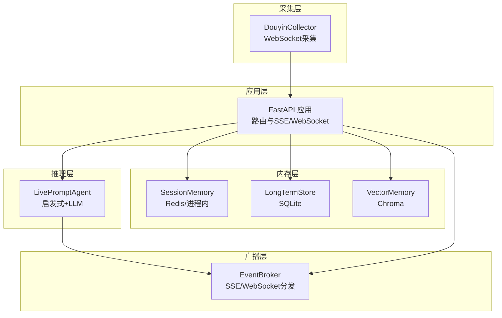
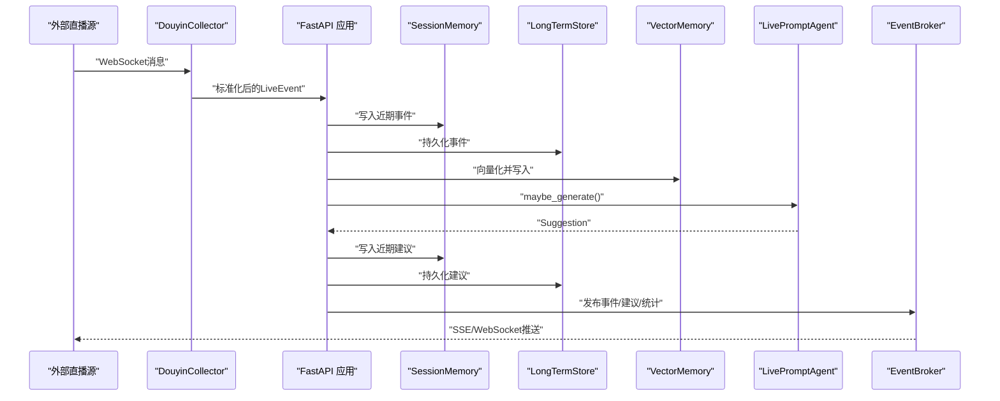
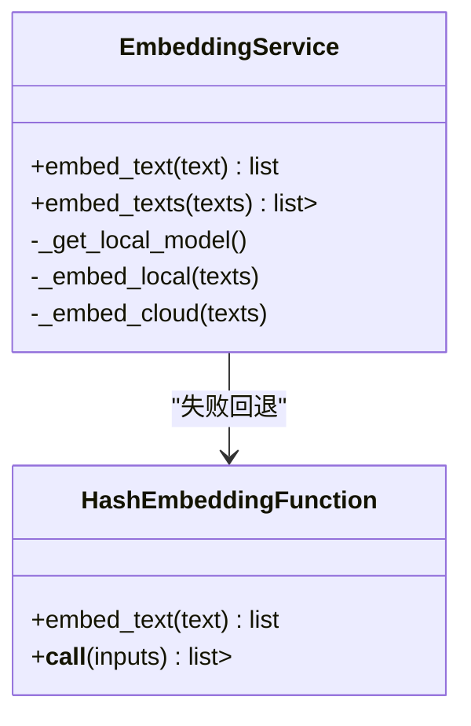
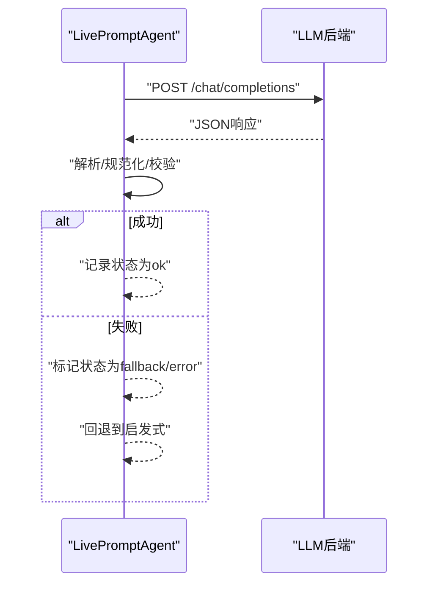
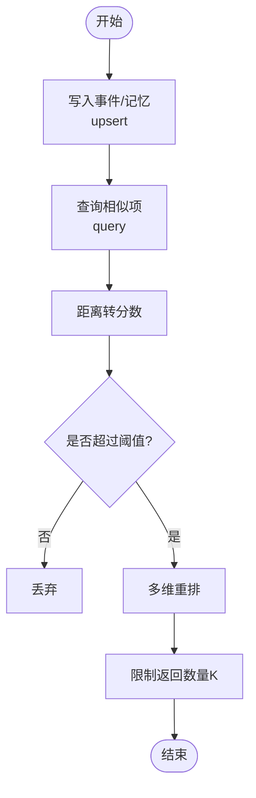
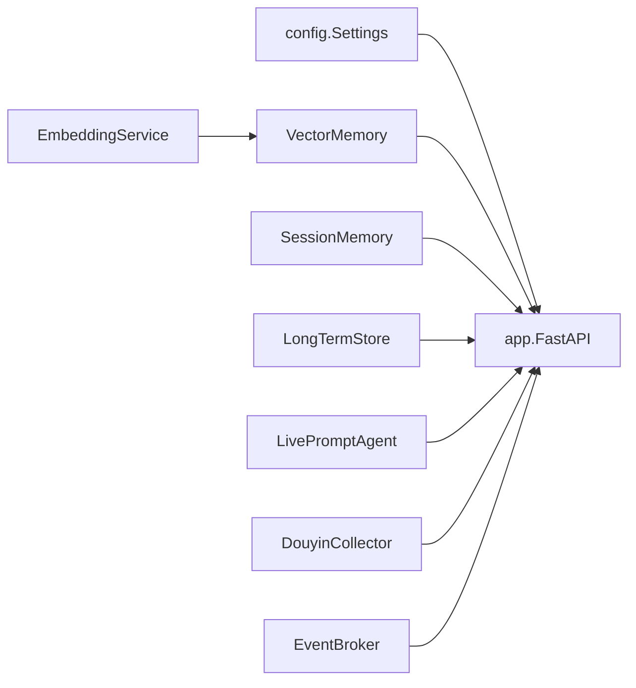
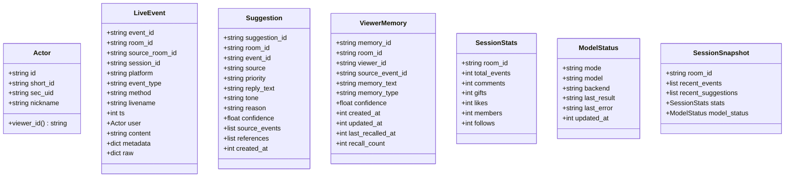

# 插件与扩展开发

<cite>
**本文引用的文件**
- [backend/app.py](file://backend/app.py)
- [backend/config.py](file://backend/config.py)
- [backend/memory/embedding_service.py](file://backend/memory/embedding_service.py)
- [backend/memory/vector_store.py](file://backend/memory/vector_store.py)
- [backend/services/agent.py](file://backend/services/agent.py)
- [backend/services/broker.py](file://backend/services/broker.py)
- [backend/services/collector.py](file://backend/services/collector.py)
- [backend/services/memory_extractor.py](file://backend/services/memory_extractor.py)
- [backend/memory/long_term.py](file://backend/memory/long_term.py)
- [backend/memory/session_memory.py](file://backend/memory/session_memory.py)
- [backend/schemas/live.py](file://backend/schemas/live.py)
- [requirements.txt](file://requirements.txt)
- [tests/test_embedding_service.py](file://tests/test_embedding_service.py)
- [tests/test_vector_store.py](file://tests/test_vector_store.py)
- [tests/test_agent.py](file://tests/test_agent.py)
</cite>

## 目录
1. [简介](#简介)
2. [项目结构](#项目结构)
3. [核心组件](#核心组件)
4. [架构总览](#架构总览)
5. [详细组件分析](#详细组件分析)
6. [依赖分析](#依赖分析)
7. [性能考量](#性能考量)
8. [故障排查指南](#故障排查指南)
9. [结论](#结论)
10. [附录](#附录)

## 简介
本指南面向希望为 DouYin_llm 项目进行插件与扩展开发的工程师，重点覆盖以下方面：
- 嵌入模型插件：支持云端 OpenAI 兼容接口与本地 SentenceTransformers 的可插拔实现
- LLM 集成插件：统一适配 OpenAI 兼容接口与自定义模型的调用策略
- 存储后端插件：以向量检索为例，展示可替换的持久化与索引实现（SQLite、Redis、Chroma）
- 智能提词引擎扩展：新增启发式规则与 LLM 调用策略的方法论
- 插件配置、注册机制与生命周期管理：基于现有设置与工厂式初始化的扩展点
- 架构设计模式与最佳实践：解耦、降级、可观测性与可测试性

## 项目结构
后端采用分层与职责分离的设计：
- 应用入口与路由：FastAPI 应用负责事件接入、状态查询与流式推送
- 采集层：WebSocket 客户端连接外部直播源，标准化为统一事件模型
- 内存层：短期会话内存（Redis/进程内）、长期存储（SQLite）、向量记忆（Chroma）
- 推理层：智能提词代理，结合启发式与 LLM 生成建议
- 广播层：事件总线，将处理结果通过 SSE/WebSocket 推送给前端

**图示来源**
- [backend/app.py:108-285](file://backend/app.py#L108-L285)
- [backend/services/collector.py:38-266](file://backend/services/collector.py#L38-L266)
- [backend/memory/session_memory.py:17-113](file://backend/memory/session_memory.py#L17-L113)
- [backend/memory/long_term.py:44-967](file://backend/memory/long_term.py#L44-L967)
- [backend/memory/vector_store.py:59-317](file://backend/memory/vector_store.py#L59-L317)
- [backend/services/agent.py:23-496](file://backend/services/agent.py#L23-L496)
- [backend/services/broker.py:10-40](file://backend/services/broker.py#L10-L40)

**章节来源**
- [backend/app.py:1-285](file://backend/app.py#L1-L285)
- [backend/services/collector.py:1-266](file://backend/services/collector.py#L1-L266)
- [backend/memory/session_memory.py:1-113](file://backend/memory/session_memory.py#L1-L113)
- [backend/memory/long_term.py:1-967](file://backend/memory/long_term.py#L1-L967)
- [backend/memory/vector_store.py:1-317](file://backend/memory/vector_store.py#L1-L317)
- [backend/services/agent.py:1-496](file://backend/services/agent.py#L1-L496)
- [backend/services/broker.py:1-40](file://backend/services/broker.py#L1-L40)

## 核心组件
- 配置中心：集中管理运行参数，支持多后端与模型选择
- 嵌入服务：统一文本向量化接口，支持本地与云端回退
- 向量记忆：事件与观众记忆的向量检索与排序
- 提词代理：启发式规则与 LLM 结合的建议生成器
- 事件总线：SSE/WebSocket 分发通道
- 采集器：外部直播事件接入与标准化
- 会话内存：短期事件与建议的缓存
- 长期存储：事件、建议、观众画像、记忆与会话的持久化

**章节来源**
- [backend/config.py:40-113](file://backend/config.py#L40-L113)
- [backend/memory/embedding_service.py:18-102](file://backend/memory/embedding_service.py#L18-L102)
- [backend/memory/vector_store.py:59-317](file://backend/memory/vector_store.py#L59-L317)
- [backend/services/agent.py:23-496](file://backend/services/agent.py#L23-L496)
- [backend/services/broker.py:10-40](file://backend/services/broker.py#L10-L40)
- [backend/services/collector.py:38-266](file://backend/services/collector.py#L38-L266)
- [backend/memory/session_memory.py:17-113](file://backend/memory/session_memory.py#L17-L113)
- [backend/memory/long_term.py:44-967](file://backend/memory/long_term.py#L44-L967)

## 架构总览
系统围绕“事件驱动 + 多存储 + 多后端”的可插拔架构展开。核心流程：
- 采集器接收外部事件，标准化为统一模型
- 应用层写入短期会话内存、长期存储与向量库，并触发推理
- 提词代理根据事件类型与上下文决定启发式或 LLM 生成
- 广播层将事件与建议推送到前端

**图示来源**
- [backend/services/collector.py:118-266](file://backend/services/collector.py#L118-L266)
- [backend/app.py:73-102](file://backend/app.py#L73-L102)
- [backend/memory/session_memory.py:42-113](file://backend/memory/session_memory.py#L42-L113)
- [backend/memory/long_term.py:454-500](file://backend/memory/long_term.py#L454-L500)
- [backend/memory/vector_store.py:149-171](file://backend/memory/vector_store.py#L149-L171)
- [backend/services/agent.py:105-142](file://backend/services/agent.py#L105-L142)
- [backend/services/broker.py:28-40](file://backend/services/broker.py#L28-L40)

## 详细组件分析

### 嵌入模型插件开发指南
目标：为文本提供统一的向量表示，支持本地与云端两种后端，并具备失败回退能力。

- 设计要点
  - 统一接口：对外暴露 embed_text/embed_texts，屏蔽后端差异
  - 后端选择：通过配置项选择 local/cloud，动态加载模型
  - 回退策略：云端失败自动切换到哈希嵌入函数，避免中断
  - 批量处理：本地模型支持批量化编码，提升吞吐

- 关键实现位置
  - 统一接口与回退逻辑：[backend/memory/embedding_service.py:18-102](file://backend/memory/embedding_service.py#L18-L102)
  - 本地模型加载与编码：[backend/memory/embedding_service.py:50-73](file://backend/memory/embedding_service.py#L50-L73)
  - 云端请求封装与错误处理：[backend/memory/embedding_service.py:75-102](file://backend/memory/embedding_service.py#L75-L102)
  - 哈希回退函数：[backend/memory/vector_store.py:34-57](file://backend/memory/vector_store.py#L34-L57)

- 开发步骤
  1) 定义嵌入接口规范（输入/输出约定），确保与向量存储层一致
  2) 实现本地后端（如 SentenceTransformers）与云端后端（OpenAI 兼容）
  3) 在配置中心增加新后端的开关与参数
  4) 注入到向量存储层，或通过工厂模式按需创建
  5) 编写单元测试覆盖成功、失败与回退场景

- 测试参考
  - 云端模式请求参数校验：[tests/test_embedding_service.py:24-54](file://tests/test_embedding_service.py#L24-L54)
  - 本地模式编码行为：[tests/test_embedding_service.py:56-69](file://tests/test_embedding_service.py#L56-L69)
  - 失败回退到哈希嵌入：[tests/test_embedding_service.py:71-78](file://tests/test_embedding_service.py#L71-L78)

**图示来源**
- [backend/memory/embedding_service.py:18-102](file://backend/memory/embedding_service.py#L18-L102)
- [backend/memory/vector_store.py:34-57](file://backend/memory/vector_store.py#L34-L57)

**章节来源**
- [backend/memory/embedding_service.py:1-102](file://backend/memory/embedding_service.py#L1-L102)
- [backend/memory/vector_store.py:34-57](file://backend/memory/vector_store.py#L34-L57)
- [tests/test_embedding_service.py:1-83](file://tests/test_embedding_service.py#L1-L83)

### LLM 集成插件开发指南
目标：统一适配 OpenAI 兼容接口与自定义模型，支持系统提示词与超参配置。

- 设计要点
  - 统一请求体：model、temperature、max_tokens、messages
  - 错误分类：HTTP 错误、网络错误、超时、JSON 解析失败等
  - 输出规范化：提取 JSON 字段并做类型与范围校验
  - 回退策略：LLM 失败自动回退到启发式规则

- 关键实现位置
  - LLM 请求与错误处理：[backend/services/agent.py:302-393](file://backend/services/agent.py#L302-L393)
  - JSON 解析与规范化：[backend/services/agent.py:439-495](file://backend/services/agent.py#L439-L495)
  - 模型选择与地址解析：[backend/config.py:84-104](file://backend/config.py#L84-L104)

- 开发步骤
  1) 定义 LLM 插件接口（如 chat/completions），与现有 Agent 协议保持一致
  2) 实现认证头、超时与重试策略
  3) 在配置中心新增后端别名与默认模型映射
  4) 将插件注入 Agent，使其在失败时自动回退
  5) 编写端到端测试，覆盖不同响应形态与异常分支

- 测试参考
  - 上下文压缩与字段裁剪：[tests/test_agent.py:42-90](file://tests/test_agent.py#L42-L90)
  - 礼物事件直走启发式：[tests/test_agent.py:91-115](file://tests/test_agent.py#L91-L115)
  - 最大 token 参数透传：[tests/test_agent.py:116-172](file://tests/test_agent.py#L116-L172)

**图示来源**
- [backend/services/agent.py:200-217](file://backend/services/agent.py#L200-L217)
- [backend/services/agent.py:302-393](file://backend/services/agent.py#L302-L393)
- [backend/services/agent.py:439-495](file://backend/services/agent.py#L439-L495)

**章节来源**
- [backend/services/agent.py:1-496](file://backend/services/agent.py#L1-L496)
- [backend/config.py:84-104](file://backend/config.py#L84-L104)
- [tests/test_agent.py:1-176](file://tests/test_agent.py#L1-L176)

### 存储后端插件开发指南（以向量检索为例）
目标：实现可插拔的向量存储与检索，支持 Chroma、内存回退与未来扩展。

- 设计要点
  - 抽象 Collection：统一 upsert/query 接口
  - 签名隔离：通过嵌入签名区分不同向量空间
  - 查询阈值与重排：距离转分数、阈值过滤、多维排序
  - 回退策略：Chroma 不可用时使用内存索引

- 关键实现位置
  - Collection 初始化与命名：[backend/memory/vector_store.py:59-84](file://backend/memory/vector_store.py#L59-L84)
  - 事件与记忆 upsert：[backend/memory/vector_store.py:149-171](file://backend/memory/vector_store.py#L149-L171), [backend/memory/vector_store.py:232-255](file://backend/memory/vector_store.py#L232-L255)
  - 查询与重排：[backend/memory/vector_store.py:172-231](file://backend/memory/vector_store.py#L172-L231), [backend/memory/vector_store.py:257-317](file://backend/memory/vector_store.py#L257-L317)
  - 嵌入签名与集合名：[backend/config.py:106-110](file://backend/config.py#L106-L110)

- 开发步骤
  1) 定义向量存储接口（add_event/add_memory/similar/similar_memories）
  2) 实现 Chroma/内存/第三方向量库适配器
  3) 使用嵌入签名作为命名空间，避免冲突
  4) 在应用启动时按需初始化，失败时启用回退
  5) 编写单元测试覆盖 upsert、query、阈值与排序

- 测试参考
  - 集合名使用嵌入签名：[tests/test_vector_store.py:21-32](file://tests/test_vector_store.py#L21-L32)
  - upsert 使用嵌入服务：[tests/test_vector_store.py:33-54](file://tests/test_vector_store.py#L33-L54)
  - 查询结果与阈值：[tests/test_vector_store.py:55-78](file://tests/test_vector_store.py#L55-L78)
  - 记忆查询偏好更高置信度：[tests/test_vector_store.py:79-100](file://tests/test_vector_store.py#L79-L100)

**图示来源**
- [backend/memory/vector_store.py:172-231](file://backend/memory/vector_store.py#L172-L231)
- [backend/memory/vector_store.py:257-317](file://backend/memory/vector_store.py#L257-L317)

**章节来源**
- [backend/memory/vector_store.py:1-317](file://backend/memory/vector_store.py#L1-L317)
- [backend/config.py:106-110](file://backend/config.py#L106-L110)
- [tests/test_vector_store.py:1-103](file://tests/test_vector_store.py#L1-L103)

### 智能提词引擎扩展指南
目标：在不破坏现有启发式与 LLM 生成的前提下，新增启发式规则与调用策略。

- 规则扩展
  - 新增关键词或领域规则，调整优先级与回复模板
  - 引导 Agent 在特定条件下短路到启发式，减少 Token 消耗
  - 示例：礼物、关注、价格询问、身材/健身话题等

- LLM 调用策略
  - 为不同事件类型定制 prompt 与 instruction
  - 控制 temperature、max_tokens、system_prompt
  - 失败时自动回退到启发式，并记录状态

- 关键实现位置
  - 事件分流与启发式短路：[backend/services/agent.py:105-121](file://backend/services/agent.py#L105-L121)
  - 启发式规则与回复模板：[backend/services/agent.py:228-301](file://backend/services/agent.py#L228-L301)
  - LLM 生成与规范化：[backend/services/agent.py:302-437](file://backend/services/agent.py#L302-L437)

- 开发步骤
  1) 在 Agent 中新增规则分支，保持与现有逻辑一致的返回结构
  2) 为新规则编写测试用例，覆盖典型场景
  3) 评估对 Token 与延迟的影响，必要时引入缓存或降采样
  4) 通过配置中心开放开关与参数微调

**章节来源**
- [backend/services/agent.py:105-301](file://backend/services/agent.py#L105-L301)

### 插件配置、注册机制与生命周期管理
- 配置中心
  - 集中式读取环境变量与 .env，提供默认值与解析逻辑
  - LLM 与嵌入后端地址、模型名、超时、温度、Token 上限等
  - 嵌入签名用于向量集合隔离

- 注册与初始化
  - 应用启动时创建并注入各组件实例（会话内存、长期存储、嵌入服务、向量库、代理、提取器）
  - 生命周期：FastAPI lifespan 管理采集器启停与资源清理

- 关键实现位置
  - 配置与解析：[backend/config.py:40-113](file://backend/config.py#L40-L113)
  - 组件装配与生命周期：[backend/app.py:24-117](file://backend/app.py#L24-L117)

**章节来源**
- [backend/config.py:40-113](file://backend/config.py#L40-L113)
- [backend/app.py:24-117](file://backend/app.py#L24-L117)

## 依赖分析
- 外部依赖
  - FastAPI/uvicorn：Web 服务框架
  - websocket-client：采集器 WebSocket 客户端
  - redis：短期会话内存缓存
  - chromadb：向量数据库
  - sentence-transformers（可选）：本地嵌入模型

- 内部模块耦合
  - app.py 作为装配中心，耦合所有子系统
  - agent 依赖 vector_memory 与 long_term_store
  - vector_store 依赖 embedding_service
  - session_memory 依赖 redis（可选）

**图示来源**
- [backend/app.py:24-36](file://backend/app.py#L24-L36)
- [backend/memory/embedding_service.py:18-23](file://backend/memory/embedding_service.py#L18-L23)
- [backend/memory/vector_store.py:59-68](file://backend/memory/vector_store.py#L59-L68)
- [backend/services/agent.py:23-27](file://backend/services/agent.py#L23-L27)
- [backend/services/collector.py:38-52](file://backend/services/collector.py#L38-L52)
- [backend/services/broker.py:10-14](file://backend/services/broker.py#L10-L14)

**章节来源**
- [requirements.txt:1-6](file://requirements.txt#L1-L6)
- [backend/app.py:1-36](file://backend/app.py#L1-L36)

## 性能考量
- 向量检索
  - 合理设置查询阈值与返回 K，避免全表扫描
  - 使用嵌入签名隔离不同模型，防止跨模型干扰
  - Chroma 不可用时启用内存回退，降低延迟风险

- LLM 调用
  - 控制 max_tokens 与 temperature，平衡质量与成本
  - 对高频事件（礼物、关注）优先启发式，减少 LLM 调用
  - 失败快速回退，避免阻塞主流程

- 缓存与索引
  - Redis 短期会话内存可显著降低数据库压力
  - SQLite 索引已覆盖常用查询字段，注意避免不必要的列扫描

[本节为通用指导，无需列出具体文件来源]

## 故障排查指南
- 嵌入服务失败
  - 现象：日志出现回退警告，向量维度固定
  - 排查：检查云端 API Key、Base URL、超时设置
  - 参考：[backend/memory/embedding_service.py:38-48](file://backend/memory/embedding_service.py#L38-L48), [tests/test_embedding_service.py:71-78](file://tests/test_embedding_service.py#L71-L78)

- LLM 返回格式异常
  - 现象：解析失败或缺少必要字段
  - 排查：确认系统提示词与 instruction、输出 JSON 结构
  - 参考：[backend/services/agent.py:395-427](file://backend/services/agent.py#L395-L427), [tests/test_agent.py:116-172](file://tests/test_agent.py#L116-L172)

- 向量检索为空或分数过低
  - 现象：相似度不足或排序异常
  - 排查：调整阈值、查询限制与重排权重
  - 参考：[backend/memory/vector_store.py:92-108](file://backend/memory/vector_store.py#L92-L108), [tests/test_vector_store.py:55-78](file://tests/test_vector_store.py#L55-L78)

- SSE/WebSocket 推送断连
  - 现象：前端无法接收实时更新
  - 排查：检查 EventBroker 订阅队列与广播状态
  - 参考：[backend/services/broker.py:28-40](file://backend/services/broker.py#L28-L40), [backend/app.py:252-285](file://backend/app.py#L252-L285)

**章节来源**
- [backend/memory/embedding_service.py:38-48](file://backend/memory/embedding_service.py#L38-L48)
- [backend/services/agent.py:395-427](file://backend/services/agent.py#L395-L427)
- [backend/memory/vector_store.py:92-108](file://backend/memory/vector_store.py#L92-L108)
- [backend/services/broker.py:28-40](file://backend/services/broker.py#L28-L40)
- [backend/app.py:252-285](file://backend/app.py#L252-L285)

## 结论
DouYin_llm 项目提供了清晰的插件化扩展点：
- 嵌入服务与向量存储层通过统一接口与回退策略实现了高可用
- LLM 集成遵循 OpenAI 兼容协议，具备完善的错误分类与回退机制
- 提词引擎以启发式为主、LLM 为辅，兼顾性能与效果
- 配置中心与生命周期管理使扩展与运维更加简单可控

建议在新增插件时遵循“接口抽象—可插拔实现—统一回退—可观测性—可测试性”的设计原则，确保系统稳定演进。

[本节为总结性内容，无需列出具体文件来源]

## 附录
- 数据模型概览（简化）
  - Actor/LiveEvent/Suggestion/ViewerMemory/SessionStats/ModelStatus/SessionSnapshot

**图示来源**
- [backend/schemas/live.py:8-111](file://backend/schemas/live.py#L8-L111)