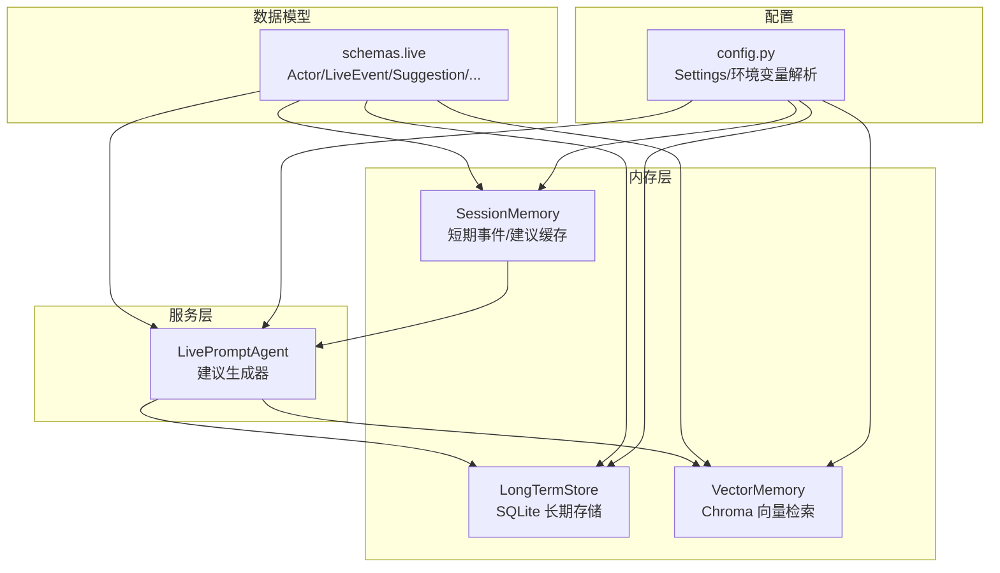
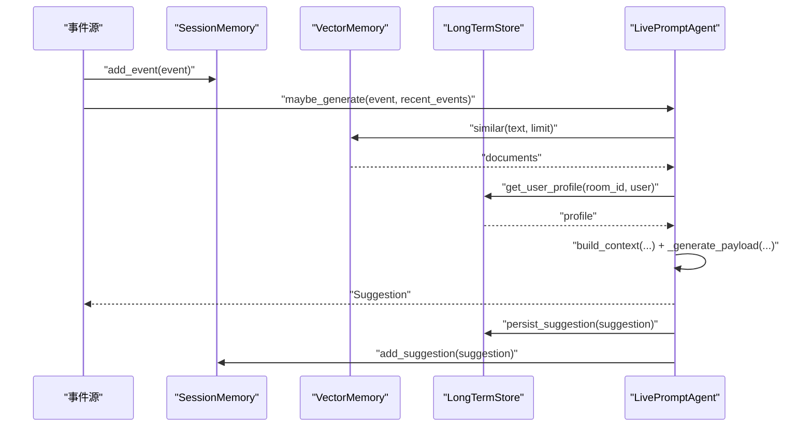
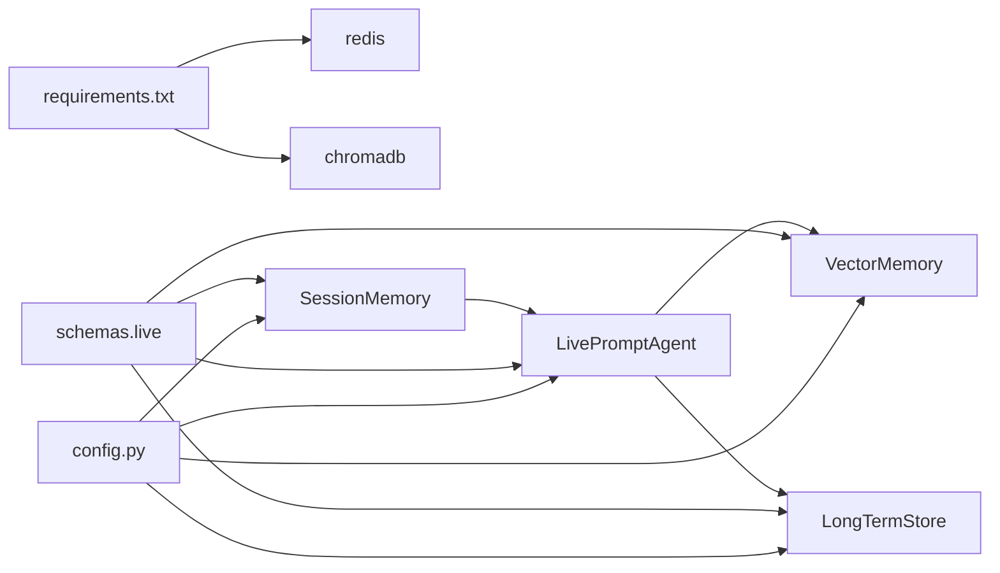

# 单元测试

<cite>
**本文引用的文件**
- [backend/memory/session_memory.py](file://backend/memory/session_memory.py)
- [backend/memory/long_term.py](file://backend/memory/long_term.py)
- [backend/memory/vector_store.py](file://backend/memory/vector_store.py)
- [backend/services/agent.py](file://backend/services/agent.py)
- [backend/schemas/live.py](file://backend/schemas/live.py)
- [backend/config.py](file://backend/config.py)
- [requirements.txt](file://requirements.txt)
</cite>

## 目录
1. [简介](#简介)
2. [项目结构](#项目结构)
3. [核心组件](#核心组件)
4. [架构总览](#架构总览)
5. [详细组件分析](#详细组件分析)
6. [依赖分析](#依赖分析)
7. [性能考量](#性能考量)
8. [故障排查指南](#故障排查指南)
9. [结论](#结论)
10. [附录](#附录)

## 简介
本文件面向后端模块的单元测试实践，聚焦以下目标：
- AI 建议生成器（LivePromptAgent）的双模式测试策略（在线模型与本地规则）、上下文构建测试、建议生成准确性测试
- 内存管理模块的测试方法：SessionMemory 的 Redis 连接测试、事件存储测试、过期机制测试；LongTermStore 的 SQLite 数据库测试、事务处理测试、数据一致性测试；VectorMemory 的 Chroma 集成测试、嵌入函数测试、相似度检索测试
- 提供具体测试用例示例、Mock 对象使用方法、测试数据准备方案

## 项目结构
后端核心模块围绕“事件收集—短期记忆—长期存储—向量检索—建议生成”的链路组织，单元测试应覆盖各模块的独立职责与边界。

图表来源
- [backend/memory/session_memory.py:17-113](file://backend/memory/session_memory.py#L17-L113)
- [backend/memory/long_term.py:36-750](file://backend/memory/long_term.py#L36-L750)
- [backend/memory/vector_store.py:52-108](file://backend/memory/vector_store.py#L52-L108)
- [backend/services/agent.py:23-393](file://backend/services/agent.py#L23-L393)
- [backend/schemas/live.py:8-95](file://backend/schemas/live.py#L8-L95)
- [backend/config.py:39-94](file://backend/config.py#L39-L94)

章节来源
- [backend/memory/session_memory.py:1-113](file://backend/memory/session_memory.py#L1-L113)
- [backend/memory/long_term.py:1-750](file://backend/memory/long_term.py#L1-L750)
- [backend/memory/vector_store.py:1-108](file://backend/memory/vector_store.py#L1-L108)
- [backend/services/agent.py:1-393](file://backend/services/agent.py#L1-L393)
- [backend/schemas/live.py:1-95](file://backend/schemas/live.py#L1-L95)
- [backend/config.py:1-94](file://backend/config.py#L1-L94)

## 核心组件
- SessionMemory：优先 Redis，降级为进程内队列；提供事件与建议的增删查与统计快照
- LongTermStore：SQLite 存储，负责事件、建议、观众画像、礼物历史、直播会话等表的持久化与查询
- VectorMemory：Chroma 向量库或本地哈希嵌入函数；提供事件内容相似度检索
- LivePromptAgent：双模式建议生成器，优先在线模型，失败回退本地规则；负责上下文构建与建议标准化
- 数据模型：Actor、LiveEvent、Suggestion、SessionStats、SessionSnapshot、ModelStatus
- 配置：Settings 解析环境变量，提供 Redis/Chroma/SQLite/LLM 参数

章节来源
- [backend/memory/session_memory.py:17-113](file://backend/memory/session_memory.py#L17-L113)
- [backend/memory/long_term.py:36-750](file://backend/memory/long_term.py#L36-L750)
- [backend/memory/vector_store.py:52-108](file://backend/memory/vector_store.py#L52-L108)
- [backend/services/agent.py:23-393](file://backend/services/agent.py#L23-L393)
- [backend/schemas/live.py:8-95](file://backend/schemas/live.py#L8-L95)
- [backend/config.py:39-94](file://backend/config.py#L39-L94)

## 架构总览
建议生成流程的端到端序列如下：

图表来源
- [backend/services/agent.py:56-94](file://backend/services/agent.py#L56-L94)
- [backend/memory/vector_store.py:85-108](file://backend/memory/vector_store.py#L85-L108)
- [backend/memory/long_term.py:718-734](file://backend/memory/long_term.py#L718-L734)
- [backend/memory/session_memory.py:42-64](file://backend/memory/session_memory.py#L42-L64)

## 详细组件分析

### SessionMemory 测试策略
- 目标：验证 Redis 与本地降级路径、事件/建议写入与读取、统计与快照
- 关键点
  - Redis 连接可用性与不可用时的降级行为
  - 写入上限与过期 TTL 生效（Redis）
  - 读取限制与类型还原
  - 统计计算正确性（按事件类型计数）

- 测试用例示例思路
  - 场景一：Redis 可用
    - 准备：设置 REDIS_URL，构造 LiveEvent/Suggestion
    - 步骤：add_event/add_suggestion → recent_events/recent_suggestions → stats → snapshot
    - 断言：返回条目数量、类型、TTL 是否存在、统计值
  - 场景二：Redis 不可用（或未配置）
    - 准备：不设置 REDIS_URL 或模拟导入失败
    - 步骤：同上
    - 断言：本地队列容量限制、无 TTL、结果一致
  - 场景三：过期机制
    - 准备：Redis 可用，设置较短 TTL
    - 步骤：写入 → 等待过期 → 读取
    - 断言：读取为空或被裁剪

- Mock 对象与工具
  - 使用 unittest.mock.patch.object 替换 redis.Redis.from_url 返回的客户端
  - 使用 unittest.mock.patch('backend.memory.session_memory.redis') 模拟导入失败
  - 使用 unittest.mock.MagicMock 模拟 lpush/ltrim/expire/range 等 Redis 命令

- 测试数据准备
  - 使用 schemas.live.LiveEvent/Suggestion 构造最小有效事件与建议
  - 为不同房间与事件类型准备多组数据，覆盖边界（空、超限、重复）

- 复杂度与性能
  - 写入复杂度：O(1)（Redis 列表操作），本地队列 O(1)
  - 读取复杂度：O(limit)，受 Redis/本地队列长度影响
  - TTL 仅在 Redis 模式生效，避免本地路径的额外开销

章节来源
- [backend/memory/session_memory.py:17-113](file://backend/memory/session_memory.py#L17-L113)
- [backend/schemas/live.py:29-62](file://backend/schemas/live.py#L29-L62)

### LongTermStore 测试策略
- 目标：验证 SQLite 初始化、表结构迁移、事务一致性、查询与聚合
- 关键点
  - 表结构创建与列迁移（事件表、建议表、观众画像、礼物历史、直播会话、备注）
  - 索引创建与查询性能
  - 事件持久化与会话关联、观众画像与礼物聚合重建
  - 查询接口：最近事件、最近建议、统计、快照、观众画像、会话历史、礼物历史、备注 CRUD

- 测试用例示例思路
  - 场景一：数据库初始化与迁移
    - 准备：临时数据库路径
    - 步骤：实例化 LongTermStore → 触发 _setup → 查询表结构
    - 断言：表存在、必要列存在、索引存在
  - 场景二：事件持久化与会话
    - 准备：LiveEvent（含 metadata/raw/gift 字段）
    - 步骤：persist_event → 查询 events 表 → 查询 live_sessions
    - 断言：会话 ID 生成/复用、字段映射正确、聚合字段更新
  - 场景三：事务一致性与回滚
    - 准备：并发写入场景（模拟竞态）
    - 步骤：多线程/多进程写入 → 读取统计
    - 断言：统计值一致、无脏读
  - 场景四：数据一致性与重建
    - 准备：历史事件 → 触发重建
    - 步骤：重建 viewer_profiles/viewer_gifts
    - 断言：画像与礼物统计一致

- Mock 对象与工具
  - 使用 unittest.mock.patch.object 替换 sqlite3.connect 返回的连接
  - 使用 unittest.mock.MagicMock 模拟 executescript/executemany/execute/fetchone/fetchall
  - 使用 unittest.mock.patch('backend.memory.long_term.sqlite3') 控制导入

- 测试数据准备
  - 使用 schemas.live.LiveEvent/Suggestion 构造多类型事件（comment/gift/follow/member/like）
  - 包含 metadata/raw 中的 gift 字段与 viewer_id 推导逻辑

- 复杂度与性能
  - 写入：INSERT/REPLACE + UPSERT，受索引影响
  - 查询：多表 JOIN + 聚合，建议在高频字段上建立索引
  - 重建：全量扫描 events 表，建议离峰执行

章节来源
- [backend/memory/long_term.py:36-750](file://backend/memory/long_term.py#L36-L750)
- [backend/schemas/live.py:29-62](file://backend/schemas/live.py#L29-L62)

### VectorMemory 测试策略
- 目标：验证向量检索与本地相似度方案、嵌入函数、Chroma 集成
- 关键点
  - Chroma 可用时：Collection 创建/UPsert/Query
  - Chroma 不可用时：本地哈希嵌入与词重叠相似度
  - 嵌入函数维度与归一化
  - 文本预处理（去除非字母数字与中文字符）

- 测试用例示例思路
  - 场景一：Chroma 可用
    - 准备：设置 CHROMA_DIR，构造 LiveEvent（含 content）
    - 步骤：add_event → similar(text, limit)
    - 断言：返回文档数量、相似度非空、元数据保留
  - 场景二：Chroma 不可用
    - 准备：不安装 chromadb 或 mock 导入失败
    - 步骤：同上
    - 断言：本地队列容量限制、相似度基于词重叠
  - 场景三：嵌入函数
    - 准备：不同文本（空、纯标点、中文、英文）
    - 步骤：embed_text/embeddings
    - 断言：维度一致、向量归一化、非零向量

- Mock 对象与工具
  - 使用 unittest.mock.patch('backend.memory.vector_store.chromadb') 模拟导入失败
  - 使用 unittest.mock.patch.object 替换 PersistentClient/get_or_create_collection
  - 使用 unittest.mock.MagicMock 模拟能力有限的 Chroma 客户端

- 测试数据准备
  - 使用 schemas.live.LiveEvent 构造带内容的事件
  - 准备多样本文本（长文本、短文本、特殊字符、emoji）

- 复杂度与性能
  - Chroma：查询复杂度取决于向量库实现与索引；本地方案 O(n*m)（n 为样本数，m 为平均词数）
  - 建议：在生产环境启用 Chroma 并配置索引

章节来源
- [backend/memory/vector_store.py:52-108](file://backend/memory/vector_store.py#L52-L108)
- [backend/schemas/live.py:29-44](file://backend/schemas/live.py#L29-L44)

### LivePromptAgent 测试策略
- 目标：验证双模式建议生成、上下文构建、错误回退与状态上报
- 关键点
  - 双模式：在线 OpenAI 兼容接口 vs 本地规则
  - 上下文：最近事件窗口、相似历史、用户画像
  - 建议生成：事件类型过滤、payload 标准化、置信度范围
  - 错误处理：HTTP/网络/超时/JSON 解析异常、回退至规则模式

- 测试用例示例思路
  - 场景一：在线模型成功
    - 准备：设置 LLM_MODE=online，提供有效响应（合法 JSON）
    - 步骤：maybe_generate → build_context → _generate_with_openai_compatible
    - 断言：返回 Suggestion、置信度与优先级合理、状态更新
  - 场景二：在线模型失败，回退规则
    - 准备：模拟 HTTP/网络/超时/JSON 异常
    - 步骤：同上
    - 断言：状态标记 fallback，进入规则分支，返回合理建议
  - 场景三：规则模式
    - 准备：LLM_MODE=heuristic 或 online 失败后回退
    - 步骤：maybe_generate
    - 断言：按事件类型与关键词匹配，返回不同优先级与话术
  - 场景四：上下文构建
    - 准备：VectorMemory 返回相似历史，LongTermStore 返回画像
    - 步骤：build_context
    - 断言：上下文包含 recent_events/similar_history/user_profile

- Mock 对象与工具
  - 使用 unittest.mock.patch.object 替换 urllib.request.urlopen 返回值
  - 使用 unittest.mock.patch.object 替换 Settings.resolved_llm_base_url/resolved_llm_model
  - 使用 unittest.mock.MagicMock 模拟 VectorMemory.similar 与 LongTermStore.get_user_profile

- 测试数据准备
  - 使用 schemas.live.LiveEvent/Suggestion 构造多种事件类型与内容
  - 准备不同温度、超时、API Key 的配置

- 复杂度与性能
  - 在线模式：网络请求延迟与 JSON 解析开销
  - 规则模式：O(1) 计算，适合低延迟兜底

章节来源
- [backend/services/agent.py:23-393](file://backend/services/agent.py#L23-L393)
- [backend/schemas/live.py:29-62](file://backend/schemas/live.py#L29-L62)
- [backend/config.py:70-90](file://backend/config.py#L70-L90)

## 依赖分析
- 外部依赖
  - redis：用于 SessionMemory 的 Redis 模式
  - chromadb：用于 VectorMemory 的向量检索
  - sqlite3：用于 LongTermStore 的 SQLite 存储
- 模块耦合
  - LivePromptAgent 依赖 VectorMemory 与 LongTermStore 的查询能力
  - SessionMemory 作为短期缓存，减少对在线/数据库的压力
  - 数据模型在各模块间共享，确保接口一致性

图表来源
- [requirements.txt:1-6](file://requirements.txt#L1-L6)
- [backend/services/agent.py:23-393](file://backend/services/agent.py#L23-L393)
- [backend/memory/session_memory.py:17-113](file://backend/memory/session_memory.py#L17-L113)
- [backend/memory/long_term.py:36-750](file://backend/memory/long_term.py#L36-L750)
- [backend/memory/vector_store.py:52-108](file://backend/memory/vector_store.py#L52-L108)
- [backend/schemas/live.py:8-95](file://backend/schemas/live.py#L8-L95)
- [backend/config.py:39-94](file://backend/config.py#L39-L94)

章节来源
- [requirements.txt:1-6](file://requirements.txt#L1-L6)
- [backend/config.py:39-94](file://backend/config.py#L39-L94)

## 性能考量
- SessionMemory
  - Redis 模式具备 TTL 与裁剪能力，适合高吞吐短期缓存
  - 本地模式适合单进程或无 Redis 场景，注意队列容量上限
- LongTermStore
  - 建议在高频查询字段上建立索引（如 room_id/ts/event_type）
  - 重建聚合在离峰时段执行，避免阻塞
- VectorMemory
  - 生产环境启用 Chroma 并配置索引；本地方案仅适用于小规模数据
- LivePromptAgent
  - 在线模式引入网络延迟，建议缓存上下文或使用本地规则兜底

## 故障排查指南
- Redis 连接失败
  - 现象：SessionMemory 回退到本地队列，无 TTL
  - 排查：确认 REDIS_URL、网络连通性、权限
- Chroma 初始化失败
  - 现象：VectorMemory 退化为本地相似度
  - 排查：确认 CHROMA_DIR 权限、磁盘空间、依赖安装
- SQLite 占用或锁冲突
  - 现象：并发写入失败或查询阻塞
  - 排查：检查连接池、事务提交、索引缺失
- 在线模型异常
  - 现象：状态标记 error/fallback
  - 排查：检查 LLM_BASE_URL/API_KEY/TIMEOUT、网络代理、响应格式

章节来源
- [backend/services/agent.py:232-285](file://backend/services/agent.py#L232-L285)
- [backend/memory/session_memory.py:29-31](file://backend/memory/session_memory.py#L29-L31)
- [backend/memory/vector_store.py:60-63](file://backend/memory/vector_store.py#L60-L63)
- [backend/memory/long_term.py:420-454](file://backend/memory/long_term.py#L420-L454)

## 结论
通过针对 SessionMemory、LongTermStore、VectorMemory 与 LivePromptAgent 的分层测试，可有效保障建议生成链路的稳定性与准确性。建议优先覆盖双模式回退、上下文构建与关键边界条件，并结合 Mock 与临时数据库/目录提升测试效率与可重复性。

## 附录
- 测试环境建议
  - 使用临时目录存放 SQLite/Chroma 数据，避免污染
  - 使用 unittest.mock.patch 替换外部依赖，隔离测试
  - 使用参数化测试覆盖多事件类型与边界输入
- 测试数据模板
  - LiveEvent：包含 event_id/room_id/user/content/metadata/raw/ts
  - Suggestion：包含 suggestion_id/room_id/event_id/priority/reply_text/tone/reason/confidence/created_at
  - Actor：包含 id/short_id/sec_uid/nickname