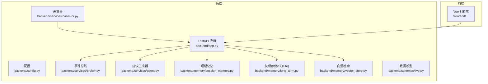
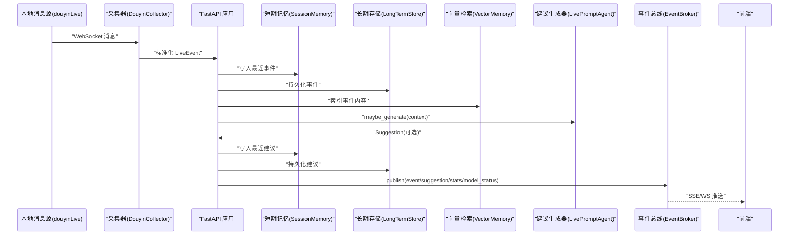
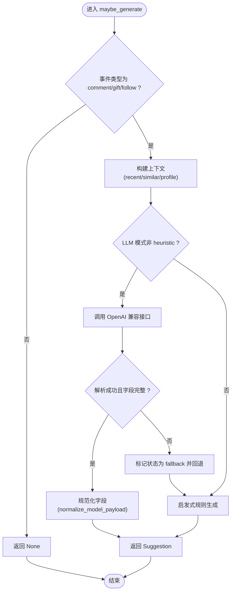
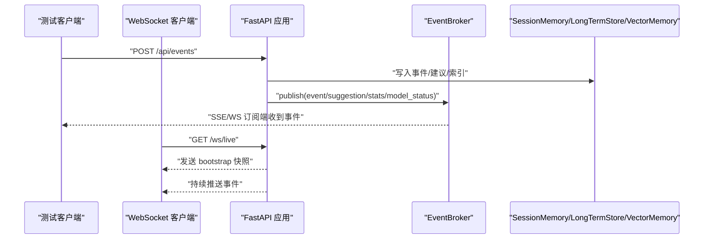
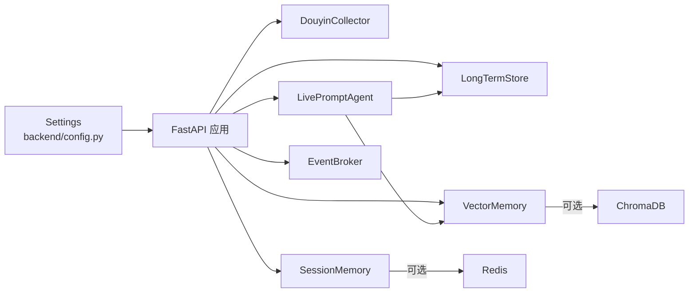

# 测试策略

<cite>
**本文引用的文件**   
- [README.md](file://README.md)
- [backend/app.py](file://backend/app.py)
- [backend/config.py](file://backend/config.py)
- [backend/schemas/live.py](file://backend/schemas/live.py)
- [backend/services/agent.py](file://backend/services/agent.py)
- [backend/services/collector.py](file://backend/services/collector.py)
- [backend/services/broker.py](file://backend/services/broker.py)
- [backend/memory/session_memory.py](file://backend/memory/session_memory.py)
- [backend/memory/vector_store.py](file://backend/memory/vector_store.py)
- [backend/memory/long_term.py](file://backend/memory/long_term.py)
- [requirements.txt](file://requirements.txt)
</cite>

## 目录
1. [简介](#简介)
2. [项目结构](#项目结构)
3. [核心组件](#核心组件)
4. [架构总览](#架构总览)
5. [详细组件分析](#详细组件分析)
6. [依赖分析](#依赖分析)
7. [性能考量](#性能考量)
8. [故障排查指南](#故障排查指南)
9. [结论](#结论)
10. [附录](#附录)

## 简介
本测试策略文档面向抖音直播场景的实时提词系统，覆盖后端服务、内存管理、AI建议生成器、API接口、WebSocket连接、事件流以及端到端用户场景与性能基准测试。文档提供单元测试设计原则与编写方法、集成测试策略、端到端测试指导、测试覆盖率要求、测试数据准备、Mock对象使用与测试环境配置，并给出测试用例示例与脚本模板的路径指引。

## 项目结构
后端采用FastAPI提供REST、SSE与WebSocket接口，核心处理链路包括消息采集、短期/长期记忆、向量检索、建议生成与事件广播。前端Vue应用通过SSE/WS消费事件流。

**图表来源**
- [backend/app.py:1-220](file://backend/app.py#L1-L220)
- [backend/config.py:1-94](file://backend/config.py#L1-L94)
- [backend/services/collector.py:1-284](file://backend/services/collector.py#L1-L284)
- [backend/services/broker.py:1-40](file://backend/services/broker.py#L1-L40)
- [backend/services/agent.py:1-393](file://backend/services/agent.py#L1-L393)
- [backend/memory/session_memory.py:1-113](file://backend/memory/session_memory.py#L1-L113)
- [backend/memory/long_term.py:1-750](file://backend/memory/long_term.py#L1-L750)
- [backend/memory/vector_store.py:1-108](file://backend/memory/vector_store.py#L1-L108)
- [backend/schemas/live.py:1-95](file://backend/schemas/live.py#L1-L95)

**章节来源**
- [README.md:21-50](file://README.md#L21-L50)
- [backend/app.py:1-220](file://backend/app.py#L1-L220)

## 核心组件
- 配置模块：负责加载.env与环境变量，解析LLM参数与数据目录，确保运行期目录存在。
- 采集器：连接本地douyinLive WebSocket，标准化消息为LiveEvent，提交至事件循环。
- 事件总线：进程内异步广播，供SSE/WS订阅。
- 建议生成器：优先OpenAI兼容接口，失败回退启发式规则；构建上下文（近期事件、相似历史、用户画像）。
- 短期记忆：Redis或内存双栈，支持TTL与限长队列。
- 长期存储：SQLite持久化事件、建议、用户画像与会话聚合。
- 向量检索：Chroma或本地哈希嵌入，提供相似历史检索。
- 数据模型：LiveEvent、Suggestion、SessionStats、ModelStatus、SessionSnapshot。

**章节来源**
- [backend/config.py:1-94](file://backend/config.py#L1-L94)
- [backend/services/collector.py:1-284](file://backend/services/collector.py#L1-L284)
- [backend/services/broker.py:1-40](file://backend/services/broker.py#L1-L40)
- [backend/services/agent.py:1-393](file://backend/services/agent.py#L1-L393)
- [backend/memory/session_memory.py:1-113](file://backend/memory/session_memory.py#L1-L113)
- [backend/memory/long_term.py:1-750](file://backend/memory/long_term.py#L1-L750)
- [backend/memory/vector_store.py:1-108](file://backend/memory/vector_store.py#L1-L108)
- [backend/schemas/live.py:1-95](file://backend/schemas/live.py#L1-L95)

## 架构总览
后端通过FastAPI提供健康检查、房间切换、事件注入、SSE/WS事件流等接口；采集器与建议生成器在事件处理主链路中协作，短期/长期记忆与向量检索提供上下文与历史参考；事件经总线广播，前端实时消费。

**图表来源**
- [backend/app.py:61-78](file://backend/app.py#L61-L78)
- [backend/services/collector.py:225-284](file://backend/services/collector.py#L225-L284)
- [backend/services/agent.py:73-114](file://backend/services/agent.py#L73-L114)
- [backend/memory/session_memory.py:42-64](file://backend/memory/session_memory.py#L42-L64)
- [backend/memory/long_term.py:420-454](file://backend/memory/long_term.py#L420-L454)
- [backend/memory/vector_store.py:64-83](file://backend/memory/vector_store.py#L64-L83)
- [backend/services/broker.py:28-39](file://backend/services/broker.py#L28-L39)

## 详细组件分析

### 单元测试设计原则与编写方法
- 隔离性：使用Mock替换外部依赖（网络、数据库、Redis、Chroma），确保测试可重复。
- 可观测性：断言关键状态（如建议生成结果、模型状态、统计数据）与副作用（持久化、广播队列）。
- 边界覆盖：重点覆盖错误分支（HTTP错误、超时、JSON解析失败、回退逻辑）与边界输入（空内容、异常字段）。
- 并发安全：对异步组件（事件总线、采集器线程）进行同步或隔离测试。

#### 后端服务测试（FastAPI）
- 覆盖点：健康检查、房间切换、事件注入、SSE/WS、Viewer相关接口。
- Mock要点：EventBroker队列、SessionMemory/LongTermStore持久化行为、VectorMemory相似检索。
- 断言要点：响应状态码、JSON结构、事件类型过滤、房间ID匹配。

**章节来源**
- [backend/app.py:104-220](file://backend/app.py#L104-L220)
- [backend/services/broker.py:16-39](file://backend/services/broker.py#L16-L39)

#### 内存管理测试（短期/长期/向量）
- SessionMemory：Redis与内存双栈、TTL、限长队列、统计计算。
- LongTermStore：表结构、索引、事务一致性、聚合查询、会话生命周期。
- VectorMemory：Chroma可用性与降级、哈希嵌入、相似检索排序。

**章节来源**
- [backend/memory/session_memory.py:17-113](file://backend/memory/session_memory.py#L17-L113)
- [backend/memory/long_term.py:36-750](file://backend/memory/long_term.py#L36-L750)
- [backend/memory/vector_store.py:52-108](file://backend/memory/vector_store.py#L52-L108)

#### AI建议生成器测试（LivePromptAgent）
- 优先级：OpenAI兼容接口调用、错误分类与回退。
- 上下文：近期事件、相似历史、用户画像。
- 输出：Suggestion结构、字段规范化与置信度范围。

**图表来源**
- [backend/services/agent.py:73-114](file://backend/services/agent.py#L73-L114)
- [backend/services/agent.py:183-330](file://backend/services/agent.py#L183-L330)
- [backend/services/agent.py:353-392](file://backend/services/agent.py#L353-L392)

**章节来源**
- [backend/services/agent.py:23-393](file://backend/services/agent.py#L23-L393)

### 集成测试策略
- API接口测试：使用FastAPI TestClient发起HTTP请求，验证响应结构与业务语义。
- WebSocket连接测试：建立WS连接，接收bootstrap快照与后续事件流，断言事件类型与房间过滤。
- 事件流测试：通过EventBroker订阅队列，验证事件广播、去重与过期队列清理。
- 端到端链路：采集器→应用→内存/存储→建议生成→总线→前端，覆盖典型直播事件（评论/礼物/关注）。

**图表来源**
- [backend/app.py:129-133](file://backend/app.py#L129-L133)
- [backend/app.py:187-206](file://backend/app.py#L187-L206)
- [backend/app.py:209-220](file://backend/app.py#L209-L220)
- [backend/services/broker.py:28-39](file://backend/services/broker.py#L28-L39)

**章节来源**
- [backend/app.py:104-220](file://backend/app.py#L104-L220)
- [backend/services/broker.py:10-40](file://backend/services/broker.py#L10-L40)

### 端到端测试指导
- 用户场景模拟：切换房间、注入事件、观察建议生成与状态变化。
- 系统完整性测试：验证事件从采集到前端展示的完整链路，包括错误恢复（网络抖动、模型不可用）。
- 性能基准测试：测量建议生成延迟、SSE/WS吞吐、内存占用与数据库写入速率。

**章节来源**
- [README.md:208-275](file://README.md#L208-L275)
- [backend/app.py:61-78](file://backend/app.py#L61-L78)

## 依赖分析
- 运行时依赖：FastAPI、Uvicorn、websocket-client、Redis、ChromaDB。
- 组件耦合：建议生成器依赖向量检索与长期存储；应用层协调各组件并通过总线广播。

**图表来源**
- [requirements.txt:1-6](file://requirements.txt#L1-L6)
- [backend/config.py:40-94](file://backend/config.py#L40-L94)
- [backend/services/agent.py:24-30](file://backend/services/agent.py#L24-L30)
- [backend/memory/vector_store.py:60-63](file://backend/memory/vector_store.py#L60-L63)
- [backend/memory/session_memory.py:29-31](file://backend/memory/session_memory.py#L29-L31)

**章节来源**
- [requirements.txt:1-6](file://requirements.txt#L1-L6)
- [backend/config.py:1-94](file://backend/config.py#L1-L94)

## 性能考量
- 建议生成延迟：优先OpenAI兼容接口，失败回退启发式规则；建议生成器内部包含超时与错误分类。
- SSE/WS吞吐：EventBroker使用异步队列，注意队列满导致的订阅清理。
- 内存与存储：短期记忆支持Redis TTL；SQLite写入与索引重建需关注I/O瓶颈。
- 向量检索：Chroma可用时性能更佳，不可用时使用本地哈希嵌入降级方案。

**章节来源**
- [backend/services/agent.py:183-330](file://backend/services/agent.py#L183-L330)
- [backend/services/broker.py:28-39](file://backend/services/broker.py#L28-L39)
- [backend/memory/session_memory.py:17-113](file://backend/memory/session_memory.py#L17-L113)
- [backend/memory/long_term.py:420-454](file://backend/memory/long_term.py#L420-L454)
- [backend/memory/vector_store.py:52-108](file://backend/memory/vector_store.py#L52-L108)

## 故障排查指南
- 建议生成器错误分类：HTTP错误、网络错误、超时、JSON解析失败、OS错误、意外异常；记录状态并回退。
- 采集器连接：心跳ping、重连间隔、线程安全与关闭流程。
- 事件总线：队列满导致的陈旧队列清理与订阅移除。
- 配置解析：LLM模式与URL解析、数据目录创建。

**章节来源**
- [backend/services/agent.py:222-285](file://backend/services/agent.py#L222-L285)
- [backend/services/collector.py:117-198](file://backend/services/collector.py#L117-L198)
- [backend/services/broker.py:31-39](file://backend/services/broker.py#L31-L39)
- [backend/config.py:63-91](file://backend/config.py#L63-L91)

## 结论
本测试策略围绕后端核心链路与关键组件制定，强调单元测试隔离、集成测试端到端覆盖与性能基准评估。通过Mock与测试数据准备，可在不同依赖可用性条件下稳定验证系统行为。

## 附录

### 测试覆盖率要求
- 单元测试：核心模块（建议生成器、内存管理、采集器）达到80%以上行覆盖率与判定覆盖率。
- 集成测试：关键API与事件流覆盖率达到100%，含错误分支与边界条件。
- 端到端：至少覆盖典型直播事件链路与错误恢复路径。

### 测试数据准备
- LiveEvent样本：评论、礼物、关注、点赞、成员加入等多类型。
- Suggestion样本：不同优先级与置信度组合。
- 用户画像与会话：包含viewer_id、昵称、礼物历史、最近会话等字段。

### Mock对象使用
- 建议生成器：Mock OpenAI兼容接口返回值与异常，验证回退逻辑。
- 内存组件：Mock Redis/Chroma，验证降级路径。
- 事件总线：Mock队列满与订阅清理行为。

### 测试环境配置
- 环境变量：设置房间ID、LLM模式与API密钥、数据目录、Redis/Chroma路径。
- 启动顺序：先启动本地消息源，再启动后端与前端，或使用脚本一键启动。

**章节来源**
- [README.md:142-201](file://README.md#L142-L201)
- [README.md:101-128](file://README.md#L101-L128)

### 测试用例示例与脚本模板（路径指引）
- FastAPI接口测试（示例路径）
  - 健康检查：[backend/app.py:104-106](file://backend/app.py#L104-L106)
  - 房间切换：[backend/app.py:115-126](file://backend/app.py#L115-L126)
  - 事件注入：[backend/app.py:129-132](file://backend/app.py#L129-L132)
  - SSE事件流：[backend/app.py:187-206](file://backend/app.py#L187-L206)
  - WebSocket事件流：[backend/app.py:209-220](file://backend/app.py#L209-L220)
- 建议生成器测试（示例路径）
  - 生成逻辑与回退：[backend/services/agent.py:73-114](file://backend/services/agent.py#L73-L114)
  - OpenAI兼容调用与错误分类：[backend/services/agent.py:183-330](file://backend/services/agent.py#L183-L330)
  - 字段规范化：[backend/services/agent.py:353-392](file://backend/services/agent.py#L353-L392)
- 内存管理测试（示例路径）
  - 短期记忆：[backend/memory/session_memory.py:42-112](file://backend/memory/session_memory.py#L42-L112)
  - 长期存储：[backend/memory/long_term.py:420-524](file://backend/memory/long_term.py#L420-L524)
  - 向量检索：[backend/memory/vector_store.py:64-108](file://backend/memory/vector_store.py#L64-L108)
- 采集器测试（示例路径）
  - 连接与重连：[backend/services/collector.py:117-198](file://backend/services/collector.py#L117-L198)
  - 消息标准化：[backend/services/collector.py:225-284](file://backend/services/collector.py#L225-L284)
- 事件总线测试（示例路径）
  - 订阅与广播：[backend/services/broker.py:16-39](file://backend/services/broker.py#L16-L39)