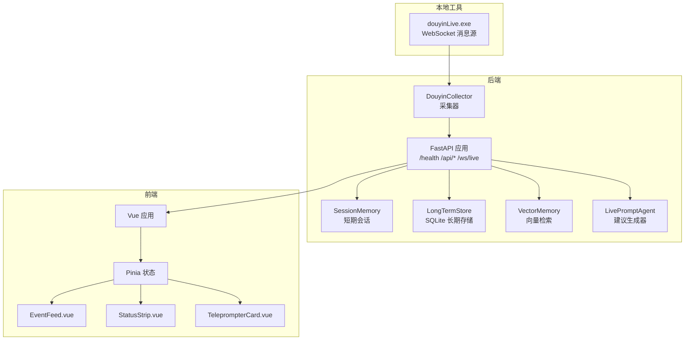
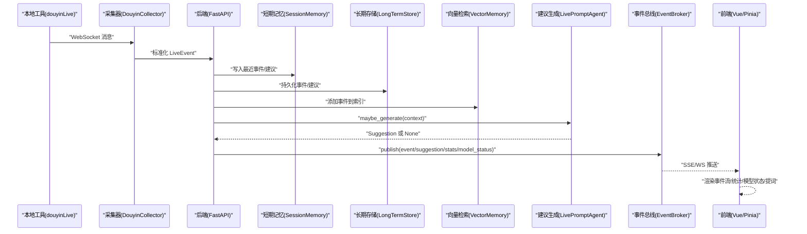
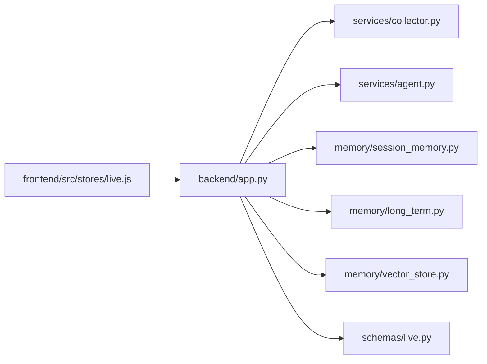

# 端到端测试

<cite>
**本文引用的文件**
- [README.md](file://README.md)
- [USAGE.md](file://USAGE.md)
- [backend/app.py](file://backend/app.py)
- [backend/config.py](file://backend/config.py)
- [backend/services/agent.py](file://backend/services/agent.py)
- [backend/services/collector.py](file://backend/services/collector.py)
- [backend/memory/session_memory.py](file://backend/memory/session_memory.py)
- [backend/memory/long_term.py](file://backend/memory/long_term.py)
- [backend/memory/vector_store.py](file://backend/memory/vector_store.py)
- [backend/schemas/live.py](file://backend/schemas/live.py)
- [frontend/src/main.js](file://frontend/src/main.js)
- [frontend/src/stores/live.js](file://frontend/src/stores/live.js)
- [frontend/src/components/EventFeed.vue](file://frontend/src/components/EventFeed.vue)
- [frontend/src/components/StatusStrip.vue](file://frontend/src/components/StatusStrip.vue)
- [frontend/src/components/TeleprompterCard.vue](file://frontend/src/components/TeleprompterCard.vue)
- [tool/config.yaml](file://tool/config.yaml)
</cite>

## 目录
1. [简介](#简介)
2. [项目结构](#项目结构)
3. [核心组件](#核心组件)
4. [架构总览](#架构总览)
5. [详细组件分析](#详细组件分析)
6. [依赖分析](#依赖分析)
7. [性能考虑](#性能考虑)
8. [故障排查指南](#故障排查指南)
9. [结论](#结论)
10. [附录](#附录)

## 简介
本文件面向端到端测试，覆盖从用户操作到系统响应的完整测试流程。重点包括：
- 用户场景模拟测试：主播操作流程、观众互动、实时提词使用
- 系统完整性测试：数据流完整性、状态同步、错误恢复
- 性能基准测试：响应时间、并发处理、资源使用
- 前端UI测试：Vue组件、用户交互、实时数据展示
- 测试脚本与自动化执行、测试报告生成
- 测试环境搭建、测试数据准备、测试用例设计

## 项目结构
该项目由三部分组成：本地抖音消息源、后端FastAPI服务、前端Vue应用。后端负责事件采集、短期/长期记忆、向量检索、建议生成与实时推送；前端负责房间切换、事件筛选、实时提词展示与主题切换。

图表来源
- [backend/app.py:94-220](file://backend/app.py#L94-L220)
- [backend/services/collector.py:38-284](file://backend/services/collector.py#L38-L284)
- [backend/services/agent.py:23-393](file://backend/services/agent.py#L23-L393)
- [backend/memory/session_memory.py:17-113](file://backend/memory/session_memory.py#L17-L113)
- [backend/memory/long_term.py:36-750](file://backend/memory/long_term.py#L36-L750)
- [backend/memory/vector_store.py:52-108](file://backend/memory/vector_store.py#L52-L108)
- [frontend/src/main.js:1-17](file://frontend/src/main.js#L1-L17)
- [frontend/src/stores/live.js:70-310](file://frontend/src/stores/live.js#L70-L310)

章节来源
- [README.md:1-349](file://README.md#L1-L349)
- [USAGE.md:1-256](file://USAGE.md#L1-L256)

## 核心组件
- 后端应用与路由：健康检查、引导快照、房间切换、事件注入、SSE/WS 实时流
- 采集器：连接本地 WebSocket，标准化事件，提交到后端事件循环
- 建议生成器：优先在线模型，失败回退规则；构建上下文并产出建议
- 记忆层：短期会话（Redis/内存）、长期存储（SQLite）、向量检索（Chroma/哈希）
- 前端：Pinia 状态、SSE 连接、事件过滤、主题切换、实时提词展示

章节来源
- [backend/app.py:104-220](file://backend/app.py#L104-L220)
- [backend/services/collector.py:38-284](file://backend/services/collector.py#L38-L284)
- [backend/services/agent.py:23-393](file://backend/services/agent.py#L23-L393)
- [backend/memory/session_memory.py:17-113](file://backend/memory/session_memory.py#L17-L113)
- [backend/memory/long_term.py:36-750](file://backend/memory/long_term.py#L36-L750)
- [backend/memory/vector_store.py:52-108](file://backend/memory/vector_store.py#L52-L108)
- [frontend/src/stores/live.js:70-310](file://frontend/src/stores/live.js#L70-L310)

## 架构总览
端到端数据流从抖音消息源进入采集器，标准化后进入后端事件处理链：短期记忆、长期存储、向量检索、建议生成，随后通过 SSE/WS 推送到前端；前端渲染事件流、统计、模型状态与提词卡片。

图表来源
- [backend/services/collector.py:145-284](file://backend/services/collector.py#L145-L284)
- [backend/app.py:61-78](file://backend/app.py#L61-L78)
- [backend/services/agent.py:73-114](file://backend/services/agent.py#L73-L114)
- [backend/memory/session_memory.py:42-84](file://backend/memory/session_memory.py#L42-L84)
- [backend/memory/long_term.py:420-454](file://backend/memory/long_term.py#L420-L454)
- [backend/memory/vector_store.py:64-83](file://backend/memory/vector_store.py#L64-L83)
- [frontend/src/stores/live.js:173-205](file://frontend/src/stores/live.js#L173-L205)

## 详细组件分析

### 后端应用与路由
- 健康检查：返回房间号与活动会话
- 引导快照：返回最近事件、建议、统计、模型状态
- 房间切换：关闭当前会话，切换采集器房间，返回新快照
- 事件注入：手动注入标准化事件，触发建议生成
- SSE/WS：事件流推送 event/suggestion/stats/model_status

章节来源
- [backend/app.py:104-220](file://backend/app.py#L104-L220)

### 采集器（DouyinCollector）
- 连接本地 WebSocket，按配置重连与心跳
- 标准化消息为 LiveEvent，提交到后端事件循环
- 支持房间切换与停止

章节来源
- [backend/services/collector.py:38-284](file://backend/services/collector.py#L38-L284)

### 建议生成器（LivePromptAgent）
- 上下文：最近事件、相似历史、用户画像
- 事件类型过滤：comment/gift/follow 生成建议
- 在线模型优先，失败回退规则
- 状态上报：模式、模型、后端、结果、错误、更新时间

章节来源
- [backend/services/agent.py:23-393](file://backend/services/agent.py#L23-L393)

### 记忆层
- SessionMemory：Redis/内存短期会话，支持 TTL
- LongTermStore：SQLite 表结构、索引、会话聚合、画像与笔记
- VectorMemory：Chroma 或哈希嵌入近似相似检索

章节来源
- [backend/memory/session_memory.py:17-113](file://backend/memory/session_memory.py#L17-L113)
- [backend/memory/long_term.py:36-750](file://backend/memory/long_term.py#L36-L750)
- [backend/memory/vector_store.py:52-108](file://backend/memory/vector_store.py#L52-L108)

### 前端状态与组件
- Pinia 状态：房间、主题、连接状态、事件过滤、统计、建议、模型状态
- SSE 连接：event/suggestion/stats/model_status 事件监听
- 组件：事件流、状态条、提词卡片

章节来源
- [frontend/src/stores/live.js:70-310](file://frontend/src/stores/live.js#L70-L310)
- [frontend/src/components/EventFeed.vue](file://frontend/src/components/EventFeed.vue)
- [frontend/src/components/StatusStrip.vue](file://frontend/src/components/StatusStrip.vue)
- [frontend/src/components/TeleprompterCard.vue](file://frontend/src/components/TeleprompterCard.vue)

## 依赖分析
后端各模块之间的耦合与协作：
- app.py 依赖 collector、agent、memory、schemas
- agent 依赖 vector_memory、long_term_store
- memory 层之间低耦合，通过接口与事件总线解耦
- 前端通过 HTTP/SSE/WS 与后端交互，状态集中于 Pinia

图表来源
- [backend/app.py:13-29](file://backend/app.py#L13-L29)
- [backend/services/agent.py:23-30](file://backend/services/agent.py#L23-L30)
- [backend/memory/session_memory.py:17-31](file://backend/memory/session_memory.py#L17-L31)
- [backend/memory/long_term.py:36-40](file://backend/memory/long_term.py#L36-L40)
- [backend/memory/vector_store.py:52-62](file://backend/memory/vector_store.py#L52-L62)
- [frontend/src/stores/live.js:70-90](file://frontend/src/stores/live.js#L70-L90)

## 性能考虑
- 响应时间测试
  - 后端健康检查、引导快照、房间切换接口的延迟与吞吐
  - SSE/WS 推送延迟与断线重连时间
- 并发处理能力测试
  - 多房间并发、多采集器并发、高并发事件注入
  - Redis/Chroma 可选依赖的并发稳定性
- 资源使用监控
  - CPU、内存、磁盘 IO、网络带宽
  - SQLite/Chroma 索引大小与查询耗时
- 建议生成性能
  - 在线模型调用耗时与回退规则耗时对比
  - 向量检索命中率与相似度阈值影响

[本节为通用指导，无需特定文件来源]

## 故障排查指南
- 页面打开但无建议
  - 检查本地抖音消息源是否运行、房间号是否正确、直播间是否开播
- 顶部显示 fallback
  - 检查在线模型 API Key、网络访问、超时或限流
- 顶部显示 heuristic
  - 检查配置是否强制规则模式
- 前端无法启动
  - 检查前端端口占用与依赖安装
- 后端未写入数据
  - 检查采集器连接、日志与房间状态

章节来源
- [USAGE.md:198-256](file://USAGE.md#L198-L256)

## 结论
本测试文档提供了从用户场景到系统响应的完整端到端测试框架，涵盖数据流、状态同步、错误恢复、性能与前端UI测试。建议结合自动化脚本与持续集成流水线，确保每次变更都能快速验证系统稳定性与正确性。

[本节为总结，无需特定文件来源]

## 附录

### 测试环境搭建
- 环境要求：Windows、Python 3.10+、Node.js 18+、可选 Redis/Chroma
- 启动顺序：本地抖音消息源 → 后端 → 前端
- 配置要点：.env 中 ROOM_ID、LLM_MODE、API Key、端口

章节来源
- [README.md:50-140](file://README.md#L50-L140)
- [USAGE.md:15-114](file://USAGE.md#L15-L114)

### 测试数据准备
- 本地抖音消息源配置：tool/config.yaml
- 手动注入事件：/api/events
- 房间切换：/api/room
- 快照与状态：/api/bootstrap、/health

章节来源
- [tool/config.yaml:1-16](file://tool/config.yaml#L1-L16)
- [backend/app.py:109-133](file://backend/app.py#L109-L133)
- [backend/app.py:115-126](file://backend/app.py#L115-L126)

### 用户场景模拟测试

#### 主播操作流程测试
- 场景：主播切换房间、查看统计、模型状态变化
- 步骤：
  1) 前端调用 /api/room 切换房间
  2) SSE/WS 推送 model_status 与 stats 更新
  3) 前端 Pinia 状态与 UI 同步
- 断言：
  - 房间号变更、统计计数、模型状态与 last_result 更新

章节来源
- [frontend/src/stores/live.js:207-250](file://frontend/src/stores/live.js#L207-L250)
- [backend/app.py:115-126](file://backend/app.py#L115-L126)
- [backend/app.py:187-206](file://backend/app.py#L187-L206)

#### 观众互动测试
- 场景：评论、礼物、关注、进场、点赞
- 步骤：
  1) 本地消息源发送不同事件类型
  2) 采集器标准化并提交
  3) 建议生成器对 comment/gift/follow 生成建议
  4) SSE/WS 推送 event/suggestion/stats
  5) 前端事件流与提词卡片更新
- 断言：
  - 事件类型过滤生效、建议生成与置信度、事件计数

章节来源
- [backend/services/collector.py:225-284](file://backend/services/collector.py#L225-L284)
- [backend/services/agent.py:73-94](file://backend/services/agent.py#L73-L94)
- [frontend/src/stores/live.js:190-204](file://frontend/src/stores/live.js#L190-L204)

#### 实时提词使用测试
- 场景：主播查看当前建议来源、优先级、语气
- 步骤：
  1) 建议生成后通过 SSE/WS 推送
  2) 前端 activeSuggestion 与 activeSourceEvent 计算
  3) 提词卡片展示建议文本与来源标签
- 断言：
  - 来源标签与建议字段一致性、建议列表长度限制

章节来源
- [backend/services/agent.py:81-94](file://backend/services/agent.py#L81-L94)
- [frontend/src/stores/live.js:92-104](file://frontend/src/stores/live.js#L92-L104)
- [frontend/src/components/TeleprompterCard.vue](file://frontend/src/components/TeleprompterCard.vue)

### 系统完整性测试

#### 数据流完整性验证
- LiveEvent 字段完整性：event_id、room_id、user、content、metadata、raw
- 建议字段完整性：suggestion_id、priority、reply_text、tone、reason、confidence、references、source_events
- 长期存储一致性：事件表、建议表、画像表、会话表、笔记表

章节来源
- [backend/schemas/live.py:29-94](file://backend/schemas/live.py#L29-L94)
- [backend/memory/long_term.py:54-148](file://backend/memory/long_term.py#L54-L148)

#### 状态同步测试
- SSE/WS 事件类型：event、suggestion、stats、model_status
- 前端订阅与断线重连：onopen/onerror 与 reconnecting 状态
- 模型状态：mode、model、backend、last_result、last_error、updated_at

章节来源
- [backend/app.py:187-206](file://backend/app.py#L187-L206)
- [backend/app.py:209-220](file://backend/app.py#L209-L220)
- [frontend/src/stores/live.js:173-205](file://frontend/src/stores/live.js#L173-L205)

#### 错误恢复测试
- 在线模型失败：回退到规则，model_status 标记 fallback/error
- 采集器断线：自动重连、心跳、日志记录
- 前端断线：reconnecting 状态与重连逻辑

章节来源
- [backend/services/agent.py:99-113](file://backend/services/agent.py#L99-L113)
- [backend/services/collector.py:117-180](file://backend/services/collector.py#L117-L180)
- [frontend/src/stores/live.js:186-188](file://frontend/src/stores/live.js#L186-L188)

### 性能基准测试

#### 响应时间测试
- 接口延迟：/health、/api/bootstrap、/api/room
- SSE/WS 延迟：从事件产生到前端渲染
- 建议生成耗时：在线模型与规则两种路径

章节来源
- [backend/app.py:104-126](file://backend/app.py#L104-L126)
- [backend/app.py:187-220](file://backend/app.py#L187-L220)
- [backend/services/agent.py:183-329](file://backend/services/agent.py#L183-L329)

#### 并发处理能力测试
- 多房间并发：同时连接多个房间，验证房间切换与快照
- 高并发事件注入：批量 /api/events 注入，验证建议生成与存储
- 记忆层并发：Redis/Chroma 并发写入与查询

章节来源
- [backend/app.py:115-126](file://backend/app.py#L115-L126)
- [backend/services/collector.py:200-214](file://backend/services/collector.py#L200-L214)
- [backend/memory/session_memory.py:42-64](file://backend/memory/session_memory.py#L42-L64)
- [backend/memory/vector_store.py:64-83](file://backend/memory/vector_store.py#L64-L83)

#### 资源使用监控
- CPU/内存：采集器、后端、前端
- 磁盘：SQLite 数据库、Chroma 持久化目录
- 网络：WebSocket 连接、SSE 连接、在线模型调用

章节来源
- [backend/config.py:51-68](file://backend/config.py#L51-L68)
- [backend/memory/long_term.py:50-154](file://backend/memory/long_term.py#L50-L154)
- [backend/memory/vector_store.py:61-62](file://backend/memory/vector_store.py#L61-L62)

### 前端UI测试方法

#### Vue 组件测试
- EventFeed.vue：事件列表渲染、过滤、滚动
- StatusStrip.vue：连接状态、模型状态、统计数据
- TeleprompterCard.vue：当前建议展示、来源标签、优先级

章节来源
- [frontend/src/components/EventFeed.vue](file://frontend/src/components/EventFeed.vue)
- [frontend/src/components/StatusStrip.vue](file://frontend/src/components/StatusStrip.vue)
- [frontend/src/components/TeleprompterCard.vue](file://frontend/src/components/TeleprompterCard.vue)

#### 用户交互测试
- 房间切换：输入框、提交按钮、错误提示
- 事件过滤：多选事件类型、全选/反选
- 主题切换：localStorage 持久化、DOM 属性切换

章节来源
- [frontend/src/stores/live.js:207-250](file://frontend/src/stores/live.js#L207-L250)
- [frontend/src/stores/live.js:252-273](file://frontend/src/stores/live.js#L252-L273)
- [frontend/src/stores/live.js:148-156](file://frontend/src/stores/live.js#L148-L156)

#### 实时数据展示测试
- SSE 订阅：事件监听、错误处理、重连
- WS 连接：bootstrap 快照、增量推送
- 前端状态：Pinia 状态与组件渲染一致性

章节来源
- [frontend/src/stores/live.js:173-205](file://frontend/src/stores/live.js#L173-L205)
- [frontend/src/stores/live.js:21-30](file://frontend/src/stores/live.js#L21-L30)

### 测试脚本编写与自动化执行

#### 接口测试脚本
- 健康检查：GET /health
- 引导快照：GET /api/bootstrap?room_id
- 房间切换：POST /api/room
- 事件注入：POST /api/events
- SSE/WS：订阅 /api/events/stream 与 /ws/live

章节来源
- [backend/app.py:104-220](file://backend/app.py#L104-L220)

#### 自动化执行
- 使用测试框架（如 pytest/aiohttp/Playwright）编写测试套件
- CI/CD 集成：启动本地抖音消息源、后端、前端，执行端到端测试
- 报告生成：JUnit XML、HTML 报告、覆盖率

[本节为通用指导，无需特定文件来源]

### 测试报告生成
- 测试结果汇总：通过/失败/跳过
- 性能指标：平均响应时间、P95/P99、并发吞吐
- 日志与截图：关键步骤日志、错误截图
- 回归报告：对比基线版本，标记回归问题

[本节为通用指导，无需特定文件来源]