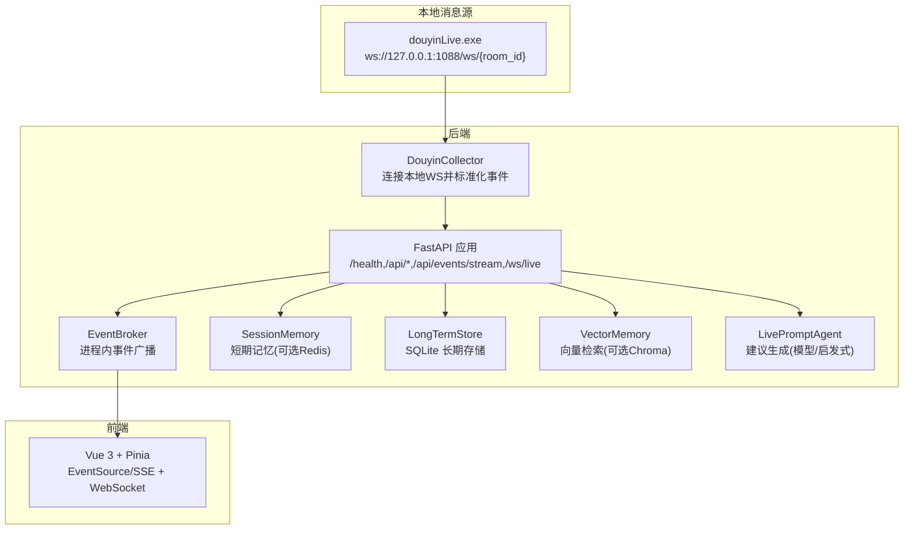
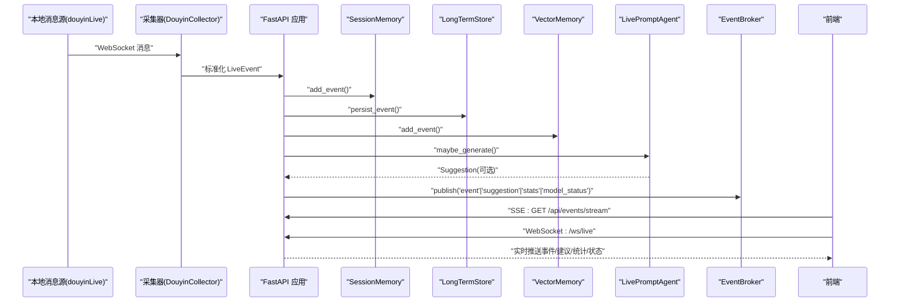
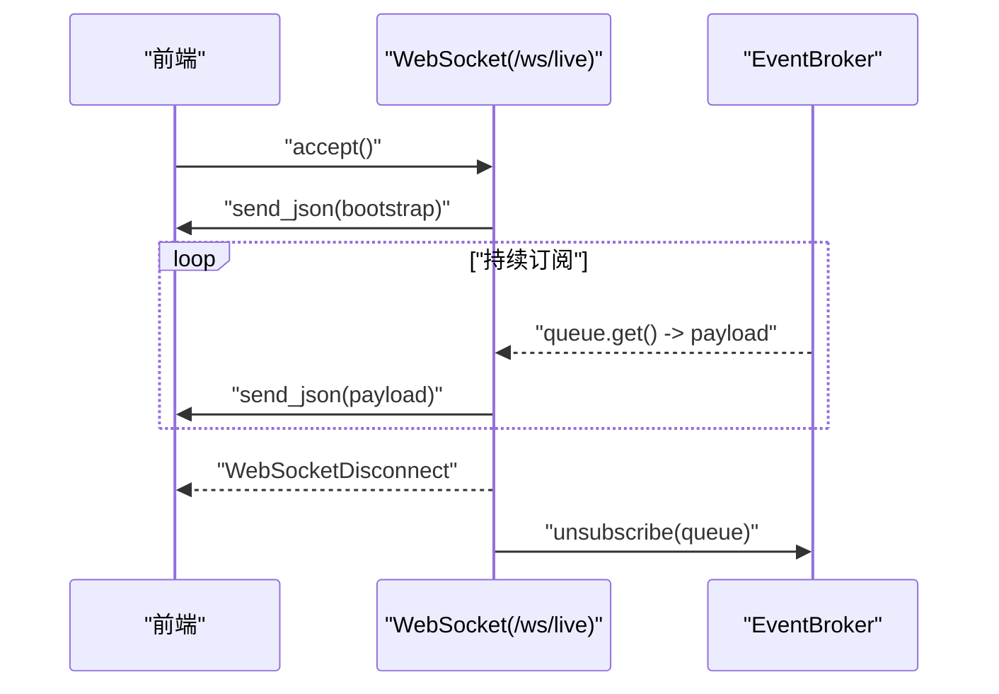
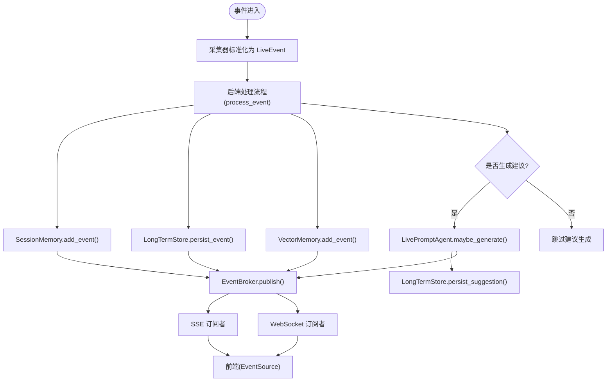
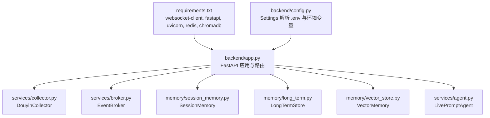

# 集成测试

<cite>
**本文引用的文件**   
- [backend/app.py](file://backend/app.py)
- [backend/config.py](file://backend/config.py)
- [backend/services/collector.py](file://backend/services/collector.py)
- [backend/services/broker.py](file://backend/services/broker.py)
- [backend/memory/session_memory.py](file://backend/memory/session_memory.py)
- [backend/memory/long_term.py](file://backend/memory/long_term.py)
- [backend/memory/vector_store.py](file://backend/memory/vector_store.py)
- [backend/services/agent.py](file://backend/services/agent.py)
- [backend/schemas/live.py](file://backend/schemas/live.py)
- [frontend/src/stores/live.js](file://frontend/src/stores/live.js)
- [README.md](file://README.md)
- [USAGE.md](file://USAGE.md)
- [data/DATABASE.md](file://data/DATABASE.md)
- [requirements.txt](file://requirements.txt)
- [start_all.ps1](file://start_all.ps1)
- [start_backend_qwen.ps1](file://start_backend_qwen.ps1)
</cite>

## 目录
1. [简介](#简介)
2. [项目结构](#项目结构)
3. [核心组件](#核心组件)
4. [架构总览](#架构总览)
5. [详细组件分析](#详细组件分析)
6. [依赖分析](#依赖分析)
7. [性能考虑](#性能考虑)
8. [故障排查指南](#故障排查指南)
9. [结论](#结论)
10. [附录](#附录)

## 简介
本文件面向系统级集成测试，覆盖后端 FastAPI 服务、事件采集器、内存与存储层、向量检索、AI 建议生成器以及前端实时订阅通道（SSE/WebSocket）的端到端联动。测试策略包括：
- API 接口测试：RESTful HTTP 请求、响应校验、错误处理
- WebSocket 连接测试：实时消息传输、连接状态管理、断线重连
- 事件流测试：事件发布订阅、消息队列处理、事件传播路径
- 事件处理系统集成测试：事件收集器与后端服务、短期/长期存储、向量检索、AI 建议生成的协同验证
- 测试环境配置、Mock 服务与测试数据注入

## 项目结构
系统由三部分组成：本地抖音消息源工具、后端（FastAPI + 采集器 + 服务层 + 存储层）、前端（Vue 3 + Pinia）。后端通过 SSE/WebSocket 将事件、建议、统计与模型状态实时推送到前端。

图表来源
- [backend/app.py:94-220](file://backend/app.py#L94-L220)
- [backend/services/collector.py:38-284](file://backend/services/collector.py#L38-L284)
- [backend/services/broker.py:10-40](file://backend/services/broker.py#L10-L40)
- [backend/memory/session_memory.py:17-113](file://backend/memory/session_memory.py#L17-L113)
- [backend/memory/long_term.py:36-750](file://backend/memory/long_term.py#L36-L750)
- [backend/memory/vector_store.py:52-108](file://backend/memory/vector_store.py#L52-L108)
- [backend/services/agent.py:23-393](file://backend/services/agent.py#L23-L393)
- [frontend/src/stores/live.js:70-310](file://frontend/src/stores/live.js#L70-L310)

章节来源
- [README.md:1-349](file://README.md#L1-L349)
- [USAGE.md:1-256](file://USAGE.md#L1-L256)

## 核心组件
- FastAPI 应用与路由：健康检查、前端快照、房间切换、事件注入、Viewer 相关查询、SSE 与 WebSocket 实时流
- 采集器：连接本地 WebSocket，解析消息，标准化为 LiveEvent 并投递到事件循环
- 事件总线：进程内广播，供 SSE 与 WebSocket 订阅
- 内存层：短期会话事件与建议，支持 Redis 退化
- 长期存储：SQLite 表结构与索引，事件、建议、观众画像、场次、备注
- 向量检索：Chroma 或本地哈希嵌入退化方案
- AI 建议生成器：OpenAI 兼容接口或启发式规则，回退策略与状态上报
- 前端：EventSource 订阅 SSE，WebSocket 订阅实时推送，房间切换与过滤

章节来源
- [backend/app.py:104-220](file://backend/app.py#L104-L220)
- [backend/services/collector.py:38-284](file://backend/services/collector.py#L38-L284)
- [backend/services/broker.py:10-40](file://backend/services/broker.py#L10-L40)
- [backend/memory/session_memory.py:17-113](file://backend/memory/session_memory.py#L17-L113)
- [backend/memory/long_term.py:36-750](file://backend/memory/long_term.py#L36-L750)
- [backend/memory/vector_store.py:52-108](file://backend/memory/vector_store.py#L52-L108)
- [backend/services/agent.py:23-393](file://backend/services/agent.py#L23-L393)
- [frontend/src/stores/live.js:70-310](file://frontend/src/stores/live.js#L70-L310)

## 架构总览
后端启动时创建采集器、内存、长期存储、向量检索与 AI 建议生成器实例；采集器将标准化事件交由后端处理，后端写入短期/长期存储，构建建议并通过事件总线广播；前端通过 SSE 与 WebSocket 实时接收事件、建议、统计与模型状态。

图表来源
- [backend/app.py:61-78](file://backend/app.py#L61-L78)
- [backend/services/collector.py:145-160](file://backend/services/collector.py#L145-L160)
- [backend/services/broker.py:28-40](file://backend/services/broker.py#L28-L40)
- [frontend/src/stores/live.js:173-205](file://frontend/src/stores/live.js#L173-L205)

## 详细组件分析

### API 接口测试策略
- 健康检查：GET /health，验证返回字段与当前房间号、活跃会话状态
- 前端快照：GET /api/bootstrap，校验返回的最近事件、建议、统计与模型状态结构
- 房间切换：POST /api/room，校验切换成功后的快照一致性与采集器房间变更
- 事件注入：POST /api/events，校验事件入库、建议生成与广播
- Viewer 查询：GET /api/viewer、/api/viewer/notes、POST /api/viewer/notes、DELETE /api/viewer/notes/{note_id}，校验鉴权与业务逻辑
- 会话查询：GET /api/sessions、/api/sessions/current，校验会话状态与统计
- SSE 流：GET /api/events/stream，校验事件类型过滤与房间过滤
- WebSocket：GET /ws/live，校验连接、bootstrap 快照与断线重连

章节来源
- [backend/app.py:104-220](file://backend/app.py#L104-L220)
- [README.md:208-275](file://README.md#L208-L275)

### WebSocket 连接测试策略
- 连接建立：接受 WebSocket，发送一次 bootstrap 快照
- 实时推送：订阅队列持续推送 event/suggestion/stats/model_status
- 断线重连：捕获断开异常，清理订阅队列
- 连接状态：前端连接状态枚举（connecting/live/reconnecting/switching）

图表来源
- [backend/app.py:209-220](file://backend/app.py#L209-L220)
- [backend/services/broker.py:16-27](file://backend/services/broker.py#L16-L27)
- [frontend/src/stores/live.js:173-205](file://frontend/src/stores/live.js#L173-L205)

章节来源
- [backend/app.py:209-220](file://backend/app.py#L209-L220)
- [frontend/src/stores/live.js:173-205](file://frontend/src/stores/live.js#L173-L205)

### 事件流测试策略
- 事件发布：采集器标准化事件后，调用后端处理流程，写入短期/长期存储，构建建议并广播
- 事件订阅：SSE 与 WebSocket 订阅队列，按房间过滤与事件类型过滤
- 事件传播路径：采集器 -> 后端处理 -> 内存/存储 -> 建议生成 -> 事件总线 -> 前端

图表来源
- [backend/app.py:61-78](file://backend/app.py#L61-L78)
- [backend/services/collector.py:225-284](file://backend/services/collector.py#L225-L284)
- [backend/services/broker.py:28-40](file://backend/services/broker.py#L28-L40)
- [backend/services/agent.py:73-94](file://backend/services/agent.py#L73-L94)
- [frontend/src/stores/live.js:173-205](file://frontend/src/stores/live.js#L173-L205)

章节来源
- [backend/app.py:61-78](file://backend/app.py#L61-L78)
- [backend/services/collector.py:225-284](file://backend/services/collector.py#L225-L284)
- [backend/services/broker.py:28-40](file://backend/services/broker.py#L28-L40)
- [backend/services/agent.py:73-94](file://backend/services/agent.py#L73-L94)
- [frontend/src/stores/live.js:173-205](file://frontend/src/stores/live.js#L173-L205)

### 事件处理系统集成测试
- 事件收集器与后端服务集成：采集器连接本地 WS，标准化事件，通过事件循环安全投递到后端处理
- 内存存储协同：短期事件与建议写入 Redis 或进程内队列，确保高吞吐与低延迟
- 长期存储协同：事件与建议持久化到 SQLite，观众画像与场次状态维护
- 向量检索协同：事件内容写入向量索引，相似历史用于建议上下文
- AI 建议生成端到端：上下文构造、模型调用（OpenAI 兼容）或启发式规则、状态上报与错误回退

章节来源
- [backend/services/collector.py:117-139](file://backend/services/collector.py#L117-L139)
- [backend/memory/session_memory.py:42-84](file://backend/memory/session_memory.py#L42-L84)
- [backend/memory/long_term.py:420-454](file://backend/memory/long_term.py#L420-L454)
- [backend/memory/vector_store.py:64-83](file://backend/memory/vector_store.py#L64-L83)
- [backend/services/agent.py:56-114](file://backend/services/agent.py#L56-L114)

## 依赖分析
- 后端依赖：FastAPI、Uvicorn、WebSocket 客户端、可选 Redis、可选 Chroma
- 启动脚本：Windows PowerShell 脚本负责启动后端与前端，前置 .env 校验
- 配置：Settings 解析环境变量与 .env，提供运行期目录与模型解析

图表来源
- [requirements.txt:1-6](file://requirements.txt#L1-L6)
- [backend/config.py:39-94](file://backend/config.py#L39-L94)
- [backend/app.py:1-30](file://backend/app.py#L1-L30)

章节来源
- [requirements.txt:1-6](file://requirements.txt#L1-L6)
- [backend/config.py:39-94](file://backend/config.py#L39-L94)
- [backend/app.py:1-30](file://backend/app.py#L1-L30)

## 性能考虑
- SSE/WS 广播：EventBroker 维护订阅队列，满载时剔除陈旧队列，避免内存泄漏
- Redis 短期记忆：支持热数据 TTL，提升高并发场景下的读写性能
- 向量检索退化：无 Chroma 时采用本地哈希嵌入，保证检索能力不中断
- 采集器心跳与重连：Ping 保活与指数退避重连，降低网络抖动影响
- 建议生成：模型失败自动回退启发式规则，保障实时性与稳定性

章节来源
- [backend/services/broker.py:31-40](file://backend/services/broker.py#L31-L40)
- [backend/memory/session_memory.py:24-31](file://backend/memory/session_memory.py#L24-L31)
- [backend/memory/vector_store.py:19-50](file://backend/memory/vector_store.py#L19-L50)
- [backend/services/collector.py:182-198](file://backend/services/collector.py#L182-L198)
- [backend/services/agent.py:96-114](file://backend/services/agent.py#L96-L114)

## 故障排查指南
- 健康检查失败：检查 /health 返回的房间号与活跃会话状态
- SSE/WS 连接异常：确认后端端口与 CORS 设置，前端连接状态枚举
- 采集器断开：检查本地消息源是否运行、房间号是否一致、Ping 与重连间隔
- 数据未入库：核对 SQLite 表结构与索引，确认事件写入与会话状态更新
- 建议生成失败：检查模型配置与 API Key，观察模型状态回退到启发式

章节来源
- [backend/app.py:104-107](file://backend/app.py#L104-L107)
- [frontend/src/stores/live.js:173-205](file://frontend/src/stores/live.js#L173-L205)
- [backend/services/collector.py:117-139](file://backend/services/collector.py#L117-L139)
- [data/DATABASE.md:1-151](file://data/DATABASE.md#L1-L151)
- [backend/services/agent.py:96-114](file://backend/services/agent.py#L96-L114)

## 结论
本集成测试文档提供了从 API、WebSocket、事件流到 AI 建议生成的全链路测试策略与实施方案。通过结合健康检查、事件注入、SSE/WS 订阅与数据库校验，可有效验证系统在不同部署条件（Redis/Chroma 可选）下的稳定性与一致性。

## 附录

### 测试环境配置与 Mock
- 环境变量与 .env：确保 ROOM_ID、LLM_MODE、API Key、COLLECTOR_* 等配置正确
- 启动脚本：使用 start_all.ps1 一键启动后端与前端，或分别使用 start_backend_qwen.ps1 与前端脚本
- Mock 服务：可使用本地 WebSocket Echo 服务模拟抖音消息源，或通过 POST /api/events 注入测试事件

章节来源
- [README.md:142-207](file://README.md#L142-L207)
- [USAGE.md:24-114](file://USAGE.md#L24-L114)
- [start_all.ps1:1-18](file://start_all.ps1#L1-L18)
- [start_backend_qwen.ps1:1-13](file://start_backend_qwen.ps1#L1-L13)

### 测试数据注入
- 手动注入事件：POST /api/events，构造符合 LiveEvent 结构的测试事件
- Viewer 数据：通过 /api/viewer/notes 接口注入/查询观众备注，辅助用户画像与建议验证
- 会话状态：通过 /api/sessions/current 与 /api/sessions 查询当前与历史会话

章节来源
- [backend/app.py:129-171](file://backend/app.py#L129-L171)
- [backend/schemas/live.py:29-95](file://backend/schemas/live.py#L29-L95)
- [data/DATABASE.md:86-150](file://data/DATABASE.md#L86-L150)