# 状态条布局重新设计实现计划

<cite>
**本文档引用的文件**
- [2026-04-13-status-strip-layout-redesign.md](file://docs/superpowers/plans/2026-04-13-status-strip-layout-redesign.md)
- [2026-04-13-status-strip-layout-redesign-design.md](file://docs/superpowers/specs/2026-04-13-status-strip-layout-redesign-design.md)
- [StatusStrip.vue](file://frontend/src/components/StatusStrip.vue)
- [status-strip-presenter.js](file://frontend/src/components/status-strip-presenter.js)
- [status-strip-presenter.test.mjs](file://frontend/src/components/status-strip-presenter.test.mjs)
- [status-strip-layout.test.mjs](file://frontend/src/components/status-strip-layout.test.mjs)
- [i18n.js](file://frontend/src/i18n.js)
- [main.css](file://frontend/src/assets/main.css)
- [live.js](file://frontend/src/stores/live.js)
- [App.vue](file://frontend/src/App.vue)
- [package.json](file://frontend/package.json)
</cite>

## 目录
1. [项目概述](#项目概述)
2. [设计目标与范围](#设计目标与范围)
3. [技术架构分析](#技术架构分析)
4. [核心组件实现](#核心组件实现)
5. [状态管理集成](#状态管理集成)
6. [测试策略](#测试策略)
7. [视觉设计规范](#视觉设计规范)
8. [性能优化考虑](#性能优化考虑)
9. [实施步骤与里程碑](#实施步骤与里程碑)
10. [风险评估与应对](#风险评估与应对)
11. [总结与展望](#总结与展望)

## 项目概述

本项目旨在对直播工作台的顶部状态条进行重新设计，从传统的横向平铺布局转变为清晰的左右分栏结构。该重构不仅提升了视觉层次和用户体验，还保持了现有功能的完整性和向后兼容性。

### 核心变更概览

- **布局重构**：从水平平铺改为"左主控 + 右状态"的双栏结构
- **卡片化设计**：引入轻量级卡片分区，增强视觉层次
- **状态标签升级**：将"未连接"等状态从纯文本升级为可视化标签
- **工具整合**：将语言切换和主题切换按钮整合到卡片体系中

## 设计目标与范围

### 设计目标

1. **提升视觉层次**：通过卡片化设计建立清晰的操作区与状态区层级
2. **增强可读性**：减少横向散排造成的视觉杂乱，提供更好的信息组织
3. **保持功能完整性**：不改变现有直播室行为和交互逻辑
4. **优化移动端体验**：桌面端使用左右分栏，移动端采用上下堆叠

### 作用域边界

根据设计规范，本次重构仅限于顶部头部区域，不涉及：
- 主工作区布局的任何改动
- 提词器、事件流、观众工作台的主体排布
- 后端接口与数据结构的修改

## 技术架构分析

### 整体架构图

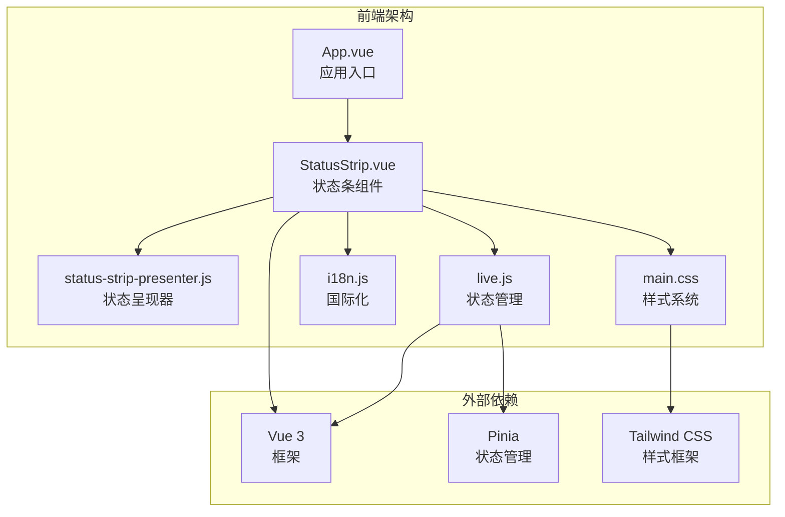

**图表来源**
- [App.vue:1-139](file://frontend/src/App.vue#L1-L139)
- [StatusStrip.vue:1-316](file://frontend/src/components/StatusStrip.vue#L1-L316)
- [live.js:75-846](file://frontend/src/stores/live.js#L75-L846)

### 组件关系图

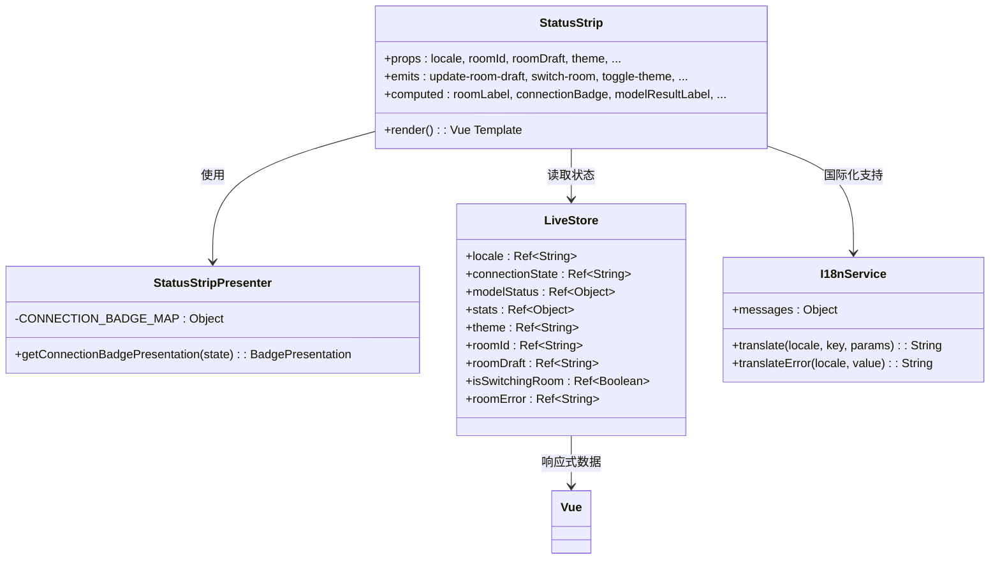

**图表来源**
- [StatusStrip.vue:1-112](file://frontend/src/components/StatusStrip.vue#L1-L112)
- [status-strip-presenter.js:1-35](file://frontend/src/components/status-strip-presenter.js#L1-L35)
- [live.js:75-120](file://frontend/src/stores/live.js#L75-L120)

## 核心组件实现

### StatusStrip 组件重构

StatusStrip 组件经过重构后，采用了全新的双栏布局结构：

#### 左侧连接卡片（主控制区）

左侧卡片作为视觉焦点，承担主要操作职责：

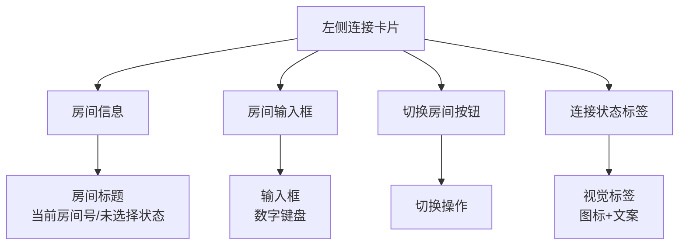

**图表来源**
- [StatusStrip.vue:118-197](file://frontend/src/components/StatusStrip.vue#L118-L197)

#### 右侧状态卡片网格

右侧采用 3 列网格布局，包含三个功能卡片：

1. **评论卡片**：展示评论总数与总事件数
2. **模型卡片**：显示模型名称、结果状态和设置按钮
3. **工具卡片**：整合语言切换和主题切换功能

### 状态呈现器设计

新增的状态呈现器负责将连接状态映射为视觉表现：

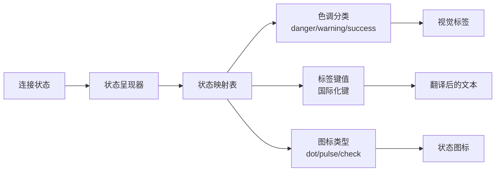

**图表来源**
- [status-strip-presenter.js:1-35](file://frontend/src/components/status-strip-presenter.js#L1-L35)

## 状态管理集成

### Pinia Store 集成

状态条组件通过 Pinia store 获取实时数据：

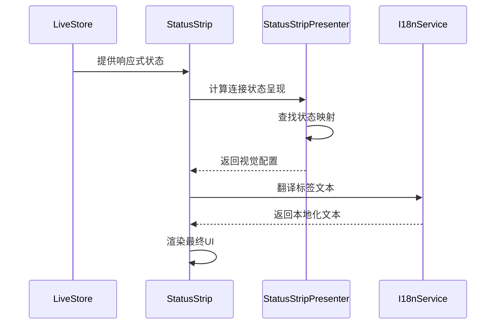

**图表来源**
- [live.js:75-846](file://frontend/src/stores/live.js#L75-L846)
- [StatusStrip.vue:68-88](file://frontend/src/components/StatusStrip.vue#L68-L88)

### 数据流分析

组件的数据流遵循单向数据绑定原则：

1. **状态读取**：组件从 store 读取只读状态
2. **计算属性**：使用 computed 属性处理数据转换
3. **事件发射**：通过 emit 触发用户交互
4. **状态更新**：store 更新响应式状态

## 测试策略

### 测试金字塔

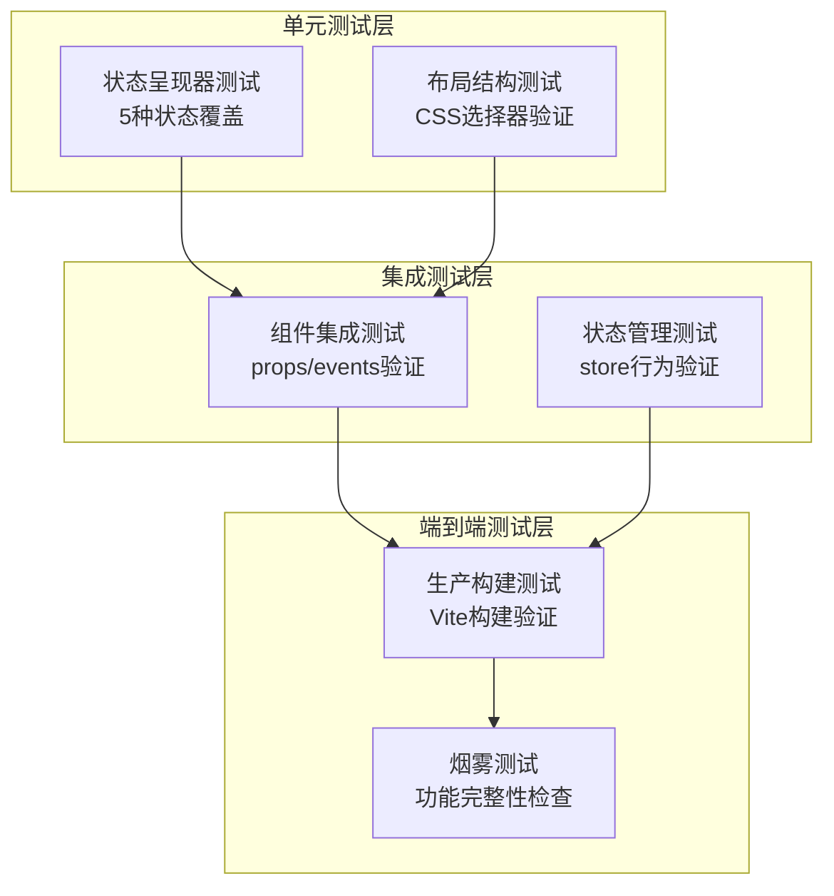

### 关键测试用例

#### 状态呈现器测试

测试覆盖所有连接状态的正确映射：

| 状态 | 预期色调 | 预期标签键 | 预期图标 |
|------|----------|------------|----------|
| idle | danger | status.connectionState.idle | dot |
| connecting | warning | status.connectionState.connecting | pulse |
| live | success | status.connectionState.live | check |
| reconnecting | danger | status.connectionState.reconnecting | dot |
| switching | warning | status.connectionState.switching | pulse |

#### 布局结构测试

验证 CSS Grid 布局的正确实现：

- 左右分栏：`xl:grid-cols-[minmax(0,1.4fr)_minmax(320px,1fr)]`
- 右侧卡片网格：`md:grid-cols-3`
- 移除浮动工具：不包含 `absolute right-5 top-5` 类
- 保持卡片结构：包含 `"中"` 和 `"工具"` 文本

**章节来源**
- [status-strip-presenter.test.mjs:1-50](file://frontend/src/components/status-strip-presenter.test.mjs#L1-L50)
- [status-strip-layout.test.mjs:1-18](file://frontend/src/components/status-strip-layout.test.mjs#L1-L18)

## 视觉设计规范

### 设计系统

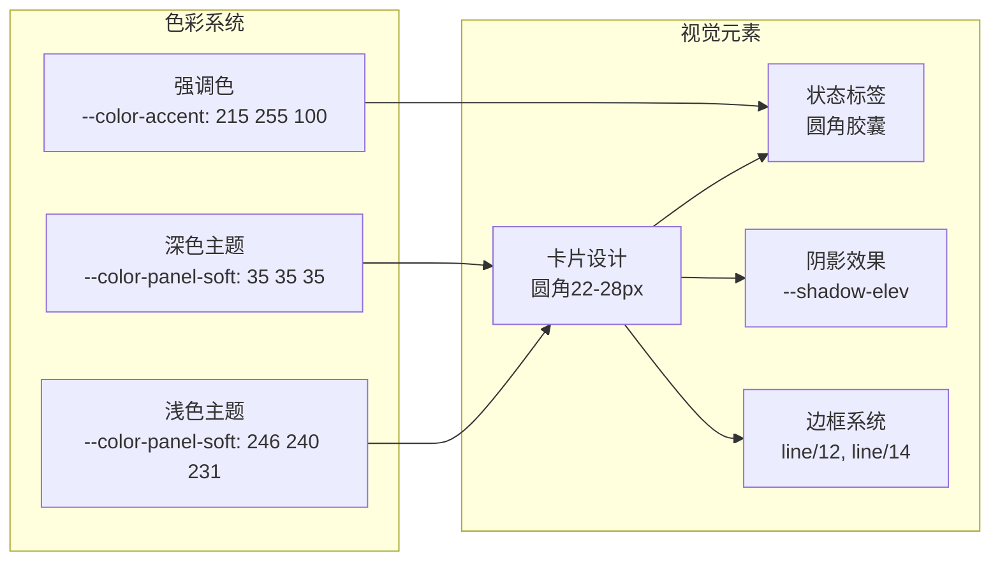

**图表来源**
- [main.css:5-64](file://frontend/src/assets/main.css#L5-L64)
- [StatusStrip.vue:116-119](file://frontend/src/components/StatusStrip.vue#L116-L119)

### 响应式设计

| 断点 | 布局模式 | 特性 |
|------|----------|------|
| xs | 移动端 | 上下堆叠，单列布局 |
| sm | 小屏设备 | 左右分栏，卡片垂直排列 |
| md | 中等屏幕 | 左右分栏，右侧3卡片网格 |
| lg | 大屏设备 | 左右分栏，保持网格布局 |
| xl | 超大屏 | 优化的左右比例 |

### 状态视觉设计

| 状态 | 色彩方案 | 图标类型 | 文本颜色 |
|------|----------|----------|----------|
| idle/reconnecting | 红色系 bg-rose-500/12 | 实心圆点 | text-rose-200 |
| connecting/switching | 黄色系 bg-amber-500/12 | 脉冲动画 | text-amber-200 |
| live | 绿色系 bg-emerald-500/12 | 对勾图标 | text-emerald-300 |

## 性能优化考虑

### 渲染优化

1. **计算属性缓存**：使用 Vue 的 computed 缓存机制避免重复计算
2. **条件渲染**：根据连接状态动态渲染不同的图标和动画
3. **事件防抖**：输入框事件处理使用适当的防抖策略

### 内存管理

1. **组件卸载清理**：确保 EventSource 在组件卸载时正确关闭
2. **状态引用优化**：避免不必要的深层拷贝
3. **样式类动态绑定**：使用对象语法减少模板复杂度

### 构建优化

1. **Tree Shaking**：确保未使用的代码被正确移除
2. **CSS 优化**：Tailwind CSS 的按需生成减少包体积
3. **资源压缩**：生产环境自动启用代码压缩和图片优化

## 实施步骤与里程碑

### 第一阶段：基础设施搭建

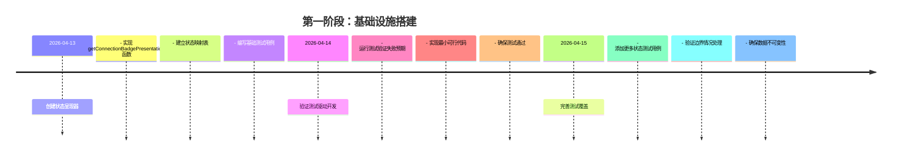

### 第二阶段：组件重构

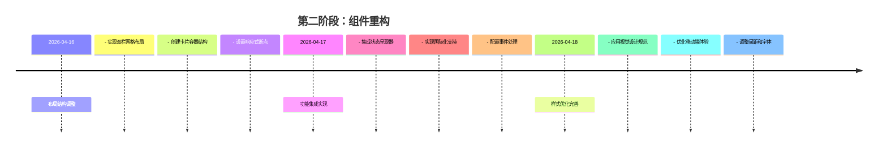

### 第三阶段：质量保证

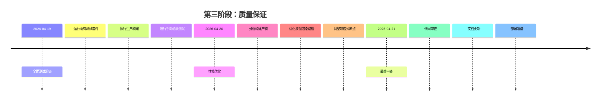

### 关键里程碑

| 里程碑 | 目标完成度 | 时间节点 | 验收标准 |
|--------|------------|----------|----------|
| 基础设施完成 | 100% | 2026-04-15 | 测试驱动开发流程建立 |
| 组件重构完成 | 100% | 2026-04-18 | 双栏布局实现 |
| 质量保证完成 | 100% | 2026-04-21 | 所有测试通过 |
| 项目交付 | 100% | 2026-04-21 | 生产构建成功 |

## 风险评估与应对

### 技术风险

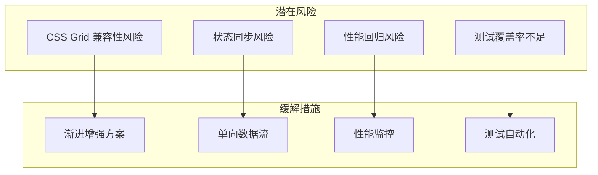

### 风险应对策略

1. **CSS 兼容性风险**：采用渐进增强方案，确保在不支持 Grid 的浏览器中仍能正常显示
2. **状态同步风险**：严格遵循单向数据流原则，避免直接修改 store 状态
3. **性能回归风险**：建立性能基准测试，监控关键指标变化
4. **测试覆盖率不足**：实施 TDD 开发模式，确保每个功能都有对应的测试用例

### 回滚计划

如果在部署后发现问题，将执行以下回滚步骤：

1. **立即回滚**：使用 Git 回退到上一个稳定版本
2. **问题定位**：通过日志和监控系统定位具体问题
3. **修复验证**：在开发环境中复现并修复问题
4. **重新部署**：修复完成后重新部署到生产环境

## 总结与展望

### 项目成果

本次状态条布局重新设计成功实现了以下目标：

1. **视觉层次提升**：通过卡片化设计建立了清晰的信息层级
2. **用户体验改善**：减少了视觉杂乱，提高了信息可读性
3. **技术债务降低**：引入了可测试的状态呈现器，提升了代码质量
4. **维护性增强**：保持了良好的模块分离和单一职责原则

### 技术亮点

- **测试驱动开发**：完整的测试覆盖确保了代码质量
- **设计系统集成**：统一的视觉设计规范提升了产品一致性
- **响应式设计**：适配多种设备和屏幕尺寸
- **性能优化**：合理的架构设计确保了良好的运行性能

### 未来改进方向

1. **交互反馈增强**：可以考虑添加更多的视觉反馈和动画效果
2. **无障碍支持**：进一步完善无障碍访问功能
3. **性能监控**：建立更完善的性能监控和分析系统
4. **组件复用**：探索状态呈现器在其他组件中的复用可能性

这次重构不仅提升了产品的外观和用户体验，更重要的是建立了一套可维护、可扩展的前端架构，为未来的功能迭代奠定了坚实的基础。