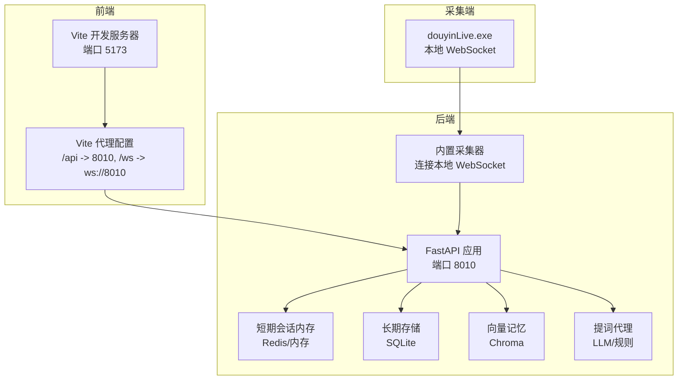
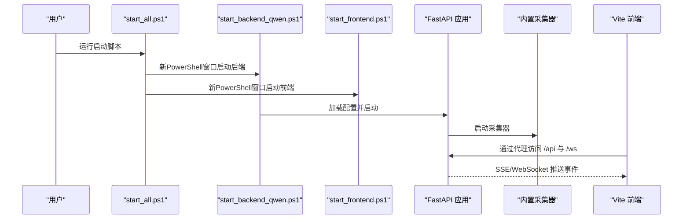
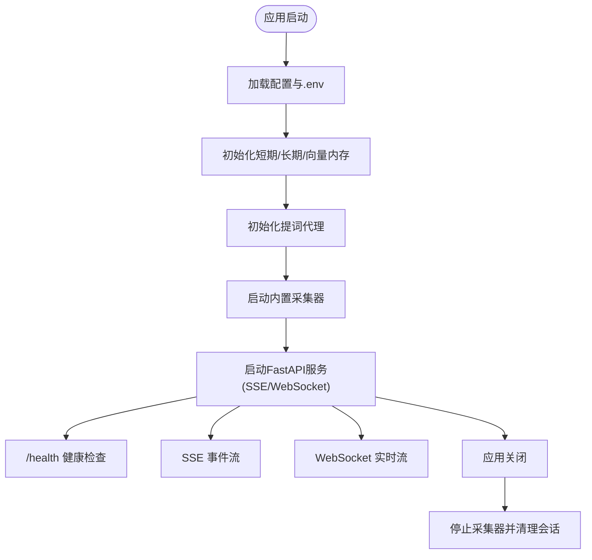
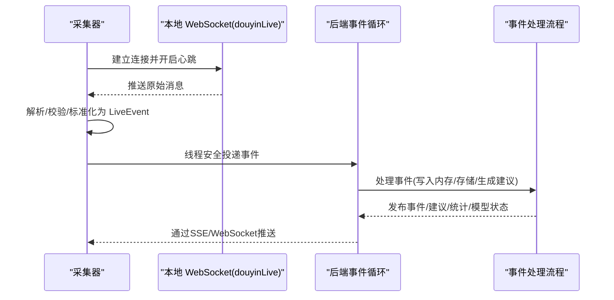
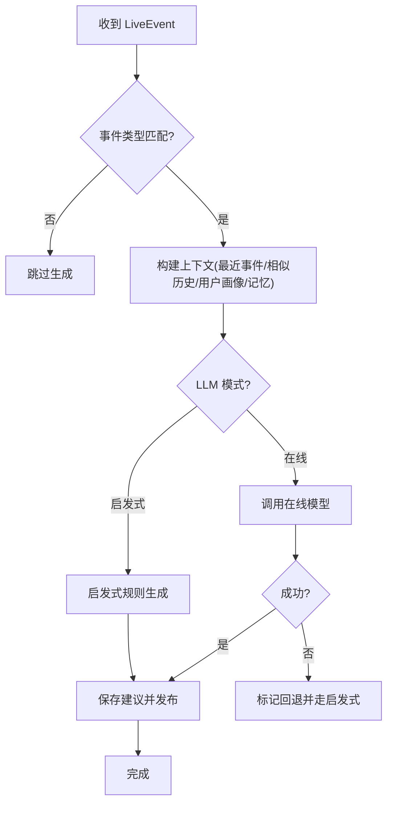
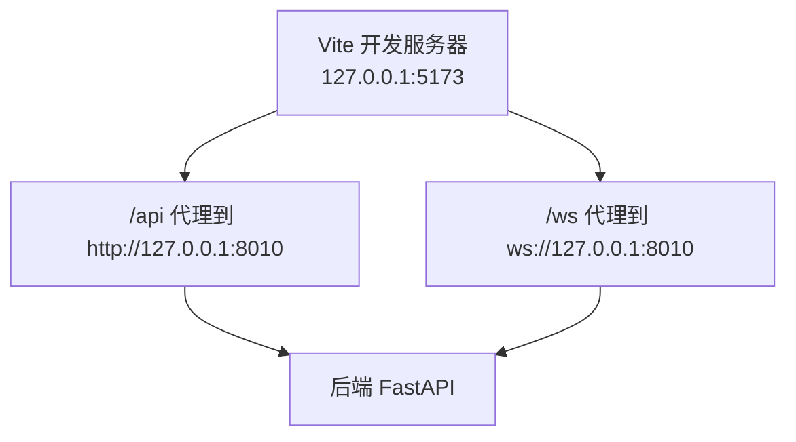
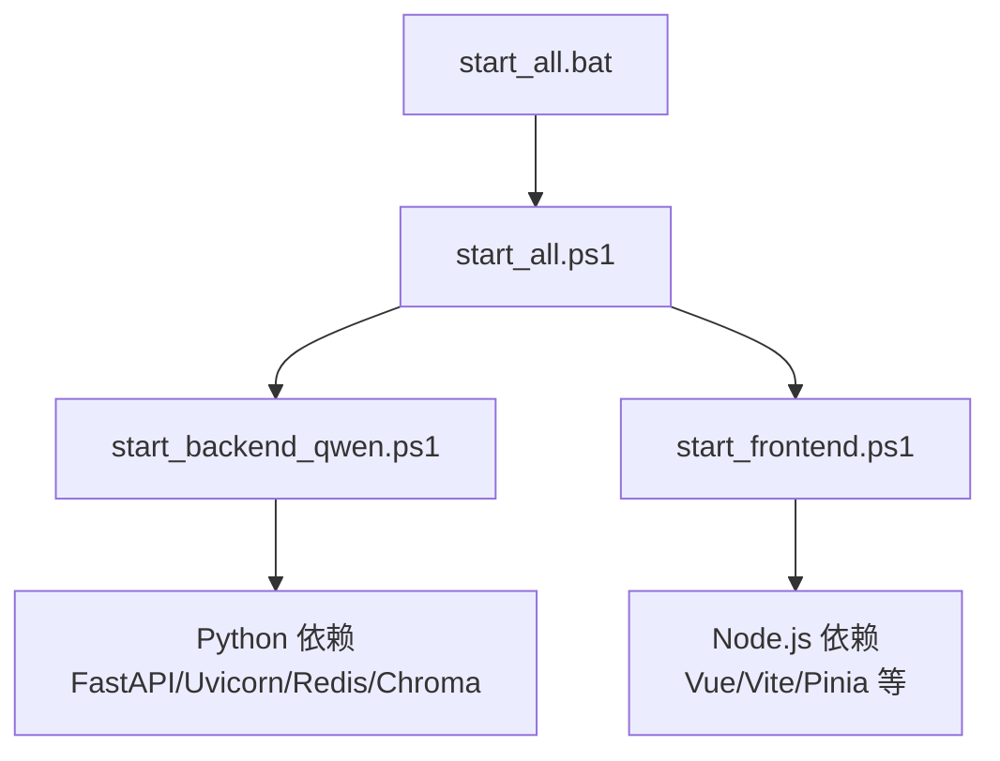

# 启动问题诊断

<cite>
**本文引用的文件**
- [README.md](file://README.md)
- [USAGE.md](file://USAGE.md)
- [requirements.txt](file://requirements.txt)
- [start_all.bat](file://start_all.bat)
- [start_all.ps1](file://start_all.ps1)
- [start_backend_qwen.ps1](file://start_backend_qwen.ps1)
- [start_frontend.ps1](file://start_frontend.ps1)
- [backend/app.py](file://backend/app.py)
- [backend/config.py](file://backend/config.py)
- [backend/services/collector.py](file://backend/services/collector.py)
- [backend/services/agent.py](file://backend/services/agent.py)
- [backend/memory/session_memory.py](file://backend/memory/session_memory.py)
- [frontend/package.json](file://frontend/package.json)
- [frontend/vite.config.js](file://frontend/vite.config.js)
</cite>

## 目录
1. [简介](#简介)
2. [项目结构](#项目结构)
3. [核心组件](#核心组件)
4. [架构总览](#架构总览)
5. [详细组件分析](#详细组件分析)
6. [依赖关系分析](#依赖关系分析)
7. [性能注意事项](#性能注意事项)
8. [故障排除指南](#故障排除指南)
9. [结论](#结论)
10. [附录](#附录)

## 简介
本指南聚焦于DouYin_llm项目的启动问题诊断，覆盖Python依赖安装、Node.js环境、端口占用、环境变量、脚本执行权限、启动顺序、配置文件缺失、日志分析与常见错误解读。目标是帮助你在Windows环境下快速定位并修复启动失败问题。

## 项目结构
项目采用前后端分离架构：
- 后端：FastAPI应用，提供REST/SSE/WebSocket接口，内置采集器连接本地WebSocket。
- 前端：Vite开发服务器，通过代理将/api与/ws转发至后端。
- 工具：Windows可执行采集器，负责从抖音直播抓取实时流并落地成本地WebSocket。

图表来源
- [frontend/vite.config.js:1-23](file://frontend/vite.config.js#L1-L23)
- [backend/app.py:108-127](file://backend/app.py#L108-L127)
- [backend/services/collector.py:54-59](file://backend/services/collector.py#L54-L59)
- [backend/memory/session_memory.py:17-31](file://backend/memory/session_memory.py#L17-L31)

章节来源
- [README.md:32-44](file://README.md#L32-L44)
- [USAGE.md:15-22](file://USAGE.md#L15-L22)

## 核心组件
- 后端入口与生命周期：FastAPI应用在lifespan中启动采集器并在退出时清理资源。
- 配置加载：优先从环境变量与.env读取，提供默认值，确保本地开箱即用。
- 采集器：连接本地WebSocket，标准化事件并投递到后端事件循环。
- 提词代理：根据事件与上下文生成建议，支持在线模型与启发式规则双通道。
- 前端开发服务器：通过代理将前端请求转发至后端，便于联调。

章节来源
- [backend/app.py:108-127](file://backend/app.py#L108-L127)
- [backend/config.py:12-37](file://backend/config.py#L12-L37)
- [backend/services/collector.py:61-79](file://backend/services/collector.py#L61-L79)
- [backend/services/agent.py:23-40](file://backend/services/agent.py#L23-L40)
- [frontend/vite.config.js:10-22](file://frontend/vite.config.js#L10-L22)

## 架构总览
后端启动顺序与关键依赖：
- 启动采集器（本地WebSocket）
- 初始化内存、向量库、LLM代理
- 启动FastAPI服务（SSE/WebSocket）
- 前端通过Vite代理访问后端

图表来源
- [start_all.ps1:11-17](file://start_all.ps1#L11-L17)
- [start_backend_qwen.ps1:11-12](file://start_backend_qwen.ps1#L11-L12)
- [start_frontend.ps1:20-21](file://start_frontend.ps1#L20-L21)
- [frontend/vite.config.js:12-20](file://frontend/vite.config.js#L12-L20)

## 详细组件分析

### 后端启动与生命周期
- 生命周期钩子在应用启动时启动采集器，在关闭时清理会话与采集器。
- 健康检查接口用于确认后端运行状态与当前房间。
- SSE与WebSocket接口用于实时推送事件与建议。

图表来源
- [backend/app.py:108-117](file://backend/app.py#L108-L117)
- [backend/app.py:129-135](file://backend/app.py#L129-L135)
- [backend/app.py:252-271](file://backend/app.py#L252-L271)
- [backend/app.py:274-285](file://backend/app.py#L274-L285)

章节来源
- [backend/app.py:108-127](file://backend/app.py#L108-L127)
- [backend/app.py:129-135](file://backend/app.py#L129-L135)
- [backend/app.py:252-285](file://backend/app.py#L252-L285)

### 采集器连接与事件处理
- 采集器根据配置连接本地WebSocket，解析消息并标准化为LiveEvent。
- 通过线程安全的方式将事件投递到后端事件循环，避免阻塞网络I/O。
- 断线重连与心跳配置可调，便于在不稳定网络下保持连接。

图表来源
- [backend/services/collector.py:118-140](file://backend/services/collector.py#L118-L140)
- [backend/services/collector.py:145-159](file://backend/services/collector.py#L145-L159)
- [backend/app.py:73-102](file://backend/app.py#L73-L102)

章节来源
- [backend/services/collector.py:54-59](file://backend/services/collector.py#L54-L59)
- [backend/services/collector.py:118-188](file://backend/services/collector.py#L118-L188)
- [backend/app.py:73-102](file://backend/app.py#L73-L102)

### LLM与启发式提词
- 提词代理根据事件类型与上下文选择在线模型或启发式规则。
- 在线模型失败时自动回退到启发式，保证稳定性。
- 模型状态通过SSE/WebSocket实时上报，前端据此显示来源标签。

图表来源
- [backend/services/agent.py:105-142](file://backend/services/agent.py#L105-L142)
- [backend/services/agent.py:200-216](file://backend/services/agent.py#L200-L216)
- [backend/services/agent.py:302-437](file://backend/services/agent.py#L302-L437)

章节来源
- [backend/services/agent.py:23-40](file://backend/services/agent.py#L23-L40)
- [backend/services/agent.py:105-142](file://backend/services/agent.py#L105-L142)
- [backend/services/agent.py:302-437](file://backend/services/agent.py#L302-L437)

### 前端开发服务器与代理
- Vite开发服务器默认端口5173，通过代理将/api与/ws转发至后端8010端口。
- 代理同时支持HTTP与WebSocket透传，满足SSE与WebSocket需求。

图表来源
- [frontend/vite.config.js:10-22](file://frontend/vite.config.js#L10-L22)

章节来源
- [frontend/vite.config.js:10-22](file://frontend/vite.config.js#L10-L22)

## 依赖关系分析
- Python依赖：通过requirements.txt声明FastAPI、Uvicorn、Redis、Chroma等。
- Node.js依赖：前端package.json声明Vue、Vite及相关工具链。
- 启动脚本：Windows批处理与PowerShell脚本负责启动顺序与环境检查。

图表来源
- [requirements.txt:1-6](file://requirements.txt#L1-L6)
- [frontend/package.json:11-22](file://frontend/package.json#L11-L22)
- [start_all.bat:5](file://start_all.bat#L5)
- [start_all.ps1:11-17](file://start_all.ps1#L11-L17)
- [start_backend_qwen.ps1:12](file://start_backend_qwen.ps1#L12)
- [start_frontend.ps1:17](file://start_frontend.ps1#L17)

章节来源
- [requirements.txt:1-6](file://requirements.txt#L1-6)
- [frontend/package.json:11-22](file://frontend/package.json#L11-L22)
- [start_all.bat:5](file://start_all.bat#L5)
- [start_all.ps1:11-17](file://start_all.ps1#L11-L17)
- [start_backend_qwen.ps1:12](file://start_backend_qwen.ps1#L12)
- [start_frontend.ps1:17](file://start_frontend.ps1#L17)

## 性能注意事项
- SSE与WebSocket推送：事件量大时注意前端渲染与后端队列积压。
- Redis可选：在需要跨进程共享短期会话时启用，否则使用内存退化。
- 向量检索：Chroma索引规模增大时建议定期重建与优化查询参数。
- LLM调用：合理设置超时与重试，避免阻塞事件处理。

## 故障排除指南

### 1. Python依赖安装问题
- 症状：后端启动报错或导入第三方库失败。
- 检查清单：
  - 确认Python版本符合要求（3.10+，推荐3.11）。
  - 安装requirements.txt中的依赖。
  - 如需Redis/Chroma，确保对应可执行或库可用。
- 修复步骤：
  - 清理并重新安装依赖。
  - 若网络受限，使用国内镜像源。
  - 检查是否有权限问题导致安装失败。

章节来源
- [USAGE.md:15-22](file://USAGE.md#L15-L22)
- [requirements.txt:1-6](file://requirements.txt#L1-L6)

### 2. Node.js环境与前端依赖
- 症状：前端启动时报找不到Node或依赖安装失败。
- 检查清单：
  - 确认Node.js版本满足Vite与ES模块要求。
  - 检查脚本中硬编码的Node路径是否存在。
  - 确认是否已安装前端依赖（node_modules）。
- 修复步骤：
  - 安装Node.js并更新PATH。
  - 执行前端安装命令，或让脚本自动安装。
  - 如使用自定义Node路径，修改脚本中的节点路径。

章节来源
- [USAGE.md:73-87](file://USAGE.md#L73-L87)
- [start_frontend.ps1:7-18](file://start_frontend.ps1#L7-L18)
- [frontend/package.json:11-22](file://frontend/package.json#L11-L22)

### 3. 端口占用冲突
- 症状：后端或前端启动失败，提示端口已被占用。
- 检查清单：
  - 后端默认端口8010，前端默认端口5173。
  - 使用系统工具检查端口占用情况。
- 修复步骤：
  - 修改后端或前端配置中的端口。
  - 关闭占用端口的进程或调整监听地址。

章节来源
- [USAGE.md:118-122](file://USAGE.md#L118-L122)
- [frontend/vite.config.js:11](file://frontend/vite.config.js#L11)
- [backend/config.py:44-45](file://backend/config.py#L44-L45)

### 4. 环境变量配置错误
- 症状：后端无法连接采集器、模型调用失败或数据目录异常。
- 检查清单：
  - 确认.env文件存在且包含必要变量（如ROOM_ID、LLM_MODE、API Key等）。
  - 验证配置优先级：.env > 当前shell > 代码默认值。
  - 检查采集器主机/端口、模型基地址与模型名。
- 修复步骤：
  - 复制示例配置并填写必要字段。
  - 逐项核对变量拼写与取值范围。
  - 重启后端使新配置生效。

章节来源
- [README.md:62-66](file://README.md#L62-L66)
- [backend/config.py:12-37](file://backend/config.py#L12-L37)
- [backend/config.py:46-75](file://backend/config.py#L46-L75)

### 5. Windows PowerShell脚本执行权限问题
- 症状：运行.ps1脚本报错，提示脚本不可用或被阻止。
- 检查清单：
  - 当前执行策略是否禁止脚本运行。
  - 脚本是否被防病毒软件拦截。
- 修复步骤：
  - 临时放宽执行策略（例如使用绕过参数）。
  - 将脚本添加到防病毒白名单。
  - 使用批处理脚本间接调用PowerShell脚本。

章节来源
- [start_all.bat:5](file://start_all.bat#L5)
- [start_all.ps1:1-18](file://start_all.ps1#L1-L18)

### 6. 启动顺序错误
- 症状：前端无法连接后端，或后端未收到事件。
- 检查清单：
  - 采集器是否先于后端启动。
  - 后端是否已监听8010端口。
  - 前端代理是否正确转发到8010端口。
- 修复步骤：
  - 使用封装脚本统一启动，确保顺序正确。
  - 手动启动时先启动采集器与后端，再启动前端。

章节来源
- [USAGE.md:91-114](file://USAGE.md#L91-L114)
- [start_all.ps1:11-17](file://start_all.ps1#L11-L17)
- [frontend/vite.config.js:12-20](file://frontend/vite.config.js#L12-L20)

### 7. 配置文件缺失
- 症状：脚本报错提示缺少.env文件。
- 检查清单：
  - 根目录是否存在.env文件。
  - 是否已复制示例并填写必要字段。
- 修复步骤：
  - 复制示例配置并完善关键变量。
  - 重新运行脚本。

章节来源
- [start_all.ps1:6-9](file://start_all.ps1#L6-L9)
- [start_backend_qwen.ps1:6-9](file://start_backend_qwen.ps1#L6-L9)

### 8. 启动日志分析技巧与常见错误
- 健康检查：访问后端健康接口确认运行状态与当前房间。
- 日志位置：后端标准输出即日志，前端Vite开发日志位于终端。
- 常见错误与含义：
  - “LLM HTTP error”：模型服务返回HTTP错误，检查API Key与网络。
  - “LLM network error”：网络连接失败，检查代理与DNS。
  - “LLM timeout”：请求超时，适当提高超时阈值或优化网络。
  - “LLM returned invalid JSON”：模型返回格式不符，检查模型与提示词。
  - “Douyin collector skipped because ROOM_ID is empty”：采集器被禁用或房间号为空。
  - “Douyin collector disconnected”：采集器断线，检查采集器与网络。
  - “前端打不开/5173端口被占用”：前端端口冲突或依赖未安装。

章节来源
- [backend/app.py:129-135](file://backend/app.py#L129-L135)
- [backend/services/agent.py:334-393](file://backend/services/agent.py#L334-L393)
- [backend/services/collector.py:68-70](file://backend/services/collector.py#L68-L70)
- [backend/services/collector.py:137-139](file://backend/services/collector.py#L137-L139)
- [USAGE.md:226-232](file://USAGE.md#L226-L232)

## 结论
通过本指南，你可以系统性地诊断与修复DouYin_llm项目的启动问题。建议优先检查环境变量与依赖安装，再确认端口与脚本执行权限，最后核对启动顺序与日志输出。遇到复杂问题时，可结合封装脚本与健康检查接口进行分段排查。

## 附录

### A. 启动顺序与端口对照
- 后端：默认监听127.0.0.1:8010
- 前端：默认监听127.0.0.1:5173
- 采集器：默认WebSocket地址ws://127.0.0.1:1088/ws/{ROOM_ID}

章节来源
- [USAGE.md:118-122](file://USAGE.md#L118-L122)
- [backend/config.py:48-49](file://backend/config.py#L48-L49)
- [backend/services/collector.py:55-59](file://backend/services/collector.py#L55-L59)

### B. 关键配置要点
- ROOM_ID：必须与采集器一致。
- LLM_MODE：可选heuristic/qwen/openai。
- API Key：至少配置一种模型鉴权方式。
- 数据目录：确保DATA_DIR/DATABASE_PATH/CHROMA_DIR存在且可写。

章节来源
- [README.md:97-141](file://README.md#L97-L141)
- [backend/config.py:56-75](file://backend/config.py#L56-L75)