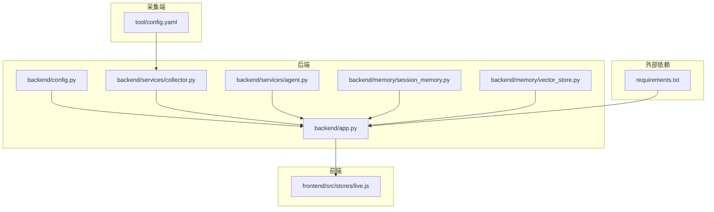
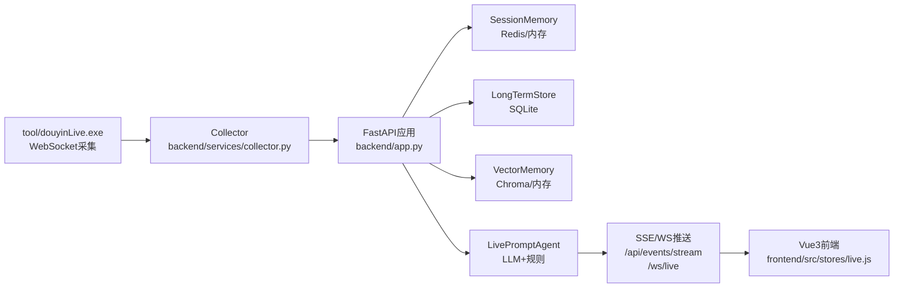
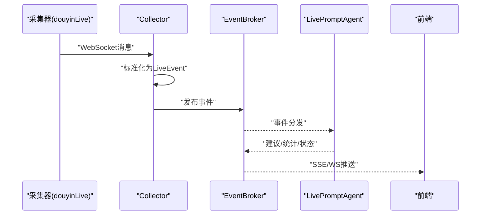
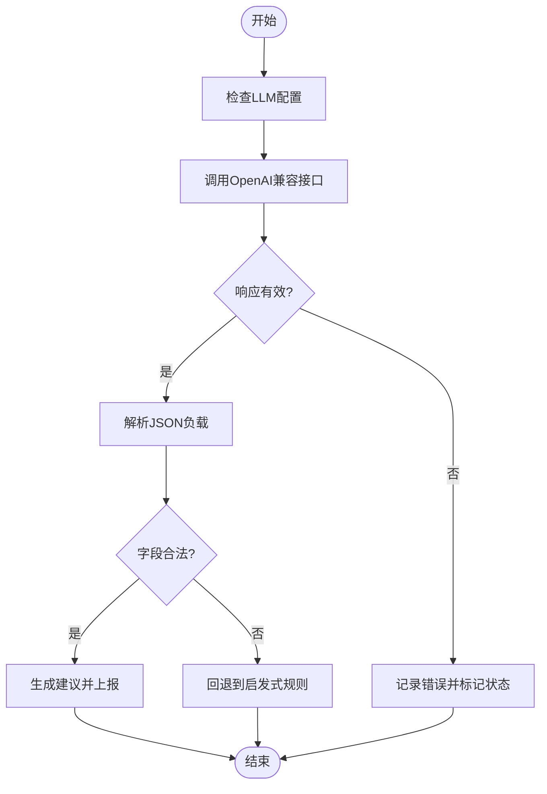
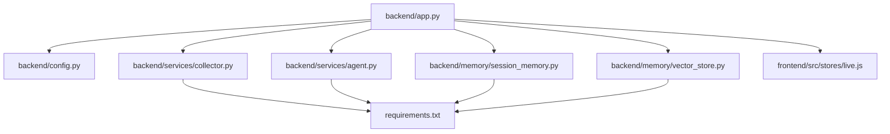

# 常见错误与解决方案

<cite>
**本文引用的文件**
- [README.md](file://README.md)
- [USAGE.md](file://USAGE.md)
- [requirements.txt](file://requirements.txt)
- [backend/app.py](file://backend/app.py)
- [backend/config.py](file://backend/config.py)
- [backend/services/collector.py](file://backend/services/collector.py)
- [backend/services/agent.py](file://backend/services/agent.py)
- [backend/memory/session_memory.py](file://backend/memory/session_memory.py)
- [backend/memory/vector_store.py](file://backend/memory/vector_store.py)
- [frontend/src/stores/live.js](file://frontend/src/stores/live.js)
- [start_all.ps1](file://start_all.ps1)
- [start_frontend.ps1](file://start_frontend.ps1)
- [tool/config.yaml](file://tool/config.yaml)
</cite>

## 目录
1. [简介](#简介)
2. [项目结构](#项目结构)
3. [核心组件](#核心组件)
4. [架构总览](#架构总览)
5. [详细组件分析](#详细组件分析)
6. [依赖关系分析](#依赖关系分析)
7. [性能考量](#性能考量)
8. [故障排查指南](#故障排查指南)
9. [结论](#结论)
10. [附录](#附录)

## 简介
本手册面向DouYin_llm项目的使用者与维护者，聚焦于在启动、运行与配置阶段常见的错误与异常，提供系统化的错误分类、成因分析、解决步骤与预防建议。内容涵盖：
- 启动错误：端口占用、依赖缺失、权限不足
- 运行时错误：WebSocket断开、数据库连接失败、LLM调用超时
- 配置错误：环境变量错误、路径配置问题、API密钥无效
- 快速查找与对照：按症状与错误码快速定位
- 预防性措施与最佳实践

## 项目结构
项目采用前后端分离架构，后端为FastAPI应用，前端为Vue 3应用，采集端为独立的Windows可执行文件。关键模块包括：
- 后端入口与路由：backend/app.py
- 配置加载与解析：backend/config.py
- 采集器：backend/services/collector.py
- 提词代理与LLM调用：backend/services/agent.py
- 记忆与向量检索：backend/memory/session_memory.py、backend/memory/vector_store.py
- 前端事件流订阅：frontend/src/stores/live.js
- 启动脚本：start_all.ps1、start_frontend.ps1
- 采集端配置：tool/config.yaml

**图示来源**
- [backend/app.py:1-285](file://backend/app.py#L1-L285)
- [backend/config.py:1-113](file://backend/config.py#L1-L113)
- [backend/services/collector.py:1-266](file://backend/services/collector.py#L1-L266)
- [backend/services/agent.py:1-496](file://backend/services/agent.py#L1-L496)
- [backend/memory/session_memory.py:1-113](file://backend/memory/session_memory.py#L1-L113)
- [backend/memory/vector_store.py:1-317](file://backend/memory/vector_store.py#L1-L317)
- [frontend/src/stores/live.js:482-515](file://frontend/src/stores/live.js#L482-L515)
- [requirements.txt:1-6](file://requirements.txt#L1-L6)
- [tool/config.yaml:1-16](file://tool/config.yaml#L1-L16)

**章节来源**
- [README.md:32-44](file://README.md#L32-L44)
- [USAGE.md:15-256](file://USAGE.md#L15-L256)

## 核心组件
- 配置系统：集中从环境变量与.env文件加载，提供默认值与解析逻辑，确保本地开箱即用。
- 采集器：连接本地WebSocket，标准化消息为LiveEvent并投递至后端事件循环。
- 提词代理：根据事件类型与上下文选择LLM或启发式规则生成建议，并上报模型状态。
- 记忆与向量：短期会话内存（Redis/内存）、长期存储（SQLite）、向量索引（Chroma/内存回退）。
- 前端事件流：通过SSE与WebSocket接收事件、建议、统计与模型状态。

**章节来源**
- [backend/config.py:40-113](file://backend/config.py#L40-L113)
- [backend/services/collector.py:38-266](file://backend/services/collector.py#L38-L266)
- [backend/services/agent.py:23-496](file://backend/services/agent.py#L23-L496)
- [backend/memory/session_memory.py:17-113](file://backend/memory/session_memory.py#L17-L113)
- [backend/memory/vector_store.py:59-317](file://backend/memory/vector_store.py#L59-L317)
- [frontend/src/stores/live.js:482-515](file://frontend/src/stores/live.js#L482-L515)

## 架构总览

**图示来源**
- [README.md:7-21](file://README.md#L7-L21)
- [backend/app.py:108-285](file://backend/app.py#L108-L285)
- [backend/services/collector.py:118-140](file://backend/services/collector.py#L118-L140)
- [frontend/src/stores/live.js:482-515](file://frontend/src/stores/live.js#L482-L515)

## 详细组件分析

### 启动错误
- 端口占用
  - 现象：后端或前端启动失败，提示端口已被占用。
  - 成因：APP_PORT（默认8010）或前端端口（默认5173）被其他进程占用。
  - 解决步骤：
    - 修改APP_PORT或前端端口，确保唯一性。
    - 使用任务管理器或netstat定位占用进程并释放。
  - 预防：统一在.env中配置端口，避免硬编码冲突。
  - 参考：后端监听端口与前端端口定义。

- 依赖缺失
  - 现象：导入失败或运行时报错找不到模块。
  - 成因：未安装requirements.txt中的依赖。
  - 解决步骤：pip install -r requirements.txt。
  - 预防：每次克隆后先安装依赖，或在CI中固定版本。
  - 参考：依赖清单。

- 权限不足
  - 现象：无法写入数据目录、无法启动采集器。
  - 成因：当前用户对data/、logs/目录无写权限。
  - 解决步骤：授予写权限或切换到管理员权限运行。
  - 预防：首次运行前检查目录权限，必要时预创建目录并赋权。

**章节来源**
- [backend/app.py:119-126](file://backend/app.py#L119-L126)
- [frontend/src/stores/live.js:482-515](file://frontend/src/stores/live.js#L482-L515)
- [requirements.txt:1-6](file://requirements.txt#L1-L6)

### 运行时错误

#### WebSocket断开
- 现象：前端SSE/WS连接断开，状态变为reconnecting或断流。
- 成因：采集器与后端之间的WebSocket断开，或采集器不可达。
- 解决步骤：
  - 确认tool/douyinLive.exe已启动且监听ws://127.0.0.1:1088/ws/{ROOM_ID}。
  - 检查COLLECTOR_HOST/PORT与ROOM_ID配置。
  - 查看后端日志中collector的连接与重连信息。
- 预防：启动采集器后再启动后端；定期检查采集器健康状态。

**图示来源**
- [backend/services/collector.py:118-140](file://backend/services/collector.py#L118-L140)
- [backend/app.py:73-102](file://backend/app.py#L73-L102)
- [frontend/src/stores/live.js:482-515](file://frontend/src/stores/live.js#L482-L515)

**章节来源**
- [backend/services/collector.py:141-181](file://backend/services/collector.py#L141-L181)
- [backend/app.py:252-285](file://backend/app.py#L252-L285)
- [USAGE.md:198-240](file://USAGE.md#L198-L240)

#### 数据库连接失败
- 现象：后端报错无法连接SQLite或无法写入数据。
- 成因：DATABASE_PATH指向的文件或父目录不可写，或路径不存在。
- 解决步骤：
  - 确保DATABASE_PATH存在且可写。
  - 使用settings.ensure_dirs()确保目录存在。
- 预防：首次运行前检查DATA_DIR/DATABASE_PATH，必要时预创建。

**章节来源**
- [backend/config.py:77-83](file://backend/config.py#L77-L83)
- [backend/app.py:24](file://backend/app.py#L24)

#### LLM调用超时/失败
- 现象：模型状态显示fallback或error，建议生成失败。
- 成因：网络异常、API密钥无效、超时、返回格式不符合预期。
- 解决步骤：
  - 检查LLM_MODE、LLM_BASE_URL、LLM_MODEL、LLM_API_KEY/DASHSCOPE_API_KEY。
  - 调整LLM_TIMEOUT_SECONDS，避免过短导致超时。
  - 若失败，系统会自动回退到启发式规则。
- 预防：在.env中正确配置；监控模型状态；必要时切换为启发式模式。

**图示来源**
- [backend/services/agent.py:302-437](file://backend/services/agent.py#L302-L437)
- [backend/config.py:84-104](file://backend/config.py#L84-L104)

**章节来源**
- [backend/services/agent.py:334-393](file://backend/services/agent.py#L334-L393)
- [backend/config.py:57-63](file://backend/config.py#L57-L63)

### 配置错误

#### 环境变量错误
- 现象：后端启动后房间为空、模型状态异常、采集器未启用。
- 成因：.env缺失或关键变量未设置（如ROOM_ID、LLM_MODE、API密钥）。
- 解决步骤：
  - 复制.env.example为.env并填写必要项。
  - 确认COLLECTOR_ENABLED、COLLECTOR_HOST/PORT、APP_HOST/APP_PORT。
- 预防：在start_all.ps1中校验.env是否存在。

**章节来源**
- [USAGE.md:24-48](file://USAGE.md#L24-L48)
- [start_all.ps1:6-9](file://start_all.ps1#L6-L9)
- [backend/config.py:44-75](file://backend/config.py#L44-L75)

#### 路径配置问题
- 现象：数据目录不存在、Chroma目录无法写入。
- 成因：DATA_DIR、DATABASE_PATH、CHROMA_DIR未正确设置或无权限。
- 解决步骤：使用settings.ensure_dirs()确保目录存在；修正权限。
- 预防：首次运行前统一规划数据目录并赋权。

**章节来源**
- [backend/config.py:77-83](file://backend/config.py#L77-L83)

#### API密钥无效
- 现象：HTTP错误、网络错误、超时、返回非JSON。
- 成因：LLM_API_KEY/DASHSCOPE_API_KEY为空或错误。
- 解决步骤：
  - 在.env中设置正确的API密钥。
  - 检查LLM_BASE_URL与模型名匹配。
- 预防：在部署前进行密钥有效性验证。

**章节来源**
- [backend/config.py:60-61](file://backend/config.py#L60-L61)
- [backend/services/agent.py:334-393](file://backend/services/agent.py#L334-L393)

## 依赖关系分析
- 后端应用依赖配置模块、采集器、事件总线、记忆与向量模块、LLM代理。
- 前端通过SSE/WS订阅后端推送。
- 采集器依赖websocket-client与后端事件循环。
- 记忆模块可选依赖Redis与Chroma，无依赖时自动回退。

**图示来源**
- [backend/app.py:13-35](file://backend/app.py#L13-L35)
- [requirements.txt:1-6](file://requirements.txt#L1-L6)

**章节来源**
- [requirements.txt:1-6](file://requirements.txt#L1-L6)

## 性能考量
- 会话窗口与统计：短期事件窗口限制与统计计算影响实时性，建议合理设置窗口大小。
- 向量检索：查询限制与最小分数阈值影响召回质量与时延，建议结合业务调优。
- LLM调用：超时与回退策略平衡稳定性与响应速度，建议根据网络状况调整超时。
- 前端事件流：SSE重连机制与断线恢复提升用户体验，建议关注重连间隔与错误处理。

[本节为通用指导，无需列出具体文件来源]

## 故障排查指南

### 快速查找与对照
- 启动失败
  - 端口占用：检查APP_PORT与前端端口，修改为未占用端口。
  - 依赖缺失：执行pip install -r requirements.txt。
  - 权限不足：赋予data/、logs/写权限。
- 运行异常
  - WebSocket断开：确认采集器运行与ROOM_ID一致。
  - 数据库连接失败：检查DATABASE_PATH与目录权限。
  - LLM调用失败：核对API密钥、URL与超时设置。
- 配置错误
  - .env缺失：复制.env.example并填写必要项。
  - 路径错误：使用settings.ensure_dirs()确保目录存在。
  - 密钥无效：在.env中设置正确密钥并验证。

**章节来源**
- [USAGE.md:198-240](file://USAGE.md#L198-L240)
- [start_all.ps1:6-9](file://start_all.ps1#L6-L9)
- [backend/config.py:77-83](file://backend/config.py#L77-L83)
- [backend/services/agent.py:334-393](file://backend/services/agent.py#L334-L393)

### 常见症状与处理步骤
- 页面打开但无建议
  - 检查采集器是否启动、ROOM_ID是否正确、后端是否重启。
- 顶部显示fallback
  - 检查API密钥、网络可达性、是否触发超时或限流。
- 顶部显示heuristic
  - 检查LLM_MODE是否被设置为heuristic或未正确加载.env。
- 前端打不开
  - 检查start_frontend.ps1是否正常、5173端口占用情况。
- 后端启动但无数据写入
  - 检查采集器是否运行、后端日志是否连接到WebSocket、房间是否有消息。

**章节来源**
- [USAGE.md:200-232](file://USAGE.md#L200-L232)

## 结论
通过规范的配置管理、完善的错误处理与监控、合理的性能调优，DouYin_llm可在本地稳定运行并提供可靠的直播提词能力。建议在团队内建立统一的环境配置模板与启动脚本，持续完善日志与可观测性，以降低故障率并提升诊断效率。

[本节为总结性内容，无需列出具体文件来源]

## 附录

### 错误代码与状态对照
- 模型状态
  - ok：在线模型成功生成
  - fallback：模型失败，回退到规则
  - heuristic：当前仅使用规则
- LLM错误类别
  - http_{code}：HTTP错误码
  - network_error：网络异常
  - timeout：请求超时
  - invalid_json_envelope：响应体非JSON
  - os_error：系统/网络底层错误
  - unexpected_exception：未预期异常
  - missing_content：响应缺少必要字段
  - invalid_json_payload：JSON负载非法
  - invalid_payload_shape：字段缺失或类型不符

**章节来源**
- [backend/services/agent.py:34-70](file://backend/services/agent.py#L34-L70)
- [backend/services/agent.py:334-393](file://backend/services/agent.py#L334-L393)

### 最佳实践建议
- 统一配置管理：使用.env集中管理所有配置，启动脚本校验其存在性。
- 依赖隔离：使用虚拟环境安装Python依赖，避免全局污染。
- 数据目录规划：统一DATA_DIR/DATABASE_PATH/CHROMA_DIR，确保可写权限。
- LLM调优：根据网络状况调整LLM_TIMEOUT_SECONDS，必要时启用启发式模式。
- 观测与日志：关注后端日志与前端SSE状态，及时发现并处理断线与异常。

[本节为通用指导，无需列出具体文件来源]