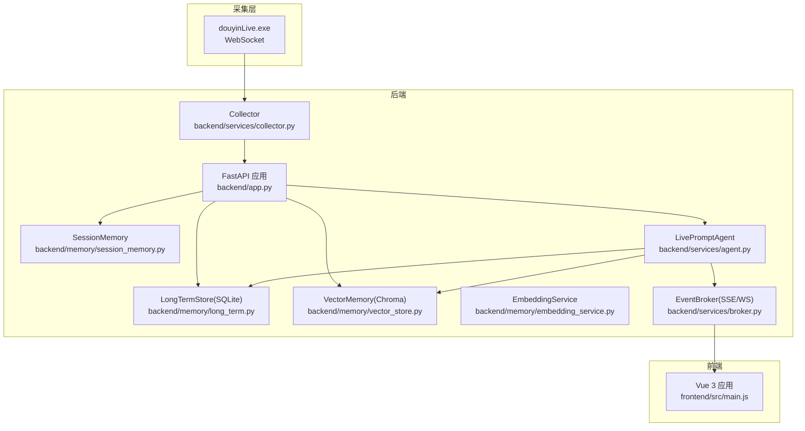
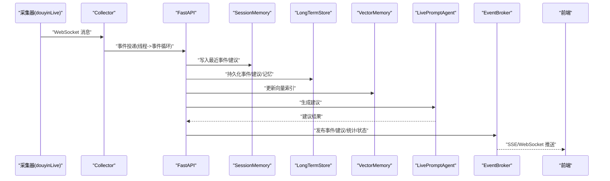
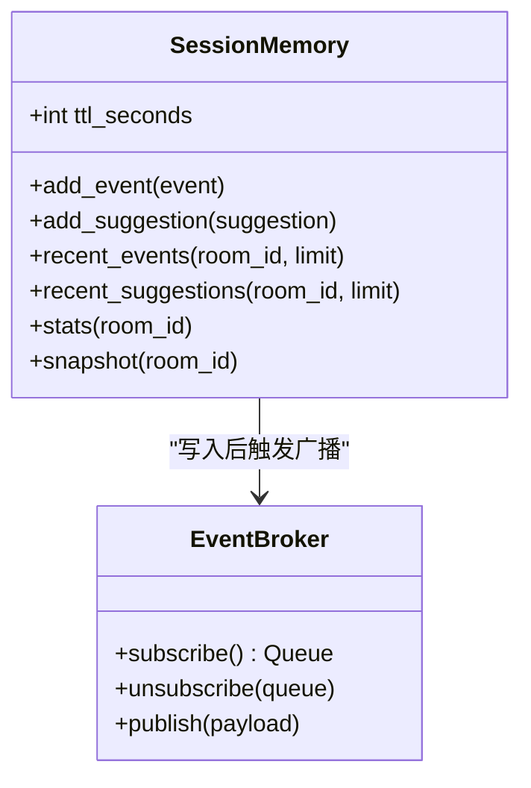
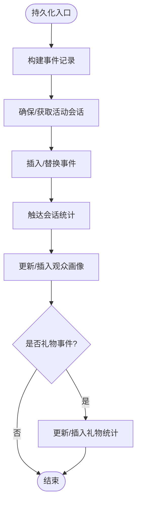
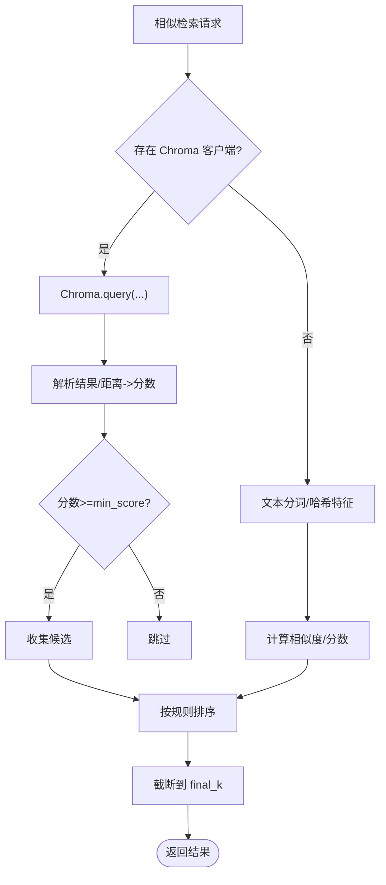
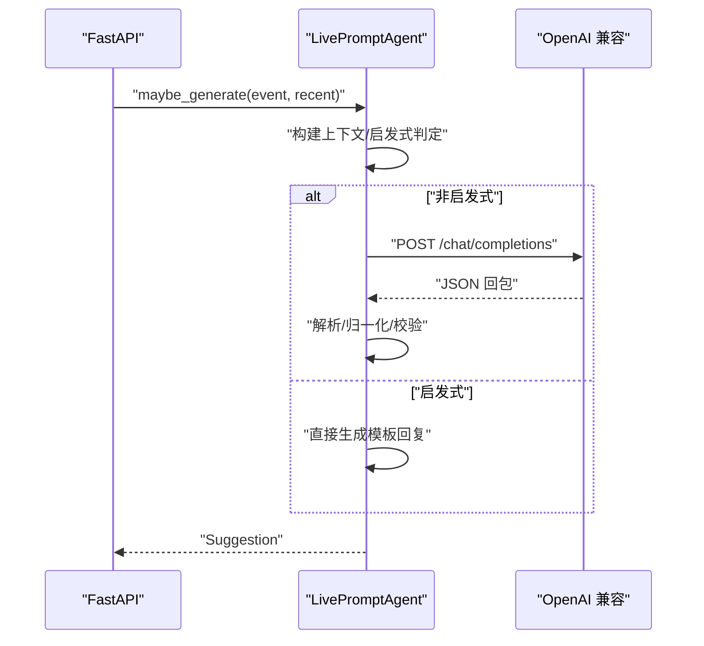
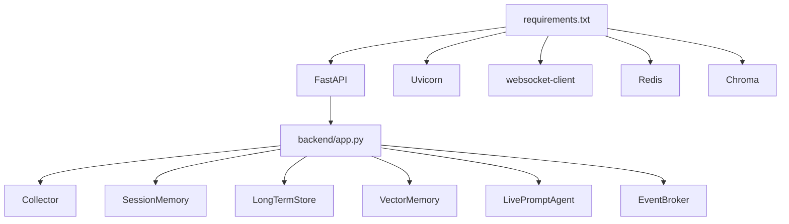

# 性能问题分析

<cite>
**本文引用的文件**
- [backend/app.py](file://backend/app.py)
- [backend/config.py](file://backend/config.py)
- [backend/memory/embedding_service.py](file://backend/memory/embedding_service.py)
- [backend/memory/vector_store.py](file://backend/memory/vector_store.py)
- [backend/memory/session_memory.py](file://backend/memory/session_memory.py)
- [backend/memory/long_term.py](file://backend/memory/long_term.py)
- [backend/services/agent.py](file://backend/services/agent.py)
- [backend/services/broker.py](file://backend/services/broker.py)
- [backend/services/collector.py](file://backend/services/collector.py)
- [backend/schemas/live.py](file://backend/schemas/live.py)
- [frontend/src/main.js](file://frontend/src/main.js)
- [requirements.txt](file://requirements.txt)
- [README.md](file://README.md)
</cite>

## 目录
1. [简介](#简介)
2. [项目结构](#项目结构)
3. [核心组件](#核心组件)
4. [架构总览](#架构总览)
5. [详细组件分析](#详细组件分析)
6. [依赖分析](#依赖分析)
7. [性能考量](#性能考量)
8. [故障排查指南](#故障排查指南)
9. [结论](#结论)
10. [附录](#附录)

## 简介
本指南聚焦于 DouYin_llm 项目的性能问题分析与优化，围绕以下目标展开：
- 内存泄漏的识别与定位：Python 内存监控、前端内存泄漏检测、数据库连接池管理
- CPU 占用过高的排查：LLM 推理优化、事件处理瓶颈、向量检索性能
- 响应延迟问题：网络延迟、数据库查询优化、缓存策略调整
- 性能监控工具使用：Python cProfile、Chrome DevTools、数据库性能分析
- 最佳实践与配置调优：降低资源占用、提升吞吐与稳定性

## 项目结构
项目采用三层架构：采集端（本地可执行文件）→ 后端（FastAPI）→ 前端（Vue 3）。后端通过 Collector 接收实时事件，经 SessionMemory/LongTermStore/VectorMemory 处理，再由 LivePromptAgent 生成建议并通过 SSE/WebSocket 推送至前端。



**图表来源**
- [README.md:7-17](file://README.md#L7-L17)
- [backend/app.py:108-127](file://backend/app.py#L108-L127)
- [backend/services/collector.py:38-53](file://backend/services/collector.py#L38-L53)
- [backend/services/broker.py:10-21](file://backend/services/broker.py#L10-L21)
- [backend/memory/session_memory.py:17-31](file://backend/memory/session_memory.py#L17-L31)
- [backend/memory/long_term.py:44-54](file://backend/memory/long_term.py#L44-L54)
- [backend/memory/vector_store.py:59-84](file://backend/memory/vector_store.py#L59-L84)
- [backend/memory/embedding_service.py:18-24](file://backend/memory/embedding_service.py#L18-L24)
- [backend/services/agent.py:23-35](file://backend/services/agent.py#L23-L35)
- [frontend/src/main.js:6-16](file://frontend/src/main.js#L6-L16)

**章节来源**
- [README.md:32-44](file://README.md#L32-L44)
- [backend/app.py:108-127](file://backend/app.py#L108-L127)

## 核心组件
- Collector：负责与本地采集器建立 WebSocket 连接，解析消息为 LiveEvent，并投递到后端事件循环
- FastAPI 应用：统一入口，注册路由、中间件与生命周期钩子，协调各服务
- SessionMemory：短期会话内存，优先使用 Redis，否则回退到进程内队列
- LongTermStore：SQLite 持久化，维护事件、建议、观众画像、会话、记忆与笔记
- VectorMemory：Chroma 向量库，支持相似检索与回排，降级为内存索引
- EmbeddingService：本地/云端嵌入，失败时回退哈希函数
- LivePromptAgent：LLM/启发式双通道生成建议，记录模型状态
- EventBroker：SSE/WebSocket 广播器

**章节来源**
- [backend/services/collector.py:38-53](file://backend/services/collector.py#L38-L53)
- [backend/app.py:27-35](file://backend/app.py#L27-L35)
- [backend/memory/session_memory.py:17-31](file://backend/memory/session_memory.py#L17-L31)
- [backend/memory/long_term.py:44-54](file://backend/memory/long_term.py#L44-L54)
- [backend/memory/vector_store.py:59-84](file://backend/memory/vector_store.py#L59-L84)
- [backend/memory/embedding_service.py:18-24](file://backend/memory/embedding_service.py#L18-L24)
- [backend/services/agent.py:23-35](file://backend/services/agent.py#L23-L35)
- [backend/services/broker.py:10-21](file://backend/services/broker.py#L10-L21)

## 架构总览
后端通过 Collector 接收实时事件，写入 SessionMemory 与 LongTermStore，同时更新 VectorMemory；随后由 Agent 基于上下文生成建议，通过 EventBroker 推送至前端。该链路涉及多处潜在性能瓶颈：事件循环阻塞、向量检索、LLM 推理、数据库事务与索引、前端渲染与订阅队列。



**图表来源**
- [backend/services/collector.py:182-188](file://backend/services/collector.py#L182-L188)
- [backend/app.py:73-102](file://backend/app.py#L73-L102)
- [backend/services/broker.py:28-39](file://backend/services/broker.py#L28-L39)
- [frontend/src/main.js:12-16](file://frontend/src/main.js#L12-L16)

## 详细组件分析

### 事件处理与内存管理（SessionMemory）
- SessionMemory 使用双栈结构（deque）保存最近事件与建议，上限分别为 120 与 40；当配置 Redis 时，使用 lpush/ltrim/expire 控制容量与 TTL
- 优点：内存占用可控，适合短期上下文
- 潜在风险：大量并发订阅导致队列堆积，需关注 EventBroker 队列满与清理逻辑



**图表来源**
- [backend/memory/session_memory.py:17-113](file://backend/memory/session_memory.py#L17-L113)
- [backend/services/broker.py:10-39](file://backend/services/broker.py#L10-L39)

**章节来源**
- [backend/memory/session_memory.py:17-113](file://backend/memory/session_memory.py#L17-L113)
- [backend/services/broker.py:10-39](file://backend/services/broker.py#L10-L39)

### 长期存储与数据库连接（LongTermStore）
- 使用 SQLite，连接工厂自定义 Connection 子类，退出时自动关闭
- 初始化阶段创建多张表与索引，覆盖事件、建议、观众画像、礼物、会话、笔记、记忆等
- 事务密集写入：事件持久化、会话触达、观众画像与礼物聚合、记忆更新均在事务内完成
- 索引策略：对房间、时间、事件类型、会话等字段建立复合索引，有助于查询与聚合



**图表来源**
- [backend/memory/long_term.py:454-488](file://backend/memory/long_term.py#L454-L488)
- [backend/memory/long_term.py:323-358](file://backend/memory/long_term.py#L323-L358)
- [backend/memory/long_term.py:360-404](file://backend/memory/long_term.py#L360-L404)
- [backend/memory/long_term.py:406-436](file://backend/memory/long_term.py#L406-L436)

**章节来源**
- [backend/memory/long_term.py:44-54](file://backend/memory/long_term.py#L44-L54)
- [backend/memory/long_term.py:63-187](file://backend/memory/long_term.py#L63-L187)
- [backend/memory/long_term.py:216-229](file://backend/memory/long_term.py#L216-L229)

### 向量检索与嵌入（VectorMemory 与 EmbeddingService）
- VectorMemory 支持两种模式：Chroma 客户端与内存回退
- 相似检索：先尝试 Chroma 查询，失败则回退到内存索引；支持按房间过滤与阈值/排序
- EmbeddingService：支持本地（SentenceTransformers）与云端（OpenAI 兼容）嵌入，异常时回退哈希函数
- 参数敏感：batch_size、维度、查询 limit、min_score、final_k 等直接影响性能



**图表来源**
- [backend/memory/vector_store.py:172-231](file://backend/memory/vector_store.py#L172-L231)
- [backend/memory/vector_store.py:257-316](file://backend/memory/vector_store.py#L257-L316)
- [backend/memory/embedding_service.py:28-48](file://backend/memory/embedding_service.py#L28-L48)

**章节来源**
- [backend/memory/vector_store.py:59-84](file://backend/memory/vector_store.py#L59-L84)
- [backend/memory/vector_store.py:172-231](file://backend/memory/vector_store.py#L172-L231)
- [backend/memory/vector_store.py:257-316](file://backend/memory/vector_store.py#L257-L316)
- [backend/memory/embedding_service.py:18-24](file://backend/memory/embedding_service.py#L18-L24)
- [backend/memory/embedding_service.py:65-73](file://backend/memory/embedding_service.py#L65-L73)
- [backend/memory/embedding_service.py:75-101](file://backend/memory/embedding_service.py#L75-L101)

### LLM 推理与模型状态（LivePromptAgent）
- 双通道：优先 OpenAI 兼容接口，失败回退启发式规则
- 上下文构建：结合最近事件、相似历史、用户画像与观众记忆
- 错误处理：HTTP/网络/超时/JSON 解析/OS 错误均有分支处理，并记录状态
- 性能要点：温度、最大 token、超时、系统提示词长度与复杂度都会影响时延与资源占用



**图表来源**
- [backend/services/agent.py:105-142](file://backend/services/agent.py#L105-L142)
- [backend/services/agent.py:200-217](file://backend/services/agent.py#L200-L217)
- [backend/services/agent.py:302-437](file://backend/services/agent.py#L302-L437)

**章节来源**
- [backend/services/agent.py:23-35](file://backend/services/agent.py#L23-L35)
- [backend/services/agent.py:83-103](file://backend/services/agent.py#L83-L103)
- [backend/services/agent.py:302-437](file://backend/services/agent.py#L302-L437)

### 采集与事件循环（Collector）
- Collector 在独立线程中维护 WebSocket 连接，断线重连与 ping 机制
- 通过 asyncio.run_coroutine_threadsafe 将事件投递到后端事件循环，避免阻塞采集线程
- 潜在风险：消息积压、异常未捕获导致线程崩溃、重连风暴

```mermaid
sequenceDiagram
participant WS as "WebSocket"
participant COL as "Collector"
participant LOOP as "事件循环"
COL->>WS : "建立连接/心跳"
WS-->>COL : "消息"
COL->>COL : "解析/标准化"
COL->>LOOP : "run_coroutine_threadsafe(handler)"
LOOP-->>COL : "回调日志"
```

**图表来源**
- [backend/services/collector.py:118-140](file://backend/services/collector.py#L118-L140)
- [backend/services/collector.py:182-196](file://backend/services/collector.py#L182-L196)

**章节来源**
- [backend/services/collector.py:38-53](file://backend/services/collector.py#L38-L53)
- [backend/services/collector.py:118-140](file://backend/services/collector.py#L118-L140)
- [backend/services/collector.py:182-196](file://backend/services/collector.py#L182-L196)

## 依赖分析
- Python 依赖：FastAPI、Uvicorn、websocket-client、Redis、Chroma
- 关键耦合点：Collector 与事件循环、Agent 与向量/数据库、Broker 与前端订阅
- 外部依赖风险：Chroma 不可用时回退内存索引；Redis 不可用时 SessionMemory 回退内存；LLM 不可用时回退启发式



**图表来源**
- [requirements.txt:1-6](file://requirements.txt#L1-L6)
- [backend/app.py:27-35](file://backend/app.py#L27-L35)

**章节来源**
- [requirements.txt:1-6](file://requirements.txt#L1-L6)
- [backend/app.py:27-35](file://backend/app.py#L27-L35)

## 性能考量

### 内存泄漏识别与定位
- Python 内存监控
  - 使用 tracemalloc/heaptrack/pympler 定位对象增长；观察事件循环中队列堆积、向量索引缓存、嵌入模型实例
  - 关注点：EmbeddingService 的本地模型实例是否重复创建；VectorMemory 的 _event_items/_memory_items 是否越界；SessionMemory 的 Redis/内存队列是否清理及时
- 前端内存泄漏检测
  - Chrome DevTools Memory 面板：堆快照对比、 Allocation instrumentation on timeline；检查事件流订阅、状态存储（Pinia）、组件销毁
  - 关注点：SSE/WebSocket 订阅未释放、事件列表渲染、ViewerWorkbench 组件长列表
- 数据库连接池管理
  - SQLite：LongTermStore 使用自定义 Connection 子类并在退出时关闭；建议避免在高频路径中频繁创建连接
  - Redis：SessionMemory 使用连接池（from_url），注意 TTL 与连接复用；监控连接数与命令耗时

**章节来源**
- [backend/memory/embedding_service.py:50-63](file://backend/memory/embedding_service.py#L50-L63)
- [backend/memory/vector_store.py:60-84](file://backend/memory/vector_store.py#L60-L84)
- [backend/memory/session_memory.py:29-31](file://backend/memory/session_memory.py#L29-L31)
- [backend/memory/long_term.py:36-42](file://backend/memory/long_term.py#L36-L42)

### CPU 占用过高排查
- LLM 推理优化
  - 降低温度与最大 token；缩短系统提示词；启用/优化缓存（LLM 返回内容可缓存于 Redis）
  - 失败回退路径：确保启发式快速返回，减少等待
- 事件处理瓶颈
  - Collector：检查 run_coroutine_threadsafe 回调异常日志；避免在 handler 中做重 IO
  - FastAPI：路由与中间件链路；SSE/WebSocket 广播是否阻塞
- 向量检索性能
  - 调整查询 limit/min_score/final_k；批量嵌入 batch_size；云端嵌入超时与重试策略
  - 索引重建：定期重建 Chroma 索引，清理无效文档

**章节来源**
- [backend/services/agent.py:302-437](file://backend/services/agent.py#L302-L437)
- [backend/services/collector.py:182-196](file://backend/services/collector.py#L182-L196)
- [backend/memory/vector_store.py:172-231](file://backend/memory/vector_store.py#L172-L231)
- [backend/config.py:64-76](file://backend/config.py#L64-L76)

### 响应延迟分析
- 网络延迟
  - LLM/嵌入接口超时与重试；采集器 ping 间隔与断线重连延迟
- 数据库查询优化
  - 确保索引有效；避免 N+1 查询；批量写入与事务合并
- 缓存策略调整
  - Redis 缓存最近事件/建议；向量索引缓存热点查询；浏览器端事件流缓存

**章节来源**
- [backend/config.py:50-51](file://backend/config.py#L50-L51)
- [backend/config.py:62-63](file://backend/config.py#L62-L63)
- [backend/config.py:68-69](file://backend/config.py#L68-L69)
- [backend/memory/long_term.py:216-229](file://backend/memory/long_term.py#L216-L229)

### 性能监控工具使用
- Python
  - cProfile/Py-Spy：定位慢函数与阻塞点；查看事件循环与 Agent 推理路径
  - 日志级别：INFO/WARNING/ERROR 分级，便于快速定位异常
- 前端
  - Chrome DevTools Performance/Network/Memory；SSE/WebSocket 延迟与帧率
- 数据库
  - SQLite：EXPLAIN QUERY PLAN 分析慢查询；监控 WAL/Journal 模式与锁竞争

**章节来源**
- [backend/app.py:25](file://backend/app.py#L25)
- [backend/services/agent.py:330-393](file://backend/services/agent.py#L330-L393)

## 故障排查指南

### 内存问题
- 症状：内存持续上涨、GC 压力增大
- 排查步骤
  - 检查 VectorMemory 的 _event_items/_memory_items 是否越界（已限制长度）
  - 确认 EmbeddingService 的本地模型实例是否重复初始化
  - 查看 EventBroker 队列是否堆积且未清理
- 处置建议
  - 限制查询 limit 与 final_k；降低 batch_size；启用 Redis 缓存

**章节来源**
- [backend/memory/vector_store.py:160-162](file://backend/memory/vector_store.py#L160-L162)
- [backend/memory/vector_store.py:245-247](file://backend/memory/vector_store.py#L245-L247)
- [backend/memory/embedding_service.py:50-63](file://backend/memory/embedding_service.py#L50-L63)
- [backend/services/broker.py:31-39](file://backend/services/broker.py#L31-L39)

### CPU 高占用
- 症状：CPU 占用飙升、响应变慢
- 排查步骤
  - LLM 推理：检查超时、失败回退路径、系统提示词长度
  - 向量检索：调整查询参数、批量大小、索引有效性
  - 事件循环：Collector 投递是否阻塞、handler 是否同步重 IO
- 处置建议
  - 降低并发订阅；限流 SSE/WebSocket；优化嵌入与检索参数

**章节来源**
- [backend/services/agent.py:302-437](file://backend/services/agent.py#L302-L437)
- [backend/memory/vector_store.py:172-231](file://backend/memory/vector_store.py#L172-L231)
- [backend/services/collector.py:182-196](file://backend/services/collector.py#L182-L196)

### 响应延迟
- 症状：SSE/WebSocket 延迟、接口超时
- 排查步骤
  - LLM/嵌入超时与重试；采集器断线重连；数据库事务与索引
- 处置建议
  - 调整 LLM 超时与最大 token；优化索引；启用 Redis 缓存

**章节来源**
- [backend/config.py:62-63](file://backend/config.py#L62-L63)
- [backend/config.py:68-69](file://backend/config.py#L68-L69)
- [backend/memory/long_term.py:216-229](file://backend/memory/long_term.py#L216-L229)

### 数据库连接问题
- 症状：写入卡顿、事务长时间持有锁
- 排查步骤
  - 检查 Journal 模式与锁竞争；确认连接在退出时关闭
- 处置建议
  - 使用 TRUNCATE 模式；减少长事务；批量写入

**章节来源**
- [backend/memory/long_term.py:50-54](file://backend/memory/long_term.py#L50-L54)
- [backend/memory/long_term.py:36-42](file://backend/memory/long_term.py#L36-L42)

## 结论
DouYin_llm 的性能问题主要集中在事件处理链路的多个环节：采集线程与事件循环交互、向量检索与嵌入、LLM 推理、数据库事务与索引、前端订阅与渲染。通过合理配置参数、启用缓存、优化索引与批处理、加强监控与日志分级，可显著降低内存与 CPU 占用，改善响应延迟。

## 附录

### 关键配置项与调优建议
- LLM 推理
  - 温度、最大 token、超时；系统提示词长度与复杂度
- 向量检索
  - 查询 limit、min_score、final_k；批量嵌入 batch_size；云端嵌入超时
- 会话与缓存
  - SessionMemory TTL；Redis 缓存策略；SSE/WebSocket 订阅限流
- 数据库
  - 索引有效性；事务批量化；WAL/Journal 模式

**章节来源**
- [backend/config.py:61-76](file://backend/config.py#L61-L76)
- [backend/config.py:106-110](file://backend/config.py#L106-L110)
- [backend/memory/session_memory.py:24-31](file://backend/memory/session_memory.py#L24-L31)
- [backend/memory/long_term.py:216-229](file://backend/memory/long_term.py#L216-L229)